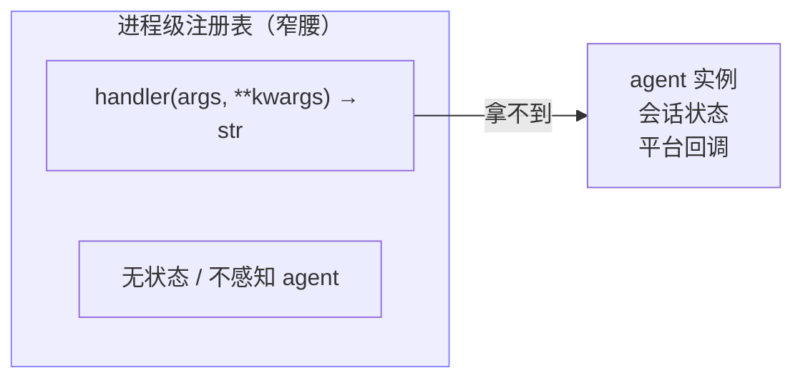
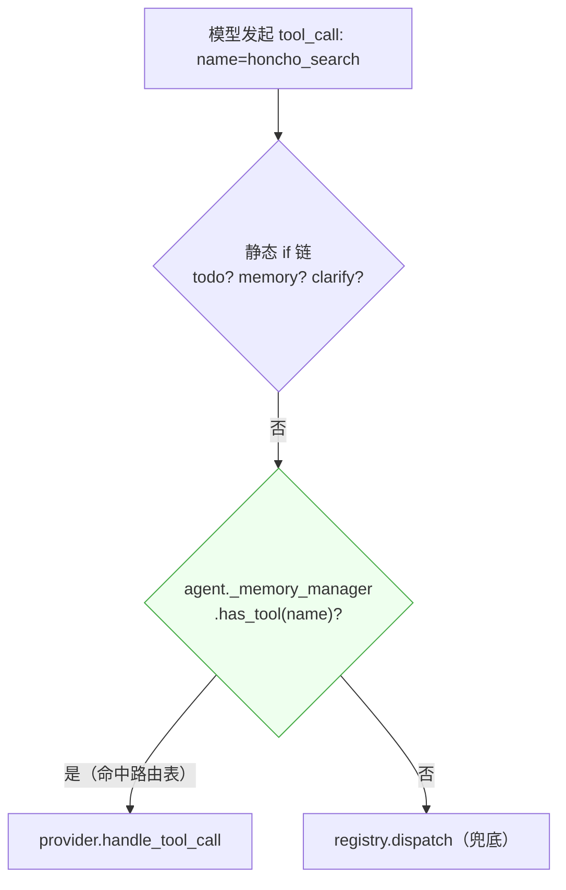
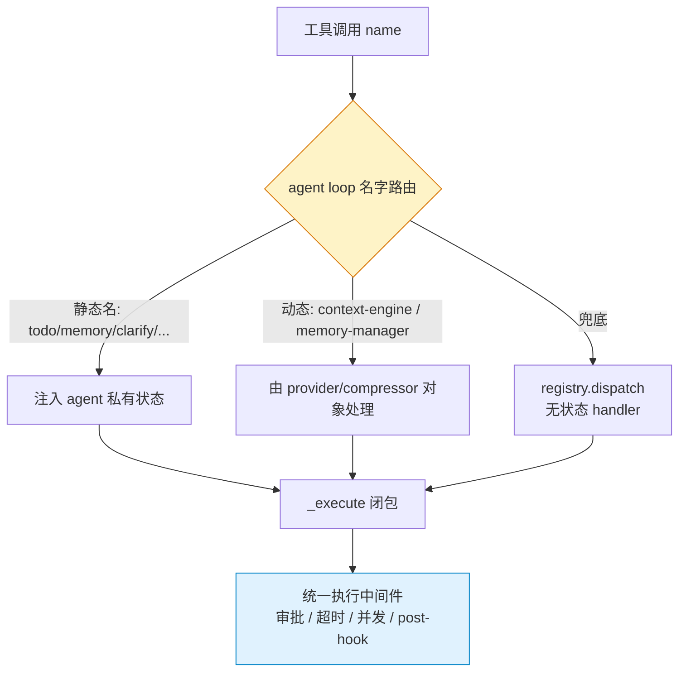

# 第一章　工具系统的分发架构

工具（tool）是智能体能"做事"的途径。一个自然的问题是：**所有工具是不是都通过同一个函数被调用？**
在 Hermes Agent 中，答案是否定的。工具调用存在两条截然不同的分发路径，而这一分叉并非历史包袱，
而是四个硬约束共同逼出的设计边界。

本章先建立"注册表"这一核心概念，再揭示两条分发路径，最后解释为何某些工具"注册表拿不到、也不应该拿到"。

---

## 1.1 注册表与"窄腰"

Hermes 的工具注册表（`tools/registry.py`）是一个**进程级、无状态、在 import 时填充**的分发表。
它的核心数据结构是 `ToolEntry`，每个条目记录：工具名、所属 toolset、schema、handler 与 check_fn。

```python
registry.register(
    name="read_preview",
    toolset="terminal",
    schema=READ_PREVIEW_SCHEMA,
    handler=lambda args, **kw: read_preview_tool(...),
    check_fn=check_read_preview_requirements,
    emoji="🔍",
)
```

注册表的 handler 签名被刻意固定为 `handler(args: dict, **kwargs) -> str`——**只吃基本类型、只吐 JSON 字符串**，
绝不携带智能体实例。这正是它被称为"窄腰（narrow waist）"的原因：它定义了一个最小、最普适的契约，
让"存在哪些工具"这件事能在没有具体智能体实例时就被回答。

这一点至关重要，因为系统提示词的组装、API 工具 schema 的收集（`get_tool_definitions()`）发生在
进程启动和每个智能体初始化时，需要一个与具体会话无关的全局事实源。



> **核心约束①**：注册表是无状态全局表。它的"窄"是刻意的——任何想往 handler 里塞智能体状态的尝试，都会污染这个窄腰。

---

## 1.2 两条分发路径：注册表 vs 智能体级拦截

当一个工具调用到达执行器（`agent/tool_executor.py`）时，它并非无条件落入 `handle_function_call()`。
执行器先做一连串名字匹配，只有匹配不上的才"兜底"交给注册表：

```python
if function_name == "todo":           # ← 智能体级，先判
    ...
elif function_name == "memory":
    ...
elif function_name == "read_preview":
    ...
elif agent._memory_manager.has_tool(function_name):  # 动态判定
    ...
else:                                  # ← 兜底
    handle_function_call(...) → registry.dispatch()
```

这就是**两条分发路径**的由来：

| 路径 | 谁负责 | 服务什么工具 | 典型例子 |
|------|--------|------------|---------|
| 智能体级拦截 | agent loop（`tool_executor.py`） | 需要 agent 私有状态的工具 | `todo`、`memory`、`clarify`、`delegate_task`、`read_preview` |
| 注册表分发 | `handle_function_call` → `registry.dispatch` | 无状态、普适的工具 | `terminal`、`read_file`、`web_search` |

被拦截的工具全部需要"注册表拿不到的东西"：

| 工具 | 需要智能体的什么 |
|------|----------------|
| `todo` | `agent._todo_store`（本会话待办） |
| `memory` | `agent._memory_store` + `agent._memory_manager` |
| `session_search` | `agent._get_session_db_for_recall()`（本会话 SQLite） |
| `clarify` | `agent.clarify_callback`（CLI 内联提问 / gateway 发审批卡片） |
| `delegate_task` | `agent._dispatch_delegate_task`（派生子智能体） |
| `read_preview` | `agent.read_preview_callback`（桌面渲染进程的阻塞桥） |

> **反证**：如果硬要把这些塞进注册表，只有两条路——给 `registry.dispatch` 加 `agent` 参数（所有 handler 签名都要改，窄腰被污染）；
> 或把当前 agent 塞进全局/ContextVar 让 handler 偷读（在父子代理、并发 batch 场景下会串状态，是已被警告的"脚雷"）。
> 两条都不可接受，于是分叉必然存在。

### 拦截的优先级语义

分叉的顺序本身载着安全语义：**智能体级分支先于注册表判定**，保证了"built-ins always win（内置工具永远优先）"
这一不变量。再叠加 `memory_manager.py` 在 `add_provider` 入口处拒绝任何落在核心工具名集合里的名字，
名字冲突在入口就被堵死。一个多层 dispatch 架构能正确工作，正是建立在这个地基上。

---

## 1.3 动态判定：名字是数据，不是代码

前述的 `todo`、`memory` 是**静态硬编码**的名字——写 dispatch 代码时就知道。但还有一类工具，
其名字在编写代码时根本不存在，要等运行时才知道。这就是"动态判定"。

它分两类，机制却同构：**schema 由某个运行时对象产出，dispatch 也回到同一个对象**。

### Context-engine 工具

判定点为 `function_name in agent._context_engine_tool_names`（`tool_executor.py:1916`）。
这个集合在智能体初始化时填充：哪个上下文压缩器被激活取决于配置，而不同压缩器暴露的工具名不同
（`lcm_grep`、`lcm_describe`、`lcm_expand`…）。这些名字在写 `if function_name == ...` 时还不存在，
所以只能用"名字是否在集合里"来判定。

### Memory-manager 工具

判定点为 `agent._memory_manager.has_tool(function_name)`（`tool_executor.py:1951`）。
其实现极其简单：

```python
def has_tool(self, tool_name: str) -> bool:
    return tool_name in self._tool_to_provider
```

`_tool_to_provider` 是一张**路由表**，在 `add_provider()` 时由各 provider 的 `get_tool_schemas()` 反向建立。
活跃的 memory provider 由配置决定（`honcho`/`mem0`/`supermemory`…），每个 provider 暴露的工具名各不相同
（`honcho_search`、`hindsight_retain`…），所以判定只能是"这张表里有没有这个名字"。

> **动态判定的本质**：`has_tool()` 这个成员查询本身就是 dispatch 的解析过程——它把"判定"和"路由"统一成一次字典查找。
> 换言之，名字是**数据**，不是代码。



---

## 1.4 schema 暴露与 dispatch 的解耦

这是理解整个拦截机制的关键。请仔细看动态工具的**两步走**：

| 步骤 | 做什么 | 由谁做 |
|------|--------|--------|
| schema 注入 | 把工具 schema 塞进 `agent.tools` + `valid_tool_names` | `inject_memory_provider_tools()` / 初始化时的 context-engine 块 |
| dispatch 路由 | 把模型发来的调用送到正确的 handler | agent loop 提前拦截 → provider/compressor 对象 |

也就是说，**一个工具可以"对模型可见"（schema 在工具列表里）却"不经注册表分发"（dispatch 走旁路）**。
这两个维度是完全解耦的。

### 为何必须解耦

schema 的来源和 dispatch 的归属是**同一个运行时对象**（context_compressor / memory provider）。这个对象：

- 活在智能体实例上（`agent.context_compressor`、`agent._memory_manager`），不是进程级单例；
- 其 handler 需要智能体状态（如 context engine 要当前对话的 `messages` 列表）；
- 是可插拔的（插件决定它存在与否）。

注册表无法持有它，所以注册表既不能收它的 schema（收了也无法 dispatch），更不能 dispatch 它。
于是设计上干脆让"对象自己暴露 schema、对象自己处理 dispatch"，agent loop 只做一层薄薄的名字路由旁路。

### 模型对此一无所知

对模型而言，无论静态还是动态工具，在 `tools=` 数组里都是同一个形态：

```jsonc
{"type": "function", "function": {"name": "...", "description": "...", "parameters": {...}}}
```

`read_preview`（静态，dispatch 走旁路）和 `honcho_search`（动态，dispatch 走 memory manager）
在线上协议里**无法区分**。这种实现差异对模型完全透明——这是分层 dispatch 能成立的前提。

---

## 小结

提前拦截的本质是**依赖注入的边界**。注册表是无状态全局表，只能服务无状态工具；
凡是需要智能体实例状态的工具，dispatch 必须发生在 agent loop 内、注册表之前，
由 agent loop 把自己的私有对象（store、DB 句柄、回调、compressor、manager）直接注入到对应 handler。



注意图中最关键的一点：两条路径在"工具执行中间件"层**重新汇合**。无论走哪个分支，
最终都包成同一个 `_execute(next_args)` 闭包，交给统一的中间件处理审批、guardrail、超时、并发与 post-hook。
所以分叉只发生在最顶层的"名字路由"，下面是同一套执行管线。

下一章将进一步讨论工具如何对模型可见、可见性如何受 toolset 与 prompt caching 约束，
以及有状态与无状态工具的完整谱系。
