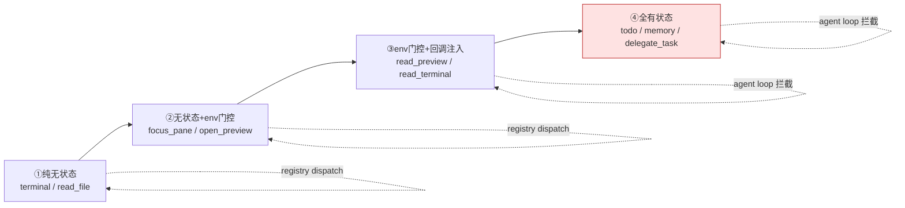
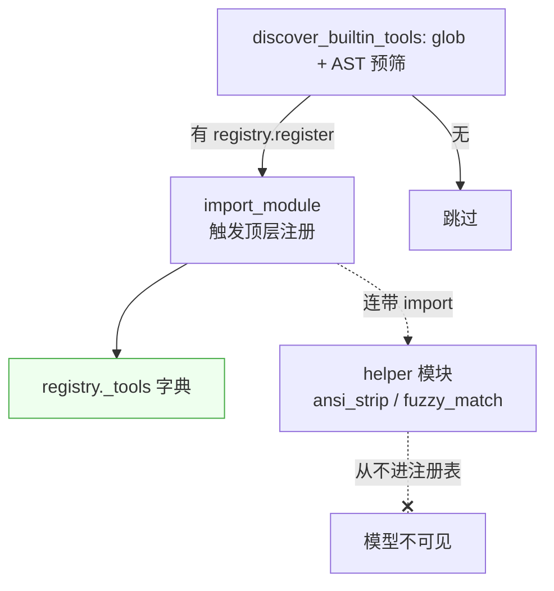

# 第二章　工具的可见性与执行管线

第一章解释了工具"被调用时走哪条路"。本章回答另一个正交的问题：**工具"对模型是否可见"由什么决定**，
以及执行管线如何在保证可见性稳定的同时，容纳从纯无状态到全有状态的整条谱系。

---

## 2.1 toolset：后厨的分区标签

一个进程里登记着几十上百个工具，但不同的运行场景不该把它们全暴露给模型。toolset 就是这个"分区"机制。
它作用在**过滤**维度，与 dispatch 完全正交。

```python
_HERMES_CORE_TOOLS = ["web_search", "terminal", "read_file", "todo", "memory", "clarify", ...]
TOOLSETS = {
    "web":    {"tools": ["web_search", "web_extract"], "includes": []},
    "search": {"tools": ["web_search"],                "includes": []},
    "vision": {"tools": ["vision_analyze"],            "includes": []},
    ...
}
```

收集 schema 时（`get_tool_definitions`），执行器递归展开启用的 toolset（含 `includes`，带环检测），
只保留命中的工具名。toolset 决定"这个工具对这次会话可见吗"，dispatch 决定"调用时谁来执行"，两者互不干涉。

### toolset 对模型可知吗

**不可知。** 发给模型的 `tools=` 数组里，每个条目只有 `name / description / parameters`，没有 `toolset` 字段。
`ToolEntry.toolset` 存在注册表内部，纯粹给系统自己用。可以把它理解为"后厨的分区标签"——模型只看到端上来的菜（schema），
看不到厨房里的分类。

### toolset 的六大用途

| 环节 | 作用 |
|------|------|
| 工具集过滤 | 递归展开 enabled_toolsets，只收命中工具 |
| 平台基底选择 | Telegram 用 messaging 基底、子代理收窄、webhook 用安全集 |
| 子代理隔离 | leaf 角色剥掉 delegation/clarify/memory，防递归派生 |
| Kanban worker 强制注入 | 即使用户收窄，仍强制塞入 kanban toolset |
| memory/context-engine 门控 | 检查 memory toolset 是否启用，决定是否注入 provider 工具 |
| MCP 归属 | 每个 MCP server 的工具注册进以 server 名命名的 toolset |

> 一句话：toolset 是"这次会话能看见哪些工具"的唯一判据。从过滤、隔离、安全、成本控制到调度，全部围绕它展开。

---

## 2.2 prompt caching 神圣性：tools= 每轮都发，但冻结

模型看到工具的唯一渠道，是每次 API 请求里的 `tools=` 数组。Chat Completions 协议没有"注册一次工具"的概念，
`tools=` 是请求体的一部分，每轮调用都带上它。

```
agent.tools（初始化时建好）──→ 每轮 API 的 tools= ──→ 模型
```

这引出一个成本疑问：每轮都把整个工具 schema 数组发出去，岂不很费钱？答案是**三层结构**把它压到等效一次：

| 层次 | 行为 |
|------|------|
| 字面层 | 每次 API 调用都带 `tools=`（协议要求） |
| 冻结层 | `agent.tools` 在智能体初始化时一次性建好，整个会话期间**逐字节不变** |
| 缓存层 | 因 `tools=` 每轮字节相同，它落在可缓存前缀里；首轮 cache write，之后每轮 cache read |

这正是一条铁律的由来：**per-conversation prompt caching is sacred（会话内提示缓存神圣不可侵犯）**。
任何改动 `agent.tools`、重建系统提示词的操作，都会让整个缓存前缀失效，把后续每一轮的成本翻倍。

### 动态工具不会"用完消失"

一个关键澄清：**"动态"不是"会话中途增删"，而是"初始化时按配置/插件解析"**。动态工具的注入只发生在
智能体初始化（会话开始时一次），注入完就和静态工具一样被冻结。所以同一会话内，turn N 用过的动态工具
在 turn N+1 的 `tools=` 里原样还在，字节完全相同，缓存始终有效。

缓存真正失效只有三种情况：

1. 切换 model/provider（智能体对象重建，`agent.tools` 重建）；
2. 上下文压缩（context compression）——唯一被允许的会话内缓存失效；
3. MCP 服务器中途重连增删工具（边缘情况）。

### 会话与轮的区分

理解这一切要先厘清概念：

```
SESSION（会话）= 一整个长期对话，一个 session_id，跨越很多 turn。
   init ──► turn1 ──► turn2 ──► ... ──► /new ──► 新 SESSION（新 init）

TURN（轮） = 会话里一条用户消息 + 智能体处理。
```

智能体对象在一个会话里只创建一次：第一条消息触发 init 构建 `agent.tools`（含动态注入）并冻结；
后续每条消息复用同一份冻结的工具表。只有"开新会话"或"中途切模型/压缩"才会重建。

> **发 ≠ 建**：每轮都"发送"（协议要求），但只在会话开头"构建"一次。缓存机制让"每轮都发"的实际成本趋近于零。

---

## 2.3 有状态与无状态工具的四档谱系

工具的状态依赖并非非黑即白，而是一条谱系。按"handler 需要什么"排列，可分四档：



**第①档　纯无状态（terminal / read_file / web_search）**
handler 自包含，只用 `args` + `task_id`，不依赖智能体实例。走 `registry.dispatch`。

**第②档　无状态但 env 门控（focus_pane / open_preview）**
handler 直接调进程级桥（如 `desktop_ui.emit`），不需智能体回调，但靠 `check_fn`（查 `HERMES_DESKTOP`）
决定可见性。仍走 registry dispatch，只是 `check_fn` 返回 False 时工具不进 `agent.tools`。

**第③档　env 门控 + 回调注入（read_preview / read_terminal）**
被 agent loop 拦截。其 handler 需要一个桌面网关才有的**阻塞桥回调**：

```python
elif function_name == "read_preview":
    def _execute(next_args):
        return read_preview_tool(
            callback=getattr(agent, "read_preview_callback", None),  # ← 桥来自 agent
        )
```

注册表里的 handler 只是"防御性默认"（callback 为 None）；真正工作的路径在 agent loop 拦截分支里，
callback 由智能体注入。

**第④档　全有状态（todo / memory / session_search / clarify / delegate_task）**
全部被 agent loop 拦截，每条分支都从 `agent.<某属性>` 取状态：

```python
elif function_name == "todo":
    def _execute(next_args):
        return todo_tool(todos=next_args.get("todos"), store=agent._todo_store)  # 会话级存储
elif function_name == "session_search":
    def _execute(next_args):
        session_db = agent._get_session_db_for_recall()   # 本会话 SQLite
        ...
```

> 这层区分的存在，是四个硬约束的共同推论：① core 必须是窄腰；② 一个进程多智能体；③ 平台/会话差异不能写死；
> ④ 名字安全与优先级。去掉任一约束，分叉都可塌缩成统一调用；但四个都在，分叉就必须在。

---

## 2.4 handler、回调与 emoji

### handler 是回调吗

严格说，handler 是"注册时存、按名延迟调用"的函数引用——形式上算回调。但系统里要分清两种"回调"：

- **Registry handler**：工具的实现体，无状态，签名 `handler(args, **kwargs) -> str`，被 `registry.dispatch` 调用。
- **Agent 注入的 callback**（如 `read_preview_tool(callback=...)`）：平台相关的运行时函数，由 agent loop 在调用时注入。

"为什么需要 callback"的真正落点是后者：有些工具依赖运行时才存在的、平台/会话相关的函数，只能靠注入。

### 三个根因

1. **延迟绑定**——注册发生在 import 时，那时没有用户、没有会话、没有终端；工具要等模型真正调用时才执行。
2. **平台差异**——`clarify` 在 CLI 是内联提问，在 gateway 是发审批卡片；`read_preview` 只在桌面有桥。这些不能写死在工具里。
3. **会话级状态**——一个进程里多个智能体（父+子代理），各自状态隔离；工具不能从全局偷，必须由"那个智能体"喂进去。

### emoji 用在哪

纯 UI 展示，不影响模型，不在发给模型的 schema 里。`display.py` 的 `get_tool_emoji(tool_name)` 依次查
皮肤引擎、注册表的 `ToolEntry.emoji` 字段、默认值。调用点全在执行器的 spinner 显示逻辑，拼成
`🙂 🔍 read_preview ...` 这样的一行。它从不进入 `agent.tools`、从不发给模型。

---

## 2.5 工具发现：平铺 glob + AST 预筛

工具目录 `tools/` 是**平铺**的，没有按类别分子目录。这是刻意选择：分类靠 `toolset` 元数据，
不绑死物理位置。部署因此最简——丢一个文件进 `tools/` 就自动注册；分类随时可调，不动文件。

### 自动发现机制

`discover_builtin_tools`（`registry.py:67`）只负责"找到并 import"模块；真正注册发生在模块的顶层代码执行（import 副作用）。
它带一个关键优化——**AST 预筛**：

```
discover_builtin_tools()
   │
   ├─ Step 1: glob("*.py") 拿到所有文件
   │    跳过 __init__.py / registry.py / mcp_tool.py
   │
   ├─ AST 预筛: _module_registers_tools(path)
   │    静态分析源码 → 顶层有没有 registry.register 调用？
   │    没有 → 跳过（不 import，省时间）
   │    结果按 (mtime, size) 缓存到 ~/.hermes/cache/tool_discovery_cache.json
   │
   └─ Step 2: 对筛出的文件 importlib.import_module()
        import 触发顶层 registry.register() → 注册进 _tools 字典
```

### "顶层"不是"文件开头"

一个常见误解：`registry.register(...)` 常常写在文件末尾，为何算"顶层"？这里"顶层"指**模块作用域**，
即所有不在 `def`/`class` 体内的语句，与物理位置无关。AST 检查只扫 `tree.body`（顶层语句列表），
所以写在函数体内的注册调用不会被识别——helper 模块（如 `ansi_strip.py`、`fuzzy_match.py`）因此被排除。

### 没有 registry.register 的模块怎么用

这类 helper 通过**普通 Python import** 被工具模块按需引入（如 `from utils import env_var_enabled`）。
Python 的 import 机制会连带处理这些 import 语句。它们成为已加载模块、可被调用，但**从不进注册表、从不暴露给模型**——
它们是工具实现内部调用的库函数，不是给模型用的能力。



> 两套机制对照：自动发现只决定"哪些模块的注册会被触发"，让工具进注册表；helper 通过普通 import 被按需引入，从不进注册表。

---

## 小结

本章把工具的"可见性"与"执行"两条线收口。可见性由 toolset 过滤决定，对模型完全透明；
执行由四档状态谱系决定，从纯无状态到全有状态，分别落在 registry dispatch 与 agent loop 拦截两条路径上。
而贯穿这一切的最高约束是 prompt caching 神圣性——`agent.tools` 一旦在会话开头冻结，整个会话逐字节不变，
让"每轮都发"的实际成本趋近于零。下一章将把视野扩展到智能体之外：MCP 如何把外部能力接入，skills 如何以手册形式指挥工具。
