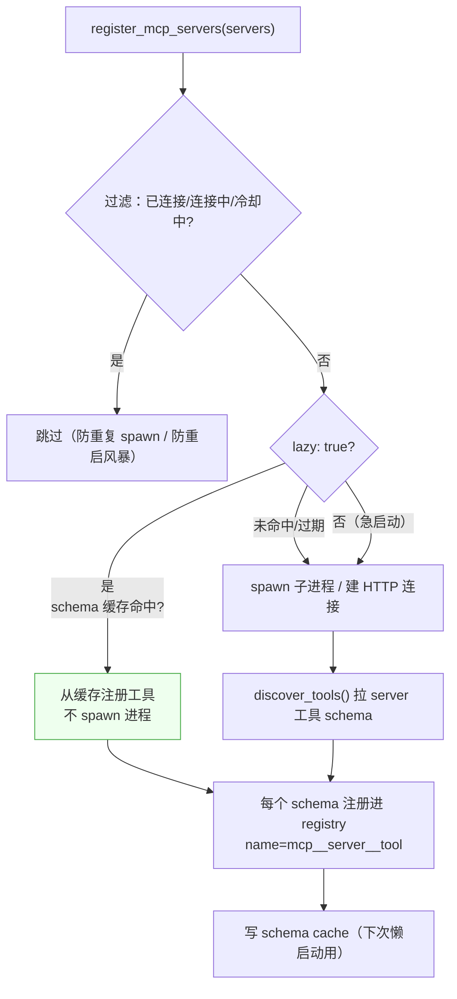
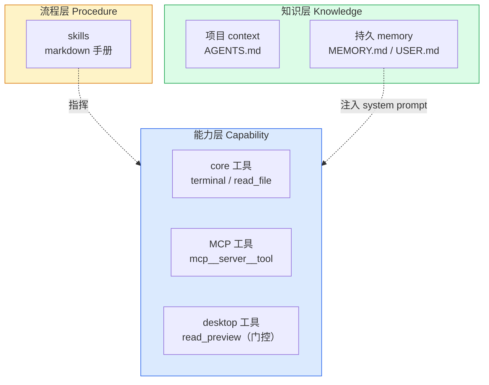

# 第三章　外部能力与技能

前两章讨论的都是仓库内置的工具。本章把视野扩展到两类"外部"事物：**MCP**——把外部进程/服务的能力包装成工具；
以及 **skills**——以操作手册形式指挥现有工具。二者常被混淆，却分属完全不同的层次。

---

## 3.1 MCP：唯一的外部工具来源

MCP（Model Context Protocol）是 Hermes 中唯一的外部工具来源。它把外部进程暴露的工具接入注册表，
核心实现在 `tools/mcp_tool.py`。

接入后，每个 MCP 工具以 `mcp__<server>__<tool>` 为前缀注册进 registry，归属 toolset 为 `mcp__<server>`：

```python
registry.register(name="mcp__filesystem__read_file", toolset="mcp__filesystem", ...)
```

于是 MCP 工具在智能体内部和 `terminal`/`read_file` 长得一模一样：都在注册表、都有 schema、都走 dispatch。
区别仅在于**执行边界在外部进程**——dispatch 时通过 MCP 客户端把调用序列化，经 stdio/HTTP 发给 server 进程执行。

### 两种传输

```yaml
mcp:
  filesystem:              # stdio 传输：spawn 子进程
    command: "npx"
    args: ["-y", "@modelcontextprotocol/server-filesystem", "/tmp"]
  notion:                  # HTTP 传输：连远程服务
    url: "https://mcp.notion.com/mcp"
    transport: "streamable_http"
  github:
    command: "gh-mcp-server"
    lazy: true             # 懒启动
```

MCP server 是外部进程——stdio 要 spawn 子进程，HTTP 要建连接握手。急启动模式下 N 个 server 在智能体初始化时全连，
慢且费资源。这引出懒加载。

### 连接生命周期



---

## 3.2 懒加载与 schema 缓存

懒加载的核心用途是**省启动开销**。机制如下：

```
server 配置 lazy: true
   │
   ├─ 智能体 init 时: 查 mcp_schema_cache.json
   │    fingerprint（command/args/url/transport 的哈希）匹配？
   │    ├─ 命中 → 直接用缓存 schema 注册工具，不 spawn 进程 ✨
   │    └─ 未命中/过期 → 回退急启动
   │
   └─ 模型首次调用某 mcp__server__tool 时: 才真正 connect/spawn
```

它带来三个收益：

1. **启动提速**——5 个 MCP server 急启动要 spawn 5 个进程、各握手几百毫秒；懒启动从缓存秒注册，0 个进程。
2. **资源节省**——不常用的 server 不必常驻进程。
3. **schema 缓存**——`config_fingerprint` 保证配置没变就用缓存；配置变了（改了 command/args）fingerprint 变，自动回退真实连接刷新。

正确性保证：缓存只是"延迟连接"，不是"跳过连接"。首次调用时一定连真实 server 验证；server 真挂了，调用时报错，
不会假装成功。

### 多重防御机制

| 机制 | 作用 |
|------|------|
| 连接去重 | 多入口并发发现时不重复 spawn |
| 失败冷却 | 连接失败后进入退避，不每个 worker session 都重试（防重启风暴） |
| schema 缓存 | 懒启动直接从缓存注册，不连进程 |
| 陈旧唤醒 | 已注册但 session 断了的，被新发现请求唤醒重连 |
| OAuth | 需要认证的 MCP server 走 OAuth 流程 |
| 并行调用门 | 不是所有 server 都支持并行工具调用，需显式 opt-in |

> 设计精髓：MCP 让 Hermes 不必把每个第三方能力都塞进 core，而是通过协议接入。这正是"Footprint Ladder"的落地——外部能力以进程边界隔离。

---

## 3.3 skills：给智能体的操作手册

Skill 是和"工具"最常被混淆的概念。**核心区分：skill 是"给智能体读的操作手册"，不是"可调用的函数"。**

### 数据结构

一个 skill 是一个目录：

```
skills/github/pr-review/
├── SKILL.md            # 核心：YAML frontmatter + markdown 指令体
├── scripts/            # 辅助脚本（skill 引用，智能体用 terminal 执行）
├── references/         # 参考文档
├── templates/          # 模板
└── assets/             # 其他附件
```

`SKILL.md` 的 frontmatter 记录 name、description、version、platforms 等；正文是告诉智能体"遇到这类任务该怎么做"的指令。

### 三个来源

| 来源 | 目录 | 默认激活 |
|------|------|---------|
| 内置 | `skills/`（随仓库） | 是 |
| 可选 | `optional-skills/`（重型/小众） | 否，需 `hermes skills install` |
| 用户 | `~/.hermes/skills/` | 是（智能体创建的受 curator 管理） |

每个 skill 自动变成一个 `/skill-name` slash 命令。

### 调用机制：注入为 user 消息

这是关键设计。用户输入 `/pr-review please check PR #123`，系统构建一条 **user 消息**塞进对话：

```
[IMPORTANT: The user has invoked the "pr-review" skill, indicating they want
you to follow its instructions. The full skill content is loaded below.]

<完整 SKILL.md 指令体>

[Skill directory: /Users/.../skills/github/pr-review]
Resolve any relative paths in this skill against that directory, then run them
with the terminal tool using the absolute path.

The user has provided the following instruction alongside the skill invocation:
please check PR #123
```

**为什么是 user 消息而非 system prompt？** 为了保护 prompt cache（见第二章铁律）。skill 内容大且每次调用不同，
塞 system prompt 会破坏字节稳定前缀。作为 user 消息注入，它是"未缓存后缀"，不污染缓存前缀。

### skill 不提供新能力，它指挥现有工具

`SKILL.md` 正文里写的是"遇到 X 任务，先用 `terminal` 跑 Y，再用 `read_file` 读 Z……"。
智能体读了手册后，用已有的 terminal/read_file/patch/web_search 等工具去执行。skill 是**知识层**，工具是**能力层**。

> 容易混淆：存在 `tools/skills_tool.py`（`skills_list`/`skill_view`/`skill_manage`）——这些**是工具**，
> 但它们管理的是 skill 文件，不是 skill 本身。技能本身是数据（markdown），管理技能的动作才是工具。

### 防记忆污染

skill 调用会展开成一大段带手册的 user 消息。若不处理，memory provider 会把整段手册当"用户说的话"存进记忆——污染。
所以有 `extract_user_instruction_from_skill_message`：靠 byte-identical 的脚手架标记（`[IMPORTANT: ...]` 等），
从展开后的消息里**只抽出用户的真实指令**（"please check PR #123"），memory 只存这句。

---

## 3.4 能力、流程、知识的三层区分

把本章与前两章的内容收口，可以得到一张清晰的对照表：



| 概念 | 本质 | 模型可见方式 | 执行方式 | 目录 |
|------|------|------------|---------|------|
| core 工具 | registry 函数 | `tools=` schema | dispatch 执行 | `tools/`（平铺） |
| MCP 工具 | 外部进程工具 | `tools=` schema（`mcp__` 前缀） | registry → 外部进程 | `tools/mcp_tool.py` + 外部 |
| skills | markdown 手册 | user 消息注入 | 智能体阅读后用现有工具执行 | `skills/`、`optional-skills/` |
| 项目 context | 文件 | system prompt 注入 | 智能体阅读遵守 | cwd（项目目录） |
| 持久 memory | 文件 | system prompt 注入 | `memory` 工具读写 | `~/.hermes/memories/` |

> **一句话总括**：工具是"能做什么"（capability），skill 是"该怎么做"（procedure），memory/context 是"记住什么"（knowledge）。
> 三者正交，各管一层。

---

## 小结

本章把"工具"的概念边界扩展到极致。MCP 让外部能力以进程边界接入注册表，对模型而言与内置工具无异；
skills 则完全是另一类存在——它们不进注册表、不被"调用"，而是作为操作手册注入对话，指挥现有工具。
理解了能力、流程、知识三层正交，才能准确判断"某件事该用工具、用 skill、还是用 memory 实现"。
下一章将深入最后一层——知识与指令是如何被组织进提示词、又如何与缓存共存的。
