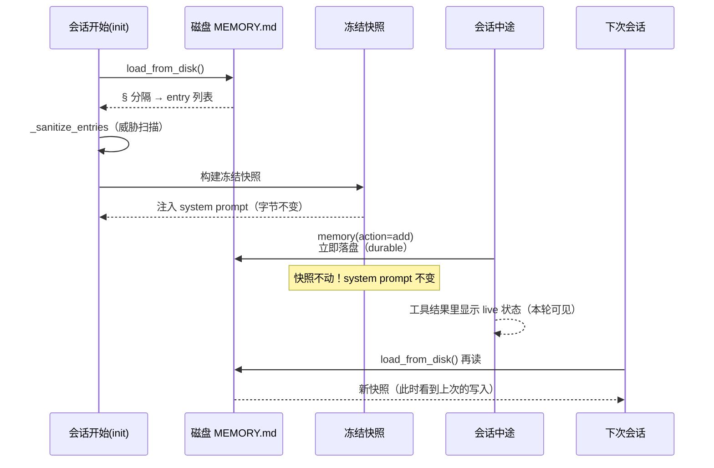

# 第四章　提示词与记忆架构

如果说前三章讨论的是"智能体能做什么"，本章讨论的是"智能体被告知怎么做"。指令与记忆通过提示词进入模型，
而提示词的每一个字节都关乎成本——这就让"放什么、放在哪一层、何时变化"成为整套架构最精巧的设计。

---

## 4.1 三层系统提示词

系统提示词并非一整块扁平文本，而是分三层构建（`system_prompt.py` 的 `build_system_prompt_parts`）：

```
┌─ stable 层 ──────────────────────────────────────┐
│  SOUL.md（身份）、工具行为指导、任务完成指导        │  ← 跨会话稳定
├─ context 层 ─────────────────────────────────────┤
│  AGENTS.md 等项目 context、caller 的 system_message│  ← 会话级稳定
├─ volatile 层 ────────────────────────────────────┤
│  skills 索引、memory 快照、USER.md、外部 memory 块 │  ← 会话间变化
└──────────────────────────────────────────────────┘
```

**三层在会话内都冻结**——`build_system_prompt` 的结果缓存在 `agent._cached_system_prompt`，整个会话不重渲染。
所谓"volatile"只是"会话之间可能变"，不是"会话中途变"。这种冻结是 prompt cache 神圣性的直接体现。

### 为什么项目 context 和持久 memory 要放 system prompt

三个原因：

**（a）权威性**——system prompt 是"最高指令位"，模型对它的遵从权重最高。项目规则（"不要写 change-detector 测试"、
"用 `get_hermes_home()` 不要硬编码"）和持久记忆（"用户偏好中文"）必须是权威指令，不是可被覆盖的建议。
若放 user 消息，模型可能当作"本轮请求"而非"全局规则"，遵从度下降。

**（b）缓存友好**——既然项目规则和用户偏好每轮对话都必须生效（否则某一轮模型忘了你的偏好），
放进可缓存的前缀比放进每轮变化的 user 消息更省：前者首轮 cache write，之后每轮 cache read（几乎免费）；
后者每轮都是未缓存的新 token，全价计费。

**（c）每轮都要在**——这是（b）的前提。每轮都要发的内容，放缓存前缀最经济。

### 三者张力的调和

这里有一个精妙的张力：权威性 + 每轮在场 → 想放 system prompt；prompt cache 神圣 → system prompt 必须字节不变；
memory/context 会变 → 与"字节不变"冲突。解法是**冻结快照**，见 4.3 节。

---

## 4.2 SOUL.md 与 AGENTS.md：身份与指令

两者都是注入系统提示词的 markdown 文件，但**层级、来源、职责完全不同**。

| 维度 | SOUL.md | AGENTS.md |
|------|---------|-----------|
| 职责 | **身份 / 人格**（智能体是谁） | **项目指令**（在这个仓库怎么干） |
| 来源路径 | `~/.hermes/SOUL.md`（HERMES_HOME） | `<cwd>/AGENTS.md`（工作目录） |
| 随什么变 | profile（HERMES_HOME） | 项目目录（cwd） |
| 系统提示词层级 | stable 层 slot #1 | context 层 |
| fallback | 没找到 → 硬编码身份 | 没找到 → 不注入 |

**SOUL.md 回答"我是谁"**：用什么人格、什么语气、什么价值观回复。它是跨项目的——在所有项目里都想要同一个"人格"。
它甚至可以承载个人偏好（"用中文回复""简洁直接"）。

**AGENTS.md 回答"在这个项目里该怎么干"**：编码规范、提交约定、架构约束、测试命令。换一个项目就是另一份。

> 为什么分开：一个跨项目稳定（身份），一个随项目变（指令）。合在一起，换项目就要改身份，或身份被项目指令污染。
> 分层让两者独立演变。cron 作业还支持"保留 SOUL.md 身份但跳过 cwd context"（`load_soul_identity=True` + `skip_context_files=True`）。

---

## 4.3 冻结快照记忆

这是整个记忆系统的灵魂，一句话讲透：

> 两者以**冻结快照**形式在会话开始时注入系统提示词。**会话中途的写操作立即落盘（durable），但不改系统提示词**——
> 这为整个会话保留前缀缓存。快照在**下次会话开始时刷新**。

### 数据结构：文件 + § 分隔符

```
~/.hermes/memories/
├── MEMORY.md    # 智能体的个人笔记（环境事实、项目约定、工具怪癖）
└── USER.md      # 用户画像（偏好、沟通风格、工作习惯）
```

每条 entry 用 `§`（section sign）分隔。选字符不选 token，因为字符数与模型无关，限制可预测。

### 完整流程



### 三个设计思想

**（a）缓存神圣性 > 实时一致性**
写 memory 立即落盘，但模型在本会话里看到的 system prompt 还是旧快照。因为改 system prompt = 整个会话的前缀缓存失效 =
后续每轮全价重算。牺牲"本会话立即可见"（其实工具结果里能看到 live 状态）换"整个会话缓存命中"——明确的成本权衡。

**（b）文件即真相（file-backed）**
不搞数据库、不搞嵌入向量（那是外部 memory provider 的事）。内置 memory 就是两个 markdown 文件。好处：人可读、
可手动编辑、可 git 版本控制、跨 profile 可拷贝。§ 分隔符让人用普通编辑器也能增删条目。

**（c）双层防御：快照消毒 + 写入扫描**
memory 进 system prompt（提示注入的高危入口），所以：
- **快照构建时**扫描每个 entry：命中威胁模式的 entry 在快照里替换成 `[BLOCKED: ...]` 占位符，但**原始 entry 保留在 live state**
  让用户能看到并删除（不静默丢弃，不掩盖攻击）。
- **写入时**也扫描，因为 memory 进 system prompt 是冻结的，一条被投毒的 entry 会污染整个会话甚至跨会话。

### 与外部 memory provider 的关系

注意区分：`MEMORY.md`/`USER.md` 是**内置、个人/profile 级**记忆，随 profile（HERMES_HOME）走、跨项目。
而外部 memory provider（honcho/mem0/supermemory）提供的是**检索式**记忆，通过动态工具（见第一章 1.3 节）调用。
两者正交：内置记忆是"冻结快照"进 system prompt，外部记忆是"按需检索"进工具结果。

---

## 4.4 非用户输入消息：方括号而非 XML

携带 skill 等非用户输入的消息，用的是什么格式？**不用 XML，用的是方括号文本标记 `[...]`。**

回顾第三章的 skill 调用消息：

```
[IMPORTANT: The user has invoked the "pr-review" skill, indicating they want
you to follow its instructions. The full skill content is loaded below.]

<完整 SKILL.md 正文>

[Skill directory: /Users/.../skills/github/pr-review]
Resolve any relative paths in this skill against that directory...

[Skill config (from ~/.hermes/config.yaml):
  github_token = ghp_***]

The user has provided the following instruction alongside the skill invocation:
please check PR #123
```

### 格式约定（全项目统一）

| 标记 | 含义 |
|------|------|
| `[IMPORTANT: ...]` | skill 激活标记（byte-identical，memory 提取靠它定位） |
| `[Skill directory: ...]` | 注入绝对路径 |
| `[Skill config (...): ...]` | 注入 config.yaml 解析值 |
| `[Skill setup note: ...]` | 安装提示 |
| `[...truncated AGENTS.md: kept X+Y of Z chars...]` | context 文件截断标记 |

### 为什么不用 XML

| 方案 | 问题 |
|------|------|
| XML `<skill>...</skill>` | 模型可能把 XML 标签当结构化数据解析而非指令；多余字符开销；和 SKILL.md 正文里可能自带的 XML 冲突 |
| **方括号 `[...]`** | 模型天然理解为"元信息注释"；轻量；不和 markdown 正文冲突；足够独特可被正则定位 |

整个项目的系统提示词/消息注入**一致用方括号标记风格**——context 文件、memory block、skill、压缩注释全是 `[...]`。
这是一种刻意的视觉约定：**方括号 = 系统注入的元信息，正文 = 真实内容。**

### 这些消息进哪个 role

**进 user 消息**，不进 system prompt。这又是 prompt cache 的要求——skill 内容大且每次调用不同，塞 system prompt
会破坏字节稳定前缀。作为 user 消息注入，它是"未缓存后缀"，不污染缓存前缀。

---

## 小结

本章揭示了提示词架构的核心张力与解法。权威性要求把指令放进 system prompt 最高位；缓存神圣要求 system prompt 字节不变；
而记忆与指令又会变化。三者靠**冻结快照**这一三段式调和——会话开始时拍一张快照冻结，会话内绝对不动（缓存保住），
下次会话开始再拍新快照（变化生效）。同时，所有非用户输入的注入统一采用方括号标记、进入 user 消息，
既保持视觉约定，又保护缓存前缀。

第一部分至此结束。接下来的第二部分将转向基础设施：模型从哪来、对话数据存到哪、内置浏览器如何工作。
