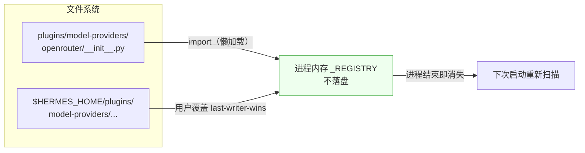
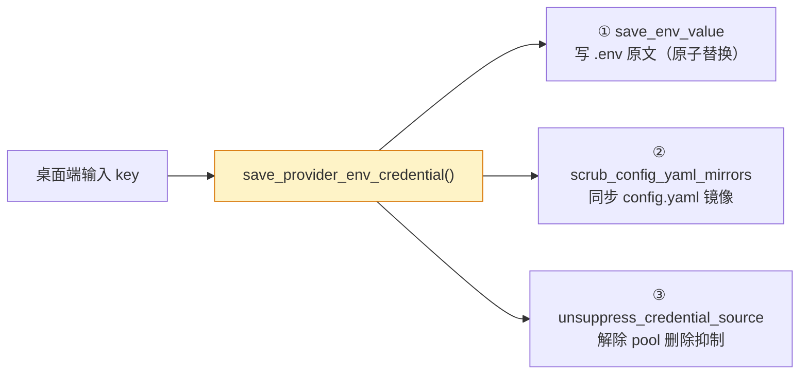
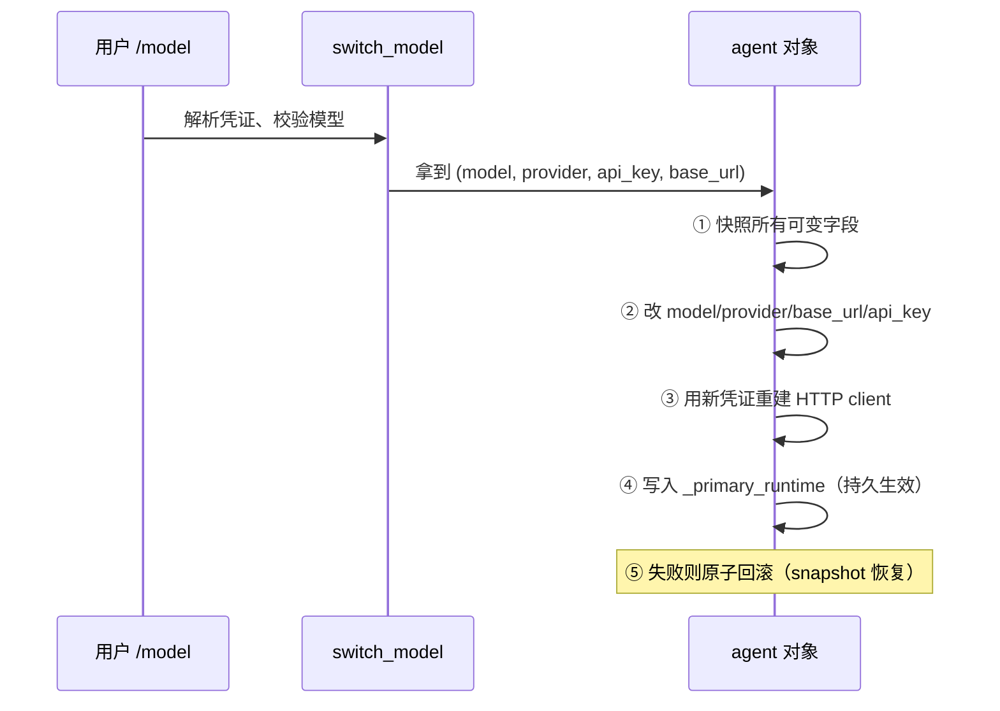
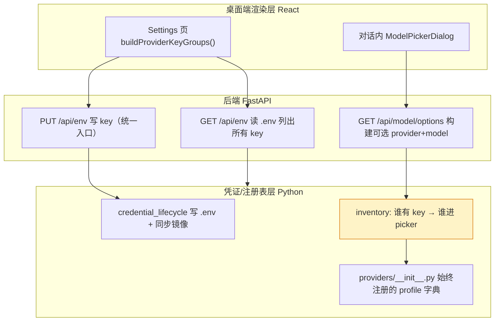

# 第五章　推理提供方插件系统

推理能力从哪来？在 Hermes 中，每一个推理后端（OpenAI、Anthropic、DeepSeek、OpenRouter、自建端点……）
都被声明为一个 `ProviderProfile`，以插件形式存在。本章拆解这套插件系统：为何插件化、数据如何存放、
如何在会话中热切换、以及 provider 列表如何被动态构建。

---

## 5.1 插件化与单一数据源

一个 provider 声明一次 `ProviderProfile`，下游 8 个层（鉴权解析、传输参数、模型列表、运行时路由……）
全部自动从注册表读取，不再各自维护并行数据。这正是插件化的根因。

| 好处 | 说明 |
|------|------|
| 热插拔 | 往 `$HERMES_HOME/plugins/model-providers/<name>/` 丢一个目录即生效，无需改 core、无需重启编译 |
| 用户可覆盖内置 | 用户插件同名 last-writer-wins，能不动仓库源码就替换任何内置 provider |
| 第三方分发 | 独立 pip 包或独立仓库即可发布，不污染 core 树 |
| 懒加载 | 首次调用才扫描导入，启动零开销 |
| 加 provider 零改动 | 只建 `__init__.py` + `plugin.yaml`，鉴权/配置/模型/健康检查等 8 层全自动接线 |
| per-provider 怪癖隔离 | 用子类覆盖钩子（`build_extra_body`、`prepare_messages`），quirks 不泄漏到 core |
| 多 profile 隔离 | 用户插件用唯一模块名加载，多个 HERMES_HOME profile 互不别名冲突 |
| 向后兼容 | 旧式单文件 provider 仍被发现，老用户编辑式安装不破坏 |

### 可覆盖的钩子

| 钩子 | 用途 |
|------|------|
| `get_hostname()` | 基于 URL 的检测——默认从 `base_url` 推导 |
| `prepare_messages(msgs)` | provider 专用消息预处理（Qwen 归一化为 parts 列表、注入 `cache_control`） |
| `build_extra_body(**ctx)` | provider 专用 `extra_body`（OpenRouter 的 provider 偏好、Gemini 的 `thinking_config`） |
| `fetch_models(*, api_key)` | 实时拉取模型目录——默认 Bearer 鉴权请求 `{base_url}/models` |

> 核心收益不是热插拔本身，而是"单一数据源 + 自动贯通"——这才是热插拔得以成立的根因。

---

## 5.2 纯内存注册表

provider 的存储方式常被误解。**它不落盘，是纯进程内内存注册表。** 没有数据库、没有 JSON、没有持久化文件——
每个 provider 插件就是一个代码模块，靠 import 副作用自注册。

```python
_REGISTRY: dict[str, ProviderProfile] = {}   # name → profile 对象
_ALIASES: dict[str, str] = {}                 # alias → canonical name
_discovered = False                           # 是否已扫描过
```

profile 本身是一个 `@dataclass`——纯内存对象。每个插件目录的 `__init__.py` 在被 import 时执行 `register_provider(profile)`，
往字典里写一项。



### 一个关键澄清：plugin.yaml 不是数据文件

`plugin.yaml` 只是 5 行的清单（manifest）：name、kind、version、description、author。provider 的真正数据是 Python 代码
（在 `__init__.py` 里实例化 `ProviderProfile`）。plugin.yaml 只给 PluginManager 登记插件存在性，运行时不读它。

> 所以"启用插件 = 把数据写到全局文件"这种机制完全不存在。流程是：启动后首次调用 → 懒扫描两个目录 → import 每个 `__init__.py`
> → `register_provider()` 写进进程内存字典 → 进程结束即消失。永远不落盘。

---

## 5.3 三层密钥存储

既然 provider 定义不落盘，那 API 密钥存在哪？一个 provider 的 key 可能同时存在于三处，但**原文只有一个家**：`~/.hermes/.env`。

| 层 | 文件 | 存什么 |
|----|------|--------|
| 密钥原文 | `~/.hermes/.env` | 纯文本 secret（`OPENROUTER_API_KEY=sk-...`） |
| 凭证元数据 | `~/.hermes/auth.json` | **只存指纹，不存原文**：`key_hash`、`secret_fingerprint`(sha256)、`detected_endpoint`、`credential_pool` |
| 选用哪个 provider | `~/.hermes/config.yaml` → `model:` | `default` 模型名 + `provider` + `base_url` |

关键安全点：`auth.json` 里**没有原始 key**，只有 sha256 指纹。原文只在 `.env`。在设置界面"看到 key 存着"，
那是实时从 `.env` 读出来回显的。

### 统一写入入口

不同 provider 的 key 用各自的环境变量名区分（openrouter→`OPENROUTER_API_KEY`、anthropic→`ANTHROPIC_API_KEY`…），
全挤在同一个 `.env` 文件里，靠变量名隔离。桌面端"提供方 API 密钥"输入框走统一入口 `save_provider_env_credential()`，
它做三件事保证三处一致：



config.yaml 的镜像（`model.api_key` 等）是历史遗留，优先级**高于** .env——所以更新 key 时必须同步刷新它，
否则旧 key 会遮蔽新 key 造成 401。

---

## 5.4 会话内热切换智能体的 client

会话中切换 provider，不是"切换配置然后重启"，而是**直接替换正在运行的智能体对象内部的 HTTP client**。



关键设计是**原子性**：切换前快照所有可变字段（model/provider/client/api_key/base_url/_client_kwargs…），
失败时逐字段还原，避免"新模型名配旧 client"的 400 错误。

**对话历史原封不动**——切 provider 只换"嘴"，不换"记忆"。上下文、prompt cache 的会话前缀都保留。
代价是下一轮会重新建立新 provider 侧的 cache（老 provider 的 cache 失效，因为换了端点）。

### 作用域：没有"项目级"，只有两个

| Scope | 存哪 | 影响范围 |
|-------|------|---------|
| `global` | `config.yaml` 的 `model:` 段 | 所有新会话默认 |
| `session` | `session["model_override"]` dict + SQLite session 行 | 仅这一个会话，换会话失效 |
| `once` | `session["one_turn_model_restore"]` | 只用一次，下一轮自动回弹 |

所谓"项目级"其实不存在——provider 选择锚定在 `HERMES_HOME`，与工作目录/项目无关。
桌面端一个进程托管同 profile 的所有会话，故**故意不写全局 env 变量**（`HERMES_MODEL` 等），
否则改 `os.environ` 会串到别的会话（历史踩过的"跨会话污染"bug）。

---

## 5.5 provider 列表的运行时探活

桌面端能"看到多个 provider 可填 key，对话里选哪个 provider 的模型"，这是端到端数据流，把 React UI、
REST API、Python 注册表三层串起来。核心设计：**provider 列表由 profile（始终注册）+ 模型由"是否填了 key"决定（运行时探活）**。



### "填了 key 的 provider 才出现在对话选择器里"

后端关键在 `build_models_payload()` 调用 `list_authenticated_providers()`：

1. 遍历注册表里**所有** provider profile（来自插件，始终注册）；
2. 对每个 profile，检查它的 `env_vars`（如 `OPENROUTER_API_KEY`）在 `.env` 里**有没有值**；
3. **有 key** → provider 进 picker，`fetch_models()` 拉它的模型列表；
4. **没 key** → 被 `explicit_only` 过滤掉。

所以这不是硬编码列表，而是**运行时按凭证探活动态构建**。删掉 `.env` 里的 key，下次打开 picker 那个 provider 就消失。

---

## 小结

provider 系统的核心是"单一数据源 + 自动贯通"：定义是代码（插件 import 进内存字典）、密钥在 .env、选用在 config.yaml、
会话级覆盖在 session DB。设置页和对话选择器是同一套 `.env` + `model.options` 数据的两种渲染视角。切换时通过原子快照热替换
智能体的 HTTP client，对话历史不动，作用域只有 global/session/once 三档，没有"项目级"。
下一章将进入数据存储层——这些 provider 切换产生的 token 用量、对话内容，最终都沉淀在 SQLite 里。
