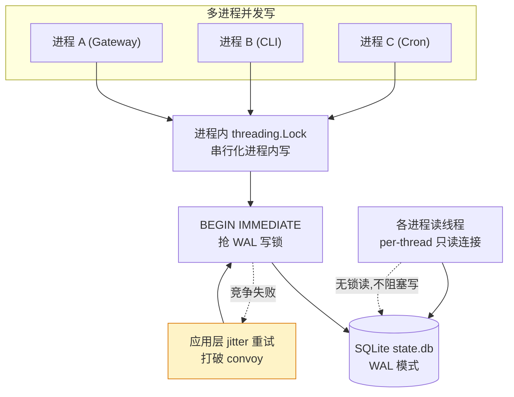

# 第六章　数据存储与会话机制

对话的内容与开销最终都沉淀在 SQLite 中。本章拆解三件事：对话数据如何组织、token 用量如何记账、
以及在多进程并发写入下 SQLite 如何被驯服。这三个问题各自独立，却共享同一份 `state.db` 文件。

---

## 6.1 两张核心表：sessions + messages

一个常见的误解是"session + message + tool 三张表构成核心数据"。实际上**没有独立的 tool 表**——
工具调用作为 `messages` 表里不同 `role` 的行嵌入存储，完全遵循 OpenAI 消息格式。核心对话数据只有两张表。

```
sessions (1) ──< messages (N)        ← 这两张就构成完整对话
                ├ role=user
                ├ role=assistant     (tool_calls 字段存调用请求)
                └ role=tool          (tool_call_id + tool_name 存返回结果)
```

工具调用的"请求"和"结果"是**两条不同 role 的消息行**，靠 `tool_call_id` 关联：

| 场景 | role | tool_calls | tool_call_id | content |
|------|------|-----------|--------------|---------|
| 模型发起调用 | assistant | JSON 数组（调用请求） | — | 模型的文字回复 |
| 工具返回结果 | tool | — | 对应的 call_id | 工具返回内容 |

没有独立建表的原因：**工具调用本身就是对话流的一部分**，必须保持顺序和角色交替。

### 其他表的角色

| 层次 | 表 | 作用 |
|------|-----|------|
| 对话核心 | `sessions` | 会话元数据 + 累计 token |
| 对话核心 | `messages` | 所有消息（含工具调用，按 role 区分） |
| 计费明细 | `session_model_usage` | 按模型/task 分维度的 token 累加 |
| 全文搜索 | `messages_fts` / `_trigram` / `_cjk` | FTS5 虚拟表，索引 messages 的 content |
| 系统提示词 | `system_prompts` | 去重存储 system prompt |

---

## 6.2 usage 是累加，不是逐条

AI 返回的 usage 字段 token，是逐渐累加，还是每条会话单独存储？答案是**逐渐累加**，机制分三层。

**1. 内存计数器（AIAgent 实例属性）**——每次 API 调用返回 usage 后用 `+=` 累加；会话开始时全部归零。

**2. sessions 表（每会话一行汇总）**——`update_token_counts()` 有两条路径：
- `absolute=False`（CLI/cron/delegate）：增量 `column = column + ?`
- `absolute=True`（gateway，agent 跨消息常驻）：直接 `column = ?` 覆盖（gateway 已在内存累好）

**3. session_model_usage 表（按 model/provider/task 分维度累加）**——用 `INSERT ... ON CONFLICT(...) DO UPDATE SET`
做 upsert 累加。这样会话中途切换模型时每个模型的用量能分别统计。

### 没有逐条 usage 记录

每次 API 调用返回的 usage 原始数据是**即用即弃**的：

```
API 响应返回 usage
    │
    ├─ normalize_usage() 归一化为 CanonicalUsage
    ├─ 内存计数器 +=
    ├─ sessions 表 UPDATE ... = ... + ?（累加）
    ├─ session_model_usage UPSERT ... + excluded.（按维度累加）
    └─ raw_usage 丢弃 ← 不持久化原始 usage 对象
```

没有任何表存储"第 5 次 API 调用：input=1234, output=567"这样的逐条记录，只存累计值。
`messages.token_count` 字段记的是单条消息自身大小估算（用于上下文压缩判断），**与 API usage 无关**。

---

## 6.3 task 维度：把糊涂账变成明细账

`session_model_usage` 的主键是复合键：`(session_id, model, billing_provider, billing_base_url, billing_mode, task)`。
为什么要这个 `task` 列？

### 核心问题：一次会话里不止一个 LLM 在花钱

用户看到"这次对话花了 $0.50"，但如果 compression 烧了 $0.30、vision 烧了 $0.15、主循环只有 $0.05——
没有 task 维度，这笔账是一本糊涂账。task 维度让系统有明确的记账归属规则：

```
LLM 调用发生
  ├─ 走主循环 conversation_loop → task=''（空），记入 sessions + session_model_usage
  ├─ 走 auxiliary_client → 记入 session_model_usage（不碰 sessions）
  └─ MoA advisor/aggregator → 已被主循环折叠，显式排除（不重复记）
```

task 是**有限预定义列表**，不是自由文本，与 config.yaml 的 `auxiliary.<task>` 配置一一对应：

| task 值 | 触发场景 |
|---------|---------|
| `''`（空） | 主对话循环（用户提问→模型回答） |
| `vision` | 图像/截图分析 |
| `compression` | 上下文窗口超阈值时自动压缩历史 |
| `title_generation` | 新会话首条消息后自动起标题 |
| `web_extract` | 网页内容提取摘要 |
| `approval` | 危险命令智能审批判断 |

### 五个设计考量

1. **每个 task 可路由到不同模型**——`config.yaml` 允许每个 task 独立配置 provider/model/timeout/reasoning_effort。
   不区分 task 就无法实现"按任务类型优化成本"——不会用 $25/M 的 Claude Opus 去生成会话标题。
2. **避免与 gateway 绝对覆盖冲突**——gateway 模式下每轮结束后用绝对覆盖写 sessions 行，若把 aux token 也加进去
   会被下一轮冲掉。所以 aux 用量**只写 session_model_usage，绝不碰 sessions 汇总行**；Insights 查询时两者 UNION 合并展示。
3. **防双计的精确边界**——MoA 的 advisor/aggregator 已被主循环记账，故显式排除。
4. **成本可归因性**——不同 task 单位成本可能差 100 倍，task 维度让 `/insights` 能展示"哪项任务在烧钱"。
5. **有限枚举而非自由文本**——保证与配置、UI、dashboard 联动；插件可注册新 task，但仍是有限、可控的集合。

> task 本质上回答的是"这笔 token 花在了什么类型的工作上"，让一笔糊涂账变成可以逐项审计、逐项优化的明细账。

---

## 6.4 normalize_usage：归一化各家 provider

不同 provider 汇报缓存 token 的字段名各不相同。`normalize_usage()` 负责把它们统一成一套 `CanonicalUsage`。

### 三层回退解析

```python
# 第①层：标准 OpenAI 嵌套格式
cache_read_tokens = prompt_tokens_details.cached_tokens
# 第②层：Anthropic 风格顶层字段（OpenRouter 转发 Claude 时用）
if not cache_read_tokens:
    cache_read_tokens = response_usage.cache_read_input_tokens
# 第③层：DeepSeek 原生格式
if not cache_read_tokens:
    cache_read_tokens = response_usage.prompt_cache_hit_tokens
```

### 不同 provider 字段对照

| Provider | 缓存命中字段 | 缓存写入字段 | 位置 |
|----------|------------|------------|------|
| OpenAI | `prompt_tokens_details.cached_tokens` | `prompt_tokens_details.cache_write_tokens` | 嵌套对象 |
| Anthropic | `cache_read_input_tokens` | `cache_creation_input_tokens` | 顶层 |
| DeepSeek | `prompt_cache_hit_tokens` | —（不报告） | 顶层 |
| Codex/Responses | `input_tokens_details.cached_tokens` | `input_tokens_details.cache_creation_tokens` | 嵌套对象 |

### 一个关键公式

```python
input_tokens = max(0, prompt_total - cache_read_tokens - cache_write_tokens)
```

OpenAI 兼容接口的 `prompt_tokens` **包含了缓存命中的部分**，必须减去才能得到真正的"新输入 token"。
以 DeepSeek 为例：`prompt_tokens=5200`（含缓存总量）、`prompt_cache_hit_tokens=4800`，归一化后
`input_tokens = max(0, 5200 - 4800 - 0) = 400`——算出来的净输入。

> 这就是 normalize_usage 的意义：把各家五花八门的字段名统一成一套 CanonicalUsage，然后才写入 session_model_usage。

---

## 6.5 项目归属：cwd 前缀匹配

`session` 表里**没有 `project_id` 字段**。项目和会话的关系不是外键关联，而是通过 `cwd`（工作目录）
**动态推导**的。

### 两套独立的存储

```
state.db (会话数据库)               projects.db (项目数据库)
┌─────────────────────┐            ┌──────────────────────┐
│ sessions            │            │ projects             │
│  id                 │            │  id (p_xxxx)         │
│  cwd ←━━ 最长前缀匹配 ━━━━━━━━━━━━│  primary_path        │
│  git_repo_root      │            │ project_folders      │
└─────────────────────┘            │  project_id → projects│
                                   │  path                │
                                   └──────────────────────┘
```

`projects.db` 和 `state.db` 是两个独立的 SQLite 文件。会话如何归属项目？靠 **cwd 最长前缀匹配**：

```
用户创建项目 "my-app"，关联文件夹 /Users/me/code/my-app
会话 A 的 cwd = /Users/me/code/my-app/src     → 匹配 my-app ✓
会话 B 的 cwd = /Users/me/code/my-app/docs/api → 匹配 my-app ✓
会话 C 的 cwd = /Users/me/other-project        → 不匹配任何项目
```

**不是写死的关系**——移动 session 的 cwd 就自动改变了项目归属。没有 `UPDATE sessions SET project_id = ?` 这样的操作，改 cwd 就够了。

### 三层分组

桌面端侧边栏按三层分组：

| 层 | 来源 | 何时出现 |
|----|------|---------|
| Tier 1 | `projects.db` 中用户创建的项目 | 永远显示 |
| Tier 2 | 没 Tier 1 认领的会话，按 git repo root 自动分组 | 有未归类的 git 会话时 |
| Tier 0 | `__no_project__` / "Home" | cwd 为空或无法提升为项目 |

### 为什么不用 project_id 外键

1. **cwd 是会话的真实工作上下文**——项目分组只是 cwd 的投影，不需要额外关联表。
2. **自动发现零成本**——只要 session 的 cwd 落在 git repo 下，就自动出现在 Tier 2，即使用户从未创建项目。
3. **切换项目 = 改 cwd**——`project_switch` 工具只做一件事：把 session 的 cwd 指向项目文件夹。
4. **多文件夹项目**——一个项目可关联多个文件夹，外键方案无法表达这种"路径归属"语义。
5. **存储解耦**——删掉 `projects.db` 不丢会话数据，只是丢失显式分组（退化到 Tier 2）。

---

## 6.6 SQLite 并发：WAL + jitter + 分级耐心

`state.db` 面临多进程（Gateway、CLI、Cron）并发写。核心思路：**WAL 模式 + BEGIN IMMEDIATE + 应用层 jitter 重试 + 读写连接分离**。



### 五层并发控制

**第 1 层：WAL 模式**——读写分离到不同文件。读连接永远不等写锁，写连接永远不等读锁。
（不支持 NFS 等文件系统回退到 `journal_mode=DELETE`。）

**第 2 层：BEGIN IMMEDIATE**——在事务**开始时**就获取写锁，而非第一条写语句时。锁竞争在事务开头就暴露，
不会出现"读了一堆数据，准备写时才发现锁被占"。

**第 3 层：应用层 jitter 重试（打破 convoy）**——这是最独特的策略。SQLite 内置的 `busy_timeout` 用确定性退避，
高并发下会产生 convoy 效应（所有等待者同时重试）。Hermes 保持 SQLite timeout 很短（1s），在应用层用随机 jitter：

```python
# 前 2 秒: 20-150ms 快速重试   ← 毫秒级竞争快速恢复
# 2 秒后:  250ms-1s 慢速退避    ← 长时间持锁不疯狂重试
```

**第 4 层：多级耐心预算**——按写入重要性分级：

| 写入类型 | 耐心 | 原因 |
|---------|------|------|
| 对话消息追加 | **60s** | 失败 = 用户当前回合被销毁，最不能丢 |
| 常规数据更新 | **20s** | 重要但可容忍偶尔失败重试 |
| 活动心跳/标签 | **0.5s** | 非关键，跳过等下次心跳自然重试 |
| 压缩锁竞争 | **5s** | 压缩几秒内完成，但不该无限等 |

**第 5 层：进程内 Lock + 进程间 WAL 锁**——`threading.Lock()` 保证同进程写者串行；
`BEGIN IMMEDIATE` 抢的 WAL 写锁保证不同进程写者串行。

### 读写连接分离

WAL 下每个线程有独立的只读连接，**完全绕过进程内锁**：

```python
@contextmanager
def _read_ctx(self):
    conn = self._get_read_conn()   # per-thread, mode=ro
    if conn is not None:
        yield conn                 # WAL: 无锁读，不阻塞写者
        return
    with self._lock:               # 非 WAL: 退化为共享写连接
        yield self._conn
```

### Kanban 的额外策略：CAS

Kanban 面临"多 worker 进程并发认领同一任务"的场景，额外用 compare-and-swap：

```sql
UPDATE tasks
SET claim_lock = ?, status = 'running'
WHERE id = ? AND status = 'ready' AND claim_lock IS NULL
-- 返回 affected_rows: 1 = 认领成功, 0 = 被别人抢了
```

失败者看到 0 行受影响直接跳过——不需要重试循环，不需要分布式锁。

> 核心理念：**SQLite 的 WAL 已经是正确的并发模型，问题只是写锁竞争时的等待策略**。
> 应用层 jitter + 分级耐心预算，让这个等待既公平又不饿死关键写入。

---

## 小结

对话数据用两张表（sessions + messages）承载，工具调用内嵌为不同 role 的行。token 用量不逐条存储，
而是每次 API 调用后立即拆成增量，累加进总账（sessions）和分类账（session_model_usage，按 model/task 维度），
费用按本地价目表估算。项目归属不靠外键而靠 cwd 前缀匹配。并发写则用 WAL + BEGIN IMMEDIATE + 应用层 jitter + 分级耐心预算
的多层防御。下一章转向应用层——内置浏览器如何让智能体与用户共享同一片浏览视野。
