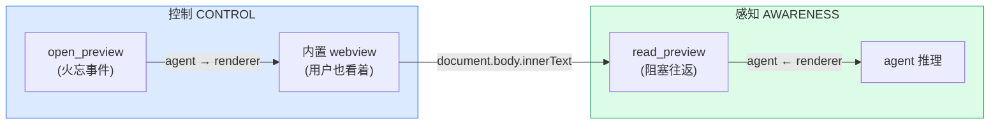
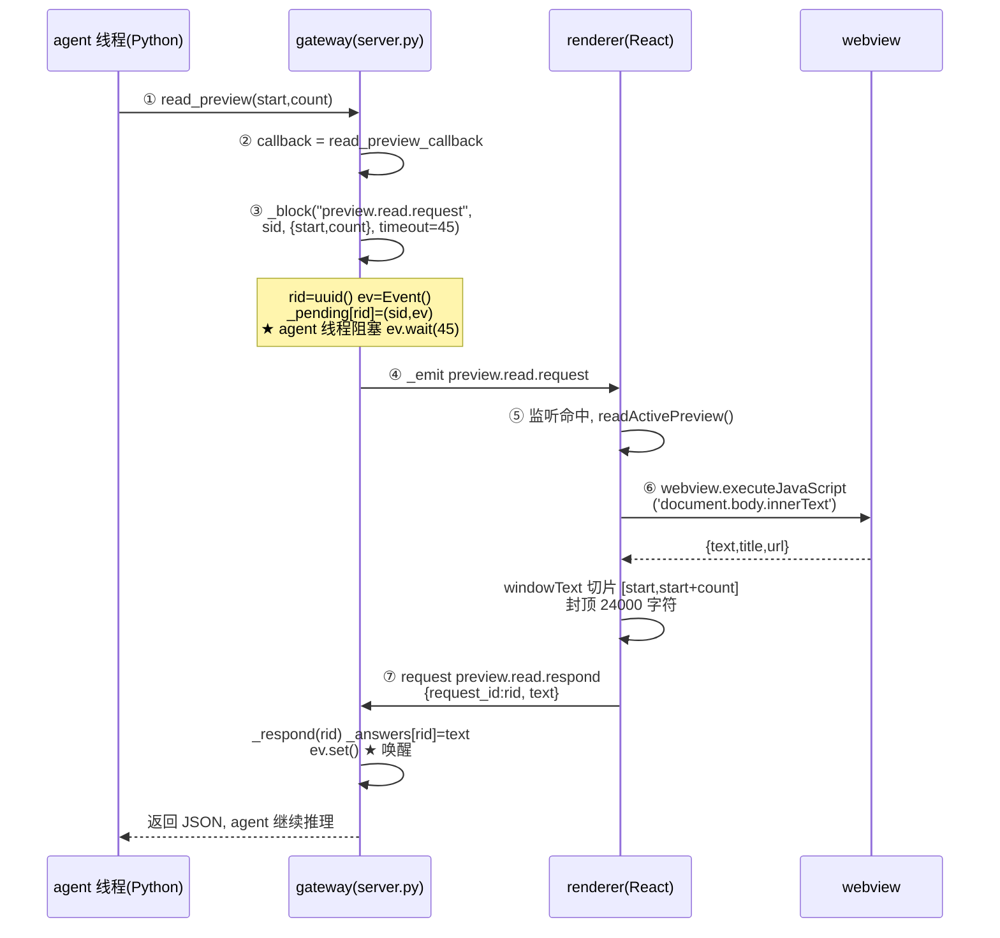
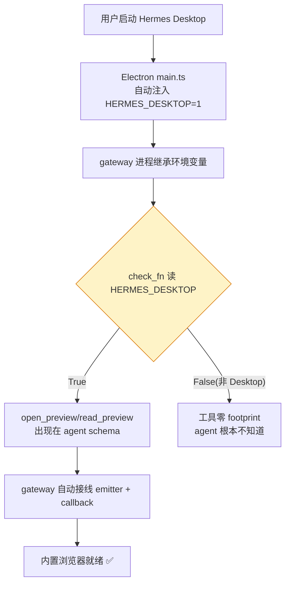
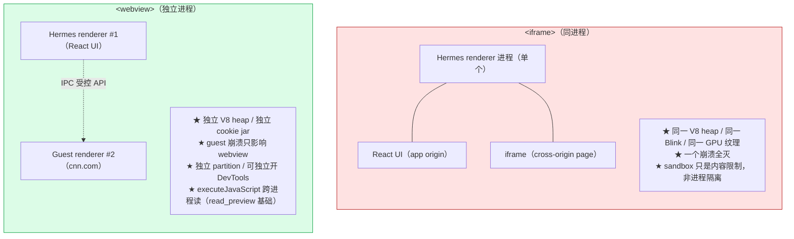
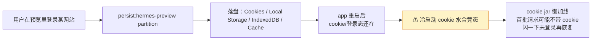

# 第七章　内置浏览器

Hermes Desktop 有一个"智能体可控制且感知的内置浏览器"（in-app browser that hermes can control and is aware of）。
它没有"内置"一个浏览器程序，而是利用 Electron 本身就是 Chromium 这一事实，在三个层次上嵌入网页，
并通过一对桌面专属工具打通智能体与浏览视野的双向闭环。

---

## 7.1 不内置浏览器，而是嵌入 Chromium

核心结论：Hermes 既没有单独安装一个浏览器程序，也没有调用系统已有浏览器，而是**复用 Electron 自带的 Chromium 引擎**
——它作为 app 本体的一部分捆绑存在。

```
┌─────────────────────────────────────────────────────────────┐
│                  Hermes Desktop (Electron)                  │
│                                                             │
│  main process (electron/main.ts)                            │
│   • BrowserWindow(...)          ← 第 1 层：主壳             │
│   • session.fromPartition('persist:hermes-embed')           │
│   • session.fromPartition('persist:hermes-preview')         │
│                                                             │
│  renderer (React)                                           │
│   • 主壳 webContents           ← 第 1 层：React UI 本体     │
│   • <webview partition="persist:hermes-preview">            │
│       └─ 第 2 层：预览窗格里的"真浏览器"                    │
│   • <iframe sandbox="">       ← 第 3 层：远端 HTML 隔离渲染 │
└─────────────────────────────────────────────────────────────┘
```

### 三种方案对比

| 方案 | 是否 Hermes 做法 | 问题/特点 |
|------|----------------|---------|
| 单独安装一个浏览器程序 | 否 | 用户要额外下载、维护、授权 |
| 调用系统已有浏览器 | 否 | 只能弹新窗口，无法嵌入 app 内部 |
| 嵌入式浏览器引擎（Electron 捆绑 Chromium） | **是** | 和 app UI 共用同一个 Chromium 二进制；通过 `<webview>` 开 guest 进程 |

### 启动方式：不"启动"任何外部程序

它让已在跑的 Chromium（渲染 Hermes UI 的那个引擎）再开一个**渲染进程（guest process）**：

```
Hermes 进程树
└── Hermes (主进程)
    ├── GPU Process              ← 共享
    ├── Hermes (renderer)        ← 渲染 React UI
    ├── Hermes (renderer)        ← <webview> 的 guest 进程 ★
    ├── Hermes (utility)         ← 网络服务
    └── Hermes (zygote)
```

`<webview>` 是 Electron **特有的 DOM 元素**（HTML 标准里没有）。挂进 DOM 的那一刻，Electron 的 Chromium 底层会：
用指定 partition 创建/复用 Session 对象 → fork 一个新 renderer 进程 → 加载 src 指定 URL →
把渲染结果合成（composit）到主窗口对应区域。**没有任何子进程 spawn、没有 shell 调用**——纯粹是 Chromium 内部的进程管理。

底层是 Chromium 的多进程合成：guest 进程把网页渲染成纹理/分块，GPU 进程把多个 renderer 的输出合成到同一窗口。
对用户来说看起来是"一个窗口里嵌了网页"，底层其实是"两个独立渲染进程，各画各的，GPU 拼合"。

---

## 7.2 控制与感知的闭环

这个特性的本质是：**智能体和用户看的是同一个浏览器**。



控制和感知用的是**完全不同的通信模式**，这是理解整个特性的第一原理：

| | 控制 open_preview | 感知 read_preview |
|---|---|---|
| 方向 | agent → renderer | agent ← renderer |
| 模式 | **火忘（fire-and-forget）** | **阻塞请求/响应** |
| 行为 | 发完即返回，不等渲染进程 | 发出后阻塞 agent 线程，死等页面文本 |
| 通信 | 单向事件 `desktop_ui.emit()` | 双向握手 `request_id` 配对 |
| 例子 | "打开 cnn.com" → 秒回 | "这页写了什么" → 阻塞最多 45s 拿正文 |

为何不对称？**打开**是个动作，执行了就行，页面加载是异步的，agent 不需要等；**读取**必须拿到结果才能继续推理，
所以必须阻塞等渲染进程把 `innerText` 提取出来。

### 解决的根本问题：agent 与用户的"屏幕"分离

传统智能体浏览器（`browser_navigate` 那套）是 headless 的，agent 看到 a11y tree 快照，用户什么也看不到。
这里反过来——`browser_navigate` 给 agent 自主行动力（用户不在场也能干活），`open_preview` 给 agent 和用户**共享视野**
（用户在场，一起看）。两个工具故意互补。

---

## 7.3 阻塞桥：复用"向人提问"的基础设施

这是整个设计最巧妙的部分。智能体的对话循环是同步的，当它说"我要读预览页面内容"，必须停下来等结果。
但页面内容在 renderer 进程里（`<webview>` 的 `innerText`）——跨进程、异步。解法是复用 `clarify`（向用户提问）那套
**阻塞式 prompt 桥**：智能体线程挂起，renderer 回答后唤醒它。



### _block 的核心实现

```python
def _block(event, sid, payload, timeout=300):
    rid = uuid.uuid4().hex[:8]        # ① 生成配对 ID
    ev = threading.Event()            # ② 创建线程事件
    with _prompt_lock:
        _pending[rid] = (sid, ev)     # ③ 登记"我在等这个 rid 的回答"
    try:
        _emit(event, sid, payload)    # ④ 发请求给 renderer
        answered = ev.wait(timeout)   # ⑤ ★ 阻塞当前线程
    finally:
        _pending.pop(rid, None)       # ⑥ 清理
    if not answered:                  # ⑦ 超时通知
        _emit(f"{event}.expire", sid, {"request_id": rid})
    return answer
```

### 共享基础设施，非为 preview 发明

这套 `_block` / `_respond` 不是为 preview 发明的——它是四种桌面交互共用的：

```
共享的阻塞桥 (_block / _respond)
├── clarify.request    （向用户提问）       timeout 300s
├── secret.request     （要密码）           timeout 300s
├── sudo.request       （要 sudo）          timeout 300s
├── terminal.read.req  （读终端缓冲）       timeout 30s
└── preview.read.req   （读预览页面）★ 新增 timeout 45s
```

原理：preview 复用了"向人提问"的基础设施——**把 renderer 当成一个"会回答的实体"**。

### allow_expired：容忍迟到的回答

`read_preview` 用 45s 超时，但 renderer 提取大页面文本可能更久。工具超时返回空了，但 renderer 的迟到回答
**不会报错**（`allow_expired=True`）——它只是被丢弃。这是优雅降级的一部分。

---

## 7.4 check_fn 门控与零配置

使用内置浏览器需要配置吗？答案是**零配置**——开箱即用。所有"开关"都是应用自动设置的：



四层自动门禁全是代码控制：

| 门禁 | 在哪 | 用户要配吗 |
|------|------|----------|
| `HERMES_DESKTOP=1` 环境变量 | `main.ts` 启动后端时自动注入 | 否 |
| `check_fn` 返回 True | 读环境变量 | 否 |
| 工具在 toolset 里 | `_HERMES_CORE_TOOLS` 默认核心包 | 否 |
| `webviewTag: true` | 硬编码在每个聊天窗口的 webPreferences | 否 |

这是 `check_fn`（service-gated tool）模式的典型实现：在 Desktop 里零成本出现，在其他平台完全隐形。
非 Desktop 环境（CLI/TUI/gateway）下 `check_fn` 返回 False，工具不出现在 schema 里，智能体根本不知道它们存在。

### check_fn 的三层缓存

`get_tool_definitions()` 每次调用都遍历所有工具的 `check_fn`，不能每次都真跑（有些要探测环境），故用三层缓存：

- **Layer 1**：toolset membership——`_HERMES_CORE_TOOLS` 列表，两个工具永远在列表里。
- **Layer 2**：TTL cache——`env_var_enabled("HERMES_DESKTOP")` 的结果被缓存，Desktop 里永远 True、缓存命中、零成本。
- **Layer 3**：`_check_fn_last_good`——即使 check_fn 偶尔抛异常，也用上次的 True 兜底。

结果：两种情况（Desktop 里 True / 非 Desktop 里 False）都是缓存命中，对每次 API 调用零额外开销。

---

## 7.5 webview 与 iframe 的隔离分级

为什么真实 URL 必须用 `<webview>`，不能用 `<iframe>`？本质区别是**进程隔离级别**：



### 按信任度选隔离强度

Hermes 全用了多种"嵌网页"方案，按内容信任度递减选择隔离强度：

| 方案 | 用在哪 | 隔离 | 信任度 |
|------|--------|------|--------|
| `<webview>` persist:hermes-preview | 预览真实 URL（cnn.com、localhost） | guest 进程级 | 完全不可信 |
| `<iframe sandbox="allow-scripts">` | artifact HTML（智能体生成） | opaque origin，同进程 | 半可信 |
| `<iframe sandbox="">` | 远端 HTML 文件（消毒后） | 最严格沙箱，禁脚本 | 消毒过 |
| `<iframe>`（无 sandbox） | 社交/视频嵌入（YouTube/地图） | 同源策略 | 半可信 |

> **核心原理：按内容来源可信度选隔离强度，按功能需求选机制。** webview 最重（独立进程），只给完全不可信的真实 URL；
> artifact 是半可信的，sandboxed iframe 就够；远端 HTML 是消毒过的，用最严格的 sandbox 连脚本都不许跑。

---

## 7.6 捆绑 Chromium 与 partition 持久化

### 版本滞后问题

Electron 40.10.2 捆绑 Chromium ~134，而系统 Chrome 可能已是 138。这带来四类问题：

| 问题 | 说明 |
|------|------|
| UA 字符串不同 → 网站行为分叉 | webview UA 带 `Electron/40.10.2`，网站可检测；有些会对非标准 UA 反爬虫/降级 |
| 安全补丁滞后 | Chromium 版本被 Electron 发布周期锁定，通常比系统 Chrome 滞后 1-3 个月 |
| 新 Web API 不可用 | 系统 Chrome 里跑得好的页面，在预览里可能样式崩坏或功能缺失 |
| GPU API 差异 | 预览页面用了更新的 GPU API 会失败 |

缓解措施：`sandbox=yes`（渲染进程 sandbox 化）+ `contextIsolation=yes`（JS 上下文隔离）+ `nodeIntegration=no`（网页 JS 无法访问 Node API）。

### persist: 前缀决定持久化

`persist:` 前缀决定 partition 是否落盘。Hermes 三处都用 `persist:`：

```
"hermes-preview"           内存 only — app 关闭即清空
"persist:hermes-preview"   持久化 — 落盘到 Partitions/hermes-preview/  ★ Hermes 用的
```



实锤证据：`~/Library/Application Support/Hermes/Partitions/hermes-preview/` 下有完整的 Chromium 存储结构
（Cookies、Local Storage/leveldb、IndexedDB、Cache 等），和系统 Chrome 同构，但存在于 Hermes 自己的数据目录下、
与系统 Chrome 毫无关系。代码中**没有任何 `clearStorageData` 调用针对此 partition**——意味着预览过的网站的 cookie 永久保留，
且目前没有"清除预览数据"的入口（只能手动删目录）。

一个隐藏陷阱是**冷启动 cookie 水合竞态**：`persist:` partition 的 cookie store 是懒加载的，冷启动时第一批请求可能在
cookie jar 读完前发出，导致短暂"未登录"。Hermes 对 OAuth partition 做了预热（`warmOauthCookieStore`），但对 preview partition 没做。

---

## 小结

Hermes 的内置浏览器是打包进 app 的 Chromium 引擎，通过 `<webview>` 开隔离渲染进程、由 GPU 合成到窗口右侧。
它通过 `open_preview`（火忘）与 `read_preview`（阻塞桥）两个桌面门控工具，实现智能体与用户共享同一片浏览视野。
阻塞桥复用了"向人提问"的基础设施——把 renderer 当成"会回答的实体"。零配置靠 `check_fn` + TTL 缓存实现，
非 Desktop 环境工具完全隐形。隔离强度按内容信任度分级，从进程级 webview 到最严格沙箱 iframe。
至此，从运行时核心到基础设施的全景已展开完毕。
