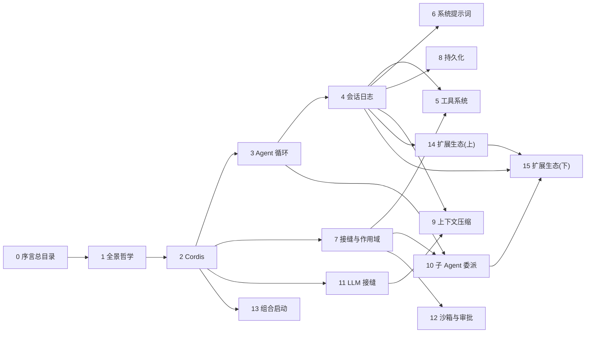

# 第0篇　序言与总目录
*作者：Amlei　·　更新时间：2026-08-13*

## 序言

DeepSeek Harness（`dsh`）是 DeepSeek AI 开源的插件式 agent harness——一个把大语言模型驱动成"会调工具、能持续多轮、可持久记忆"的智能体的运行时框架。它用 TypeScript 写成，约 43 万行代码，跑在 vendored 的 Cordis 插件框架上。

本书不讲"怎么用 `dsh`"。市面上不缺使用手册。本书反过来追问：**它是怎么被造出来的？** 每一个核心机制——同步循环、事件溯源会话、守卫工具管线、可换后端的持久化、上下文压缩、子 agent 委派、沙箱与审批——都拆到 `文件:行号`，让读者能在脑子里复现它的代码实现。

### 立场

- **第三人称客观**。本书是剖析，不是布道。设计取舍讲"为什么这样选"，也讲"代价是什么"。
- **受众是未知深度的学习者**。不预设你读过 agent 框架的源码，但也不把术语当黑盒。生僻概念在用到处就地加"知识补充"，并在下面「概念入门」集中释疑。
- **反知识诅咒**。写书的人容易忘了自己当年不懂什么。本书刻意把"看似显然、实则关键"的细节（如"为什么创建事务要折叠进单个 effect""为什么 chunk 必须占连续 seq"）讲透，不假定读者已经知道。

### 一句话主线

`dsh` 的全部设计可归到一句口号：**Everything is a plugin.**（万物皆插件）。没有特权内核；连循环、工具注册表、会话日志、模型适配器都是可替换的插件。这一句话是贯穿全书的总纲。

## 读者指南

- **怎么读**：建议初读者按序读到[第四篇](part-04-session.md)，建立"事件溯源 + 循环"的心智模型，再按兴趣跳读。每篇相对自洽，但都预设你读过[第二篇](part-02-cordis.md)（Cordis）和[第七篇](part-07-seams-scope.md)（接缝与作用域）。
- **导航锚点**：正文凡提及其它篇的**具体章节**，都写成可点击的 markdown 链接（如"见[第三篇·第 6 章](part-03-agent-loop.md)"）。点过去就知道找什么。
- **配图**：复杂关系（架构、状态机、时序、依赖图）用 Mermaid（点击可放大）；简单示意（数据流、依赖链）用 ASCII。每张图必有简短图注。
- **权衡总账**：每篇末尾收束该子系统的设计取舍——讲"牺牲了什么，换来了什么"。
- **代码片段**：穿插在散文中的真实源码片段，首行是 `# 文件:行号` 注释，可作代码导航索引。代码不替代散文——散文先讲清"为什么这样设计"，代码紧跟着让读者看到"具体怎么写的"。

## 概念入门

下列术语在正文中保留源词、不作中译（括注给出学习者级解释）。第一次遇到时回看这里。

- **Agent**：智能体。保留源词（"代理"在本类内容里特指 proxy/delegate，易生歧义）。sub-agent → 子 Agent。
- **harness**：原意"挽具"，这里指把 LLM "套"起来驱动成 agent 的运行时框架。
- **plugin**：插件，Cordis 的程序组装单元。一个实现了 `Service` 的对象。
- **context**（Cordis 里）：插件共享的服务仓库，通过 `ctx.<key>` 寻址。**不是**"上下文"——后者本书用"上下文/请求上下文"指模型看到的对话历史。
- **capability seam**（能力接缝）：一个可替换能力的三角色（Service Definition 声明 / Service Provider 实现 / Consumer 使用）分割。详见[第七篇](part-07-seams-scope.md)。
- **turn / step**：回合 / 步。turn 是一段可取消的活动区间（对应一条用户输入的"会话回合"）；step 是一次模型请求加它调用的工具。详见[第三篇](part-03-agent-loop.md)。
- **session log**（会话日志）：append-only 的事件序列，是 agent 交互的唯一真相源。详见[第四篇](part-04-session.md)。
- **waterfall / serial / emit / parallel**：Cordis 事件的四种分发模式。waterfall 是 around 中间件（必须调 `next()` 委派，否则短路）；serial 是抢占式 veto（返回真值即停）；emit 是不等待的广播；parallel 是等待并行的屏障。详见[第二篇·第 5 章](part-02-cordis.md)。
- **declaration merging**（声明合并）：TypeScript 允许在不同文件里对同一个 interface 反复"追加"成员，编译时合并。`dsh` 用它让插件给核心类型追加变体而不碰 owning 包。
- **brand / branded id**：编译期打标的字符串类型（如 `SessionId`），运行时擦除。让两个运行时都是 string 的 id 在类型层面不可互换。详见[第七篇·第 7 章](part-07-seams-scope.md)。
- **reversible effect**（可逆副作用）：通过 `ctx.effect()`/`ctx.on()` 注册的贡献，返回一个 disposer，卸载时按序 unwind。详见[第二篇·第 6 章](part-02-cordis.md)。
- **FTS5 / WAL**：SQLite 的全文检索扩展（FTS5）/ 预写式日志（WAL，一种让读写并发的机制）。详见[第八篇](part-08-persistence.md)、[第十五篇·第 6 章](part-15-ecosystem.md)。
- **landlock**：Linux 内核的路径访问限制机制（LSM）。进程构建 allowlist 规则集后应用到自身，在 `execve` 间继承。详见[第十二篇·第 5 章](part-12-security.md)。
- **Typert**：`dsh` 自研的跨进程类型图与 RPC 网关，让 `@Remote` 方法在进程边界有编译期类型校验。详见[第十四篇·第 1 节](part-14-ecosystem.md)。
- **prefix cache / KV cache**：模型推理时，请求前缀的 key-value 缓存。相同前缀可复用，省算力。`dsh` 把会变的运行时上下文放在稳定 prompt 缓存前缀之后，正是为了不破坏这个缓存（见[第六篇·第 8 章](part-06-system-prompt.md)）。
- **TOCTOU**：Time-of-check to time-of-use，"检查与使用之间的竞态"。`Session.append` 用单次递归 pass 同时校验和拷贝，就是为了防这种竞态（见[第四篇·第 3 章](part-04-session.md)）。
- **fail-closed**：失败时拒绝（关闭），而非放行。`dsh` 的每条安全边界都 fail-closed。详见[第十二篇](part-12-security.md)。

## 总目录

| 篇 | 主题 | 主旨 | 前置 / 延伸 |
|---|---|---|---|
| [第一篇](part-01-overview.md) | 全景与设计哲学 | 项目定位、八条核心设计决策、代码地图 | — / 全书 |
| [第二篇](part-02-cordis.md) | Cordis 插件框架 | 五句话、四种事件模式、可逆副作用 | — / 全书地基 |
| [第三篇](part-03-agent-loop.md) | Agent 循环（turn/step） | turn/step 双层、inbox、创建事务 | 第二篇 / 核心驱动 |
| [第四篇](part-04-session.md) | 会话日志（事件溯源） | SessionEventMap、surface、deriveMessages | — / 唯一真相源 |
| [第五篇](part-05-tools.md) | 工具系统 | 六阶段守卫管线、monotonic guard、Code Mode | 第七篇 / model-facing 入口 |
| [第六篇](part-06-system-prompt.md) | 系统提示词装配 | 每步重读、scoped shadows global、complete section | 第四篇 / 每步重读 |
| [第七篇](part-07-seams-scope.md) | 能力接缝 + 作用域 | 三角色、scope 两方向、Map→union、branded id | 第二篇 / 贯穿范式 |
| [第八篇](part-08-persistence.md) | 会话持久化 | flush batching、crash 恢复、JSONL/SQLite | 第四篇 / crash 恢复 |
| [第九篇](part-09-compaction.md) | 上下文压缩 | 锁 bracket、surface replace、pressure/overflow | 第四、十一篇 / surface replace |
| [第十篇](part-10-subagent.md) | 子 Agent 委派 | 6 provider、composeFrom bind、delegation depth | 第三、七篇 / 6 provider |
| [第十一篇](part-11-llm.md) | LLM 适配接缝 | vocabulary、adapter 注册、BlockAssembler | 第二篇 / adapter 注册 |
| [第十二篇](part-12-security.md) | 沙箱与审批 | landlock、approval fail-closed、permission preset | 第七篇 / fail-closed |
| [第十三篇](part-13-boot.md) | 组合与启动 | profile/bundle/patch、agent-presets、standing mount | 第二篇 / profile/bundle |
| [第十四篇](part-14-ecosystem.md) | 扩展生态（上）：核心扩展 | Typert、workflow、session-projection、attachment、storage | 全书 / 核心扩展 |
| [第十五篇](part-15-ecosystem.md) | 扩展生态（下）：工具型扩展 | hooks、skill、jobs、goal、spill、session-query、plan、todo | 全书 / 工具型扩展 |

## 章节关系图

读法建议：先 `0 → 1 → 2`（建立地基），再 `3 → 4`（循环 + 事件溯源的心智模型），然后 `7`（贯穿范式），之后可自由跳读。`14 → 15` 是收束两篇，依赖前面几乎所有篇。

## 贯穿主线

把全书读完，会发现六条主线反复出现：

1. **万物皆插件，注册即副作用。** 没有特权内核；每一项贡献都通过 `ctx.effect()`/`ctx.on()` 注册，卸载时 unwind。详见[第二篇](part-02-cordis.md)、[第一篇·第 2 章](part-01-overview.md)。

2. **事件溯源会话：消息历史是派生的。** session log 是唯一真相源；`deriveMessages()` 从它投影。模型可见 ⟺ 已记录。详见[第四篇](part-04-session.md)。

3. **能力接缝：换 provider = 换整个产品。** 三角色分割让契约/实现/使用独立演化。详见[第七篇](part-07-seams-scope.md)。

4. **显式优于隐式，fail-closed 优于宽容。** 默认值是显式 `resolve()` 步骤；安全边界失败时拒绝而非放行；配置错误大声失败。详见[第五篇](part-05-tools.md)、[第十二篇](part-12-security.md)。

5. **类型化事件的四种分发模式。** waterfall 协作式短路、serial 抢占式 veto、emit 不等待、parallel 等待并行——每种模式是公开契约。详见[第二篇·第 5 章](part-02-cordis.md)。

6. **可逆副作用的 teardown 顺序是承重的。** 顺序相关的 teardown 必须塞进同一个 generator effect，否则 sibling effect 并发卸载会丢 closing event。详见[第二篇·第 6 章](part-02-cordis.md)、[第三篇·第 6 章](part-03-agent-loop.md)。

记住这六条，`dsh` 的任何一个子系统都能被你"预测"——遇到新机制时，先问"它属于哪条主线？这条主线要求它怎么做？"，往往就能猜中。

---

*开始阅读：[第一篇　全景与设计哲学](part-01-overview.md)*
