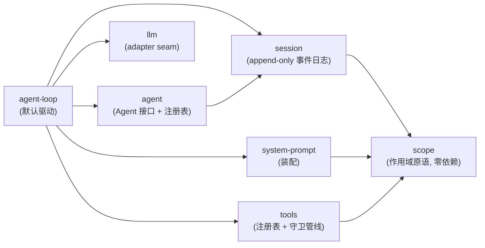
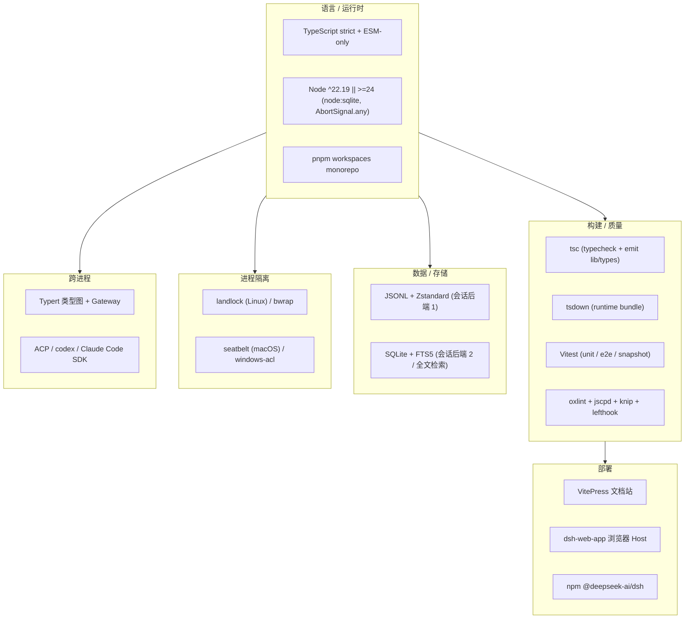

# 第一篇　全景与设计哲学
*作者：Amlei　·　更新时间：2026-08-13*

## 第 1 章　这是什么

DeepSeek Harness（命令名 `dsh`）是 DeepSeek AI 开源的**插件式 agent harness**——一个把大语言模型（LLM）驱动成"会调工具、能持续多轮、可持久记忆"的智能体的运行时框架。它用 TypeScript 写成，是一个 pnpm workspaces 的 monorepo，代码体量约 43 万行，跑在 vendored 的 Cordis 插件框架上。

它有一句口号，也是全书的总纲：

> **Everything is a plugin.**（万物皆插件。）

这不是修辞。在这套系统里，连"驱动 agent 跑一轮"的循环本身（`agent-loop`）、工具注册表（`tools`）、会话日志（`session`）、模型适配器（`llm`）都是可替换的插件。没有一个特权内核可供打补丁；扩展 `dsh` 的方式，是在其它插件旁边再挂一个插件。

本书不讲"怎么用 `dsh`"——那是用户文档的事。本书反过来追问：**它是怎么被造出来的？** 每一个核心机制（同步循环、事件溯源会话、守卫工具管线、可换后端的持久化、上下文压缩、子 agent 委派、沙箱与审批）都拆到 `文件:行号`，让读者能在脑子里复现它的代码实现。

### 1.1　术语约定

本书保留源词、不作中译的术语（括注给出学习者级解释）：

- **Agent**：智能体，保留源词（"代理"在本类内容里特指 proxy/delegate，易生歧义）；sub-agent → 子 Agent。
- **harness**：原意"挽具"，这里指把 LLM "套"起来驱动成 agent 的运行时框架，保留源词。
- **plugin**：插件，Cordis 的程序组装单元。
- **context**：Cordis 里插件共享的服务仓库，保留源词（非"上下文"，后者本书用"上下文/请求上下文"）。
- **capability seam**：能力接缝——一个可替换能力的三角色（声明/实现/使用）分割，见[第七篇](part-07-seams-scope.md)。
- **turn / step**：回合 / 步——turn 是一段可取消的活动区间，step 是一次模型请求加它调用的工具。
- **session log**：会话日志——append-only 的事件序列，是 agent 交互的唯一真相源。
- **waterfall / serial / emit / parallel**：Cordis 事件的四种分发模式，见[第二篇](part-02-cordis.md)。
- **brand / branded id**：编译期打标的字符串类型（如 `SessionId`），运行时擦除，见[第七篇·第 6 章](part-07-seams-scope.md)。
- **FTS5 / WAL**：SQLite 的全文检索扩展 / 预写式日志，见[第八篇](part-08-persistence.md)、[第十五篇·第 6 章](part-15-ecosystem.md)。
- **landlock**：Linux 内核的路径访问限制机制，见[第十二篇](part-12-security.md)。
- **Typert**：`dsh` 自研的跨进程类型图与 RPC 网关，见[第十四篇](part-14-ecosystem.md)。

## 第 2 章　八条核心设计决策

阅读 `dsh` 的源码，会发现几乎所有设计都能回溯到下面几条决策。理解它们，就理解了这套系统为什么"长成这样"。

### 2.1　没有特权内核，注册即副作用

`dsh` 没有一个"主程序"去调用各个子系统。整个运行时是一棵 **Cordis fiber 树** 加一组挂在 `ctx.<key>` 上的 service（`ctx.tools`、`ctx.sessions`、`ctx.llm`……）。每一项贡献（一段提示词、一个工具 schema、一个模型适配器、一个事件监听器）都通过 `ctx.effect()` 或 `ctx.on()` 注册，而**注册本身是一个可逆的副作用（reversible effect）**：它返回一个 disposer，插件卸载或重载时按注册逆序 unwind。

```ts
// packages/core/tools/src/index.ts:788, 832（节选）
export class ToolRuntime extends Service {
  static inject = ['systemPrompt']
  constructor(ctx: Context) {
    super(ctx, 'tools')
    // 工具系统一构造，就向 systemPrompt 注册一个"工具 schema 提供者"
    ctx.systemPrompt.tools(context => this.wireSchemas(context.scope))
  }
}
```

这段代码说明了一件事：连"工具注册表"自己也是一个 Service，它在构造时反过来向"系统提示词装配器"注册贡献。子系统之间不是"主程序调用"，而是"我注册，你发现"。Cordis 的 `inject` 声明让一个插件等它依赖的 service 出现后才激活，所以**加载顺序由 service 依赖决定，而非手写的 boot 序列**。

### 2.2　能力接缝：换一个后端，换整个产品

`dsh` 把"一个可替换能力"切成三个独立演化的角色：**Service Definition**（声明接口的抽象 Service）、**Service Provider**（实现）、**Consumer**（使用，通常是模型可见的工具）。这三者各是独立包。一个角色不构成接缝——加一个能力，必须同时设计全部三角色。

接缝的力量在于"换 provider = 换整个产品"。文件系统（`ctx.fs`）和子进程（`ctx.subprocess`）共享一个"执行世界"：当把这两个 provider 都指向一个远程沙箱（如 E2B），Bash、终端、LSP 会**一起**搬到那台远端 Linux 上，而不需要为每个工具单独写一个 provider 分叉。

### 2.3　事件溯源会话：消息历史是派生的

一个 agent 的全部交互历史，是一条 **append-only 的事件日志**（session log）。这条日志是唯一真相源。LLM 看到的消息历史不是存储对象，而是从日志**派生**（`deriveMessages()`）出来的投影。这带来一条铁律：

> **Model-visible ⟺ logged.**（模型可见的东西，一定能从日志重建。）

任何进入模型请求的内容，都必须可从日志重建；新增一种模型可见的输入，就必须新增一种会话事件。这条不变量在运行时被断言。

### 2.4　类型化事件的四种分发模式

Cordis 用 TypeScript 的声明合并（declaration merging）声明事件名，再按四种模式之一分发：`emit`（不等待、注册序观察、无返回）、`waterfall`（around 中间件，监听器必须调 `next()` 委派，否则短路）、`parallel`（等待、所有监听器并行）、`serial`（等待、注册序、首个真值返回即停）。分发模式是事件公开契约的一部分（用 `@mode` 标注），生成器会交叉校验声明与调用点。

> **知识补充：声明合并。** TypeScript 允许在不同文件里对同一个 interface 反复"追加"成员，编译时合并。`dsh` 用它让插件给核心类型（如 `SessionEventMap`）追加变体，而**不碰 owning 包的源码**。

### 2.5　Map → derived-union：可扩展的判别联合

几乎所有可扩展的联合类型都遵循一个模式：一个以判别标签为键的 interface（`…Map`），用 `keyof` 从它派生出联合。插件通过声明合并加变体，无需改动拥有该类型的包。`switch` 时分两类纪律——**封闭联合**（closed union，如 `ApprovalOutcome`）在 `default` 分支用 `assertNever`（加变体会编译失败）；**可合并联合**（merge-extensible，如 `SessionEvent`、`ContentBlock`）则**禁止** `assertNever`，必须显式 fall through 未知情况——因为插件加的是合法新变体，不是 bug。

### 2.6　显式优于隐式

在包的边界上，默认值永远是一个显式的 `resolve(request): Spec` 步骤，而非藏在 `run()` 里的 `?? default`。工具的 `timeoutMs`、并发安全标记、展示意图都是声明的一部分；模型请求只看严格白名单（`schemas()` 永不泄漏 `execute`/`finalizeContent`/`presentCall` 等回调）。配置错误要**大声失败**（fails loud）：能自包含判断就在加载时抛，否则在最早可解析点抛，从不静默跳过缺失的引用。

### 2.7　在类型化同进程边界信任 TypeScript

同进程、类型已约束的调用处，**不**加运行时校验、不写 fallback、不做恶意输入测试。运行时校验只在信任边界做：parser/config、队列、模型/工具 JSON、持久化/文件、worker、进程、wire。`Session.append` 在源头用一次递归 pass 校验整个 event data 是无损 JSON（拒绝 BigInt、函数、symbol、负零、循环引用、稀疏数组、Map/Set/Date），所以坏事件进不了日志，`session.events` 永远等于后端能持久化的东西。

### 2.8　可换后端 + monotonic 安全策略

持久化是接缝（JSONL / SQLite 两后端实现同一契约）；沙箱是接缝（landlock / bwrap / seatbelt / windows-acl）。审批是 fail-closed 的：没有回答者、没有 agent、回答者抛错，都降级为拒绝/不可用，而不是放行。工具的守卫（guard）是 **monotonic** 的——只能减权，没有 allow 结果，所以监听器顺序无法把一次否决翻回允许。

## 第 3 章　代码地图

`dsh` 的 monorepo 按"包组"组织，每个包是一个 `@deepseek-ai/dsh-<name>`：

```
vendor/      vendored 的 Cordis 源码（pinned 副本，可改）
packages/
  core/        产品 API 脊柱：session、system-prompt、tools、agent、agent-loop、scope
  llm/         LLM 能力：vocabulary + adapter seam + DeepSeek/pi-ai/replay providers + token-meter
  shell/       bash 能力：Service Definition + local/sandbox/pwsh providers + bash Consumers
  subprocess/  子进程能力 + local process-tree provider
  terminal/    持久终端会话
  fs/          文件系统能力 + 策略
  lsp/         语言服务器能力
  skill/       技能 provider 注册表 + catalog/loader 工具
  web/         web 能力：search/fetch providers + 工具 Consumer
  compaction/  上下文压缩能力 + basic provider + tool-result 剪枝
  subagent/    子 Agent 能力：6 provider + 委派 Consumers
  session/     持久会话数据：persistence + projection + title + telemetry + query
  sandbox/     进程沙箱接缝 + local provider + 策略
  interaction/ 审批/交互/权限/命令/ask-user
  boot/        启动组合（profiles）
  bundle/      可安装的 dsh --profile 补丁层 bundle
  preset/      每 session 的 agent 组合（preset cordis.yml）
  guard/       循环卫生 + 工具超时插件
  hooks/       Claude Code/Codex hook 桥 + wire-protocol 库
  api/         Remote BFF 装配 + Typert RPC 网关
  typert/      类型图 generator/loader/runtime registry
  …（详见各篇）
```

核心脊柱（core/）是每个组合都启动的六个包，它们的关系见图 1。

### 图 1　核心脊柱的依赖与数据流



一次 turn（回合）的数据流：驱动器在 `agent-loop` 里从 inbox 领取一条排队输入 → 在 `session` 上开一个 turn → 经 `system-prompt` 装配请求前缀、从日志派生历史 → 经 `llm` 流式取模型响应 → 经 `tools` 分发工具调用 → 把每个模型可见的事实追加回日志 → 下一步再从日志派生。`scope` 是让"每 agent 作用域注册"成为可能的零依赖原语，坐在依赖图最底层，被 session/system-prompt/tools 消费。

## 第 4 章　技术栈

`dsh` 的技术选型几乎全部服务于两条原则：**万物皆插件**（所以选了一个真正的插件框架 Cordis，而非自己造一个），**类型安全是边界纪律的基础**（所以 strict TypeScript + 编译期 brand，而非运行时校验满天飞）。

### 4.1　语言与运行时

| 层 | 选型 | 为什么 |
|---|---|---|
| 语言 | **TypeScript**，`strict: true` + `noImplicitAny`，ESM-only（`"type": "module"`） | 类型安全是边界纪律的基础（见[第 2 章·2.7 节](#第-2-章八条核心设计决策)）。ESM-only 跨包 import 用包名，包内相对 import 用 `.ts`。所有 `any` 必须解释为何无法 narrow。 |
| 运行时 | **Node.js** `^22.19 || >=24` | 用到 `node:sqlite`（SQLite 后端）、`Promise.withResolvers`、`AbortSignal.any`、`Iterator` helpers 等。Node 原生 TS 模式在引擎范围内不可用，故 CLI source launch 经 tsx 的 ESM-only hook（`node --import tsx/esm`）。 |
| 包管理 | **pnpm workspaces**，monorepo | 每个包是 `@deepseek-ai/dsh-<name>`；vendored 包 rescoped 到 `@deepseek-ai/*`，`private: true`，是每个 harness 包的 peerDependency。 |

> **知识补充：vendored（定制副本）。** `dsh` 把 Cordis 的源码 vendor 进 `vendor/cordis/`——不是 npm 依赖，而是 pinned 源副本（可改、可补丁）。rescope 后标 `private: true` 不发布。理由：每个 harness 包把 cordis 声明为 peerDependency，发布时就连这层一起发——用上游名字发等于在 npm registry 上 squat 了 cordiverse 的名字。

### 4.2　构建、测试、质量门

| 用途 | 工具 | 说明 |
|---|---|---|
| 类型检查 | `tsc`（每包一个 aggregate face） | `pnpm run typecheck`；`tsconfig.base.json` 是根面。Source plane vs artifact plane 永不混（静态门用 `paths` 解析到 `src`，消费 built `lib/` 的门显式声明）。 |
| 打包 | `tsdown`（runtime bundle） + `tsc`（emit `lib/types`） | `pnpm run build`。 |
| 单元测试 | **Vitest** | `pnpm run test`；CI 覆盖门是 `pnpm run test:coverage`（`packages/*/*/src` 每文件 100%）。 |
| E2E | Vitest，real-API（需 `DEEPSEEK_API_KEY`，无 key 自跳过） | `pnpm run test:e2e`。 |
| 快照 | keyless ACP/headless replay vs expected outputs | `pnpm run test:snapshot`；`test:snapshot:record` 重录（需 key）。 |
| Lint | **oxlint**（`.oxlintrc.json`） | `pnpm run lint`。 |
| 重复检测 | jscpd（跨文件 TS 克隆） | `pnpm run duplication`。 |
| 卫生 | knip + publint + workspace constraints + NodeNext consumer check | `pnpm run hygiene`。 |
| 文档门 | `pnpm run doc-sync`（generated catalog 校验等） | 所有 generated 段（`gen-cordis-catalog`/`gen-doc-graphs`/`gen-persistence-catalog`）必须 fresh。 |
| Hooks | **lefthook**（`lefthook.yml`） | pre-commit `git diff --cached --check`（文件恰好一个尾换行）。 |

> **测试纪律**：测试描述行为，不描述正确性——改过时的行为要连测试一起改，并在 PR 里说明为什么。每个非平凡的模型/产品用户可见行为变更，必须经真实可运行示例加/改一条 keyless 快照。

### 4.3　数据与存储

| 用途 | 选型 | 说明 |
|---|---|---|
| 会话持久化（后端 1） | **JSONL** + **Zstandard** 压缩 | append-only 一文件一会话，checksummed concatenated zstd 帧，crash-safe 原子写（link+unlink）。见[第八篇·第 5 章](part-08-persistence.md)。 |
| 会话持久化（后端 2） | **SQLite** via `node:sqlite` | 一行一 event，1:1 字段映射，`SCHEMA_VERSION` pragma gate，journal_mode=wal。见[第八篇·第 6 章](part-08-persistence.md)。 |
| 全文检索 | **SQLite FTS5**（`unicode61` tokenizer） | session-query 后端；rank `match_count DESC, document_length ASC`。见[第十五篇·第 6 章](part-15-ecosystem.md)。 |
| 非 session 存储 | storage-json / storage-sqlite（side-by-side） | 哪个后端服务哪个 consumer 是 domain 层 per-domain 路由表。见[第十四篇·第 5 章](part-14-ecosystem.md)。 |

> **知识补充：WAL（Write-Ahead Logging）。** SQLite 的预写式日志——写先进日志文件，读走主库，于是读写可并发。`dsh` SQLite 后端默认 wal，让多个 reader 与一个 writer 并行；网络挂载等不兼容 WAL 共享内存的环境回退到 delete/truncate/persist。

### 4.4　进程隔离与原生组件

| 用途 | 选型 | 说明 |
|---|---|---|
| Linux 沙箱 | **landlock**（内核 LSM）+ bwrap | native addon `@deepseek-ai/node-addon-landlock-run`，C 实现；ruleset 在 execve 间继承。见[第十二篇·第 5 章](part-12-security.md)。 |
| macOS 沙箱 | **seatbelt**（sandbox-exec） | 平台链按 OS 选。 |
| Windows 沙箱 | **windows-acl** | Everyone + 硬链接间隙报 `partial enforcement`。 |
| 子进程管理 | `ctx.subprocess` seam | bash/terminal/lsp/out-of-process subagent 都经它 spawn；owner-scoped teardown + kill 升级。 |

### 4.5　跨进程通信与协议

| 用途 | 选型 | 说明 |
|---|---|---|
| 跨进程类型安全 RPC | **Typert**（自研）+ Connection `/api` carrier | `@Remote`/`@RemoteScope` 经 analyzer 编译成 `FaceModel`/`TypeGraph`，Gateway 在 dispatch 时校验。signal 是 side-channel（不出现在 wire）。见[第十四篇·第 1 节](part-14-ecosystem.md)。 |
| ACP 子 agent | Agent Client Protocol（JSON-RPC over stdio） | `subagent-acp` 经 `@agentclientprotocol/sdk`。见[第十篇·第 9 章](part-10-subagent.md)。 |
| 外部产品桥 | codex app-server / Claude Code Agent SDK | `subagent-codex`/`subagent-claude-code`。 |

### 4.6　前端与部署

| 用途 | 选型 |
|---|---|
| 文档站 | **VitePress**（`website/`，`docs/` 的双语投影） |
| Web 应用 | 浏览器 Host + client plugin graph（`dsh-web-app` bundle） |
| CI | GitHub Actions + GitLab CI（`.gitlab-ci.yml`）；标签分类 `kind/*`/`area/*` |
| 部署 | `npx @deepseek-ai/dsh web`（npm 发布的 `dsh` 家族） |

### 图 2　技术栈分层



## 第 5 章　本书地图与读法

全书 16 篇。建议初读者按序读到[第四篇](part-04-session.md)，建立"事件溯源 + 循环"的心智模型，再按兴趣跳读。

| 篇 | 主题 | 前置 | 延伸 |
|---|---|---|---|
| [第二篇](part-02-cordis.md) | Cordis 插件框架 | — | 全书地基 |
| [第三篇](part-03-agent-loop.md) | Agent 循环（turn/step） | 第二篇 | 核心驱动 |
| [第四篇](part-04-session.md) | 会话日志（事件溯源） | — | 唯一真相源 |
| [第五篇](part-05-tools.md) | 工具系统 | 第七篇 | model-facing 入口 |
| [第六篇](part-06-system-prompt.md) | 系统提示词装配 | 第四篇 | 每步重读 |
| [第七篇](part-07-seams-scope.md) | 能力接缝 + 作用域 | 第二篇 | 贯穿范式 |
| [第八篇](part-08-persistence.md) | 会话持久化 | 第四篇 | crash 恢复 |
| [第九篇](part-09-compaction.md) | 上下文压缩 | 第四、十一篇 | surface replace |
| [第十篇](part-10-subagent.md) | 子 Agent 委派 | 第三、七篇 | 6 provider |
| [第十一篇](part-11-llm.md) | LLM 适配接缝 | 第二篇 | adapter 注册 |
| [第十二篇](part-12-security.md) | 沙箱与审批 | 第七篇 | fail-closed |
| [第十三篇](part-13-boot.md) | 组合与启动 | 第二篇 | profile/bundle |
| [第十四篇](part-14-ecosystem.md) | 扩展生态（上） | 全书 | 核心扩展：Typert/workflow/projection/attachment/storage |
| [第十五篇](part-15-ecosystem.md) | 扩展生态（下） | 全书 | 工具型扩展：hooks/skill/jobs/goal/spill/query/plan/todo |

**读者指南**：每篇末尾有"权衡总账"，收束该子系统的设计取舍。正文凡提及其它篇的**具体章节**，都写成可点击的 markdown 链接（点过去就知道找什么）。复杂关系用 Mermaid 图，简单示意用 ASCII。配图必有简短图注。

本书面向"未知深度的学习者"——不预设你读过 agent 框架的源码，但也不把术语当黑盒。生僻概念在用到处就地加"知识补充"，并在[第 0 篇](part-00-preface.md)的「概念入门」集中释疑。

## 权衡总账

- **万物皆插件**的代价是理解成本：没有一个"主程序"可以顺读，必须先建立"注册即副作用、依赖即激活条件"的心智模型。收益是极致的可替换性——换循环、换工具、换模型、换后端，都不需要 fork 代码。
- **事件溯源会话**的代价是写放大（每个 chunk 都进日志）和派生开销。收益是 resume/fork/压缩/transcript/telemetry 全都从同一条日志派生，"模型可见 ⟺ 已记录"这条不变量让历史永远可重建。
- **monotonic 安全策略**牺牲了"灵活放行"的便利，换来的是不可绕过的安全边界——一个被否决的工具调用，后续监听器无法翻案。

（贯穿主线见[第 0 篇](part-00-preface.md)「贯穿主线」；Cordis 的机制细节见[第二篇](part-02-cordis.md)。）
