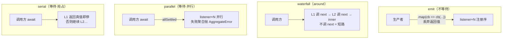

# 第二篇　Cordis 插件框架
*作者：Amlei　·　更新时间：2026-08-13*

`dsh` 跑在一个叫 **Cordis** 的插件框架上。它来自 cordiverse 社区，理论基础是一篇题为 *A Programming Paradigm for Spatiotemporal Composability*（时空可组合性编程范式）的论文。`dsh` 把它的源码 vendor（定制副本）进 `vendor/cordis/`，重命名到 `@deepseek-ai/cordis`，作为每个 harness 包的 peerDependency。

这一篇讲清 Cordis 的五个核心机制，因为后续每一篇都建立在它们之上。Cordis 源码在 `vendor/cordis/src/`，loader 在 `vendor/loader/`。

## 第 1 章　五句话讲清 Cordis

1. **插件是实现了 Service 的对象。** 它可以是一个带可选 `inject` 和 `apply(ctx)` 字段的函数，也可以是一个 `Service` 子类——Cordis 把它的生命周期挂进当前 context。
2. **context 是 service 仓库。** 一个 service 从 context 上认领一个稳定的 `ctx.<key>`（如 `ctx.tools`、`ctx.llm`、`ctx.sessions`）；其它插件通过 key 找 service，而不是 import 具体实现。
3. **用 `inject` 声明依赖。** 一个点名了所需 service 的插件会等到那些 service 存在才激活，所以加载顺序通过 service 依赖表达，而非手动 boot 序列。
4. **类型化事件用于通信。** service 通过声明合并声明事件名，再按 `emit`/`waterfall`/`parallel`/`serial` 分发——取决于监听器是观察、包裹、并行展开还是按序运行。
5. **注册是可逆副作用。** 提示词段、工具 schema、适配器、provider、监听器都通过 `ctx.effect()` 或 `ctx.on()` 安装，所以重载和卸载时按序 unwind。

## 第 2 章　Service：声明一个稳定的 `ctx.<key>`

Service 是"在 context 上挂一个稳定 slot"的抽象。构造即注册，fiber 卸载即注销。

```ts
// vendor/cordis/src/service.ts:42
constructor(protected ctx: Context, name: string) {
  name ??= this.constructor['provide'] as string
  let self = this
  self.ctx.reflect.provide(name, self, this[symbols.check])  // 注册进 reflect store
  return self
}
```

注册的实际工作是 `ctx.reflect.provide(name, self, check)`，而 `provide` 内部把整个注册包进一个 `ctx.fiber.effect(...)`——所以**"提供 service"本身就是一个可逆副作用**，fiber 卸载时自动注销并唤醒依赖它的 fiber。

两种插件形态在 fiber 的 `_runner.execute` 里分流：构造器 → `new callback(ctx, config)`；函数/`{apply}` 对象 → 直接调用。`Service.check`（`symbols.check`）是一个可用性谓词——依赖方在检查时调用它，返回假值则依赖不激活。Loader 自己用它实现"还有 entry 在加载则 loader 不就绪"。

## 第 3 章　Context 作为 service 仓库

Context 是一个 Proxy。读 `ctx.tools` 不走普通属性访问，而是走 reflect 的 `get` 拦截器：先查当前 fiber 链上的 `store`，受 isolation key 约束。

```ts
// vendor/cordis/src/reflect.ts:153-171（get 拦截器，节选）
get: (target, prop, ctx) => {
  if (Reflect.has(target, prop)) return getTraceable(ctx, Reflect.get(target, prop, ctx))
  // 沿 fiber 父链上溯查找 store[prop]，受 isolate key 约束
  return ctx.events.waterfall('internal/get', ctx, prop, error, () => { /* 查 store 链 */ })
}
```

这里有一个 Cordis 区别于普通 DI 容器的硬约束：**没有 `inject` 就读 service 会抛错**（不是返回 `undefined`）。`inject` 既是依赖声明（决定激活条件），也是**访问许可证**。想"可选读"用 `ctx.get('llm', strict)`，它不走 inject 检查。

`extend`/`isolate`/`intercept` 都不修改父 context，而是靠原型链或独立 map 派生子 context——这是"多插件共享 context 而不串扰"的根基。

## 第 4 章　inject：load order = service requirement

`ctx.plugin()` 创建 fiber 时把 `Inject.resolve(plugin.inject)` 传进去。fiber 构造后对每个 inject 名调一次检查，再 `_refresh`：

```ts
// vendor/cordis/src/fiber.ts:611
_refresh() {
  let epoch = ''
  for (const name of Object.keys(this.inject)) {
    const impl = this._store[name]
    if (!impl) { epoch = INACTIVE; break }   // 任一依赖缺失 → INACTIVE，挂起
    epoch += ':' + impl.fiber.uid            // 全齐 → epoch 是依赖 uid 的拼接
  }
  this._setEpoch(epoch)                      // epoch 变化触发 reload/unload
}
```

这里没有"先启动 A 再启动 B"的脚本，只有"A 声明 inject B，B provide 后 A 自动激活"。`_setEpoch` 检测 `INACTIVE` 与激活态的转换，才真正 `_reload()`/`_unload()`。epoch 用依赖 fiber uid 的字符串拼接——依赖任何一个换了实现，epoch 就变，于是 unload 再 reload。这就是热重载的机制基础。

当一个 service 被 provide/unprovide，`reflect.notify([name])` 会遍历所有 runtime 的所有 fiber，对 inject 了该 name 的 fiber 重算检查并 `_refresh`——依赖方自动被唤醒。

## 第 5 章　类型化事件的四种分发模式

这是 Cordis 最核心、也最容易讲错的部分。所有模式共用 `dispatch()` 做 listener 解析和 context 过滤，再各自驱动。

### 5.1　emit — 不等待、注册序、无返回

```ts
// vendor/cordis/src/events.ts:194
emit(...args) { this.dispatch('emit', args).map(cb => cb(...args)) }
```

listener 返回的 promise 被 `.map` 丢掉——**emit 是真正的 fire-and-forget**。生产者完全不等观察者。`dsh` 的 `session/event`（事件追加后的通知）就是 emit。

> **知识补充：listener 失败隔离。** `dsh` 的 `session/event` 没有用裸 `ctx.emit`，而是先 `collectSessionCallbacks`（拿一份 listener 快照），再手动逐个 try/catch 调用。因为 emit 的 `.map` 是同步的——如果一个 listener **同步**抛错，`.map` 会同步把错误抛回调用方。手动快照 + per-listener containment 才能保证即使同步抛错也不影响其它 listener 和已提交的 append。

### 5.2　waterfall — around 中间件，调 `next()` 委派

```ts
// vendor/cordis/src/events.ts:234
waterfall(...args) {
  const cbs = this.dispatch('waterfall', args)
  const inner = args.pop()                    // 最内层 next（默认行为）
  const next = () => { const cb = cbs.shift() ?? inner; return cb(...args) }
  args.push(next)
  return next()
}
```

listener 签名是 `(...args, next)`。调 `next()` 执行下游 listener；`next()` 的返回值就是下游链的最终值——可包装后作为本层返回。**不调 `next()` 直接 return 就是短路**（下游和默认 inner 都不跑）。注册序即包裹层序：先注册的在外层。`prepend: true` 用 `unshift` 插到队首，变成最外层——这是"我想包住所有人"的语义。

单决策事件用短路当设计意图：拥有决策权的 listener 不调 `next()`，只标注或观察的 listener 必须 `next()` 委派。`dsh` 的 `agent/pre-step`（决定模型看到什么）、`tools/pre-execute`（放行/否决/请求审批）都是 waterfall。

### 5.3　parallel — 等待、全部并行

```ts
// vendor/cordis/src/events.ts:183
async parallel(...args) {
  const results = await Promise.allSettled(this.dispatch('emit', args).map(async cb => cb(...args)))
  const errors = results.filter(r => r.status === 'rejected')
  if (errors.length) throw new AggregateError(errors.map(e => e.reason))
}
```

`allSettled`——**一个 listener 失败不会阻止其它 listener 跑完**，所有 settle 后聚合抛 `AggregateError`。调用方 await 到的就是"所有 listener 都落定了"。`dsh` 的 `session/flush`（持久化屏障）用它：flush 一定要等到所有持久化 listener 都落盘。

### 5.4　serial — 等待、注册序、首个真值返回即停

```ts
// vendor/cordis/src/events.ts:204
async serial(...args) {
  for (const cb of this.dispatch('serial', args)) {
    const result = await cb(...args)
    if (isBailed(result)) return result       // 非 null/false/undefined 即 bail
  }
}
```

第一个返回"真值"的 listener 决定结果，后续不跑。注意它与 waterfall 短路的区别：**waterfall 是"不调 next 就短路"（协作式），serial 是"返回 bail 值就停"（抢占式 veto）**。`dsh` 的 `agent/turn-stopping`（见[第三篇·第 2 章](part-03-agent-loop.md)）是 serial——但它的"停止与否"最终由数据决定，不是 listener 返回值。

事件声明里写 `@mode` 标签，生成器把声明和调用点的分发方法做交叉校验——**事件的分发模式是公开契约，不能随便换**。

### 图 1　四种分发模式对比



## 第 6 章　可逆副作用：disposer 与逆序 unwind

### 6.1　`ctx.effect()` / `ctx.on()` 都返回 disposer

```ts
// vendor/cordis/src/events.ts:254（register，被 ctx.on 用）
register(label, hooks, callback, options) {
  const method = options.prepend ? 'unshift' : 'push'
  return this.ctx.fiber.effect(() => {
    hooks[method]({ ctx: this.ctx, callback, ...options })
    return () => this.unregister(hooks, callback)   // disposer = 注销这个监听器
  }, label)
}
```

所以监听器和它所属的 fiber 同生共死，不用手动 `off`。

### 6.2　单个 effect 内部：disposer 逆序串行

```ts
// vendor/cordis/src/fiber.ts:427（effect 的内部 dispose）
const dispose = () => {
  if (disposing) return disposalTask                          // single-shot
  disposing = true
  let task
  for (const disposable of disposables.splice(0).reverse()) { // 逆序！串行 await
    if (task) { task = task.then(() => runDisposable(disposable)) }
    else { /* 同步或首异步 */ }
  }
  return disposalTask = task
}
```

单个 effect 收集的多个 disposer，**逆序串行** unwind。generator effect yield 出来的每个 disposer 都进同一个 `disposables` 列表。

### 6.3　复合（generator）effect 的 teardown 顺序是承重的设计

这是整个 Cordis 工程里最重要的点之一。`dsh` 的 `session.create()` 把"进入 store + announce"折叠进**一个** generator effect：

```ts
// packages/core/session/src/index.ts:836
this.ctx.effect(function* (this: SessionStore) {
  yield this.enter(session)    // 先 yield detach（注册 store entry + publication hooks）
  this.announce(session)       // announce 在 detach 之后
}.bind(this), 'sessions.create()')
```

注释明说：**先 yield detach 再 announce**，这样若 `session/created` 监听器同步抛错，generator effect 抛出的异常会按逆序 dispose 已 yield 的 disposer，把 store entry 连 publication hooks 一起回滚，而不是泄漏。

为什么必须折叠进单个 effect？因为 Cordis 对**不同 effect（sibling）的 disposer 用 `Promise.all` 并发清理**，对**同一 effect 内的 disposer 按 LIFO 链串行清理**。如果把"停 loop"和"摘 session"放进两个 sibling effect，fiber 卸载时它们会并发竞态——loop 还在 flush 最后一个 `turn/end`，session 的 append hook 已被摘掉，**closing event 就丢了**。这正是[第三篇·第 6 章](part-03-agent-loop.md)要讲的"创建事务折叠"的根因。

### 图 2　单复合 effect 的逆序 teardown

```
ctx.effect(function* () {
  yield detachA   ← disposer#0
  yield detachB   ← disposer#1
  yield detachC   ← disposer#2
})
  setup:    顺序收集 [A, B, C]
  teardown: disposables.splice(0).reverse() → [C, B, A] 串行 await
            → session.create(): yield enter() 先于 announce()
              故 teardown 先 detach store entry
  ⚠ sibling effects 之间是 Promise.all 并行（无序）——
    故顺序相关的 teardown 必须塞进同一个 generator effect。
```

## 第 7 章　Loader 配置：`!!js` / 插值 / overlay

Cordis 的配置文件 `cordis.yml` 描述要挂哪些插件。`dsh` 的组合分层（profile/bundle/patch）建立在它之上，见[第十三篇](part-13-boot.md)。这里只讲三个机制。

### 7.1　`!!js` 是表达式节点（不是 `!js`）

```ts
// vendor/include/src/index.ts:9
const JsExpr = new yaml.Type('tag:yaml.org,2002:js', {   // !!js = YAML 内置 tag URI
  kind: 'scalar', construct: (data) => ({ __jsExpr: data }), ...
})
```

`!!js` 是 YAML 内置 tag（`tag:yaml.org,2002:js`），解析成 `{ __jsExpr: "..." }` 节点。**它不是 Schemastery 的 `!js`**——这是两个东西，容易混。

### 7.2　插值：对 `ctx.serviceName` 求值

```ts
// vendor/loader/src/config/utils.ts:5
export const evaluate = new Function('ctx', 'expr', `with (ctx) { return eval(expr) }`)
export function interpolate(ctx, value) {
  if (isJsExpr(value)) return evaluate(ctx, value.__jsExpr)
  // 否则递归进对象/数组
}
```

`with(ctx)` 让 `!!js` 表达式直接写 `serviceName`、`process.env.X`。Loader 在 `internal/config` waterfall 里对**非 tree-carrier** 插件的 config 做插值——**时机是"声明的注入激活后"**，所以表达式能用到 `ctx.serviceName`。

### 7.3　overlay 做环境选择

patch 列表的 `insert`/`disabled` 在不同环境（dev/prod、bundle 层 → user 层 → `--patch`）叠加覆盖。关键设计：**input 永不修改、结果永远 detach**（否则热重载无法 revert）；**insert 的行会被立刻索引**，让同列表后续 patch 能配置或禁用它。

## 第 8 章　`dsh` 如何用 Cordis

### 8.1　为什么 vendor 而非 npm 依赖

每个 harness 包把 cordis 声明为 peerDependency，发布时就连这层一起发——用上游名字发等于在 npm registry 上 squat 了 cordiverse 的名字。所以 `dsh` 把它 vendor 进来，重命名到 `@deepseek-ai/*`（版本和目录名不动，只改 dependency key），标 `private: true`，作为可改的 pinned 源副本。

### 8.2　"万物皆插件"成立，因为连 loop/tools/session 都是 Service

`ctx.tools`、`ctx.llm`、`ctx.sessions`、`ctx.agents` 都是 service slot。`SessionStore` 不是普通类——它在构造里 `ctx.reflect.provide('sessions', this)` 把自己挂上 context。`agent-loop` 工厂在 `ctx.effect(() => ctx.agents.setFactory(this))` 里注册自己。**整个运行时就是一棵 fiber 树加一组 service，没有"主程序"。**

### 8.3　scope 包建在 effect 上

`dsh` 的 `scope` 包（见[第七篇](part-07-seams-scope.md)）让"每 agent 作用域注册"成为可能。它的三个原语（`createScope`/`scopeOf`/`scopeTarget`）都是零依赖纯函数，坐在依赖图最底层，靠的就是 Cordis 的 `Context.filter` 机制和 `fiber.effect`——它没有发明新东西，只是把 Cordis 已有的能力组合成"作用域"语义。

## 权衡总账

- **waterfall 的协作式短路**（不调 `next()`）让"拥有决策权的监听器"能干净地接管，但要求所有"只观察"的监听器记得调 `next()`——忘了调会静默挂起整个链。代价是约定的自觉性，收益是可组合的 around 中间件。
- **emit 不等待**让生产者（如 append 事件）不被观察者拖慢，但要求观察者自己做失败隔离——`dsh` 因此在 session 事件分发上手写了 per-listener containment。
- **可逆副作用**让热重载和优雅卸载成为可能，但要求把"顺序相关的 teardown"塞进同一个 generator effect——这是一个容易被忽略、但一错就丢 closing event 的纪律（见[第三篇·第 6 章](part-03-agent-loop.md)）。
- **没有 `inject` 就读 service 会抛错**（而非返回 undefined）让依赖关系显式且可静态推理，代价是初学者常被绊。

（事件分发模式的实际使用见[第三篇](part-03-agent-loop.md)的 turn/step、[第五篇](part-05-tools.md)的工具管线；可逆副作用在创建事务里的承重作用见[第三篇·第 6 章](part-03-agent-loop.md)。）
