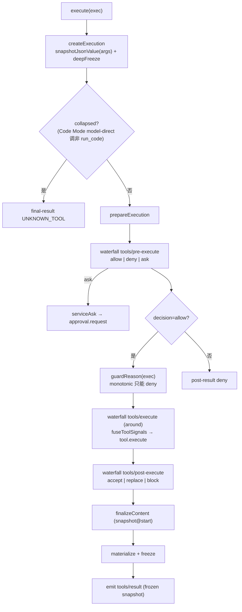

# 第五篇　工具系统
*作者：Amlei　·　更新时间：2026-08-13*

工具是模型"做"事的唯一入口。`dsh` 把"工具被模型看见、被策略放行、被执行、被持久化"收敛到一个注册表（`ctx.tools`）和一条守卫执行管线。这是核心脊柱里最大的包（约 5620 行）。

源码在 `packages/core/tools/`，核心是 `index.ts`（注册表 + 管线 + Code Mode 装配）、`code-mode.ts`（Code Mode 传输）、`schema.ts`（类型化 schema DSL）、`json-schema.ts`（强制的 JSON Schema 子集）、`presentation.ts`（UI 展示意 union）。

## 第 1 章　工具是 model-facing 能力的唯一入口

模型能"做"的事只有"调工具"。注册表是工具的统一边界——所有能力（fs/shell/web/subagent/skill/todo/terminal）都必须经此暴露。`ToolRuntime` 构造时即向 `systemPrompt` 注册一个"工具 schema 提供者"：

```ts
// packages/core/tools/src/index.ts:788, 832（节选）
export class ToolRuntime extends Service {
  static inject = ['systemPrompt']
  constructor(ctx: Context) {
    super(ctx, 'tools')
    ctx.systemPrompt.tools(context => this.wireSchemas(context.scope))
  }
}
```

这带来一个关键对偶："模型能看到什么"和"模型能调什么"是同一个 resolver（`view()`）的两个投影。

### 1.1　schemas() 的严格白名单

模型只允许看到 `{name, description, parameters}`。`execute`/`finalizeContent`/`timeoutMs`/`presentCall`/`presentResult`/`isConcurrencySafe`/`output` 全部剥离——否则模型可推断 harness 内部结构或策略。

```ts
// packages/core/tools/src/index.ts:1255-1267
private schemaOf(definition, detachParameters): ToolSchema {
  const { name, description, parameters } = definition
  const detached = detachParameters ? snapshotJsonValue(parameters) : parameters
  return { name, description, parameters: detached }
}
```

`detachParameters: true` 同时做"白名单投影"和"无损 JSON 物化快照"——防止模型 schema 引用到注册表内部可变对象。

## 第 2 章　ToolDefinition 与 defineTool DSL

### 2.1　ToolDefinition

```ts
// packages/core/tools/src/index.ts:222-288（节选）
export interface ToolDefinition extends ToolSchema {
  readonly output: ToolOutputDefinition        // 强制：schema + render(args, value): ContentBlock[]
  execute(args: unknown, exec: ToolRunContext): Promise<unknown>
  finalizeContent?(exec: Readonly<ToolExecution>, result: Readonly<ToolExecutionResult>): ContentBlock[] | undefined
  timeoutMs?: number
  isConcurrencySafe?(args: unknown): boolean
  presentCall?(args: unknown): ToolCallView | undefined
  presentResult?(args: unknown, result: ToolResult): ToolResultView | undefined
}
```

`output.schema` 是**强制的输出契约**——body 返回的值必须通过 `validateJsonSchemaValue(tool.output.schema, ...)`，违反抛 `ToolOutputError`；连 post-execute 替换的 `value` 也要重过。一个工具的核心规范输出声明，让结果可被校验、可被渲染。

### 2.2　defineTool 的软/硬校验分流

`defineTool` 编译 `parameters`→JSON Schema、`output.schema`→JSON Schema。`execute` 路径**硬校验**（抛 `ToolArgsError`）；`presentCall`/`presentResult`/`isConcurrencySafe` 路径**软校验**（失败降级 `undefined`/`false`，不抛）。

```ts
// packages/core/tools/src/schema.ts:585-616（节选）
async execute(args, exec) {
  const violations = validate(args)
  if (violations.length > 0) throw new ToolArgsError(violations)
  return userExecute(args as InferArgs<S>, exec)
}
// presentCall 软校验：失败降级 undefined
tool.presentCall = (args) => { if (validate(args).length > 0) return undefined; return userPresentCall(args) }
```

为什么软校验？因为这些回调会在 session-log replay 时跑在**任意历史 args**（可能是旧 schema 的）上，硬抛会让重放崩溃。`isConcurrencySafe` 软失败 → `false` → exclusive（故障关闭）。

## 第 3 章　六阶段守卫执行管线

`ctx.tools.execute()` 是循环调工具的唯一入口。它物化 args → pre-execute（waterfall）→ monotonic guards → execute（around）→ post-execute → finalizeContent → emit result。

### 3.1　阶段 0：物化 + 冻结 args

```ts
// packages/core/tools/src/index.ts:1411-1418
const detached = snapshotJsonValue(exec.arguments)   // 一次无损 JSON 物化边界
if (detached === undefined) throw new TypeError('tool execution arguments must be losslessly JSON-serializable')
const execution = { ...base, arguments: deepFreeze(detached) }
```

这是 **arguments 跨进程/跨历史的唯一物化边界**——之后整条管线（pre/guard/execute/post/finalize/listener）看到的都是同一个冻结副本。物化前先捕获 finalizer（防 getter 期间替换回调）。

### 3.2　阶段 1：tools/pre-execute（waterfall，allow/deny/ask）

`PreToolDecision = allow | deny{reason} | ask{reason?}`。`ask` 经 `serviceAsk` 路由到可选的 `ctx.get('approval')`——无服务/无 agent → degrade deny。**这是可扩展的 waterfall，listener 可 `ask` 提升到人类审批——"可加宽权限"的一端**。

```ts
// packages/core/tools/src/index.ts:1689-1729（serviceAsk，节选）
private async serviceAsk(exec, ask) {
  const approval = this.ctx.get('approval')
  if (approval === undefined) return { decision: { kind: 'deny', reason: ask.reason ?? `requires approval` }, ... }
  if (exec.agent === undefined) return { decision: { kind: 'deny', reason: `requires approval, but no agent` }, ... }
  const outcome = await approval.request({ agent: exec.agent, toolName: exec.name, callId: exec.callId, ... })
  switch (outcome) {
    case 'allowed-once': return { decision: { kind: 'allow' }, ... }
    case 'rejected':     return { decision: { kind: 'deny', reason: `the user rejected` }, ... }
    case 'unavailable':  return { decision: { kind: 'deny', reason: `no approval channel` }, ... }
    ...
  }
}
```

输入重写（input rewriting）被排除——arguments 已被日志记录和呈现，改写会破坏 history/audit/UI/execution 的一致性。

### 3.3　阶段 2：monotonic guards（只能减权，无 allow 结果）

这是全管线最核心的安全设计：

```ts
// packages/core/tools/src/index.ts:711-712
export type ToolGuard = (execution: Readonly<ToolExecution>) => string | undefined
```

**没有 allow 结果**。guard 只能在 pre-execute 允许之后**进一步否决**，永远不能把别人否决的翻回允许。

> **核心设计权衡**："Because guards have no allow result, listener ordering cannot turn a denial back into permission."（guard 没有 allow 结果，所以监听器顺序无法把一次否决翻回允许。）

这和 pre-execute 的可扩展 waterfall（可 `ask` 加宽）形成对称：**加宽只发生在外层 waterfall，收窄在内层 guard 不可逆**。

### 3.4　阶段 3：tools/execute（around，可换 signal 不可移除）

```ts
// packages/core/tools/src/index.ts:1532-1560（dispatchToolBody，节选）
private async dispatchToolBody(exec) {
  const fused = fuseToolSignals(state.callerSignal, exec.signal)   // 调用者 signal ∪ wrapper signal
  const signal = fused.signal
  exec.signal = signal
  try {
    const tool = this.resolveExecution(exec.name, exec.agent, exec.parent !== undefined)
    if (!tool) throw new ToolNotFoundError(exec.name)
    state.bodyInvoked = true
    const returned = await tool.execute(exec.arguments, exec)
    const result = this.createSuccessResult(exec, tool, returned)
    return isAborted(signal) ? toolAbortedResult(result) : result
  } finally { fused.dispose(); exec.signal = wrapperSignal }
}
```

around-wrapper 可以**替换** `exec.signal`（用于 timeout/retry），但 registry 在进 body 前用 `fuseToolSignals` 把调用者 signal 和 wrapper signal fuse 成一个新 controller——任一 abort 都触发。**body 跑的是 fused signal，不是 wrapper signal**，所以 wrapper 无法通过换信号来 detach 调用者取消。`state.bodyInvoked = true` 是 `ABORTED` vs `ABORTED_BEFORE_DISPATCH` 的分界（见第 7 章）。

### 3.5　阶段 4：tools/post-execute（accept/replace/block）

`PostToolDecision = accept{content?|value?} | block{feedback}`。`value` 替换经 `createSuccessResult` **重过 output.schema + 重新 render**——post-execute 不能塞一个违反契约的值；`content` 替换不重过 schema（只改呈现）；`block` 把成功结果翻成 `isError`，feedback 成 content。

### 3.6　阶段 5：finalizeContent

`finalizeContent` 在 execution start 时被 snapshot，**每个 normalized outcome 调一次（含管线失败）**。它只能返回 content 或 `undefined`，不能改 `value`/`meta`/`error`。

为什么它的签名收 `Readonly<ToolExecution>`（args 可能是 `undefined`）而非 typed args？因为 invalid-input 失败和外管线失败都汇流到 `finishScheduledExecution`，此时没有"通过校验的 typed args"。所以 `defineTool` 里它的签名是 `Readonly<ToolExecution>` 而非 `InferArgs<S>`，且必须 total、不能抛。

### 3.7　阶段 6：tools/result（frozen，emit）

```ts
// packages/core/tools/src/index.ts:1656-1676（节选）
private notifyResult(exec, result) {
  Object.freeze(exec)   // 冻结 registry 的 live 对象
  const callbacks = this.ctx.events.dispatch('emit', [scopeTarget(this, exec.agent), 'tools/result', exec, result])
  for (const callback of callbacks) {
    try { const returned = callback(exec, result); void Promise.resolve(returned).catch(reportFailure) }
    catch (error) { reportFailure(error) }
  }
}
```

`tools/result` 是 **emit**（广播，非 waterfall），observer 失败被 contained（只 warn，不改 outcome、不抛）。invariant companion 校验 `Object.isFrozen(exec)` 和 `Object.isFrozen(result.content)`。

### 图 1　六阶段执行管线



## 第 4 章　并发调度：parallel vs exclusive

只有 `isConcurrencySafe(args) === true`（精确 true）才 parallel；omission/异常/非 true/校验失败一律 exclusive——保守的 fail-closed。

```ts
// packages/core/tools/src/index.ts:1276-1285
executionMode(exec): ToolExecutionMode {
  const tool = this.resolveExecution(exec.name, exec.agent, exec.parent !== undefined)
  if (!tool?.isConcurrencySafe) return { kind: 'exclusive' }
  try {
    const concurrencySafe = tool.isConcurrencySafe(exec.arguments)
    return concurrencySafe === true ? { kind: 'parallel' } : { kind: 'exclusive' }
  } catch { return { kind: 'exclusive' } }
}
```

opted-in 的执行不得 mutate parent-owned state；共享状态必须容忍并发 dispatch。循环读这同一个 `executionMode()` 来形成 exclusive barrier 和 rolling-pool parallel run。

## 第 5 章　Code Mode：run_code 传输，model-direct vs sub-dispatch

Code Mode 下，模型只能直接调 `run_code`；`run_code` 程序通过 binding 调任意可见工具（sub-dispatch，带 parent token）。**核心区分是 parent token**：

```ts
// packages/core/tools/src/index.ts:1324-1326
private collapses(name, scope, nested): boolean {
  return !nested && this.modeFor(scope) === 'code' && name !== RUN_CODE_NAME
}
```

model-direct call（无 parent）在 code mode 下除 `run_code` 外全否决为 `UNKNOWN_TOOL`（不进管线，但带 reachable route 提示，见第 7 章）；sub-dispatch（有 parent）绕过 collapse 可调任意可见工具。

binding 物化 args **两次**（dispatched + logged 各一份 sibling parse），防 tool 改自己 args 让 log 失同步；确定性 subCallId `<parent>:code:<n>`；单 lane driver 按 submission order prepare→concurrent body→head-of-line commit。

`tools/code-dispatch-log` waterfall 可改 **durable log 副本**（`tool/code-dispatch` 事件的 content）——程序已经拿到完整 value，模型看不到 sub-call 内容（`deriveMessages` 忽略它）。典型用途是 spill policy 把超大文本结果换成 preview + locator。listener 抛 → contained，log 原 content。

## 第 6 章　ToolRestriction：作用域过滤的豁免

`restrict(allow|deny)` 编译私有 Set，跨 scope chain **intersect**；但 overlay scope 自己的注册**不被自己/祖先 restriction 过滤**——delegated child 保留它应答用的工具。`run_code` 不可 restrict。

> **最易讲错的点**：restriction 过滤的是 scope **inherit** 的表面（global + 祖先链），**永不过滤 scope 自己注册的东西**。原因：delegation runtime 往 child 的 own layer 注册汇报工具/structured-output 工具——若 restriction 能 strip 它们，child 就失去了应答机制。这里曾有一次真实回归（把豁免集误读成 "global layer" 而非 "非自身"，导致 preset 把工具移到 agent plane 后 child filter 失效）。

## 第 7 章　边界情况：UNKNOWN_TOOL 与两种 ABORTED

- **UNKNOWN_TOOL** 有两种：真未注册（bare "unknown tool"）vs code collapse（可见但 model-direct 调非 run_code，带 "call X from inside run_code" 的 reachable route）。collapse 的 denial 在 `createExecution` 就终止，**不进 pre-execute/guard 管线**。
- **ABORTED_BEFORE_DISPATCH**（`bodyInvoked = false` 时 cancel）vs **ABORTED**（`bodyInvoked = true` 后 cancel，只替换成功 outcome，body 抛的结构 error 保留）。
- **throwing tool 变结构 error**：body 抛/around 抛/listener 抛/materialize 抛全经 `toolErrorResult` 变 `ToolExecutionFailure`（仍走 finalizeContent → tools/result），没有"管线抛出逃逸到 caller"的路径。

## 第 8 章　canonical value 不进 durable log

```ts
// packages/core/tools/src/index.ts:555-566（节选）
export interface ToolExecutionSuccess {
  readonly isError: false
  /** Execution-local canonical value; deliberately omitted from durable events. */
  readonly value: JsonValue
  readonly content: ContentBlock[]
  readonly concludesTurn?: true
}
```

`value` 是 body 的原始结构化产物（经 output.schema 校验、深冻结），`content` 是 `output.render(value)` 的 model-facing 投影。durable 只存 content（+ meta，若工具声明了 presentationMeta 且是 top-level call）。这意味着 replay 时无法重建 value——这就是为什么 `ReadResultView`/`WebResultView` 要把结构化字段（lines/sources）额外塞进 `output.presentationMeta` 持久化，否则重放时 UI 无法重建结构化卡片。

## 权衡总账

- **monotonic guards（不可逆减权）vs extensible waterfall（可 ask）**：加宽只在外层可控点，收窄在内层无法被 listener order 翻转。代价是 guard 没有 allow 语义，必须记住"只减不增"。
- **arguments 不能 rewrite**：物化后冻结、log、present、execute 共用同一份。代价是 ask 路径不能给模型"修正后的参数"，收益是 history/audit/UI/execution 永远一致。
- **canonical value 是 execution-local**：牺牲了 replay 重建结构化中间值的能力，换来 durable log 的精简——但要求工具把 UI 需要的结构化字段显式塞进 presentationMeta。
- **Code Mode 的 parent token 区分**让"模型只能调 run_code"和"工具不可见"成为两件不同的事——collapse 否决的工具在 scope 里可见，只是执行边界否决。
- **finalizeContent 收 immutable execution**（args 可能 undefined）而非 typed args，是一个反直觉但必要的折衷——让 invalid-input 和外管线失败都汇流到它。

（工具 schema 如何进 system prompt 装配见[第六篇](part-06-system-prompt.md)；工具调用的 `tool/call`/`tool/result` 如何进 session log 见[第四篇·第 2 章](part-04-session.md)；ask 路径如何接到审批 seam 见[第十二篇·第 2 章](part-12-security.md)。）
