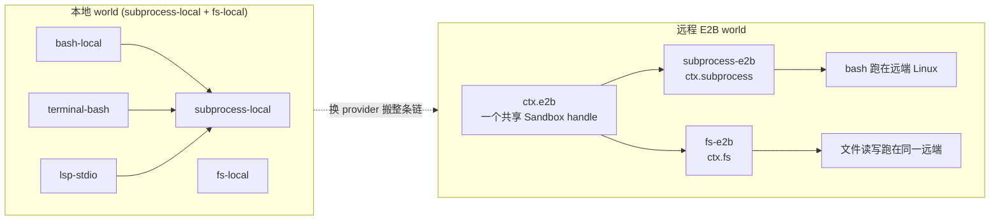
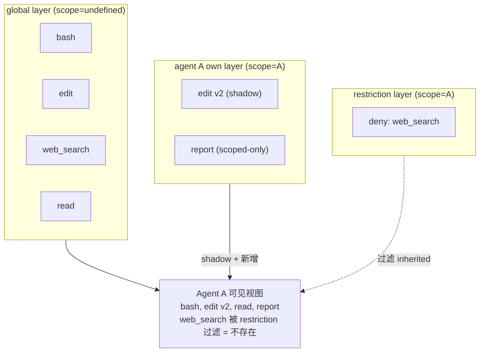

# 第七篇　能力接缝与作用域
*作者：Amlei　·　更新时间：2026-08-13*

这一篇讲 `dsh` 两条贯穿全局的设计主线：**(1) capability seam**——把一个可替换能力拆成三个独立演化的角色；**(2) scope**——让 per-agent 注册成为可能的零依赖原语。两者在 `agent.ctx` 处汇合：seam 的 consumer 通过 scope 看到它该看到的工具/section/限制。

接缝源码分散在各 capability 包的 SD（Service Definition）；scope 在 `packages/core/scope/`。

## 第 1 章　接缝 = 三角色，不是接口

> **seam** — 一个**可替换能力**，含三个角色：**Service Definition**（拥有 `ctx.<key>` 和词汇类型的 Cordis `Service`——一个抽象类如 `ShellExecutor`，或一个具体 registry 如 `WebRuntime`，**永远不是 TypeScript `interface`**）、一个或多个 **Service Provider**、一个或多个 **Consumer**。

关键非显然点：Service Definition 必须是 Cordis `Service`（抽象类或具体 registry），**永远不是 TS `interface`**——因为 interface 没有运行时载体，无法挂 `ctx.<key>` 声明合并。**"一个角色不是 seam"**——加一个能力，必须设计全部三角色。

### 1.1　SD 只拥有契约词汇

SD 包只导出抽象服务 + 词汇类型，不引任何 provider/consumer 实现：

```ts
// packages/shell/shell/src/index.ts:83
export abstract class ShellExecutor extends Service {
  constructor(ctx: Context) { super(ctx, 'shell') }
  abstract resolve(request: ShellExecRequest): ShellExecSpec
  abstract run(spec: ShellExecSpec): Promise<ShellRunResult>
  abstract start(spec: ShellExecSpec): ShellProcess
}
// packages/shell/shell/src/index.ts:56
declare module '@deepseek-ai/cordis' { interface Context { shell: ShellExecutor } }
```

SD 通过 `declare module` 往 `Context` 注入 `shell` 键——`inject: ['shell']` 的 consumer fiber 会 pend 直到该键存在。

### 1.2　Consumer 只 inject 服务键，永不引 provider 类型

```ts
// packages/fs/tool-fs/src/index.ts:22
export const inject = ['tools', 'fs', 'systemPrompt']
```

consumer 包的 `inject` 让它的 fiber 在 `ctx.fs` 出现前 pend；它从不 import `fs-local`/`fs-sandbox` 的任何类型——所以换 provider 不触发 consumer 重编译或模型 schema 变更。

## 第 2 章　两种接缝形态

### 2.1　单实现 per context（fs/shell）

bash seam 每个 context 只允许一个 executor（第二个 mount 抛 cordis 的 duplicate-service 错）。这对 bash 正确（一台机器、一种跑命令的方式）。

### 2.2　命名 provider 注册表（subagent/llm）

```ts
// packages/subagent/subagent/src/index.ts:8-10（注释）
// MULTIPLE providers coexist here: each registers under a unique name and a caller picks one by name.
// The shape mirrors the LLM adapter registry, not the single-service bash executor.
```

subagent 必须多种实现**共存**——同一会话里父 agent 可能既想要一个廉价同进程 child，又想要一个隔离的 ACP 异进程 child。所以 subagent 复制的是 **LLM adapter registry** 的形状（见[第十一篇](part-11-llm.md)、[第十篇](part-10-subagent.md)）。

## 第 3 章　换 provider = 换整个产品

文件系统（`ctx.fs`）和子进程（`ctx.subprocess`）共享一个"执行世界"：指向远程沙箱时，Bash、终端、LSP 会**一起**搬走，没有 provider 分叉——因为它们都 build 在 `ctx.subprocess` 上。

E2B 是最典型的例子：`ctx.e2b` 拥有**一个**共享的 E2B SDK handle，fs-e2b 和 subprocess-e2b await 同一个——所以 bash 进程写的文件，fs-e2b 立刻能读，同一台远端 Linux runtime。

```ts
// packages/e2b/e2b/src/index.ts:84-145（节选）
export class E2BRuntime extends Service {
  private readonly ready: Promise<Sandbox>
  constructor(ctx, config) { super(ctx, 'e2b'); ...; this.ready = this.open() }
  async getSandbox(): Promise<Sandbox> {
    if (this.disposed) throw new Error('E2B sandbox service is disposing')
    const sandbox = await this.ready
    if (this.disposed) throw new Error('E2B sandbox service is disposing')
    return sandbox
  }
}
```

`ready` 是构造里 `this.open()` 返回的 `Promise<Sandbox>`，被两个 provider **await 同一个**。disposal 时 `sandbox.kill()` 一次性拆掉整个 world。

### 图 1　切 provider 搬走整个执行世界（E2B 例子）



## 第 4 章　scope：零依赖的作用域原语

`dsh-scope` 是一个**零依赖 library**，坐在依赖图最底层（session/system-prompt/tools/agent-loop 都消费它，但它不反向依赖它们——避免循环依赖）。

```ts
// packages/core/scope/src/index.ts:14-18
export type ScopeKey = object              // opaque, identity-compared
const kScope = Symbol('dsh.scope')
```

`ScopeKey = object`——scope 包**永不检查** key 的形状。约定是 live `Agent` 对象当自己的 key，但原语对此一无所知。`kScope` 是私有 Symbol，通过 `ctx.extend({ [kScope]: key })` 写进 Cordis context 的 inheritance chain。

### 4.1　三个原语

```ts
// packages/core/scope/src/index.ts:137
export function createScope(ctx, key, options?): Scope {
  if (options?.parent !== undefined) bindScopeParent(key, options.parent)
  const fiber = ctx.plugin(scope)
  const scoped = fiber.ctx.extend({ [kScope]: key })
  return { ctx: scoped, rawDispose: fiber.dispose, dispose: () => (disposing ??= quiesceFiber(fiber)) }
}
// packages/core/scope/src/index.ts:154
export function scopeOf(ctx): ScopeKey | undefined {
  return (ctx as Context & { [kScope]?: ScopeKey })[kScope]
}
// packages/core/scope/src/index.ts:170
export function scopeTarget<T extends object>(base: T, key): Scoped<T> {
  // 建 routing-only carrier，用 Context.filter 做 scope 路由
}
```

### 4.2　一条 scopeParents 链驱动两个方向

这是 scope 最核心、最易讲错的设计。同一条 `scopeParents` WeakMap 驱动**两个相反方向**：

- **注册视图继承 DOWN**（子 scope 看到祖先的 layer）——`ScopedLayers.chainLayers` 从子往上遍历。
- **事件分发 UP**（祖先 listener 收后代的事件）——`scopeTarget` 的 filter 从 listener 的 tag 往上找，dispatch key 的祖先链上任何一个匹配就放行。

```ts
// packages/core/scope/src/index.ts:33-38（注释）
// registration views inherit DOWN the chain (a child scope sees its ancestors' layers),
// event admission extends UP it (a listener tagged with an ancestor receives events dispatched to a descendant key).
```

## 第 5 章　per-agent scoped-registration

通过 `agent.ctx` 注册的工具/section/限制/监听器，只对该 agent 可见，且 agent 卸载时随 fiber unwind——**一条事实驱动可见性和生命周期**。

```ts
// packages/core/scope/src/store.ts:226（ScopedLayers.effect，节选）
effect(ctx, action, options) {
  const scope = scopeOf(ctx)
  const dispose = ctx.effect(function* (this) {
    let layer
    if (scope === undefined) { layer = this.global }
    else {
      const existing = this.scoped.get(scope)
      layer = existing ?? (this.scoped.set(scope, this.createLayer(scope)), this.scoped.get(scope))
    }
    // ...
  })
}
```

**同一个 `ctx` 决定两件事**：`scopeOf(ctx)` 决定注册进哪层（可见性），`ctx.effect(...)` 决定谁拥有 teardown（生命周期）。所以 `agent.ctx` 上的注册 = scope-visible **AND** scope-lifetime。

`bindScopeParent` 注册后**拒绝重链**——只有原始 binder 持有的 `ScopeParentBinding.rebind` 才能动。这是 "blank-session recompose" 契约的守卫（rebind 仅在旧 parent 下产生的东西全不留时合法，见[第十三篇](part-13-boot.md)）。

## 第 6 章　作用域事件分发

`this: Scoped<Agent>` 的事件是 scope-filtered 的——agent 事件只发给在该 agent scope 上注册的 listener。

```ts
// packages/core/agent/src/dispatch.ts:94, 107（节选）
export function agentCarrier(agent: Agent): Scoped<Agent> { return scopeTarget(agent, agent) }
export function agentEvents(ctx, agent, carrier = agentCarrier(agent)) {
  const fused = <K>(payload) => ({ ...payload, agent })   // 把 agent 同时当 scope key 和 subject 注进 payload
  return { emit(name, payload) { /* 用 carrier dispatch */ }, ... }
}
```

`agentEvents` 把 `agent` 同时当 scope key **和** subject 注进 payload——spread 在前，防一个结构上可接受的 payload 覆盖注入的 subject。

`scoped-events.generated.ts` 声明三档语义：resolver 函数（payload 暴露 routing key，invariant 校验 carrier key === subject）、null（payload 无法暴露外部 routing key，invariant 只校验 carrier 存在）、absent（事件不是 scope-filtered，裸 dispatch 合法）。

### 6.1　tools/change 故意不过滤

`tools/change` 是一个 **registry-subject event**——事件关于注册表本身（加了工具），不是关于某个 agent 的活动，所以**故意不过滤**，广播给所有 scoped listener。一个全局工具集变化影响每个 agent 的下次装配。

## 第 7 章　Map → derived-union 与 Branded ID

### 7.1　六个 canonical map

`ContentBlockMap`、`MessageSourceMap`、`FinishReasonMap`、`TurnEndReasonMap`、`SessionEventMap`、`ModelModalityMap`。插件经 `declare module` 加变体，**不碰 owning package**。

```ts
// packages/llm/llm/src/types.ts:99
export interface ContentBlockMap {
  'text': TextBlock; 'reasoning': ReasoningBlock; 'image': ImageBlock
  'tool-call': ToolCallBlock; 'tool-result': ToolResultBlock
}
export type ContentBlock = ContentBlockMap[keyof ContentBlockMap]   // 自动派生
```

两类 union 两套纪律：**封闭联合**（如 `ApprovalOutcome`、`JsonSchemaType`）在 `default` 用 `assertNever`（加变体编译失败）；**可合并联合**（`ContentBlock`/`SessionEvent`/`FinishReason`）**禁止** `assertNever`，必须显式 fall through unknown case（plugin 加的是合法新变体，不是 bug）。

### 7.2　Branded ID

```ts
// packages/util/brand/src/index.ts:24
declare const BRAND: unique symbol
export type Branded<B extends string> = string & { readonly [BRAND]: B }
```

`Branded<B>` 是一个 **type-only 零依赖包**（无运行时代码、无依赖），编译期 nominal typing，运行时完全擦除。构造走 owning 包的 factory（内部是纯 cast，零成本）；比较/log/JSON 都当普通 string。只 brand 跨包且可能混淆的 id（`SessionId`、`CallId`、`JobId`、`CompactionId` 等）。

## 第 8 章　restriction 的豁免（再强调）

[第五篇·第 6 章](part-05-tools.md) 已讲过：restriction 过滤的是 scope **inherit** 的表面（global + 祖先链），**永不过滤 scope 自己注册的东西**。这个豁免是 chain-aware 的——把豁免集误读成 "global layer" 而非 "非自身" 曾是真实 bug。

### 图 2　scope 链如何 shadow globals（per-agent 工具视图）



关键：`edit v2` 和 `report` 在 own layer，**豁免于 restriction**。restriction 只过滤 inherited（global + 祖先）。

## 权衡总账

- **seam 三角色**让契约/实现/使用独立演化，但要求"加能力 = 设计全部三角色"——即使起初只有一个 provider，也要想清楚三角色边界（"一个角色不是 seam"）。代价是前期设计成本，收益是后期的 provider 可换性。
- **单实现 vs 命名注册表**是两种接缝形态——fs/shell 单实现（换 provider = 换掉整个），subagent/llm 命名注册表（多 provider 共存）。混为一谈是常见错误。
- **scope 一条链两方向**（注册 DOWN、事件 UP）是简洁但反直觉的设计——读代码时容易只看到一个 `scopeParents` WeakMap 就以为只有一个方向。
- **restriction 豁免 own layer**让 delegated child 保留应答机制，但要求读者理解"过滤 inherited 而非自身"。
- **Branded ID**零运行时代价换来编译期的 id 防混，但只对跨包 id 有意义——不是每个 string 都 brand。
- **两类 union 两套纪律**（closed 用 assertNever，merge-extensible 禁用）是一个必须记住的约定——对 merge-extensible union 用 assertNever 会把 plugin 的合法新变体当 bug。

（scope 如何被 agent-loop 用来做创建事务见[第三篇·第 6 章](part-03-agent-loop.md)；工具 restriction 的具体实现见[第五篇·第 6 章](part-05-tools.md)；preset 的 standing mount 与 composeFrom 如何用 scope 见[第十三篇](part-13-boot.md)、[第十篇·第 6 章](part-10-subagent.md)。）
