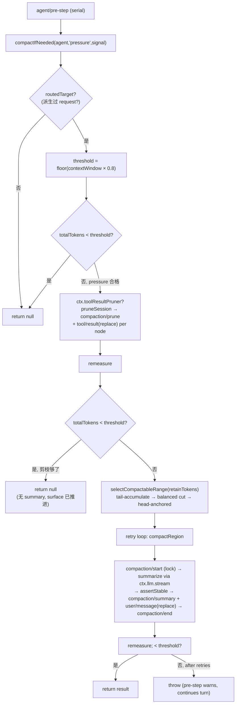

# 第九篇　上下文压缩
*作者：Amlei　·　更新时间：2026-08-13*

当一个 agent 的历史越来越长，模型上下文会逼近窗口上限。压缩（compaction）把一段历史折叠成一条摘要——但 `dsh` 的做法不是"删 event"，而是 **surface replace**：日志始终 append-only，surface 投影变。这一篇讲这个接缝的锁语义、摘要如何骑在 `user/message` 上、以及 pressure/overflow 两种触发。

源码在 `packages/compaction/`：`compaction`（SD）、`compaction-basic`（provider）、`compaction-tool-result-pruner`（剪枝）、`command-compact`（Consumer）。

## 第 1 章　为什么是可选能力，而非循环内置

压缩是**一个可选 capability seam**——三角色（`dsh-compaction` SD / `compaction-basic` provider / `command-compact` Consumer）。它不是 `agent-loop` 脊柱的一部分，所以它的词汇在这里，而非在[第三篇](part-03-agent-loop.md)。

### 1.1　为什么 surface replace 而非删 event

`SurfaceEventType` 对消息型事件封闭（`user/message | assistant/message | tool/result`），`compaction/*` 事件**不能**带 `surfaceOp`（编译器 + Session 的 append/seed 校验拒绝）。所以摘要必须骑在一条普通 `user/message` 上，log 保留括号，surface 投影折叠时跳过被 shadow 的节点（见[第四篇·第 4 章](part-04-session.md)）。

## 第 2 章　三个 compaction/* 事件（全 log-only）

```ts
// packages/compaction/compaction/src/types.ts:16-89（节选，declaration merging 进 SessionEventMap）
'compaction/start': { compactionId; sourceCommandId?; turn: number | null }  // turn:number 被开 turn 包围；null=独立手动
'compaction/summary': { compactionId; summary: ContentBlock[]; shadowedRange: {start;end}; shadowedSeqs: number[]; shadowedTokenCount; provider; model; ... }
'compaction/end':   { compactionId; turn: number | null; error?: string }     // 自带 error，无独立 error 事件
```

三个非显然点：

1. **`compaction/end` 自带 `error?`**——单事件即可判成败，镜像 `tool/result` 自包含 error 的设计。
2. **`shadowedRange` 是 position span，非 numeric seq 区间**。先前 replace 落地后，新 summary seq 更大却落在旧 position，下一轮 `start` 可能 `>` `end`。权威集合是 `shadowedSeqs`（surface order）。
3. **shadow-price 协议**：`compaction/summary`（摘要）和 `compaction/prune`（剪枝）都是"定价事件紧贴其后的 surface `replace`"——pure consumer 减 shadowed token 不需保留 per-node state。

## 第 3 章　锁 bracket：最后释放锁 = crash 变可检测孤儿

核心事务在 `compactSurfaceRegion`：

```ts
// packages/compaction/compaction-basic/src/region.ts:183-217（节选）
const startEvent = session.append('compaction/start', lifecycle)   // 1. 先 append start（持锁）
try {
  const summarized = await summarizeCompaction(…, signal)          // 2. 慢模型调用
  assertStable(dependencies, session, summarized)                  // 3. 稳定性复核
  const pending = commitCompactionBody(session, startEvent, summarized)  // 4. summary + user/message(replace) 落地
  const endEvent = session.append('compaction/end', lifecycle)     // 5. 最后 append end（释放锁）
}
```

**`compaction/end` 是 try 块里最后一个 append**。若 crash 发生在摘要期间，log 里只有 `compaction/start` 无匹配 `end` = **可检测孤儿**（detectable orphan），而非假成功。这是有意的偏离——很多压缩实现先 summarize 再记锁，crash 窗口就变成静默损坏。

失败时仍尝试闭合一次（带 `error`）；若 close append 本身失败，unmatched start **故意**保持可见且阻塞——不假装成功。

### 3.1　marker 是 time point，非独占容器

`compaction/start`/`end` 是锁的获取/释放时刻，**不独占**其间的所有 event。无关的 idle `inject()`（非唤醒、turn 间）可在手动 start…end 间插一条 `user/message`；手动稳定性只校验 selected span。

## 第 4 章　摘要骑在 user/message 上

唯一 surface 变更由摘要压缩执行：

```ts
// packages/compaction/compaction-basic/src/region.ts:447-465（节选）
const summaryEvent = session.append('compaction/summary', { compactionId, summary, shadowedRange, shadowedSeqs, shadowedTokenCount, provider, model, ... })
session.append('user/message', checkpointMessage, {
  surfaceOp: { op: 'replace', start, end },                       // THE surface mutation
  sourceEventSeqs: [startEvent.seq, summaryEvent.seq, ...shadowedSeqs],  // 覆盖被替换 + bookkeeping
})
```

`sourceEventSeqs` 必须覆盖所有被 shadow 的 event **外加** bookkeeping 事件——replay 据此校验替换 cite 了它移除的每一个 event。

### 4.1　checkpoint source 让 consumer 识别

`compactCheckpointSource(compactionId, sourceCommandId?)` 构造一个带 `kind:'plugin', plugin:'compact'` 标记的 source，放在 cordis-free 的 `./checkpoint` leaf——client/wire 程序可识别 checkpoint source 而不加载 host plugin。`isCompactCheckpointSource()` 是 backend 无关识别符。

### 4.2　摘要必须小于被遮内容

```ts
// packages/compaction/compaction-basic/src/region.ts:368-378（节选）
if (framedSummaryTokenCount >= prepared.shadowedTokenCount) {
  throw new Error(`summary is not smaller than the shadowed content`)
}
```

收敛不变量：摘要 framed 后的 token 数必须严格小于被遮内容。否则压缩没意义，抛错。

## 第 5 章　孤儿锁分类：live vs stale

```ts
// packages/compaction/compaction-basic/src/region.ts:286-298（节选）
function assertCompactionInactive(unmatchedCompactionStart, latestEndSeedSeq, stage) {
  if (unmatchedCompactionStart === undefined
    || (latestEndSeedSeq !== undefined && latestEndSeedSeq > unmatchedCompactionStart.seq)) return   // stale：有更新 end-seed
  throw new ManualCompactionError('busy', `${stage}: compaction already in progress`)
}
```

- **live 未匹配 start**（在最新 `session/end-seed` 之后）→ 所有入口报 `busy`。
- **stale 未匹配 start**（有更新的 `session/end-seed`）→ resume/fork/adoption 不被死 writer 卡住。

`session/end-seed`（见[第四篇·第 7 章](part-04-session.md)）在这里派上用场：它之前的未闭合 `compaction/start` 必属已结束的生命周期。

## 第 6 章　compactNow：手动，turn:null 独立 bracket

手动入口必须**同步启 idle task 于任何异步前**——否则检查与相位 claim 是两步，waking send 可在中间启动 driver。

```ts
// packages/compaction/compaction-basic/src/index.ts:368-420（节选）
override compactNow(agent, signal, sourceCommandId?) {
  signal.throwIfAborted()
  try {
    return agent.runMaintenance(async (agentSignal) => {           // 同步占 idle phase
      const range = selectCompactableRange(agent.session, this.ctx.tokenMeter.measure(agent.session), 0)
      if (range === null) return null                              // no-op 不写
      return await compactSurfaceRegion(..., { owner: null, stability: 'selected-span', ... }, operationSignal)
    })
  } catch (error) {
    throw new ManualCompactionError('busy', '...requires an idle agent with no waking queued work', { cause: error })
  }
}
```

`runMaintenance` 同步 claim idle 相位（见[第三篇·第 5 章](part-03-agent-loop.md)），waking send 仅在它 settle 后启 FIFO。no-op 不写（`range === null` 直接 return，不 append start）。`AbortSignal.any` 合并 agent-owned 与 request signal；cancellation 保留精确 reason 优先级。

## 第 7 章　pressure 触发：agent/pre-step，剪枝先于 range 选择

自动 pressure 在 `agent/pre-step`（waterfall serial）跑，在**前一 response/tool-result/context/steering 都已 durable 之后、下一 request 派生之前**。

```ts
// packages/compaction/compaction-basic/src/index.ts:281-331（节选）
const prune = this.ctx.get('toolResultPruner')                  // 可选
// pressure 分支：
if (prune !== undefined) {
  prune.pruneSession(agent.session)                              // 先落地 model-free 剪枝
  measurement = meter.measure(agent.session)                     // 经 singleton 重测
}
if (measurement.totalTokens < spec.thresholdTokens) return null  // 剪枝后够了就不再 summary
// 否则选 summary range
for (let attempt = 0; attempt <= spec.compactionRetries; attempt += 1) {
  const range = selectCompactableRange(agent.session, measurement, spec.retainTokens)
  if (range === null) { if (result === null) return null; break }
  result = await this.compactRegion(range.start, range.end, agent, signal)
  measurement = meter.measure(agent.session)
  if (measurement.totalTokens < spec.thresholdTokens) return result
}
```

**剪枝先于 range 选择**：pressure 合格后，先 model-free 剪枝，重测，若已达标则**无 summary 推进 surface**。pressure 失败只 warn 并 `next()` 继续 turn——压缩是尽力而为，不阻断 agent loop。

### 7.1　保留尾部选择（head-anchored）

`selectCompactableRange` 从尾往前累加到 `retainTokens`，然后扩到 tool 配对平衡处——**永远从 head 压**。**保 tool 配对不保 whole turn**，允许 runaway turn 的早期已闭 step 被压缩而近期 step 留原样。

## 第 8 章　失败请求恢复：agent/request-error

overflow 恢复挂在 `agent/request-error`（waterfall），仅处理 `CONTEXT_WINDOW_EXCEEDED`，在**失败 step 关闭后**。

```ts
// packages/compaction/compaction-basic/src/index.ts:179-223（节选）
ctx.on('agent/request-error', async ({ agent, failure, signal }, next) => {
  if (failure.code !== CONTEXT_WINDOW_EXCEEDED_CODE || signal.aborted) return next()
  const generation = agent.session.surface.replaceGeneration          // 记录恢复前 generation
  let result
  try { result = await this.compactIfNeeded(agent, 'context-overflow', signal) }
  catch (recoveryError) {
    // model-free 剪枝可能在后续 summary 失败前已落地；durable 进展足够 retry
    if (!signal.aborted && agent.session.surface.replaceGeneration > generation) {
      this.overflowRetries.set(agent, retries + 1); return { kind: 'retry' }   // 即使 summary throw，仍 retry
    }
    return next()                                                      // 无 durable 进展 → 保留原错
  }
  if (signal.aborted || agent.session.surface.replaceGeneration <= generation) return next()
  this.overflowRetries.set(agent, retries + 1); return { kind: 'retry' }  // 仅当 replaceGeneration 推进才 retry
})
```

**仅当 `surface.replaceGeneration > generation`（surface replace 真的推进）才返回 `{kind:'retry'}`**——即使后续 summary 在剪枝后 throw，只要剪枝已落地推进了 generation，仍 retry。cancellation 仍赢。

### 图 1　pressure → pruner → range → summary → replace 流程



## 第 9 章　tool-result 剪枝（model-free，确定性）

`ToolResultPruner` 是独立 `ctx.toolResultPruner` 服务，**不实现 `CompactionEngine`**。对每个超 budget 的 `tool/result` 做 head/middle/tail 剪枝。

### 9.1　measureContent：Unicode code point

```ts
// packages/compaction/compaction-tool-result-pruner/src/index.ts:68-74
measureContent(blocks) {
  let chars = 0
  for (const block of blocks) { if (block.type === 'text') chars += codePointLength(block.text) }   // 非 text block 计 0
  return chars
}
```

`codePointLength = Array.from(text).length`——按 Unicode code point 计，**非 UTF-16 code unit**。

### 9.2　pruneContent：不拆 surrogate pair

```ts
// packages/compaction/compaction-tool-result-pruner/src/index.ts:83-122（节选）
const points = Array.from(block.text)                             // code point 数组 → 不拆 surrogate pair
const text = points.slice(0, headEnd).join('') + marker + points.slice(tailStart).join('')
```

`Array.from(block.text)` 把 string 拆成 code point 数组再 slice——**不拆 surrogate pair**（一个 emoji 不会断成半个）；但 **grapheme cluster 可能被拆**（如带 ZWJ 的复合 emoji），文档明示此权衡。PRUNE_MARKER 全局只插一次。

### 9.3　pruneSession：插 shadow-price event

```ts
// packages/compaction/compaction-tool-result-pruner/src/index.ts:136-184（节选）
session.append('compaction/prune', {                              // 前面插 shadow-price event
  shadowedRange: { start: seq, end: seq }, shadowedSeqs: [seq], shadowedTokenCount: ...
})
const replacement = session.append('tool/result', { ...event.data, message }, {
  surfaceOp: { op: 'replace', start: seq, end: seq },            // content-only 单节点改写
  sourceEventSeqs: [seq],                                          // cite 被替换 node
})
```

每个 over-budget tool result **替换保留完整 event data 除 content**；替换前插 `compaction/prune` shadow-price event——pure consumer 减该 node 的 heuristic 价**无需 per-node state**。默认 budget：`thresholdChars: 8192, headChars: 4096, tailChars: 1024`。

## 第 10 章　ManualCompactionError 六码

`busy | cancelled | changed | summary | commit | persistence`。语义边界：

- `changed` / `summary`：**不改 surface**，但 log 含 `compaction/start` + `compaction/end{error}`。文案明说"conversation unchanged; attempt recorded in the session log"。
- `commit`：可跟部分 mutation——"some history may have changed"。
- `persistence`：**in-memory bracket 已闭合**但 `flush()` 失败——压缩逻辑完成，只是没落盘。

## 权衡总账

- **锁最后释放**（crash 变可检测孤儿）是有意偏离 summarize-first 的设计——代价是失败路径要"仍尝试闭合一次"，收益是 crash 安全。
- **shadowedRange 非 numeric seq 区间**（start 可能 > end）让 replace 后非单调 seq 可表达，但要求权威集合是 `shadowedSeqs`，读者不能当 seq 区间遍历。
- **marker 是 time point 非独占容器**让无关 idle injection 可插在手动 start…end 间，手动稳定性只校验 selected span——代价是消费者要按 seqs + 相对序理解，而非假设区间内全是 compaction。
- **overflow 恢复的 retry 条件是 replaceGeneration 推进**而非"摘要成功"——即使 summary throw，只要剪枝推进了 generation 就 retry，避免丢弃 durable 减量。
- **changed/summary 失败不改 surface 但改了 log**——三码的"surface 是否变/是否落盘"边界不同，混讲会误导 retry 决策。
- **tool-result 剪枝用 Unicode code point**（非 UTF-16）保 surrogate pair 完整，但 grapheme cluster 可能拆——一个明确的权衡。

（surface replace 的投影机制见[第四篇·第 4 章](part-04-session.md)；token-meter 如何测见[第十一篇·第 5 章](part-11-llm.md)；routed 摘要调用见[第十一篇](part-11-llm.md)。）
