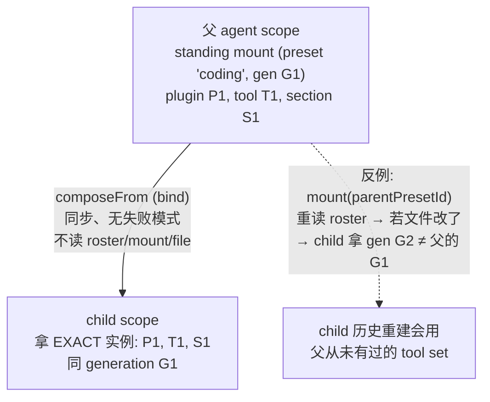

# 第十篇　子 Agent 委派
*作者：Amlei　·　更新时间：2026-08-13*

"一个 agent 把工作委派给另一个 agent"是复杂任务的核心能力。`dsh` 把它收敛成一个**命名 provider 注册表** + 一个**能力校验的 start API** + 一个**可选的 Activation 持续编排器**，让六种完全不同的后端（同进程新 agent / 同进程 fork 会话前缀 / 四种异进程产品）在同一个 `ctx.subagents` 服务后面共存。

源码在 `packages/subagent/`：`subagent`（SD + continuation 编排）、`subagent-in-process-driver`（spawn/fork 共享发动机）、`subagent-{spawn,fork}-in-process`、`subagent-{acp,codex,claude-code,dsh-sdk}`、`tool-subagent`、`tool-subagent-control`。

## 第 1 章　为什么是命名 provider 注册表

bash seam 每个 context 只允许一个 executor（第二个 mount 抛错），这对 bash 正确——一台机器、一种跑命令的方式。但 subagent 必须**多种实现共存**——同一会话里父 agent 可能既想要一个廉价同进程 child，又想要一个隔离的 ACP 异进程 child。所以 subagent 复制的是 **LLM adapter registry** 的形状（见[第十一篇](part-11-llm.md)），不是单服务 bash executor。

```ts
// packages/subagent/subagent/src/index.ts:171（SubagentRuntime，节选）
export class SubagentRuntime extends Service {
  private providers = new Map<string, SubagentProvider>()
  registerProvider(provider: SubagentProvider): () => void { /* effect-scoped, HMR safe */ }
  async start(name, request): Promise<SubagentRun> { /* ... */ }
  async startContinuable(spec): Promise<ContinuableStart> { /* ... */ }
  async followup(parent, childId, content, options): Promise<MessageId> { /* ... */ }
}
```

六种 provider 各注册一个唯一 name（`spawn`/`fork`/`acp`/`codex`/`claude-code`/`dsh-sdk`），调用方按 name 选。

## 第 2 章　两能力发现方式

### 2.1　start-time 特性用 capabilities flag

```ts
// packages/subagent/subagent/src/types.ts:86
export interface SubagentCapabilities {
  readonly outputSchema: boolean
  readonly depthLimit: boolean
  readonly toolFilter: boolean
  readonly persona: boolean
}
// packages/subagent/subagent/src/index.ts:481（fail loud, no silent degradation）
private assertCapabilities(provider, request) {
  const needs = [
    { when: request.outputSchema !== undefined, cap: 'outputSchema' },
    { when: request.maxDepth !== undefined, cap: 'depthLimit' },
    { when: request.toolFilter !== undefined, cap: 'toolFilter' },
    { when: request.persona !== undefined, cap: 'persona' },
  ]
  for (const { when, cap } of needs) if (when && !provider.capabilities[cap])
    throw new SubagentError(`... does not support the "${cap}" capability`, 'UNSUPPORTED_CAPABILITY')
}
```

### 2.2　continuable 创建用方法存在性

```ts
// packages/subagent/subagent/src/index.ts:433
private async prepareContinuable(name, request) {
  const provider = this.expectProvider(name)
  if (provider.prepareContinuable === undefined)
    throw new SubagentError(`... does not support continuable children (no prepareContinuable capability)`, 'UNSUPPORTED_CAPABILITY')
  return provider.prepareContinuable(request)
}
```

为什么 continuable 不用 flag？因为 flag 会和实现**漂移**（flag 说支持但方法没写）。用方法存在性 + TS narrowing，flag 永远不能谎报。

in-process 的 spawn/fork 全开 4 个 capability；四个 out-of-process provider 全是 `NO_START_CAPABILITIES`（异进程无法 honor parent-enforced 特性）。

## 第 3 章　Provider 契约

```ts
// packages/subagent/subagent/src/types.ts:285（节选）
export interface SubagentProvider {
  readonly name: string
  readonly capabilities: SubagentCapabilities
  /** 仅描述会话历史是否继承；不暗示 tool/service/authority 继承 */
  readonly inheritsParentContext: boolean
  start(request): Promise<SubagentRun>
  prepareContinuable?(request): Promise<ContinuableCreateSpec>   // OPTIONAL：方法存在即能力
}
```

`inheritsParentContext` 是**纯描述性**字段——只描述会话历史是否 seed 进 child，不经过 service 校验，更不等于 tool/service/authority 继承。它只让 tool 生成对模型诚实的措辞（fork 说"已继承已完成轮"，spawn/acp 说"全新"）。

## 第 4 章　spawn vs fork（同进程）

spawn 和 fork 不自己创建 Agent，全交给共享 driver `startInProcessRun`——**唯一的区别就是 `options.seed`**（spawn 传 `{}`，fork 传 `{seed}`）。provider 本身只剩两行差异化代码。

### 4.1　spawn：全新 child

```ts
// packages/subagent/subagent-spawn-in-process/src/index.ts:41（节选）
class SpawnInProcessProvider implements SubagentProvider {
  readonly capabilities = { outputSchema: true, depthLimit: true, toolFilter: true, persona: true }
  readonly inheritsParentContext = false
  start(request) { return startInProcessRun(request, {}) }   // 无 seed
}
```

最廉价的 transport——同 cordis context 上一个全新 Agent，自己的 session、自己的 system prompt、零父上下文。

### 4.2　fork：继承 completed-turn 前缀

```ts
// packages/subagent/subagent-fork-in-process/src/index.ts:48（节选）
function completedTurnPrefix(parent: Agent): SessionEvent[] {
  const events = parent.session.events
  const lastEnd = events.findLast(e => e.type === 'turn/end')
  if (lastEnd === undefined) return []
  return events.slice(0, lastEnd.seq + 1)   // 到（含）最后一个 turn/end，in-flight turn 排除
}
class ForkInProcessProvider implements SubagentProvider {
  readonly inheritsParentContext = true
  start(request) {
    const seed = completedTurnPrefix(request.parent)
    return startInProcessRun(request, { ...seed.length > 0 ? { seed } : {} })
  }
}
```

fork 一个继承父会话**已完成轮**的 child——child 看到"到上一个 `turn/end` 为止"的父历史，但**不包含进行中的那一轮**。

> **反直觉点（最易讲错）**：普通 session branching 严格要求 fork 前缀必须结束在 open turn 外（见[第四篇·第 8 章](part-04-session.md)）；但 **subagent-fork 故意保留 completed-prefix clipping**——因为 tool-time 委派在父 turn 开启时就启动了，那时父的当前 turn 还没 `turn/end`，不能进 seed，否则 seed 不 balanced、invariants replay 拒绝。

## 第 5 章　共享 in-process driver：创建事务 + 单 turn 驱动

```ts
// packages/subagent/subagent-in-process-driver/src/index.ts:102（节选）
export async function startInProcessRun(request, options): Promise<SubagentRun> {
  assertSubagentMaxDepth(request.maxDepth)
  const childDepth = resolveChildDepth(request.parent, request.maxDepth)   // parent depth + 1
  const childId = SessionId(randomUUID())
  const activationBoundary = seed?.length ?? 0                              // fork-lineage 边界
  const inherited = captureDelegatedPolicyOverrides(parent)                 // 第一个 await 前捕获
  const setup = (childCtx) => {
    appendDelegatedPolicyOverrides((childCtx.agent as Agent).session, inherited)
    applyChildComposition(childCtx, parent, { persona: request.persona, toolFilter: request.toolFilter })
    if (request.outputSchema !== undefined) structured = attachStructuredRuntime(childCtx, request.outputSchema)
    attachDescriptorAppend(childCtx, request.descriptor)
  }
  const handle = await parent.ctx.agents.create({ sessionId: childId, meta: childSessionMeta(parent, childDepth, activationBoundary), ...seed !== undefined ? { seed } : {}, agentOptions: ..., signal: request.signal, setup })
  return drivePublishedRun(handle, request.signal, request.prompt, childId, activationBoundary, structured)
}
```

`activationBoundary = seed?.length ?? 0`：fork child 读 result 时只看 boundary 之后的事件——seed 来的父历史不算 child 自己的工作。**result 永不 reject**（seam 契约）：child 层失败 resolve 成 `stopReason: 'error'`，只有不可表示的 infrastructure fault 才 reject。

## 第 6 章　委派深度：持久化跨 restart/resume

给递归委派一个绝对上限，防止 in-process child 看到委派工具无限递归。

```ts
// packages/subagent/subagent/src/depth.ts:28
export function delegationDepthOf(agent: Agent): number {
  return Math.max(agent.session.header.delegationDepth ?? 0, agent.options.subagentDepth ?? 0)
}
// packages/subagent/subagent/src/child-agent.ts:48
export function resolveChildDepth(parent, maxDepth) {
  const childDepth = delegationDepthOf(parent) + 1        // 父 depth + 1
  if (maxDepth !== undefined && childDepth > maxDepth) throw new SubagentDepthError(childDepth, maxDepth)
  return childDepth
}
```

> **反直觉点**：**header 是单调下限，runtime 只能加深不能降**。一个 resumed child 带着新的 fresh options 到达；如果从零计数，它就能像 top-level 一样委派——所以 persisted header 的 `delegationDepth` 是 floor，**runtime-only depth 会在 resume 后 reset 到 top-level**，这正是为什么必须持久化。`childSessionMeta` 把 `delegationDepth: childDepth` 写进 child header——这就是跨 restart/resume 持久化的落点。

## 第 7 章　composition 继承：composeFrom = bind 非 mount

child agent 必须继承父的 composition。但"继承"有两种实现：① mount（重读 roster、重解析 preset id → 重新组合一次）；② **bind**（直接复用父已组合的 standing scope 实例）。`dsh` 选 bind，因为 mount 会在 composition 文件被编辑后给 child 一个**不同 generation**。

```ts
// packages/preset/agent-presets/src/index.ts:290（JSDoc 直说 bind vs mount）
composeFrom(agentCtx, parentCtx) {
  const standing = standingMountFor(parentCtx)
  if (standing === undefined) return undefined
  this.bindings.set(agentKey, bindScopeParent(agentKey, standing.key))   // 直接 bind 到父的 standing key
  return standing.presetId
}
```

- **bind 是同步的、无失败模式**（不读 roster、不 mount、不碰 file），这正是 child 创建窗口（一个同步 `setup`）能用它的前提。
- **`composeFrom` 是 opportunistic**（`ctx.get('agentPresets')`，非硬依赖）。rosterless deployment 不 join、不报错——那里 model-facing rows 在 host composition，child 通过 global layer 已经看到。
- **recompose 的"仅 agent 未产出时有效"约束**：swap tools mid-conversation 会留下 logged tool calls，新 composition 做不出来。

```ts
// packages/subagent/subagent/src/child-agent.ts:163
export function applyChildComposition(childCtx, parent, composition) {
  childCtx.get('agentPresets')?.composeFrom(childCtx, parent.ctx)   // bind 到父 composition
  childCtx.systemPrompt.context({ name: 'subagent:delegation', order: 120, text: SUBAGENT_DELEGATION_CONTEXT })
  if (composition.persona !== undefined) childCtx.systemPrompt.section({ name: 'deployment:persona', order: 0, text: composition.persona })
  if (composition.toolFilter !== undefined) childCtx.tools.restrict(composition.toolFilter)
}
```

### 图 1　composeFrom bind vs mount 继承



## 第 8 章　委派策略继承：snapshot-at-delegation

sandbox/approval override 是 per-session log fold（见[第十二篇](part-12-security.md)）。in-process child 拿新 session，spawn child 曾 fallback 到 deployment 默认，fork child 只看到 completed-prefix 内的 switch——委派可能"放宽"一个已切到 read-only 的父。解法：delegation 边界在第一个 await 前**快照**父的显式 sandbox override，approval 钉死 `'never'`。

```ts
// packages/subagent/subagent/src/child-agent.ts:199
export function captureDelegatedPolicyOverrides(parent) {
  return {
    sandboxMode: parent.ctx.get('sandboxPolicy')?.overrideOf(parent.session),  // 只拷显式 override
    approvalPolicy: parent.ctx.get('approval') === undefined ? undefined : 'never',  // 有 approval 能力就钉死 never
  }
}
```

**snapshot-at-delegation 语义**：父之后的 switch 属于父的未来，不追溯改一个已运行的 child。冷恢复不重新捕获——persisted child log 已带 delegation 事件，replay log 就是状态。

## 第 9 章　四种 out-of-process provider

### 9.1　ACP（异进程，经 ctx.subprocess）

```ts
// packages/subagent/subagent-acp/src/index.ts:146（节选）
class AcpProvider implements SubagentProvider {
  readonly capabilities = { outputSchema: false, depthLimit: false, toolFilter: false, persona: false }
  readonly inheritsParentContext = false
  start(request) {
    const spec = { command, args, cwd: resolveCwd(this.config.cwd, request), permission, env,
      spawn: spec => this.ctx.subprocess.spawn(spec), ... }   // 经 ctx.subprocess，不自己 child_process
    return startAcpRun(request, spec)
  }
}
```

从 `request.parent` **只读**一样东西：session workspace cwd（且仅当无 deployment `cwd` override 时）。`resolveCwd` 失败 loud：没有 cwd 又没配 override 就抛错——绝不 fallback 到 harness 进程 cwd。

### 9.2　Codex（codex app-server --stdio）

spawn 真实 `codex app-server --stdio`，只在初始化 + 临时 thread 创建后发布 run。`processFailure` 常驻 race：child 进程在 run settle 前退出 → reject。`isContextWindowExceeded` 把 codex 的 `contextWindowExceeded` 映射成 `max-tokens` stop reason。

### 9.3　Claude Code（官方 Agent SDK）

调官方 `@anthropic-ai/claude-agent-sdk` 的 `query()`：

```ts
// packages/subagent/subagent-claude-code/src/run.ts:177（节选）
export function claudeQueryOptions(spec, controller, capture) {
  return {
    abortController: controller, cwd: spec.cwd, pathToClaudeCodeExecutable: spec.executable,
    env: { ...scrubbedParentEnv(), ...spec.env },
    persistSession: false, disallowedTools: ['AskUserQuestion'],
    spawnClaudeCodeProcess: (options) => {
      const child = spec.spawn(claudeSpawnSpec(options, spec.disposeGraceMs))   // 劫持 SDK 的 spawn，进共享 subprocess owner
      capture(child); return new ManagedClaudeCodeProcess(child)
    },
  }
}
```

**劫持 SDK 的 `spawnClaudeCodeProcess`**，把真实 CLI 进程从 SDK 自己的 `child_process` 换到共享 `ctx.subprocess`——这样 CLI 骑在共享 scrub + tree-scoped teardown + service-owned lifetime 上。

### 9.4　dsh-sdk（另一个完整 dsh 实例）

每个 child 是一个**完整 DeepSeek Harness runtime**跑在自己进程里——自己的 `cordis.yml` composition、session、model route、tools——经 stdio JSON-RPC 通过 TypeScript SDK client 驱动。

> **反直觉点**：**dsh-sdk child 不经 `ctx.subprocess` spawn**，是 subprocess seam **文档化的例外**——child 由 TypeScript SDK client 自己 spawn（SDK-managed transport），所以这个 driver 自己 apply seam 的 shared env scrub。其余三个 out-of-process provider 都走 `ctx.subprocess.spawn`。

### 9.5　共享桥接件：result 永不 reject

```ts
// packages/subagent/subagent/src/out-of-process.ts:156
export async function settleRunResult(parts) {
  try {
    const result = await parts.attempt()
    return parts.cancelled() ? { output: parts.collectOutput(), stopReason: 'aborted' } : result
  } catch (error) {
    if (parts.cancelled()) return { output: parts.collectOutput(), stopReason: 'aborted' }
    try { parts.onError?.(toError(error), 'error') } catch {}
    return { output: parts.collectOutput(), stopReason: 'error' }
  } finally { parts.signal.removeEventListener('abort', parts.onAbort) }
}
```

异进程 run **不进 durable enumeration**：没有本地 child Session，`localAgent: undefined`。只有 in-process 的 session-backed child 才被 `listChildren` 发现。

### 图 2　六种 provider 对比

| provider | 同/异进程 | 继承会话历史 | capabilities (4 flag) | continuable | child 进程所有 |
|---|---|---|---|---|---|
| spawn-in-process | 同进程 | ✗ false | 全 true | ✓(空seed) | 共享 ctx |
| fork-in-process | 同进程 | ✓ true | 全 true | ✓(但禁用) | 共享 ctx |
| acp | 异进程 | ✗ false | 全 false | ✗ | ctx.subprocess |
| codex | 异进程 | ✗ false | 全 false | ✗ | ctx.subprocess |
| claude-code | 异进程 | ✗ false | 全 false | ✗ | ctx.subprocess（劫持 SDK） |
| dsh-sdk | 异进程 | ✗ false | 全 false | ✗ | SDK client 自 spawn |

## 第 10 章　Activation-based continuation（continuable child）

一个 continuable background subagent = 一个 durable child Session + 至多一个 process-local **Activation**（重建 child Agent 的驻留期）。Activation 可执行多个 FIFO turn，且在它创建的 descendant 还在跑时保持驻留。

```ts
// packages/subagent/subagent/src/continuation.ts:870（residency 从 quiescence + owned-child 派生，不养第二状态机）
private stateOf(activation) {
  if (activation.handle.agent.status === 'running' || activation.accepted.size > 0) return 'running'
  if (activation.ownedChildren.size > 0) return 'waiting'   // quiescent 但还 owns 未 dispose 的 child
  return 'settled'
}
```

> **反直觉点**：**Activation 是 process-local、never durable**。一个 Session 至多一个 live Activation，所以 child Session id 就能标识 live child。**cold resume 根本不经过 provider**：fold descriptor（只 fold child 自己的 suffix，跳过 `seedLength`）→ `ctx.agents.resume()` → submit。

`tool-subagent-control`（全局 `send_message`/`interrupt_agent`）和 `notifySettlement`（child 驻留期结束无条件给父结算通知）都是 continuation manager 的薄适配。settlement 通知在 **ownership release 之前**投递——之后释放会让父被判定 settled；投递失败只 log，绝不 block disposal。

## 权衡总账

- **命名 provider 注册表 vs 单服务**让六种 transport 共存，代价是 provider 选择是 config 而非模型面（模型只见 `{description, prompt, run_in_background?}`）。
- **fork 的 completed-prefix clipping** 是 feature 不是 bug——牺牲了"切到最新父状态"的便利，换来 seed 可重放（in-flight turn 不可重放）。
- **delegation depth 持久化**不是可选优化，是正确性强制——header 是单调 floor，runtime 只能加深。代价是 resumed child 不能"重新开始"递归预算。
- **composeFrom = bind 非 mount**让 child 拿父的同一 generation，但要求同步无失败模式（故只能在 child 创建窗口用）——按 id re-resolve 会因文件编辑给 child 不同 generation。
- **dsh-sdk 不经 ctx.subprocess**是文档化例外，要求 driver 自己 apply env scrub——一致性代价换来 SDK-managed transport 的便利。
- **Activation never durable**让 continuation 可冷恢复，但要求 residency 从 quiescence 派生而非养第二状态机——`accepted: Set<MessageId>` 存在是为了覆盖 `followup()` 与 admit microtask 之间的 idle gap。
- **settlement 通知无条件 + 在 release 前**让最需要它的场景（token ceiling、model 失败、cancel、teardown——child 没机会自己 report）都能收到，代价是通知失败只能 log 不能 block disposal。

（agent 创建事务的 LIFO teardown 见[第三篇·第 6 章](part-03-agent-loop.md)；scope bind/rebind 语义见[第七篇·第 5 章](part-07-seams-scope.md)；preset 的 standing mount 见[第十三篇](part-13-boot.md)；委派策略的 sandbox/approval fold 见[第十二篇](part-12-security.md)。）
