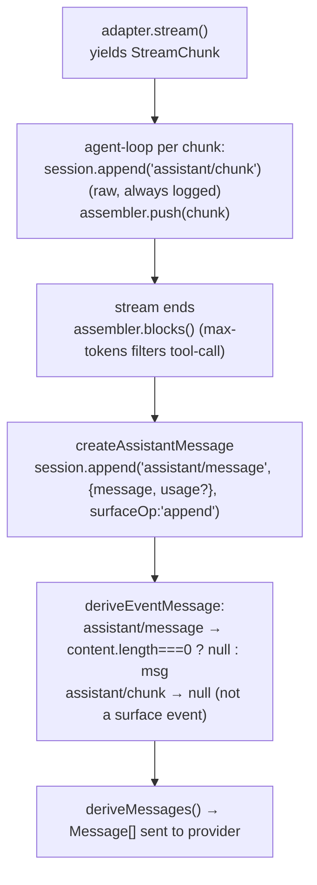

# 第十一篇　LLM 适配接缝
*作者：Amlei　·　更新时间：2026-08-13*

循环（agent-loop）、压缩（compaction）、token-meter 都是 provider 中立的——它们只对 harness 自己的 vocabulary 操作。具体 provider（DeepSeek 直接 fetch、pi-ai 库后端）是插件，通过 `ctx.llm.registerAdapter()` 挂进同一个注册表。`LlmRuntime` 自己不持有任何 HTTP/SDK 代码，只做注册表 + waterfall + 失败归一化。

源码在 `packages/llm/`：`llm`（vocabulary + seam）、`llm-deepseek`/`llm-pi-ai`（provider）、`llm-replay`（test）、`token-meter`。

## 第 1 章　vocabulary 为什么在 dsh-llm 而非 core

`Message`/`ContentBlock`/`StreamChunk` 被**三个独立子系统共享**：session 日志（存原始 chunk 和 assembled message）、agent-loop（`BlockAssembler` 消费 chunk）、token-meter（replay 时重建 assembler 重算）。放在 core 会制造循环依赖；放在 dsh-llm 让 dsh-session、dsh-token-meter、dsh-agent-loop 全部单向依赖它。

```ts
// packages/llm/llm/src/index.ts:46-67
declare module '@deepseek-ai/cordis' {
  interface Context { llm: LlmRuntime }
  interface Events {
    'llm/stream'(this: LlmRuntime, options: GenerateOptions, next: () => AsyncIterable<StreamChunk>): AsyncIterable<StreamChunk>
  }
}
```

`ctx.llm` 是一个 cordis `Service`，唯一的扩展点是 `llm/stream` waterfall（重试/路由/replay 都挂这里）和 `llm/adapters-updated` emit。没有第二个口子。

## 第 2 章　核心 vocabulary

### 2.1　ContentBlock（merge-extensible）

```ts
// packages/llm/llm/src/types.ts:99
export interface ContentBlockMap {
  'text': TextBlock; 'reasoning': ReasoningBlock; 'image': ImageBlock
  'tool-call': ToolCallBlock; 'tool-result': ToolResultBlock
}
export type ContentBlock = ContentBlockMap[keyof ContentBlockType]
```

`ContentBlockMap` 是声明合并的映射（见[第七篇·第 7 章](part-07-seams-scope.md)）。`tool-call.arguments` 故意存原始 JSON 字符串，不解析——session 日志存的就是字符串，解析职责归执行器。

### 2.2　StreamChunk（流协议）

```ts
// packages/llm/llm/src/types.ts:291-303
export type StreamChunk =
  | { type: 'block-start'; index; blockType }
  | { type: 'text-delta'; index; text }
  | { type: 'reasoning-delta'; index; text }
  | { type: 'tool-call-delta'; index; id; name?; argumentsDelta }
  | { type: 'block-end'; index; block: ContentBlock }   // 携带组装好的完整 block（权威）
  | { type: 'usage'; usage: TokenUsage }
  | { type: 'finish'; reason: FinishReason; replayState? }
```

`block index` 关联交错 delta；`block-end` 携带**组装好的完整 block**（权威）。`usage` 在 `finish` 之前，`finish` 之后什么都不发。`FinishReasonMap` 同样 merge-extensible，`aborted`/`error` 携带 `LlmFailure`。

### 2.3　模型请求与 LlmCallConfig

`GenerateOptions` 含 `provider/model/reasoningEffort/messages/system/tools/temperature/maxTokens/stop/signal/sessionId/purpose`。`LlmCallConfig` 是 `GenerateOptions` 的 **epoch 级子集**——只含影响缓存复用的标量（provider/model/reasoningEffort/temperature/maxTokens/stop），每步从 logged header 重建而非 caller 临时塞。`purpose: 'compaction' | 'session-title'` 标识辅助调用。

## 第 3 章　adapter 注册：seam 的唯一挂载点

```ts
// packages/llm/llm/src/index.ts:338-367（节选）
registerAdapter(providers, adapter): AdapterRegistrationHandle {
  const owned = new Set<string>()
  const dispose = this.ctx.effect(function* (this) {
    if (providers.length === 0) throw new LlmError('an adapter must register at least one provider', 'INVALID_ADAPTER')
    this.commitRoutes(owned, this.prepareRoutes(providers, adapter, owned))
    yield () => { released = true; for (const p of owned) this.adapters.delete(p); owned.clear(); this.emitAdaptersUpdated() }
  }.bind(this), 'llm.registerAdapter()')
  handle.replace = (next) => { /* 原子换 routes */ }
  return handle
}
```

注册表用 `Map<provider, {adapter, provider, retryPolicy}>`。`prepareRoutes` 全量校验后再 `commitRoutes` 原子切换，所以 `replace` 期间没有任何请求能观察到空窗。`retryPolicy` 是**注册时捕获的唯一不可热更事实**——改它要 `registration.replace([PROVIDER])` 重注册。

三个 provider 都走同一口子：llm-deepseek（`['deepseek-official']`）、llm-pi-ai（路由动态，`registration.replace(routes)` 原子换）、llm-replay（有 catalog 用 `registerAdapter`，否则 `ctx.on('llm/stream')` catch-all waterfall——**这就是无 key 测试的机制**）。

## 第 4 章　provider-neutral stream：waterfall + 失败归一化

```ts
// packages/llm/llm/src/index.ts:843-900（adapterStream，节选）
private async * adapterStream(options, prepared?) {
  try {
    const registration = prepared?.registration ?? this.registration(options.provider)
    const stream = adapter.stream(this.forAdapter(resolvedOptions, adapter))
    iterator = stream[Symbol.asyncIterator]()
  } catch (error) { yield adapterFailureChunk(error, options.signal); return }
  try { while (true) {
    try { const next = await iterator.next() } catch (error) { completed = true; yield adapterFailureChunk(error, options.signal); return }
    if (next.done) { completed = true; return }
    yield next.value                                  // yield 在 adapter try 之外
  } } finally { if (!completed) await iterator.return?.() }
}
// index.ts:931-939
function adapterFailureChunk(error, signal) {
  const failure = normalizeLlmFailure(error)
  return { type: 'finish', reason: signal?.aborted ? { kind: 'aborted', failure } : { kind: 'error', failure } }
}
```

**adapter 的 throw 永远不向上传播给 consumer**——全部归一化成终端 `error`/`aborted` finish chunk。但 **consumer/middleware 的 throw 仍向上传播**（`yield item.value` 在 adapter try 块之外）。这是"adapter 边界 = 终端结果；下游 = 抛异常"的清晰划分。

`forAdapter` 剥掉 replay state：只有当**同一 adapter 实例**同时拥有历史 provider 和目标 provider 时才保留 `replayState`，否则改成裸 source——防止 pi-ai adapter 收到 DeepSeek 的 replay state。`normalizeLlmFailure` 处理跨包 class identity 丢失：不信任 `instanceof`，只用 own-property descriptor 读 `failure`/`code`。

## 第 5 章　token-meter：per-session replay folds + revisioned measurements

```ts
// packages/llm/token-meter/src/index.ts:79-147（节选）
private readonly states = new WeakMap<Session, ReplayState>()
measure(session, requestHeader?) {
  const state = this._sync(session)                  // fold 到当前 durable tail
  if (anchor !== undefined && optionalHeaderEquals(anchor.header, header)) {
    baseline = anchor.baseline
    surfaceDeltaTokens = state.surfaceTokens - anchor.surfaceTokens   // 增量
  } else {
    baseline = { kind: 'estimated', tokens: estimateHeader(header) + state.surfaceTokens }
    surfaceDeltaTokens = 0
  }
  return deepFreeze(structuredClone({ logRevision: state.consumedEvents, baseline, surfaceDeltaTokens, totalTokens: ..., nodes: state.surface }))
}
```

- **per-session 隔离**：`WeakMap<Session, ReplayState>`，每个 session 自己的 fold。`_sync` 增量 fold 到 `session.events.length`。
- **provider usage 复用条件**：`assistant/message` 带 usage 且 header 匹配 anchor 时，用 `BlockAssembler` 重组装 `sourceEventSeqs` 引用的 raw chunk 重算 provider 输出 tokens，与启发式 anchor 比，取**较大者**作 baseline。
- **immutable revisioned**：`measure` 返回 `deepFreeze(structuredClone(...))`，pressure consumer 拿到的是不可变快照，带 `logRevision`，consumer 自己 diff。
- compaction 用它测压力（见[第九篇·第 7 章](part-09-compaction.md)）。

## 第 6 章　DeepSeek wire 翻译细节

### 6.1　usage 的 disjoint count 换算

```ts
// packages/llm/llm-deepseek/src/translate.ts:53-62（节选）
// DeepSeek 的 prompt_tokens 含 cache hit，harness 约定是 disjoint
// inputTokens = prompt_tokens - cacheRead
```

> **反直觉点**：**DeepSeek 的 `prompt_tokens` 包含 cache hit**（`prompt_tokens = cache_hit + cache_miss`），而 harness `TokenUsage` 约定 disjoint。`mapUsage` 必须**减掉** cacheRead 才得到 `inputTokens`。pi-ai 不用减（本就 disjoint）。这个方向搞反会把 cache 命中算两次。

### 6.2　defer 到 [DONE]

`translate` 把所有 `block-end`/`usage`/`finish` **defer 到 `[DONE]`**——同时覆盖 finish-attached 和 trailing usage-only 两种 wire 形状，保证 finish 之后无 chunk。**empty response 检测**：`stop` finish 且无 opened block → 映射成 `EMPTY_RESPONSE` error finish，不当成功空消息。

## 第 7 章　BlockAssembler：chunk→message 的唯一规范算法

```ts
// packages/llm/llm/src/assembler.ts:47-94（push，节选）
case 'block-end':
  if (partial.block) return            // 首 close 赢，忽略重复 close
  partial.block = chunk.block; return  // 权威：用 block-end 带的完整块
case 'text-delta':
  if (partial.block) return            // block-end 已关，忽略迟到 delta
  partial.text += chunk.text; return
// assembler.ts:134-139
blocks() {
  const blocks = this.order.map(index => this.assemble(this.mustGet(index), index))
  return this.finish.kind === 'max-tokens'
    ? blocks.filter(block => block.type !== 'tool-call')   // 关键：max-tokens 丢弃 tool-call
    : blocks
}
```

两个非显然点：`block-end.block` 权威覆盖 delta 累加（adapter 即使 delta 漏了，只要 block-end 带对就自愈）；max-tokens 时**过滤掉 tool-call**（截断的 tool-call 参数可能半截不可执行），所以 empty-content assistant/message 自然产生。

## 第 8 章　raw chunk 进日志，assembled message 才进 transcript

agent-loop 把每个 raw chunk append 进 session 日志，然后用 `BlockAssembler` 组装出权威 assistant message（见[第四篇·第 3 章](part-04-session.md)）。`assistant/chunk`（raw）和 `assistant/message`（assembled）**都进日志**：assembled message 是权威历史（`deriveMessages` 只读它），raw chunk 留着为 token-meter 精确重算和 replay fixture 派生。

### 图 1　StreamChunk → assistant/message → deriveMessages 三态



## 权衡总账

- **vocabulary 在 dsh-llm 而非 core**让三个消费者单向依赖，无环——代价是 dsh-llm 成了底座依赖。
- **adapter 抛错归一化成 finish chunk 而非 throw**让 consumer 用统一 `for await` 循环处理成功/失败/abort，但要求下游 middleware 自己 throw 而非 yield error chunk。
- **raw chunk 进日志 + assembled message 才进 transcript**牺牲了写放大，换来 token-meter 精确重算和 replay 保真。
- **usage 跟 assembled message 同行**（无单独 usage record）让 max-tokens 空 content 步仍记 usage 给 token-meter，但不进 provider transcript——两全。
- **replay provider 让测试无 key**——有 catalog 用 registerAdapter，否则 `llm/stream` catch-all waterfall，零网络零 key。
- **DeepSeek prompt_tokens 减 cacheRead**是一个必须记住的 wire 细节——方向搞反会重复计 cache。

（vocabulary 如何被 session 存见[第四篇·第 2 章](part-04-session.md)；compaction 如何用 routed 摘要调用与 token-meter 见[第九篇](part-09-compaction.md)；adapterDefaults 如何被 requestProposal 剥离见[第四篇·第 6 章](part-04-session.md)。）
