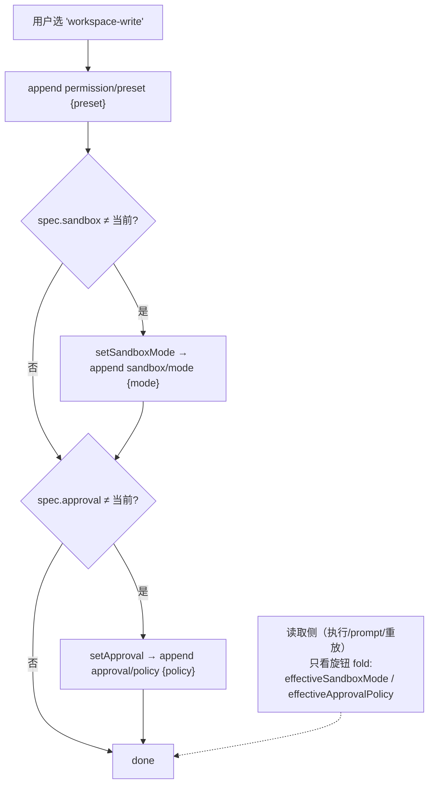

# 第十二篇　沙箱与审批
*作者：Amlei　·　更新时间：2026-08-13*

`dsh` 的安全子系统围绕一条原则：**每一条强制执行边界都必须 fail-closed，绝不静默降级为放行。** 这一章讲四个接缝——`ctx.sandbox`、`ctx.sandboxPolicy`、`ctx.approval`、`ctx.permissionPresets`——以及贯穿它们的持久化格式拒绝与 JSON 校验纪律。

源码在 `packages/sandbox/`、`packages/interaction/`、`native/landlock-run/`。

## 第 1 章　为什么沙箱是接缝

`ctx.sandbox` 是**同世界进程隔离**的能力接缝。进程包装器是唯一能隔离模型控制代码（bash/hook 命令）的机制，而进程内工具（fs/web/todo）无法通过它隔离（包装一个闭包的 ctx 是无意义的）。因此进程内执行是一个独立的策略边界，而不是进程接缝的一部分。

```ts
// packages/sandbox/sandbox/src/index.ts:152-176（节选）
export abstract class SandboxProvider extends Service {
  constructor(ctx) { super(ctx, 'sandbox') }
  abstract confine(argv: readonly string[], policy: SandboxPolicy): ConfinedArgv
}
```

seam 的**唯一操作**：接收调用者确切的 argv，返回要替代 spawn 的 argv。未强制 passthrough 禁止——编码在类型签名"enforce or throw"，经 `SandboxUnavailableError` 抛 `SANDBOX_UNAVAILABLE`。

### 1.1　沙箱策略作为唯一来源

`ctx.sandboxPolicy` 是**唯一**拥有部署默认 mode + workspace-write root 的地方。这就是为什么 bash 和 fs **不能隔离到不同 root**——两者都从 `ctx.sandboxPolicy.resolve()` 解析每调用策略：

```ts
// packages/sandbox/sandbox-policy/src/index.ts:135-142
resolve(request = {}) {
  const { session } = request
  return {
    mode: request.mode ?? (session === undefined ? undefined : this.overrideOf(session)) ?? this.defaultMode,
    workspaceRoot: resolveWorkspaceRoot(session?.header.cwd ?? this.workspaceRoot),
    ...session === undefined ? {} : { sessionId: session.id },
  }
}
```

优先级：显式批准 mode > 会话 `sandbox/mode` 覆盖 > 部署默认。`workspace-write` 的 root 是会话不可变 cwd。把策略归属拆到每族会创建竞态（bash 读一种 mode，fs 读另一种）；集中到 `ctx.sandboxPolicy` 让 bash 内核边界和 fs 进程内边界不可分割——`writableRoots()` 是两者共同参考的共享 allowlist。

## 第 2 章　ctx.approval：fail-closed 到 unavailable

```ts
// packages/interaction/user-approval/src/index.ts:304-329（decide，节选）
private async decide(req, session) {
  if (signal?.aborted) return 'cancelled'
  if (this.effectivePolicy(session) === 'never') return 'rejected'
  const answer = Promise.resolve().then(
    () => this.ctx.waterfall(scopeTarget(this, req.agent), 'approval/request', req,
      () => Promise.resolve<ApprovalOutcome>('unavailable')),   // 默认 = unavailable = fail-closed
  ).then(outcome => OUTCOMES.includes(outcome) ? outcome : 'unavailable', () => 'unavailable')
}
```

answerer **就是** listener——零 listener 时默认回调返回 `'unavailable'` = fail-closed。`'never'` 策略在 `request()` 内任何 dispatch 前解决，即使 `prepend: true` 注册的 listener 也无法绕过。malformed answerer 返回非词表结果规范化为 `'unavailable'`，throwing answerer 捕获为 `'unavailable'`。

审计（`approval/asked`/`approval/decided`）是 **turn-enclosed**：turn 外请求在 append 任何东西前抛——因为 turn 之间的单纯 append 在重载时与 crash tail 无法区分。

### 2.1　ask 路径接到 tools/pre-execute

`ToolRuntime` 在分发前解析 `tools/pre-execute` 的 `ask` 决定（见[第五篇·第 3 章](part-05-tools.md)）。`serviceAsk` 机会性地消耗 `ctx.get('approval')`——无服务/无 agent → degrade deny。沙箱升级也用**同一** `approval.request` 路径，通过闭包，所以沙箱包从不导入 approval 或 agent 包。

## 第 3 章　permissionPresets：一个开关写两个旋钮

```ts
// packages/interaction/permission-presets/src/index.ts:380-392（apply，节选）
private apply(session, name, setApproval) {
  const spec = this.resolve(name)
  if (this.current(session.events) !== name) session.append('permission/preset', { preset: name })
  if (spec.sandbox !== (effectiveSandboxMode(events) ?? this.ctx.shell.sandboxMode)) setSandboxMode(session, spec.sandbox)
  if (spec.approval !== (effectiveApprovalPolicy(events) ?? ...)) setApproval(spec.approval)
}
```

一个 preset 记录自己 `permission/preset` 事件（保用户意图），然后只写**已变更**的策略旋钮。读取侧（执行/prompt/重放）只读各自旋钮 fold（见第 4 章）——preset 事件是 UI 意图层，不是执行层。映射：`workspace-write` → `{sandbox: workspace-write, approval: ask}`；`danger-full-access` → `{sandbox: danger-full-access, approval: never}`。

## 第 4 章　sandbox mode fold：纯 log fold

```ts
// packages/sandbox/sandbox-policy/src/session-mode.ts:52-58
export function effectiveSandboxMode(events) {
  for (let index = events.length - 1; index >= 0; index -= 1) {
    const event = events[index]
    if (event.type === 'sandbox/mode') return event.data.mode
  }
  return undefined
}
```

**Replay IS the state**——resume 不需要追赶机制，因为重放日志重建了覆盖。`sandbox/mode` 事件是 **log-only**（不在模型记录）。bash 和 fs 族都读这同一 fold。terminal-bash 强制：有活动 PTY 会话时不能切 mode（持久 shell 无法重配置）。

> **runtime context 快照而非硬编码。** sandbox mode 和 approval policy 从不在模型记录里——它们是 log-only。模型从**运行时上下文快照**（每步装配时附加）学当前 mode/policy，不是从历史。这就是为什么稳定的 prompt 缓存前缀在策略切换后仍有效（见[第六篇·第 8 章](part-06-system-prompt.md)）。

### 图 1　permission-preset：一个事件 → 两个旋钮



## 第 5 章　landlock-run native addon

Landlock 是 Linux 内核的路径访问 LSM：进程构建一个 allowlist ruleset 经 `landlock_restrict_self` 应用到自己，ruleset 在 `execve` 间**继承**。launcher 自我限制再 exec 包装命令——调用进程保持不受限，而命令及衍生进程运行在隔离内。

```c
// native/landlock-run/packages/entry/src/main.c:230-262（节选）
static int restrict_self(const struct cli *cli, int *partial) {
  long abi = syscall(__NR_landlock_create_ruleset, NULL, 0, LANDLOCK_CREATE_RULESET_VERSION);
  if (abi < 0) return fail(NOT_ENFORCED_MESSAGE, NULL);   // ENOSYS/EOPNOTSUPP: fail CLOSED
  *partial = abi < MAX_ABI;
  ...
  if (prctl(PR_SET_NO_NEW_PRIVS, 1, 0, 0, 0) != 0) return fail(...);   // 先于 restrict_self
  if (syscall(__NR_landlock_restrict_self, ruleset_fd, 0) != 0) return fail(...);
}
```

`no_new_privs` 在 `restrict_self` **之前**设——非特权限制的强制要求，中和沙箱内 setuid/setgid 提权。launcher 在 ABI 协商**不**拒绝部分强制——旧内核只治理 MAX_ABI 访问子集，报 `'partial'` 而非拒主机。

JS 包装器：**无环境变量覆盖**——哪个二进制隔离进程绝不由环境决定。平台链 Linux:`[bwrap, landlock]` / darwin:`[seatbelt]` / win32:`[windows-acl]`。Landlock 包只对 linux-x64/arm64 发布，**故意无 install-time build fallback**——缺失平台包时探测报 `unusable`，消费者 fail-closed。

## 第 6 章　monotonic escalation

升级阶梯严格更宽：`WIDER_MODES['read-only'] = ['workspace-write', 'danger-full-access']`。执行检查是有效 mode 下的**运行时**检查，从不烘焙进工具 mode。

```ts
// packages/sandbox/sandbox/src/escalation.ts:157-164（节选）
export async function approveEscalation(request, approval) {
  const { requestedMode: mode, effectiveMode, justification, subject } = request
  if (!(WIDER_MODES[effectiveMode] ?? []).includes(mode)) {
    throw new Error(`sandbox escalation to "${mode}" is not strictly wider than this call's current "${effectiveMode}" mode`)
  }
}
```

> **反直觉点**：escalation 枚举总是广告两目标 mode（`workspace-write`/`danger-full-access`），即使会话已在 `danger-full-access`——非 bug。mode 是 per-session 分配，但 mode 是注册全局。严格更宽检查在**执行**时是安全边界，不是枚举。

**approved escalation 仍在 backend unavailable 时 fail-closed**——authorization 不是 probe 的许可。

## 第 7 章　持久化格式拒绝 + JSON 校验纪律

### 7.1　两种 error，方向性消息

`SessionFormatUnsupportedError`（log 完好但本 build 无法忠实解读）vs `SessionPersistenceCorruptionError`。格式版本不匹配**方向感知拒绝**（见[第八篇·第 7 章](part-08-persistence.md)）。未知事件类型拒绝而非跳过（除非 `ignorable: true`）。

### 7.2　种子/加载校验拒绝缺 provider/model

在 seed 边界，缺少 `provider`/`model` 的 `request/header` 和没有模型源的 `assistant/message` 被拒绝——harness 从不猜测路由。没有这些的 header 无法路由，猜测会是静默的错误重建。

### 7.3　Session.append 单次 pass

`Session.append` 的 `snapshotJsonValue` 在**一次**遍历里同时校验和 detach（见[第四篇·第 3 章](part-04-session.md)）——一个有状态的 getter 无法在检查和复制之间变更。

### 7.4　信任纪律

> **"Trust TypeScript at typed same-process boundaries."** 同进程、类型已约束的调用处**不**加运行时校验。校验只在信任边界做：parser/config、durable/file、wire、worker/process、seed/load。

## 第 8 章　runner failure vs denial

启动器在孩子运行前失败（退出 125 + 致命 `landlock-run:` 行）在结构上与孩子被隔离的文件效果拒绝（stderr `permission denied`）是**不同的**。consumer 需要匹配的致命行（在信息排除之后）和特定规则的退出代码门——因为 runner failure 意味着命令从未运行，而 denial 意味着隔离生效了。

> **反直觉点**：一个 denial（`[sandbox: file access denied under <mode> mode]`）意味着命令**确实**运行了——内核拒绝了文件效果。损坏沙箱（runner 在孩子运行前失败）结构上可区分（runner failure rules），在 bash 前台抛 `SANDBOX_UNAVAILABLE` 而非返回 denial token。

## 权衡总账

- **沙箱只隔离同世界子进程**（bash/hook/ACP subagent），fs/web/todo 进程内执行——fs 有自己进程内路径隔离区读相同 `ctx.sandboxPolicy` mode。两种边界一种策略。
- **Landlock（内核强制）vs 用户态检查**：ctx.sandbox（内核边界）和 ctx.fs 进程内隔离区是两种诚实不同的强制级别。fs 隔离区是"策略检查非安全边界"——残留 TOCTOU 被接受。
- **approval fail-closed**（安全 > 可用性）：每条缺失路径降级为 deny/unavailable 而非 grant。
- **opaque id branded**防跨边界 id 误用（`ApprovalRequestId` 是 Branded）。
- **部分强制报告非拒绝**：旧 Landlock ABI 和 Windows ACL 间隙报 `enforcement: 'partial'` 保回退可用，但 consumer 须区分 partial 与 full。
- **runtime context 快照而非硬编码 prompt** 是从"软锁定"教训里学到的——会变的真相放在稳定缓存前缀之后，保护 prompt 缓存。
- **escalation 枚举广告完整词表**（per-session mode 要求），严格更宽检查在执行时——非 bug。

（工具管线 ask 经审批见[第五篇·第 3 章](part-05-tools.md)；sandbox mode fold 被 subagent snapshot 继承见[第十篇·第 8 章](part-10-subagent.md)；持久化格式拒绝细节见[第八篇·第 7 章](part-08-persistence.md)。）
