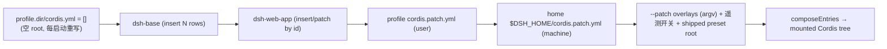
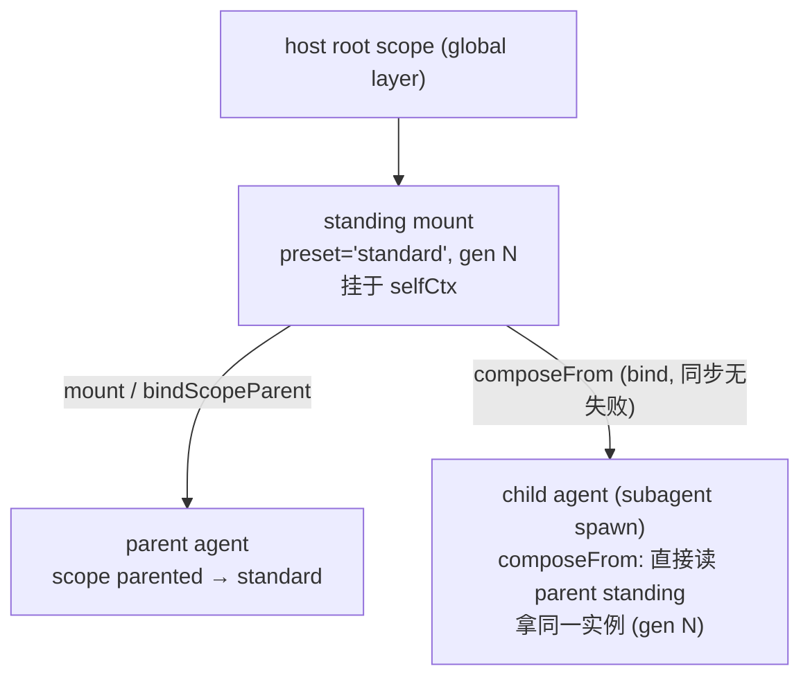

# 第十三篇　组合与启动
*作者：Amlei　·　更新时间：2026-08-13*

一个运行中的 `dsh` 不是"一个程序"，而是在 boot 时把若干有序 layer（bundle patch 列表 → profile `cordis.patch.yml` → home 级 → `--patch` overlay）apply 到一个**空 entry list**，得到的一棵 Cordis plugin tree。每个 agent session 再从某个 **preset** 的 `agent.cordis.yml` 挂一份 standing composition，把自己的 scope key 父到它上面。

源码在 `packages/boot/app-boot/`、`packages/bundle/`、`packages/preset/agent-presets/`。

## 第 1 章　profile、bundle、patch、preset

| 抽象 | 是什么 | 在哪定义 |
|---|---|---|
| **profile** | `$DSH_HOME/profiles/<name>` 目录：`package.json` 带 `dsh.profile.bundles`（有序 bundle 名单）+ 自己的 `cordis.patch.yml` | `profile.ts:47-51` |
| **bundle** | npm 包，`package.json` 声明 `dsh:{bundle:{patch:"./cordis.patch.yml"}}`；patch 是一组 Cordis entry（`insert` 列表） | `profile.ts:42-45` |
| **patch** | 顶层 YAML 数组，每条按 `id` target 一个 row：替换整 `config`、`disabled: true`、或插新 row | `index.ts:268-338` |
| **preset** | 一个目录（`agent.cordis.yml` + 可选 metadata），per-session agent 从它组合；standing mount per process | `preset.ts:20-41` |

bundle 不是可执行程序，是**分发格式**：一段 Cordis config rows + 这些 row mount 的代码。row 的 `config` 是数据，patch 层可整行替换它。这保证 bundle 永远**可被上层 patch**——它不锁定任何值，只是默认层。

`dsh-base` 是每个 profile 的第一层：模型适配器、工具、持久化、沙箱、审批、设置、凭证、telemetry。`dsh-web-app` 加浏览器应用；`dsh-headless` 加一个无 server 的一次性 runner。

## 第 2 章　layer 应用顺序

`composeEntries` 把多层 patch flatten 成数组，对空 root 做一次 `applyEntryPatches`。boot 和 `--dump-config` 走同一调用，保证所见即所挂。

```ts
// packages/boot/app-boot/src/profile.ts:413-420
export function composeEntries(layers, warn = () => {}) {
  return applyEntryPatches([], structuredClone(layers.flat()), (message, ...args) => { ... })
}
```

launcher（`profile-boot.ts`）叠加完整顺序：bundlePatches → profile.patches → homePatches → overlays（`apps/cli/src/profile-boot.ts:122-170`）。

几个非显然纪律：

- bundle 声明无 `dsh.bundle` → **fail loud**（不是"没 patch"，是 misconfiguration）。
- root config 文件（`profile.dir/cordis.yml`）每启动被**强制重写为空 `[]`**——防 vendored Loader 的 tree write-back 把组合后的 row 烘进文件，下次 boot 会复制每条 bundle insert。
- shipped agent-presets root 由 launcher 作为 overlay 注入到 `agent-presets` row 的 `config.roots`（首元素 `trust:'system'`），因为只有 app 能解析自己的 shipped 路径。

## 第 3 章　patch 替换整 row（非部分 merge）

> **最易讲错的点**："patch 合并"是错的——patch **替换整 row 的 `config`**，不是深 merge。所以 `dsh-base` 把 mode-specific 值（如 web 的 `printUrl`）不放 base，每个 mode bundle 重述完整 config，保证"一行只由一个 bundle 层 + 用户层决定"。

```yml
# 一个 patch 示例：按 id target，替换整 config 或插新行
- id: shell
  config:
    provider: bash-sandbox        # 整个 config 被替换
- id: my-tool
  insert:
    path: @my-org/dsh-tool-mine   # 插新 row
```

`--dump-config` 和 boot 走同一个 `applyEntryPatches([], ...)` 调用——dump 只是按 layers 1..k 各做一次快照标注每行来源。dump 出来就是 boot 挂的。

### 图 1　layer 叠加顺序



## 第 4 章　agent-presets：discovery unmemoized，first-root-wins，standing mount per process

### 4.1　Discovery 每次 re-read roots

```ts
// packages/preset/agent-presets/src/index.ts:199-201
async list() { return await discoverPresets(this.resolvedRoots) }   // 无 memo
```

运行时新写的 preset 立即可见、删的下次读消失。`first-root-wins` 决定 shipped `system` root 遮蔽同名 user preset。broken preset 仍 resolve（roster 报 broken 字段），但 `resolveMountable` 在真正 mount 前拒。

### 4.2　standing mount 单飞 + 按 file stamp 分代

```ts
// packages/preset/agent-presets/src/index.ts:491-534（ensureStanding，节选）
private async ensureStanding(preset) {
  const pending = this.standing.get(preset.id)
  if (pending !== undefined) {
    const mounted = await pending
    const current = await compositionStamp(preset.path)
    if (current === undefined || sameStamp(mounted.stamp, current)) return mounted
    if (this.standing.get(preset.id) === pending) this.standing.delete(preset.id)
    return this.ensureStanding(preset)
  }
  // 新建 standing mount...
}
```

stamp = mtime + size（size 是同 mtime tick 内编辑的 tiebreak）。stamp 变 → 新 session 起新 generation；已 join session 保留旧 generation，superseded generation 不主动回收。stamp 在 read **前**取——read 期间编辑让 stamp stale（而非 silently current）。

### 4.3　standing mount 挂在 selfCtx 非 this.ctx

```ts
// packages/preset/agent-presets/src/index.ts:120-128（注释）
// standing mount 挂在 this.selfCtx（service 的非 traceable context）。
// 通过 traceable proxy 调用时 this.ctx 被 rebind 到 caller（带 shadow），
// 从 shadow mint 的子树解析 service 会 fail（cannot get property "tools" without inject）。
```

这是 mount 能工作的隐藏前提。

### 4.4　composeFrom（子 agent 继承父 composition）

详见[第十篇·第 7 章](part-10-subagent.md)。`composeFrom` 是 bind 非 mount——直接读父 standing mount 拿同一实例（同 generation）。同步、无 composition 失败模式（不读 roster/mount/file），故 child 创建窗口能用它。

### 4.5　recompose：仅 agent 未产出时有效

`recompose` 是 parent **re-link**，不是 unmount——旧 composition 留给其它 agent，新 composition 在 link 移动**之前** ensure。`rebind` 是 `dsh-scope` 的**唯一 re-link 能力**；roster 私持 binding，保证没有别的 caller 能移动已组合 agent。

### 4.6　copy 是唯一 authoring write

源 named by id，整目录 `cp`（`dereference: true`，自包含），不跨 seam——authoring 不授予 roster 未有的能力。copy 后 `standing.delete(id)` 清掉可能 stale 的 mount。copy **不** mount 校验——源今天能 mount → 副本今天能 mount。

## 第 5 章　isolate realm + serviceFor

preset 的 row 在 `isolate` realm 发布 service（entry-local realm 对 group 外不可见，包括 host 和 agent 自己 scope context）——两 session 同名 service 不能撞。

但每个 browser RPC 都是"关于某 session 但从外部来"——`serviceFor` 用 fiber **object identity** 在 service store 找由该 subtree 发布的具名实现：

```ts
// packages/preset/agent-presets/src/mount.ts:256-272（节选）
export function serviceForAgent(ctx, agent, name) {
  const mount = standingMountFor(agent.ctx)
  if (mount === undefined) return undefined
  const store = ctx.reflect.store
  for (const key of Object.getOwnPropertySymbols(store)) {
    const impl = store[key]
    if (impl.name !== name) continue
    if (withinFiber(impl.fiber, mount.fiber)) return impl.value
  }
}
```

为什么用 object identity 而非 uid：uid 是 per-registry 计数器，两个不同 root 的 fiber 会撞 uid。mount 时两 guard：不可用 row（仍 pending service）拒；向 root realm 发布的 service 拒（process-global，第二 session 挂同 preset 会撞）。

`serviceFor` 不是 host 通用 handle：host row 用 `inject` 无法用（injection 在 session 存在前就解析没 agent 可 key）——那种 service 属 host plane。

### 图 2　standing mount + composeFrom 继承



## 第 6 章　config 驱动的 agent 启动

agent-loop 的 `Config.agents` 是数组，每 entry 有 `id`（config 标签作 fresh combined-id 前缀）/可选 `sessionId`/`resumeSessionId`/`cwd`/`AgentOptions`。构造时一次性消费。

```ts
// packages/core/agent-loop/src/index.ts:355-382（节选）
for (const { id, sessionId, cwd, resumeSessionId, ...options } of this.config.agents) {
  if (resumeSessionId === undefined) {
    const configuredId = sessionId ?? SessionId(`${id}-session-${randomUUID()}`)
    // create or restore
  } else {
    ctx.effect(() => {
      const fiber = ctx.inject(['sessionPersistence'], (childCtx) => {
        void this.resumeWith(ctx, childCtx.sessionPersistence, { resumeSessionId, agentOptions: options })
          .catch(error => this.reportConfiguredStartupFailure(id, 'resume', resumeSessionId, error))
      })
      return fiber.dispose
    }, `agentLoop.resume(${id})`)
  }
}
```

launcher 通过 `ctx.provide(CONFIGURED_AGENT_IDENTITIES_KEY, ...)` 在任何 entry mount 前固定 session identity——overlay 重指 model route 不丢 identity。

`agent-loop/config-start-failed` 事件：声明式 agent 启动失败时发，让 buffer work 的 consumer（持该 identity 等待）拒绝而非永远等。正常 factory teardown 抑制此信号。

## 权衡总账

- **patch 替换整 row 非深 merge**让"一行 = 一个 bundle 层 + 用户层"简单可预测，代价是 mode-specific 值要在每 mode bundle 重述完整 config。
- **standing mount 共享、永久**：preset 是"每进程一份组合"非"每 session 一份"。re-link 非 unmount。代价是 superseded generation 不回收。
- **bundle 保持可 patch**：任何 row 可被 profile/home/--patch 整行替换。代价是读者要理解"patch 是替换不是合并"。
- **copy 是唯一 authoring write**让 composition 文本不过 seam，authoring 不授予新能力——但 copy 不 mount 校验（信任源今天能 mount）。
- **standing mount 挂在 selfCtx 非 this.ctx**是 mount 能工作的隐藏前提——traceable proxy 会 rebind，shadow mint 子树解析 service 会 fail。
- **composeFrom 是 bind 非 mount**让 child 拿父同一 generation，但要求"按 id re-resolve 会因文件编辑给 child 不同 generation"这个失败模式被理解。
- **dsh-base 的 root config（cordis.yml）是空的 []**——所有 row 以 patch insert 来自 bundle 层。文件存在只是 Loader 需要真实 include root 锚 baseUrl，每启动强制重写为空防 write-back 污染。
- **--dump-config 和 boot 走同一调用**保证 dump 出来就是 boot 挂的，但要求读者理解 dump 只是按 layers 快照标注每行来源。

（profile/bundle 之上的 Cordis loader 机制见[第二篇·第 7 章](part-02-cordis.md)；scope 的 bind/rebind 语义见[第七篇·第 5 章](part-07-seams-scope.md)；子 agent 如何经 composeFrom 继承父 composition 见[第十篇·第 7 章](part-10-subagent.md)。）
