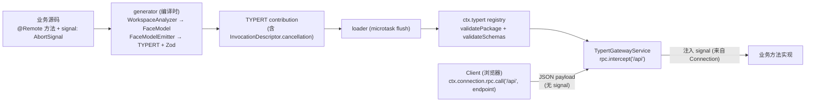
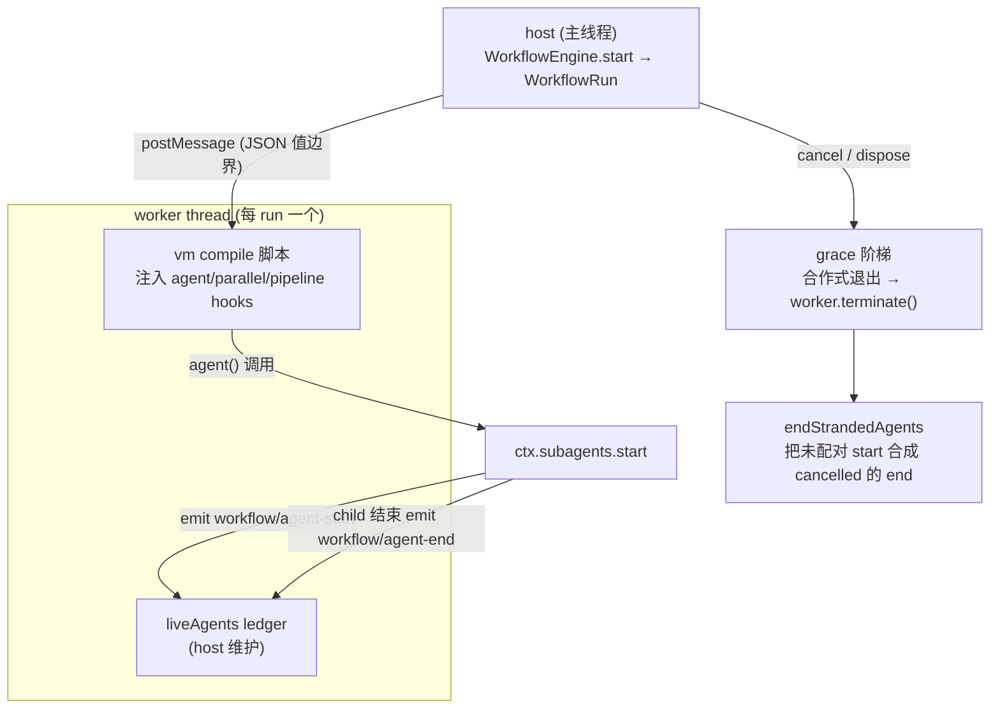
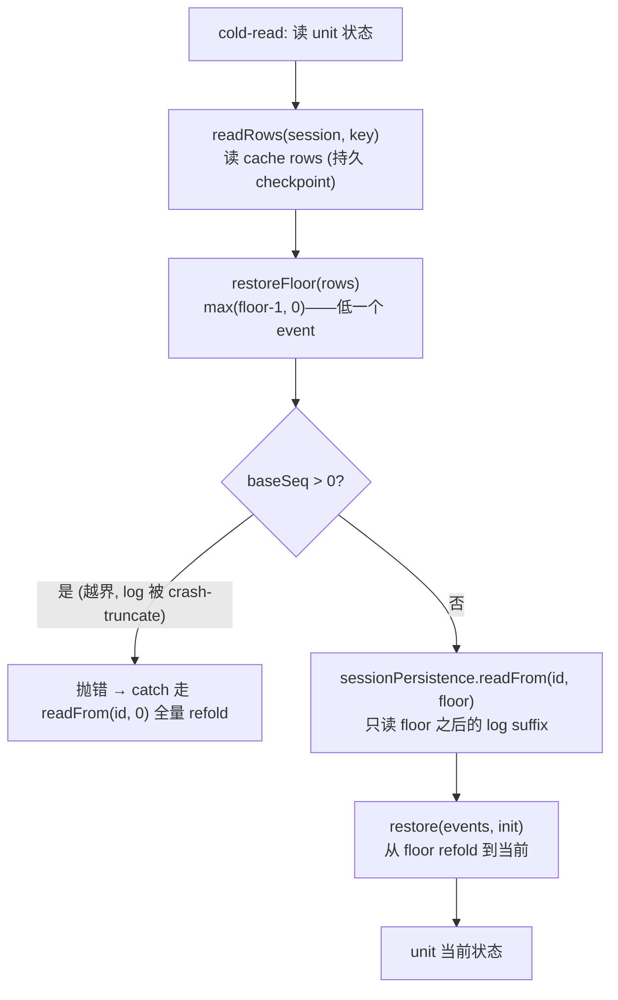
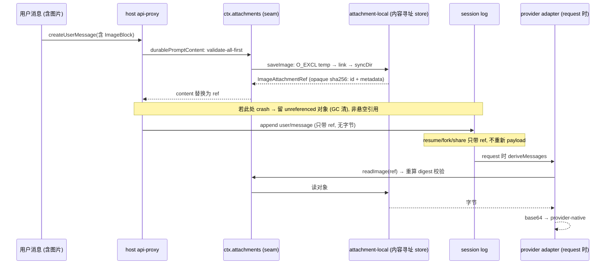
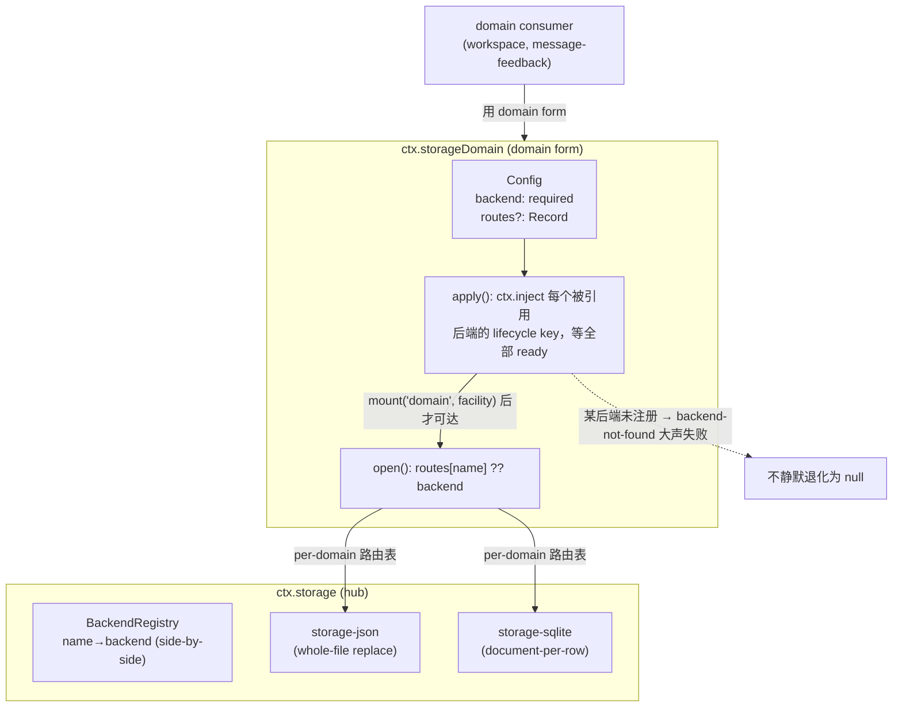
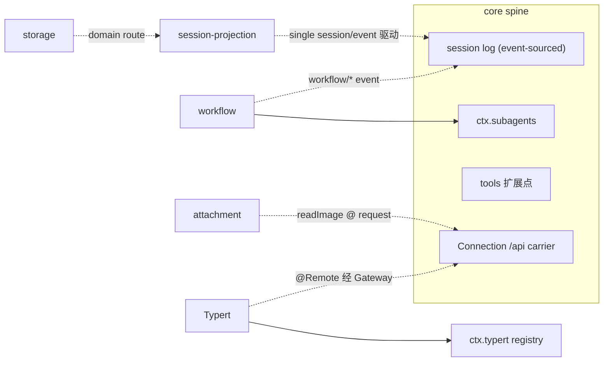

# 第十四篇　扩展生态（上）：核心扩展
*作者：Amlei　·　更新时间：2026-08-13*

前面十三篇立起了核心脊柱与主要 capability seam。`dsh` 还有一整套围绕核心挂载的扩展子系统。它们数量多，但**每个都是把已立起来的某个核心模式套到一个具体能力上**——这一篇（上）深挖五个**自身有承重设计**的核心扩展：跨进程类型安全的 Typert、worker-thread 隔离的 workflow、状态驱动 fold + 冷读阶梯的 session-projection、内容寻址的 attachment、per-domain 路由的 storage。下一篇（[第十五篇](part-15-ecosystem.md)）讲其余工具型扩展。

这五篇的共同点：它们各自引入了一个**新机制**（不只是套用旧模式），所以值得逐个深挖到 `文件:行号`。

## 第 1 章　Typert —— 跨进程类型图与 RPC 网关

**设计动机**：跨进程 RPC（浏览器 Client ↔ Host，经 Connection carrier）需要编译期可验证的类型契约。否则 `@Remote` 方法在进程边界会退化成弱类型的 JSON 串——参数名拼错、类型不符，都要到运行时才炸。Typert 把源码类型树编译成 compiler-independent 的 `FaceModel`/`TypeGraph`，让 Gateway 在 dispatch 时按生成的 `InvocationDescriptor` 校验参数与返回值。

### 1.1　四个角色：generator / loader / registry / gateway

- **generator**（`packages/typert/generator`）：`WorkspaceAnalyzer` 扫源码产 `FaceModel`；`FaceModelEmitter` 产 `TYPERT` contribution + Zod schema。opt-in 发布校验——包须 export `./typert` → `lib/typert.host.{js,d.ts}`。
- **loader**（`packages/typert/loader`）：订阅 `internal/plugin` 生命周期，microtask 批量 flush，聚合失败成 `AggregateError`。
- **registry**（`ctx.typert`）：`register(contribution)` 先 `validatePackage`（拒重复 `<package>#<face>`）再 `validateSchemas`（拒重复 `<package>#<schema>`），原子提交，失败回滚。
- **gateway**（`ctx.typertGateway`）：`TypertGatewayService` 用 `connection.rpc.intercept('/api', …, { authority: 'trusted-host' })` 把自身挂到 Connection 的共享 `/api` FetchHandler。

```ts
// packages/api/gateway/src/index.ts:104-111（节选）
connection.rpc.intercept('/api', async (endpoint, payload, ctx) => {
  // 解析 descriptor → 校验具名参数 → 解析 lookup/Context 身份 → 调业务方法 → 校验返回值
}, { authority: 'trusted-host' })
```

Client 侧经 `ctx.connection.rpc.call('/api', endpoint, …)` 跨进程。

### 1.2　装饰器不留反射元数据

> **非显然点**：`@Remote`/`@RemoteScope` 装饰器标记**完全不留反射元数据**。

```ts
// packages/typert/protocol/src/index.ts:126（节选）
// 一个 module-private WeakMap<object, Map<string, …>>（key 是 prototype）记录方法名
// 装饰器本身返回 void，业务包不依赖运行时 registry
```

为什么这样设计？因为元数据的唯一消费者是 **generator**（编译时扫源码），不是运行时。把元数据留在 prototype 上会让业务包隐式依赖运行时 registry——破坏"业务包零依赖"的目标。所以装饰器只做"标记给 generator 看"，运行时完全擦除。

### 1.3　cancellation 是 side-channel

取消（cancellation）的处理最能体现"类型安全但不污染 wire"的设计：

```ts
// packages/typert/generator/src/analyzer.ts:1011-1022（节选）
// analyzer 只把【最后一个】名为 signal 且类型为全局 AbortSignal 的参数提出来，
// 存成 InvocationDescriptor.cancellation
```

```ts
// packages/api/gateway/src/index.ts:161（节选）
// Gateway 在业务参数之后【注入】signal——它永远不出现在 JSON wire 参数里
```

`InvocationDescriptor.cancellation` 是个独立的元字段，**不进 JSON wire 参数列表**。Connection 提供 signal，Gateway 注入。这意味着：(1) wire 协议里看不到 `signal` 参数，不会被恶意构造；(2) 业务方法签名里的 `AbortSignal` 是 TypeScript 真实类型，调用方必须传，但跨进程时它由基础设施提供。

### 图 1　Typert 的四角色与 signal side-channel



### 权衡

- **装饰器不留元数据**让业务包零运行时依赖，代价是 generator 必须扫源码（构建时步骤）。
- **signal 是 side-channel**让 wire 协议干净（无 signal 字段），但要求 Connection 提供 signal——没有 Connection 就没有取消。
- **opt-in 发布**（包须 export `./typert`）避免每个包都被强制作类型图，代价是漏 export 的包没有跨进程类型校验。

## 第 2 章　workflow —— worker-thread 编排引擎

**设计动机**：让模型写一段 JavaScript 编排脚本，fan-out 多个子 Agent（`agent()`/`parallel()`/`pipeline()`）。同步脚本循环不能阻塞 host event loop，也不能无视取消——worker-thread 引擎给了一条真实的 force-terminate 路径。

### 2.1　契约与引擎的边界

`ctx.workflowEngine` 同步校验（malformed meta / 不可解析脚本 / provider route 不可用 / 超上限）后返回 run：

```ts
// packages/workflow/workflow/src/index.ts:43-89（节选）
export class WorkflowEngine extends Service {
  start(request: WorkflowStartRequest): WorkflowRun {
    // 同步校验，再返回 run
    return { id, meta, result, cancel, dispose }
  }
}
```

`WorkflowRun` 的 `result` 是个 Promise——它永不 reject（seam 契约），child 层失败 resolve 成 `fatal` flag 的 `WorkflowError`。observe-only 事件 `workflow/start`/`end`/`phase`/`log`/`agent-start`/`agent-end` 入 session log。

### 2.2　worker-thread 隔离

每个 run 一个 `new Worker`：

```ts
// packages/workflow/workflow-worker-thread/src/host.ts:67-91, 149-169（节选）
const worker = new Worker(url, { execArgv: [], env: scrubbedEnv, ... })
// execArgv:[] 关键——不让 worker 继承 host 的 --import tsx/esm 等 flag
```

`runtime.ts` 注入 `agent`/`parallel`/`pipeline`/`phase`/`log`/`args` hooks，vm compile 脚本。cancel/dispose 的 grace 阶梯：先请求合作式退出 → `worker.terminate()` 兜底真终止。

> **非显然点（承重）**：worker/vm **明确不是安全边界**——`realm.ts:1-9` 与 `runtime.ts:5-7` 都声明 escaped script 能拿到 worker 的 Node 权限。它的真实价值是 **host-loop 隔离 + `worker.terminate()` 真终止**。一个失控的 `while(true)` 脚本会阻塞 worker 但不会阻塞 host；`terminate()` 能强制结束它，这是主线程上跑脚本做不到的。

### 2.3　liveAgents ledger：start/end 恰好配对

这是 workflow 最承重的设计——保证**每条 `workflow/agent-start` 在每条停止路径上恰好配对一次 `agent-end`**：

```ts
// packages/workflow/workflow-worker-thread/src/host.ts:560-582（endStrandedAgents，节选）
private endStrandedAgents(reason) {
  for (const id of this.liveAgents) {
    // force-settle 或 worker 死亡前，把缺失的 end 合成成 cancelled
    this.emit('workflow/agent-end', { id, ... cancelled: true })
  }
}
```

`liveAgents` 是 host 维护的 ledger（`host.ts:122-123`）：每条 `agent()` 调用 emit `agent-start` 时加入，child 结束 emit `agent-end` 时移除。在 grace force-settle 或 worker 死亡前，`endStrandedAgents` 把所有未配对的 start 合成成 `cancelled` 的 end。

为什么承重？因为观察者（UI、telemetry）依赖 start/end 配对来重建"哪些子 Agent 还在跑"。force-terminate 一个 worker 时，已经 emit 的 `agent-start` 不会有对应的真 end——不合成的话，观察者会永远以为那些 child 还活着。

### 2.4　realm：JSON 值边界

worker↔host 的值传递经 `materializeFromRealm`，这是一个 JSON 值边界：

```ts
// packages/workflow/workflow-worker-thread/src/realm.ts:66-151（节选）
// defineProperty 防原型污染（不抄 __proto__）
// seen set 防环
// 拒 sparse/exotic 对象
```

### 图 2　workflow 的 worker 隔离与 ledger 配对



### 2.5　tool-ralph：固定脚本 + fresh structured-output

`tool-ralph` 是 workflow 的固定消费者——一个 fresh-agent 循环脚本，每轮一个全新 structured-output child。它**硬性要求 fresh provider**：

```ts
// packages/workflow/tool-ralph/src/index.ts:220-232（节选）
const requireFreshProvider = () => {
  if (!(!provider.inheritsParentContext && provider.capabilities.outputSchema))
    throw new Error('ralph requires a fresh structured-output provider')
}
```

为什么 fresh？因为 Ralph 的语义是"每轮全新 child 试一次"——fork（继承父历史）会污染这个语义。`inheritsParentContext: false` + `outputSchema` 能力是硬约束。`maxRounds` 同时作 default 与 ceiling，经 `WorkflowStartRequest.maxTotalAgents` 与引擎的总 child backstop 协同。

### 权衡

- **worker/vm 不是安全边界**是诚实声明——代价是 escaped script 能拿到 Node 权限，收益是 host-loop 隔离 + 真终止。安全敏感场景不该让模型写任意 workflow 脚本。
- **liveAgents ledger 合成 cancelled end**保证观察者永不看到孤儿 start，代价是 host 要维护一份 ledger 并在每条停止路径上调用 `endStrandedAgents`。
- **realm JSON 值边界**牺牲了传函数/原型对象的能力，换来跨线程安全（防原型污染、防环）。
- **tool-ralph 要求 fresh provider**是语义约束（每轮全新），代价是 fork provider 不能用于 Ralph。

## 第 3 章　session-projection —— 状态驱动 fold + 冷读阶梯

**设计动机**：把 session log fold 成客户端只读的整体值（todo 列表、title、goal 快照、plan 状态），让 host 不必每次重放整条 log；projection-cache 再把这些 checkpoint 持久化，cold-read 时走 ladder 而非加载完整 log。

### 3.1　registry：单次 session/event 驱动 + 同引用门控

```ts
// packages/session/session-projection/src/index.ts:171-184, 405-425（节选）
export class SessionProjectionRegistry extends Service {
  // 单次 ctx.on('session/event') 驱动每个 unit 的 apply
  ctx.on('session/event', (session, event) => { for (const unit of this.units) unit.apply(session, event) })
}
// Object.is 同引用门控（第 415 行）：不变就不发 change feed
if (!Object.is(prevState, newState)) this.emit('projection/change', { session, key, value: newState })
```

**单次订阅**驱动所有 unit——而非每个 unit 自己订阅 `session/event`。这是性能纪律：N 个 unit 共享一次事件分发。`Object.is` 同引用门控让"状态值没变"（如 todo 列表同一引用）就不发 change feed——避免无意义的 UI 重渲染。

### 3.2　whole-value event 规则

projection 的 event 必须是**整值替换**（whole-value-replace），不是增量 patch：

```ts
// packages/session/session-projection/src/index.ts:13-15（注释）
// 一个 unit 的状态是一个整体值；每次变更事件携带完整的新值，不是 delta。
```

这简化了 fold——`apply` 不用合并 delta，直接用 event 里的新值替换。代价是 event 携带完整值（可能大），但 projection 状态通常不大（todo 列表、title）。

### 3.3　cache：log-leads-cache 与强制写点

`ctx.sessionProjectionCache` 把 unit 状态 checkpoint 到 SQLite：

```ts
// packages/session/session-projection-cache/src/index.ts:150-151（write，节选）
// log-leads-cache：flush 事件【先于】put cache row
await this.ctx.sessions.flush(session)   // :150 先 flush
await this.putRow(session.id, key, ver, seq, val)  // :151 再 put cache
```

**log-leads-cache** 是承重顺序：cache row 引用的 `seq` 必须先在 log 里 durable，否则 crash 后 cache 指向一个不存在的 seq。两个强制写点 + 两个 throttle：

```ts
// packages/session/session-projection-cache/src/index.ts:206-230（节选）
// 强制写点：turn/end（:206）+ detach（:226）
// throttle：writeEveryEvents（:213）/ writeIntervalMs（:217-219），均 required 无默认
```

强制写点保证关键边界（turn 结束、session detach）一定 checkpoint；throttle 避免高频小变更刷爆 cache。

### 3.4　冷读阶梯（cold-read ladder）

这是 projection 最精妙的机制——cold-read 不加载完整 log，而是走一条阶梯：

```ts
// packages/session/session-projection-cache/src/index.ts:166-197（coldSnapshot，节选）
const coldSnapshot = async (session, key) => {
  const rows = await this.readRows(session.id, key)     // :168 先读 cache rows
  const floor = restoreFloor(rows)                       // :169 恢复最低可用 watermark
  const { events } = await this.ctx.sessionPersistence.readFrom(session.id, floor)  // :179 读 log suffix
  const value = restore(events, init)                    // :186 从 floor refold
  return value
}
```

阶梯：cache row（持久 checkpoint）→ `restoreFloor`（最低可用 watermark）→ persistence `readFrom`（只读 floor 之后的 log suffix）→ `restore`（从 floor refold 到当前）。这样 listings 不加载完整 log——只读 cache + 一小段 tail。

### 3.5　restoreFloor：锚定 max(floor-1, 0)

```ts
// packages/session/session-projection-cache/src/index.ts:300-310（节选）
const restoreFloor = (rows) => {
  // 锚定在 Math.max(floor - 1, 0)——比最低可用 watermark 低一个 event
}
```

> **非显然点（承重）**：`restoreFloor` 锚定在 `Math.max(floor - 1, 0)`——**比最低可用 watermark 低一个 event**——所以一条被 crash-repair 截断的 log 是**可证明的**：一个越界的 row（`baseSeq > 0`）会抛错（`:367-372`），强制调用方的 catch 走 `readFrom(id, 0)` 全量 refold，而不是服务一个 ghost 值。

为什么低一个？因为 crash-repair 可能截断 log 尾部——cache row 记录的 `seq` 可能指向一个被截掉的 event。低一个 event 让 refold 从更早的、确定存在的 event 开始，遇到越界 row 就抛错（可证明的失败），而非静默用 stale 值。

### 3.6　ver-mismatch 是 discard 非 migrate

```ts
// packages/session/session-projection-cache/src/index.ts:327, 373-379（节选）
// viewCheckpoint: continue（:327，discard）
// restore: 落到 def.init() refold（:373-379）
```

unit 的 `stateVersion`（`ver`）变了（代码升级改了 state 形状）→ cache row **丢弃不迁移**——unit bump 永远意味着从 log refold，绝不把 stale 状态 forward-apply 成垃圾。代价是 unit 升级后第一次读要全量 refold。

### 图 3　session-projection 的冷读阶梯



### 权衡

- **单次 session/event 驱动**省了 N 次事件分发，但要求 registry 集中管理所有 unit（unit 不能自己订阅）。
- **whole-value event**简化 fold（不合并 delta），代价是 event 携带完整值。
- **Object.is 同引用门控**避免无意义 change feed，但要求 unit 的 `apply` 在状态没变时返回同一引用（unit 作者纪律）。
- **log-leads-cache**保证 cache 引用的 seq 先 durable，代价是 write 要等 flush（多一次 await）。
- **restoreFloor 低一个 event**让 crash-truncated log 可证明（抛错而非 ghost 值），代价是 refold 多处理一个 event。
- **ver-mismatch 是 discard 非 migrate**保证 unit 升级后状态正确（从 log refold），代价是首次读全量 refold。

（session-projection 的 unit 如何被 host 经 api-proxy 送客户端，见[第十三篇](part-13-boot.md)；它消费的 session/event 见[第四篇·第 3 章](part-04-session.md)。）

## 第 4 章　attachment —— 内容寻址的持久附件

**设计动机**：模型/用户图片必须是持久的内容寻址对象，而不是浏览器路径 / object URL / provider URL / base64 散落在 session event 里。seam 验证并原子提交不可变字节，返回 serializable `ImageAttachmentRef`；provider adapter 在 request 时把 durable 引用解析成 provider-native 内容。

### 4.1　seam 与 ImageAttachmentRef

```ts
// packages/attachment/attachment/src/index.ts:29-60（节选）
export abstract class AttachmentStore extends Service {
  abstract validateImage(input): Promise<ImageDimensions>   // admission 不持久化
  abstract saveImage(input): Promise<ImageAttachmentRef>     // validate + durable commit
  abstract readImage(ref): Promise<StoredImage>              // 按 logged metadata 校验内容寻址对象
}
```

`ImageAttachmentRef{attachmentId, mediaType, bytes, width, height, name?}`——`AttachmentId` 是 branded（opaque）。`saveImage` validate 后 durable commit，返回 ref；ref 是 **serializable** 的（只有 id + verified metadata，无字节）。

### 4.2　本地后端：内容寻址 + 独占 hard-link publish

```ts
// packages/attachment/attachment-local/src/store.ts:136-194（saveImageFile，节选）
const objectPath = `objects/<sha256[0:2]>/<sha256>`   // 内容寻址：sha256 决定路径
// staging dir tmp/（:141）
const temp = open(tempPath, 'O_CREAT|O_EXCL|O_WRONLY', 0o600)   // :152 独占 temp
writeFile(temp, data); sync(temp)                                // :153-154
// digest 重验后：
link(tempPath, targetPath)   // :158 独占 hard-link——只在 digest 重验后吞 EEXIST
syncDirectory(bucket); syncDirectory(objects)   // :169-170 fsync 目录
unlink(tempPath)   // :171
```

内容寻址（sha256 决定路径）意味着同一图片永远存一份（去重）。`O_EXCL` temp + 独占 `link` 保证两进程并发存同一图片不互踩（`EEXIST` 说明已存在，吞掉即可）。

### 4.3　写/读 admission 都做完整 raster decode

```ts
// packages/attachment/attachment-local/src/image.ts:53-66（detectImage，节选）
const metadata = await sharp(data).raw().toBuffer()   // 完整 raster decode 验图片真伪
// verified 读才 header-only probeImage（:38-45）
```

写和读 admission 都做完整 raster decode——不只检查 magic bytes。这防"看起来是图片但实际损坏"的文件混进 store。verified 读（按 logged metadata 校验过）才 header-only。

### 4.4　readImage：重算 digest 校验

```ts
// packages/attachment/attachment-local/src/store.ts:204-231（readImageFile，节选）
const data = readFile(targetPath)
if (digest(data) !== sha256(ref.attachmentId)) throw new AttachmentError('ATTACHMENT_CORRUPT')   // :220
```

读时重算 digest 与 ref 里的 sha256 比——不匹配抛 `ATTACHMENT_CORRUPT`。内容寻址的"内容"是真校验的，不是文件名承诺。

### 4.5　host commit-before-publish + provider adapter

这是 attachment 最承重的设计——**host 在 session event 发布前 commit，session log 只带 opaque id**：

```ts
// packages/host/apiproxy/src/api-proxy.ts:151-188, 2496-2499（durablePromptContent，节选）
const durablePromptContent = async (content) => {
  // validate-all-first（:167-173）——先全部 validate，任一失败都不 save
  for (const block of content) if (block.type === 'image') await validate(block)
  // save 循环（:175-186）
  for (const block of content) if (block.type === 'image') block.attachment = await saveImage(block.attachment)
}
// 它在 createUserMessage / agent.followup / steer 之前跑（:2496-2499）
```

provider adapter 在 request 时解析：

```ts
// packages/llm/llm-pi-ai/src/context.ts:39-47（节选）
const stored = await attachments.readImage(block.attachment)
const base64 = Buffer.from(stored.data).toString('base64')   // durable ref → base64 在 request 时
```

> **非显然点（承重）**：session log **只带 opaque `sha256:` id + verified metadata**（mediaType/bytes/width/height/name），**绝不带 host 路径、字节或 base64**——所以 resume/fork/share 永远不重新 payload 图片；字节只在 request 时由 adapter 解析成 provider-native。

### 4.6　crash 留 unreferenced 对象而非悬空引用

> **非显然点（承重）**：`saveImage` 在 session event 发布**之前** commit + `syncDirectory`（`api-proxy.ts:2496` 先于 `2497`），所以两者之间 crash 留下的是一个 **unreferenced 的内容寻址对象**（GC 延后），而不是一条 model 永远解析不了的、带着悬空引用的 `user/message`。

这是 commit-before-publish 的核心收益：crash 的失败模式是"磁盘上多了一个没被引用的图片文件"（无害，GC 清），而不是"日志里有一条引用了不存在图片的消息"（致命，model 请求时会炸）。内容寻址让"没被引用"可被 GC 识别（没有任何 ref 指向它）。

### 图 4　attachment 的 commit-before-publish



### 权衡

- **内容寻址（sha256 路径）**自动去重 + 让"没被引用"可 GC 识别，代价是路径是 sha256（不可读）。
- **完整 raster decode admission**防损坏文件混入，代价是写/读都做完整 decode（CPU）。
- **readImage 重算 digest**让内容寻址的"内容"是真校验，代价是读时多一次 hash。
- **commit-before-publish**让 crash 失败模式是 unreferenced 对象（无害）而非悬空引用（致命），代价是 host 要在发布前等 saveImage + syncDir。
- **session log 只带 opaque id**让 resume/fork/share 不重新 payload，代价是 replay 时要能 resolve ref（要求 attachment store 可用）。

## 第 5 章　storage —— 非 session 数据的 per-domain 路由

**设计动机**：把应用数据（workspace 记录）经命名后端 + 类型化 data form 持久化。`json` 与 `sqlite` 后端 side-by-side 共存；consumer 用 data form（`domain`）而非直接访问后端；哪个后端服务哪个 consumer 是 consumer 自己的配置（domain 层路由表），不是 hub-global 选择。

### 5.1　hub：BackendRegistry + UNIT_NAME_RE

```ts
// packages/storage/storage/src/index.ts:47-93（节选）
export class Storage extends Service {
  backend: BackendRegistry   // name→backend 表，多后端 side-by-side
  mount(form, facility)       // :64
  form(form)                  // :82，读前未 mount 抛 form-not-mounted
  get domain()                // :90，懒解析 domain form
}
// backend.ts:10
const UNIT_NAME_RE = /^[a-z][a-z0-9_]*$/   // json/sqlite 都校验防 SQL/路径注入
```

hub 不选后端——它只持有一个 name→backend 的注册表。`mount(form, facility)` 把一个 data form 挂上去；`UNIT_NAME_RE` 在两个后端都校验 unit 名，防 SQL 注入（sqlite 的表名）和路径注入（json 的文件名）。

### 5.2　json 后端：原子替换

```ts
// packages/storage/storage-json/src/atomic.ts:24-40（节选）
// temp-write + handle.sync() + rename() 原子替换 + POSIX fsyncDirectory
```

一单元一 `<unit>.json`，内存权威，缺失文件=空 unit。每写 `publish()` 经 temp + sync + rename + fsyncDirectory 原子替换——crash 时要么旧文件完整、要么新文件完整，不会撕裂。parse 拒 `malformed-medium`/`version-mismatch`（无 migration，pre-release 姿态）。

### 5.3　sqlite 后端：document-per-row

```ts
// packages/storage/storage-sqlite/src/index.ts:113-118（节选）
// per-table CREATE TABLE IF NOT EXISTS "u_<unit>_<table>" (key TEXT PRIMARY KEY, value TEXT NOT NULL) STRICT
// unit.ts:49 upsert: INSERT…ON CONFLICT(key) DO UPDATE…
```

每 unit 一个 prepared statement（upsert）。`PRAGMA user_version`（仅 fresh DB stamp，mismatch 拒绝）。高 churn 数据适合 sqlite（one-key-one-row，单 key 更新不重写整文件）。

### 5.4　domain 层：per-domain 路由表 + ctx.inject 等所有后端 ready

这是 storage 最承重的设计——**哪个后端服务哪个 consumer 是 domain 层的 per-domain 路由表，永远不是 hub-global 开关**：

```ts
// packages/storage/storage-domain/src/index.ts:52-62, 200-219（节选）
export class DomainFacility {
  // Config{backend: required, routes?: Record<string, string>}  per-domain 路由表
  apply() {
    // 收集每个被引用后端的 lifecycle service key 并 ctx.inject 等它们全部 ready
    for (const name of referencedBackends) ctx.inject([storageBackendServiceKey(name)], () => mount('domain', facility))
  }
  open() {
    const backendName = routes[name] ?? backend   // :106 解析 route
    const backend = this.registry.get(backendName)  // :108 要求 backend.kv
  }
}
```

> **非显然点（承重）**：domain form（`ctx.storage.domain`）只有在**每个配置过的后端都注册后**才变得可达。`apply` 经 `storageBackendServiceKey(name)`（`storage/src/index.ts:26-28`）派生每个后端的 lifecycle-only service key 并 `ctx.inject` 它们，再 `mount('domain', facility)`——所以一个未注册/被 drop 的 route 后端会在 `open` 时 `backend-not-found` **大声失败**，而非静默退化为 null medium。

### 5.5　写顺序：backend durability first

```ts
// packages/storage/storage-domain/src/domain.ts:307-346（节选）
// 写顺序：先 unit.putRecord（backend durability FIRST :309）→ 改内存 map :310 → emitChanged :311
// per-domain 单写链 this.chain（:263-270）
```

写顺序是承重的：**先 backend durability，再内存，再通知**。crash 时若 backend 已写但内存/通知没到——重启后从 backend 重读，状态正确；反过来（先内存后 backend）会丢数据。per-domain 单写链串行化同 domain 的写，防并发写竞态。

### 图 5　storage 的 per-domain 路由 + ctx.inject 等待



### 权衡

- **多后端 side-by-side**让 json（人类可读）与 sqlite（高 churn）共存，代价是 `UNIT_NAME_RE` 在两边都要校验（防注入）。
- **per-domain 路由表非 hub-global**让每个 domain 自己选后端，代价是配置分散（每个 domain 自己的 routes）。
- **ctx.inject 等所有后端 ready 才 mount domain**保证 route 后端缺失时大声失败，而非静默退化为 null——代价是 domain form 的可用性依赖所有配置后端就绪。
- **写顺序 backend durability first**保证 crash 不丢数据，代价是通知延迟（先写盘再通知）。
- **json 无 migration（version-mismatch 拒绝）**是 pre-release 姿态——代价是格式升级要手动迁移，不适合已发布产品。

（storage 的 domain form 被 session-projection-cache 的 `session_projcache` domain 消费，见[第 3 章](#第-3-章-session-projection--状态驱动-fold--冷读阶梯)；workspace/message-feedback 经它持久化，见[第十四篇](part-14-ecosystem.md)的 capability 表。）

## 第 6 章　总览：这五个扩展如何挂在 core spine 上



| 扩展 | ctx key | provider 例子 | 承重新机制 |
|---|---|---|---|
| Typert | `ctx.typert`/`ctx.typertGateway` | typert-registry + loader | signal side-channel（不出现在 wire） |
| workflow | `ctx.workflowEngine` | workflow-worker-thread | liveAgents ledger（start/end 恰好配对）+ worker.terminate 真终止 |
| session-projection | `ctx.sessionProjections`/`ctx.sessionProjectionCache` | projection + cache | 冷读阶梯（restoreFloor 低一个 event）+ log-leads-cache |
| attachment | `ctx.attachments` | attachment-local | commit-before-publish（crash 留 unreferenced 非悬空引用） |
| storage | `ctx.storage`/`ctx.storageDomain` | json / sqlite | per-domain 路由 + ctx.inject 等所有后端 ready |

其余工具型扩展（hooks / skill / jobs / goal / spill / session-query / plan / todo）见[第十五篇](part-15-ecosystem.md)。

## 权衡总账

- **Typert**牺牲"反射即元数据"的便利（装饰器不留元数据，generator 必须扫源码），换跨进程 RPC 的编译期类型安全；signal 作 side-channel 让 wire 干净。
- **workflow**诚实声明 worker/vm 不是安全边界——真实价值是 host-loop 隔离 + 真终止；liveAgents ledger 保证 start/end 配对，代价是 host 维护 ledger。
- **session-projection**用冷读阶梯让 listings 不加载完整 log，代价是 restoreFloor 的"低一个 event"和 ver-mismatch discard 的首次读全量 refold。
- **attachment**用 commit-before-publish 让 crash 失败模式是 unreferenced 对象（无害）而非悬空引用（致命），代价是 host 在发布前等 saveImage + syncDir。
- **storage**用 per-domain 路由 + ctx.inject 等待让每个 domain 自选后端且 route 缺失大声失败，代价是配置分散、domain form 可用性依赖所有后端就绪。

共同纪律：**把"写什么 durable 事实"与"模型/客户端看到什么"严格分离**——log/store 是唯一权威，可见内容由具名 consumer/provider 负责。
