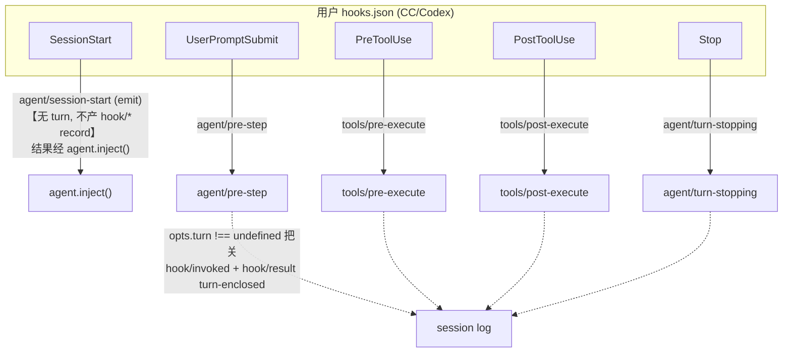
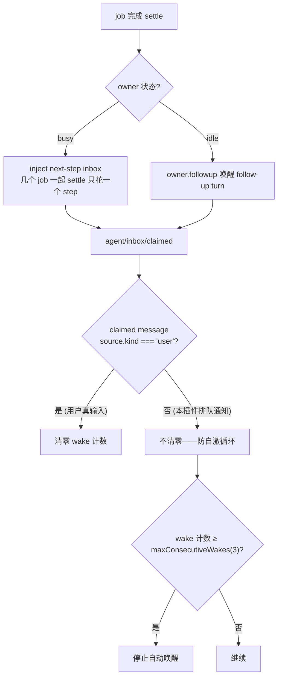
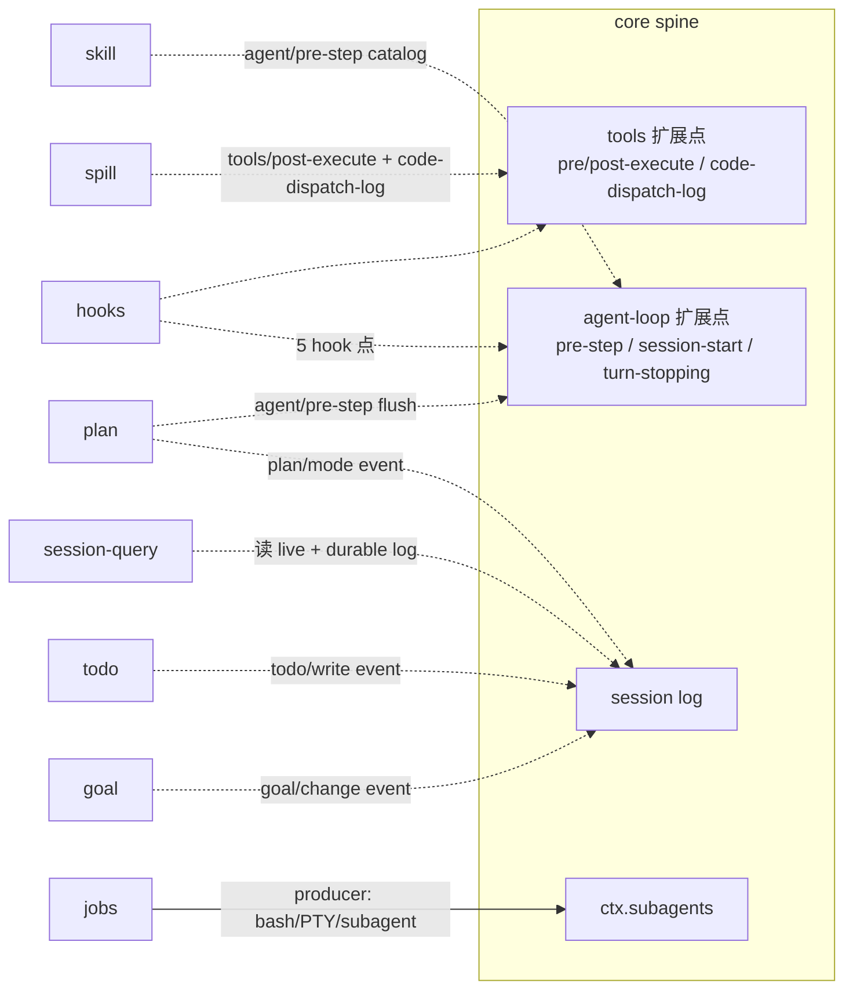

# 第十五篇　扩展生态（下）：工具型扩展
*作者：Amlei　·　更新时间：2026-08-13*

[第十四篇](part-14-ecosystem.md) 深挖了五个自身有承重新机制的核心扩展。这一篇深挖其余八个工具型扩展：hooks（CC/Codex 兼容桥）、skill（技能 catalog）、jobs（后台任务）、goal（持久目标）、spill（溢出存储）、session-query（会话检索）、plan（计划模式）、todo（任务列表）。它们每个都把一两个已立起来的核心模式套到一个具体能力上，但各有自己的非显然点，逐个讲透。

## 第 1 章　hooks —— Claude Code / Codex 兼容桥

**设计动机**：用户已有的 `hooks.json`（CC）或 `.codex/hooks.json`（Codex）描述"在某个 hook 点跑一段 shell 命令"。`dsh` 把这些外部 shell-hook 协议**忠实地接到自己的 typed 拦截扩展点上**，省得用户为兼容重写。

### 1.1　共享协议库 dsh-hook-protocol

```ts
// packages/hooks/hook-protocol/src/runner.ts:67-104（runHook，节选）
export const runHook = async (ctx, point, opts) => {
  const { exitCode, stdout, stderr } = await ctx.shell.exec({ command, timeoutMs: timeoutSec * 1000 })  // 经 ctx.shell
  if (executor rejected) return { exitCode: undefined }   // :96-104 非阻塞
  return parseHookOutput({ exitCode, stdout, stderr })
}
```

`runHook` 经 `ctx.shell` 执行（带 timeoutSec→ms），executor 拒绝时返回非阻塞的 `HookOutput{exitCode:undefined}`（不让一个坏 hook 卡住整个 turn）。`parseHookOutput` 把 exit code 2 → block + stderr；`hookSpecificOutput.permissionDecision` 覆盖顶层 legacy decision。

### 1.2　mergeHookOutputs：权限折叠

```ts
// packages/hooks/hook-protocol/src/merge.ts:35-42, 62（节选）
// rank 表：deny(3) > ask(2) > allow(1)
// 首个 continue:false sticky
```

多个 hook 输出折叠时，权限按 `deny > ask > allow` 取最强（最严）；首个 `continue:false` 是 sticky 的（一旦某个 hook 说"别继续"，后续 hook 的 `continue` 不再翻回 true）。

### 1.3　五个 hook 点映射 typed 扩展点

CC bridge 把五个 hook 点映射到 harness 的 typed 拦截扩展点：

```ts
// packages/hooks/hooks-claude-code/src/index.ts（节选）
SessionStart    → agent/session-start（emit，inject）   // :206
UserPromptSubmit → agent/pre-step                       // :219
PreToolUse      → tools/pre-execute                     // :238
PostToolUse     → tools/post-execute                    // :247
Stop            → agent/turn-stopping                   // :270
```

### 1.4　hook/* record 必须 sit inside open turn

> **非显然点（承重）**：`hook/invoked` + `hook/result` 两条 session event **必须 sit inside an open turn**——由 `opts.turn !== undefined` 把关（`hooks-claude-code/src/index.ts:157, 181`）。

为什么？因为 turn 之间的单纯 append 在重载时与 crash tail 无法区分（见[第四篇·第 7 章](part-04-session.md)的 session/end-seed 边界、[第八篇·第 2 章](part-08-persistence.md)的 crash 恢复）。hook 记录若能出现在 turn 外，crash 后无法判断它是"已完成 hook 的结果"还是"crash 时正在跑的 hook"。所以 hook 记录必须 turn-enclosed。

### 1.5　SessionStart 不产 hook/* record

> **非显然点**：SessionStart 在 turn 1 之前跑，传给 `runPoint` 的参数里**没有 `turn`**（`:207`），所以它**不产 `hook/*` record**——结果只能通过 `agent.inject()` 注入新会话。

SessionStart hook 的结果无法 turn-enclosed（turn 还没开），所以不记 hook 记录，而是 inject 成 model-facing context，等第一条 waking input 开 turn 时进 inbox。代价是慢的 SessionStart hook 异步 resolve 可能错过第一个 user request（两处都标了 `TODO(session-start-gating)`）。

> **关键区分**：规范扩展面是 harness 自己的 typed 拦截点；"native hook" 只是普通 Cordis 插件；这些 bridge 是把外部 shell-hook 协议翻译到同一面的**兼容路径**。原生插件能做 bridge 做的一切且更强（typed return、无序列化边界）——bridge 仅作 CC/Codex 已映射子集的兼容。

### 图 1　hooks bridge 的五点映射与 turn-enclosed 约束



### 权衡

- **bridge 是兼容路径非规范**——typed 拦截点才是规范扩展面，bridge 牺牲了 typed return 的强度（hook 文本经序列化边界），换来用户不用重写 hooks.json。
- **hook/* turn-enclosed**保证 crash 后可判断 hook 记录状态，代价是 SessionStart 无法记 hook 记录（只能 inject）。
- **deny > ask > allow + continue:false sticky**让多 hook 折叠可预测，代价是最严 hook 永远赢（一个 deny 否决所有 allow）。

## 第 2 章　skill —— 技能 catalog + loader

**设计动机**：把可复用的 agent 指令（skill）以 provider-neutral 方式发现并暴露给模型，让本地文件、内嵌数据、HTTP、远程后端都能接同一套 catalog + loader，模型看到的契约不变。

### 2.1　registry 与分层

```ts
// packages/skill/skill/src/index.ts:391, 482（节选）
export class SkillRegistry extends Service {
  registerProvider(provider) { /* 按 calling context 的 scope layer 归档 */ }
  snapshot() { return { skills, complete } }   // complete 门控缓存 collect()
}
```

host + per-scope 分层（over `dsh-scope`，见[第七篇·第 4 章](part-07-seams-scope.md)）。merge `[global, ...chainLayers]`。`snapshot` 返回 `{skills, complete}`——`complete` 门控缓存 `collect()`（只在所有 provider ready 时才缓存）。

### 2.2　文件系统 provider 的 rank 与 watcher

```ts
// packages/skill/skill-filesystem/src/index.ts:36-40（节选）
// rank 序：PROJECT_DSH=100 → USER_AGENTS=500
// roots() :241-261
// Chokidar watcher openRootWatcher() :487（depth:1, awaitWriteFinal, persistent）
// missing-path probe openAncestorWatcher() :452（fs.watchFile 逐段推进）
```

文件系统 provider 按 rank 序（项目级 < 用户级），Chokidar watcher 监听目录变化。`openAncestorWatcher` 处理"路径还不存在"的情况——逐段 `fs.watchFile` 推进，等路径被创建。

### 2.3　catalog digest 只覆盖 name+description

这是 skill 最承重的设计——**digest 故意只覆盖 entry 的 name+description，不覆盖渲染出的框架文字**：

```ts
// packages/skill/tool-skill/src/index.ts:328-335（digestCatalogEntries，节选）
for (const [name, description] of entries) {
  const digest = sha256(name + description)   // 只 hash name + description
}
```

> **非显然点（承重）**：catalog digest **故意只覆盖 entry 的 name+description，不覆盖渲染出的 `<system-reminder>`/`<available_skills>` 框架文字**——所以改写框架话术永远造不出一次 republish，只有 durable entry 列表变化才会。

为什么承重？防"框架文字注入攻击"——如果 digest 覆盖框架文字，攻击者（或一个写歪的 provider）改框架文字就能强制 republish catalog，污染模型上下文。只覆盖 durable entry（name+description），让 republish 只由"技能列表真变了"触发。

### 2.4　禁止双重加载：共享渲染器

```ts
// packages/skill/tool-skill/src/index.ts:125, 198（节选）
// skill tool 的 output.render 调 renderSkillContent（:125）
// user-explicit /name 注入也调 renderSkillContent（:198）
```

> **非显然点**："禁止双重加载"靠共享一个渲染器：`skill` tool 的 `output.render` 和 user-explicit 手势都调同一个 `renderSkillContent`，所以 `/name` 注入落下和 tool 返回**完全相同的 `<skill_content>` 块**，catalog 末尾明确告诉模型：见到这个块就不要再调 `skill` tool。

### 2.5　一方 write/edit 同步失效快路径

```ts
// packages/skill/skill-filesystem/src/index.ts:693（mutationToolName 只接受 'write'|'edit'）
// :332 observeHostMutation() 同步调 invalidate()
```

一方 `write`/`edit` 工具改了技能文件后，`fs/observed` 事件触发同步 `invalidate()`——模型下一步立刻看到自己的文件改动，不等 watcher 异步回调。

### 权衡

- **catalog digest 只覆盖 name+description**防框架文字注入攻击，代价是框架文字变化不触发 republish（要改 entry 本身）。
- **共享渲染器禁止双重加载**让 `/name` 注入与 tool 返回一致，代价是 catalog 末尾要明确告诉模型"见到这个块别再调"。
- **openAncestorWatcher 逐段推进**处理路径不存在，代价是复杂度（不能只 watch 一个固定路径）。
- **一方 write/edit 同步失效**让模型立刻见改动，代价是 watcher 与同步 invalidate 两套机制并存。

## 第 3 章　jobs —— 后台任务注册表

**设计动机**：给长运行工具（后台 bash、PTY send、subagent delegation）一套 owner-isolated 的后台任务协议——观察、取消、等待、完成通知统一在一套契约下，让模型能 `job_output`/`job_list`/`job_kill` 而不是死循环 poll。

### 3.1　owner-isolated + SessionId fence

```ts
// packages/jobs/jobs/src/index.ts:62-177（节选）
start(spec): JobId {
  // 先校验 controller/spec/owner/outputLimitBytes 再调一次 producer run()
}
// packages/jobs/jobs/src/brand.ts:16-19
export type JobId = Branded<'JobId'>   // id 形如 bash-1 可预测
```

`JobId` 形如 `bash-1` 可预测，所以 **owner fence（SessionId 比对）就是边界**（`jobs-local/src/index.ts:356-360` `assertAccess`）——不需要复杂的 ACL，因为 id 本身不含跨 session 信息，session 归属是硬隔离。`get`/`list`/`read`/`kill`/`wait` 都 owner-relative。

### 3.2　完成通知 lane：busy → inject / idle → wake

这是 jobs 最承重的设计——**完成通知由 owner busy/idle 状态在 settle 时决定**：

```ts
// packages/jobs/tool-jobs/src/index.ts:279-300, 225-229（节选）
// busy owner → inject next-step inbox（turn 不能在 inbox 持有它时关闭，所以几个 job 一起 settle 只花一个 step）
// idle owner → owner.followup 唤醒一个 follow-up turn
// agent/inbox/claimed 只有 claimed message 的 source.kind === 'user' 时才清零 wake 计数（:225-229）
```

busy owner 时通知注入 `next-step` inbox——因为 turn 不能在 inbox 持有待处理消息时关闭（见[第三篇·第 2 章](part-03-agent-loop.md)的 turn-stopping 由数据决定），所以几个 job 同时 settle 只花一个 step 处理。idle owner 用 `followup` 唤醒一个新 turn。

### 3.3　唤醒预算自激防护

> **非显然点（承重）**：唤醒预算（`maxConsecutiveWakes=3`，按 exact `Agent` 存 `WeakMap`）是**自激的**——一个被唤醒的 turn 可能正好启动那个完成时会再次唤醒它的 job。为防预算被钻空子，`agent/inbox/claimed` 只有在 claimed message 的 `source.kind === 'user'` 时才清零 wake 计数（`:225-229`）——**本插件自己排队的通知永远不会回填它刚花掉的预算**。

为什么承重？设想循环：job A 完成 → 唤醒 turn → turn 启动 job B → job B 完成 → 唤醒 turn → ...。如果没有"自激防护"，每次唤醒都清零预算，agent 可能被无限唤醒（耗尽 token）。`source.kind === 'user'` 检查让"用户真输入"才重置预算——本插件自己排的通知不算用户输入，预算不被回填，循环自然停在 `maxConsecutiveWakes`。

### 图 2　jobs 完成通知 lane 与自激防护



### 权衡

- **JobId 可预测 + SessionId fence**让 owner 隔离简单（无需 ACL），代价是 id 不含随机性（可猜）——但跨 session 不可用，所以无安全损失。
- **busy inject / idle wake 双 lane**让完成通知高效（busy 时合并、idle 时唤醒），代价是两条路径的逻辑分叉。
- **唤醒预算自激防护**（`source.kind==='user'` 才清零）防无限唤醒循环，代价是这个机制极反直觉。

## 第 4 章　goal —— 持久化的同会话目标

**设计动机**：给一个 agent 会话一个持久的"完成目标"状态，独立于消费它的 model-facing tool 和 continuation 策略。目标状态是 owning session log 的一部分，消费者依赖 `dsh-goal` 而非具体的 agent loop。

### 4.1　事件源状态 + CAS fence

```ts
// packages/goal/goal/src/index.ts:542-558（节选）
commit() { session.append('goal/change', { ...post-mutation snapshot }) }   // 完整快照
// GoalRef{id, revision} CAS fence expectCurrent（:401-411）
```

每次变更 `commit` → `session.append('goal/change', …)`（**完整 post-mutation 快照**，不是 delta）。`GoalRef{id, revision}` 是 CAS fence——并发更新用 `expectCurrent` 校验 revision，stale 写被拒。严格 replay fold（`fold.ts:199-306`）拒不连续 revision / 非法转换 / 时间戳回退。

### 4.2　invariant companion 在 durable log 前拒绝

```ts
// packages/goal/goal/src/invariant.ts:40-71（节选）
// 独立的 ./invariant companion 在 candidate event【进入 durable log 之前】就拒绝 malformed 变更
```

invariant 不是事后校验——它在 event 进 durable log 之前就拒绝 malformed 变更。这保证 log 里永远不会有非法 goal 状态。

### 4.3　goal-round-driver：idle checkpoint 排 goal_round

```ts
// packages/goal/goal-round-driver/src/index.ts:164-205（节选）
// idle checkpoint 为 {goalId, revision} 预订 roundsStarted+1，排一条 <goal_round> prompt
// agent/pre-step before/after 双重校验（:349-414）
// flush-then-recheck durability obligation（:142-154）：排队前 ctx.sessions.flush() 再复查 revision 与竞争 input
```

同会话 continuation driver：idle 时为当前 goal 预订下一轮，排一条 `<goal_round>` prompt 驱动 agent 继续工作。`flush-then-recheck` 是 durability 纪律——排队前先 flush（保证 checkpoint 落盘），再复查 revision（防 flush 期间竞争 input 改了状态）。混合 batch 里 human 让位于 automatic。

### 4.4　activation 刻意永不持久化

> **非显然点（承重）**：**activation 刻意永不持久化**。session log 是唯一 durable 权威——fresh cache、`agent/session-start` 边（`goal/src/index.ts:198-200`）、session resume/fork 都 disarm continuation（`cache()` 播种 `'disarmed'` :421-434），即便严格 replay 发现一个 active durable phase 也一样。只有后来的显式 `resume` mutation 才重新 arm（:310-328），而 `resume` 自己在 `roundsStarted >= maxGoalRounds` 时拒绝（:321-326）。

为什么承重？设想"进程在 goal 中途崩溃重启"。如果 activation 持久化，重启后 agent 会偷偷 auto-continue goal——但用户可能已经离开，这是危险行为（agent 在无人看管下继续消耗 token 跑目标）。所以 activation 必须 process-local——重启后 disarm，必须先有 human 授权的 `resume` event 写进 log 才重新 arm。这把"自动继续"变成"显式授权才继续"。

### 权衡

- **goal/change 完整快照**（非 delta）简化 fold，代价是 event 携带完整 goal 状态。
- **invariant 在 durable log 前拒绝**保证 log 永远合法，代价是 invariant 与 fold 两套校验逻辑。
- **flush-then-recheck**保证 checkpoint 一致性，代价是排队前多一次 flush。
- **activation 永不持久化**让重启不 auto-continue（安全），代价是 resumed goal 必须显式 resume（多一步用户操作）。

## 第 5 章　spill —— 超大 tool 文本溢出存储

**设计动机**：tool 返回的纯文本结果太大时会撑爆模型上下文——spill 把全文存到后端，给模型一个 bounded head/tail 预览 + 定位符 + 检索提示。把"存什么"（seam）、"怎么存"（backend）、"何时存"（policy）三件事分开演化。

### 5.1　seam + branded locator

```ts
// packages/spill/spill/src/index.ts:45-55（节选）
export abstract class SpillStore extends Service {
  abstract saveText(input): Promise<SpillRef>
}
// types.ts:18, 26
export type SpillLocator = Branded<'SpillLocator'>   // opaque
// SpillOwner.sessionId 是 save-time namespace（:37-39）
```

`SpillLocator` 是 branded opaque id；`SpillOwner.sessionId` 是 save-time namespace——spill 文件按 session 隔离。

### 5.2　本地后端：内容寻址 + 独占 hard-link publish

```ts
// packages/spill/spill-local/src/store.ts:73-76, 111-113（节选）
const dir = `<root>/session-<sha256(sessionId).slice(0,12)>`
const path = `<dir>/<randomBytes(6).hex>-<encodeSegment(safeName)>`
open(path, 'wx', 0o600)   // 独占
// encodeSegment（:48-63）防 ../、NUL、symlink
// locator = 文件路径，retrievalHint = read/grep
```

session 目录按 sha256 命名（防跨 session 碰撞）；`encodeSegment` 防 `../`/NUL/symlink 注入；`O_EXCL`（'wx'）独占创建。locator 是文件路径，retrievalHint 告诉模型用 `read` 还是 `grep` 取回。

### 5.3　policy：tools/post-execute consumer

```ts
// packages/spill/spill-policy/src/index.ts:190-209（节选）
ctx.on('tools/post-execute', { prepend: true }, async (exec, result, next) => {
  if (decision.kind !== 'accept') return next()        // :196 排除
  if ('value' in decision) return next()               // :197 有 value 替换
  if (exec.parent !== undefined) return next()         // :197 嵌套
  if (exec.name === 'read') return next()              // :197 防 read→spill→read 循环
  // 字节门控 vs maxInlineBytes（:202-203）
  // 非 text 块跳过（:80-87）
})
```

spill-policy 是 `tools/post-execute` 的 `{prepend:true}` 臂（最外层，先于其它 post-execute listener）。排除项：非 accept、有 value 替换、嵌套 dispatch、`read` 工具（防 read→spill→read 循环）。

### 5.4　replacement 永不增加字节数 + notice 按原文完整字节数

这是 spill 最承重的设计：

```ts
// packages/spill/spill-policy/src/index.ts:130-188, 171, 183-186（节选）
const spillReplacement = (content, totalBytes) => {
  const notice = reserveNotice(totalBytes)   // :171 notice 预留按原文【完整字节数】
  const preview = head + tail                // :172 preview 预算
  // notice-only 兜底（:183-186）
}
```

> **非显然点（承重）**：spill **永远不会增加字节数**——replacement（preview + notice）总是 ≤ `maxInlineBytes` 且严格小于原文。notice 的预留按**原文的完整字节数**（`totalBytes`，:171）而非真实 omission 估算——一个故意的过高估计，配合 :203 已保证的"原文 > cap"，:183 那一处检查就同时涵盖了"在 cap 内"和"严格小于原文"。

为什么承重？spill 的目的是"减小模型上下文"。如果 replacement 可能比原文还大，spill 就没意义（甚至反效果）。notice 按原文完整字节数预留是"过高估计"——它假设最坏情况（notice 要描述整个原文），配合"原文已超 cap"的前提，保证 replacement 一定更小。

### 5.5　read 豁免的 model 臂 vs log 臂

> **非显然点**：`read` 在 model 臂豁免（:197，断 read→spill→read 循环），但 log 臂仍 bound `read` sub-call（:219-222，因为 log copy 不是 model context，循环不会发生）——而 `read` 恰是产出巨型日志的工具。

model 臂豁免 `read` 是因为循环：read 返回大文本 → spill 替换成 locator → 模型为了看内容又调 read → ...。但 log 臂（`tools/code-dispatch-log`）bound `read` sub-call，因为 log copy 不是模型上下文（模型看不到 code-dispatch 的 content），循环不会发生——而 `read` 恰是产出巨型日志的工具，log 臂 bound 它能省存储。

### 权衡

- **三角色分离**（seam/backend/policy）让"怎么存"与"何时存"独立演化，代价是三个包协调。
- **replacement 永不增加字节数**保证 spill 一定减小上下文，代价是 notice 按原文完整字节数过高估计（可能预留过多）。
- **read 在 model 臂豁免但 log 臂 bound**是精心设计的非对称——model 臂防循环，log 臂省存储。
- **session 命名空间隔离**让 spill 文件按 session 隔离，代价是跨 session 不能共享 spill（每个 session 独立）。

## 第 6 章　session-query —— 会话检索（FTS5 + literal regex）

**设计动机**：独立于 compaction，提供对 live 与 durable 会话日志的授权检索——exact 读、关系 trace、全文搜索。模型消费者只拥有 workspace 权限 + cursor-free 渲染。

### 6.1　exact 读 + 抽象全文方法

```ts
// packages/session-query/session-query/src/index.ts:81（节选）
export class SessionQueryEngine {
  // 全部 exact 读：listSessions, readSession, filterSessions, filterEvents, readEvent, readSurface, listEvents, traceSession, traceEvent
  // 两个抽象全文方法：searchSessions, searchEvents
}
```

exact 读全部实现；全文方法抽象（由 sqlite backend 实现）。`SessionSearchCursor` 是 branded。

### 6.2　filterEvents 用 literal regex 非 FTS

```ts
// packages/session-query/session-query/src/filters.ts:105-118（compileSessionTextFilter，节选）
// literal regex 文本扫描（非 FTS）
// metachar 转义（:115），whitespace→\s+（:116）
```

> **非显然点（承重）**：`filterEvents` 的 text clause **故意是 literal regex 扫描而非 FTS**——因为 `unicode61` tokenizer 是 token/phrase 召回，**不能匹配一个 token 内部的子串**（`AI` 不会命中 `BRAID`）；metachar 转义 :115、whitespace→`\s+` :116 让它既 injection-safe 又灵活。FTS5 只活在 `searchEvents`/`searchSessions` 里。

为什么承重？FTS5 的 `unicode61` tokenizer 把文本切成 token，查询也切成 token，做 token 级匹配。但"找一个 token 内部的子串"（如 `AI` 在 `BRAID` 里）FTS 做不到——它只能匹配完整 token。`filterEvents` 需要"文本里有没有这段子串"，所以用 literal regex 扫描；`searchEvents`/`searchSessions` 需要"全文检索排序"，所以用 FTS5。两套机制各司其职。

### 6.3　cursor 内部消化

```ts
// packages/session-query/tool-session-query/src/operations.ts:239-272（collectPages，节选）
// cursor 在 collectPages 内部消化
// current-session 截止 stepStart.seq-1（:127-136）
```

> **非显然点（承重）**：generation-bound cursor 在引擎里**确实存在**（`types.ts:222-227`，校验 `index.ts:959-990`，在 `_serialized` :371-393 下 exclusive 运行），但 `collectPages` 在内部消费它们，所以**模型看到的是 cursor-free 的 bounded 页**——不暴露 cursor/offset/page size/模型可控 limit。

为什么承重？cursor 是实现细节（分页、generation 隔离），暴露给模型会让模型上下文复杂（模型要管理 cursor）。`collectPages` 内部消化 cursor，模型只看到"这是第 N 页结果"——简洁。current-session 截止 `stepStart.seq-1` 是因为 live session 的当前 step 还没结束，不能查到进行中的内容。

### 6.4　权限：exact-cwd

```ts
// packages/session-query/tool-session-query/src/workspace-access.ts:94-97（节选）
// exact-cwd 权限：调用方的 cwd 必须等于 session 的 cwd
```

session-query 的权限是 exact-cwd——调用方的工作目录必须严格等于被查 session 的 cwd。不是"同 workspace"或"同用户"，而是"同一个目录"。这防跨 workspace 查询。

### 权衡

- **filterEvents literal regex 非 FTS**让子串匹配可行（FTS 做不到 token 内子串），代价是性能（regex 扫描比 FTS 慢）。
- **cursor 内部消化**让模型上下文简洁，代价是引擎复杂度（cursor 生成、校验、exclusive 运行）。
- **exact-cwd 权限**严格隔离 workspace，代价是"同用户不同目录"也不能查。
- **FTS5 unicode61 tokenizer**适合大多数自然语言全文检索，代价是对无空格语言（如中文）分词不理想——但这是 FTS5 的通用限制。

## 第 7 章　plan —— 计划模式是 logged state

**设计动机**：plan mode 是 **logged state** 而非模式开关——`plan/mode` 是 log-only whole-value-replace 事件，resume/fork/compaction 直接从 log 恢复；sandbox 与 approval 独立 enforcement，不读写 plan state。

### 7.1　plan/mode 是 log-only 事件

```ts
// packages/plan/plan-mode/src/index.ts:46-55（节选）
'plan/mode': { active: boolean }   // log-only SessionEventMap 成员
// foldPlanMode（:129-138）：线性 fold，last wins，默认 inactive
```

`plan/mode` 是 log-only 的 whole-value-replace 事件——不是 `plan/start`/`plan/end` 增量对，而是一个 `{active: boolean}` 整值，last-write-wins。fold 是线性的（从尾找最新）。

### 7.2　set 的四态结果

```ts
// packages/plan/plan-mode/src/index.ts:425-445（set，节选）
set(agent, active): 'committed' | 'queued' | 'cancelled' | 'noop' {
  if (idle && !hasOpenTurn()) {
    session.append('plan/mode', { active })   // :440 立刻 standalone append
    return 'committed'
  }
  if (openTurn) { pendingIntents.push(...); return 'queued' }   // :431 存 pending 等 boundary
}
// agent/pre-step listener（:205-222）调 onBoundary()（:448-460）在下次 request 组装前 append pending
```

> **非显然点**：`set()` 的四态结果存在，是因为 idle agent 在下一个 prompt 前**没有** in-turn `agent/pre-step`，事件必须立刻 standalone append（:440）；running agent 的选择被 hold pending 在 boundary flush（:456）。

四态：`committed`（idle，立刻 append）、`queued`（running，存 pending）、`cancelled`（被竞争 input 覆盖）、`noop`（状态没变）。

### 7.3　/plan 命令与 exit_plan_mode tool

```ts
// packages/plan/plan-mode/src/index.ts:269-303（节选）
// /plan [message] / /plan off 命令（message 经 agent.steer() :294）
// exit_plan_mode（:305-393）：始终注册（tool catalog 跨转换稳定），只 active 时执行
// review 用 intent:{kind:'plan-review', approve}（:347）
```

`exit_plan_mode` tool **始终注册**（不管 plan mode 是否 active）——这让 tool catalog 跨 plan mode 转换稳定（模型看到的工具列表不变），只在 active 时才真正执行。`/plan off` 经 `agent.steer()` 投递（非直接 set）。

### 权衡

- **plan mode 是 logged state 非开关**让 resume/fork/compaction 自动恢复 plan 状态，代价是 `plan/mode` 事件进 log。
- **exit_plan_mode 始终注册**让 tool catalog 稳定，代价是 tool 在非 active 时是 no-op（模型可能白调）。
- **set 四态结果**精确反映 idle/running 差异，代价是调用方要处理四种返回值。
- **sandbox/approval 与 plan 独立**让安全策略不依赖 plan 状态，代价是 plan 不"自动收紧"安全（要单独切 sandbox mode）。

## 第 8 章　todo —— 最小 item 形状 + whole-list replace

**设计动机**：agent 的完整任务列表，每次调用整体替换；item 形状刻意最小（content + 三态 status），whole-list replacement 不需要稳定 id。

### 8.1　todo_write whole-list replace

```ts
// packages/todo/tool-todo/src/index.ts:149-225（节选）
todo_write(todos: [{ content, status }]) {
  // item schema additionalProperties: false（:159）——让 id/nesting 在 schema 边界就 fail loud
  // toTodoList（:91-111）全列表构建，无 id，三态 pending|in_progress|completed
  // execute（:206-213）：exec.agent.session.append('todo/write', { todos }) whole-list replace last-write-wins
}
// allowParallelInProgress 是 required() config（:41-43）
```

`additionalProperties: false` 让 id/nesting 在 schema 边界就 fail loud——而非悄悄 flatten 掉。whole-list replace last-write-wins，所以 item 不需要稳定 id（每次都是全新列表）。

### 8.2　TodoItem 定义在 dsh-session

```ts
// packages/core/session/src/types.ts:189-194（节选）
export interface TodoItem {
  content: string
  status: 'pending' | 'in_progress' | 'completed'
}
```

`TodoItem` 定义在 `dsh-session`（而非 `dsh-tool-todo`），因为它是 session event `todo/write` 的 payload 类型——session 是权威。

### 8.3　durable log 对 in-progress 计数沉默

> **非显然点（承重）**：todo 的 durable log **对 in-progress 计数沉默**——它只存 `{content, status}`，所以一份在 `allowParallelInProgress:true` 下写的 log，在部署收紧成 single-active 后**仍能正确 replay**（parallel 拒绝是 `toTodoList` 的 admission-time 检查 :107，不是 log invariant）。

为什么承重？设想：部署 A 允许并行 in_progress（多个 task 同时进行）；部署 B 只允许单个 in_progress。一个 agent 在部署 A 下写了"两个 in_progress task"的 todo log，然后在部署 B 下 resume。如果 durable log 强制"最多一个 in_progress"，部署 B 会拒绝 replay（log 非法）。但 `dsh` 把 parallel 检查放在 admission-time（`toTodoList` :107），log 只存原始 `{content, status}`——所以 log 跨部署收紧仍正确 replay，只是新的 write 会被 admission 拒绝。这让部署策略可演进，不破坏历史 log。

### 8.4　todos projection unit 在 turn/start 清空

```ts
// packages/todo/tool-todo/src/index.ts:135-148（节选）
// todos projection unit：init: ()=>null，apply 在 todo/write 取整列表、在 turn/start 清成 null、其余同引用
// stateVersion: 2
```

`todos` projection unit 在 `turn/start` 清成 `null`——这是"standing plan"语义：每个新 turn 开始时，todo 列表是"待重新确认"的（null），直到 agent 再次 `todo_write`。`stateVersion: 2` 是 unit 形状的版本（见[第十四篇·第 3 章](part-14-ecosystem.md)的 ver-mismatch discard）。

### 权衡

- **whole-list replace 无 id**简化了模型用法（不用管 id），代价是模型每次重写整个列表（大列表时 token 多）。
- **additionalProperties: false fail loud**防 id/nesting 静默 flatten，代价是模型偶尔要重试（schema 拒绝）。
- **durable log 对 in-progress 计数沉默**让部署策略可演进，代价是 admission-time 检查与 log 解耦（两处逻辑）。
- **todos projection 在 turn/start 清空**实现 standing plan 语义，代价是每个 turn 要重新 todo_write（如果 agent 忘了，列表显示为空）。

## 第 9 章　总览：这八个扩展如何挂在 core spine 上



| 扩展 | ctx key | provider 例子 | 承重新机制 |
|---|---|---|---|
| hooks | 无（library + 桥） | hook-protocol + CC/Codex 桥 | hook/* turn-enclosed（SessionStart 例外） |
| skill | `ctx.skills` | skill-filesystem / skill-badge | catalog digest 只覆盖 name+description（防注入） |
| jobs | `ctx.jobs` | jobs-local | 唤醒预算自激防护（source.kind==='user' 才清零） |
| goal | `ctx.goals` | goal + goal-round-driver | activation 永不持久化（重启需显式 resume） |
| spill | `ctx.spillStore` | spill-local | replacement 永不增加字节数（notice 按原文完整字节数） |
| session-query | `ctx.sessionQuery` | session-query-sqlite (FTS5) | filterEvents literal regex 非 FTS + cursor 内部消化 |
| plan | `ctx.planMode` | plan-mode | plan mode 是 logged state 非开关 + exit_plan_mode 始终注册 |
| todo | 无（直接 append event） | tool-todo | durable log 对 in-progress 计数沉默（跨部署 replay） |

## 权衡总账

- **hooks bridge 是兼容路径非规范**——typed 拦截点才是规范扩展面；hook/* turn-enclosed 保证 crash 可判断。
- **skill catalog digest 只覆盖 name+description**防框架文字注入攻击；共享渲染器禁止双重加载。
- **jobs 唤醒预算自激防护**（source.kind==='user' 才清零）防无限唤醒循环。
- **goal activation 永不持久化**让重启不 auto-continue（安全），必须显式 resume。
- **spill replacement 永不增加字节数**保证 spill 一定减小上下文；read 在 model 臂豁免但 log 臂 bound 是精心设计的非对称。
- **session-query 的 filterEvents literal regex 非 FTS**让子串匹配可行；cursor 内部消化让模型上下文简洁。
- **plan mode 是 logged state 非开关**让 resume/fork/compaction 自动恢复；exit_plan_mode 始终注册让 tool catalog 稳定。
- **todo durable log 对 in-progress 计数沉默**让部署策略可演进，不破坏历史 log。

共同纪律（与[第十四篇](part-14-ecosystem.md)一致）：**把"写什么 durable 事实"与"模型/客户端看到什么"严格分离**——log 是唯一权威，模型可见内容由具名 consumer 负责。

（hooks 挂的 typed 扩展点见[第三篇](part-03-agent-loop.md)与[第五篇](part-05-tools.md)；spill/goal/plan/todo 的 session event 见[第四篇·第 2 章](part-04-session.md)；jobs/workflow 经 subagents 见[第十篇](part-10-subagent.md)；session-projection 经 api-proxy 见[第十三篇](part-13-boot.md)。）
