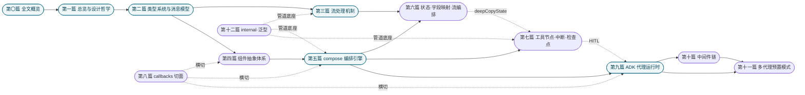

# Eino 源码剖析：设计思想、实现机制与实现原理

**第〇篇　全文概览**

*作者：Amlei　·　更新时间：2026-08-09*

> 本篇是全书的入口。它不谈任何一行具体代码，而是回答四个问题：**这本书写给谁、它讲什么、怎么读、需要先知道什么**。如果你是该方向的学习者，请先读完本篇的「读者指南」与「概念入门」两节——它们是后续十一篇密集实现描述的"释疑底座"，旨在避免作者因为熟悉这些概念而默认你也熟悉（即所谓"知识诅咒"）。

---

## 序言

Eino（读作 ['aino]）是 CloudWeGo（字节跳动）推出的 Go LLM 应用开发框架，借鉴 LangChain 与 Google ADK。本书不是它的使用手册，而是反过来追问一件事：**这套框架是如何被造出来的**。

全书以**第三人称客观视角**撰写，从**设计思想、实现机制、实现原理**三个维度，按「篇 / 章 / 节」的书籍层级，逐子系统地深挖。每一处关键机制都标注 `文件:行号`，可作代码导航的索引；每一篇结尾有"权衡总账"，把分散在正文里的设计取舍收束成几条论断。

本书力求**详略得当**：对核心/关键机制（流处理、compose 编排引擎、ADK 代理运行时、中断/检查点、中间件链、多代理委派）给予专篇深挖；对边缘或支撑性内容（internal 管道层、组件实现细节）点到即止。若干处特别标注了与项目既有文档（如 README、doc.go）的出入——例如 README 的 adk 示例 `event.Message.Content` 实际无法编译、`DeepAgent` 的"python/web search"能力需用户自行提供、`AgenticMessage` 砍掉了 `Tool` 角色——这些勘误是力求精确的体现。

---

## 一、读者指南

### 1.1　这本书写给谁

主要面向**该方向的学习者**：正在学习"如何构建一个生产级 LLM 应用框架"的工程师，或正在自建编排/agent 系统、想借鉴成熟模式的设计者。作者**无法假设你的知识深度与广度**——因此本篇第二节「概念入门」专门为不熟悉某些术语的读者准备了学习者级的解释；后续正文中出现这些概念时，会以"概念见第〇篇·X"的方式回指。

### 1.2　如何阅读

- **自顶向下（推荐）**：先读本篇（尤其概念入门与关系图），再读[第一篇](part-01-overview.md)建立全局观，然后按篇顺序读。[第二、三篇](part-02-schema.md)的类型与流是两大基石，[第五篇](part-05-compose.md)的编排引擎与[第九篇](part-09-adk.md)的代理运行时是两条主线。
- **按主题跳读**：若只关心某一子系统（如"compose 的图如何调度"），直接跳至[第五篇](part-05-compose.md)，并按其内部交叉引用回指[第三篇](part-03-streaming.md)的流与[第六篇](part-06-state.md)的状态。
- **导航锚点**：[第一篇·第 2.2 节](part-01-overview.md)的"代码地图与依赖链"是全书最重要的导航锚点——后续每一篇都是在那张依赖图的某一框内"放大"。

### 1.3　详略原则与体例

- 每篇结尾的"**为何如此设计：权衡的总账**"是该篇最值得反复回看的部分。
- 配图：复杂关系用 **Mermaid**（架构图、状态机、时序图、拓扑图、依赖图），简单示意用 **ASCII**。
- 交叉引用：篇与篇之间的关系在正文中以可点击的 markdown 链接标注，具体到"第 N 篇·第 X 章 标题"。
- 释疑：需要展开的背景知识，在正文中以"知识补充"给出，或回指本篇概念入门。
- 勘误：与上游文档（README、doc.go）的出入显式标注为"一处校正/澄清/实现瑕疵"。

---

## 二、概念入门（释疑底座）

> 下列概念在全书反复出现。如果你已熟悉某条，跳过即可；若不熟，这里的解释足够你读懂正文——它们不是严谨定义，而是"够用的直觉"。每条标注了**主要出现于**哪一篇，便于回查。

**1. LLM / 大模型　·　主要出现于：[第二篇](part-02-schema.md)、[第四篇](part-04-components.md)**
大语言模型（Large Language Model）：输入一段文本（"提示"），输出一段文本（"回答"）。它是概率性的——同样输入可能得到不同输出。Eino 把"与 LLM 通话"抽象成 `ChatModel` 组件，输入输出都是 `Message`。

**2. agent / 代理循环 / ReAct　·　主要出现于：[第九篇](part-09-adk.md)**
agent 不是"一次问答"，而是一个**循环**：接收消息 → 调模型 → 若模型要求调用工具则执行工具、把结果送回模型 → 再调模型 → ……直到模型给出不再需要工具的最终回答。**ReAct**（Reason + Act）是这类循环的范式名——"推理一步、行动一步"交替。Eino 的 ReAct 循环本身就是一张 compose.Graph（[第九篇·第 4 章](part-09-adk.md)）。

**3. function calling / tool calling　·　主要出现于：[第四篇·第 4 章](part-04-components.md)、[第七篇](part-07-tools-interrupt.md)**
现代大模型可以不直接"说话"，而是输出一个**结构化的工具调用请求**。宿主程序拦截这个请求、真正去执行（比如联网搜索、跑命令）、再把结果作为新消息喂回模型。模型 thus 能够"行动"。

**4. token / 上下文窗口（context window）　·　主要出现于：[第十篇](part-10-middlewares.md)（摘要/归约）**
模型每次调用的输入有**大小上限**，以 token 计（粗略地：1 token ≈ 4 个英文字符 ≈ 0.5–1 个汉字）。一轮对话积累的消息越多，越接近上限。超出则必须**压缩**（summarization/reduction 中间件）。"上下文窗口"就是这一上限。

**5. 提示缓存 / prefix cache / KV cache　·　主要出现于：[第十篇·第 3 章](part-10-middlewares.md)（summarization/reduction 的 cache 友好设计）**
模型在生成回答前，要把整段输入"读"一遍，计算每个 token 的 Key/Value 张量（KV）。如果两次调用的**开头部分完全相同**，这部分 KV 可以**缓存复用**，大幅降低延迟与成本——这就是 prefix cache。正因如此，Eino 的多个中间件（reduction 的 `ClearAtLeastTokens`、dynamictool 的过滤警告）都刻意避免"小改写破坏缓存前缀"。

**6. 流式 / streaming　·　主要出现于：[第三篇](part-03-streaming.md)（全书招牌）**
模型生成是增量式的——token 逐个吐出，首字延迟（TTFT）与总吞吐同等重要。**流式**就是不等到整段就绪，边生成边向下游传递。Eino 把"流"在 `schema` 层就定义为基础数据类型，使流能在图编排的节点间端到端透传。

**7. RAG（检索增强生成）　·　主要出现于：[第四篇·第 5 章](part-04-components.md)**
Retrieval-Augmented Generation：先用查询从知识库检索相关文档，再把文档塞进提示喂给模型。Eino 的 RAG 管道由 Embedder（向量化）、Indexer（写库）、Retriever（检索）、Document（Loader/Transformer）四个组件契约拼装。

**8. Go interface / 隐式实现（结构化类型）　·　主要出现于：[第四篇·第 1 章](part-04-components.md)**
Go 的 interface 是"方法集"契约：一个类型只要拥有 interface 列出的方法，就自动满足该 interface，**无需 `implements` 声明**。这让"接口在本仓、实现在外"成为可能——eino-ext 的实现只要导入接口与数据类型即可被消费。

**9. Go 泛型 / 类型参数　·　主要出现于：[第十二篇](part-12-internal.md)、贯穿全书**
Go 1.18 引入的**类型参数**：写一份代码，对多种类型复用，且编译期类型安全。如 `StreamReader[T]` 的 `T` 就是类型参数，使流对元素类型强约束。Eino 用泛型把大量类型检查前移到编译期。代价是 Go 泛型不支持"方法的类型参数"，故 Eino 用"编译期泛型、运行期类型擦除"边界折中。

**10. channel / goroutine / 并发　·　主要出现于：[第三篇](part-03-streaming.md)、[第九篇](part-09-adk.md)**
Go 的并发原语：**goroutine** 是轻量级线程，**channel** 是 goroutine 间传递数据的管道。Eino 的流建立在 channel 之上；agent 事件流的生产/消费在不同 goroutine 间进行。

**11. 图 / DAG / 拓扑排序　·　主要出现于：[第五篇](part-05-compose.md)**
**图（Graph）** 由节点与边组成；**DAG**（有向无环图）是不含环的图，节点可按依赖关系排出线性顺序（**拓扑排序**，Kahn 算法）。Eino 的 compose 把组件编排成图；DAG 模式编译期用 Kahn 算法检测环。

**12. Pregel / 超步（superstep）　·　主要出现于：[第五篇·第 4 章](part-05-compose.md)**
Google 提出的图计算模型：执行分成一轮轮"超步"，每轮所有节点并发处理、结束后 barrier 同步、再进下一轮。Eino 的 Pregel 模式用超步驱动循环图，靠 `maxRunSteps` 防死循环。

**13. 类型擦除 / 反射（reflection）　·　主要出现于：[第十二篇·第 6 章](part-12-internal.md)**
泛型代码在某些边界（如动态分发、序列化）必须放弃编译期类型信息、退化成 `any`——这叫**类型擦除**；运行期再靠**反射**（`reflect` 包）把 `any` 还原回具体类型。Eino 在节点边界与检查点序列化处用反射兜底。

**14. prompt injection / 提示注入　·　主要出现于：[第十篇](part-10-middlewares.md)（filesystem/agentsmd）**
攻击者把恶意指令藏在模型会读到的文本里（如工具返回、网页内容、文件），诱使模型执行非预期动作。Eino 的 Jinja2 模板禁用了 `include/extends/import/from` 防文件读取；filesystem 的 Backend 是文件访问的唯一安全边界。

**15. HITL（人机协同）/ 中断/恢复 / checkpoint　·　主要出现于：[第七篇](part-07-tools-interrupt.md)**
Human-In-The-Loop：agent 或工具在运行中暂停、等待人工输入、再从断点继续。**checkpoint** 是暂停瞬间持久化的图状态，使恢复成为可能。Eino 的中断以 error 形式抛出、冒泡到 Runnable 边界，由地址驱动的定向恢复续跑。

**16. 中间件 / 切面 / AOP　·　主要出现于：[第十篇](part-10-middlewares.md)、[第八篇](part-08-callbacks.md)**
把"横切关注点"（如日志、压缩、规范注入）抽成一条可插拔的处理链，核心循环只负责按固定编排跑这条链——核心不污染、能力可增减。这叫面向切面编程（AOP）。Eino 的 callbacks 是"纯观测"切面，middlewares 是"语义改写"切面。

**17. event iterator / pull-based　·　主要出现于：[第九篇·第 2 章](part-09-adk.md)**
调用方主动 `Next()` 一条条拉取结果（pull），而非被回调推（push）。Eino 的 agent 事件流是 pull-based 的——调用方控制节奏，天然支持流式与背压。

**18. MCP（Model Context Protocol）　·　主要出现于：[第二篇·第 3 章](part-02-schema.md)（AgenticMessage 的 content blocks）**
让"模型宿主"与"外部工具服务器"互通的**标准协议**。Eino 的 `AgenticMessage` 在 content block 层级原生支持 `mcp tool call/result/list/approval` 等类型。

**19. Mermaid / ASCII 图　·　贯穿全书**
Mermaid 是一种用文本描述图表、由阅读器渲染成图的小语言（流程图、时序图、状态机、拓扑图）。ASCII 图是直接用字符画的示意图。本书复杂关系用 Mermaid，简单示意用 ASCII。

---

## 三、总目录（含关系引用）

> 每篇给出：一行主旨、**前置**（读这篇前最好先读哪篇）、**延伸**（这篇被谁引用/相关）。关系汇总见第四节"章节关系图"。

### 第一篇　总览与设计哲学（[`part-01-overview.md`](part-01-overview.md)）
Eino 定位、Go 范式取舍、三大支柱、四种流范式、代码地图与依赖链。**前置**：本篇（第〇篇）。**延伸**：全书各篇均建立在其架构图之上。

### 第二篇　类型系统与消息模型（[`part-02-schema.md`](part-02-schema.md)）
Message/Tool/Document 类型、序列化、多 provider 的统一消息适配、AgenticMessage 第二代模型。**前置**：本篇。**延伸**：被全书反复引用——它是公共类型契约。

### 第三篇　流处理机制（[`part-03-streaming.md`](part-03-streaming.md)）
StreamReader/Writer、五种 readerType、concat/copy/merge——Eino 的招牌能力。**前置**：[第二篇](part-02-schema.md)。**延伸**：被[第六篇·第 3 章](part-06-state.md)的节点间流编排、[第八篇·第 3 章](part-08-callbacks.md)的流式观测复用。

### 第四篇　组件抽象体系（[`part-04-components.md`](part-04-components.md)）
ChatModel/Tool/Retriever/Embedding/ChatTemplate 的接口契约、Option 双轨、流范式声明。**前置**：[第二篇](part-02-schema.md)。**延伸**：被[第五篇](part-05-compose.md)包装成节点、被[第七篇](part-07-tools-interrupt.md)的工具节点消费。

### 第五篇　compose 编排引擎（[`part-05-compose.md`](part-05-compose.md)）
Graph/Chain/DAG/Branch/Pregel/Runnable 的编译期校验与运行期调度。**前置**：[第四篇](part-04-components.md)。**延伸**：被[第六篇](part-06-state.md)的状态/字段映射、[第七篇](part-07-tools-interrupt.md)的中断/checkpoint、[第九篇](part-09-adk.md)的 ReAct 图复用。

### 第六篇　图的状态、字段映射与流编排（[`part-06-state.md`](part-06-state.md)）
StateGraph 可变状态单例（非 reducer）、字段映射、节点间流读拼、泛型助手。**前置**：[第五篇](part-05-compose.md)。**延伸**：与[第七篇·第 3 章](part-07-tools-interrupt.md)的 `deepCopyState` 直接对接。

### 第七篇　工具节点与中断/恢复/检查点（[`part-07-tools-interrupt.md`](part-07-tools-interrupt.md)）
ToolsNode 并发分发、HITL 三档中断、地址驱动恢复、检查点与版本迁移。**前置**：[第五篇](part-05-compose.md)。**延伸**：被[第九篇·第 6 章](part-09-adk.md)的 agent HITL、[第十一篇](part-11-multiagent.md)的跨代理中断复用。

### 第八篇　callbacks 切面机制（[`part-08-callbacks.md`](part-08-callbacks.md)）
OnStart/OnEnd/OnError 五注入点、handler 链洋葱模型、流式 N+1 复制。**前置**：[第四篇](part-04-components.md)。**延伸**：横切所有组件/图/agent。

### 第九篇　ADK 代理运行时（[`part-09-adk.md`](part-09-adk.md)）
Agent/Runner/事件流、ReAct 回合循环、取消安全点状态机、failover/retry、agent-as-tool。**前置**：[第五篇](part-05-compose.md)、[第七篇](part-07-tools-interrupt.md)。**延伸**：被[第十篇](part-10-middlewares.md)、[第十一篇](part-11-multiagent.md)建立其上。

### 第十篇　中间件链（[`part-10-middlewares.md`](part-10-middlewares.md)）
八个可插拔中间件（dynamictool/plantask/skill/summarization/agentsmd/filesystem/patchtoolcalls/reduction）、钩子粒度与持久化边界。**前置**：[第九篇](part-09-adk.md)。**延伸**：[第十一篇](part-11-multiagent.md)的 DeepAgent 默认装载 filesystem 与 write_todos。

### 第十一篇　多代理预置模式（[`part-11-multiagent.md`](part-11-multiagent.md)）
DeepAgent/Plan-Execute/Supervisor 三种多代理拓扑、文件系统 Backend、agent_tool 委派。**前置**：[第九篇](part-09-adk.md)、[第十篇](part-10-middlewares.md)。**延伸**：多代理协作原语复用[第九篇·第 9 章](part-09-adk.md)。

### 第十二篇　内部通用机制与 Go 泛型（[`part-12-internal.md`](part-12-internal.md)）
generic/gmap/gslice、UnboundedChan/concat/merge 原语、自研类型标签序列化、safe/core/mock。**前置**：[第三篇](part-03-streaming.md)（理解 concat/merge 角色）。**延伸**：被全书作为管道底座复用。

---

## 四、章节关系图

下图给出各篇之间的**主要依赖与引用关系**（箭头 A→B 表示"A 是 B 的前置/被 B 引用"）。



图注：深色为全书骨架篇（概览、类型、流、编排、ADK）。虚线为横切/底座关系。

**三条推荐阅读路径（ASCII）**：

```
理解类型与流：     ① → ② → ③                （总览 · schema · 流）
理解确定性编排：   ② → ④ → ⑤ → ⑥            （schema · 组件 · 图 · 状态）
理解自主 agent：   ⑤ → ⑨ → ⑩ → ⑪            （图 · ADK · 中间件 · 多代理）
```

---

## 五、贯穿全书的设计主线

理解以下六条主线，就理解了 Eino 为何在每一处细节上都做出了那些看似繁琐、实则一致的选择。

1. **三大支柱分层 + schema 叶子**。组件（接口契约）/ 编排（确定性）/ 代理（自主）三层正交，公共类型下沉到不依赖任何人的 `schema` 叶子包，`internal/` 作管道底座。依赖严格自上而下，无环。主线见[第一篇·第 2 章](part-01-overview.md)，贯穿全书。
2. **流为一等公民**。流在 `schema` 层就被定义为基础数据类型（`StreamReader[T]` 五种 readerType），四种流范式（Invoke/Stream/Collect/Transform）由组件按"提供哪些方法值"声明，框架在节点边界自动桥接不匹配。主线贯穿[第三篇](part-03-streaming.md)、[第六篇·第 3 章](part-06-state.md)。
3. **编译期泛型、运行期类型擦除**。Go 1.18 泛型把类型错误前移到编译期；但在图编排动态分发与检查点序列化的"类型擦除边界"回落到反射。`TypeOf[T]()` 是这条桥的基石。主线贯穿[第五篇·第 3 章](part-05-compose.md)、[第六篇·第 5 章](part-06-state.md)、[第十二篇·第 6 章](part-12-internal.md)。
4. **确定性（compose）与自主（adk）分治，且 adk 复用 compose 作引擎**。compose 可预测、可类型检查、可恢复；adk 灵活、可处理开放任务。ReAct 循环本身就是一张 compose.Graph。主线收束于[第九篇·第 1、4 章](part-09-adk.md)。
5. **可变状态单例 + checkpoint 显式深拷贝（而非 reducer）**。图状态是挂在 `context.Context` 上的可变单例，靠 mutex 与用户处理器原地改；跨轮累积靠处理器，回放/分叉靠 checkpoint 的序列化深拷贝。这与 LangGraph 的 reducer 模型是根本性的理念差。主线见[第六篇·第 1 章](part-06-state.md)、[第七篇·第 3 章](part-07-tools-interrupt.md)。
6. **多代理收敛到 agent-as-tool**。源码里 `TransferToAgent`/`OnSubAgents`/`RunPath`/`workflow`/`deterministic_transfer` 全部标注 NOT RECOMMENDED，官方路线从"全上下文转移"收敛到"agent-as-tool"——子代理在独立 checkpoint、隔离上下文里跑，只回最终文本。主线收束于[第九篇·第 9 章](part-09-adk.md)与[第十一篇](part-11-multiagent.md)。

---

*第〇篇完。从这里出发，进入[第一篇](part-01-overview.md)「总览与设计哲学」。*
