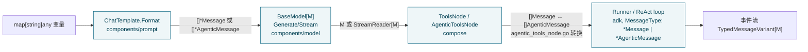

# 第二篇　类型系统与消息模型

*作者：Amlei　·　更新时间：2026-08-09*

> `schema` 是 Eino 全栈的"公共类型语言"——它定义 Message、Document、ToolInfo 等核心结构，被 components / compose / flow / adk 各层共同依赖，而自己不依赖它们中的任何一个。本篇剖析这套统一类型契约：一份 `Message` 结构里如何容纳三套内容表示、`AgenticMessage` 为何是"第二代"消息模型、多 provider 的私有数据如何被收编、流式分片如何合并。
>
> 理解 schema 是理解后续各篇的前提：[第三篇](part-03-streaming.md)的流载着 `*Message` 跑、[第四篇](part-04-components.md)的组件产消 `*Message`、[第五篇](part-05-compose.md)的图节点用 `*Message` 做类型锚、[第九篇](part-09-adk.md)的 agent 循环把 `[]*Message` 当黑板。

---

## 第 1 章　设计目标：统一类型契约，打破循环依赖

不同 LLM provider（OpenAI / Claude / Gemini / ARK / Qwen …）的消息、工具、文档表示各不相同。若编排框架直接面向某一家 provider 的结构编程，组件、编排、agent 三层就会与 provider 耦合，且彼此循环依赖。`schema` 包的使命就是提供一个稳定、统一、与具体 provider 解耦的类型契约：**任何一层都只面向 `*schema.Message` 编程，而不面向 OpenAI 的 `ChatCompletionMessage` 或 Anthropic 的 `ContentBlock` 编程**。

`schema/doc.go:17` 开宗明义："Package schema defines the core data structures and utilities shared across all Eino components." 包内三类一等公民（`doc.go:22-36`）：

- `Message` —— 用户、模型、工具之间的通用通信单元；
- `Document` —— 带元数据的一段文本，是 Loader / Transformer / Indexer / Retriever 之间的"流通货币"；
- `ToolInfo` —— 工具的名字、描述与参数 schema，外加 `ToolChoice` 控制模型是否必须调工具。

全仓库非测试代码导入 `cloudwego/eino/schema` 的目录覆盖 `adk`、`compose`、`components/*`、`flow/*`、`callbacks`、`internal/callbacks`——**schema 是被所有人依赖、不依赖任何人的最底层包**。`schema` 自身只反向依赖 `internal/`（generic、serialization、safe、concat、core，见[第十二篇](part-12-internal.md)）和几个外部库（`bytedance/sonic`、`eino-contrib/jsonschema`、`gonja`、`pyfmt`），保证自己是叶子节点。`components/model/interface.go` 的 `BaseModel[M]` 把消息类型用 `messageType` 约束密封为 `*schema.Message | *schema.AgenticMessage` 两种，正是这一设计哲学的体现。

---

## 第 2 章　Message：一份结构里的三套内容表示

`Message`（`message.go:497-531`）是整个框架信息密度最高的结构体：

```go
// schema/message.go:497
type Message struct {
    Role    RoleType            // :498
    Content string              // :501  纯文本快捷通道
    UserInputMultiContent      []MessageInputPart   // :509  用户侧多模态
    AssistantGenMultiContent   []MessageOutputPart  // :512  模型侧多模态
    Name string                // :514
    ToolCalls []ToolCall        // :517  仅 Assistant
    ToolCallID string           // :520  仅 Tool
    ToolName string             // :522  仅 Tool
    ResponseMeta *ResponseMeta  // :524
    ReasoningContent string     // :527  推理模型的思维链
    Extra map[string]any        // :530  provider 私有数据逃生舱
}
```

这里有三个值得拆开讲的分层。

### 2.1　文本 vs 多模态的双轨

`Content` 是 90% 场景的快捷通道；一旦需要图文混排，就走 `UserInputMultiContent`（输入）或 `AssistantGenMultiContent`（输出）。注意输入/输出分两套 part 类型——`MessageInputPart`（`message.go:206`）和 `MessageOutputPart`（`:266`）——因为模型能"生成"的内容类型（含 reasoning）与用户能"输入"的不对称。另有一个已废弃的旧统一通道 `MultiContent`（`:506`），保留只为向后兼容，`ConcatMessages` 仍会处理它（`:1715`）。

### 2.2　Reasoning 的两套载体

推理内容同时存在于两处：扁平字段 `ReasoningContent string`（`:527`），以及多模态 part 里的 `MessageOutputReasoning{Text, Signature}`（`:249`）。后者多了 `Signature`——部分模型（如 OpenAI o 系列、Gemini）会把推理 token 加密回传，下一轮请求必须原样带上，`Signature` 就是这个加密 token。

### 2.3　`Extra map[string]any`：provider 适配的逃生舱

当某个 provider 返回了框架类型表达不了的私有字段（如 OpenAI 的 `service_tier`、Gemini 的 `grounding`），实现方可以塞进 `Extra`，不污染核心结构。这一思想在 `AgenticMessage` 里被升级为"按 provider 分槽 + 通用 `Extension any`"（见[第 3 章](part-02-schema.md#第3章)）。

四种 Role 由 `RoleType`（`message.go:107-119`）枚举：`Assistant`、`User`、`System`、`Tool`。对应四个构造器 `SystemMessage / AssistantMessage / UserMessage / ToolMessage`（`:1104-1155`）。

---

## 第 3 章　ToolCall、多模态 Part 与 AgenticMessage

### 3.1　ToolCall：流式合并靠 Index 对齐

`ToolCall`（`message.go:130-144`）：

```go
// schema/message.go:130
type ToolCall struct {
    Index *int          // :135  流式分片合并的 key
    ID     string
    Type   string       // 默认 "function"
    Function FunctionCall  // {Name, Arguments JSON string}
    Extra map[string]any
}
```

`Index` 是 `*int` 而非 `int`，这点极其关键：模型一次回合可能并发返回多个 tool call，流式下每个 call 被切成多个 chunk，**只有带相同 `Index` 的 chunk 才能拼到一起**。`concatToolCalls`（`:1283-1365`）正是按 `Index` 分组、把 `Function.Arguments`（JSON 字符串）原样字符串拼接、对 ID/Type/Name 做一致性校验，最后按 `Index` 稳定排序。这种"字符串拼接 JSON arguments"是有意为之——流式中间态的 JSON 可能不完整，强行 parse 反而会丢数据。

### 3.2　多模态 Part：tagged union 的 Go 实现

`MessageInputPart`/`MessageOutputPart` 用的是 Go 缺乏 sum type 时的经典补偿写法——**一个 `Type` 标签 + 多个互斥字段**。`ChatMessagePartType`（`:317-336`）枚举了 `text / image_url / audio_url / video_url / file_url / reasoning / tool_search_result` 七种。媒体内容统一沉淀到 `MessagePartCommon`（`:158-173`）：`URL *string` 或 `Base64Data *string` + `MIMEType`，二选一承载二进制。用指针字符串是为了区分"没设"和"空串"，这对 base64 媒体合并（`mergeAudioParts` 拼接 base64，`:1517`）是必要的。

### 3.3　AgenticMessage：Message 的"第二代"演进

`AgenticMessage`（`agentic_message.go:71-83`）是 2025 年引入的新消息模型，为 adk 的多工具、多 provider、MCP 原生支持而生。它与 `Message` 有三处根本差异：

1. **Role 砍掉了 Tool**。`AgenticRoleType` 只有 `system / user / assistant` 三种（`:65-69`）。工具结果不再是独立 Role 的消息，而是以 `FunctionToolResult` content block 的形式塞进 `user` 角色的消息里（见 `compose/agentic_tools_node.go:101`，转换时显式 `Role: AgenticRoleTypeUser`）。这消除了旧模型里"Tool 消息要带 ToolCallID 关联"的隐式契约。

> **一处语义澄清（勘误）**：`schema/doc.go:22-25` 把 `ToolMessage` 描述为"tool call output"的通用姿势，但新一代 `AgenticMessage` 刻意去掉了 `Tool` 角色——工具结果以 `FunctionToolResult` content block 装在 `AgenticRoleTypeUser` 消息里。读者若按旧 `Message` 习惯在 adk 侧找"Tool 角色 AgenticMessage"，会找不到，这是新旧模型最易踩的语义断层。

2. **一切皆 ContentBlock**。`ContentBlock`（`:102-173`）是一个更大的 tagged union，`ContentBlockType`（`:40-61`）多达 19 种：reasoning、5 种用户输入、4 种模型生成、function tool call/result、tool search result、server tool call/result、mcp tool call/result/list/approval。它把旧 `Message` 里散落的 `ToolCalls`、`Content`、`ReasoningContent` 统一成 block 列表，天然支持"一段消息里文本 + 推理 + 多个工具调用"交错出现——这是新一代 agent 循环（ReAct、并行工具、人工审批）的真实形态。

3. **Provider 扩展分槽**。`AgenticResponseMeta`（`:85-100`）为三个一级 provider 各开一个强类型字段：`OpenAIExtension`、`GeminiExtension`、`ClaudeExtension`，外加兜底的 `Extension any`。这是对旧 `Message.Extra` 的强类型升级——provider 私有数据不再淹没在 `map[string]any` 里，流式合并也能走各 provider 自己的 `Concat*Extensions`。

通用构造靠泛型 `NewContentBlock[T contentBlockVariant]`（`:607-652`），用类型开关把 `*T` 装进对应字段并设置 `Type` 标签；流式版本 `NewContentBlockChunk` 额外挂 `*StreamingMeta`（`:655-659`）。

---

## 第 4 章　Document 与 ToolInfo

### 4.1　Document：开放式元数据 + 类型化访问器

`Document`（`document.go:40-47`）只有三个字段：`ID`、`Content`、`MetaData map[string]any`。设计精妙处在 `MetaData` 是**开放 map**，但包内预定义了一组带下划线前缀的 well-known key（`:19-26`：`_sub_indexes / _score / _extra_info / _dsl / _dense_vector / _sparse_vector`），并提供 `WithScore / Score / WithDenseVector / DenseVector` 等链式类型化访问器（`:58-220`）。这样 pipeline 各阶段（Retriever 写 score、Indexer 写 dense vector、DSL 检索器写 dsl）能传递结构化数据，而 Document 结构本身不必每次加字段。`doc.go:36-40` 明确要求 Transformer 实现"保留并合并已有元数据，不要整表替换"，否则上游溯源信息会丢。

### 4.2　ToolInfo / ParamsOneOf：参数 schema 的 oneof

`ToolInfo`（`tool.go:128-143`）内嵌 `*ParamsOneOf`，后者是包内最直白的 oneof（`:275-294`）：参数要么用轻量的 `map[string]*ParameterInfo`（`NewParamsOneOfByParams`），要么用完整的 `*jsonschema.Schema`（`NewParamsOneOfByJSONSchema`，JSON Schema 2020-12）。前者覆盖标量/数组/嵌套对象/枚举/required 等常见场景，后者用于 `anyOf / oneOf / $defs` 等高阶需求（`utils.InferTool` 从 Go struct tag 自动生成后者）。`ToJSONSchema`（`:297-327`）统一把两种表示归约成 `*jsonschema.Schema` 喂给模型。

`ToolChoice`（`:46-65`）三态：`forbidden`（none）/ `allowed`（auto，默认）/ `forced`（required）。`AgenticToolChoice`（`:67-92`）进一步支持"指定允许/强制工具列表"，且 `AllowedTool` 本身又是一个 oneof：`FunctionName string | MCPTool *AllowedMCPTool | ServerTool *AllowedServerTool`。

---

## 第 5 章　序列化、消息解析与多 provider 扩展

### 5.1　序列化：gob + 反射自研引擎双轨

`schema/serialization.go` 解决图状态 / ADK checkpoint 持久化场景的类型注册。`init`（`:28-57`）逐个 `RegisterName[T]` 把 `*Message`、`*AgenticMessage`、`Document`、`ToolCall`、各种 Part 等约 30 个类型注册到稳定名字（如 `"_eino_message"`）。注册做了两件事（`:83-90`）：(1) `gob.RegisterName` 注册到 Go 标准 `encoding/gob`；(2) `serialization.GenericRegister[T]` 注册到自研的 `internal/serialization`（见[第十二篇](part-12-internal.md)），维护 `name ↔ reflect.Type` 双向表。

**为什么不用纯 JSON？** 因为 checkpoint 要持久化的是 `any`/`interface{}` 字段（如 `Message.Extra`、`AgenticResponseMeta.Extension`），JSON 会丢失具体类型。`internal/serialization` 的做法是序列化时把每个值打包成带类型标签的信封，把类型信息和值一起落盘（引擎细节见[第十二篇](part-12-internal.md)；checkpoint 调用见[第七篇](part-07-tools-interrupt.md)）。`Message`/`AgenticMessage` 自身没有自定义 `MarshalJSON`——它们走默认 `encoding/json` 加 struct tag。但 `ToolInfo` 例外：因为内嵌的 `*ParamsOneOf` 两个字段 `params`、`jsonschema` 都是**非导出**的，默认 JSON/gob 都拿不到，所以 `ToolInfo` 手写了 `MarshalJSON/UnmarshalJSON`（`tool.go:163-192`）和 `GobEncode/GobDecode`（`:194-241`）。

> **一处校正（文档）**：`schema/serialization.go:75-82` 与 `:129-136` 的注释称"序列化行为基于标准库 `encoding/gob`"。实际由 compose 检查点使用的 `serialization.InternalSerializer`（`internal/serialization/serialization.go`）是一套基于 sonic/JSON 的自研类型标签信封，与 gob 无关。gob 只是 `RegisterName`/`Register` 里并行维护的另一条注册表（供 adk 的 `GobEncode` 路径），并非检查点序列化的真正引擎。注释把两套并行机制混为一谈，易误导。

### 5.2　message_parser：从 Message 反解强类型

`MessageJSONParser[T]`（`message_parser.go:84-141`）解决"模型返回的 JSON 怎么变成 Go struct"。两个维度：`ParseFrom`（`:36`）选 `content`（从 `Message.Content`）或 `tool_call`（从 `ToolCalls[0].Function.Arguments`）；`ParseKeyPath`（`:48`）是 JSON path（如 `field.sub_field`），用 `sonic.GetFromString` 沿路径取子节点（`:110-127`）再 `sonic.UnmarshalString` 到 `T`。这是 ReAct / 结构化输出场景的核心：模型要么直接吐 JSON 到 content，要么填进 tool call arguments，parser 两条路都能走。

### 5.3　多 provider 扩展：claude / openai / gemini 子包

`schema/{claude,openai,gemini}/extension.go` 三个子包**不负责把 provider 原生格式转成统一 Message**（那发生在各 provider 的 components/model 实现里），而是定义**统一 Message 里携带的 provider 私有扩展结构 + 它们的流式合并函数**。例如 `openai`（`openai/extension.go`）的 `ReasoningExtension`（带 Index 的 reasoning content 列表）与 `ConcatReasoningExtensions`（`:186-239`）；`gemini` 的 `ResponseMetaExtension` 含 `GroundingMetadata`；`claude` 的 `AssistantGenTextExtension` 含四种 citation 位置类型。这套设计让统一 `AgenticMessage` 能在不损失 provider 特性的前提下流动。

### 5.4　流合并：Concat 函数族与注册机制

`message.go:39-47` 的 `init` 把 `ConcatMessages / ConcatMessageArray / ConcatAgenticMessages / ConcatToolResults` 通过 `internal.RegisterStreamChunkConcatFunc` 注册到全局表，按 `reflect.Type` 索引。`compose` 编排层在把 `StreamReader[T]` 降级成单值 `T` 时，通过 `GetConcatFunc(typ)` 查表拿到合并函数（见[第三篇·第 3 章](part-03-streaming.md#第3章)）。**schema 负责定义"两个 chunk 怎么拼成一个"，流机制负责"何时拼"**——这是 schema 与流机制之间的耦合点。

`ConcatMessages`（`:1643-1837`）的合并规则是逐字段策略：`Role/Name/ToolCallID` 首块非空即采纳、后续必须一致否则报错；`Content` 字符串拼接（预分配 `Grow`）；`ToolCalls` 交给 `concatToolCalls` 按 Index 合并；`ResponseMeta.TokenUsage` 各字段取最大值（流式 token 会累计）。`ConcatAgenticMessages`（`:901-1004`）则**禁止 streaming block 与 non-streaming block 混排**（`:936`、`:945`），流式块按 `StreamingMeta.Index` 分组、每组按类型分派到专门的 `concatXxx`。

---

## 第 6 章　数据流：schema 如何贯穿框架



图注：深色节点都以 schema 类型为载体。`AgenticToolsNode`（`compose/agentic_tools_node.go`）是 `Message ↔ AgenticMessage` 之间**唯一的官方转换通道，定义在 compose 而非 schema**——体现 schema 只定义类型、不规定转换策略的边界。模板渲染引擎三选一：`FString`（pyfmt/PEP-3101）、`GoTemplate`、`Jinja2`（gonja，且禁用了 include/extends/import/from 防注入，`message.go:1873-1916`）。

---

## 第 7 章　边界情况与坑

1. **tool_call 与 content 并存**：`Message` 允许同条 Assistant 消息既有 `Content` 又有 `ToolCalls`。但流式合并时，多 chunk 的 `ToolCalls` 靠 `Index` 对齐——**如果上游某些 chunk 没设 `Index`（nil），`concatToolCalls` 会把它们当作独立 call 直接 append**（`:1288-1290`），可能导致本该合并的 call 被拆成多个。provider 实现必须稳定地给每个 tool call chunk 带 Index。
2. **reasoning content 的双处一致性**：`Message.ReasoningContent`（扁平）与 `AssistantGenMultiContent` 里的 reasoning part 是两条独立通道。模型实现若同时填了两处，消费方可能看到重复文本。
3. **非文本多模态 part 不可跨 chunk 拼接**：`ConcatToolResults`（`:1177-1210`）规定同一种非文本 part（image/audio/video/file）只能出现在一个 chunk 里，出现在多个 chunk 直接报错；只有 text part 可拼接。base64 音频是例外（`mergeAudioParts` 拼接 base64），图片/视频不拼。
4. **`ConcatAgenticMessages` 禁止流式与非流式 block 混排**（`:936`、`:945`），混排直接报错而非启发式处理。
5. **Jinja2 模板的安全收敛**：`getJinjaEnv`（`:1873-1916`）禁用了 `include/extends/import/from`，防止模板注入读取任意文件。

---

## 第 8 章　为何如此设计：权衡的总账

1. **Message 用扁平字段，AgenticMessage 用 ContentBlock 列表**：前者字段访问 O(1)、IDE 补全友好、纯文本场景最简，代价是表达"文本 + 推理 + 工具调用交错"时力不从心（顺序丢失）；后者保序、可交错、可扩展（加新 block 类型不改结构），代价是访问要类型开关、序列化体积略大。这是"简单场景优先"到"原生 agent 语义"的演进，两者长期共存（`BaseModel[M]` 同时支持）。
2. **Provider 适配：分槽 vs 通用 map**：旧 `Message.Extra map[string]any` 是"通用兜底"——灵活但无类型安全、流式合并只能反射；新 `AgenticResponseMeta` 选了"按一级 provider 分槽 + 兜底 `Extension any`"，三个一级 provider 拿到强类型 + 专用 `Concat*Extensions`，长尾 provider 仍可用 `Extension`。这是"为已知的 80% 提供类型安全、为未知的 20% 留口子"的折中。
3. **ToolCall.Index 用 `*int`**：区分"未设"与"0"，是流式合并按 call 分组的唯一可靠 key。代价是 nil 检查——provider 实现必须稳定填充。
4. **Document 用开放 map + 类型化访问器**：结构体不必为每种 pipeline 元数据加字段，well-known key 用下划线前缀避免与用户 key 冲突。代价是访问器要写一套 boilerplate。
5. **ParamsOneOf 双表示**：`ParameterInfo` map 覆盖常见场景（API 友好），`jsonschema.Schema` 覆盖高阶需求（表达力强），`ToJSONSchema` 统一归约。避免了一刀切。
6. **序列化双轨（gob + 自研 JSON 信封）**：gob 用于 adk 的 `GobEncode` 路径，自研类型标签 JSON 用于 checkpoint（可读、可迁移，见[第七篇](part-07-tools-interrupt.md)的 `MigrateCheckpointState`）。两条注册表并行维护，`RegisterName` 一次性同时登记。

> **一处实现瑕疵（bug，建议提 PR）**：`schema/message.go:1688-1694` 的 `ConcatMessages` 在检测到 ToolName 不一致时报错，但 `Errorf` 的格式化参数传的是 `ret.ToolCallID, msg.ToolCallID`（ToolCallID）而非应为的 `ret.ToolName, msg.ToolName`：

```go
// schema/message.go:1693
} else if ret.ToolName != msg.ToolName {
    return nil, fmt.Errorf("cannot concat messages with"+
        " different toolNames: '%s' '%s'", ret.ToolCallID, msg.ToolCallID)  // 应为 ToolName
}
```

触发条件是 ToolName 不一致，打印的却是两个 ToolCallID——明显的复制粘贴遗留。后果：流式合并多个 Tool 消息且 ToolCallID 相同、ToolName 不同时，报错会打印两个相同的字符串，误导排查。属低危但真实的实现瑕疵。

---

*第二篇完。下一篇进入流处理机制——schema 层的 `StreamReader[T]` 如何成为 Eino 的招牌能力，一个 chunk 如何在节点间端到端透传。*
