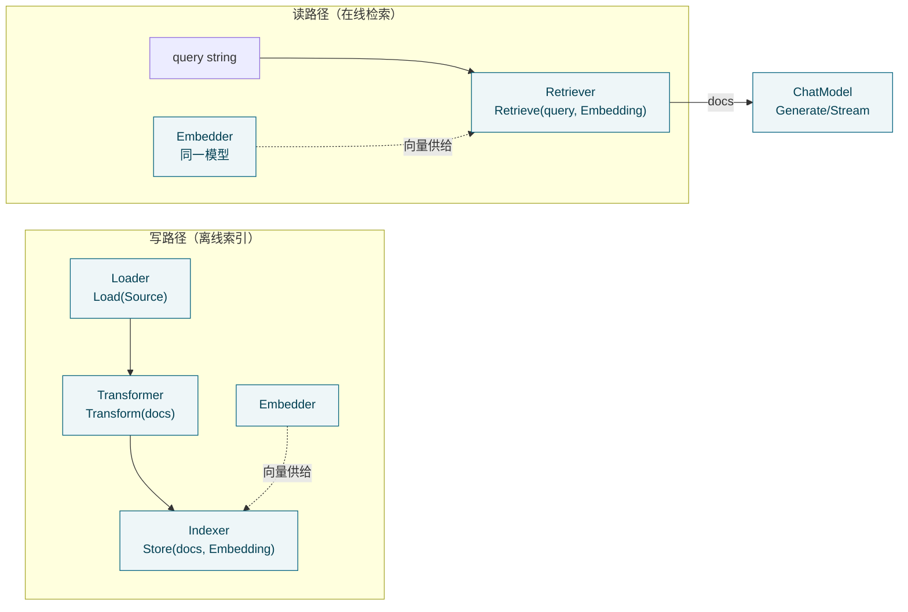

# 第四篇　组件抽象体系

*作者：Amlei　·　更新时间：2026-08-09*

> Eino 在 `components/` 下定义整个框架的"类型契约层"——它只声明 LLM 应用所需的各类原子能力（对话、工具、检索、索引、向量化、文档处理、提示模板）的 Go interface，而把所有具体实现（OpenAI、Ark、Ollama、Claude、Milvus、VikingDB 等）剥离到独立的 `eino-ext` 仓库。这种"接口在本仓、实现在外"的解耦是 Eino 架构的基石，`components/` 即整个框架的"宪法层"。
>
> 本篇回答：组件接口如何被设计成最小而正交、provider 实现如何被隔离、流范式如何由"提供哪些方法值"声明、工具如何在执行中触发人机协同（HITL）中断。

---

## 第 1 章　设计目标：接口在本仓、实现在外

### 1.1　解耦的动因

`components/model/doc.go:28-30` 明确写道：

> Concrete implementations (OpenAI, Ark, Ollama, …) live in eino-ext: `github.com/cloudwego/eino-ext/components/model/`

同样的句子在 `retriever/doc.go:25`、`indexer/doc.go:25`、`embedding/doc.go:26`、`document/doc.go:28`、`tool/doc.go` 中逐字复现。这不是文档惯例，而是架构硬约束：

- **本仓零外部 SDK 依赖**。`go.mod` 里没有任何 OpenAI/Milvus/Elasticsearch 客户端，只有 `bytedance/sonic`（JSON）、`gonja`/`pyfmt`（模板）、`eino-contrib/jsonschema`（schema 反射）等通用库。`github.com/cloudwego/eino` 永远是一个轻量、稳定、可被任意 provider 依赖的"核心契约"包。
- **provider 实现独立演进、独立发布**。OpenAI 的 SDK 升级不会触发 Eino core 发版；反之亦然。
- **避免环形依赖与"上帝包"**。若接口与实现同仓，core 将被迫引入全部 provider 的传递依赖，编译体量与攻击面都会膨胀。

### 1.2　Go interface 隐式实现如何支撑

Eino 的解耦依赖 Go interface 的"结构化类型（structural typing）"：一个类型只要拥有 interface 列出的方法集，就自动满足该 interface，无需 `implements` 声明，更无需导入 interface 定义方之外的任何包。因此 eino-ext 中的 `openai.ChatModel` 只需导入 `components/model`（拿接口签名）和 `schema`（拿数据类型），即可被 Eino 的 `compose` 编排层透明消费——**core 永远不反向引用 ext**。

这种解耦还体现在"数据类型前置"上：所有组件共享的领域对象（`schema.Message`、`schema.Document`、`schema.ToolInfo`、`schema.StreamReader`，见[第二篇](part-02-schema.md)）被下沉到 `schema` 包，组件接口只引用这些稳定类型，从不引用 provider 私有结构。

---

## 第 2 章　横切抽象：Typer / Checker / Component

`components/types.go` 定义了跨所有组件的三个横切约定，是理解组件如何被 `compose` 包装、被 callbacks 上报的关键。

### 2.1　Typer —— 组件实现类名

```go
// components/types.go:29
type Typer interface {
    GetType() string
}
```

`GetType()` 返回实现类名（如 `"OpenAI"`），辅助函数 `components.GetType()`（`:34`）做类型断言。该名会被 DevOps 工具（可视化调试器、仪表盘）拼接成 `"{GetType()}{ComponentKind}"` 形式的展示名（如 `OpenAIChatModel`）。`utils.InferTool` 也用它设置工具实例的显示名。

### 2.2　Checker —— 回调自治开关

```go
// components/types.go:50
type Checker interface {
    IsCallbacksEnabled() bool
}
```

这是组件与框架回调机制（见[第八篇](part-08-callbacks.md)）的"权责划分开关"。当 `IsCallbacksEnabled()` 返回 `true`，框架**跳过**默认的 `OnStart/OnEnd` 包装，信任组件自己在正确的时机触发回调。`prompt.DefaultChatTemplate` 实现了它（`components/prompt/chat_template.go:87`，恒返回 `true`），因为模板需要在自己 `Format` 内部精确地发起 `OnStart/OnEnd/OnError`（`:52-78`），而不是被外层节点粗粒度包裹。compose 在 `graph_node.go:151-163` 的 `parseExecutorInfoFromComponent` 中读取该位，决定是否注入自动回调壳。

### 2.3　Component —— 组件种类常量

`types.go:64-87` 列出十种组件类别常量（`ComponentOfChatModel`、`ComponentOfTool`、`ComponentOfRetriever`、`ComponentOfLoader` 等）。这些字符串既是回调 `RunInfo` 的填充值，也是 compose 在 `toChatModelNode`/`toRetrieverNode` 等工厂（`compose/component_to_graph_node.go:49-167`）里标记节点种类的标签。

> **一处废弃步调不一致（勘误）**：`model/interface.go:73` 标注 `ChatModel` 已 deprecated（并发不安全，见[第 3 章](part-04-components.md)），但 `components/types.go:72` 的 `ComponentOfChatModel` 常量无任何 deprecation 标记，且 compose 仍在 `component_to_graph_node.go:96` 大量使用该种类常量——接口与"种类标识"的废弃步调不一致。

---

## 第 3 章　ChatModel：对话模型

ChatModel 是 Eino 最核心的组件——"每个与 LLM 对话的应用都经过这个接口"（`model/doc.go:24`）。

### 3.1　泛型化重构：BaseModel[M]

Eino 把 ChatModel 重构为泛型化的 `BaseModel[M]`（`model/interface.go:36`）：

```go
// components/model/interface.go:27
type messageType interface {
    *schema.Message | *schema.AgenticMessage
}

type BaseModel[M messageType] interface {
    Generate(ctx context.Context, input []M, opts ...Option) (M, error)
    Stream(ctx context.Context, input []M, opts ...Option) (*schema.StreamReader[M], error)
}
```

`messageType`（`:27-29`）是一个**密封类型约束（sealed constraint）**，只允许 `*schema.Message` 与 `*schema.AgenticMessage` 两种消息类型（见[第二篇·第 3 章](part-02-schema.md)）。通过类型参数化，同一套 `Generate/Stream` 契约同时服务传统对话模型与 Agentic 模型，而无需复制接口定义。历史兼容通过类型别名保留：`type BaseChatModel = BaseModel[*schema.Message]`（`:71`）、`type AgenticModel = BaseModel[*schema.AgenticMessage]`（`:109`）。

### 3.2　输入输出与流式表达

- **输入** `[]M`：一段对话历史（system/user/assistant/tool 角色的消息序列，支持多模态内容）。
- **Generate 输出** `(M, error)`：阻塞返回完整响应消息。
- **Stream 输出** `(*schema.StreamReader[M], error)`：返回一个泛型流读取器，增量吐出消息块。

`schema.StreamReader[T]`（见[第三篇](part-03-streaming.md)）是 Eino 统一的流式表达载体。其语义约束被 `model/interface.go:55-68` 反复强调：流只能读一次；多消费者必须先 `Copy`；**调用者必须 `Close`**，否则泄漏连接。

### 3.3　为何是方法集而非数据

Go interface 本质是方法集，Eino 把"做什么（Generate/Stream）"定义为方法，而把"传什么、返回什么"下沉到 `schema.Message` 这一共享数据类型。这一拆分带来三件事：(1) provider 用方法值（method value）即可满足接口，compose 能把 `node.Generate`、`node.Stream` 作为一等函数直接传递（见 `component_to_graph_node.go:96`）；(2) 数据结构的演进（如新增多模态 Part）只改 `schema`，不破坏接口签名；(3) 同一消息类型可在多个组件间流转，构成管道。

### 3.4　工具绑定的两代设计

接口层级（`interface.go:80-103`）体现了并发安全教训：

- **`ChatModel`（已废弃）**：扩展 `BaseChatModel`，加 `BindTools(tools []*schema.ToolInfo) error`。注释直言其缺陷——`BindTools` **原地修改实例**，并发使用时一个 goroutine 的工具列表会覆盖另一个，存在竞态。
- **`ToolCallingChatModel`（推荐）**：`WithTools` 返回**新实例**，不可变、并发安全。可由一个共享 base model 派生出不同工具集的请求变体。

`AgenticModel` 既不暴露 `BindTools` 也不暴露 `WithTools` 方法——工具通过 `model.WithTools` 选项（`option.go:115`）在请求时传入，与 `ChatModelAgent` 的工具绑定方式保持一致。

### 3.5　Option 模式：通用与实现特定双轨

`components/model/option.go` 定义了 Eino 全组件复用的 functional option 双轨范式：

- `Options` 结构体（`:22-58`）承载**通用**调用时参数：`Temperature`、`Model`、`TopP`、`Tools`、`DeferredTools`、`MaxTokens`、`Stop`、`ToolChoice` 等。`DeferredTools`（`:31-37`）支持 server-side 工具按需搜索加载，是新近加入的能力。
- `Option` 结构体（`:64-68`）内部有两个互斥字段：`apply func(opts *Options)`（写通用选项）与 `implSpecificOptFn any`（写实现特定选项）——"never both"（`:62`）。
- 实现者用泛型 `WrapImplSpecificOptFn[T]`（`:196`）把自己的配置 setter 包装成 `Option`，再用 `GetImplSpecificOptions[T]`（`:239`）通过类型断言 `opt.implSpecificOptFn.(func(*T))` 取回。

关键机制：`implSpecificOptFn` 被声明为 `any` 而非泛型，使得**同一份 `[]Option` 切片能携带任意 provider 的私有选项**，而在 provider 实现内部才用 `func(*T)` 断言提取。这是 Go 1.18 泛型与 `any` 配合实现"异构选项列表"的标准技巧。

---

## 第 4 章　Tool：工具与 HITL 中断

### 4.1　五层接口层级

`components/tool/interface.go` 定义了工具的多态层级（`doc.go:20-37` 给出概览）：

- **`BaseTool`**（`:32`）：仅 `Info(ctx) (*schema.ToolInfo, error)`。它足以把工具元数据喂给 ChatModel，但无法执行。
- **`InvokableTool`**（`:42`）：加 `InvokableRun(ctx, argumentsInJSON string, opts ...Option) (string, error)`。参数是模型产出的 JSON 字符串，结果是回喂模型的纯字符串。
- **`StreamableTool`**（`:53`）：`StreamableRun` 返回 `*schema.StreamReader[string]`，增量吐串。
- **`EnhancedInvokableTool`**（`:67`）：参数升级为 `*schema.ToolArgument`，返回 `*schema.ToolResult`——可携带文本、图像、音频、视频、文件（多模态）。
- **`EnhancedStreamableTool`**（`:76`）：多模态的流式变体。

`doc.go:31-37` 指出：当工具同时实现标准与增强接口时，ToolsNode **优先选择增强接口**。

### 4.2　tool.Info 与 schema.ToolInfo 的关系

`Info()` 是**运行时方法**（可能因 ctx 而异、可能出错），它返回的 `schema.ToolInfo`（见[第二篇·第 4 章](part-02-schema.md)）才是**数据**：`Name`、`Desc`、`Extra`，以及嵌入式 `*ParamsOneOf`。`utils.InferTool`（`tool/utils/invokable_func.go:46`）从 Go 结构体 tag 自动反射出 `ParamsOneOf`（用 `eino-contrib/jsonschema` 的 `Reflector`），消除手写 schema 的样板。

### 4.3　工具被 LLM 调用的全链路

ChatModel 通过 `WithTools` 收到 `[]*schema.ToolInfo`（仅元数据），生成含 `ToolCalls` 的 assistant 消息；compose 的 `ToolsNode`（见[第七篇](part-07-tools-interrupt.md)）按 tool call 的 name 找到对应 `BaseTool`，再做接口断言分流：依次尝试 `StreamableTool`、`InvokableTool`、`EnhancedInvokableTool`、`EnhancedStreamableTool`，把命中者包成 endpoint。断言失败者回退——若只实现了 `InvokableTool` 则用 `invokableToStreamable` 适配成流式；反之用 `streamableToInvokable`。工具结果的多返回值/多模态通过 `schema.ToolResult.Parts`（`schema/tool.go:478`）表达。

### 4.4　interrupt.go：工具执行中触发 HITL 中断

`components/tool/interrupt.go` 是 Human-in-the-Loop 的核心入口，提供四个函数：

- **`Interrupt(ctx, info)`**（`:44`）：暂停执行，向编排层发出"需 checkpoint"信号。返回一个 error，约定从 `InvokableRun/StreamableRun` 直接 `return`。
- **`StatefulInterrupt(ctx, info, state)`**（`:71`）：带状态保存的中断，`state` 需 gob 可序列化，resume 时还原。
- **`CompositeInterrupt(ctx, info, state, errs...)`**（`:100`）：聚合子组件（内部子图、其他工具）的中断信号，组装成树。
- **`GetInterruptState[T]` / `GetResumeContext[T]`**（`:150-185`）：工具内部用来区分"首次运行"还是"恢复运行"，以及"我是不是本次 resume 的目标"。

这四个函数都是 `internal/core` 对应实现的薄封装（`:45` → `core.Interrupt`）。中断的本质是**把控制流信号伪装成 error 从工具返回**，编排层（compose/adk）用 `errors.As` 捕获、做 checkpoint、等待外部 resume 数据后再从断点重放。完整的断点/检查点机制见[第七篇](part-07-tools-interrupt.md)。

---

## 第 5 章　RAG 管道四件套

Retriever、Indexer、Embedder、Document（Loader/Transformer）共同构成 RAG 管道的类型契约，统一以 `schema.Document` 为数据载体。



图注：Eino RAG 管道由四个组件契约拼装。写路径 Loader→Transformer→Indexer（Embedder 供向量），读路径 Retriever（同一 Embedder 供向量）→ChatModel。`schema.Document` 是贯穿全管道的数据载体；**两个 Embedder 必须是同一模型**，否则向量空间错配（`embedding/doc.go:38`）。

- **Embedder**（`embedding/interface.go:37`）：`EmbedStrings(ctx, texts []string, opts ...Option) ([][]float64, error)`。批量字符串 → 二维 float64 向量，向量维度由模型固定。
- **Retriever**（`retriever/interface.go:48`）：`Retrieve(ctx, query string, opts ...Option) ([]*schema.Document, error)`。输出按相关度降序。`Options` 含 `TopK`/`ScoreThreshold`（过滤而非排序）/`Embedding`/`DSLInfo`。
- **Indexer**（`indexer/interface.go:38`）：`Store(ctx, docs []*schema.Document, opts ...Option) ([]string, error)`。批量文档入库，返回后端分配的 ID。
- **Document Loader/Transformer**（`document/interface.go`）：`Loader.Load(ctx, src Source)` 取原始字节、格式解析委托给 `parser.Parser`；`Transformer.Transform(ctx, docs)` 做切分/过滤/合并/重排，要求保留并合并既有 `MetaData`。

---

## 第 6 章　ChatTemplate：提示模板

`ChatTemplate.Format(ctx, vs map[string]any, opts ...Option) ([]*schema.Message, error)`（`prompt/interface.go:43`）。Agentic 变体返回 `[]*schema.AgenticMessage`。`DefaultChatTemplate` 持有 `[]schema.MessagesTemplate` + `schema.FormatType`。

`schema.FormatType`（见[第二篇](part-02-schema.md)）定义三种语法，对应 `go.mod` 的两个模板依赖：

- **`FString`**：由 `github.com/slongfield/pyfmt` 实现（PEP 3101 风格 `{var}`）。
- **`GoTemplate`**：标准库 `text/template`，`missingkey=error`——缺失变量即报错。
- **`Jinja2`**：由 `github.com/nikolalohinski/gonja` 实现，禁用了 `include/extends/import/from` 防注入。

`schema.MessagesPlaceholder` 支持在模板固定位置插入动态消息列表（如对话历史）。`DefaultChatTemplate` 同时实现 `Typer` 与 `Checker`（恒返回 `true`），并在 `Format` 内自管 `OnStart/OnEnd/OnError`——回调自治的范例（见[第八篇](part-08-callbacks.md)）。

> **模板缺失变量无编译期检查**（`prompt/doc.go:52`、`prompt/interface.go:35` 明示）：FString 与 GoTemplate 在运行时报错；Jinja2 视 gonja 配置而定。这是 prompt 组件的隐性陷阱。

---

## 第 7 章　统一机制：Option、Callback Extra、流范式声明

### 7.1　Option 模式的全组件复用

每个组件包都重复 `GetCommonOptions` + `GetImplSpecificOptions[T]` 这对泛型助手。这种"每个组件自包含一套 Option 机制"的冗余是有意为之：让每个组件包可被独立理解、独立 mock，不引入跨包公共依赖。

| 组件 | Option 类型 | 通用 Options |
|---|---|---|
| model | `Option` | `model.Options`（Temperature/Tools/…） |
| retriever | `Option` | `Options`（TopK/ScoreThreshold/Embedding/…） |
| indexer | `Option` | `Options`（Index/SubIndexes/Embedding） |
| embedding | `Option` | `Options`（Model） |
| prompt / tool | `Option` | 无（仅实现特定） |
| document | `LoaderOption` / `TransformerOption` | `LoaderOptions`（ParserOptions）——唯一两套 Option |

### 7.2　callback_extra：双形态类型转换

每个组件的 `callback_extra.go` 定义 `CallbackInput`/`CallbackOutput` 结构体并配 `ConvCallbackInput`/`ConvCallbackOutput`。以 model 为例（`model/callback_extra.go:92`），`ConvCallbackInput` 用 `switch` 覆盖**两个回调触发点**：(1) 组件实现内部主动触发（已是 `*model.CallbackInput`）；(2) 图节点框架自动注入（输入是接口签名上的 `[]*schema.Message`）。同一转换器适配两种来源，使 typed callback handler 总能拿到结构化字段（机制见[第八篇](part-08-callbacks.md)）。`model.CallbackOutput` 还承载 `TokenUsage`（含 `ReasoningTokens` 与 `CachedTokens`），供计费与可观测。

### 7.3　流范式声明：提供哪些方法值

Eino 的"流范式"声明（Invoke/Stream/Collect/Transform，见[第三篇·第 7 章](part-03-streaming.md)与[第六篇·第 3 章](part-06-state.md)）不在组件 interface 里加标记，而是在 compose 包装时通过**传递哪些方法值**来表达。`compose/component_to_graph_node.go:29` 的 `toComponentNode` 接收四个函数槽：`invoke`、`stream`、`collect`、`transform`。各组件工厂按需填槽：

- `toChatModelNode`（`:93`）：填 `Generate`（invoke）与 `Stream`（stream），collect/transform 为 nil。
- `toRetrieverNode` / `toIndexerNode` / `toEmbeddingNode`（`:49-91`）：只填 invoke——这些组件不支持流式。
- `toToolsNode`（`:147`）：填 invoke + stream。

nil 的槽由框架在运行时做 invoke↔stream 适配（见[第五篇·第 2.5 节](part-05-compose.md)的 `newRunnablePacker` 四范式派生）。这就是"组件声明自己的流范式"——声明即"提供了哪些方法值"。

---

## 第 8 章　为何如此设计：权衡的总账

1. **接口最小化 vs 表达力**：`Retriever`/`Indexer`/`Embedder` 各只有一个方法——刻意的极简，把复杂度全压到 Option 与实现内部。但 Tool 因要支持"执行 vs 元数据""流 vs 非流""文本 vs 多模态"三个正交维度，被迫裂出五个接口。Model 则因并发安全教训分裂出废弃的 `ChatModel` 与推荐的 `ToolCallingChatModel`。泛型 `BaseModel[M]` 的引入正是为了在"不复制接口"的前提下容纳 `Message` 与 `AgenticMessage` 两种形态。
2. **流/非流统一的代价**：Eino 让 `Stream` 成为 `BaseChatModel` 的**必需方法**（非可选），代价是：不支持流式的 provider 实现也必须提供一个 Stream（通常内部 Generate 后包成单元素流）。而工具/检索器/索引器等则通过 compose 的 invoke↔stream 适配器在节点层"补全"流式语义。收益是管道层无需区分"流式节点"与"非流式节点"，编排代码统一。
3. **与 LangChain 抽象的对照**：LangChain（Python）的抽象是"类继承 + mixin"（`BaseChatModel` 子类化、`Runnable` 接口），靠继承多态与类属性表达契约。Eino 用 Go interface 的结构化类型 + 泛型 `BaseModel[M]` + functional options 替代继承：provider 不"继承"任何基类，只要满足方法集即为该组件；配置不通过构造器参数列表（易膨胀），而通过可组合的 `Option` 双轨。代价是 Go 1.18 泛型能力受限（如 `implSpecificOptFn any` 配类型断言的迂回），收益是显式、无继承链、易测、易 mock（每个组件 interface.go 都带 `//go:generate mockgen` 指令）。
4. **Option 双轨用 `any` 而非泛型**：`implSpecificOptFn any` 让同一份 `[]Option` 切片能携带任意 provider 的私有选项，是 Go 1.18 泛型不支持"方法类型参数"约束下的务实折中（见[第十二篇](part-12-internal.md)）。
5. **组件自管回调 vs 框架托管**：`Checker` 开关把权责划清——需要精细触发点的组件（如 ChatTemplate 在 `Format` 内部）自管，其余由框架在节点边界统一包裹。这避免了"每个组件都重复写回调样板"。

> **一处文档错误（勘误）**：`callbacks/doc.go:76` 的示例写 `handler := callbacks.NewHandlerHelper()`，但 `NewHandlerHelper` 实际定义在 `utils/callbacks/template.go:41`（包名 `callbacks` 但路径 `github.com/cloudwego/eino/utils/callbacks`），并非顶层 `callbacks` 包。同文件 `:73` 的散文正确写成 `utils/callbacks.NewHandlerHelper`，与代码示例自相矛盾——读者照抄 `callbacks.NewHandlerHelper()` 会编译失败。

> **一处实现遗漏（勘误）**：`model/interface.go:70` 的 mockgen 指令 `//go:generate mockgen … BaseChatModel,ChatModel,ToolCallingChatModel` 未列入 `AgenticModel`（`interface.go:109`，新近引入）。使用生成的 mock 无法 mock agentic 模型，需手工补指令。

---

*第四篇完。下一篇进入 compose 编排引擎——这些组件如何被 AddChatModelNode/AddToolsNode 包成图节点、如何在 Pregel 超步与 DAG 流水中被调度、编译期类型检查如何把错误前置到 Compile。*
