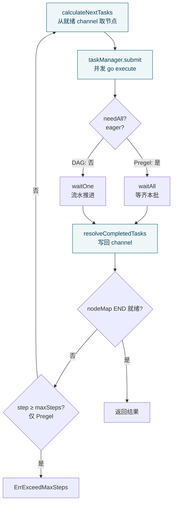

# 第五篇　compose 编排引擎

*作者：Amlei　·　更新时间：2026-08-09*

> `compose` 把离散的组件（ChatModel、Retriever、ToolsNode、Lambda…）按确定性拓扑粘合成可运行的 DAG / 工作流。本篇剖析它的三层结构——**构建层（Graph/Chain）→ 编译层（compile）→ 运行层（runner + Pregel/DAG channel）**，落到源码行号。
>
> compose 与 `adk` 的 agent 形成"编排"与"自主"的对照：compose 是**调度确定**的（边、分支、并行、循环都在编译期固定），agent 是**模型决策**的。compose 的运行期不确定性只来自 `Branch` 的条件函数返回值与循环图的超步迭代次数。正因确定性，compose 才能做到编译期类型检查、拓扑环检测与可恢复的检查点中断（见[第七篇](part-07-tools-interrupt.md)）。

---

## 第 1 章　设计定位

### 1.1　Graph / Chain / Workflow 三态

Eino 表面上有三种构建器，但底层共享同一个 `*graph`（`graph.go:57-89`）。差异只在 `component` 标记与默认运行模式：

| 构建器 | 入口 | 默认 runType | 触发模式 | 支持循环 |
|---|---|---|---|---|
| **Graph** `[*In,*Out]` | `generic_graph.go:72` | Pregel | AnyPredecessor | 是 |
| **Chain** `[*In,*Out]` | `chain.go:37` | Pregel | AnyPredecessor | 是（API 偏线性） |
| **Workflow** `[*In,*Out]` | `workflow.go:61` | DAG | AllPredecessor | 否 |

三种模式由 `graph.compile` 在 `graph.go:680-699` 裁决：

```go
// compose/graph.go:680
runType := runTypePregel; cb := pregelChannelBuilder
if (opt.nodeTriggerMode == AllPredecessor) || isWorkflow(g.cmp) {
    runType = runTypeDAG; cb = dagChannelBuilder
}
eager := isWorkflow || runType == runTypeDAG   // DAG/Workflow 默认 eager
```

> **一处重要校正**：`compose/dag.go` **并不是公共 DAG 构建器**——它没有 `NewDAG`，只是 `dagChannel`（DAG 模式下的 channel 实现，`dag.go:23-195`）。Eino 没有"独立的 DAG 类"：DAG 是 Graph 的一种**运行模式**（`WithNodeTriggerMode(AllPredecessor)`），或通过 `Workflow` 间接启用（`workflow.go:43` 注释明说 "Under the hood it uses NodeTriggerMode(AllPredecessor), so does not support cycles"）。把 `dag.go` 当成"另一种图"是常见误读。另有 `graph.go:48` 的注释把 `NodeTriggerMode` 误写成 `NodeTriggerType`，是源码注释笔误。

---

## 第 2 章　核心抽象

### 2.1　Graph：泛型强类型图与"控制/数据分离"

公开类型 `Graph[I, O any]` 只是 `*graph` 的薄壳（`generic_graph.go:93`）。泛型参数 `I/O` 在构造期通过 `generic.TypeOf[I]()` 固化为 `expectedInputType/expectedOutputType`（`graph.go:100-115`），作为 START/END 哨兵的类型锚点。内部 `graph` 结构（`graph.go:57-89`）的关键字段：

- `nodes map[string]*graphNode` — 节点表；
- `controlEdges` / `dataEdges` — **边被拆成两套**：控制边（决定触发依赖、不计数据）与数据边（携带值并隐含触发）。`addEdgeWithMappings`（`graph.go:232-294`）通过 `noControl`/`noData` 两个布尔决定登记到哪张表；二者不可同时为 true（`graph.go:240-242`）。这种"控制/数据分离"是 Pregel/DAG 双模式的基石（见[第 4 章](part-05-compose.md)）；
- `branches map[string][]*GraphBranch` — 同一起点可挂多条分支（`graph.go:547`）；
- `toValidateMap` — **待类型校验的边队列**（`graph.go:65-68`），是编译期类型推断的核心数据结构（见[第 3 章](part-05-compose.md)）。

`AddEdge(start, end)` 是 `addEdgeWithMappings(start, end, false, false)` 的转发（`generic_graph.go:106`），即默认同时建控制边和数据边。

### 2.2　节点的归一化：component → graphNode

用户能塞进图的东西五花八门（Embedder、ChatModel、ChatTemplate、ToolsNode、Lambda、子图、Passthrough），但内部统一成 `*graphNode`（`graph_node.go:60`）。归一化逻辑集中在 `component_to_graph_node.go`：`toComponentNode`（`:29`）是总入口，用 `components.GetType`/`IsCallbacksEnabled` 提取元信息（`graph_node.go:151`），再 `runnableLambda(invoke, stream, collect, transform, ...)` 包成 `composableRunnable`。每种组件有专用 `toXxxNode`，差别仅在传入哪几个方法——`toChatModelNode`（`:93`）传 `Generate`（Invoke）与 `Stream`；`toRetrieverNode` 只传 `Retrieve`；未实现的方法为 `nil`，由 `newRunnablePacker` 自动派生（见[第 2.5 节](part-05-compose.md)）。

`AddChatModelNode`、`AddToolsNode` 等公开方法（`graph.go:304-454`）都是"调对应 `toXxxNode` → 调 `g.addNode`"两行。`AddGraphNode`（`graph.go:441`）接受任意 `AnyGraph`，使子图嵌套成为可能——`AnyGraph` 接口（`types_composable.go:25`）要求实现 `compile / inputType / outputType / component`，Graph、Chain、Workflow 都实现它。

`addNode`（`graph.go:162-230`）的守卫很值得读：禁止 `key == START/END`（`:177`）、禁止重名（`:181`）、检查 state 依赖（`:186`），以及最关键的 **pre/post handler 类型一致性检查**（`:200-225`）——`WithStatePreHandler` 的输出类型必须等于节点 inputType、state 类型必须等于图 stateType，否则编译前就报错。

### 2.3　哨兵 START / END 与分支

`graph.go:37-40` 定义两个字符串常量 `START="start"`、`END="end"`，作为图唯一的虚源点与虚汇点。`AddEdge(START, x)` 把 `x` 追加进 `g.startNodes`（`graph.go:271`），`AddEdge(x, END)` 把 `x` 追加进 `g.endNodes`（`:274`）。`START` 不可作为 end、`END` 不可作为 start，二者都不可手动 `addNode`。

`GraphBranch`（`branch.go:42-50`）实现动态条件路由：

```go
// compose/branch.go:42
type GraphBranch struct {
    invoke    func(ctx, input any) (output []string, err error) // 选 0..N 个目标
    collect   func(ctx, input streamReader) (output []string, err error)
    inputType reflect.Type
    *genericHelper
    endNodes   map[string]bool
    idx        int
    noDataFlow bool
}
```

注意返回是 `[]string`——分支本质是**多选多**，单选只是 `NewGraphBranch`（`branch.go:145`）把单返回值包成 `map[string]bool{ret: true}` 再走 `NewGraphMultiBranch`（`branch.go:89`）的特例。条件函数运行时返回 `endNodes` 集合之外的 key 会被拒绝（`branch.go:97`）。`StreamGraphBranch`（`branch.go:168`）允许基于 `*schema.StreamReader[T]` 做决策——典型用法是只读第一个 chunk 决定路径（见[第三篇](part-03-streaming.md)的 `Copy` 与 `firstChunkStreamToolCallChecker`）。

### 2.4　Chain：线性顺序的语法糖

`Chain[I,O]`（`chain.go:72`）内嵌一个 `gg *Graph[I,O]`，不引入新执行模型，只把"线性 + 并行 + 分支"包装成 fluent API。核心是 `addNode`（`chain.go:560`）维护一个 `preNodeKeys []string`（"当前末尾"集合）：首个节点前置 `[START]`（`:587`）；每个新节点 `nk` 对**所有** `pre` ∈ `preNodeKeys` 调 `AddEdge(pre, nk)`（`:591`），然后把 `preNodeKeys` 重置为 `[nk]`（`:599`）。`AppendParallel`/`AppendBranch` 则把 `preNodeKeys` 扩成多元素。

`addEndIfNeeded`（`chain.go:98`）在编译时把 `preNodeKeys` 都连到 `END`——**所以 Chain 用户无需手写 `AddEdge(x, END)`，这是 Chain 与 Graph 在 API 层最大的便利差异**。

### 2.5　Runnable：编译产物与四范式自动派生

`Runnable[I,O]` 接口（`runnable.go:32`）是 compose 对外的执行契约，四方法 `Invoke/Stream/Collect/Transform` 覆盖"非流/流 × 输入/输出"的四种组合（范式概念见[第三篇·第 7 章](part-03-streaming.md)与[第六篇](part-06-state.md)）。其内部表示 `composableRunnable`（`runnable.go:46`）只存两个字段：`i invoke`、`t transform`——**只保留非流和全流两条主轴**，另两种由这俩派生。

派生逻辑在 `newRunnablePacker`（`runnable.go:336`），这是 compose 最精巧的一处：用户给的 `i/s/c/t` 中任意非空子集，都能补齐另外三个。优先级链（`runnable.go:359-397`）：`r.i` ?? s ?? c ?? t；`r.s` ?? t ?? i ?? c；`r.c` ?? t ?? i ?? s；`r.t` ?? s ?? c ?? i。各 fallback 见 `runnable.go:194-334`，如 `invokeByStream`（`:194`）= 跑 Stream 再 `concatStreamReader`；`streamByInvoke`（`:234`）= 跑 Invoke 再包成单元素流。

**含义：组件只需实现一种范式，框架自动补全其余三种**——ChatModel 只实现 `Generate+Stream`，用户照样能对它调 `Collect`。Lambda（`types_lambda.go:27`）的四种工厂 `InvokableLambda`/`StreamableLambda`/`CollectableLambda`/`TransformableLambda` 与这四范式一一对应，是"普通函数即节点"的入口。

---

## 第 3 章　编译期：从 builder 到 runner

### 3.1　类型检查：边添加即增量校验

compose 的类型安全主要靠 `updateToValidateMap`（`graph.go:561-637`）在**每次 AddEdge/AddBranch 时增量推进**。机制：

1. `addToValidateMap`（`:552`）把 `(startNode, endNode, mappings)` 三元组塞进待校验队列；
2. `updateToValidateMap`（`:561`）**循环**扫描队列（`for` 直到一整轮无变化 `hasChanged`），因为"链式 Passthrough"最坏每轮只能推断一个节点。对每条待校验边：
   - 两端类型都已知且无 mapping → `checkAssignable`（`:592`）。结果三态：`assignableTypeMustNot` 直接报 "mismatch"；`assignableTypeMay`（接口/`any` 等可能兼容）则在 `handlerOnEdges` 注册一个**运行期类型转换器**（`:596`）做兜底；确定兼容则放行；
   - 一端 Passthrough（`nil` 类型）→ 用另一端类型回填其 `inputType/outputType`（`:582`），这是 Passthrough 类型传染的来源；
   - 带 field mapping → 注册 `fieldMap`/`streamFieldMap` 转换器并 `validateFieldMapping`（`:606`）。字段映射的深入机制见[第六篇](part-06-state.md)。

到 `compile` 时若 `toValidateMap` 仍非空，说明有节点类型无法推断，直接报错（`graph.go:709`）。这套机制把"类型不匹配"在 `Compile()` 调用时（而非运行时）暴露，是 compose 区别于反射式编排框架的核心价值。代价是 `updateToValidateMap` 的最坏 `O(n²)`（链式 Passthrough 每轮只解一个，`:560` 注释明说）。

### 3.2　环检测

只在 DAG 模式做严格无环检查。`validateDAG`（`graph.go:1077-1126`）用**Kahn 式入度消解**：把每个节点的控制前驱数记入 `m[node]`，反复把 `m==0` 的节点消解并递减后继入度；最后 `m>0` 的节点即环上节点。找到环则用 `findLoops`（`graph.go:1131`，DFS 回溯）输出 `a->b->c->a` 形式的环路径，错误为 `DAGInvalidLoopErr`（`:1129`）。

Pregel 模式不做无环检查——它**允许循环**（`graph.go:46` 注释 "Can have cycles in graph"），靠 `maxRunSteps` 兜底（`graph_run.go:249`，超限抛 `ErrExceedMaxSteps`，`error.go:27`）。DAG 模式禁止设 `maxRunSteps`（`graph.go:881`、`graph_run.go:364`），因为无环图必终止。

> **勘误**：`WithEagerExecution`（`graph_compile_options.go:78`）已被标 `Deprecated` 且**函数体只剩 `return` 空操作**——eager 现由触发模式自动决定。旧文档/示例若仍在调它，行为已无效；其替代 `WithEagerExecutionDisabled`（`:88`）才有实际效果。

### 3.3　compile() 组装 runner

`graph.compile`（`graph.go:674-892`）步骤：(1) 裁决 runType/eager/chanBuilder（`:680`）；(2) 校验 start/end 节点存在、`toValidateMap` 已清空、field mapping 去重；(3) 为每个节点 `compileIfNeeded`（`graph_node.go:121`）——子图在此递归编译，产出 `chanCall`（`graph_run.go:31`：`action` Runnable + `writeTo` 数据后继 + `controls` 控制后继 + `writeToBranches`）；(4) 反算 `controlPredecessors`/`dataPredecessors`；(5) 构造 `runner`（`:814`）并装 state 上下文工厂；(6) DAG 模式调 `validateDAG`（`:856`）；(7) 装 checkPointer/interrupt 节点；(8) 设默认 `maxRunSteps = len(nodes)+10`（`:883`）；(9) `onCompileFinish` 通过回调吐出 `GraphInfo`（`introspect.go:41`）供观测/可视化。

最后 `r.toComposableRunnable()`（`graph_run.go:994`）把 runner 包回 `composableRunnable`；外层 `compileAnyGraph`（`generic_graph.go:127`）再经 `toGenericRunnable[I,O]`（`runnable.go:402`）强类型化为 `Runnable[I,O]`。

---

## 第 4 章　运行期：Pregel 超步与 DAG 流水

> **一处关键认知校正**：直觉会把"Pregel 图执行模型"指向 `pregel.go`，但 `pregel.go` 只有 96 行，**只定义了 `pregelChannel` 数据结构**，并非执行模型本身。**真正的 Pregel 超步循环在 `graph_run.go:109-360` 的 `runner.run`**。Pregel 在 Eino 里是"channel 类型 + 调度策略"的组合，分散在两文件。

### 4.1　runner.run：超步主循环

`run`（`graph_run.go:109-360`）骨架：

```
cm := initChannelManager(isStream)      // 建所有 channel :948
tm := initTaskManager(...)              // needAll = !eager :937
nextTasks := calculateNextTasks(START)  // 首批 :208
for step := 0; ; step++ {
    if !r.dag && step >= maxSteps { return ErrExceedMaxSteps }  // :249
    tm.submit(nextTasks)                // 并发执行 :257
    completedTasks, _, _ := tm.wait()   // 等 barrier 或单完 :264
    nextTasks, result, isEnd = calculateNextTasks(completedTasks) // :309
    if isEnd { return result }          // :313
    // 中断处理 :317-358（见第七篇）
}
```

每一次 `for` 迭代即一个**超步（superstep）**：提交 → 等待 → 算下一批。`calculateNextTasks`（`:710`）把已完成任务的输出写回 channel（`resolveCompletedTasks` → `cm.updateAndGet`），再从所有就绪 channel 读出新节点输入（`createTasks`，`:735`）。若 `nodeMap[END]` 就绪则整图结束（`:722`）。

### 4.2　Pregel channel：AnyPredecessor 触发

`pregel.go` 的 `pregelChannel`（`pregel.go:25`）就是 `Values map[string]any` 加合并配置。其 `get`（`:55-88`）的触发判据极简单：**只要 `len(Values) > 0` 就 ready**（`:57`）——即任何一个前驱写了值就触发，这正是 `AnyPredecessor` 语义（`types.go:43`）。`get` 读后清空 Values（`:60`），把多前驱值用 `mergeValues` 合并（`:79`，合并机制见[第六篇](part-06-state.md)）。

Pregel 模式下 `taskManager.needAll = !eager = true`（`graph_run.go:937`），`wait()` 走 `waitAll`（`graph_manager.go:415`）——**所有提交任务都完成才进下一超步**，这是同步 barrier。配合 `AnyPredecessor` 触发，一个节点在某超步被任一前驱唤醒，下一超步其下游又被它唤醒，循环图就这样一圈圈推进。`maxRunSteps` 是这种推进的唯一终止保险。

### 4.3　DAG channel：AllPredecessor + 流水

`dag.go` 的 `dagChannel`（`dag.go:50`）维护两套依赖状态：`ControlPredecessors`（waiting/ready/skipped）与 `DataPredecessors`（是否已到值）。其 `get`（`:128`）触发判据严格得多：所有 ControlPredecessor 都 ≠ waiting（`:138`）**且**所有 DataPredecessor 都为 true（`:143`）才 ready——即 `AllPredecessor` 语义。

DAG 模式还支持 **skip 传播**：`reportSkip`（`:106`）把某前驱标 skipped；若**所有**控制前驱都 skipped，则本节点 `Skipped=true`（`:116`），`get` 直接返回 `(nil, false)`（`:130`），输出为零值/空流。`channelManager.reportBranch`（`graph_manager.go:219`）递归把 skip 传给后继——分支没选中某路径时，该路径的子孙节点被整棵剪掉，避免无谓计算。

DAG 模式 `eager=true` → `needAll=false`，`wait()` 走 `waitOne`（`graph_manager.go:381`）——**任一任务完成就推进**，无需等齐一批。节点在其所有前驱完成的瞬间立刻被调度，形成流水线，降低端到端延迟。

| 维度 | Pregel（默认） | DAG（Workflow / AllPredecessor） |
|---|---|---|
| channel | `pregel.go:25` | `dag.go:50` |
| 触发 | 任一前驱到值（`:57`） | 全部前驱就绪（`:138-147`） |
| 调度 barrier | `needAll=true`，等齐一批（`graph_manager.go:415`） | `needAll=false`，流水推进（`:381`） |
| 循环 | 支持，靠 `maxRunSteps` | 不支持，编译期 `validateDAG` 拒绝 |
| skip 传播 | 无（`reportSkip` 直接 `return false`，`pregel.go:90`） | 有（`reportSkip` 递归） |

### 4.4　taskManager：并发与单任务直跑优化

`taskManager`（`graph_manager.go:269`）的 `submit`（`:300`）有个重要优化：当任务池空且（仅一个任务 或 `needAll`）且**图不可被用户中断**时（`:338`），挑一个任务**同步直跑**（`:346`），避免无谓起 goroutine；其余任务 `go t.execute`（`:342`）。`execute`（`:285`）内 `initNodeCallbacks` 装 callback、`runWrapper` 调 Runnable、`recover` 把 panic 转 `safe.NewPanicErr`（`:288`）防整个图崩。

### 4.5　分支执行与 skip 传播

`runner.calculateBranch`（`graph_run.go:866`）处理一个节点的所有分支：对第 i 条分支先过 `preBranchHandlerManager.handle`（`:878`，类型转换），再调 `branch.invoke` 或 `branch.collect`（`:885`）拿到选中的 `[]string`。对每条分支的 `endNodes` 中**未被选中**的节点记入 `skippedNodes`（`:897`），再调 `cm.reportBranch` 触发 skip 传播（`:926`）。

一个精巧细节（`:913-924`）：当一个节点有多条分支、同一后继被某些分支选中却被另一些丢弃时，**只要任一分支选中就不 skip**——通过从 `skippedNodes` 删除被所有分支并集选中的节点实现。

---

## 第 5 章　数据流：一次 Invoke 的完整时序

下图是一个含并行、分支、循环回边的 Pregel 图 `START → template → model → branch(path_a / path_b)`，其中 `path_a → tools → model`（循环）、`path_b → END`：



图注：每个 `A → … → A` 回路是一个超步。Pregel 靠 `waitAll` 形成同步 barrier；DAG 靠 `waitOne` 流水。`maxSteps` 只在 Pregel 模式生效（`graph_run.go:249`）。一次完整的 `runnable.Invoke(ctx, input)` 从 `compileAnyGraph` 包成的 `Runnable[I,O]` 进入 `runner.run`，经若干超步（template → model → branch 判定 → tools → model 循环 → … → END 就绪）返回 output。

并行的处理：`Parallel`（`chain_parallel.go`）本质是多分支 `AddEdge(start, branch_i)` 且各分支带 `WithOutputKey`（`chain_parallel.go:69`），汇合点收到 `map[string]any`。下游若声明 `WithInputKey("k")`（`graph_add_node_options.go:67`），`inputKeyedComposableRunnable`（`runnable.go:448`）自动从 map 取该 key——这是多入多出的约定式数据路由。

---

## 第 6 章　为何如此设计：权衡的总账

1. **编译期类型安全 vs 灵活性**：compose 选择"边添加即增量校验"（`updateToValidateMap`），三态 `checkAssignable`（必兼容/必不兼容/可能兼容）对接口和 `any` 留运行期兜底——兼顾静态安全与 Go 类型系统的表达力局限。代价是链式 Passthrough 的最坏 `O(n²)`。
2. **Pregel vs 简单拓扑遍历**：Pregel（AnyPredecessor + barrier）牺牲延迟（每超步等齐一批）换循环能力与语义简单（channel 只看"有值否"）。DAG（AllPredecessor + 流水）牺牲循环能力与编译复杂度（需 Kahn 检测）换低延迟与 skip 传播。`eager` 标志把"调度策略"与"触发模式"绑定——同一份 `runner` 代码靠 `needAll` 和 channel 类型分叉两种执行模型，是高度代码复用的设计。
3. **泛型图 vs 反射图**：`Graph[I,O]` 在 API 层是泛型的（编译期类型锚），但内部 `*graph` 全程用 `reflect.Type`（`graph.go:70`）。`generic_helper.go` 是**桥层**：用 `generic.TypeOf[I]()` 把泛型参数固化为 `reflect.Type`，预生成所有转换器/零值工厂，使运行期避开热路径反射。`AnyGraph` 接口则用反射化的 `inputType()/outputType()` 支持子图嵌套——**内部反射、边界泛型**，是 Eino 一以贯之的取舍（见[第十二篇](part-12-internal.md)）。
4. **四范式自动派生**（`newRunnablePacker`）vs 强制用户实现全部：前者大幅降低组件接入成本（ChatModel 只写 2 个方法），代价是派生路径的隐式行为（如 `invokeByStream` 会真起流再合并，对副作用敏感的组件可能不符预期）。范式桥接的完整图景见[第六篇](part-06-state.md)。
5. **控制边/数据边分离**：把"触发依赖"与"数据携带"拆成两张边表，让 Pregel（任意前驱触发）与 DAG（全部前驱就绪）共用同一套节点/分支结构，只在 channel 的 `get` 判据上分叉。这是双模式能用一份核心代码承载的根本原因。
6. **builder 错误延迟到 compile**：`buildError` 在 `addNode/addEdge/addBranch` 失败时缓存（`graph.go:171` 等），后续操作短路、最终在 `compile`（`:675`）抛出——builder 模式下用户无需每步检查错误，代价是错误定位稍滞后。`ErrGraphCompiled`（`graph.go:160`）禁止编译后再改图。

---

*第五篇完。下一篇进入图的"数据层"：StateGraph 如何让图带状态、字段映射如何让节点 I/O 类型不必精确匹配、节点间的流如何在运行期被读取、拼接与转发——这些是把静态图变成可循环、可恢复的 agent 骨架的关键。*
