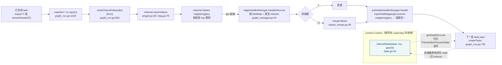

# 第六篇　图的状态、字段映射与流编排

*作者：Amlei　·　更新时间：2026-08-09*

> compose 把"图"分成两层：[第五篇](part-05-compose.md)讲的**调度层**（何时执行哪个节点），与本篇的**数据流动层**——一个节点的产出如何变成下一节点的入参、异构类型如何适配、状态如何跨轮累积、流如何在节点边界被读取与转发。
>
> 本篇有两条结论最值得先记住：其一，Eino 的图状态是**挂在 `context.Context` 上的可变单例**，靠 mutex 与用户处理器原地改写，**不是** LangGraph 那种"每字段一个 reducer、每轮自动 reduce"的模型；其二，所谓"每轮 reduce"真正发生的地方是 `channel.get` 里多前驱 fan-in 的 `mergeValues`——reduce 的对象是**节点输出**，而非状态本身。这两点是本篇与同类框架对比时最容易误述之处。

---

## 第 1 章　状态模型：可变单例，而非 reducer

### 1.1　StateGraph：正交叠加的能力

`NewGraph[I,O]`（`generic_graph.go:72`）本身不强制状态；只有传入 `WithGenLocalState[S]`（`generic_graph.go:37`）时，图才成为"有状态图"。该选项把一个用户态工厂 `GenLocalState[S] func(ctx) S`（`state.go:30`）与状态的反射类型 `generic.TypeOf[S]()`（`generic_graph.go:42`）登记到 `graph.stateGenerator` / `graph.stateType`（`graph.go:70`）。

无状态图与有状态图的运行时差别只有两处：编译期校验节点 `WithStatePreHandler/PostHandler` 的状态类型与图一致（`graph.go:201-224`）；运行期 `runner.runCtx` 在每次调用入口向 `ctx` 注入一个**新鲜的状态对象**（`graph.go:842-854`）。两者拓扑、通道、调度完全相同——状态是"正交叠加"的能力。

### 1.2　internalState：可变共享状态

状态由 `internalState`（`state.go:34-38`）持有：

```go
// compose/state.go:34
type internalState struct {
    state  any            // 用户的状态对象
    mu     sync.Mutex     // 独占访问锁
    parent *internalState // 父图状态，构成嵌套链
}
```

状态键为 `stateKey{}`（`state.go:32`）。读取走 `getState[S]`（`state.go:175-196`）：从 `ctx.Value(stateKey{})` 取出 `*internalState`，沿 `parent` 链向下查找第一个能断言为 `S` 的状态——这是**词法作用域语义**，内层图的同类型状态遮蔽外层，内层也能穿透读到外层异类型状态（注释 `state.go:117-128`）。每个状态层级有独立 mutex，不同层级可并发访问，但同一层级的读写互斥（`state.go:170`）。

对外暴露两条修改通道：

- **处理器钩子**：`StatePreHandler[I,S]` / `StatePostHandler[O,S]`（`state.go:42-52`），分别绑到节点前后。它们被 `convertPreHandler`/`convertPostHandler`（`state.go:54-82`）包成 `composableRunnable`，内部先 `getState[S]` 再 `pMu.Lock()` 再调用用户函数。
- **节点内主动访问**：`ProcessState[S]`（`state.go:165-173`），任意自定义节点在执行体内安全读写状态——这是推荐写法（注释 `state.go:114-116`）。

处理器在编译期被存入 `graphAddNodeOpts.processor`（`graph_add_node_options.go:98`），节点装配时成为 `chanCall.preProcessor/postProcessor`（`graph_run.go:31`），在 `taskManager.submit`/`waitOne` 里被 `runPreHandler`/`runPostHandler`（`graph_manager.go:527-556`）调用。

### 1.3　与 LangGraph 的根本差异（一处关键校正）

> **一处重要校正**：Eino 的 StateGraph **没有** LangGraph 那种"每个状态字段配一个 reducer、每个 superstep 末尾 reduce"的机制。状态对象本身从不被 reduce；它的"累积"完全由用户处理器原地修改完成。被 reduce 的是另一种东西——多前驱 fan-in 到同一节点时的输出合并（见[第 4 章](part-06-state.md#第4章)）。

状态是一个**挂在 `context.Context` 上的可变单例**，跨整次 `Invoke/Stream` 调用（即跨所有 superstep）存活，由节点/处理器在 mutex 保护下原地修改。superstep 循环（`graph_run.go:241`）从不重置它；只有新一轮用户调用才会通过 `runCtx` 再生一个（`graph.go:849`）。消息历史、工具调用记忆等 agent 状态，正是靠这一对象在 chat model 节点与 tools 节点之间逐轮累积。

与 Pregel 的关系：`pregelChannel`（`pregel.go:25`）只是"每个节点入侧一个 map 累加器"，借用了 Pregel 的"超步 + 通道"骨架（[第五篇·第 4 章](part-05-compose.md#第4章)），但通道里累的是**节点输出**而非"状态切片"，合并走 `mergeValues`。**状态单例与通道累加器是两套并行的数据通路**：前者跨轮、后者单轮 fan-in。

这一设计选择的代价是：回放与分叉要靠 checkpoint 显式 `deepCopyState`（`graph_run.go:572-596`，用 `serialization.InternalSerializer` 序列化深拷贝，见[第七篇](part-07-tools-interrupt.md)）。Eino 的选择与其"checkpoint 显式可选"的整体设计一致——只有 `WithCheckPointStore` 开启时才付出拷贝代价。

---

## 第 2 章　字段映射：让节点 I/O 不必精确匹配

### 2.1　三档适配强度

节点 I/O 类型不必完全匹配，框架做适配。Eino 提供三档：

- **直接可赋值**：编译期 `checkAssignable` 判为 `assignableTypeMust`（`utils.go:233`），无需运行期处理。
- **运行期可断言**：判为 `assignableTypeMay`（如前驱输出是 interface、后继要求具体类型），在边上插一个 `inputConverter`（`generic_helper.go:61`）做类型断言。
- **字段映射**：前驱输出与后继输入是不同结构体/map，用户用 `MapFields("a.b","c")` 声明映射，框架在边上插 `fieldMap`，在节点前插 `inputFieldMappingConverter`（`generic_helper.go:40`）。

声明式字段映射的动机是消除"手写转换 lambda"：若每条异构边都写 lambda，图的可观测性（`GraphInfo` 的 `fieldMappingRecords`，`graph.go:78`、`graph.go:998`）与可视化都会丢失语义；声明式映射让框架仍能在拓扑层理解"数据从哪个字段流向哪个字段"。

### 2.2　FieldMapping 与路径

`FieldMapping`（`field_mapping.go:31-37`）是四元组：`fromNodeKey`（编译期由 `addDependencyRelation` 回填）、`from`（源路径）、`to`（目标路径）、`customExtractor`（可选运行期提取器）。三种构造形态覆盖六种语义：

- `FromField(from)`（`:65`）：源字段 → 整个后继输入（独占）。
- `ToField(to)`（`:73`）：整个前驱输出 → 目标字段。
- `MapFields(from,to)`（`:85`）：字段 → 字段。
- 路径版 `FromFieldPath/ToFieldPath/MapFieldPaths`（`:154/168/189`）支持嵌套，路径用 `FieldPath`（`:125`）表示，内部以 ASCII Unit Separator `\x1F`（`:142`）拼接——选这个字符因其几乎不可能出现在用户字段名/map key 里，避免转义歧义。

`WithCustomExtractor`（`:202`）是逃生舱：当源是 `any`/interface 无法静态分析时，用户自供提取函数，校验推迟到请求期。

### 2.3　两段式落地

字段映射分两段在运行期落地：

1. **边上的 `fieldMap`**（`field_mapping.go:484-566`）：把前驱输出按所有 `mapping.from` 抽取，组装成 `map[string]any`（key 为 `mapping.to`）。抽取逐段走 `takeOne`（`:574-601`），结构体走 `FieldByName`、map 走 `MapIndex`，interface 类型则报可恢复错误（`errInterfaceNotValidForFieldMapping`，`:419`）以便运行期再判。
2. **节点前的 `inputFieldMappingConverter`**（`generic_helper.go:40`、`field_mapping.go:212-221`）：把上一步的 `map[string]any` 经 `convertTo`（`:237`）反射构造出强类型入参 `I`。`assignOne`（`:250-364`）逐目标字段写入，沿途用 `instantiateIfNeeded`（`:366`）按需 new 指针、make map。

编译期的 `validateFieldMapping`（`:645-774`）做静态校验：沿 `FieldPath` 逐段下钻，遇 struct 查导出字段、遇 map 查 string-可转换 key、遇 interface 则停下并把剩余路径标记为"请求期再判"（`uncheckedSourcePath`，`:688`）。到 `compile` 收尾时，凡出现在 `fieldMappingRecords` 里的节点，都会在 `handlerPreNode[key]` 前置一个 `inputFieldMappingConverter`（`graph.go:715-727`），并禁止"多个映射落到同一目标字段"（`graph.go:720`）。

---

## 第 3 章　节点间的流编排

> 第三篇讲了**流原语本身**（StreamReader/Writer、concat/copy/merge/convert）；本节讲 compose 如何在节点边界使用它们：类型擦除、四范式桥接、多后继拷贝、key 化。

### 3.1　打包/解包：类型擦除边界

`schema` 层的 `StreamReader[T]` 是强类型泛型；但 `compose` 图引擎需要在不知道 `T` 的情况下统一搬运流（图节点签名在编译期是 `any`）。为此 compose 层定义了类型擦除的 `streamReader` 接口（`stream_reader.go:26`）与包装器 `streamReaderPacker[T]`（`:37`）：

```
packStreamReader[T](sr)        -> streamReader        // stream_reader.go:111
unpackStreamReader[T](isr)     -> (*StreamReader[T], bool)   // stream_reader.go:115
```

`unpackStreamReader`（`:115-129`）有一个关键回退：若请求的类型 `T` 是 interface kind，但 packer 里是 `StreamReader[具体类型]`，则用 `toAnyStreamReader()`（`:105`）把每个 chunk 擦除成 `any` 再断言回 `T`。这就是"流的装箱/拆箱"——一个流在节点边界被装箱成类型无关的 `streamReader`，进入下一个节点再按目标类型拆箱。

`withKey`（`:95-103`）则是另一种装箱：把每个 chunk 包成 `map[string]any{key: v}`，用于多输入节点的字段路由（把多个上游流按 key 装进同一个 map 流），是 `outputKeyedComposableRunnable`（`runnable.go:483`）的流式实现。

### 3.2　四范式桥接：伪流与拼接

节点以四种范式（Invoke/Stream/Collect/Transform，见[第三篇·第 7 章](part-03-streaming.md#第7章)）声明自己的 I/O 形状。当上下游范式不匹配时，框架自动桥接（`schema/doc.go:58-75`）：

- 上游输出 `T`、下游只要 `StreamReader[T]` → 把 `T` 包成**单 chunk 流**，即"伪流（fake stream）"。它满足接口但不降低 TTFT（首字延迟）。
- 上游输出 `StreamReader[T]`、下游只要 `T` → `concatStreamReader`（`stream_concat.go:50`）把整条流吃成单值。

`defaultStreamConvertPair[T]`（`generic_helper.go:168-196`）即 `concatStreamReader` 与 `StreamReaderFromArray` 的对偶，承担 Invoke↔Stream 互转与 checkpoint 持久化（流无法直接持久化，见[第七篇](part-07-tools-interrupt.md)的 `convertCheckPoint`）。`inputZeroValue/inputEmptyStream`（`generic_helper.go:245-256`）产生零值/空流，供 DAG 通道里"所有数据前驱都被 skip"时回填（`dag.go:172`）、checkpoint 恢复 missing input（`graph_run.go:795`）。

### 3.3　读取、拷贝、转发

- **读取/拼接**：`concatStreamReader[T]`（`stream_concat.go:50-88`）把整条流读完成 `[]T`，再 `internal.ConcatItems`（`concat.go:91`）。与[第三篇](part-03-streaming.md)的 concat 算法同源——compose 的 `concatStreamReader` 是薄封装，真正逐类型 concat 在 `internal/concat.go`。
- **多后继拷贝**：`copyItem`（`graph_run.go:1020-1040`）对流向多后继时调 `sr.copy(n)`（`stream_reader.go:45`），底层是 `schema.StreamReader.Copy`，保证多后继各自独立读取（见[第三篇·第 4 章](part-03-streaming.md#第4章)的共享惰性链表）。
- **运行期识别值或流**：`copyItem`（`graph_run.go:1026`）对 `item.(streamReader)` 做类型断言——是流就 copy 分发，是值就共享引用。`channel.get` 的 `isStream` 形参决定边处理器走 `transform`（流）还是 `invoke`（值）分支（`graph_manager.go:51-63`）。因此**同一套字段映射/类型校验 `handlerPair` 可同时服务 Invoke 与 Stream 两种调用模式**。

---

## 第 4 章　值合并：fan-in 的 mergeValues

`mergeValues`（`values_merge.go:39-82`）处理"一个节点多个前驱"的 fan-in：

- 先查注册表 `internal.GetMergeFunc(t0)`（`internal/merge.go:32`）；用户可用 `RegisterValuesMergeFunc[T]`（`values_merge.go:29`）按类型注册自定义合并（如切片 append、消息列表拼接）。
- 否则 map 类型走 `mergeMap`（`internal/merge.go:62-81`）：浅层并集，**重复 key 直接报错**——这是默认的"无冲突"假设。
- 流类型走 `streamReader.merge`/`mergeWithNames`（`stream_reader.go:79-93`），委托给 `schema.MergeStreamReaders`/`InternalMergeNamedStreamReaders`（见[第三篇·第 5 章](part-03-streaming.md#第5章)）。
- 都不匹配则报"unsupported type"。

**"每轮 reduce 在何处触发"的精确回答**：用户态 state 单例**不**被 reduce；每轮 superstep 触发的 reduce 是**多前驱 fan-in** 的 `mergeValues`，发生在 `channel.get` 里（`pregel.go:83` / `dag.go:186`）。默认 map 合并要求 key 互斥（`internal/merge.go:73`），意味着多前驱若都写同一字段会运行期失败——除非用户注册自定义 merge。这与 LangGraph 的 reducer 默认值理念不同，Eino 把"如何合并"显式留给用户注册。

> **concat 与 merge 再次区分**（见[第三篇·第 3 章](part-03-streaming.md#第3章)）：`concat` 是"同字段累加"（流式分片合拢），`merge` 是"无重叠字段的 fan-in"（同 key 报错）。`concatMaps`（`concat.go:113`）对同 key 递归累加；`mergeMap`（`merge.go:62`）对重复 key 报错——二者用于不同图场景，在底座层（`internal/concat.go` vs `internal/merge.go`）就分头实现。

---

## 第 5 章　泛型助手：编译期泛型与运行期反射的桥

`genericHelper`（`generic_helper.go:57-69`）是每个节点的"类型适配表"，由 `newGenericHelper[I,O]`（`:28`）借助 Go 泛型在编译期实例化，内含：

- `inputConverter/outputConverter`（`handlerPair`）：运行期类型断言兜底（`defaultValueChecker` `:236`）。
- `inputFieldMappingConverter/outputFieldMappingConverter`：前述 map→struct 装配。
- `inputStreamConvertPair/outputStreamConvertPair`（`streamConvertPair` `:163`）：`concatStream`（流→值）与 `restoreStream`（值→流）。
- `inputZeroValue/inputEmptyStream`（`:245-256`）：零值/空流工厂。
- `inputStreamFilter`（`streamMapFilter` `:153`）：当节点以 `inputKey` 模式接入时，从 `map[string]any` 流中按 key 取出对应字段的子流。

派生方法 `forMapInput/forMapOutput/forPredecessorPassthrough/forSuccessorPassthrough`（`:71-151`）在 passthrough 节点或 inputKey/outputKey 节点处复刻并替换相应字段——这是类型在"链式 passthrough 推断"中传染的载体（见[第五篇·第 3 章](part-05-compose.md#第3章)）。`handlerPair`（`:158`）是统一的 `(invoke valueHandler, transform streamHandler)` 二元组，使同一处理器既能跑在值通道也能跑在流通道。

`genericHelper` 是 Eino"**内部反射、边界泛型**"取舍（见[第十二篇](part-12-internal.md)）在 compose 层的具象：用 `generic.TypeOf[I]()` 把泛型参数固化为 `reflect.Type`，预生成所有转换器/零值工厂，使运行期避开热路径反射，仅在边界的 `unpackStreamReader`/`inputFieldMappingConverter` 等少数点用反射兜底。

---

## 第 6 章　数据流：带状态循环图一轮 superstep

带状态 Pregel 图一轮 superstep 的完整路径，有两条并行通路——单轮数据通路（output → channel → edge 映射 → fan-in merge → preNode 装配 → 下一 task）与状态单例通路（跨 superstep 持续存活，不参与 mergeValues）：



图注：实线为单轮数据通路；虚线为状态单例通路——`getState` 从 ctx 取出、加锁、在节点处理器内被原地改写，跨 superstep 持续存活，**不参与 `mergeValues`**。深色节点为状态单例。

---

## 第 7 章　为何如此设计：权衡的总账

1. **可变状态单例 vs reducer 模型**：Eino 选"可变 context 单例 + mutex + 用户处理器原地改"，而非 LangGraph 的"不可变 + 每字段 reducer + 每轮自动 reduce"。后者声明式、易回放/分叉、天然适配 checkpoint；前者实现更轻、对 Go 开发者心智更直接、避免每轮深拷贝，代价是回放与分叉要靠 checkpoint 显式 `deepCopyState`（见[第七篇](part-07-tools-interrupt.md)）。Eino 的选择与其"checkpoint 显式可选"的整体设计一致。
2. **编译期类型安全 vs 运行期反射**：用 Go 泛型在编译期固化节点 I/O（`newGenericHelper[I,O]`），并在 `updateToValidateMap`（见[第五篇·第 3 章](part-05-compose.md#第3章)）做不动点类型推断，把绝大多数类型错误前置到 `Compile`。但遇到 interface、`any`、passthrough 传染，就降级为"编译期插检查器 + 运行期断言"（`assignableTypeMay`、`defaultValueChecker`）。这条边界画得很克制：能静态就静态，不能就用 `handlerPair` 双形态兜底。
3. **声明式字段映射 vs 手写 lambda**：字段映射保住了拓扑语义（`fieldMappingRecords` 进入 `GraphInfo`，可被可视化/重放）；但表达能力有限（只能按 `FieldPath` 抽取/赋值），复杂变换仍要 `WithCustomExtractor` 或 lambda 兜底。`assignOne` 的反射写入也带来运行期开销——密集热点图里值得注意。
4. **fan-in 合并显式注册**：默认 `mergeMap` 对重复 key 报错，把"如何合并"显式留给用户 `RegisterValuesMergeFunc`。这与 reducer 默认值理念相反，但对 Go 开发者更可预测——不写合并函数就是"key 必须互斥"。
5. **状态并发序列化的代价**：同一层级状态读写由 `internalState.mu` 串行化，处理器以 `pMu.Lock()` 包裹整个用户函数。多节点并发跑在同一图里时，对状态的访问被序列化——这意味着**重 IO 的 state 处理器会成为瓶颈**，建议把重逻辑放节点本体而非 handler。
6. **流式与状态的张力**：非流式 `StatePreHandler/PostHandler` 与 `Stream` 调用混用时，框架会把整条流收拢成单值再触发 handler（注释 `state.go:41/45`），等价于丧失流式；需保持流式应改用 `StreamStatePreHandler/PostHandler`（`state.go:48-52`）。

---

*第六篇完。下一篇进入工具节点与中断/恢复/检查点——ToolsNode 如何把模型回传的 tool_calls 并发分发执行、任意节点如何暂停等待人工输入再从断点续跑、检查点如何把暂停瞬间的图状态（含本篇的状态单例）持久化与迁移。*
