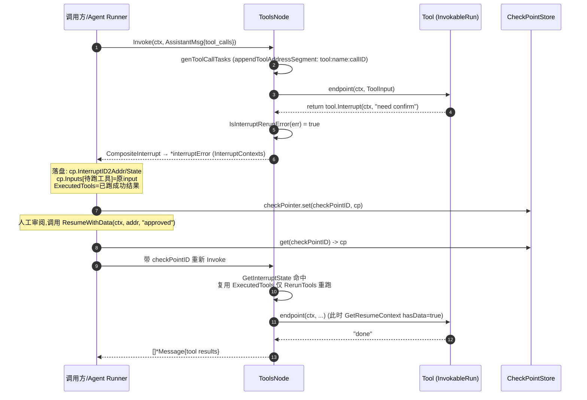
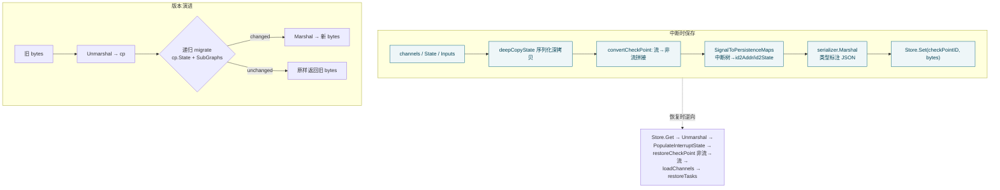

# 第七篇　工具节点与中断/恢复/检查点

*作者：Amlei　·　更新时间：2026-08-09*

> Eino 在 LLM 与外部世界之间架起三层机制：**工具节点（ToolsNode）** 把一组 `components.Tool` 包成一个图节点，负责解释模型回传的 `tool_calls` 并实际执行；**中断/恢复（Interrupt/Resume）** 让任意节点（工具内部、agent 子图、普通节点）能在运行中暂停、等待人工输入后再从断点继续；**检查点（Checkpoint）** 负责把暂停瞬间的图状态持久化，使"跨进程、跨重启的恢复"成为可能。三者共同构成 Eino 的 HITL（Human-In-The-Loop）执行层。
>
> 本篇先纠正两处目录事实：`compose/tool_alias.go` 与 `compose/checkpoint_migrate.go` **并非独立文件**——别名逻辑全部并入 `tool_node.go`，迁移逻辑全部并入 `checkpoint.go`，仅保留同名 `_test.go`。后续剖析据此实际代码结构展开。

---

## 第 1 章　工具节点（ToolsNode）实现

### 1.1　节点构造：从 BaseTool 到可执行端点

`ToolsNode`（`tool_node.go:79`）持有四类端点：`InvokableTool`、`StreamableTool`，以及面向多模态的 `EnhancedInvokableTool`/`EnhancedStreamableTool`（接口层级见[第四篇·第 4 章](part-04-components.md)）。`NewToolNode`（`:238`）将 `ToolsNodeConfig`（`:183`）转换为内部 `toolsTuple`（`:316`），核心转换函数是 `convTools`（`:489`）。

`convTools` 逐个 `BaseTool` 做四件事：(1) `bt.Info(ctx)` 取 `ToolInfo`；(2) 通过类型断言判定该工具实现了哪几种接口，并对每种接口用 `wrapToolCall`/`wrapStreamToolCall`/`wrapEnhancedInvokableToolCall`/`wrapEnhancedStreamableToolCall`（`:576-650`）包装成端点；(3) 若仅实现其中一种调用范式，则用 `invokableToStreamable`/`streamableToInvokable`（`:700-722`）补全另一种，使 `Invoke` 与 `Stream` 两条路径都能工作；(4) 按 `parseExecutorInfoFromComponent`（`:522`）记录回调处理，据此决定是否再套一层 `invokableToolWithCallback`（`:652`）以注入回调切面。

### 1.2　并发分发与结果回拼

`ToolsNode.Invoke`（`:1046`）与 `Stream`（`:1148`）执行骨架一致，差别在端点调用方式与结果拼装：

1. **取选项与元组**：`getToolsNodeOptions`（`:1278`）解析调用级选项；若调用方通过 `WithToolList`/`WithToolAliases`（`:56-69`）覆盖了工具列表或别名，则用 `buildTupleFromOpts`（`:1020`）现场重建 `toolsTuple`，否则沿用编译期元组。这支撑了"同一节点在不同调用中用不同动态工具集"。
2. **生成任务**：`genToolCallTasks`（`:777`）校验入参必须是 `Assistant` 角色且含 `ToolCalls`（`:780`），随后为每条 `tool_call` 构造任务，先做参数别名重映射（`:845`），再可选地走 `ToolArgumentsHandler` 做参数预处理，最后挂上对应端点；遇到工具名不存在时，若无 `UnknownToolsHandler` 直接报错，否则用 `newUnknownToolTask`（`:868`）兜底——这是处理 LLM 工具名幻觉的逃生通道。
3. **调度**：默认 `parallelRunToolCall`（`:985`），仅当 `ExecuteSequentially=true` 才走 `sequentialRunToolCall`（`:973`）。并发实现有细节：**首条任务在主 goroutine 同步执行**（`:1012`），其余起 goroutine 并用 `sync.WaitGroup` 等待（`:994`）；每个 worker 都 `recover` 并把 panic 转成 `safe.NewPanicErr`（`:1002`），避免一个工具崩溃拖垮整批。
4. **回拼**：`Invoke` 把每个结果按原顺序构造 `schema.ToolMessage`（`:1134`）；`Stream` 则用 `schema.StreamReaderWithConvert`（`:1259`）把每个工具的流映射到"对应槽位的 Message"，最后 `schema.MergeStreamReaders`（`:1270`）合并（见[第三篇·第 5 章](part-03-streaming.md)）。

### 1.3　AgenticToolsNode：面向 agent 的适配外壳

`AgenticToolsNode`（`agentic_tools_node.go:40`）只是 `ToolsNode` 的一层协议适配：内部持有 `inner *ToolsNode`（`:41`），`Invoke`/`Stream`（`:44/52`）把入参 `*schema.AgenticMessage` 经 `agenticMessageToToolCallMessage`（`:61`）压成经典 `*schema.Message`（从 `ContentBlockTypeFunctionToolCall` 抽出 `ToolCall`），交给 `inner`；返回时再用 `toolMessageToAgenticMessage`（`:82`）把 `ToolMessage` 重新包成带 `ContentBlockTypeFunctionToolResult` 的 `AgenticMessage`。

其意义在于：新版 agent 循环使用结构化 `ContentBlock`（见[第二篇·第 3 章](part-02-schema.md)），而经典 ToolsNode 的调度/并发/中断逻辑无需重写，靠这层无状态转换即可复用。

### 1.4　工具别名（ToolAlias）机制

别名配置 `ToolAliasConfig`（`tool_node.go:172`）含两类：`NameAliases`（工具的别名列表）与 `ArgumentsAliases`（canonical→aliases 的参数键映射）。它解决两个问题：一是模型把工具名/参数名回写错或回写为同义词（如 `q`/`search_term` 都应映射到 canonical `query`）；二是同一节点需在不同上下文对同一工具暴露不同名字。

别名注册在 `toolsTuple.applyAliasConfigs`（`:382`）中完成，分两步：`applyNameAliases`（`:414`）把每个别名也写入 `indexes` 映射到同一工具下标，并检测冲突；`applyArgsAliases`（`:435`）针对工具的 `ParamsOneOf` JSON Schema 收集合法字段名集合，校验别名不与 schema 字段冲突，最后构造一张 **alias→canonical 反向映射表** `argsAliasMap[toolName]`（`:484`）。运行期 `remapArgs`（`:334`）用 sonic 解析参数 JSON，对每个 alias 键——仅当 canonical 键不存在时——做替换并删除原 alias 键（`:350-361`），避免覆盖。

---

## 第 2 章　中断/恢复实现

### 2.1　中断信号的三种抛出方式

compose 层暴露三档中断 API（`interrupt.go`）：

- `Interrupt(ctx, info)`（`:110`）：无状态中断，最常用。
- `StatefulInterrupt(ctx, info, state)`（`:130`）：带可持久化 state，恢复时通过 `GetInterruptState` 取回。
- `CompositeInterrupt(ctx, info, state, errs...)`（`:174`）：面向 ToolsNode 这类"管理多个独立可中断子流程"的复合节点，把若干子中断 error 打包成一个 error，引擎再把它展开为扁平的断点列表。

设计上 Eino 选择了**显式 error 返回**而非 panic：error 能干净地穿越 goroutine 边界（对并发工具调用至关重要）、可被 `errors.As`/`errors.Is` 结构化解构、可层层 wrap 携带地址与上下文。旧版的 `InterruptAndRerun`（`:46`，一个 sentinel error）已被标 `Deprecated`（`:44`），保留仅为兼容。

工具实现者在 `InvokableRun` 内部调用 `tool.Interrupt`（`components/tool/interrupt.go:44`），把返回的 error 直接 `return`。ToolsNode 在 `runToolCallTaskByInvoke`（`:892`）/`runToolCallTaskByStream`（`:934`）中先 `appendToolAddressSegment`（`:903`）为本次调用挂上一个 `tool:<name>:<callID>` 地址段（`resume.go:154`）——这使得同一工具节点下并发的多个同名工具调用各自拥有唯一可恢复地址。

### 2.2　中断如何冒泡到 Runnable 边界

中断信号以 error 形式从工具/节点向上返回。在图的运行循环 `runner.run`（`graph_run.go`，见[第五篇·第 4 章](part-05-compose.md)）中，每轮 `tm.wait()` 拿到 completedTasks 后，`resolveInterruptCompletedTasks`（`graph_run.go:457`）逐个分类：error 若是 `*subGraphInterruptError`（子图带回的内嵌 checkpoint），记入 `tempInfo.subGraphInterrupts`；若是 `*core.InterruptSignal`，把节点加入 `interruptRerunNodes` 并把 info 存入 `interruptRerunExtra`；其余非中断 error 才是真正的失败。

分类完成后，由两条路径构造检查点并终止本轮运行：

- `handleInterrupt`（`graph_run.go:502`）：处理"简单中断"。它把当前 `channels`、待执行任务的 `Inputs`、深拷贝的 `State`（`deepCopyState`，`:572`，用序列化做深拷贝——见[第六篇·第 1 章](part-06-state.md)）打包成 `checkpoint`，再用 `core.SignalToPersistenceMaps`（`internal/core/interrupt.go:327`）把信号树展平为 `InterruptID2Addr`/`InterruptID2State` 两个 map 存入 checkpoint。若是子图则返回 `*subGraphInterruptError`（内嵌 cp）；若是顶层图且有 `checkPointID`，则 `checkPointer.set` 落盘，并返回 `*interruptError`（内含 `InterruptContexts`）。
- `handleInterruptWithSubGraphAndRerunNodes`（`:598`）：处理"复合中断"——同时存在子图中断与重跑节点。它先把非中断任务正常 forward 到下游 channel，再为子图中断节点设置 `SkipPreHandler=true`（恢复时不重跑 pre-handler），把它们的中嵌 checkpoint 挂到 `cp.SubGraphs`，把重跑节点的原 input 写入 `cp.Inputs`。这种"父图 + 嵌套子图 checkpoint"的结构，让任意深度的图嵌套都能逐层恢复。

### 2.3　恢复协议：地址驱动的定向续跑

恢复由调用方在 ctx 上注入"恢复目标"触发。三个入口（`resume.go`）：`Resume(ctx, interruptIDs...)`（`:94`）、`ResumeWithData(ctx, interruptID, data)`（`:106`）、`BatchResumeWithData(ctx, resumeData)`（`:119`，底层实现）。三者都委托 `core.BatchResumeWithData`（`internal/core/address.go:245`），把目标写入 ctx 中的 `globalResumeInfo`（`address.go:90`），其字段包含 `id2ResumeData`、`id2State`，以及后缀 `Used` 的 map——后者是幂等性的关键。

节点侧通过两个泛型函数感知恢复状态：`GetInterruptState[T]`（`resume.go:32`）返回 `(wasInterrupted, hasState, state)`；`GetResumeContext[T]`（`:77`）返回 `(isResumeTarget, hasData, data)`。

恢复信息的"分发"发生在地址下钻时：`core.AppendAddressSegment`（`address.go:118`）每生成一个子地址，就拿当前地址去 `rInfo.id2Addr` 匹配。一旦命中且未被用过，就把对应 `InterruptState` 写进 `runCtx.interruptState`、把 resumeData 写进 `runCtx.resumeData` 并置 `isResumeTarget=true`，同时标记 `Used`。此外还有"后代前缀匹配"规则：若当前地址是某个被恢复地址的前缀（说明目标在自己体内），也置 `isResumeTarget=true`，让复合组件（子图、含子图的工具）知道应当继续下钻而非自我中断。

官方文档（`resume.go:48-79`）总结了两套使用策略：**Strategy 1"隐式全恢复"**——只要 `wasInterrupted` 为真就继续，适合 UI 只给一个"继续"按钮；**Strategy 2"定向恢复"**（主流）——`isResumeTarget` 为真才消费 data 并完成工作，否则必须 `StatefulInterrupt(...)` 重新中断以保留状态、让信号继续传播。

### 2.4　工具执行→中断→人工输入→恢复 完整时序

图注：步骤 4-6 展示工具内部主动中断；步骤 7-8 展示中断信号树展平落盘；步骤 11-13 展示恢复时由 `AppendAddressSegment` 沿地址下钻匹配，并把 checkpoint 里的 `toolsInterruptAndRerunState`（`tool_node.go:309`）还回 ToolsNode，使其能跳过已成功工具、只重跑断点工具，达成幂等的部分重放。

### 2.5　中断嵌套与幂等性

中断可任意嵌套：`InterruptSignal.Subs`（`internal/core/interrupt.go:48`）构成树，`SignalToPersistenceMaps`（`:327`）再把它扁平化为两个 map 落盘。恢复时 `PopulateInterruptState`（`address.go:271`）把这两个 map 重新灌回 `globalResumeInfo`。

幂等性靠两套 `Used` map 保证：`id2StateUsed`/`id2ResumeDataUsed`。每次地址匹配命中就置位（`address.go:158/169`），避免同一断点的 state 或 data 被多个同名兄弟工具重复消费。这对"并行同名工具调用"场景是必需的——三个并发 `search` 工具调用，恢复时各自只能取到自己那份 state。

---

## 第 3 章　检查点（Checkpoint）实现

### 3.1　checkpoint 结构与生命周期

`checkpoint` 结构（`checkpoint.go:106`）持久化七样东西：

| 字段 | 含义 |
|---|---|
| `Channels` | 各 channel（dag/pregel）的当前值，即图的"数据面" |
| `Inputs` | 待执行节点的入参，恢复时直接喂入而无需重算 pre-handler |
| `State` | 图级状态（见[第六篇·第 1 章](part-06-state.md)）的深拷贝 |
| `SkipPreHandler` | 哪些节点恢复时跳过 pre-handler |
| `RerunNodes` | 需要重跑的节点列表 |
| `SubGraphs` | 嵌套子图的 checkpoint，支持任意深度 |
| `InterruptID2Addr`/`InterruptID2State` | 中断信号树扁平化后的地址与状态表 |

`checkPointer`（`:185`）持有 `store CheckPointStore`（接口定义在 `internal/core/interrupt.go:27`，仅 `Get`/`Set` 两个方法）、`serializer Serializer` 与 `sc *streamConverter`。生命周期完整闭环：**写入**发生在 `handleInterrupt`/`handleInterruptWithSubGraphAndRerunNodes`，`convertCheckPoint`（`:272`）在落盘前把流式 channel 值拼接成非流式（流无法持久化）；**读取**发生在运行入口 `runner.run`（`graph_run.go:156`）；**恢复**经 `setCheckPointToCtx`（`:145`）与 `restoreCheckPointState`（`graph_run.go:382`）把非流式值再包回流 reader、`cm.loadChannels`、应用 `StateModifier`、重建 `internalState`、按 `cp.Inputs`/`SkipPreHandler`/`RerunNodes` 重建任务集。

读写分离的 ID 设计：`WithCheckPointID`（`:73`）指定读来源，`WithWriteToCheckPointID`（`:83`）可指定不同的写目标，便于"从旧 checkpoint 恢复、写到新 checkpoint"的分叉场景。

### 3.2　序列化机制：类型标注 JSON

默认序列化器是 `serialization.InternalSerializer`（`checkpoint.go:176`）。它并非直接 JSON——而是先把任意值拆成带类型标签的信封（`internalStruct` 含 `Type *valueType` + JSON 值），其中 `valueType` 记录指针层数、类型名、map 键值类型、slice 元素类型，最后用 sonic 序列化。引擎细节见[第十二篇](part-12-internal.md)。

类型注册是核心约束：`schema.RegisterName[T](name)`（`schema/serialization.go:83`）同时向 `encoding/gob` 与本序列化器注册。这也是为什么 `checkpoint.go` 与 `tool_node.go` 的 `init()` 里会大量 `schema.RegisterName[*xxx]("_eino_xxx")`（如 `checkpoint.go:29-33`、`tool_node.go:305`）：**所有要进 checkpoint 的自定义类型必须先注册，否则 Marshal 失败**。

选择"自研类型标注 JSON"而非 gob 直存，trade-off 在于：JSON 可读、可被 `MigrateCheckpointState` 这类工具解析改写、跨版本更可控；代价是需要显式注册所有类型、map/slice/指针需特殊编码。

### 3.3　检查点版本迁移

`MigrateCheckpointState`（`checkpoint.go:231`）解决"结构演进后旧 checkpoint 的兼容"问题：当开发者修改了图状态的结构体定义，旧字节流 Unmarshal 会失败或字段错位。该函数用给定 serializer 解码 cp，对 `cp.State` 及所有嵌套 `SubGraphs` 的 State 递归应用用户 `migrate` 回调（`migrateCheckpoint`，`:247`），再重新编码。

回调契约是 `(newState, changed, error)`：返回 `changed=false` 则该节点原样保留；任一层 `error` 立即中止整树迁移；若整树都未变更，直接返回原始字节，避免无谓重写。典型用例是 ADK 跨版本升级时迁移旧 checkpoint。

图注：左上为保存链路，注意流式值必须先拼接成非流式才能进序列化器；右下为迁移链路，递归处理嵌套子图状态、仅在确有变更时重新编码；下方虚线标出恢复时的逆向链路。

---

## 第 4 章　为何如此设计：权衡的总账

1. **并发 vs 顺序**：默认并发（`parallelRunToolCall`）契合 LLM 并行 tool_calls 的语义，**首任务在主 goroutine 跑**是为减少无谓的 goroutine 创建；`ExecuteSequentially` 仅作为可选项，供有顺序依赖的工具（如写库后查询）使用。并发下的 panic 用 `safe.NewPanicErr`（`:1005`）回收，避免单点崩溃放大。
2. **中断传播：error vs panic**：选 error 路径。panic 会被并发 goroutine 复杂化、难以携带结构化字段；显式 error 既可 wrap 地址又可被 `errors.As` 解构。代价是调用方必须主动识别（`IsInterruptRerunError`），否则会被当普通错误处理。
3. **检查点序列化格式**：选自研类型标注 JSON 而非 gob/protobuf。gob 不可读且跨版本脆弱；protobuf 需要预生成 schema。当前方案换取可读性、可迁移性与反射灵活性，代价是类型必须显式注册、性能不如二进制。
4. **恢复幂等性**：用 `Used` map（`address.go:91`）保证 state/data 各只被消费一次，使"部分重放"——只重跑断点工具、跳过已成功工具（`tool_node.go:793-818`）——安全可重复。
5. **复合 vs 扁平中断**：用 `Subs` 树（`interrupt.go:48`）+ `SubGraphs` map（`checkpoint.go:113`）保留嵌套结构，而非一上线性化。这使父子图的恢复边界清晰，父图不必理解子图内部断点。
6. **别名不可覆盖**：`remapArgs` 仅在 canonical 键不存在时才用 alias 替换（`:350-361`），避免别名意外覆盖显式参数——保守优先。

> **一处重要校正（README 轻描淡写）**：README（`README.md:154`）声称 "Any agent or tool can pause execution for human input and resume from checkpoint. **The framework handles state persistence and routing.**" 核对实际：前半句准确；后半句**轻描淡写**。实际框架还额外承担：中断信号树的聚合与扁平化（`SignalToPersistenceMaps`）、地址驱动的定向恢复（`AppendAddressSegment` 的前缀匹配 + Used 幂等）、流↔非流的检查点转换（`convertCheckPoint`/`restoreCheckPoint`）、嵌套子图 checkpoint（`SubGraphs`）、版本迁移（`MigrateCheckpointState`）。所谓"routing"实指 `handleInterruptWithSubGraphAndRerunNodes` 里的 RerunNodes/SkipPreHandler 重路由逻辑，但远不止"routing"一词所能概括。另需注意：框架**不自动清理**过期 checkpoint（需 store 实现 `CheckPointDeleter` 可选接口），与"handles"暗示的全自动存在落差。

---

*第七篇完。下一篇进入 callbacks 切面机制——OnStart/OnEnd/OnError 等五个注入点如何横切所有组件/图/agent、handler 链的洋葱式调用顺序、流式观测为何要付出 N+1 倍 stream 复制的代价。*
