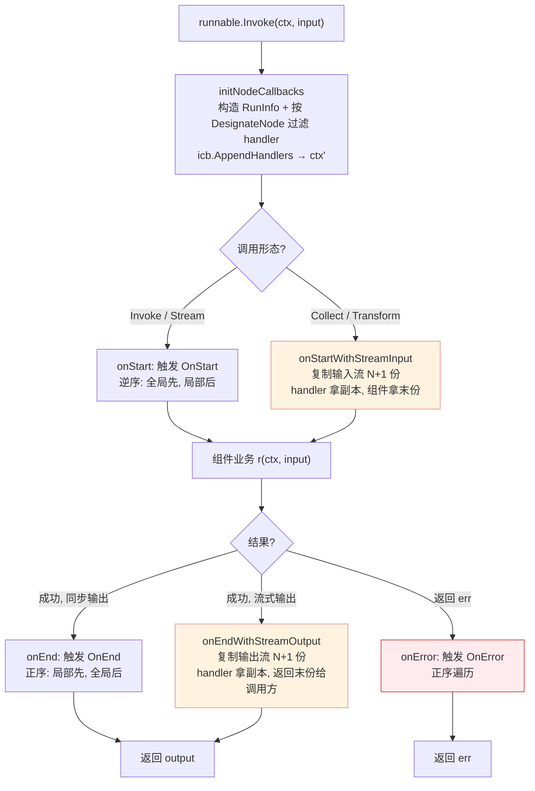

# 第八篇　callbacks 切面机制

*作者：Amlei　·　更新时间：2026-08-09*

> `callbacks` 为组件 / 图 / agent 的执行提供一套**统一的横切观测点**。它把"日志、trace、metrics、token 计费"等横切关注点从业务调用链里剥离出来，固定在五个生命周期时机注入，使得同一份 handler 既能挂在单次图执行上，也能全局生效于进程内所有节点。
>
> 本篇回答：五个注入点各自在何时触发、handler 链为何是"洋葱式"调用顺序、流式观测为何要付出 N+1 倍 stream 复制的代价、组件何时该"自管"回调何时该让框架托管。

---

## 第 1 章　设计目标：切面而非用户自埋点

### 1.1　固定的五个注入点

`callbacks` 在 `internal/callbacks/interface.go:50` 定义 `CallbackTiming` 枚举，在 `callbacks/interface.go:114-134` 暴露五个常量：

| 常量 | 触发时机 | 拿到的载荷 |
|---|---|---|
| `TimingOnStart` | 组件开始处理前 | 完整输入值 |
| `TimingOnEnd` | 组件成功返回后 | 输出值；出错不触发 |
| `TimingOnError` | 组件返回非 nil error | error；**流中错误不走这里** |
| `TimingOnStartWithStreamInput` | 输入本身是流（Collect/Transform） | `*schema.StreamReader[CallbackInput]` 的副本 |
| `TimingOnEndWithStreamOutput` | 输出是流（Stream/Transform） | `*schema.StreamReader[CallbackOutput]` 的副本 |

这套时机的本质是：**把组件调用形状（Invoke / Stream / Collect / Transform，见[第三篇·第 7 章](part-03-streaming.md)与[第六篇·第 3 章](part-06-state.md)）与可观测性形状解耦**。无论组件是同步还是流式，handler 作者都面对同一组语义钩子，只是流式形态多一份 stream 副本。

### 1.2　三种粒度的挂载与继承

文档（`callbacks/doc.go:17-43`）阐明三层动机：

1. **统一性**：同一份 handler 跨 `components`、`compose`、`adk`（见[第九篇](part-09-adk.md)）通用。用户写一次"打印 token 用量"的逻辑，挂上去就能观察整张图的每个模型节点。
2. **三种粒度的挂载**：全局（`AppendGlobalHandlers`，进程级）、单次调用（`compose.WithCallbacks`）、节点级（`.DesignateNode("name")`）。
3. **继承**：父图 ctx 里携带的 handler 会被子图自动继承（`doc.go:40`），无需手工传递。

若改用显式回调参数，每个组件接口签名都要塞回调参数、每个实现都要手工埋点、流式还要自己处理 stream 复制——切面把这些复杂度集中收敛到框架内部。

---

## 第 2 章　核心抽象

### 2.1　Handler 接口与 `any` 载荷

真正的接口定义藏在 `internal/callbacks/interface.go:38`，公开包通过类型别名重导出（`callbacks/interface.go:85`）：

```go
// internal/callbacks/interface.go:38
type Handler interface {
    OnStart(ctx context.Context, info *RunInfo, input CallbackInput) context.Context
    OnEnd(ctx context.Context, info *RunInfo, output CallbackOutput) context.Context
    OnError(ctx context.Context, info *RunInfo, err error) context.Context
    OnStartWithStreamInput(ctx, info, *schema.StreamReader[CallbackInput]) context.Context
    OnEndWithStreamOutput(ctx, info, *schema.StreamReader[CallbackOutput]) context.Context
}
```

两个关键设计：

- **`CallbackInput`/`CallbackOutput` 是 `any`**（`internal/callbacks/interface.go:34`）。具体类型由各 component 包定义（如 `*model.CallbackInput`，见[第四篇·第 7 章](part-04-components.md)），用户通过 `model.ConvCallbackInput(in)` 安全转型，类型不匹配返回 `nil`（`callbacks/interface.go:43`）。这让 Handler 接口能跨越所有组件类型而不退化成 `any` 大杂烩。
- **每个方法返回 `context.Context`**。同一 handler 的 `OnStart` 返回的 ctx 会被传给同 handler 的 `OnEnd`（`interface.go:67`），实现"OnStart 打时间戳 → OnEnd 算耗时"的状态传递。但**不同 handler 之间不保证顺序、也不串 ctx**（`doc.go:106`）——共享状态要塞进最外层 ctx 的并发安全变量。

`RunInfo`（`internal/callbacks/interface.go:26`）描述触发者身份：`Name`（节点名）、`Type`（实现标识如 "OpenAI"，来自[第四篇·第 2 章](part-04-components.md)的 `Typer`）、`Component`（类别常量如 `ComponentOfChatModel`）。文档强调 RunInfo **可能为 nil**（`interface.go:23`），handler 必须防御。

### 2.2　TimingChecker：可选的性能短路

```go
// internal/callbacks/interface.go:52
type TimingChecker interface {
    Needed(ctx context.Context, info *RunInfo, timing CallbackTiming) bool
}
```

框架在每个时机触发前会问每个 handler："你需要这个时机吗？"返回 `false` 就把它从本次调用链里剔除（`internal/callbacks/inject.go:96`）。这直接决定了**流式时机是否要为它复制一份 stream**——下面会看到，stream 复制代价不低，`Needed` 是关键的性能阀门。

### 2.3　HandlerBuilder 与 HandlerHelper

`HandlerBuilder`（`callbacks/handler_builder.go:54`）持有五个可选函数字段，`Build()` 产出 `handlerImpl`。它的 `Needed`（`:90`）根据"哪个函数非 nil"自动实现 `TimingChecker`——只设了 `OnEndFn` 的 handler，框架就不会在 `OnStart`/流式时机上为它分配任何资源。这是"按需付费"的核心。

`utils/callbacks/template.go` 的 `NewHandlerHelper()` 提供更高级 API：按组件类型注册**强类型** handler。产出的 `handlerTemplate`（`:182`）在每个回调里 `switch info.Component`（`:188`），调用对应的 `ConvCallbackInput` 转型后派发给具体 handler。

> **一处文档错误（勘误）**：`callbacks/doc.go:76` 的示例写 `handler := callbacks.NewHandlerHelper()`，但 `NewHandlerHelper` 实际定义在 `utils/callbacks/template.go:41`（路径 `github.com/cloudwego/eino/utils/callbacks`），并非顶层 `callbacks` 包。同文件 `:73` 的散文正确写成 `utils/callbacks.NewHandlerHelper`，与代码示例自相矛盾——读者照抄 `callbacks.NewHandlerHelper()` 会编译失败。

---

## 第 3 章　注入机制深挖

### 3.1　运行期载体：context.Context 携带 manager

切面的运行期状态全靠 `context.Context` 传递，没有任何全局注册表（除全局 handler 列表）。核心是 `internal/callbacks/manager.go`：

```go
// internal/callbacks/manager.go:24
type manager struct {
    globalHandlers []Handler
    handlers       []Handler
    runInfo        *RunInfo
}
var GlobalHandlers []Handler   // :30  进程级全局 handler
```

`newManager`（`:32-45`）在构造时**拷贝一份** `GlobalHandlers`（避免后续并发追加全局 handler 影响在途调用）。`managerFromCtx`（`:61`）取回时**值拷贝**，每次读到的都是一份可独立修改的快照。

### 3.2　全局 + 局部 handler 的合并与洋葱模型

`internal/callbacks/inject.go:94` 的过滤与合并是核心：`hs` 的顺序是 **[局部 handler..., 全局 handler...]**。每个 handler 先过 `Needed` 短路，只有声明需要此 timing 的才进 `hs`。

这是最容易被误用的地方。文档说明全局 handler 优先级更高，但代码里的实现是**不同方向遍历**：

- `OnStartHandle`（`inject.go:107`）：`for i := len(handlers)-1; i >= 0; i--` —— **逆序**。由于 `hs = [local, global]`，逆序意味着**全局 handler 先触发**，局部 handler 后触发。
- `OnEndHandle`（`:117`）/`OnErrorHandle`（`:195`）：**正序**，局部先、全局后。

这正是经典的**中间件洋葱模型**：全局 handler 作为最外层包裹，进入时最先（OnStart 逆序）、退出时最后（OnEnd 正序）。

### 3.3　RunInfo 跨时机的关联

`On` 函数（`inject.go:74-105`）对 RunInfo 的处理很精巧：`OnStart` 之后 manager 副本的 `runInfo` 被清空，防止后续嵌套调用误用同一 RunInfo；但 `OnEnd` 仍能从 `CtxRunInfoKey` 捞回本次调用的 RunInfo。这保证即便组件实现在 `OnStart` 和 `OnEnd` 之间替换了 ctx（只要还带着同一个 `CtxRunInfoKey`），RunInfo 仍能正确关联。

### 3.4　流式钩子：N+1 倍 stream 复制

流式观测的最大约束是：**不能吃掉下游要消费的流**。`internal/callbacks/inject.go:143-161` 的 `OnWithStreamHandle` 解决方案是把流复制 N+1 份：

```go
// internal/callbacks/inject.go:154
inOuts := cpy(len(handlers) + 1)          // N 个 handler + 1 份给下游
for i, handler := range handlers {
    ctx = handle(ctx, handler, inOuts[i])  // 每个 handler 一份独立副本
}
return ctx, inOuts[len(inOuts)-1]          // 最后一份还给组件继续消费
```

`cpy` 即 `StreamReader.Copy`（见[第三篇·第 4 章](part-03-streaming.md)的共享惰性链表）。由此推出文档反复强调的陷阱（`doc.go:112`）：**N 个 handler 注册了流式时机，stream 被复制 N+1 份；只要有一个 handler 不 `Close()` 自己那份，原始 stream 无法释放，整条流水线的 goroutine 全部泄漏。** `handler_builder.go:139` 的注释因此明确要求 `defer input.Close()`。

### 3.5　非流输出的多副本：BuildOnEndHandleWithCopy

某些非 stream 的输出也持有"流式语义"的资源（如 adk 的 `AgentCallbackOutput.Events` 是个 `*AsyncIterator`）。对这类输出，框架提供 `BuildOnEndHandleWithCopy`（`inject.go:127`）：接受一个 `copyFn(T, int) []T`，在 `OnEnd` 时按 handler 数量复制输出。adk 正是这么用的——`adk/callback.go:82` 的 `copyAgentCallbackOutput` 把事件迭代器扇出 N 份（见[第九篇](part-09-adk.md)）。

### 3.6　各组件的 callback_extra 扩展点

每个 component 包都定义自己的强类型 `CallbackInput`/`CallbackOutput` 及 `Conv*` 转型函数（见[第四篇·第 7 章](part-04-components.md)）。以 model 为例：`CallbackOutput` 带 `Message` 和 **`TokenUsage`**（含 `PromptTokens`/`CompletionTokens`/`ReasoningTokens`/`CachedTokens`）。这是 token 计费、reasoning 追踪的数据源。`ConvCallbackInput` 能从 `*model.CallbackInput` 或裸 `[]*schema.Message` 两种形态构造——前者对应"组件自管 callback"，后者对应"图节点托管 callback"。这套"组件包自定义 IO 类型 + Conv 双向兼容"模式，让同一份切面机制既能在组件内部以强类型触发，也能在图边界以接口类型触发。

---

## 第 4 章　两条注入路径：组件自管 vs 框架托管

关键洞察：**框架并不总接管 callback 触发**。组件可以选择"自己埋点"。开关是 `components.Checker`（见[第四篇·第 2 章](part-04-components.md)）。`compose/graph_node.go:160` 的 `parseExecutorInfoFromComponent` 在建图时探测：组件实现 `Checker` 且 `IsCallbacksEnabled()` 返回 `true`，则框架**信任组件自己触发 callback**。

### 4.1　路径 A：组件自管

组件实现内部直接调用 `callbacks/aspect_inject.go` 暴露的公开函数 `OnStart[T]`/`OnEnd[T]`/`OnError`/`OnStartWithStreamInput[T]`/`OnEndWithStreamOutput[T]`。典型范例是 `DefaultChatTemplate.Format`（`components/prompt/chat_template.go:50`）：

```go
ctx = callbacks.EnsureRunInfo(ctx, t.GetType(), components.ComponentOfPrompt)  // :52
ctx = callbacks.OnStart(ctx, &CallbackInput{...})                              // :53
defer func() { if err != nil { _ = callbacks.OnError(ctx, err) } }()          // :57
// ... 业务 ...
_ = callbacks.OnEnd(ctx, &CallbackOutput{...})                                 // :73
```

`IsCallbacksEnabled() bool { return true }`（`:87`）声明自管意图。组件作者自己决定 callback 在流中何处触发，比框架代办更精细。

### 4.2　路径 B：框架托管

框架在建图时把 executor 包成带 callback 的 Runnable（`compose/component_to_graph_node.go:41`）。这些 `*WithCallbacks` 都委托给 `runWithCallbacks`（`compose/utils.go:100`），它就是切面包装的核心：

```go
// compose/utils.go:100
return func(ctx, input, opts...) (output, err error) {
    ctx, input = onStart(ctx, input)           // :104 触发 OnStart
    output, err = r(ctx, input, opts...)       // :106 真正业务
    if err != nil {
        ctx, err = onError(ctx, err)           // :108 出错→OnError
        return output, err
    }
    ctx, output = onEnd(ctx, output)           // :112 成功→OnEnd
    return output, nil
}
```

注意这是**包装 Runnable 函数**，而非装饰 `context`——切面在函数调用边界生效。

### 4.3　节点执行前：把 manager 灌进 ctx

无论路径 A 还是 B，节点真正执行前，图运行时都会先准备 ctx。`compose/utils.go:152-207` 的 `initGraphCallbacks`/`initNodeCallbacks` 构造 `RunInfo`，再按调用选项里 `WithCallbacks` + `DesignateNode` 的 paths 过滤出本节点适用的 handler：没带 paths 的 handler 作用于整图；带 paths 的只作用于指定节点。最终用 `icb.AppendHandlers` 把 handler 与新 RunInfo 写入 ctx，得到一个**只属于本次节点执行的 ctx**。

### 4.4　全局 handler 的进程级注入

全局 handler 不走 Option，而是进程启动时一次性注册：`callbacks.AppendGlobalHandlers`（`callbacks/interface.go:103`）直接 `append` 到包级变量 `callbacks.GlobalHandlers`。文档强调这**非线程安全**，必须在程序初始化期调用，严禁与图执行并发。

---

## 第 5 章　数据流：一次节点执行的 callback 时序



图注：橙色节点为流式时机，需付出 `StreamReader.Copy(N+1)` 的扇出代价（`inject.go:154`）；红色节点为错误路径。`OnEnd` 与 `OnError` 互斥——前者只对成功返回触发，后者只对返回值非 nil 触发；**流式消费期（`Recv`）的错误两者都不触发**。`TimingChecker.Needed` 在每个时机前过滤 handler，决定是否真正付出复制/遍历代价。

---

## 第 6 章　为何如此设计：权衡的总账

1. **切面 vs 显式回调参数**：切面方案（Eino 选择）保持组件接口纯净（`Generate(ctx, msgs, opts...)`），横切启用靠运行期 Option/全局、零代码改动，流式观测框架统一复制 stream；代价是 handler 拿到的是 `any`，必须 `Conv*` 转型，以及跨 handler 无顺序保证、无 ctx 串联——共享状态要塞进最外层 ctx 的并发安全变量。
2. **错误隔离：handler 抛错不被兜底**。`internal/callbacks/` 与 `callbacks/` 全包**没有任何 `recover()`**（grep 验证）。这意味着：**handler 里 panic 会沿调用栈直接传播，中断当前组件调用甚至整张图执行**。框架不替业务兜底观测代码——观测代码本就不应阻塞业务，但一旦它崩了，让失败可见比静默吞掉更安全。代价是 handler 作者必须自己做防御性编程（nil 检查、类型断言保护）。
3. **性能开销的两道阀门**：(a) `TimingChecker` 在 `On` 里过滤掉不需要的 handler；(b) 流复制延迟到必要时机——只有真正有 handler `Needed` 流式时机时才 `Copy(N+1)`，零 handler 时直接返回原流。主要开销来自流式时机的 stream 扇出，故文档反复强调"handler 不需要的 timing 就别注册"。
4. **洋葱模型的逆/正序**：`hs=[local, global]`，OnStart 逆序（全局先）、OnEnd 正序（全局后）。这让全局 handler（如 OpenTelemetry trace）自然成为最外层包裹，进入时开 span、退出时关 span。
5. **不要修改 Input/Output**（`doc.go:117`）：下游节点和其他 handler 共享同一指针（非深拷贝），并发图执行下修改会触发 data race。需要派生应自建副本。
6. **流中错误不进 OnError**（`interface.go:121`、`doc.go:123`）：`StreamReader.Recv` 返回的 error 不会被路由到 `OnError`——它只对组件方法**返回值**的 error 触发。流内错误要在消费端自己处理。这是"带内传错"流设计（见[第三篇·第 2 章](part-03-streaming.md)）与切面的边界。

---

*第八篇完。下一篇进入 ADK 代理运行时——agent 如何把"下一步做什么"交给 LLM 自己决定、ReAct 循环如何被表达成一张 compose.Graph、pull-based 事件迭代器如何替代回调、取消为何要做成一套安全点状态机。*
