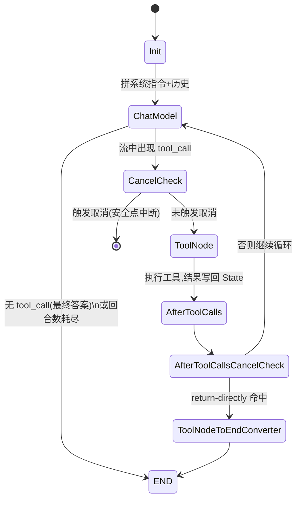
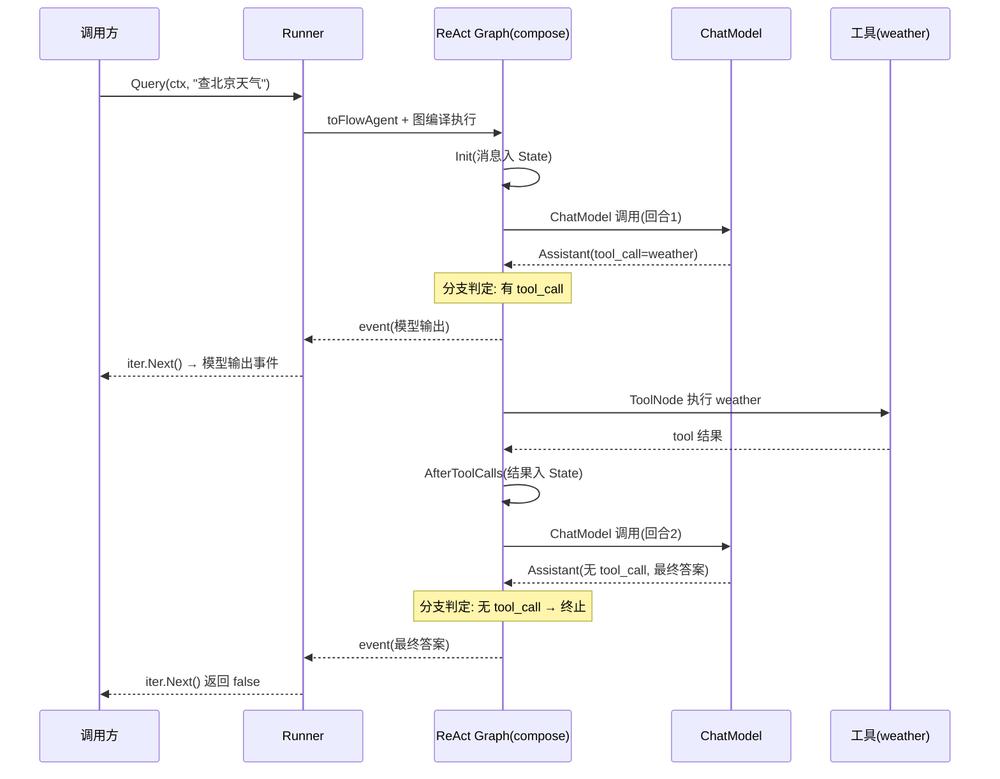
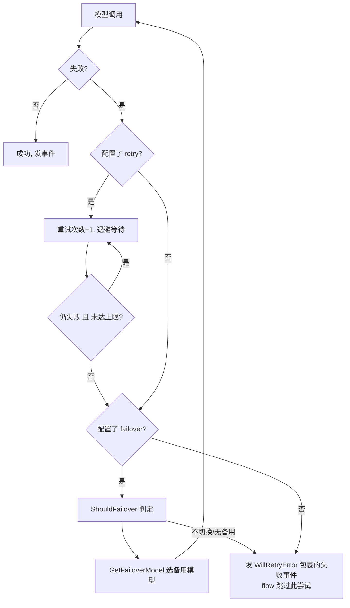

# 第九篇　ADK 代理运行时

*作者：Amlei　·　更新时间：2026-08-09*

> `compose`（[第五篇](part-05-compose.md)）解决"确定性编排"——开发者预先画好图，数据沿边流动。`adk`（Agent Development Kit）解决的是另一类问题：**把"下一步做什么"的决定权交给 LLM 自己**。模型读对话历史、决定是否调工具、调哪个、何时收尾——框架只在每个回合里忠实地执行这个决定，并把全过程以事件流的形式吐给调用方。
>
> 理解 adk 的关键是抓住三位一体：**agent = compose.Graph + 事件流 + 中断/取消状态机**。`adk/react.go` 的 `newReact`、`adk/cancel.go` 的 `cancelContext`、`adk/interrupt.go` 的 checkpoint 序列化，是这三个面的分别入口。

---

## 第 1 章　设计坐标：在 compose 之上长出自主性

adk 的一个关键但容易被忽视的事实是：**它并未另起炉灶实现执行引擎，而是把 agent 内部表达成一张 `compose.Graph`**。这一点在 `adk/react.go:354` 的 `newReact` 中暴露无遗——ReAct 循环就是一张由 `Init`/`ChatModel`/`CancelCheck`/`ToolNode`/`AfterToolCalls` 等节点和一条回边构成的 compose 图（见[第 4 章](part-09-adk.md)）。因此 adk 与 compose 的关系不是"替代"，而是"复用"：compose 提供流式编排、状态注入（[第六篇](part-06-state.md)）、中断/checkpoint（[第七篇](part-07-tools-interrupt.md)）、回调切面（[第八篇](part-08-callbacks.md)）等基础设施，adk 在其上贴出 agent 的语义。

与 Google ADK、LangChain 的 agent 相比，adk 的差异在于：(1) 交互范式是 **pull-based 事件迭代器**（`AsyncIterator`，`adk/utils.go:31`），而非回调或单个返回值；(2) **中断/恢复是一等公民**，与 compose 的 `core.Interrupt` + checkpoint 深度耦合；(3) **取消有完整的安全点状态机**（`adk/cancel.go`），支持"模型调用后"/"工具调用后"等安全点而非粗暴 `ctx.Done()`。

---

## 第 2 章　核心抽象：Agent、Runner 与事件流

### 2.1　Agent 接口与消息类型封闭

adk 用泛型 + 类型约束把"消息类型"封闭为一个二元集合（`adk/interface.go:43`）：

```go
// adk/interface.go:43
type MessageType interface { *schema.Message | *schema.AgenticMessage }
type TypedAgent[M MessageType] interface {
    Name(ctx context.Context) string
    Description(ctx context.Context) string
    Run(ctx context.Context, input *TypedAgentInput[M], options ...AgentRunOption) *AsyncIterator[*TypedAgentEvent[M]]
}
type Agent = TypedAgent[*schema.Message]
```

注意 `Run` 的返回值不是 `(Message, error)`，而是一个**事件迭代器**——这是 adk 与传统 `Generate/Stream` 二分法的根本不同。一个 agent 在其生命周期里会发出多条事件（模型输出、工具调用、工具结果、中断、完成），调用方逐条 `Next()` 拉取。`*schema.Message` 路径享有全部功能（多代理、取消监控、重试）；`*schema.AgenticMessage` 路径是"单发"链，因为 agentic 模型自己内部处理工具调用，框架**不做 ReAct 循环**（`interface.go:447` 注释、`react.go:604` 的 `newAgenticReact` 仍建图但靠模型自身多轮）。

### 2.2　ChatModelAgent 与 Runner

`ChatModelAgent` 是 adk 唯一的具体 agent 实现（DeepAgent 等都建立在它之上，见[第十一篇](part-11-multiagent.md)），其配置 `TypedChatModelAgentConfig[M]`（`adk/chatmodel.go:260`）核心字段：`Instruction`（系统指令，支持 f-string 占位符替换 SessionValues）、`Model model.BaseModel[M]`、`ToolsConfig`、`MaxIterations`（默认 20，`chatmodel.go:308`、`react.go:345`）、`Handlers []TypedChatModelAgentMiddleware[M]`（接口式中间件，见[第十篇](part-10-middlewares.md)）、`ModelRetryConfig`/`ModelFailoverConfig`。构造函数校验 `Model` 必填、failover 配置完整性后返回结构体；真正的"运行逻辑"延迟到首次 `Run` 时由 `sync.Once` 编译（`chatmodel.go:451`），一次性把中间件链、wrapper 链、ReAct 图装配好并冻结。

`TypedRunner[M]`（`adk/runner.go:55`）持有 agent、流式开关和一个 `CheckPointStore`。四个入口：

- `Run(ctx, []M, opts...)`（`:102`）：核心实现 `typedRunnerRunImpl`——把 agent 包成 `flowAgent`、注入运行期上下文、调用 `fa.Run`，再起一个 goroutine 转发事件并在中断/取消时落 checkpoint。
- `Query(ctx, query string, opts...)`（`:108`）：便捷方法，把字符串包成单条 `UserMessage` 再委托 `Run`。
- `Resume(ctx, checkPointID, opts...)`（`:124`）："隐式全恢复"——所有被中断点都继续。
- `ResumeWithParams(ctx, checkPointID, *ResumeParams, opts...)`（`:147`）："定向恢复"——`params.Targets` 以组件地址为键，精确指定哪些中断点用哪些数据恢复。

Runner 有一条铁律注释（`runner.go:50`）：**执行始终经 flowAgent 管线**，由它统一处理多代理编排、回调、取消。

### 2.3　事件流：AsyncIterator 与事件体系

事件迭代器的底座是 `internal.UnboundedChan[T]`（`adk/utils.go:31`）：生产端 `Send` 非阻塞、无界；消费端 `Next()`→`Receive()` 阻塞拉取。这套"拉"模型让调用方自己控制节奏，天然支持流式与背压。每条事件是 `TypedAgentEvent[M]`（`interface.go:419`）：

```go
// adk/interface.go:419
type TypedAgentEvent[M MessageType] struct {
    AgentName string
    RunPath   []RunStep                  // 从根 agent 到事件源的执行路径
    Output    *TypedAgentOutput[M]       // MessageOutput: 完整消息或流
    Action    *AgentAction               // 终止/中断/转移/打断循环
    Err       error
}
```

`Output.MessageOutput` 是 `TypedMessageVariant[M]`（`interface.go:73`），同时承载 `Message`（完整）与 `MessageStream`（流式），并用 `IsStreaming` 区分，外加 `Role`（Assistant/Tool）和 `ToolName`——后两者在流式且消息尚未物化时是调用方识别事件来源的唯一线索。`AgentAction`（`interface.go:357`）是 agent 对框架发出的"控制信号"，四个互斥语义：`Exit`、`Interrupted *InterruptInfo`、`TransferToAgent *TransferToAgentAction`、`BreakLoop *BreakLoopAction`。

> **一处重要校正（README 示例无法编译）**：Eino 根 `README.md:50` 的 adk 示例写 `fmt.Println(event.Message.Content)`，但 `AgentEvent` 结构（`adk/interface.go:419`）**没有顶层 `Message` 字段**——消息嵌在 `event.Output.MessageOutput.Message`。全仓 grep `event.Message\b` 在 adk 源码中零命中，README 示例**无法编译**。正确写法是非流式 `event.Output.MessageOutput.Message.Content`，或直接用框架辅助 `adk.GetMessage(event)`（`adk/utils.go:300`）。同时 README 完全未处理 `event.Err`（流式与错误情况都被忽略）。

> **路线收敛（NOT RECOMMENDED）**：`TransferToAgent`、`RunPath`、`OnSubAgents` 在源码里全部被标 **NOT RECOMMENDED**（`interface.go:311`、`371`、`469`），官方明言"agent 间共享全上下文的转移经验上并未更优，多数多代理场景应改用 `ChatModelAgent + AgentTool` 或 `DeepAgent`"（见[第十一篇](part-11-multiagent.md)）。这是 adk 在演进中的一次明确路线收敛。

---

## 第 3 章　flowAgent：所有执行都穿过的管线

`flowAgent`（`adk/flow.go:42`）内嵌 `Agent`，并叠加上下文初始化、回调、RunPath 记录、取消上下文、转移编排、历史重写。它的 `Run`（`flow.go:352`）做的事：

1. `initRunCtx` 建运行期上下文，`AppendAddressSegment(ctx, AddressSegmentAgent, agentName)` 给地址加段（中断恢复用，见[第七篇·第 2 章](part-07-tools-interrupt.md)）。
2. `genAgentInput`（`flow.go:275`）把 session 里已积累的事件经 `historyRewriter` 重写成消息序列——adk 不存"消息历史"，而是存 AgentEvent 包装（`agentEventWrapper`），用时再物化。默认重写器会把别的 agent 说的话改写成 "For context: [name] said: ..." 的 User 消息，避免角色混乱。
3. `callbacks.OnStart` 上报 `AgentCallbackInput`（见[第八篇·第 3.5 节](part-08-callbacks.md)），再跑底层 agent，起一个 goroutine 转发事件并维护 `lastAction`。
4. 两条精巧规则（`flow.go:509`）：RunPath 仅置一次；**只有 RunPath 精确匹配本 agent 的事件才记入 session、才影响父控制流**——这防止父 agent 误把子/工具内部事件当成自己的终止信号。
5. 若 `lastAction.TransferToAgent` 命中，找到目标 agent 并 `Run`，完成"转移"。

---

## 第 4 章　ReAct 循环：一张 compose.Graph

### 4.1　图的拓扑

`newReact`（`adk/react.go:354`）构造的图节点与边：

```
START → Init → ChatModel ──(branch: 有 tool_call?)──┐
                                                    │否
                                                    ▼
                                              terminal(END/AfterAgent)
                                                    │是
                                                    ▼
                              CancelCheck → ToolNode → AfterToolCalls → AfterToolCallsCancelCheck
                                                                        │
                                                  ┌─────────────────────┴────────────────────┐
                                                  ▼ (return-directly?)                      ▼ 否
                                          ToolNodeToEndConverter → terminal          回到 ChatModel
```

关键代码位置：Init 在 `react.go:367`；ChatModel 节点带 `WithStatePreHandler` 做回合数扣减与超限检查（`react.go:387`）；分支 `toolCallCheck`（`react.go:496`）消费模型流、一旦看到 `chunk.ToolCalls` 非空就转向 `cancelCheckNode_`，EOF 则走向终止；`cancelCheckNode_`（`react.go:399`）是取消安全点；`ToolNode` 由 `compose.NewToolNode` 构造（`react.go:382`）；`afterToolCalls`（`react.go:442`）把工具结果写回 state；这条 `AfterToolCallsCancelCheck → ChatModel` 的回边（`react.go:555`）正是"观察→再思考"的循环。

### 4.2　终止条件

ReAct 循环在四种情况下结束：(1) 模型不再产出 tool_call（最终答案）；(2) 回合数耗尽 → `ErrExceedMaxIterations`（`react.go:33`），默认上限 20（`react.go:345`）；(3) return-directly 工具被命中；(4) 取消/中断冒泡。

> **MaxIterations 默认 20 未在 README 提及（勘误）**：README 称 agent "自己决定何时响应"，但未说明存在回合上限，超限会以 `ErrExceedMaxIterations` 终止。生产环境若任务复杂需显式调高。

### 4.3　状态 typedState

ReAct 图用 `WithGenLocalState` 注入一个 `State`（见[第六篇·第 1 章](part-06-state.md)）：`Messages`（对话历史）、`Extra map[string]any`（用户 K/V，中间件 `SetRunLocalValue` 落点）、`ToolInfos`/`DeferredToolInfos`（给模型的工具清单，可被中间件改写，见[第十篇](part-10-middlewares.md)）、`RemainingIterations`、`ReturnDirectlyToolCallID`、`ToolMsgIDs`（工具名+callID→消息 ID 的映射，保证事件消息与 state 消息 ID 一致）。这个 state 在 checkpoint 时 gob 序列化，跨版本兼容靠双注册与字节级改名（见[第 6 章](part-09-adk.md)）。

### 4.4　两个"回合"的澄清：turn_loop.go 不是 ReAct

adk 里有两层容易混淆的"循环"：内层是上面 `react.go` 的 **ReAct 回合**（model↔tool）；外层是 `adk/turn_loop.go` 的 **TurnLoop**——一个 push-based 交互式事件循环，用于"消息队列驱动的会话 agent"（如聊天机器人边聊边排队新消息）。TurnLoop 的回合生命周期是 `idle → planning → active → idle`（`turn_loop.go:182`），由 `turnBuffer`（`adk/turn_buffer.go`，mutex+cond 的有界队列）喂数据。它内含 `preemptController`（回合级抢占）和 `stopController`（全局终态）两套并发控制器。TurnLoop 内部用 `NewTypedRunner` 跑 agent——即它复用 Runner，是更高一层的调度器，**不是** ReAct 循环本身。



图注：ReAct 回合循环状态图。回边 `AfterToolCallsCancelCheck → ChatModel` 是"观察后再思考"的循环所在；取消安全点位于 ChatModel 之后与 ToolCalls 之后。

---

## 第 5 章　事件流时序

一次 `runner.Query(ctx, "查北京天气")` 的完整事件序列（无中断、流式关闭）：



图注：ReAct 单轮（一次工具调用）事件流时序。每个箭头到调用方的 `iter.Next()` 都是一条 `AgentEvent`；模型输出与工具结果分别成事件，调用方据此实时渲染思考与行动过程。流式开启时，模型输出事件携带 `MessageStream` 而非完整 `Message`。

---

## 第 6 章　中断与恢复（HITL）

adk 的中断是对 compose `core.Interrupt`（见[第七篇·第 2 章](part-07-tools-interrupt.md)）的封装：`Interrupt(ctx, info)`（`interrupt.go:88`，无状态）、`StatefulInterrupt(ctx, info, state)`（`:123`，带可恢复状态）、`CompositeInterrupt(ctx, info, state, subSignals...)`（`:156`，聚合子中断信号——多代理层级把子 agent 的中断"卷起来"上抛的机制）。三者都通过 `core.Interrupt` 注入当前 RunPath 作为层级定位。

### 6.1　checkpoint 序列化与跨版本兼容

中断触发后，Runner 的转发 goroutine 捕获 `event.Action.internalInterrupted`，调 `runnerSaveCheckPointImpl`（`interrupt.go:283`）把根 checkpoint payload `serialization`（`interrupt.go:210`）gob 编码写入 store：

```go
// adk/interrupt.go:210
type serialization struct {
    RunCtx              *runContext
    Info                *InterruptInfo
    EnableStreaming     bool
    InterruptID2Address map[string]Address
    InterruptID2State   map[string]core.InterruptState
}
```

这套机制刻意维护了 **v0.7 / v0.8.0–0.8.3 两代 checkpoint 的向后兼容**：v0.8 曾把 `*State` 注册为 GobEncoder，与 v0.7 的 struct wire 不兼容；恢复时 `preprocessADKCheckpoint`（`interrupt.go:267`）在字节流里把 `_eino_adk_react_state` 等长替换成别名 `_eino_adk_state_v080_`，让 gob 选到正确的本地类型，再迁移字段。这是 gob 单名单类型限制下的务实绕行（与 git 最近几个 commit `3ce8587`、`72796c1`、`c2334bc`、`30f5961` 修复 checkpoint 一致）。

### 6.2　Resume 路径

`Resume` 先 `runnerLoadCheckPointImpl`（`interrupt.go:219`）取出 `runContext` + `ResumeInfo`，用 checkpoint 里记录的流式模式（而非调用方传入的）继续——"checkpoint 是事实来源"，再沿地址下钻到真正中断的子 agent。`ResumeWithParams` 额外把 `Targets` 经 `core.BatchResumeWithData` 注入，叶子组件据此拿到自己的恢复数据；非目标的中断叶子必须**重新中断自己**以保留状态（见[第七篇·第 2.3 节](part-07-tools-interrupt.md)）。

---

## 第 7 章　取消语义：安全点状态机

adk 的取消不是 `context.Cancel` 的薄包装，而是一套独立的、基于安全点的状态机（`adk/cancel.go`）。入口 `WithCancel()`（`cancel.go:217`）返回一个 `AgentRunOption` 和一个 `AgentCancelFunc`。

### 7.1　CancelMode 与安全点

`CancelMode` 是位掩码（`cancel.go:43`）：`CancelImmediate`（立即）、`CancelAfterChatModel`（模型调用后）、`CancelAfterToolCalls`（工具调用后）。后两者正是 ReAct 图里 `CancelCheck`（`react.go:399`）与 `AfterToolCallsCancelCheck`（`react.go:473`）两个节点检查的——它们读 `cancelContext.shouldCancel()`，命中就在安全点暂停。`WithRecursive` 让取消递归传播到 AgentTool 内部的子 agent；`WithAgentCancelTimeout` 给安全点取消加超时，超时则升级为立即取消。

### 7.2　状态机与 interrupt 吸收

`cancelContext` 用原子 CAS 维护状态：

```
stateRunning ──cancel请求──▶ stateCancelling ──interrupt被吸收──▶ stateCancelHandled
    │                              │
    └──────────────────────────────┴──执行自然结束──▶ stateDone
```

一个关键设计叫 **interrupt 吸收**（`cancel.go:150`）：当取消激活时，**任何** interrupt——无论是取消安全点产生的，还是工具里业务逻辑触发的——都被转换成 `CancelError` 发出。理由是在并发执行（并行 workflow、并发工具调用）里，取消型与业务型中断会合并成单个复合信号、无法可靠拆分；业务中断数据并未丢失，而是保存在 checkpoint 里，resume 时重放代码自然重新触发。`wrapIterWithCancelCtx`（`cancel.go:806`）是整个系统里 interrupt→CancelError 的**唯一转换点**。

立即取消需要打断正在进行的流：`typedCancelMonitoredModel`（`cancel.go:842`）包装模型的 `Stream`，在 goroutine 里 `select` 监听取消信号，一旦关闭就用 `ErrStreamCanceled` 终止输出流。递归取消靠 `deriveAgentToolCancelContext`（`cancel.go:364`）为 AgentTool 子 agent 派生子 cancelContext。

---

## 第 8 章　模型韧性：failover 与 retry

模型调用失败有两种策略，都通过 `WrapModel`（见[第十篇](part-10-middlewares.md)）的中间件包装链接入：

- **retry**（`adk/retry_chatmodel.go`）：包装单个模型，按策略（次数、退避、可重试错误判定）重试。状态字段 `typedState.RetryAttempt` 跨回合记录尝试次数，使重试能跨 checkpoint 续上。
- **failover**（`adk/failover_chatmodel.go`）：维护"上次成功的模型"，失败时调用户提供的 `GetFailoverModel` 选备用模型、`ShouldFailover` 判定是否切换。`EventSenderModelWrapper` 把失败的 failover 尝试用特殊错误包起来，让 flow 的事件处理器**跳过**而非致命。

两者组合时，wrapper 链的顺序在 `chatmodel.go:325` 钉死（外→内）：`failoverModelWrapper → retryModelWrapper → eventSenderModelWrapper → 用户 WrapModel → callbackInjectionModelWrapper → 实际模型`。即先 failover 选模型、再 retry 重试、再发事件。



图注：failover/retry 决策流。retry 在单模型内重试；failover 跨模型切换；二者按固定顺序叠在 wrapper 链上（failover 外、retry 内）。`ShouldFailover` 决定是否真换模型，避免无谓切换。

---

## 第 9 章　多代理委派：收敛到 agent-as-tool

adk 提供三条多代理路径，源码强烈倾向其中一条。

### 9.1　确定性转移（deterministic_transfer.go）—— NOT RECOMMENDED

`AgentWithDeterministicTransferTo` 把"LLM 自主决定转交"换成"框架按规则确定性转交"：在 agent 的 system 指令里注入候选 agent 清单与决策规则，并注册一个 `TransferToAgentToolName` 工具。模型若调用该工具，框架据此切到目标 agent。这套被标 NOT RECOMMENDED，且与全上下文共享绑定。

### 9.2　agent-as-tool（推荐路径）

`NewAgentTool(ctx, agent, opts...)`（`agent_tool.go:93`）把一个 agent 包成 `tool.BaseTool`——agent 的 `Name`/`Description` 成为工具名/描述，父 agent 像调普通工具一样调它。内部用 `bridgeStore`（`interrupt.go:325`，内存 map）在工具调用边界内承载子 agent 的 checkpoint，子 agent 用独立 `TypedRunner` 跑。事件语义（`agent_tool.go:69`）很关键：

- 子 agent 的非 Interrupted 事件**实时转发**给父事件流，补上父 RunPath 前缀；但这些转发事件**不入父 runSession、不参与父 checkpoint**——它们仅供最终用户观看。
- 最终回灌父 agent 的是 `lastEvent.Output.MessageOutput.GetMessage()` 的文本，作为工具结果。
- Action 作用域被边界隔离：`Interrupted` 经 `tool.CompositeInterrupt` 跨边界传播；`Exit`/`TransferToAgent`/`BreakLoop` 被吞掉——子 agent 不能意外终结父 agent。
- 取消通过 `deriveAgentToolCancelContext` 派生子 cancelContext，递归取消才向下传播。

这是 prebuilt 的 `supervisor`/`deep` 的底座（见[第十一篇](part-11-multiagent.md)）。

### 9.3　workflow（编排型 agent）—— NOT RECOMMENDED

`workflowAgent`（`workflow.go:39`）自身实现 `Agent` 接口，按 `Sequential`/`Parallel`/`Loop` 三种模式驱动 `subAgents []*flowAgent`。Parallel 模式用 lane 机制并行子 agent、按时间戳归并事件。整套 workflow 在源码里反复标 NOT RECOMMENDED（`workflow.go:163`），官方建议改用 `ChatModelAgent + AgentTool`。

---

## 第 10 章　为何如此设计：权衡的总账

1. **事件流（pull-based iterator）vs 回调**：adk 选 iterator。好处是调用方控制节奏、天然支持背压与流式、错误就是普通 `event.Err`；代价是生产端需 goroutine + 无界 channel（`UnboundedChan`），且事件可能被多次 copy 分叉——故所有流都 `SetAutomaticClose` 防泄漏。
2. **ReAct vs plan-execute**：adk 内置 ReAct（单 agent 自主循环）；plan-execute 在 `adk/prebuilt/planexecute` 单独提供（见[第十一篇](part-11-multiagent.md)）。ReAct 简单但有"思考-行动"耦合；plan-execute 先规划再执行，适合长程任务。
3. **确定性转移 vs 自主 agent**：`deterministic_transfer` 给框架控制权（可预测、可测试）；`agent_tool` 给模型控制权（灵活、但依赖模型判断）。adk 的 NOT RECOMMENDED 标注显示其向后者收敛。
4. **立即取消 vs 安全点取消**：立即取消打断流（`ErrStreamCanceled`）但可能丢工作；安全点取消等到模型/工具调用后，状态干净但延迟。adk 用位掩码让用户组合，超时再升级。
5. **interrupt 吸收**：取消激活时业务中断被吸收为 CancelError，但 checkpoint 保留业务中断数据供 resume 重放——这是并发场景下信号不可靠拆分的务实妥协。
6. **多代理收敛到 agent-as-tool**：几乎一半的转移相关 API（`TransferToAgent`、`OnSubAgents`、`RunPath`、`workflowAgent`、`deterministic_transfer`）在源码里挂着 NOT RECOMMENDED。这是经验驱动的路线收敛——"全上下文转移"在实践中并未更优。
7. **checkpoint gob 单根序列化**：换来简单持久化，但需维护跨版本兼容的字节改名（`preprocessADKCheckpoint`）。代价是 checkpoint 格式脆弱、版本演进需显式迁移。

---

*第九篇完。下一篇进入中间件链——八个官方中间件（动态工具/任务清单/技能/摘要/agentsmd/文件系统/patchtoolcalls/reduction）如何在"每回合—每模型调用—每次工具调用"三个粒度上横切改写 agent 的请求与响应。*
