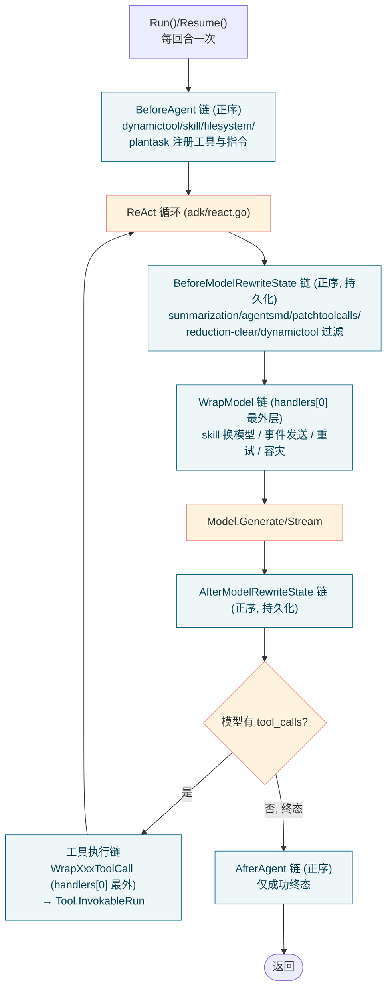

# 第十篇　中间件链

*作者：Amlei　·　更新时间：2026-08-09*

> Eino 的核心 ReAct 循环（[第九篇·第 4 章](part-09-adk.md#第4章)）只做三件事：调模型 → 解析工具调用 → 执行工具 → 回到调模型。如果每加一个新能力（动态工具、任务清单、摘要压缩、文件访问、规范注入……）都要改这个循环，核心会迅速膨胀、分支爆炸、provider 差异无处安放。
>
> adk 的解法是把"横切能力"抽成一条**中间件链**：核心循环只负责按固定编排跑 `handlers` 列表，每个 handler 在固定切面上改写请求或响应。能力可插拔，核心保持纯净。这套机制的入口接口是 `TypedChatModelAgentMiddleware[M]`（`adk/handler.go:139`），8 个官方中间件位于 `adk/middlewares/`。

---

## 第 1 章　两种形态与八个钩子切面

### 1.1　新旧两种"中间件"形态

- **新接口 `TypedChatModelAgentMiddleware[M]`**（`handler.go:139-255`）：接口类型，开放扩展，钩子返回 `(ctx, ..., error)` 直接传播 context，配置集中在 struct 字段。官方 8 个中间件全部基于此。
- **旧结构体 `AgentMiddleware`**（`chatmodel.go:239-257`）：闭合 struct，只有 `AdditionalInstruction`/`AdditionalTools`/`BeforeChatModel`/`AfterChatModel`/`WrapToolCall` 五个固定字段，钩子只返回 `error`。已标 `Deprecated`，仅为兼容保留。

文档（`handler.go:110-138`）明确两者的取舍：简单静态加指令/工具用旧 struct；需要动态行为、context 改写、调用包裹时用新接口。下文除特别说明，"中间件"均指新接口实现。

### 1.2　八个钩子切面

`TypedChatModelAgentMiddleware` 定义 9 个方法，落在三个生命周期粒度上（`handler.go:139-255`）：

| 切面 | 方法 | 触发频率 | 典型用途 |
|---|---|---|---|
| **每回合一次** | `BeforeAgent`（`handler.go:142`） | 每 `Run()` 一次 | 改 instruction、加/删工具 |
| | `AfterAgent`（`handler.go:158`） | 到达成功终态时 | 收尾、清理 |
| **每轮模型调用** | `BeforeModelRewriteState`（`handler.go:171`） | 每次 model 调用前 | 改 messages、改 ToolInfos（**持久化**到 state） |
| | `AfterModelRewriteState`（`handler.go:181`） | 每次 model 调用后 | 处理模型响应 |
| | `WrapModel`（`handler.go:254`） | 每次 model 调用 | 重试/容灾、发事件、改响应流（**不**持久化） |
| **每次工具调用** | `WrapInvokableToolCall` / `WrapStreamableToolCall` / `WrapEnhancedInvokableToolCall` / `WrapEnhancedStreamableToolCall`（`handler.go:193-229`） | 工具执行时 | 包裹工具执行、改结果 |

---

## 第 2 章　中间件链机制

### 2.1　链的注入点与执行顺序

中间件通过 `TypedChatModelAgentConfig.Handlers []TypedChatModelAgentMiddleware[M]`（`chatmodel.go:401`）注入。框架在构造模型包装器时把它们编进三层链（`wrappers.go:52-79`）：`typedStateModelWrapper` 承载模型钩子；工具侧由 `handlersToToolMiddlewares` 转成 `compose.ToolMiddleware`；`BeforeAgent`/`AfterAgent` 直接顺序调用。

执行顺序（关键）：

- `BeforeAgent` / `AfterAgent` / `BeforeModelRewriteState` / `AfterModelRewriteState`：**正序**遍历 `handlers`（`wrappers.go:1229`、`chatmodel.go:801`），即 `handlers[0]` 最先执行；前一个 handler 改写后的 state 传给下一个。fail-fast：任一返回 error，后续不执行（`handler.go:154`）。
- `WrapModel`：**反序构造**端点链（`wrappers.go:1041` 的 `for i := len(w.handlers)-1; i >= 0; i--`），结果是 `handlers[0]` 包在最外层，即 `A(B(C(model)))`。
- `WrapXxxToolCall`：同样 `handlers[0]` 最外层。

一句话记忆：**所有钩子里 `handlers[0]` 都"最先看到"或"最外层包裹"**。模型调用的完整包裹层次见[第九篇·第 8 章](part-09-adk.md#第8章)：`failover → retry → eventSender → WrapModel → callbackInjection → Model`。

### 2.2　改 request 还是改 response？改的会不会留？

最关键的语义区分在 `WrapModel` 与 `BeforeModelRewriteState`：

- `BeforeModelRewriteState` 改的 `state.Messages` / `state.ToolInfos` / `state.DeferredToolInfos` **会持久化**到 agent 内部 state，影响后续所有迭代（`wrappers.go:1239`）。这是**改请求且长效**。
- `WrapModel` 改的输入消息**不**持久化，只影响当次调用，且会破坏 prompt cache（`handler.go:246` 明确 "Discouraged"）。这是**改请求但瞬时**。
- `AfterModelRewriteState` 在模型响应追加到 state **之后**运行，可改带响应的 state，同样持久化。这是**改响应**。
- `WrapXxxToolCall` 包裹工具 endpoint，改的是工具返回值。

中间件作者还有两个跨切面共享状态的工具：`adk.SetRunLocalValue`/`GetRunLocalValue`（`handler.go:338`）——值作用域为单次 `Run()`，可随 interrupt/resume 序列化（强制 gob 可编码）；以及 `adk.TypedSendEvent`（`handler.go:409`）——向事件流发自定义事件。

---

## 第 3 章　八个中间件逐个剖析

### 3.1　dynamictool：按需加载工具集

工具库很大时，不全塞给模型（撑爆 context），而是先藏起来，模型通过一个 `tool_search` 元工具按关键字/`select:` 找到后再"点亮"。`BeforeAgent`（`toolsearch.go:137`）把 `tool_search` 元工具加进 `runCtx.Tools`；`BeforeModelRewriteState`（`:277`）做前向选择：扫描历史里 `tool_search` 的工具结果，把命中的动态工具加回 `state.ToolInfos`。搜索算法 `keywordSearch`（`:507`）按词对工具名（拆 `_`/`__`/camelCase）和描述打分，按分排序取 top-N。

> **勘误**：它并非真正"卸载"已加载工具——一旦被 `tool_search` 点亮，后续每轮都会保留（前向选择是累加的）。卸载需用户自行在更外层处理。客户端过滤模式会改变工具列表，文档明确提示可能使模型 KV-cache 失效（`toolsearch.go:43`）。

### 3.2　plantask：任务清单管理（非"先规划后执行"）

> **一处重要校正**：plantask **不是** planexecute 式的"先产计划再按计划执行"调度器，而是一套**结构化任务清单 CRUD 工具集**（类比 Claude Code 的 TodoWrite）：让 agent 在执行过程中维护带状态/依赖的任务列表，落到文件 Backend。任务的"规划"语义完全靠 prompt 引导 agent 自主调用，中间件不强制任何执行顺序。

`BeforeAgent`（`plantask.go:66`）追加 4 个工具 `TaskCreate`/`TaskGet`/`TaskUpdate`/`TaskList`（共享一把 `sync.Mutex` 保证并发安全）。任务结构含 `ID/Subject/Status/Blocks/BlockedBy` 等，状态机 `pending|in_progress|completed|deleted`。`hasCyclicDependency`（`task.go:93`）更新依赖时 DFS 检测环。

### 3.3　skill：技能加载与子代理派生

注入一个"技能系统"指令 + 一个（默认名 `skill`）工具，工具按 `SKILL.md` 的 YAML frontmatter `context` 字段分三态：`inline`（技能内容直接作为工具结果返回）、`fork`（派生新子代理、不带父历史）、`fork_with_context`（派生子代理、带父消息历史）。`WrapModel`（`skill.go:281`）在 inline 模式下若技能 frontmatter 指定了 `model`，则每次模型调用时换模型——这是"技能激活后改后续模型"的链式效果。

### 3.4　summarization：超阈值自动摘要压缩

> 这是 8 个中间件里**唯一会发起第二次模型调用**的，开销最大。

对话 token 超阈值时（默认 `ContextTokens` 160k，或消息数超 `ContextMessages`，`summarization.go:360`），用独立模型调用生成摘要，替换历史，保留 system 消息与近期用户消息。token 计数（`:420`）取最后一条 assistant 的 `ResponseMeta.Usage.TotalTokens` 作基线，增量消息按 ~4 字符/token 估算。摘要生成支持 `Retry`（指数退避）与 `Failover`（换模型/换输入）。后处理（`:689`）把摘要里的 `<all_user_messages>` 段用最近的**原始**用户消息回填，加 preamble/postamble。摘要消息带 Extra 标记 `contentTypeSummary`，使后续轮次识别为内部消息、避免被当作"真用户消息"重复保留。

### 3.5　agentsmd：AGENTS.md 规范注入

把若干 `Agents.md` 风格的规范文件内容注入对话。`BeforeModelRewriteState`（`:97`）幂等检查（消息里是否已有 `__agentsmd_content__` Extra 标记），无则加载内容，作为 User 消息插到**第一条 User 消息之前**。加载器支持 `@path/to/file` 递归 import（最大深度 5、环检测、全局去重），按 `AllAgentsMDMaxBytes` 预算跳过超额文件。官方强烈建议**排在 summarization 之后**（`agentsmd.go:64`），让规范内容天然落在摘要压缩范围之外。

> **一处实现澄清（勘误）**：包注释声称 "injection is transient — never persisted to conversation state"（`agentsmd.go:17`），但 `BeforeModelRewriteState` 返回的修改后 state 会被持久化（`wrappers.go:1239`）。实际靠 Extra 标记的幂等检查保证"只插一次"，并在每个新 `Run()` 重新派生。"transient"是设计意图而非字面实现。

### 3.6　filesystem：沙箱文件访问

给 agent 一组文件/Shell 工具（`ls/read_file/write_file/edit_file/glob/grep`，可选 `execute`）。`BeforeAgent`（`filesystem.go:405`）追加系统 prompt + 工具集；`UseMultiModalRead` 时 `read_file` 升级为 `EnhancedInvokableTool`，支持图片/PDF（base64）。工具用 `utils.InferTool` 从 Go 函数+结构体 tag 反推 schema。沙箱边界由 `filesystem.Backend` 接口实现决定，中间件本身不假定本地磁盘（Backend 协议详见[第十一篇·第 4 章](part-11-multiagent.md#第4章)）。prebuilt/deep 默认装载它。

### 3.7　patchtoolcalls：补全悬挂的工具响应

> **一处重要校正**：它**不**改写工具调用的参数或格式，而是**补全缺失的工具响应消息**：扫描历史，发现某 assistant 消息有 `ToolCalls` 但后续没有对应的 Tool 消息（被取消/中断/历史残缺），就插入一条占位 Tool 消息（"Tool call X with id Y was canceled..."，`patchtoolcalls.go:260`），避免 provider（尤其 Anthropic/OpenAI）因 tool_call 与 tool_result 严格配对要求而报错。

`BeforeModelRewriteState`（`:71`）按消息类型分发；`patchToolCallsForMessage`（`:89`）遍历消息，遇到带 `ToolCalls` 的 assistant，对每个 `tc` 检查是否已有响应，无则生成占位消息插入。轻量、幂等，典型场景是 interrupt/resume、流式取消、跨 provider 历史拼接。

### 3.8　reduction：工具结果归约（截断 + 清理）

两阶段压缩工具结果占用，比 summarization 更"局部"——不动整段对话语义，只针对工具调用/结果精简：

- **阶段一·截断**：在 `WrapInvokableToolCall`/`WrapStreamableToolCall`（`:419`）里包裹工具。工具返回后，若文本长度 > `MaxLengthForTrunc`（默认 50000），把完整内容写 Backend，工具结果替换成带首尾预览的 `<persisted-output>` 占位。流式工具会把整个流消费完再决定（非增量）。
- **阶段二·清理**：`BeforeModelRewriteState`（`:617`）。超 `MaxTokensForClear`（默认 160000）时保留最近若干工具调用回合，对更早的 tool_call/tool_result 把结果替换成"已保存至 file，用 read_file 查看"占位并写盘 offload。

`ClearAtLeastTokens`（`:755`）只有预计能清理掉这么多 token 才真正落盘 offload，否则放弃——**专门为了不因小收益破坏 prompt cache**。reduction 是挂载面最广的中间件（四个 `WrapXxxToolCall` + `BeforeModelRewriteState`）。

---

## 第 4 章　数据流：中间件链在 agent 回合中的位置

图注：中间件链在 ChatModelAgent 回合中的切面位置。`BeforeAgent`/`AfterAgent` 每回合一次；`BeforeModelRewriteState`/`WrapModel`/`AfterModelRewriteState`/`WrapXxxToolCall` 每轮循环。深色为框架核心，浅色为中间件切面。

---

## 第 5 章　为何如此设计：权衡的总账

1. **中间件 vs 直接改核心循环**：中间件模式的代价是多了一层接口调用与 state 拷贝；收益是核心 ReAct 循环（`adk/react.go`、`turn_loop.go`）对具体能力零感知。新能力可独立演进、独立测试、按需装载。平衡点在于：**纯横切、可组合、可按需关停的能力放中间件；改变 agent 根本调度逻辑（如 planexecute 的 plan→execute 分派、supervisor 的路由）放 prebuilt 多代理层**（见[第十一篇](part-11-multiagent.md)）。
2. **顺序依赖（最重要）**：`BeforeModelRewriteState` 是正序串行、state 累积改写，顺序直接决定结果——agentsmd 必须在 summarization 之后（否则规范消息被算进压缩基线甚至被摘要吞掉）；patchtoolcalls 宜早（在 summarization/reduction 之前补全工具响应）；reduction 与 summarization 可叠加但要注意 token 阈值与计数口径差异；dynamictool 的过滤会破坏 KV-cache。
3. **性能开销**：几乎零成本的是 `BeforeAgent`（每 Run 一次）；每轮固定开销是 `BeforeModelRewriteState` 遍历；显著额外成本是 summarization 触发时多一次模型调用、reduction 截断/清理多一次 Backend 写盘、skill fork 跑一个完整子代理。流式友好度上，reduction 截断对流式工具是"先消费完整流再决定"（非增量）。
4. **与 callbacks 切面的边界**：callbacks（[第八篇](part-08-callbacks.md)）是**纯观测**切面（OnStart/OnEnd/OnError，不改语义、不阻断）；中间件是**语义改写**切面（能改 instruction/tools/messages/model、能补消息、能换模型）。简言之：**要观测用 callbacks，要改行为用 middleware**。
5. **持久化边界是关键**：`BeforeModelRewriteState`/`AfterModelRewriteState` 改的 state 持久化、影响后续所有回合；`WrapModel` 改的不持久化、只影响当次且破坏 prompt cache。中间件作者必须清楚自己改的东西落在哪一侧。
6. **幂等靠 Extra 标记契约**：多个中间件靠消息 Extra 上的 key 实现幂等——`__agentsmd_content__`、`__toolsearch_reminder__`、`_reduction_mw_processed`、`_eino_summarization_content_type`。这些 key 是跨中间件协作的隐性契约。

---

*第十篇完。下一篇进入多代理预置模式——DeepAgent 如何用"中间件 + task 工具"实现深度自主、Plan-Execute 如何用确定性编排做规划-执行-重规划、Supervisor 如何做主管调度，以及三者推荐等级的显著差异。*
