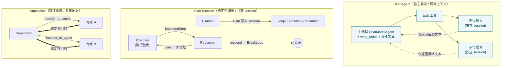
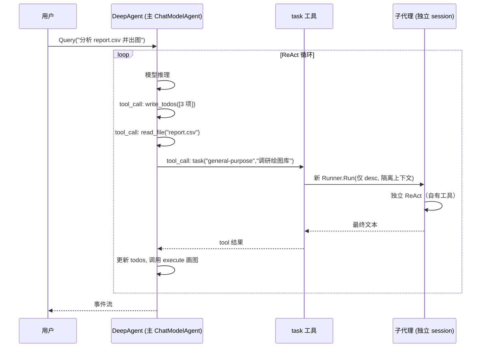
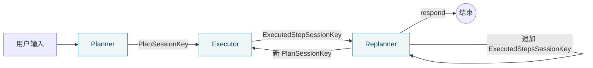

# 第十一篇　多代理预置模式

*作者：Amlei　·　更新时间：2026-08-09*

> `adk/prebuilt` 把社区里三类常见多代理拓扑封装成"开箱即用"的构造器：`deep`（深度自主）、`planexecute`（规划-执行-重规划）、`supervisor`（主管调度）。与之配套的 `adk/filesystem` 定义了统一的文件/Shell 后端协议，让这些代理（尤其是 DeepAgent）具备读写、检索、执行命令的能力。
>
> 需要预先点明的一个贯穿性事实：**三种预置模式并非处于同一推荐等级**。`supervisor` 及其依赖的 workflow 原语（`Sequential`/`Loop`/`Parallel`，见[第九篇·第 9 章](part-09-adk.md#第9章)）在源码里被反复标注 `NOT RECOMMENDED`（`supervisor.go:42`、`workflow.go:622`），官方明确建议改用 `ChatModelAgent + AgentTool` 或 `DeepAgent`。而 `planexecute` 恰恰完全构建在这些"不推荐"的 workflow 原语之上。这是理解三者定位的基调。

---

## 第 1 章　设计目标与拓扑对比

Eino 的 ADK 已经提供了完备的单代理原语（`ChatModelAgent` 的 ReAct 循环、`AgentTool` 把代理包成工具、`SetSubAgents` 的转移拓扑）。但这些原语是"砖块"，要拼出一个能自主拆解任务、委派子代理、跟踪进度的复杂代理，用户仍需自行组装。`prebuilt` 的价值在于把这些"最佳实践拼装"固化为一行 `New(ctx, cfg)`，并内嵌从 DeepAgents 项目与 Claude Code 借鉴的提示词（`deep/prompt.go:21` 的版权声明）。

| 模式 | 解决问题 | 委派机制 | 上下文 | 推荐度 |
|---|---|---|---|---|
| **DeepAgent** | 长任务深度自主 | LLM 自主调用 `task` 工具（底层 `AgentTool`） | 子代理**隔离**（只拿 description，只回最终文本） | 推荐 |
| **Plan-Execute** | 规划与执行分离 | **确定性编排**（Sequential + Loop，无 agent_tool） | 全程**共享 session** | 不推荐（依赖 workflow） |
| **Supervisor** | 集中调度 | **agent 转移**（LLM 主动 transfer + 确定性回转） | 全程**共享对话历史** | 不推荐 |



图注：三种预置多代理拓扑。实线为 LLM 决定的委派/转移，虚线为隔离上下文下的结果回流，双线为确定性回转。深色为推荐路径。

---

## 第 2 章　DeepAgent：深度自主代理

DeepAgent 是 README 重点宣传的模式，其本质是一个**装配了若干"前置注入中间件"的 `TypedChatModelAgent`**。它本身并不实现新的执行引擎，而是复用 adk 的单代理 ReAct 循环，通过中间件（见[第十篇](part-10-middlewares.md)）在代理启动前注入 system prompt 片段、`write_todos` 工具、文件工具集，以及一个把所有子代理收口为单一 `task` 工具的委派层。

### 2.1　构造流程：中间件叠加

入口 `NewTyped`（`deep.go:116`）/ `New`（`deep.go:171`）分三步装配：

1. **内置中间件** `buildTypedBuiltinAgentMiddlewares`（`deep.go:209`）：除非 `WithoutWriteTodos`，注册 `write_todos` 工具；若配置了 `Backend`/`Shell`/`StreamingShell` 之一，构造文件系统中间件（`deep.go:219`）。
2. **task 委派层**（仅当 `!WithoutGeneralSubAgent || len(SubAgents) > 0`，`deep.go:130`）：生成 task 工具中间件追加到 `handlers`。
3. 用最终 `handlers` 构造 `adk.NewTypedChatModelAgent`。

关键的"注入器"是 `typedAppendPromptTool`（`types.go:44`）：它的 `BeforeAgent` 钩子把一段 prompt 追加到 `runCtx.Instruction`，并可选地把一个工具 append 到 `runCtx.Tools`。`write_todos` 和 `task` 两个工具都通过这个包装器变成"既加说明又加工具"的中间件。这是一种轻量的 AOP——不动代理执行逻辑，只在每轮代理启动前改写指令与工具表。

### 2.2　进度跟踪：write_todos 工具

DeepAgent 的"跟踪进度"靠一个会话级的待办列表实现。工具实现（`deep.go:254`）极其简单：把入参 `[]TODO` 写入 session 键 `"deep_agent_session_key_todos"`，再返回一句"已更新待办列表"。真正的"进度跟踪"逻辑全在提示词里：`writeTodosToolDescription`（`prompt.go:173`）用大量 few-shot 示例约束模型——"同时只能有一个 in_progress"、"完成后立即标记 completed"。这是典型的"用提示词编程状态机"手法，工具本身只负责持久化。由于待办列表存在 adk 的 `runSession` 里，它随 checkpoint 持久化（见[第七篇](part-07-tools-interrupt.md)），因而支持长任务的 interrupt/resume。

### 2.3　子代理委派：task 工具的"收口"设计

`task` 工具是 DeepAgent 的核心。它的设计哲学是**收口**：不管注册了多少个子代理，对主代理而言只有**一个**叫 `task` 的工具，参数是 `{subagent_type, description}`（`task_tool.go:140`）。这样主代理的决策维度从"调哪个子代理"降为"调 task 并选类型"，简化了 ReAct 的工具选择空间。

- **默认 general-purpose 子代理**（`task_tool.go:85`）：除非 `WithoutGeneralSubAgent`，自动用主代理同款 model、同款 tools、同款 instruction 创建一个名为 `"general-purpose"` 的 `TypedChatModelAgent`。
- **用户子代理**：对每个 `cfg.SubAgents`，用 `adk.NewTypedAgentTool` 包成 `tool.InvokableTool`。
- **工具描述动态生成**（`task_tool.go:132`）：`Info()` 调用时才拼装描述，把所有子代理的 `name: description` 列表模板化进去。

运行期 `InvokableRun`（`task_tool.go:156`）极其简短：解析 `{subagent_type, description}`，按 type 查表得到对应的 agent-tool，把 description 重新包成 `{"request": description}` 再调用。换言之，`task` 工具是一个**分发器**，真正的子代理执行由底层 `agent_tool`（见[第九篇·第 9 章](part-09-adk.md#第9章)）完成。

### 2.4　子代理的上下文隔离

子代理执行走的是 `adk.NewTypedAgentTool`（`agent_tool.go:107`）→ `typedAgentTool.InvokableRun`（`agent_tool.go:154`）。这里实现了 DeepAgent 的上下文隔离：

- 新建 `bridgeStore`（`agent_tool.go:166`）作为子代理独立的 checkpoint 存储；
- 输入默认**只**是把 `description` 包成一条 user message，**不带主代理对话历史**（除非显式 `WithFullChatHistoryAsInput()`）；
- 用 `newTypedInvokableAgentToolRunner` 起一个**全新的 Runner** 跑子代理；
- 循环消费子代理事件流，但**只把最终消息的文本内容**回给主代理。

**动作作用域**（`agent_tool.go:84`）保证嵌套代理不会越权：子代理发出的 `Exit`/`TransferToAgent`/`BreakLoop` 动作在 agent_tool 边界内被吞掉，**只有 `Interrupted` 经 `CompositeInterrupt` 向上传播**（`agent_tool.go:251`），从而支持跨代理边界的人工介入（见[第七篇·第 2 章](part-07-tools-interrupt.md#第2章)）。

> **一处实现细节（核对确认）**：默认 general-purpose 子代理**并不递归拥有 `task` 工具**——委派默认只有一层：主代理 → 子代理，子代理只能用自己的工具完成任务，不能再向下委派。这降低了循环委派的风险，但也意味着"无限递归委派"需要用户显式构造。

### 2.5　DeepAgent 任务执行时序



图注：DeepAgent 处理长任务时序。write_todos 维护进度，task 工具委派隔离上下文的子代理，主线程只持有最终结果与待办列表。

---

## 第 3 章　Plan-Execute：规划-执行-重规划

`planexecute`（`plan_execute.go`）实现经典的 Plan-Execute-Replan 模式。它**不使用 agent_tool**，而是用 adk 的 workflow 原语（见[第九篇·第 9 章](part-09-adk.md#第9章)）把三个专职代理串成确定性流程。

### 3.1　总体结构

`New`（`plan_execute.go:862`）的装配只有两步：

```go
loop, _ := adk.NewLoopAgent(ctx, &adk.LoopAgentConfig{
    Name: "execute_replan",
    SubAgents: []adk.Agent{cfg.Executor, cfg.Replanner},
    MaxIterations: maxIterations,  // 默认 10
})
return adk.NewSequentialAgent(ctx, &adk.SequentialAgentConfig{
    Name: "plan_execute_replan",
    SubAgents: []adk.Agent{cfg.Planner, loop},
})
```

语义：**Planner 跑一次 → 进入 execute_replan 循环，循环里 Executor 先跑、Replanner 后跑，直到 Replanner 选择 `respond` 或达到 MaxIterations。** 循环的退出依赖 `BreakLoopAction`：Replanner 在判定任务完成时发出 `adk.NewBreakLoopAction`，`runLoop` 收到该动作时退出。

### 3.2　三个专职代理与共享 session

- **Planner**（`plan_execute.go:437` 构造）：用 `compose.NewChain` 串成"格式化 PlannerPrompt → ChatModel → 收集流 → 解析为 Plan"。支持两种结构化输出方式：`ChatModelWithFormattedOutput`（模型直接吐结构化 JSON）或 `ToolCallingChatModel + ToolInfo`（强制工具调用 `plan`，`ToolChoiceForced`）。Plan 解析后写入 session `PlanSessionKey`。
- **Executor**（`:510`）：本质是 `adk.NewChatModelAgent`。它的 `GenModelInput` 从 session 读 Plan/UserInput/ExecutedSteps，格式化 `ExecutorPrompt`，指示"执行计划的**第一步**"。关键设计：Executor 每轮**只执行一步**，结果写回 session。
- **Replanner**（`:807` 构造）：同样是 `compose.Chain`。它先把刚执行的步追加到 `ExecutedSteps`，再格式化 `ReplannerPrompt`。模型被强制在两个工具间二选一（`ToolChoiceForced`）：调 `respond` → 视为任务完成、退出循环；调 `plan` → 解析新计划写入 session、循环继续。

与 DeepAgent 的隔离不同，planexecute 的三个代理**共享同一 session**（由转移机制保证）。状态通过四个会话键流转（`:241`）：`UserInputSessionKey`、`PlanSessionKey`、`ExecutedStepSessionKey`（最近一步结果）、`ExecutedStepsSessionKey`（累积）。这种"黑板"架构让 Replanner 能看到全部历史步骤结果，但代价是上下文随步数线性增长，且没有任何隔离。



图注：Plan-Execute 的共享 session 数据流。所有阶段读写同一组会话键（深色），Replanner 兼任"反思+重规划"。这是一种把控制流和数据流都压进提示词的极简实现。

---

## 第 4 章　Supervisor：集中调度（不推荐）

`supervisor`（`supervisor.go`）实现"主管-专家"层级：一个 Supervisor 代理协调多个专家子代理，子代理之间不能直接通信，只能回到 Supervisor。

### 4.1　构造：确定性回转

`New`（`supervisor.go:101`）做两件事：每个子代理被 `AgentWithDeterministicTransferTo`（见[第九篇·第 9 章](part-09-adk.md#第9章)）包了一层——子代理正常跑完后，**自动追加一个 `TransferToAgent(supervisor)` 动作**（`deterministic_transfer.go:139`）。这保证了"专家完工必回主管"的闭环，无需 LLM 记得回转。正向路由（Supervisor → 专家）则**靠 LLM 决定**。因此 Supervisor 的路由是"前向 LLM 自主、反向确定性"的混合。

### 4.2　全上下文共享与为何不推荐

与 DeepAgent 的 agent_tool 隔离相反，Supervisor 基于 `SetSubAgents`（`flow.go:75`）的**转移机制**，转移时**整个对话历史在代理间流动**（默认 `historyRewriter`）。这意味着专家能看到 Supervisor 此前的全部对话，反过来也容易上下文爆炸。`supervisorContainer`（`supervisor.go:53`）是一个纯委托包装器，使整个 Supervisor 结构在回调/追踪层面呈现为**单一 trace 根**。

源码在 `Config`、`New`、以及底层 `SetSubAgents`/`AgentWithDeterministicTransferTo`/workflow 原语处反复标注 `NOT RECOMMENDED`，理由是"代理转移 + 全上下文共享在经验上并未证明更有效"。

---

## 第 5 章　文件系统能力

文件系统能力分两层：`adk/filesystem` 定义**协议接口**，`adk/middlewares/filesystem`（见[第十篇·第 3 章](part-10-middlewares.md#第3章)）把接口**实例化为代理工具**。

### 5.1　Backend 接口

`Backend`（`backend.go:243`）是可插拔的统一后端协议：`LsInfo`/`Read`/`GrepRaw`/`GlobInfo`/`Write`/`Edit` 六个方法；可选扩展 `MultiModalReader`（实现后支持以结构化 `FileContentPart` 返回图片/PDF）；旁路的 `Shell`/`StreamingShell` 接口把"执行命令"能力从文件读写中解耦。`EditRequest`（`:161`）的语义与 Claude Code 的 Edit 工具一致：`OldString` 必须非空、`NewString` 必须不同、`ReplaceAll` 为假时若多处匹配则失败。`GrepRequest`（`:88`）仿 ripgrep 语法。

### 5.2　InMemoryBackend：参考实现

`InMemoryBackend`（`backend_inmemory.go:36`）是 `map[string]*fileEntry` + `sync.RWMutex` 的内存实现。值得注意的实现点：**并行 grep**（候选文件多于 1 时开 worker 池，上限 10）；**ripgrep 风格 filetype 映射**（内置 70+ 语言到扩展名的映射表）；**上下文行**按文件分组、去重重叠行号区间；**行级 Read**（1-based offset、按 `\n` 扫描定位，避免读超大文件时全量切分）。

### 5.3　大工具结果卸载（一处实现落差）

`large_tool_result.go` 实现上下文膨胀缓解：当工具结果 token 数超阈值（默认 20000），把结果写入 Backend，只把指针回给模型。

> **一处实现落差（核对标注，文档未提）**：该卸载能力**只在已废弃的 `NewMiddleware` 里被接线**（`filesystem.go:210`，struct-based `AgentMiddleware`），而推荐的 `NewTyped`/`New`（DeepAgent 实际使用的构造器，`deep.go:220`）**并未挂载 `WrapToolCall`**。因此 DeepAgent 默认拿不到大结果卸载，对易爆的 grep/read 结果缺少自动保护——这是阅读代码才能发现的限制。

---

## 第 6 章　多代理协作：两种委派范式

Eino 的多代理协作存在两条技术路线，预置模式分别选用其一：

**A. agent_tool 自主委派（DeepAgent）**：子代理被 `adk.NewTypedAgentTool` 包成普通工具，主代理在 ReAct 循环里像调普通工具一样调它。子代理在**独立 checkpoint、隔离上下文**里跑，只回最终文本。委派决策完全由 LLM 自主。动作作用域保证子代理的动作不外溢。

**B. agent 转移（Supervisor / workflow）**：用 `SetSubAgents` 建立父子拓扑，代理间通过 `TransferToAgent` 动作移交控制。**全对话历史随转移流动**。可叠加确定性转移强制回转。被官方标注"不推荐"。

控制与数据传递的方式因此不同：DeepAgent 控制经 tool_call 传递（同步），数据经"工具返回值"单向回流（仅最终文本）；Plan-Execute 控制经确定性 Sequential/Loop 编排，数据经共享 session 的会话键；Supervisor 控制经转移动作，数据经共享对话历史。

---

## 第 7 章　为何如此设计：权衡的总账

1. **LLM 自主委派 vs 确定性编排**：DeepAgent 选前者（灵活、可并行，但行为不可预测、依赖提示词质量）；Plan-Execute 选后者（流程清晰、易追踪，但僵化——每轮只走一步、重规划依赖模型判断）；Supervisor 是混合体（前向自主、反向确定）。
2. **上下文隔离 vs 共享**：隔离（DeepAgent）好处是控制上下文规模、子任务可并行、错误局部化；代价是子代理看不到主线程、需在 description 里把意图讲清。共享（Plan-Execute/Supervisor）好处是信息完整；代价是上下文线性增长、易爆炸。Eino 用 summarization 中间件（[第十篇·第 3 章](part-10-middlewares.md#第3章)）和大结果卸载缓解，但后者未在 DeepAgent 默认接线。
3. **task 工具的收口设计**：DeepAgent 把所有子代理收口为单一 `task` 工具，主代理决策维度从"调哪个子代理"降为"调 task 并选类型"，简化 ReAct 工具选择空间。
4. **进度跟踪靠"提示词编程状态机"**：DeepAgent 的 `write_todos` 工具本身只持久化，状态机逻辑全在提示词里。Plan-Execute 的进度即 `ExecutedSteps`。两者都把"状态"压进 session 而非外部存储，简化实现但要求 session 可序列化。
5. **委派默认不递归**：DeepAgent 的 general-purpose 子代理不递归拥有 `task` 工具，从结构上避免无限递归委派。
6. **三种模式推荐等级显著不同**：DeepAgent 是当前推荐路径；planexecute/supervisor 依赖被标注 NOT RECOMMENDED 的 workflow/转移原语，应审慎采用。

> **一处重要校正（README 夸大 DeepAgent 能力）**：`README.md:90` 称 DeepAgent 能 "run shell commands, execute Python code, and search the web"。代码核对确认：DeepAgent 内建的唯一"执行类"工具是 `execute`（通过 `Shell`/`StreamingShell` 字段注册，跑的是用户提供的 Shell 实现），**并无内建 `pythonTool` 或 `webSearchTool`**。Python 代码只能通过 `execute(command="python …")` 间接跑，Web 搜索则需用户自行在 `ToolsConfig.Tools` 提供工具。`README.md:81` 的示例 `Tools: []tool.BaseTool{shellTool, pythonTool, webSearchTool}` 里，`pythonTool`/`webSearchTool` 在仓库里并不存在。此外 README 未提示 planexecute/supervisor 依赖"不推荐"原语，把三者并列展示，未传达这一重要定位差异。

---

*第十一篇完。下一篇进入内部通用机制与 Go 泛型应用——支撑全框架的"管道层"如何用泛型与反射的边界划分、`UnboundedChan`/`concat`/`merge` 原语如何被复用、自研类型标签序列化引擎如何支撑 checkpoint 持久化。*
