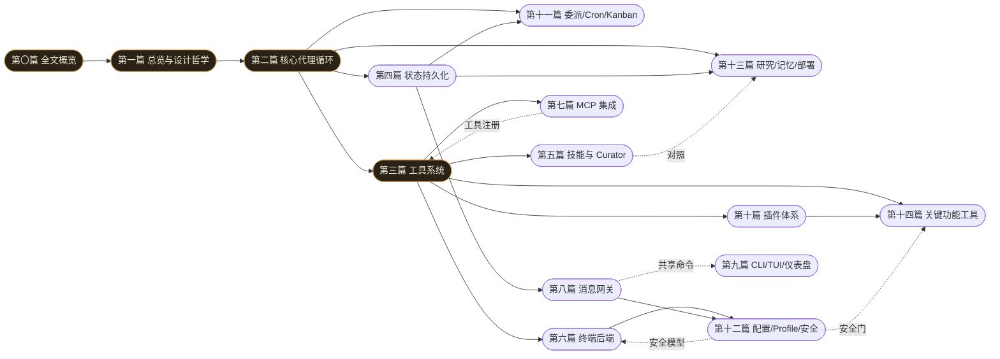

# Hermes Agent 源码剖析：设计思想、实现机制与实现原理

**第〇篇　全文概览**

*作者：Amlei　·　更新时间：2026-08-08*

> 本篇是全书的入口。它不谈任何一行具体代码，而是回答四个问题：**这本书写给谁、它讲什么、怎么读、需要先知道什么**。如果你是该方向的学习者，请先读完本篇的「读者指南」与「概念入门」两节——它们是后续十四篇密集实现描述的"释疑底座"，旨在避免作者因为熟悉这些概念而默认你也熟悉（即所谓"知识诅咒"）。

---

## 序言

Hermes Agent 是由 Nous Research 构建的、以"自我改进"为核心卖点的通用 AI 代理框架，源码体量约 80 万行 Python。本书不是它的使用手册，而是反过来追问一件事：**这套系统是如何被造出来的**。

全书以**第三人称客观视角**撰写，从**设计思想、实现机制、实现原理**三个维度，按「篇 / 章 / 节」的书籍层级，逐子系统地深挖。每一处关键机制都标注 `文件:行号`，可作代码导航的索引；每一篇结尾有"权衡总账"，把分散在正文里的设计取舍收束成几条论断。

本书力求**详略得当**：对核心/关键机制（同步会话循环、工具注册与分发、FTS5 会话库、技能 Curator、多终端后端、双向 MCP、双消息守卫、委派/Cron/Kanban、OS 安全边界、内置浏览器与 preview、语音…）给予专章深挖；对边缘或产品化的部分（计费、relay、特定平台怪癖）只点到为止。若干处特别标注了与项目既有文档（如自带 CLAUDE.md）的出入——例如核心循环已被模块化迁移到 `agent/conversation_loop.py`、cron 的"硬中断"实为 600s 非活动超时——这些勘误是力求精确的体现。

---

## 一、读者指南

### 1.1　这本书写给谁

主要面向**该方向的学习者**：正在学习"如何构建一个生产级 AI 代理框架"的工程师，或正在自建代理系统、想借鉴成熟模式的设计者。作者**无法假设你的知识深度与广度**——因此本篇第二节「概念入门」专门为不熟悉某些术语的读者准备了学习者级的解释；后续正文中出现这些概念时，会以"概念见第〇篇·X"的方式回指。

### 1.2　如何阅读

- **自顶向下（推荐）**：先读本篇（尤其概念入门与关系图），再按篇顺序读。[第一篇](part-01-overview.md)建立全局观，第二、三两篇的循环与工具是两大基石，其后各篇可视为对能力层与编排层的展开。
- **按主题跳读**：若只关心某一子系统（如"gateway 如何把一条 Telegram 消息路由进代理循环"），直接跳至[第八篇](part-08-gateway.md)，并按其内部交叉引用回指第二、三篇。
- **导航锚点**：[第一篇](part-01-overview.md)第 3.2 节的"端到端数据流"序列图是全书最重要的导航锚点——后续每一篇都是在该序列图的某一框内"放大"。

### 1.3　详略原则与体例

- 每章结尾的"**为何如此设计：权衡的总账**"是该章最值得反复回看的部分。
- 配图：复杂关系用 **Mermaid**（架构图、状态机、时序图、ER 图、依赖图），简单示意用 **ASCII**。
- 交叉引用：章与章之间的关系在正文中以"（见第 X 篇·Y 章）"标注；本篇第四节的"章节关系图"给出全局依赖。
- 释疑：需要展开的背景知识，在正文中以"知识补充"框给出，或回指本篇概念入门。

---

## 二、概念入门（释疑底座）

> 下列概念在全书反复出现。如果你已熟悉某条，跳过即可；若不熟，这里的解释足够你读懂正文——它们不是严谨定义，而是"够用的直觉"。每条标注了**主要出现于**哪一篇，便于回查。

**1. AI 代理与代理循环（agent loop）　·　主要出现于：[第二篇](part-02-core-loop.md)**
AI 代理不是"一次问答"，而是一个**循环**：接收用户消息 → 调用模型 → 若模型要求调用工具则执行工具并把结果送回模型 → 再调用模型 → ……直到模型给出不再需要工具的最终回答。这个"模型↔工具"的往复就是代理循环。理解 Hermes 的关键，就是理解这个循环如何被组织、如何被中断、如何被压缩。

**2. 工具调用 / function calling　·　主要出现于：第二、三篇**
现代大模型可以不直接"说话"，而是输出一个**结构化的工具调用请求**（形如 `{"name":"web_search","args":{"query":"..."}}`）。宿主程序（Hermes）拦截这个请求、真正去执行（比如联网搜索）、再把结果作为新消息喂回模型。模型 thus 能够"行动"——读文件、跑命令、上网。Hermes 用的是 **OpenAI 风格的 function-calling 协议**。

**3. token 与上下文窗口（context window）　·　主要出现于：[第二篇](part-02-core-loop.md)（压缩）**
模型每次调用的输入有**大小上限**，以 token 计（粗略地：1 token ≈ 4 个英文字符 ≈ 0.5–1 个汉字）。一轮对话积累的消息越多，越接近上限。超出则必须**压缩**（见[第二篇](part-02-core-loop.md)第 6 章）。"上下文窗口"就是这一上限。

**4. 提示缓存 / prefix cache / KV cache　·　主要出现于：[第二篇](part-02-core-loop.md)（缓存纪律）、贯穿全书**
模型在生成回答前，要把整段输入"读"一遍，计算每个 token 的 Key/Value 张量（KV）。如果两次调用的**开头部分完全相同**，这部分 KV 可以**缓存复用**，大幅降低延迟与成本——这就是 prefix cache。正因如此，Hermes 有条铁律：**一次会话进行中绝不修改过去上下文**（否则缓存前缀变了，每次都要全量重算）。这条纪律塑造了系统提示的逐字缓存、技能以用户消息注入、预填充的临时性等大量设计。

**5. OpenAI 兼容 API　·　主要出现于：[第二篇](part-02-core-loop.md)、[第十篇](part-10-plugins.md)**
OpenAI 的 Chat Completions 接口成了事实标准：消息是 `{role, content}` 列表（role ∈ system/user/assistant/tool）。绝大多数模型供应商都提供"长得像 OpenAI"的接口。Hermes 内部统一用这套格式，从而能接任意供应商。

**6. transport 适配（传输层转换）　·　主要出现于：[第二篇](part-02-core-loop.md)**
并非所有供应商都真的用 OpenAI 协议（Anthropic、Google、Bedrock 各有原生协议）。Hermes 在**调用 API 的边界**做一次格式转换：内部始终用 OpenAI 格式，临到发出时由 transport 翻译成目标供应商的原生协议。这样核心循环无须为每家供应商写特殊逻辑。

**7. 同步循环 + 异步桥接（asyncio、事件循环）　·　主要出现于：[第二篇](part-02-core-loop.md)、[第三篇](part-03-tools.md)**
Python 有两种写法：同步（一行一行阻塞执行）和异步（`async/await`，在一个"事件循环"里并发处理多个 IO）。Hermes 的主循环**刻意是同步的**，因为控制流线性、易推理；但很多工具（联网、调 SDK）天然是异步的。于是有一个"桥"：同步代码通过一个常驻的异步事件循环去跑异步工具，再把结果取回来。**为什么不全程异步**：因为控制平面（中断、预算、压缩）的状态在单线程同步循环里最容易写对。

**8. 进程 vs 线程、GIL　·　主要出现于：第二、六、十三篇**
- **进程**是独立的程序实例，内存隔离；**线程**是进程内的并发执行流，共享内存。
- Python 的 **GIL**（全局解释器锁）使同一进程内多个线程无法真正并行执行 Python 字节码（IO 等待时仍可切换）。故 CPU 密集的并行要用多**进程**（如批量轨迹生成用 `multiprocessing.Pool`），IO 密集可用多线程或异步。

**9. 子进程 / 守护进程 / 孤儿进程　·　主要出现于：[第六篇](part-06-terminal.md)（终端）、[第七篇](part-07-mcp.md)（MCP）**
Hermes 经常需要"在另一个程序里干活"——跑 shell 命令、起一个浏览器、起一个 MCP 服务器。这些被 **spawn** 出来的程序是**子进程**；在后台长期运行的叫**守护进程**（daemon）；父进程死了却没被清理的子进程叫**孤儿进程**（需要看门狗或孤儿回收机制处理，见[第七篇](part-07-mcp.md)的"父死亡看门狗"）。

**10. SQLite、FTS5、WAL　·　主要出现于：[第四篇](part-04-state.md)**
- **SQLite**：一个单文件、零运维、嵌在进程内的数据库。Hermes 用它存全部对话历史。
- **FTS5**：SQLite 的全文搜索扩展，建倒排索引，支持 BM25 排序与高亮——让代理能"搜自己过去的对话"。
- **WAL**（Write-Ahead Logging）：SQLite 的一种并发模式，**读不阻塞写、写不阻塞读**，适合多线程/多进程并发访问同一库。

**11. SSRF（服务器端请求伪造）与 OS 安全边界　·　主要出现于：[第十二篇](part-12-config-security.md)、[第十四篇](part-14-feature-tools.md)**
- **SSRF**：攻击者诱使服务器去访问它本不该访问的内部地址（如云元数据端点 `169.254.169.254`，可偷实例凭据）。Hermes 在所有"代理替你联网"的地方都要拦私网/元数据 IP。
- **OS 安全边界**：项目反复强调，对抗性模型**唯一真正的隔离边界是操作系统**（容器、文件权限）；进程内的各种"审批门、扫描器"只是事故预防，不是安全边界。这条认知贯穿终端后端、MCP、技能安装等设计。

**12. 插件 / ABC（抽象基类）/ 注册表　·　主要出现于：[第三篇](part-03-tools.md)、[第十篇](part-10-plugins.md)**
- **ABC**（Abstract Base Class）：定义"某类东西必须实现哪些方法"的抽象接口（如"所有图像生成后端都要有 `generate()`"）。
- **注册表**：一个进程级的中央字典，记录"名字 → 实现"。每个插件在导入时把自己登记进注册表。
- 这样就能在不改核心代码的前提下加新后端——只要实现 ABC 并注册即可。Hermes 的工具、模型供应商、记忆后端、图像/视频/语音 provider 都用这套模式。

**13. toolset（工具集）　·　主要出现于：[第三篇](part-03-tools.md)**
工具被分成命名的**组**（如 `web`、`terminal`、`browser`、`messaging`）。代理看到的不是全部工具，而是按平台/配置启用的某些 toolset。这是"工具存在"与"工具可见"的解耦。

**14. MCP（Model Context Protocol）　·　主要出现于：[第七篇](part-07-mcp.md)**
一个让"模型宿主"与"外部工具服务器"互通的**标准协议**。Hermes 既能作为**客户端**消费任意外部 MCP 服务器（把它的工具当作原生工具调用），也能作为**服务器**把自己的能力暴露给别的宿主（如 IDE）。

**15. CDP（Chrome DevTools Protocol）与无障碍树　·　主要出现于：[第十四篇](part-14-feature-tools.md)**
- **CDP**：Chrome 暴露的调试协议，外部程序可经它驱动 Chrome（导航、点击、取 DOM、截图）。
- **无障碍树 / accessibility tree / aria**：浏览器为辅助技术（屏幕阅读器）维护的页面**语义结构**（按钮、链接、输入框各是什么、叫什么）。Hermes 把这棵树以文本形式喂给模型，并用 `@e1` 这样的 ref 标识元素——模型据此"看懂"页面并操作，无需视觉能力。

**16. MoA（Mixture of Agents，代理混合）　·　主要出现于：[第二篇](part-02-core-loop.md)、[第十篇](part-10-plugins.md)**
一种用多个模型分别作答、再聚合（择优/综合）以提升质量的技术。Hermes 内置了 MoA 支持（虚拟 provider + aggregator）。

**17. Profile（多实例隔离）　·　主要出现于：[第十二篇](part-12-config-security.md)**
Hermes 支持多个完全隔离的实例（profile），每个有独立的配置、密钥、记忆、会话、技能。核心机制是在任何模块导入**之前**设定 `HERMES_HOME` 环境变量，使所有路径解析都落在正确实例上。

**18. 辅助模型（auxiliary / side-LLM）　·　主要出现于：[第二篇](part-02-core-loop.md)、[第十篇](part-10-plugins.md)、[第十三篇](part-13-research-deploy.md)**
除"主聊天模型"外，Hermes 还会用**另一个（通常更便宜/更快的）模型**干副业：生成会话标题、压缩上下文、做视觉描述、改写查询。这些副业各有独立的配置槽（`auxiliary.<task>`）。

**19. reasoning / 推理 token　·　主要出现于：[第二篇](part-02-core-loop.md)**
部分模型在给出可见回答前，会先产生一段"内心独白"（链式思考）。Hermes 把它单独存于 `assistant_msg["reasoning"]`，用于多轮推理连续性与训练数据，但不当作可见输出。

**20. Mermaid / ASCII 图　·　贯穿全书**
Mermaid 是一种用文本描述图表、由阅读器渲染成图的小语言（流程图、时序图、状态机、ER 图）。ASCII 图是直接用字符画的示意图。本书复杂关系用 Mermaid，简单示意用 ASCII。

---

## 三、总目录（含关系引用）

> 每篇给出：一行主旨、**前置**（读这篇前最好先读哪篇）、**延伸**（这篇被谁引用/相关）。关系汇总见第四节"章节关系图"。

### 第一篇　总览与设计哲学（[`part-01-overview.md`](part-01-overview.md)）
项目定位、八条核心设计决策、整体架构、代码地图与依赖链。**前置**：本篇（第〇篇）。**延伸**：全书各篇均建立在其架构图之上。

### 第二篇　核心代理循环（[`part-02-core-loop.md`](part-02-core-loop.md)）
`AIAgent` 同步循环、系统提示缓存纪律、上下文压缩、四档中断语义、流式、预算与凭据池。**前置**：[第一篇](part-01-overview.md)。**延伸**：被第三、四、八、九、十一、十三篇反复引用——它是全书的"主线剧情"。

### 第三篇　工具系统（[`part-03-tools.md`](part-03-tools.md)）
自注册 registry、AST 自动发现、七步分发流水线、异步桥接、toolset 曝光、跨 provider schema 修复、agent 级工具拦截。**前置**：[第二篇](part-02-core-loop.md)。**延伸**：[第七篇](part-07-mcp.md)（MCP 工具注册进同一 registry）、[第十篇](part-10-plugins.md)（插件注册工具）、[第十四篇](part-14-feature-tools.md)（功能工具皆经此分发）。

### 第四篇　状态与会话持久化（[`part-04-state.md`](part-04-state.md)）
SessionDB（SQLite）、三套 FTS5 索引、非破坏式压缩、压缩链、WAL 并发、可移植性。**前置**：[第二篇](part-02-core-loop.md)。**延伸**：被[第八篇](part-08-gateway.md)（网关会话）、[第十一篇](part-11-orchestration.md)（cron/kanban 会话）、[第十三篇](part-13-research-deploy.md)（记忆/批量）引用。

### 第五篇　技能系统与 Curator（[`part-05-skills.md`](part-05-skills.md)）
技能作为过程记忆、Footprint Ladder、缓存友好的 USER 消息注入、多层写守卫、Curator 自治状态机。**前置**：第二、三篇。**延伸**：与[第十三篇](part-13-research-deploy.md)记忆系统（陈述性 vs 过程性）对照。

### 第六篇　终端执行与多后端环境（[`part-06-terminal.md`](part-06-terminal.md)）
七大执行后端、spawn-per-call + 会话快照、有界输出采集、三层危险命令审批、后台进程通知。**前置**：[第三篇](part-03-tools.md)。**延伸**：与[第十二篇](part-12-config-security.md)（安全/OS 边界）紧密相关。

### 第七篇　MCP 集成（[`part-07-mcp.md`](part-07-mcp.md)）
双向协议、专用事件循环、stdio/http 传输、父死亡看门狗、MCP→registry 桥接、Sampling、OAuth 三层。**前置**：[第三篇](part-03-tools.md)。**延伸**：MCP 工具复用[第三篇](part-03-tools.md)的 registry 与分发。

### 第八篇　消息网关与平台适配（[`part-08-gateway.md`](part-08-gateway.md)）
单进程多平台、session_key 路由、**两道消息守卫**、中断/queue/steer、scoped 凭据锁、三十二个适配器。**前置**：第二、四篇。**延伸**：与[第九篇](part-09-cli-tui.md)（共享命令注册表）、[第十二篇](part-12-config-security.md)（DM 配对/隔离）关联。

### 第九篇　CLI、TUI 与仪表盘（[`part-09-cli-tui.md`](part-09-cli-tui.md)）
中央 COMMAND_REGISTRY 扇出、`_apply_profile_override` 启动链、三路 config 加载器、TUI 进程模型、**嵌入真实 TUI 而非 React 重写**、四种聊天表面、ACP 适配器。**前置**：第二、三篇。**延伸**：与[第八篇](part-08-gateway.md)共享斜杠命令注册表。

### 第十篇　插件体系与提供者（[`part-10-plugins.md`](part-10-plugins.md)）
三套并行发现系统、ProviderProfile、ctx 生命周期 API、memory/context-engine/image-gen 插件、封闭集合政策。**前置**：[第三篇](part-03-tools.md)。**延伸**：插件注册的工具/provider 经[第三篇](part-03-tools.md) registry 与各能力域 ABC；与[第十四篇](part-14-feature-tools.md)共享 provider 模式。

### 第十一篇　委派、Cron 与 Kanban（[`part-11-orchestration.md`](part-11-orchestration.md)）
`delegate_task` 进程内并行、`_last_resolved_tool_names` 保存/恢复、异步委派、Cron tick loop 与非活动超时、Kanban board/tenant/dispatcher。**前置**：第二、四篇。**延伸**：委派复用[第二篇](part-02-core-loop.md)子代理生成；cron/kanban 会话入[第四篇](part-04-state.md) DB。

### 第十二篇　配置、Profile 与安全（[`part-12-config-security.md`](part-12-config-security.md)）
profile 感知路径、`_apply_profile_override`、三路 config 加载、迁移梯、命令审批三层防御、Tirith、路径/URL/凭据安全、供应链锁定、DM 配对、fail-closed。**前置**：[第六篇](part-06-terminal.md)（终端安全）。**延伸**：安全模型被第六、七、八篇引用。

### 第十三篇　研究、记忆与部署（[`part-13-research-deploy.md`](part-13-research-deploy.md)）
运行时即训练时、batch_runner、trajectory_compressor、ACP 适配器、打包部署、记忆系统（MemoryProvider ABC、memory_tool、nudge、Honcho 辩证式建模、query_rewrite）。**前置**：第二、四、十篇。**延伸**：记忆与[第五篇](part-05-skills.md)技能（陈述性 vs 过程性）成对。

### 第十四篇　关键功能工具的实现（[`part-14-feature-tools.md`](part-14-feature-tools.md)）
内置浏览器（`browser_*` 自动化）与预览面板（`open_preview` 等）、网页搜索/抓取、视觉、图像/视频生成、语音 TTS/STT，以及横贯所有功能工具的共同骨架。**前置**：第三、十、十二篇。**延伸**：功能工具皆经[第三篇](part-03-tools.md)分发、经[第十二篇](part-12-config-security.md)安全门、经[第十篇](part-10-plugins.md) provider 模式。

---

## 四、章节关系图

下图给出各篇之间的**主要依赖与引用关系**（箭头 A→B 表示"A 是 B 的前置/被 B 引用"）。它既是阅读顺序的参考，也是全书结构的速览。



**三条推荐阅读路径（ASCII）**：

```
理解核心运行时：     ① → ② → ③ → ④           （循环 · 工具 · 状态）
理解交互与多平台：   ② → ⑧ → ⑨ → ⑫           （循环 · 网关 · 前端 · 安全）
理解能力扩展：       ③ → ⑦ → ⑩ → ⑭           （工具 · MCP · 插件 · 功能工具）
```

---

## 五、贯穿全书的六条主线

理解以下六条主线，就理解了 Hermes 为何在每一处细节上都做出了那些看似繁琐、实则一致的选择。

1. **同步控制平面 + 异步数据平面**。核心循环刻意同步，异步被严格隔离到工具执行层，通过持久事件循环桥接。主线见于[第二篇](part-02-core-loop.md)（循环）、[第三篇](part-03-tools.md)（工具分发）、[第七篇](part-07-mcp.md)（MCP）、[第十一篇](part-11-orchestration.md)（委派）。
2. **缓存纪律作为硬约束**。"提示缓存不可破坏"被写入政策：系统提示逐字缓存、技能以用户消息注入、预填充临时、消息比特级规范化。主线贯穿第二、三、五篇。
3. **注册与曝光的解耦**。无论工具（registry + toolset）、命令（COMMAND_REGISTRY + busy_policy）、插件（manifest + enabled）、平台（platform_registry + config），都把"声明存在"与"决定可见"分成两个正交步骤。主线贯穿第三、九、十篇。
4. **Fail-closed 的默认姿态**。OS 是唯一安全边界，进程内启发式是事故预防层，但每道进程内门都以 fail-closed 为默认。主线贯穿第六、十二篇。
5. **可恢复性优先于简洁性**。技能永不删除只归档、会话非破坏式压缩、cron/kanban 倾向 at-most-once、background delegate 显式声明不抗重启。主线贯穿第四、五、十一篇。
6. **运行时即训练时数据**。同一套 AIAgent 与同一份序列化器既驱动在线推理也产出训练数据。主线收束于[第十三篇](part-13-research-deploy.md)。

---

*第〇篇完。从这里出发，进入[第一篇](part-01-overview.md)「总览与设计哲学」。*
