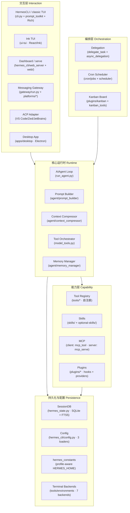
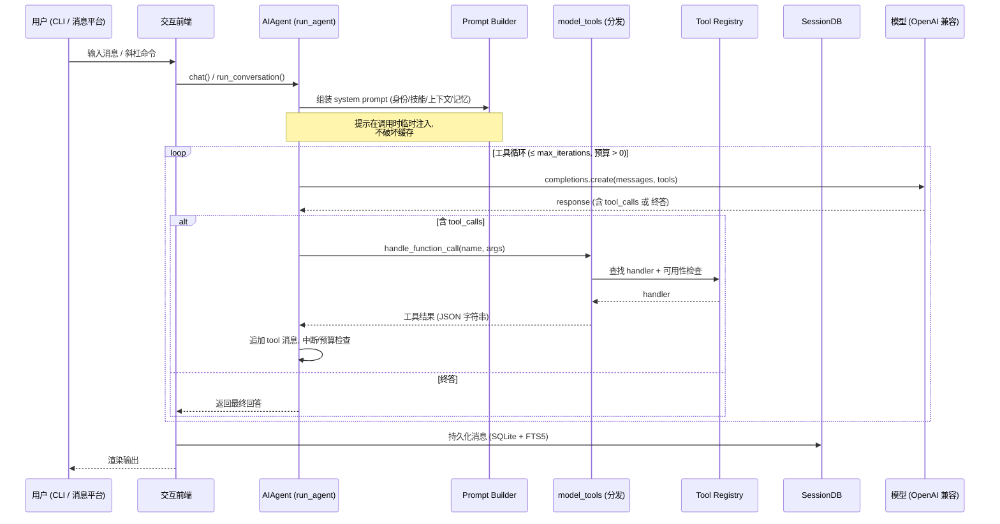

# 第一篇　总览与设计哲学

*作者：Amlei　·　更新时间：2026-08-08*

> 本篇面向全书奠基：它先回答"Hermes 是什么、不是什么"，再提炼出贯穿全项目的若干核心设计决策，最后给出一张可在后续每一篇中被反复回指的整体架构图与代码地图。阅读本篇之后，读者应当能够在不进入任何具体实现细节的前提下，建立起对整个系统形态、边界与运行方式的正确心智模型。

---

## 第 1 章　项目定位

### 1.1　一句话定义与延展

Hermes Agent 是由 Nous Research 构建的、以"自我改进（self-improving）"为核心卖点的通用 AI 代理框架。在项目自身的叙述中，它被概括为一句话：

> The self-improving AI agent built by Nous Research.

这句话中的"self-improving"并非营销修辞，而是对应一组可在代码中逐一指认的机制。具体而言，Hermes 在运行过程中会：

1. **从经验中创造技能**——在完成复杂任务后，代理可自主将其操作流程沉淀为一份结构化的技能文件（Skill），写入 `~/.hermes/skills/`；
2. **在使用中改进技能**——技能被视作"过程记忆（procedural memory）"，可被代理自身在后续调用中编辑、补丁、扩展；
3. **自我提醒以固化知识**——通过周期性"提示（nudge）"机制，代理会主动把值得长期保留的信息写入持久记忆；
4. **检索自身的历史对话**——所有会话被持久化进 SQLite 并建立 FTS5 全文索引，代理可跨会话检索自己的过去；
5. **逐步加深对用户的理解**——通过 Honcho 辩证式用户建模（dialectic user modeling）等记忆后端，在多个会话之间累积用户画像。

这五点共同构成项目自称的"闭环学习回路（closed learning loop）"。本书后续多篇（尤其是[第五篇](part-05-skills.md)"技能系统"与[第十三篇](part-13-research-deploy.md)"记忆系统"）将对其中每一环进行代码级的拆解。

### 1.2　形态与运行边界

与许多"绑定在开发者笔记本上"的代理不同，Hermes 的设计目标是**与具体硬件解耦**。它被显式地声明可以运行在：

- 一台 5 美元的 VPS 上；
- 一个 GPU 集群上；
- 一套"空闲时几乎不花钱"的无服务器（serverless）基础设施上。

这一目标直接决定了[第六篇](part-06-terminal.md)将要详述的"多后端终端环境"抽象——同一套终端工具，可以在本地、Docker、SSH、Singularity、Modal、Daytona、Vercel Sandbox 七种后端上执行，其中 Modal 与 Daytona 还提供"空闲时休眠、按需唤醒"的无服务器持久化。

与之配套的是**"在你所在之处生活（lives where you do）"**的多入口形态：用户既可以通过本地终端 TUI 与之交互，也可以通过 Telegram、Discord、Slack、WhatsApp、Signal、Email 等消息平台与之对话，而这些平台全部由同一个 gateway 进程统一支撑。语音备忘录转写、跨平台会话延续等能力亦内建于其中。

### 1.3　研究就绪（research-ready）

Hermes 并非纯粹的终端用户产品。项目同时面向研究场景，提供：

- **批量轨迹生成（batch trajectory generation）**——`batch_runner.py` 支持大规模并行地跑通代理对话；
- **轨迹压缩（trajectory compression）**——`trajectory_compressor.py` 将运行轨迹压缩为可用于"训练下一代工具调用模型"的训练数据。

这一点在第 1.4 节的设计决策中将进一步体现为"将运行时与训练时视为同一份数据的两个面"的取向。

---

## 第 2 章　核心设计决策

本节提炼出贯穿全项目的若干**有意为之的设计决策**，并解释每一条决策背后的动因。这些决策并非孤立存在，它们之间相互约束、相互成就，理解它们是理解后续每一篇实现机制的前提。

### 2.1　同步主循环 + 异步桥接

这是全项目最关键、也最容易被忽视的一条决策。Hermes 的核心会话循环（`AIAgent.run_conversation()`）是**完全同步的**。在循环内部，LLM 调用、工具调用、消息追加都以阻塞方式顺序执行。然而，许多工具处理器（尤其是基于 `httpx`、`AsyncOpenAI` 等异步客户端的工具）天然是异步的。

Hermes 的解法不是把整个循环改成 `async`，而是引入一层**异步桥接**：在 `model_tools.py` 中维护若干持久的事件循环（`_run_async()`），用于在同步上下文中调度异步协程，并复用已缓存的异步客户端。这样做的收益是：

- 控制流保持线性、可读、易于插入中断检查与预算检查；
- 异步客户端的连接池得以跨调用复用，避免每次工具调用都重建 `httpx`/`AsyncOpenAI` 实例带来的性能损耗。

代价是同步/异步边界处需要额外的桥接胶水，以及若干"全局事件循环"带来的生命周期管理负担。该权衡的完整实现见[第二篇](part-02-core-loop.md)第 2 章。

### 2.2　OpenAI 兼容的提供者抽象

Hermes 不与任何单一模型供应商绑定。其运行时假定所有推理后端都暴露**与 OpenAI Chat Completions 兼容的接口**（`client.chat.completions.create(model=…, messages=…, tools=…)`）。在此假设之上，项目通过 `plugins/model-providers/` 下的插件为每一个具体供应商（截至本文写作时共 33 个，覆盖 OpenAI、Anthropic、Gemini、DeepSeek、Bedrock、Vertex、Ollama、OpenRouter、Nous Portal 等）提供一份"供应商画像（ProviderProfile）"，用于封装 base_url、鉴权方式、可用模型目录、上下文长度等差异。

这一决策的直接后果是：

- **切换模型零成本**——`hermes model` 或 `/model` 即可在任意已配置的提供者之间切换，无需改动代码；
- **消息格式统一**——全书范围内，消息一律遵循 `{"role": "system/user/assistant/tool", …}` 的 OpenAI 格式，推理内容（reasoning）存于 `assistant_msg["reasoning"]`；
- **工具协议统一**——所有提供者共用 OpenAI 风格的函数调用（function calling）schema。

[第十篇](part-10-plugins.md)第 1 章将详述这套提供者插件的发现与注册机制。

### 2.3　自注册的工具体系

Hermes 的工具系统采用**自注册（self-registering）**模式：`tools/` 目录下的每一个工具文件，在模块导入时即调用 `tools/registry.py` 提供的 `registry.register(...)`，将自身的 schema、处理器、所属工具集、可用性检查函数与所需环境变量登记进一个进程级单例注册表。

这一模式带来两个重要性质：

1. **零维护的导入清单**——`model_tools.py` 通过自动发现（auto-discovery）导入 `tools/*.py`，触发它们的注册副作用，无需手工维护一个"工具列表"；
2. **注册与暴露两步分离**——自动发现只负责"让 schema 被登记"，但一个工具**是否暴露给某个代理**，取决于它是否出现在某个工具集（toolset）里。这一两步设计把"机械的代码装载"与"有意的功能授权"解耦，是工具治理的关键。

[第三篇](part-03-tools.md)将对注册表、发现与分发三个阶段进行完整的代码级追踪。

### 2.4　技能优先于工具（Footprint Ladder）

这是项目反复强调的一条工程哲学：**绝大多数能力应当以"技能"的形式存在，而非以"核心工具"的形式存在**。技能本质上是"文本指令 + 脚本 + 对既有工具的编排"，它不需要进入核心代码、不需要二进制依赖、不需要在每次调用时精确执行同一段逻辑。

项目用一条"脚印阶梯（Footprint Ladder）"来衡量新增能力的成本，从低到高依次为：技能 → 插件 → 可选技能 → 核心工具。只有当某项能力涉及端到端的 API 鉴权流、必须每次精确执行的定制逻辑、二进制/流式/实时事件时，才升级为"核心工具"。这一哲学直接塑造了[第五篇](part-05-skills.md)技能系统与[第三篇](part-03-tools.md)工具系统的体量对比，也解释了为何项目对"在 `tools/` 中新增文件"持审慎态度。

### 2.5　提示缓存不可破坏（Prompt Caching Must Not Break）

这是被写入项目政策（AGENTS.md "Important Policies"）的一条硬约束：**在一次会话进行中，绝不允许破坏提示缓存（prompt cache）**。具体表现为三禁：

- 禁止在会话中途修改过去上下文；
- 禁止在会话中途更换工具集；
- 禁止在会话中途重新加载记忆或重建系统提示。

破坏缓存的代价是"显著升高的推理成本"，因此项目将"唯一允许修改上下文的时机"严格限制在**上下文压缩（context compression）**这一处。这条约束在代码中体现为一系列"延迟失效（deferred invalidation）"模式：那些会改变系统提示状态的斜杠命令（如 `/skills install`）默认在**下一会话**才生效，只有显式带上 `--now` 标志才会立即失效缓存。该模式贯穿[第二篇](part-02-core-loop.md)（提示构建）、[第五篇](part-05-skills.md)（技能注入）与[第十二篇](part-12-config-security.md)（安全）。

### 2.6　Profile：多实例硬隔离

Hermes 支持**多 profile**——即多个完全隔离的实例，每个实例拥有独立的 `HERMES_HOME` 目录（配置、密钥、记忆、会话、技能、gateway 各自独立）。其核心机制是：在 `hermes_cli/main.py` 的 `_apply_profile_override()` 中，于**任何模块导入之前**就设定好 `HERMES_HOME` 环境变量；此后全代码库中所有对"hermes 主目录"的引用，一律经由 `hermes_constants.get_hermes_home()` 而非 `Path.home() / ".hermes"`。

这条规则的强制力极强：项目把"禁止硬编码 `~/.hermes`"列为已知陷阱（Known Pitfall）之首，并指出它曾是若干 bug 的根源。[第十二篇](part-12-config-security.md)第 2 章将完整剖析 profile 路由与隔离模型。

### 2.7　同步持久化与全文检索

所有会话被持久化进一个 SQLite 数据库（`~/.hermes/state.db`），并建立 FTS5 全文索引。会话的创建、消息追加、标题生成、跨会话检索、摘要化都在此之上完成。选择 SQLite 而非外部数据库服务，与第 1.2 节"可在 5 美元 VPS 上运行"的目标一致——零外部依赖、单文件、易于备份与迁移。[第四篇](part-04-state.md)将详述其 schema、迁移、检索与摘要机制。

### 2.8　把运行时与训练时视为同一份数据

最后一条决策承自第 1.3 节：代理的运行轨迹本身即是训练数据。`batch_runner.py` 负责并行生成轨迹，`trajectory_compressor.py` 负责将其压缩为可训练形态。这意味着代理循环、工具调用、消息序列的设计，必须同时满足"在线推理正确"与"离线可压缩"两个目标。[第十三篇](part-13-research-deploy.md)将展开这一主题。

---

## 第 3 章　整体架构总览

### 3.1　分层视图

下图给出 Hermes 的整体分层架构。自底向上依次为：持久化与配置层、核心运行时层、能力层（工具/技能/MCP）、编排层（委派/Cron/Kanban）、交互层（CLI/TUI/Dashboard/Gateway）。每一层都只向上暴露稳定的接口，向下依赖底层的抽象。



### 3.2　一次对话的端到端数据流

为使上图具体化，下图追踪一次"用户发送一条消息、代理调用工具、返回最终回答"的完整数据流。该流程是全书反复出现的"主线剧情"，后续每一篇都是对其中某一框的展开。



### 3.3　入口与启动链

`hermes` 可执行脚本只是一个极薄的包装：

```python
# hermes (脚本)
from hermes_cli.main import main
main()
```

`hermes_cli/main.py:main()` 在解析命令行参数之前，会先调用 `_apply_profile_override()` 设定 `HERMES_HOME`，从而保证后续一切模块导入都落在正确的 profile 目录上。启动链随后分流到若干顶层动词（`hermes gateway`、`hermes cron`、`hermes doctor`、`hermes setup`、`hermes kanban` 等），或直接进入交互式 CLI（`HermesCLI`）。该启动链的完整剖析见[第十二篇](part-12-config-security.md)第 1 章。

### 3.4　能力的"三类提供者"

能力层有三个并行的"提供者（provider）"维度，它们各自拥有独立的发现系统，但都最终汇入同一个工具注册表或同一份系统提示：

| 维度 | 目录 | 发现系统 | 汇入点 |
|------|------|----------|--------|
| 模型提供者 | `plugins/model-providers/*` | `providers/__init__.py._discover_providers()`（惰性、独立） | AIAgent 的 client 构造 |
| 记忆提供者 | `plugins/memory/*` | `agent/memory_manager.py` + ABC | Prompt Builder 的记忆注入 |
| 通用插件 | `plugins/*`（含 context_engine、image_gen 等） | `hermes_cli/plugins.py:PluginManager` | 生命周期 hooks + `ctx.register_tool` |

三者均遵循同一条治理原则（见[第十篇](part-10-plugins.md)）：**库内（in-tree）提供者集合对"第三方产品"是封闭的**——新的第三方集成必须以独立插件仓库的形式发布，安装到 `~/.hermes/plugins/`。

---

## 第 4 章　代码地图与依赖链

### 4.1　仓库顶层结构

下表给出仓库根目录下与运行时直接相关的条目（忽略构建产物、文档站点、测试等）。行数为本文写作时的近似值，仅用于指示体量。

| 路径 | 角色 | 近似规模 |
|------|------|----------|
| `run_agent.py` | `AIAgent` 类——核心会话循环 | ~8.2k 行 |
| `cli.py` | `HermesCLI` 类——经典交互式 CLI 编排 | ~18.6k 行 |
| `model_tools.py` | 工具编排：发现、分发、异步桥接 | ~1.6k 行 |
| `toolsets.py` | 工具集定义与平台预设 | ~1.0k 行 |
| `hermes_state.py` | `SessionDB`——SQLite 会话存储 + FTS5 | ~9.9k 行 |
| `hermes_state_schema.py` / `_search.py` / `_portability.py` / `_common.py` | 状态库的 schema、检索、可移植、公共部分 | 合计 ~4.6k 行 |
| `hermes_constants.py` | profile 感知的 `get_hermes_home()` 等路径 | ~1.5k 行 |
| `hermes_logging.py` | profile 感知的日志配置 | ~0.8k 行 |
| `batch_runner.py` | 并行批量轨迹生成 | ~1.3k 行 |
| `trajectory_compressor.py` | 轨迹压缩（训练数据化） | ~1.6k 行 |
| `mcp_serve.py` | Hermes 作为 MCP 服务器 | ~1.0k 行 |
| `agent/` | 代理内务：提示构建、压缩、记忆、策展、辅助客户端等（180 文件） | ~132k 行 |
| `tools/` | 工具实现 + `environments/` 终端后端（130 文件） | ~120k 行 |
| `gateway/` | 消息网关 + 平台适配器（87 文件） | ~100k 行 |
| `hermes_cli/` | CLI 子命令、setup、插件装载、皮肤引擎、web 服务器（260 文件） | ~205k 行 |
| `plugins/` | 插件体系（模型/记忆/上下文引擎/看板等，200 文件） | ~127k 行 |
| `cron/` | 调度器：job store + tick loop | ~10k 行 |
| `skills/` 与 `optional-skills/` | 内置技能 / 可选技能 | ~18k + ~24k 行 |
| `tui_gateway/` | Ink TUI 的 Python JSON-RPC 后端 | ~26k 行 |
| `acp_adapter/` | ACP 服务器（IDE 集成） | ~5.8k 行 |

> 全仓库 Python 代码（不计 `tinker-atropos` 子模块与测试）约 **80 万行量级**。这一体量决定了本书必须采用"按子系统分部、每篇内部按机制分章"的组织方式，而无法逐文件罗列。

### 4.2　文件依赖链

全项目的导入依赖遵循一条自底向上的线性链条。这条链条是理解"改动一处会波及何处"的关键，也被项目文档明确记录：

```
tools/registry.py            （无依赖——被所有工具文件导入）
       ↑
tools/*.py                   （每个文件在导入时调用 registry.register()）
       ↑
model_tools.py               （导入 tools/registry + 触发工具发现）
       ↑
run_agent.py, cli.py,        （核心运行时与交互层）
batch_runner.py, environments/
```

这条链有一个被反复强调的含义：**`tools/registry.py` 是全系统的地基**。它不依赖任何上层模块，因此可以在最早期被导入；所有工具文件都只与它耦合，彼此之间互不依赖；`model_tools.py` 是"工具世界"与"代理世界"之间的唯一桥梁。这一结构使得"新增一个工具"理论上只需触动 `tools/` 与 `toolsets.py` 两处，而无需触碰核心循环。

### 4.3　三个配置加载器

配置在 Hermes 中有**三条加载路径**，它们服务于不同的运行模式，但都最终读取同一份 `~/.hermes/config.yaml`：

| 加载器 | 使用方 | 位置 |
|--------|--------|------|
| `load_cli_config()` | CLI 模式 | `cli.py`（合并 CLI 专属默认值 + 用户 YAML） |
| `load_config()` | `hermes tools`、`hermes setup` 等多数子命令 | `hermes_cli/config.py`（合并 `DEFAULT_CONFIG` + 用户 YAML） |
| 直接 YAML 读取 | Gateway 运行时 | `gateway/run.py` + `gateway/config.py`（原始读取） |

三者必须对同一键有一致的覆盖语义，否则会出现"CLI 能看到、gateway 看不到"的配置漂移。这是[第十二篇](part-12-config-security.md)第 1 章的主题之一。

### 4.4　用户数据布局

所有用户数据集中在 `~/.hermes/`（profile 模式下为 `~/.hermes/profiles/<name>/`）之下，其布局如下：

```
~/.hermes/
├── config.yaml          # 设置（模型、终端、工具集、压缩、显示…）
├── .env                 # 仅密钥（API keys、tokens、passwords）
├── auth.json            # OAuth 凭证（Nous Portal 等）
├── state.db             # SQLite 会话库（FTS5）
├── sessions/            # JSON 会话日志
├── skills/              # 活跃技能（内置 + hub 安装 + 代理创建 + .archive/）
├── memories/            # 持久记忆（MEMORY.md、USER.md）
├── skins/               # 用户自定义皮肤（YAML）
├── plugins/             # 用户安装的插件
├── cron/                # 调度任务数据（含 .tick.lock）
├── logs/                # agent.log / errors.log / gateway.log
└── venvs/               # 受管虚拟环境
```

该布局与第 2.6 节的 profile 隔离机制共同保证：每一个 profile 都是上述目录树的一个独立副本，互不污染。

### 4.5　本书的阅读路径

本书共十三篇。建议的阅读路径有两条：

- **自顶向下（推荐）**：按篇顺序阅读。第一篇建立全局观，第二、三篇奠定运行时与工具两大基石，其后各篇可视为对能力层与编排层的逐层展开。
- **按主题跳读**：若只关心某一子系统（如"我想理解 gateway 如何把一条 Telegram 消息路由进代理循环"），可直接跳至[第八篇](part-08-gateway.md)，并按其内部交叉引用回指第二、三篇。

无论哪条路径，第 3.2 节的"端到端数据流"序列图都是全书最重要的导航锚点——后续每一篇都是在该序列图的某一框内"放大"。

---

*第一篇完。下一篇将进入核心运行时，对 `AIAgent` 的会话循环、系统提示构建与上下文压缩进行代码级的机制剖析。*
