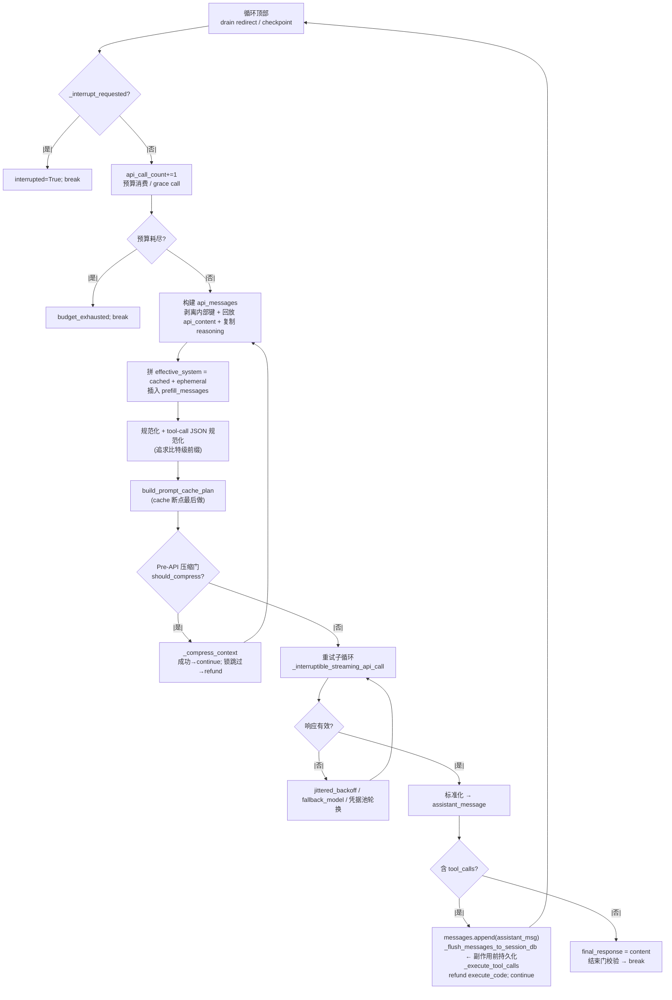

# 第二篇　核心代理循环

*作者：Amlei　·　更新时间：2026-08-08*

> 核心代理循环是整个系统的发动机。本篇以 `AIAgent` 类为线索，剖析一次"用户发言→模型调用→工具执行→最终回答"的完整回合在代码中究竟如何发生：循环是如何组织的、消息如何构造、推理（reasoning）如何保留、上下文如何被压缩、循环如何被中断与重定向、以及这一切为何被刻意设计为同步的。
>
> **一个重要的架构事实**：CLAUDE.md 中"`run_agent.py` 的 `AIAgent` 类承载核心循环"的描述已部分过时。当前代码已大规模模块化——`run_agent.py`（8167 行）仍定义 `class AIAgent`，但其 `__init__` 体被迁移到 `agent/agent_init.py:init_agent`，主循环被迁移到 `agent/conversation_loop.py:run_conversation`，逐回合的序言与终结分别落在 `agent/turn_context.py:build_turn_context` 与 `agent/turn_finalizer.py:finalize_turn`。`run_agent.py` 中的多数方法如今是转发器（forwarder）。本篇所有结论均以"实际承载逻辑的文件"为准，并标注 `文件:行号`。

---

## 第 1 章　循环必须保证的五条不变量

在进入具体机制之前，先列出核心循环必须同时成立的五条不变量。它们彼此约束，是理解后续每一个设计选择的坐标：

1. **同步循环 + 异步桥接**。`run_conversation` 是一个纯同步的 `while` 循环（`conversation_loop.py:1415`）。异步只出现在工具处理层——`model_tools.py:_run_async` 维护持久事件循环，供异步工具处理器与缓存的 `httpx`/`AsyncOpenAI` 客户端复用。选择同步的理由是控制流可读、中断/重定向/预算扣减等"控制平面"状态在单线程内可严格推理；异步被严格隔离到"数据平面"（工具执行、HTTP）。
2. **OpenAI 兼容**。内部消息一律采用 OpenAI Chat Completions 格式（`role`/`content`/`tool_calls`/`tool_call_id`）。非 OpenAI 原生 API（Anthropic Messages、Codex Responses、Bedrock Converse、Gemini native）的适配，在 API 边界由 `agent/transports/*` 与 `_get_transport()`（`run_agent.py:6652`）完成格式转换；`_build_api_kwargs`（`run_agent.py:6993`）是通向 provider 的唯一出口。
3. **缓存安全（cache-stable prefix）**。系统提示在一回合内构建一次后缓存于 `_cached_system_prompt`（`agent_init.py:1553`），此后逐字回放。所有易变注入（插件上下文、预填充、临时系统提示）只在 API 通话时拼装，绝不持久化。
4. **可中断**。`interrupt()` / `hard_interrupt()` / `steer()` / `redirect()` 提供四档语义不同的中断，全部线程安全，可由 gateway/CLI 的输入线程调用（`run_agent.py:3028-3400`）。
5. **预算化**。双层预算——`max_iterations`（默认 90，签名见 `run_agent.py:446`）封顶单次 `run_conversation` 的 API 调用数；`IterationBudget`（`iteration_budget.py`）封顶代理生命周期内的总迭代数。

---

## 第 2 章　`AIAgent` 类的结构

`AIAgent.__init__`（`run_agent.py:435-510`）本身是转发器，立即调用 `agent.agent_init.init_agent`（`agent_init.py:470`）。约 75 个构造参数按关注点分簇：

| 簇 | 代表参数 | 控制内容 |
|----|----------|----------|
| 凭据/路由 | `base_url, api_key, provider, api_mode, model` | 主 LLM 出口。`api_mode` 决定 transport（`chat_completions` / `anthropic_messages` / `codex_responses` / `bedrock_converse` / `codex_app_server`） |
| Provider 选择 | `providers_allowed/ignored/order, provider_sort` | OpenRouter/聚合器路由策略 |
| 迭代/预算 | `max_iterations(=90), iteration_budget` | 见第 7 章 |
| 工具集 | `enabled_toolsets, disabled_toolsets` | 启用 `toolsets.py` 中的工具分组 |
| 回调（约 20 个） | `tool_progress/start/complete_callback, thinking_callback, reasoning_callback, clarify_callback, stream_delta_callback, step_callback, …` | UI/TTS/gateway 事件钩子，全部可选 |
| 生成参数 | `max_tokens, reasoning_config, service_tier, request_overrides` | 透传到 API |
| 预填充 | `prefill_messages` | API 通话时插入；不持久化 |
| 会话/身份 | `session_id, platform, user_id, chat_id, thread_id, parent_session_id` | 多平台会话隔离与子代理血缘 |
| 上下文/记忆 | `skip_context_files, skip_memory, ephemeral_system_prompt` | 是否加载 AGENTS.md/SOUL.md、MEMORY.md |
| 韧性 | `fallback_model, credential_pool, checkpoints_enabled` | 故障转移链、凭据池轮换、崩溃恢复 |

`init_agent` 还初始化大量内部状态：`_budget_grace_call=False`（`agent_init.py:892`）、`_cached_system_prompt=None`（`1553`）、`context_compressor=ContextCompressor(...)`（`2479`）、工具工作线程集合 `_tool_worker_threads`（`815-816`）、子代理列表 `_active_children`（用于中断传播）等。

`AIAgent.run_conversation`（`run_agent.py:7759`）本身也是包装器：它获取会话租约、发布对话根上下文标签、通过 `bind_subagent_parent(self)` 与 `scoped_runtime_main({})` 进入上下文，再调用真正的 `agent.conversation_loop.run_conversation`（`run_agent.py:7852`）。`chat()`（`7924`）则是 `run_conversation` 之后只取 `final_response` 的薄封装。

---

## 第 3 章　主循环机制深挖

### 3.1　序言：每回合一次的工作

`run_conversation`（`conversation_loop.py:1233`）先做若干一次性工作：MoA（Mixture-of-Agents）解码、压缩状态重置（`1290-1292`）、`.env` 凭据刷新（`1298`），随后调用 `build_turn_context`（`1310`，实现于 `turn_context.py`）完成全部"每回合一次"的准备工作：

- stdio 守卫、重试计数器复位、用户消息净化；
- todo / 记忆 nudge 的注水；
- 系统提示的 restore-or-build；
- 预压缩（preflight compression）；
- `pre_llm_call` 插件钩子；
- 外部记忆预取（prefetch）；
- 崩溃韧性持久化。

其返回值被解包为循环读取的局部变量（`1332-1342`）。随后初始化循环局部计数器（`1351-1399`）：`api_call_count=0`、`compression_attempts=0`、`max_compression_attempts`（默认 3）、`_turn_exit_reason="unknown"` 等。

### 3.2　主 while 循环

循环的入口条件本身即是一条不变量：

```python
# conversation_loop.py:1415
while (api_call_count < agent.max_iterations
       and agent.iteration_budget.remaining > 0) or agent._budget_grace_call:
```

循环体单次迭代的控制流，可概括为如下伪代码（行号为 `conversation_loop.py`）：

```
1416  drain pending redirect      → _apply_active_turn_redirect
1427  checkpoint new_turn
1430  if _interrupt_requested → interrupted=True; break
1437  api_call_count += 1
1444  grace-call 消费  OR  iteration_budget.consume()
        失败 → _turn_exit_reason="budget_exhausted"; break
1453  step_callback (回放 prev_tools)
1555  sanitize_tool_call_arguments + repair_message_sequence
1587  构建 api_messages (剥离内部键、回放 api_content、复制 reasoning)
1709  effective_system = cached_system_prompt + ephemeral   ← 仅通话时
1768  插入 prefill_messages (system 之后)                    ← 仅通话时
1797  _sanitize_api_messages (孤儿 tool 结果清理)
1818  空白规范化 + tool-call JSON 规范化   ← 追求比特级前缀
1857  build_prompt_cache_plan (cache 断点最后做)
1952  Pre-API 压缩门: should_compress → _compress_context
2141  重试子循环: _perform_api_call → _interruptible_streaming_api_call
2748  finish_reason 映射 (content_filter / length / stop)
5956  if assistant_message.tool_calls:
6297        messages.append(assistant_msg)
6325        _flush_messages_to_session_db   ← 工具副作用前持久化
6365        _execute_tool_calls
6417        refund execute_code 迭代; continue
6578  else (无 tool_calls):
6580        final_response = assistant_message.content
        → 满足结束条件 → break
```

循环结束后调用 `finalize_turn`（`conversation_loop.py:7313`，实现于 `turn_finalizer.py`），完成持久化、活动标签复位、`on_turn_complete` 观察钩子、微压缩等。

下图给出单次迭代的完整控制流，可与上述行号对照阅读：



**两个值得专门指出的细节**：

- **中断检查位于循环顶部**（`1430`），紧随 redirect drain 之后、`api_call_count` 自增之前。这保证中断能在一个工具回合的边界被尊重。
- **工具调用回合的 assistant 消息在工具副作用执行之前就被持久化**（`_flush_messages_to_session_db`，`6325`）。若该持久化失败则立即 `break`（`6337-6345`），避免从仅存于内存的状态继续运行可能产生破坏性副作用的工具。

### 3.3　消息角色交替的维护

OpenAI 接口要求严格的 `assistant(tool_calls) → tool → tool …` 角色交替。循环在多处部署防御性修复，且这些修复只作用于 `api_messages`（API 副本），`messages`（权威历史）保持原样以保留 UI 轨迹与 reasoning 块：

- `repair_message_sequence_with_cursor`（`1579`）修复 `tool→user` 或 `user→user` 的尾部；
- `_sanitize_api_messages`（`1797`）为孤儿 tool 结果补桩或移除；
- `_drop_thinking_only_and_merge_users`（`1807`）合并相邻 user 消息，并剔除"只有 thinking 没有可见输出/工具调用"的 assistant 轮（否则 Anthropic 会以 "final block cannot be thinking" 报 400），但历史中仍保留该 reasoning 块。

---

## 第 4 章　消息格式与推理（reasoning）

### 4.1　OpenAI 格式的构建

每轮迭代都重建 `api_messages`：对每条 `messages` 项 `copy()`，剥离所有内部簿记键（`api_content` / `display_kind` / `display_metadata` / `_row_id` / `_thinking_prefill` / `_db_persisted` 等下划线前缀键）。系统提示作为 `api_messages[0]` 在最后拼装（`1713`）。

### 4.2　reasoning 的存储与回放

reasoning 在两个层面被处理：

- **持久化层**：reasoning 存于 `assistant_msg["reasoning"]`，用于轨迹存储；`reasoning_content` / `reasoning_details` / `codex_reasoning_items` 也保留在权威消息中。
- **API 出口层**：`_copy_reasoning_content_for_api`（`run_agent.py:7238`）把 `reasoning` 复制为 `reasoning_content` 以维持多轮推理连续性；随后 `reasoning` 字段被 `pop`（`conversation_loop.py:1656-1657`），`finish_reason` 也被 `pop`（`1659`，因 Mistral 等严格 API 拒绝未知字段）。
- **Provider 适配**：`_reapply_reasoning_echo_for_provider`（`2201`）为需要侧信道 reasoning 的 provider（DeepSeek/Kimi/MiMo）补回 reasoning echo。

### 4.3　预填充（prefill）为何是临时的

`prefill_messages`（`agent_init.py:841`）在 API 通话时插入到系统提示之后、对话历史之前（`conversation_loop.py:1768-1771`）：

```python
if agent.prefill_messages:
    sys_offset = 1 if (api_messages and api_messages[0].get("role") == "system") else 0
    for idx, pfm in enumerate(agent.prefill_messages):
        api_messages.insert(sys_offset + idx, pfm.copy())
```

它只进入 `api_messages`（通话副本），从不写入 `messages` 或 SessionDB。这是提示缓存纪律的一部分——若被持久化，则每一轮重放的缓存前缀都会不同，彻底破坏 KV cache 复用。`ephemeral_system_prompt` 同理，只在 `effective_system = active_system_prompt + "\n\n" + ephemeral_system_prompt`（`1709-1711`）时拼装。

---

## 第 5 章　系统提示构建

系统提示由 `agent/system_prompt.py:build_system_prompt`（`561`）编排，调用 `prompt_builder.py` 的无状态拼装函数。核心不变量：**系统提示一回合内构建一次，缓存于 `_cached_system_prompt`，此后每轮逐字回放**（`conversation_loop.py:1704-1708`）。

### 5.1　组装的片段

- **身份**：`DEFAULT_AGENT_IDENTITY`（`prompt_builder.py:144`）。
- **通用指导**：记忆指导、会话检索指导、技能指导（`154-207`）。
- **任务完成 / 并行工具指导**：全模型注入；工具使用强制指导仅对 `TOOL_USE_ENFORCEMENT_MODELS=("gpt","codex","gemini",…)` 注入（`326`）。
- **平台提示**：`PLATFORM_HINTS[platform]`（`706-954`），覆盖 cli/tui/desktop/telegram/whatsapp/slack/discord/email/cron/sms/matrix/feishu/weixin/wecom/qqbot/yuanbao 等十余种平台。
- **环境提示**：`build_environment_hints()`（`1173`）——本地后端给出主机 OS/用户/cwd；远程后端（docker/modal/ssh/daytona/singularity/vercel_sandbox）通过 `_probe_remote_backend`（`1040`）实测 OS/$HOME/cwd/user，主机信息被抑制。
- **上下文文件**：`build_context_files_prompt`（`2132`）加载 `.hermes.md`/`HERMES.md`、AGENTS.md、SOUL.md，先经 `_scan_context_content`（`55`）用 `tools/threat_patterns.py` 做 prompt-injection 扫描，命中则整块替换为 `[BLOCKED: ...]` 占位符。文件大小受动态上下文长度缩放（20K 地板、500K 天花板）。
- **技能索引**：`build_skills_system_prompt`（`1602`）——两层缓存（进程内 LRU + 磁盘快照），详见[第五篇](part-05-skills.md)。
- **记忆**：MEMORY.md / USER.md，经 `sanitize_memory_context` 净化。

### 5.2　缓存稳定性纪律

`DEVELOPER_ROLE_MODELS=("gpt-5","codex")`（`704`）在 API 边界把 `system` 角色换成 `developer`，但内部表示仍统一为 `system`。**关键纪律**：插件的 `pre_llm_call` 上下文注入到 **user 消息**而非 system（`conversation_loop.py:1699-1702`），因为"system prompt 的任何修改都会破坏提示缓存前缀；system prompt 保留给 Hermes 内部使用"。`api_content` sidecar（`1596`）记录每条消息发往 API 的精确字节，使压缩/resume 后重放的历史保持字节一致，从而保护 provider 的 prefix cache。

---

## 第 6 章　上下文压缩

抽象基类 `ContextEngine`（`context_engine.py:89`）定义接口；`ContextCompressor`（`context_compressor.py`）是默认实现，可由 `context.engine` 配置替换为第三方引擎（如 LCM）。

### 6.1　触发条件

- `threshold_tokens = context_length * threshold_percent`（默认 `threshold_percent=0.75`）。`threshold_tokens` 是惰性 property，首次访问时计算并受绝对上限约束。
- `should_compress` 在两处检查：回合序言的 preflight，以及 **Pre-API 压缩门**（`conversation_loop.py:1952-2100`）。后者是必要的，因为序言只看到入站 user 消息，单轮内可能追加大量 tool 结果，使下一次请求在发送前就已超出预算。
- 三层守卫：`_defer_preflight`（粗糙估值噪声过大时跳过）、`_compression_cooldown`（摘要 LLM 失败冷却期）、`should_compress` 本身。
- 每轮硬上限 `max_compression_attempts`（默认 3）。

### 6.2　压缩算法

`compress`（`context_compressor.py:6027`）的步骤：

```
1. prune_tool_results_only            ── 廉价预筛，无 LLM 调用
2. 保护头部 (system + protect_first_n=3)
3. 按 token 预算找尾部边界 (~20K tokens)
4. 用结构化 LLM prompt 摘要中间轮        ── auxiliary_client 提供 LLM
5. 重压缩时迭代更新前次摘要
6. 孤儿 tool_call/tool_result 配对清理
```

`protect_first_n` 在首次压缩后**衰减**，避免早期 user 轮被永久凝固；`protect_last_n` 由 token 地板封顶，防止臃肿的近期 tool run 锁死。摘要失败时设置 `_summary_failure_cooldown_until`（持久化到 SessionDB，跨进程/跨会话生效，30–60s 冷却）。

### 6.3　微压缩（micro-compaction）

`_micro_compact`（`5586`）在 `finalize_turn` 的 post-turn 空闲期运行：每次吸收**最老的一个未压缩 exchange** 进入滚动摘要。节奏由 `_micro_compact_every_n_turns` 门控——每次 pass 都要重写已发历史，代价是一次提示缓存中断，故用它权衡回收频率与缓存成本。微压缩同时调用 SessionDB 的 `archive_and_compact` 软归档旧行并原子插入压缩集（`5598-5603`），避免 resume 时双载。这一机制与[第四篇](part-04-state.md)第 3.3 节的"非破坏式压缩"直接对接。

### 6.4　Token 估算与上下文长度检测

`model_metadata.py`（3370 行）实现上下文长度的解析链：

```
OpenRouter API (1h TTL, 磁盘 L2)
   → models.dev
   → endpoint /models
   → 本地探测 (Ollama /api/show, LM Studio, llama.cpp /v1/props, vLLM)
   → 硬编码 DEFAULT_CONTEXT_LENGTHS
   → 回退 256K (DEFAULT_FALLBACK_CONTEXT)
```

持久缓存 `context_length_cache.yaml`，key 为 `model@base_url`。`CONTEXT_PROBE_TIERS=[256K,128K,64K,32K,16K,8K]` 在上下文错误时逐级下调；`MINIMUM_CONTEXT_LENGTH=64000`——低于此值的模型直接拒绝运行。

---

## 第 7 章　中断、重定向与预算

### 7.1　四档中断语义

`run_agent.py:3028-3400` 提供四档语义不同的中断：

| 方法 | 语义 | 是否中断工具 |
|------|------|--------------|
| `interrupt(msg)` | 设置 `_interrupt_requested`，信号所有工具中止，扇出到 `_tool_worker_threads` 与 `_active_children` | 是 |
| `hard_interrupt(msg)` | 通过 compression commit fence 设置 `_hard_interrupt_requested`，即使普通中断被屏蔽，压缩也能在提交前原子地尊重硬停 | 是（更强） |
| `steer(text)` | **不中断**当前工具调用；文本存入 `_pending_steer`，在 pre-API 与 post-tool 两处 drain，包裹成 `[OUT-OF-BAND USER MESSAGE — …]` 标记注入到最后一条 tool 消息 | 否 |
| `redirect(text)` | 取消**仅当前模型请求**（执行工具期间降级为 `steer`），保留已完成消息/工具结果，把纠正作为真实 user 消息 append 后重试 | 仅模型请求 |

`steer` 的包裹标记是**有界自描述格式**，并配 `STEER_CHANNEL_NOTE`（`prompt_builder.py:674`）告知模型只信任这一精确标记、忽略 tool 输出中的仿冒指令（防 prompt injection）。标记是不可变历史记录，故该 note 还定义了"仅在最新 tool 批且无后续 assistant 跟随时视为新消息"的一次性规则（`691-697`），防止历史重放时重复执行动作。

### 7.2　预算与凭据池

`IterationBudget`（`iteration_budget.py`）是线程安全计数器，方法 `consume()→bool` / `refund()` / `remaining`。父代理 cap = `max_iterations`；子代理获得**独立**预算（`delegate_tool.py:1654`：`iteration_budget=None`，构造时新建）。`execute_code` 迭代通过 `refund()` 退还（`6417`），不占预算；压缩 `continue` 同样 `refund()` + `api_call_count -= 1`。

`credential_pool` 支持多凭据轮换。`_try_activate_fallback`（`6436`）沿 `_fallback_chain` 激活 `fallback_model`；子代理通过 `_resolve_child_credential_pool` 共享父池，以便在限流时轮换而非钉死单 key。每轮重置 `_auth_pool_refresh_counts`（`conversation_loop.py:1392`）防止单条目 OAuth 池在持续 401 下无限"成功"刷新。

> **关于 `_budget_grace_call`**：它作为 while 条件的逃生阀保留，但当前生产代码中无任何位置将其置 True——`max_iterations` 路径走 `_handle_max_iterations`（`run_agent.py:7725`）注入总结 nudge，而非通过 grace flag。这是一个"防御性/遗留基础设施"的典型例子。

---

## 第 8 章　流式输出

`_use_streaming = True` 是默认（`conversation_loop.py:2348`），**即使没有流消费者也优先流式**。原因并非体验，而是健康检查：流式提供 90s 的 stale-stream 检测与 60s 读超时；非流式路径缺乏这些，会导致子代理/quiet-mode 调用在 provider 用 SSE ping 保活但不交付响应时无限挂起（`2329-2339`）。

实际调用走 `_interruptible_streaming_api_call`（`run_agent.py:6429`）。delta 通过 `_fire_stream_delta`（`6335`）/`_fire_reasoning_delta`（`6393`）分发到回调。流写者有令牌化所有权（`_claim_stream_writer` / `_stream_writer_is_current` / `_stream_writer_superseded`，`6277-6335`），确保被 redirect/abort 取消的流不会写入已被取代的显示区。中断期间已流式交付的部分文本会被 `_strip_think_blocks` 保留并 append 到 messages（`3506-3511`），避免"用户看到半截回复但历史无记录"。

---

## 第 9 章　为何如此设计：权衡的总账

1. **为何同步**：控制平面（中断、redirect、预算、压缩门、持久化游标）的状态在单线程 `while` 内可严格推理；异步只限数据平面，通过持久 loop 桥接而非 `asyncio.run` 每通话新建（保护连接池）。代价：工具并发需 `ThreadPoolExecutor`，中断传播需手动 fan-out 到 worker 线程 id。
2. **为何 OpenAI 兼容**：内部统一 OpenAI 格式使 provider 抽象成本最低；多模态/原生 API 在 transport 层转换，`_build_api_kwargs` 是唯一出口。代价：reasoning 等非标准字段需 provider-specific 补丁。
3. **缓存纪律的成本合理性**：系统提示逐字缓存、`api_content` sidecar 回放历史字节、空白规范化与 tool-call JSON 规范化追求"比特级前缀"——目的是本地推理服务器（llama.cpp/vLLM/Ollama）的 KV cache 复用与云 provider 的 prefix cache 命中率。由于每轮 assistant 回合都重发全部累积上下文，cache 命中直接乘以 N 倍降低延迟与成本。
4. **"不中途改上下文"政策**：系统提示一回合内冻结；插件上下文注入 user 消息而非 system；prefill/ephemeral 仅通话时拼装、不持久化。`_EPHEMERAL_SCAFFOLDING_FLAGS`（`run_agent.py:234`）标记的合成恢复轮绝不持久化，否则 resume 时会把这些内部脚手架当真实上下文重放。
5. **持久化鲁棒性**：`_DB_PERSISTED_MARKER="_db_persisted"`（`279`）用字典内标记而非 `id()` 去重——后者在消息被压缩/rewind 后地址可能被新消息复用，导致真实轮次静默不持久化。工具调用回合在副作用前强制 flush，失败即 break，保证崩溃恢复时能重放已执行的工具调用块。

---

*第二篇完。下一篇进入工具系统，剖析 `tools/registry.py` 的自注册机制、`model_tools.py` 的发现与分发，以及工具集（toolset）如何决定一个工具是否真正暴露给代理。*
