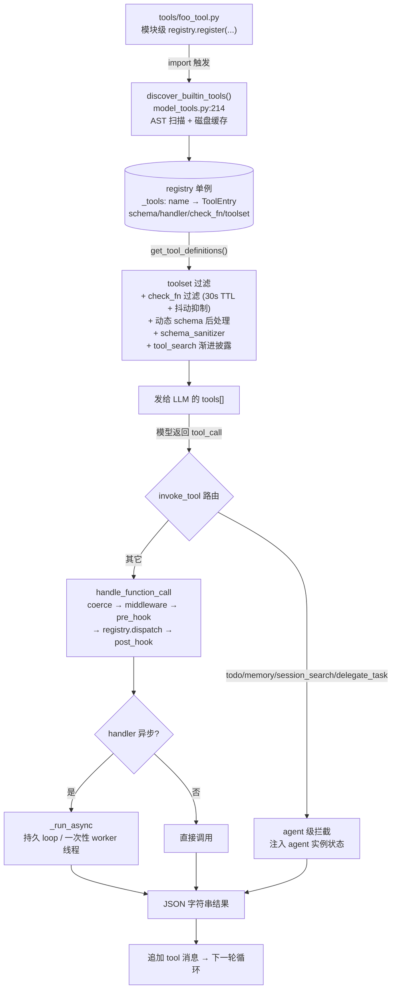

# 第三篇　工具系统

*作者：Amlei　·　更新时间：2026-08-08*

> 工具系统是代理"双手"的来源。本篇剖析一个工具从被写出、到被代理真正调用之间的全部机制：注册表（registry）如何以单例形态收录工具、工具文件如何在导入时自注册、`model_tools.py` 如何自动发现并分发调用、工具集（toolset）如何决定哪些工具暴露给代理、以及为何要把"注册"与"曝光"设计为两个正交的步骤。

---

## 第 1 章　两层解耦的架构

Hermes 的工具系统是一个**两层解耦**的架构：

- **底层 = 注册中心（registry）**：一个进程级单例字典 `{tool_name → ToolEntry}`，只负责"收录 schema + handler + 可用性检查函数"，对"是否暴露给 LLM"一无所知。
- **上层 = 工具集编排（toolsets.py + model_tools.py）**：决定"哪些工具集被启用/禁用"，再到 registry 中取对应 schema，过滤后发给 LLM。

二者通过 `tool_name` 这一弱契约耦合。一个工具要能被代理调用，必须**同时**满足：(a) 已在 registry 注册；(b) 隶属于某个已启用的工具集。这种"注册"与"曝光"的解耦，是整个系统的核心设计目标。

文件依赖链（`tools/registry.py:7-14` 顶部注释）严格无环：

```
tools/registry.py        （零依赖叶子，被所有工具文件导入）
      ↑
tools/*.py               （导入 registry 并在模块级 register）
      ↑
model_tools.py           （导入 registry + 触发发现）
      ↑
run_agent.py / cli.py / batch_runner.py / environments/
```

这条链有一个被反复强调的含义：`tools/registry.py` 是全系统的地基。它不依赖任何上层模块，因此可在最早期被导入；所有工具文件都只与它耦合，彼此之间互不依赖。

---

## 第 2 章　注册表（registry.py）深挖

### 2.1　数据结构：ToolEntry

每个工具是一个 `ToolEntry`（`registry.py:160-189`），用 `__slots__` 紧凑存储：

```python
__slots__ = (
    "name", "toolset", "schema", "handler", "check_fn",
    "requires_env", "is_async", "description", "emoji",
    "max_result_size_chars", "dynamic_schema_overrides",
)
```

其中 `schema` 是 OpenAI function 格式的 JSON schema；`handler` 是 `handler(args, **kwargs) -> str | dict`；`check_fn` 是零参可用性探测函数，返回 bool（例如探测 Docker/Modal/playwright 是否可用）；`dynamic_schema_overrides` 是零参 callable，返回 dict，在生成定义时浅合并到 schema 上。

### 2.2　register() 与 override 信任门

`register()`（`registry.py:521-603`）的关键逻辑是**跨工具集遮蔽检测**（`544-581`）：若 `name` 已存在且新旧 `toolset` 不同，默认**拒绝**注册，以防 MCP 服务器之间或插件与内置工具之间的意外名冲突。要让遮蔽生效，必须显式传 `override=True`。

`override=True` 针对**内置工具**时还要过一道**操作员授权门**（`registry.py:547-562`）：

```python
if override:
    _owner = self._plugin_owner_of(handler)
    if _owner is not None and not self._plugin_override_policy.get(_owner, False):
        raise PermissionError(
            f"Plugin module {_owner!r} cannot override built-in "
            f"tool {name!r} without operator opt-in (allow_tool_override)."
        )
```

`_plugin_owner_of`（`481-503`）通过 `handler.__globals__["__name__"]` 判定 handler 定义所在模块——这是**定义期绑定**，无法通过 lambda/嵌套函数或调用时机洗白。授权策略在插件加载时一次性写入，**永不清除**（`382-383`），因此延迟/线程化的 `register()` 调用仍受同一策略约束。

`deregister()`（`605-670`）有对称的所有权门：通过 `sys._getframe(2)` 帧检查调用者模块，绑定到插件包根，防止一个插件注销它不拥有的工具来绕过 override 门。MCP 工具集（`mcp-*`）豁免——它们靠"全清重建"（nuke-and-repave）刷新。

### 2.3　dispatch 与结果规约

`dispatch()`（`registry.py:760-790`）：

```python
def dispatch(self, name, args, **kwargs):
    entry = self.get_entry(name)
    if not entry:
        return tool_error(f"Unknown tool: {name}")
    try:
        if entry.is_async:
            from model_tools import _run_async
            result = _run_async(entry.handler(args, **kwargs))
        else:
            result = entry.handler(args, **kwargs)
        return self._normalize_handler_result(name, result)
    except Exception as e:
        raw = f"Tool execution failed: {type(e).__name__}: {e}"
        from model_tools import _sanitize_tool_error
        return tool_error(_sanitize_tool_error(raw))
```

所有 handler **必须返回 JSON 字符串**（`917-919`）。`_normalize_handler_result`（`729-758`）强制这一点：str 原样返回；唯一的结构化例外是 `{"_multimodal": True, "content": [...]}` 多模态信封；其它类型（dict、None、int）一律降级为 `tool_error`。辅助函数 `tool_error()` 与 `tool_result()`（`930-956`）封装了 `json.dumps(..., ensure_ascii=False)`，消除了成百上千处样板。异常字符串先过 `_sanitize_tool_error` 剥离 XML 角色标签/CDATA/markdown fence 并截断到 2000 字，防止框架 token 作为结构噪声进入模型上下文。

### 2.4　check_fn 的 TTL 缓存与抖动抑制

这是 registry 中最精细的一块。`check_fn` 探测外部状态（Docker daemon、Modal SDK、playwright 二进制），每次生成定义都调会很浪费。`_check_fn_cached`（`271-338`）实现双层缓存：

- **TTL 缓存**：`_CHECK_FN_TTL_SECONDS = 30.0`。30 秒内复用上次结果。
- **last-good 抖动抑制**（对应 issue #21658/#5304）：Docker daemon 在负载下偶发 `subprocess.run` 超时会返回 False，而这会瞬间从某个正在构建的代理（最典型是 delegate 子代理）剥离整个 terminal+file 工具集，子代理报 "Tool read_file does not exist"。解法是记 `_check_fn_last_good`（上次返回 True 的 monotonic 时间戳），若新失败在 `_CHECK_FN_FAILURE_GRACE_SECONDS = 60.0` 窗口内，则**服务上次的 True 且不缓存本次失败**，下次重新探测。

```python
# tools/registry.py:311-328
if value:
    _check_fn_last_good[cache_key] = now      # True → 记 last-good 时间戳
    _check_fn_cache[cache_key] = (now, True)
    return True

last_good = _check_fn_last_good.get(cache_key)
if last_good is not None and now - last_good < _CHECK_FN_FAILURE_GRACE_SECONDS:
    # 近期成功过 → 当作抖动：服务 last-good True，且不缓存本次失败，下次重新探测
    return True
```

缓存还按 **profile 维度**分桶。单 profile 进程保持进程级缓存；多路复用 gateway 每个 profile 回合安装一个 Hermes-home override，profile key 用 `Path(override).resolve()` 作为隔离边界。无法解析 profile 身份时返回 `CHECK_FN_CACHE_BYPASS = ""`，**两层缓存都绕过**——宁可重新探测也不跨 profile 串别名（fail closed）。

---

## 第 3 章　自注册与自动发现

### 3.1　自注册

每个 `tools/*.py` 在**模块级**（import 即执行）调用 `registry.register()`。典型形态（`todo_tool.py:325-335`）：

```python
from tools.registry import registry, tool_error

registry.register(
    name="todo",
    toolset="todo",
    schema=TODO_SCHEMA,
    handler=lambda args, **kw: todo_tool(
        todos=args.get("todos"), merge=args.get("merge", False),
        store=kw.get("store")),
    check_fn=check_todo_requirements,
    emoji="📋",
)
```

之所以是 import 时，是因为 Python 的 import 本身就是幂等且惰性的副作用引擎：registry 是无依赖叶子，工具文件只依赖 registry，import 一个工具模块就恰好等于"登记一个工具"。无需装饰器扫描、无需显式清单。代价是工具文件不能有 import 期副作用（如读配置）——所以 `delegate_tool.py` 把 description 构建延迟到 `dynamic_schema_overrides` 回调，以"避免在测试 conftest 重定向 HERMES_HOME 之前强制加载 cli.CLI_CONFIG"。

### 3.2　自动发现（discover_builtin_tools）

发现入口在 `model_tools.py:214`：`discover_builtin_tools()`。这是模块级语句，import `model_tools` 即触发全部工具注册。它**不是**简单 import 全部 `tools/*.py`，而是先用 AST 判定哪些文件真的在模块级调了 `registry.register()`（`registry.py:67-118`）：

```python
def discover_builtin_tools(tools_dir=None):
    ...
    for path in sorted(tools_path.glob("*.py")):
        if path.name in {"__init__.py", "registry.py", "mcp_tool.py"}:
            continue
        ...
        registers = _module_registers_tools(path)   # AST 判定
        if registers:
            module_names.append(f"tools.{path.stem}")
    for mod_name in module_names:
        importlib.import_module(mod_name)
```

`_module_registers_tools`（`43-64`）先用廉价文本预过滤，再 `ast.parse` 检查顶层语句是否有 `registry.register(...)` 调用，**只看模块体顶层**——函数体内的 register 调用不算，避免误收 helper 模块。

**磁盘缓存**：AST 扫描约 100 个文件 warm cache 下约 145ms，所以判定结果按 `(mtime_ns, size)` 为 key 缓存到 `~/.hermes/cache/tool_discovery_cache.json`。命中则不重读文件。`registry.py` 故意延迟导入 `hermes_constants`/`utils` 到函数体内，以保持"模块 import 期零依赖叶子"。

```python
# tools/registry.py:89-103
st = path.stat()
stat_key = (st.st_mtime_ns, st.st_size)          # 磁盘缓存 key = (mtime_ns, size)
cached = cache.get(abs_path)
if (isinstance(cached, (list, tuple)) and len(cached) == 3
        and (cached[0], cached[1]) == stat_key):
    registers = bool(cached[2])                  # 命中 → 信任缓存，不重读文件
else:
    registers = _module_registers_tools(path)    # 失配 → 重新 AST 扫描
    cache_dirty = True
fresh_cache[abs_path] = [stat_key[0], stat_key[1], registers]
```

**排除项**：`__init__.py`、`registry.py` 自身、`mcp_tool.py`（MCP 工具走单独的 `discover_mcp_tools`，其内部有阻塞 120s 等待，曾作为模块级副作用触发 gateway 心跳冻结 issue #16856，已被移到各入口显式启动）。

---

## 第 4 章　分发（handle_function_call）

`handle_function_call`（`model_tools.py:1123-1540`）是工具执行的中央入口，但其完整流水线层层把关：

```
Step 0  参数类型强转 coerce_tool_args ("42"→42, "true"→True)
Step 1  Tool Search bridge 分发 (tool_search/tool_describe/tool_call)
Step 2  tool_request 中间件 (可改写 payload)
Step 3  agent-loop 工具短路 (todo/memory/session_search/delegate_task)
Step 4  pre_tool_call hook (单次触发, 返回 block 则否决)
Step 5  ACP edit approval (write_file/patch 人工审批)
Step 6  registry.dispatch (含中间件包裹; execute_code 特殊透传 sandbox_enabled)
Step 7  post_tool_call hook + transform_tool_result
```

几个关键点：

- **agent-loop 工具短路**（`model_tools.py:1300-1302`）：`_AGENT_LOOP_TOOLS = {"todo", "memory", "session_search", "delegate_task"}` 需要代理实例状态（TodoStore/MemoryStore/session_db/parent_agent），registry 里虽有它们的 schema，但 dispatch 只会返回 stub 错误——真正的执行由 `run_agent` 侧的 `invoke_tool` 拦截（见第 6 章）。
- **execute_code 的沙箱透传**（`1421-1431`）：把 `enabled_tools`（或回退到 `_last_resolved_tool_names`）作为 `sandbox_enabled` 透传，使子代理无法通过进程全局覆盖父代理的工具集。
- **`_last_resolved_tool_names`**（`model_tools.py:247`）：上一次 `get_tool_definitions()` 解析出的工具名列表，进程全局。`execute_code` 用它来知道当前会话有哪些工具可在沙箱里被程序化调用。在 `delegate_tool._run_single_child` 中会 save/restore 这个全局，避免子代理执行期间它被污染。

### 4.1　异步桥接（_run_async）

主循环是同步的，但很多 handler 是异步的。`_run_async`（`model_tools.py:114-207`）是同步→异步桥的**唯一真相源**，处理三种情形：

1. **当前线程已有 running loop**（gateway/RL 环境）：开一个一次性 `ThreadPoolExecutor(max_workers=1)`，在新线程建独立 loop 跑协程，`future.result(timeout=300)` 同步等；超时通过 `call_soon_threadsafe(t.cancel)` 取消协程，避免线程泄漏。
2. **当前是 worker 线程**（delegate_task 的并行工具执行）：用线程局部持久 loop。
3. **CLI 主线程无 loop**：用进程级持久 loop。

```python
# model_tools.py:134-139, 202-207
try:
    loop = asyncio.get_running_loop()
except RuntimeError:
    loop = None

if loop and loop.is_running():
    # 情形 1：当前线程已有 running loop → 开一次性 ThreadPoolExecutor，
    #         future.result(timeout=300)，超时则 call_soon_threadsafe(t.cancel)
    ...  # pool.submit(propagate_context_to_thread(_run_in_worker))

if threading.current_thread() is not threading.main_thread():
    # 情形 2：worker 线程 → 线程局部持久 loop
    return _get_worker_loop().run_until_complete(coro)

# 情形 3：CLI 主线程无 loop → 进程级持久 loop
tool_loop = _get_tool_loop()
return tool_loop.run_until_complete(coro)
```

为何不用 `asyncio.run()`？因为它每次创建并**关闭**一个新 loop，而缓存的 httpx/AsyncOpenAI 客户端绑定在那个死掉的 loop 上，GC 时会抛 "Event loop is closed"。持久 loop 让缓存的客户端在整个线程生命周期内保持有效。

---

## 第 5 章　get_tool_definitions：发给 LLM 的最终 schema

`get_tool_definitions`（`model_tools.py:305-388`）构建发给 LLM 的最终 `tools[]`，带 memo 缓存。缓存 key 含 `(enabled, disabled, registry._generation, cfg_fp, HERMES_KANBAN_TASK, skip_tool_search_assembly, profile_scope)`。其中 `registry._generation` 是单调递增计数器，每次 register/deregister/MCP refresh 自增，使缓存随 registry 变更自动失效；`cfg_fp = (config.yaml mtime_ns, size)` 捕获影响动态 schema 的配置改动。缓存返回浅拷贝，避免下游污染缓存（issue #17335：DeepSeek/MiMo/Kimi 强制唯一工具名，重复会导致 HTTP 400）。

无缓存路径 `_compute_tool_definitions`（`391-611`）的步骤：

1. **工具集解析为工具名集合**（`399-432`）：递归展开 `includes`；`HERMES_KANBAN_TASK` 环境变量下强制注入 `kanban` 工具集。
2. **disabled 工具集做差集**（`438-475`）：关键陷阱——`hermes-*` 平台 bundle 的 tools 列表里**重述了** `_HERMES_CORE_TOOLS`，直接做差集会剥离所有平台共享的核心工具。所以 `bundle_non_core_tools`（`toolsets.py:692-717`）只返回 bundle 的**非核心 delta**。
3. **registry.get_definitions 做 check_fn 过滤**（`484`）：只有 `check_fn()` 返回 True 的工具进结果，同时应用 `dynamic_schema_overrides`。
4. **动态 schema 后处理**（`486-552`）：基于"实际通过 check_fn 的工具名集合"，避免模型看到不存在的工具而产生幻觉调用：
   - `execute_code` 的 schema 按真正可用的沙箱工具重建；
   - `discord`/`discord_admin` 按 bot 的 privileged intents 重建；
   - `browser_navigate` 在 web_search/web_extract 都不可用时，删掉 description 里的交叉引用。
5. **schema_sanitizer**（`570-574`）：对最终 schema 树做 deepcopy 级的 provider 兼容性修复（见第 7 章）。
6. **tool_search 渐进披露**（`586-609`）：当可延迟表面（MCP + 非核心插件工具）超过上下文阈值（默认 10%），用三个 bridge 工具（`tool_search`/`tool_describe`/`tool_call`）替换。核心工具**永不延迟**。

```python
# tools/tool_search.py:797-820
visible, deferrable = classify_tools(incoming)        # 核心工具进 visible，永不延迟
if not deferrable:
    return AssemblyResult(tool_defs=incoming, activated=False)

deferrable_tokens = estimate_tokens_from_schemas(deferrable)
if not should_activate(config, deferrable_tokens, context_length):
    return AssemblyResult(tool_defs=incoming, activated=False)   # 未超阈值 → 直通

bridge = bridge_tool_schemas(len(deferrable), listing=listing, listing_form=listing_form)
result = visible + bridge    # 超阈值：可延迟表面被三个 bridge 工具替换，核心工具保留
```

---

## 第 6 章　工具集（toolsets.py）体系

### 6.1　数据结构

`TOOLSETS`（`toolsets.py:101-615`）是嵌套 dict：

```python
"browser": {
    "description": "...",
    "tools": ["browser_navigate", "browser_snapshot", ...],
    "includes": []           # 引用其它工具集名
}
```

叶子工具集（`web`/`file`/`browser`/`todo`/`memory`/…）的 `tools` 是工具名列表；复合工具集（`debugging`/`safe`/`hermes-gateway`）靠 `includes` 引用其它工具集，`resolve_toolset` 递归展开（含环路/菱形检测）。特殊别名 `"all"`/`"*"` 展开为所有工具集的并集。

### 6.2　_HERMES_CORE_TOOLS 与平台预设

`_HERMES_CORE_TOOLS`（`toolsets.py:31-86`）是 CLI 与所有消息平台**共享**的核心工具列表——"Edit this once to update all platforms simultaneously"。每个 `hermes-<platform>` 预设通常是 `_HERMES_CORE_TOOLS + [平台特有工具]`：如 `hermes-discord` 额外加 `discord`/`discord_admin`，`hermes-feishu` 加 feishu_doc/drive 工具。

`hermes-webhook` 是**安全收窄**特例，只用 `_HERMES_WEBHOOK_SAFE_TOOLS = ["web_search","web_extract","vision_analyze","clarify"]`——因为 webhook 事件可能来自不可信第三方内容（公开 PR 标题/评论），要避免 prompt injection 触发本地文件/系统执行。

### 6.3　agent 级工具拦截

四个 `_AGENT_LOOP_TOOLS` 需要代理实例状态，所以 `run_agent` 的主循环**不**直接调 `handle_function_call`，而是调 `invoke_tool`（`agent/agent_runtime_helpers.py:2803-3034`），由它做 per-function 路由：

```python
if function_name == "todo":
    def _execute(next_args):
        return _todo_tool(todos=..., store=agent._todo_store)   # ← agent 实例状态注入
elif function_name == "session_search":
    ... db=agent._get_session_db_for_recall(), current_session_id=agent.session_id ...
elif function_name == "memory":
    ... store=agent._memory_store ...
elif function_name == "delegate_task":
    def _execute(next_args):
        return agent._dispatch_delegate_task(next_args)
else:
    def _execute(next_args):
        return _ra().handle_function_call(function_name, next_args, ...)   # 落到 registry
```

注意 `invoke_tool` 仍统一执行 tool_request 中间件、pre_tool_call block 门、post_tool_call hook、tool_execution 中间件——拦截的只是**handler 解析与实参注入**，hook/middleware 链对所有工具一视同仁。

这套"registry 存 schema + invoke_tool 拦截 handler"的分裂设计，让 schema 发现（`get_tool_definitions` 无需代理实例）与状态化执行（需要代理实例）各走各路，互不耦合。

---

## 第 7 章　schema_sanitizer：跨 provider 的鲁棒性

`sanitize_tool_schemas`（`schema_sanitizer.py:120-174`）在 `get_tool_definitions` 里对**最终** schema 树做 deepcopy 级修复，针对本地/严格后端：

- **llama.cpp**：拒绝无 `properties` 的 `{"type":"object"}`、裸字符串 schema 值、`type` 数组。`_sanitize_node`（`305-444`）注入空 properties、把裸字符串包成 `{"type":...}`、把多类型数组转成 `anyOf` 以保留全部分支。
- **Anthropic / Bedrock / Vertex**：拒绝不匹配 `^[a-zA-Z0-9_.-]{1,64}$` 的属性键。`_rename_property_keys`（`62-87`）确定性重命名，dispatch 时 `unrename_tool_args`（`90-117`）反向还原。
- **Fireworks / draft-07 strict**：拒绝 `default` 与 `$ref` 同层。`_strip_ref_siblings`（`181-202`）递归剥离。
- **OpenAI Codex backend**：拒绝顶层 `allOf`/`anyOf`/`oneOf`/`enum`/`not`。`_strip_top_level_combinators` 只剥顶层。
- **nullable union 折叠**（`240-302`）：把 `anyOf:[{string},{null}]` 折成非 null 分支 + `nullable:true`，让运行时 `coerce_tool_args` 仍能把模型输出的字面 `"null"` 串映射成 Python None。

属性键重命名的"反向还原"刻意**不存侧表**——`unrename_tool_args` 在 dispatch 时（`model_tools.py:765`）拿到的 `params_schema` 是 registry 里的 **ORIGINAL** schema，现场重算前向映射再反转，因此免疫 `get_tool_definitions` 缓存命中与 MCP nuke-and-repave 导致的映射丢失；正因如此，`_rename_property_keys` 必须是纯函数（插入序 + 数字后缀去重），前向与反向才能各自独立算出却始终一致：

```python
# tools/schema_sanitizer.py:99-108
props = params_schema.get("properties")
if not isinstance(props, dict):
    return args
# 无存储侧表：从 ORIGINAL schema 重算前向映射再反转——纯函数，
# 免疫 get_tool_definitions 缓存命中 / MCP nuke-and-repave 导致的侧表丢失。
reverse = {v: k for k, v in _rename_property_keys(props, "<unrename>").items()}
out = {}
for key, value in args.items():
    orig = reverse.get(key, key)
    subschema = props.get(orig)
    if isinstance(subschema, dict):
```

还有两个**响应式** sanitizer（仅在后端 400 时触发）：`strip_pattern_and_format`（llama.cpp 正则引擎只支持 ECMAScript 子集）、`strip_slash_enum`（xAI 编译 enum 含 `/` 时 400）。

设计哲学（`schema_sanitizer.py:32-34`）："intentionally conservative: it only modifies shapes the LLM backend couldn't use anyway"——只改后端反正用不了的形状，绝不改语义。

---

## 第 8 章　为何如此设计：权衡的总账

1. **JSON 字符串返回契约**：统一了日志切片、hook 派发、预算计量、持久化、tool message 拼装。代价是 handler 内部要 `json.dumps`——已由辅助函数吸收。
2. **同步主循环 + async 桥**：控制流线性、易推理；`_run_async` 作为单一桥点处理异步 handler，用持久 loop 避免缓存客户端的 GC 崩溃。
3. **两步式（register + toolset 接线）的刻意解耦**：register 只声明"工具存在"；toolset 的 enable/disable 在调用时才决定曝光。同一份 registry 服务全平台，靠 `_HERMES_CORE_TOOLS` + 平台 delta + `bundle_non_core_tools` 安全差集，避免核心工具被误清空。`check_fn` 的可用性维度是**第三轴**，与 toolset 曝光正交。
4. **profile/会话感知的 schema**：缓存 key 与 check_fn 缓存都按 profile scope 分桶；`dynamic_schema_overrides` 让 delegate_task 的 description 每次反映用户当下的并发/深度配置；execute_code/discord/browser_navigate 的 schema 按可用工具动态重建，消除幻觉调用。
5. **渐进披露（tool_search）作为收尾步骤**：MCP/插件工具易爆炸，超过阈值时用 bridge 工具替换，bridge 对 hook 不可见（`tool_call` 解包为底层工具名递归），双重 scoped 防止受限会话越权调用。
6. **信任门与 fail-closed 原则**：插件 override 内置工具需操作员 opt-in，授权绑定到 handler 定义模块（不可洗白）；deregister 对称设门，MCP 豁免；profile 身份不可解析时绕过缓存而非串别名。

---

## 第 9 章　从写出到调用：完整数据流

下图把本章所有机制串成一条从"工具文件被写出"到"代理调用它"的完整数据流，可作为本篇的总览图：



---

*第三篇完。下一篇进入状态与会话持久化，剖析 SessionDB 如何用 SQLite + FTS5 承载全部对话历史与跨会话检索。*
