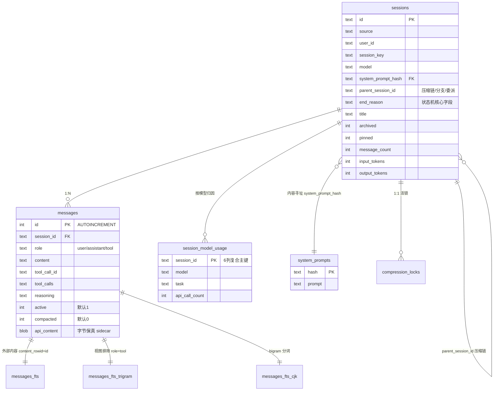

# 第四篇　状态与会话持久化

*作者：Amlei　·　更新时间：2026-08-08*

> 所有对话都流经一个 SQLite 数据库。本篇剖析 `SessionDB` 如何承载完整的对话历史、如何用三套 FTS5 索引实现跨会话检索、如何在不破坏可检索性的前提下进行非破坏式压缩、以及它如何在多 profile、多进程并发下保持一致与可移植。

---

## 第 1 章　模块拓扑与设计目标

SessionDB 已被拆分为四个源文件，通过 mixin 组合为单一类（`hermes_state.py:2092`）：

```
SessionDB(SessionSearchMixin, SessionSchemaMixin, SessionPortabilityMixin)
```

三个 mixin 各持一个职能集群（Schema / Search / Portability），均为无状态 mixin：不定义 `__init__`、不持有自身状态，所有方法访问宿主的 `self._conn` / `self.db_path` / `self._lock` / `self._execute_write`。

| 文件 | 行数 | 职能 |
|------|------|------|
| `hermes_state.py` | 9897 | 宿主类、连接管理、写路径、消息持久化、会话生命周期、token 计账、WAL/修复 |
| `hermes_state_schema.py` | 1079 | DDL、声明式列调和、版本迁移、FTS 触发器收敛 |
| `hermes_state_search.py` | 2230 | FTS5 / trigram / CJK 搜索、查询路由、FTS 维护与优化 |
| `hermes_state_common.py` | 614 | 模块级常量（schema、FTS DDL、preview SQL、子会话判定） |
| `hermes_state_portability.py` | 714 | 富列表、导出、导入 |

SessionDB 向调用方提供如下保证：完整对话持久化、跨会话 FTS5 检索、会话标题（辅助 LLM 生成）、摘要化压缩、可移植性、profile 隔离。

**为何 SQLite + FTS5**：单文件、零运维、随进程内嵌；WAL 模式提供"读不阻塞写、写不阻塞读"的并发；FTS5 是 SQLite 原生扩展，BM25 排序 + `snippet()` 高亮，免独立检索服务。一个关键事实是：`session_search` 工具的 docstring 明确声明 **"No LLM calls anywhere"**——召回本身是 FTS5 + 锚定窗口 + 首尾块（bookend）的纯结构化操作；LLM 只用于标题与压缩。

---

## 第 2 章　Schema 与迁移

### 2.1　表结构

`SCHEMA_SQL`（`hermes_state_common.py:197-373`）定义核心表，可归纳为如下 ER 图：



`SCHEMA_SQL` 中 `messages` 表的 DDL（节选与持久化语义相关的列）：

```sql
-- hermes_state_common.py:265
CREATE TABLE IF NOT EXISTS messages (
    id INTEGER PRIMARY KEY AUTOINCREMENT,
    session_id TEXT NOT NULL REFERENCES sessions(id),
    role TEXT NOT NULL,
    content TEXT,
    tool_call_id TEXT,
    tool_calls TEXT,
    tool_name TEXT,
    -- ...timestamp / token_count / reasoning / codex_* / platform_message_id...
    active INTEGER NOT NULL DEFAULT 1,
    compacted INTEGER NOT NULL DEFAULT 0,
    api_content TEXT,
    display_kind TEXT,
    display_metadata TEXT
);
```

`SCHEMA_VERSION = 25`；`FTS_STORAGE_VERSION = 1`，与主版本**解耦**。

### 2.2　三套 FTS5 虚拟表

- **`messages_fts`**：v23 外部内容表（`content='messages', content_rowid='id'`），索引 `content, tool_name, tool_calls`。三个触发器（insert/delete/update）通过 `state_meta` 的水位键实现**延迟重建门控**，避免后台重建期间对不在索引中的行执行 FTS5 'delete' 而损坏索引。UPDATE 触发器用窄列 `AFTER UPDATE OF content, tool_name, tool_calls`，非内容列写入完全不触发 FTS I/O。

`messages_fts` 的外部内容表与门控触发器（水位键取自 `state_meta`，无重建时 `COALESCE` 把谓词化为恒真）：

```sql
-- hermes_state_common.py:416
CREATE VIRTUAL TABLE IF NOT EXISTS messages_fts USING fts5(
    content, tool_name, tool_calls,
    content='messages', content_rowid='id'      -- v23 外部内容表
);

CREATE TRIGGER IF NOT EXISTS messages_fts_insert AFTER INSERT ON messages
WHEN (new.id > COALESCE((SELECT CAST(value AS INTEGER) FROM state_meta
                         WHERE key = 'fts_rebuild_high_water'), -1)
   OR new.id <= COALESCE((SELECT CAST(value AS INTEGER) FROM state_meta
                          WHERE key = 'fts_rebuild_progress'), -1))   -- 水位键门控
BEGIN
    INSERT INTO messages_fts(rowid, content, tool_name, tool_calls)
    VALUES (new.id, new.content, new.tool_name, new.tool_calls);
END;

-- 窄列 UPDATE：非内容列写入完全不触发 FTS I/O
CREATE TRIGGER IF NOT EXISTS messages_fts_update
AFTER UPDATE OF content, tool_name, tool_calls ON messages WHEN (...);
```

- **`messages_fts_trigram`**：`tokenize='trigram'`，通过视图**排除 `role='tool'` 行**——tool 行约占消息字节的 90% 且多为机器噪声（base64、文件转储），故仅由标准 `messages_fts` 索引。
- **`messages_fts_cjk`**：基于可加载扩展 `cjk_unicode61`，bigram 分词，专门服务 CJK 查询。

### 2.3　迁移机制：声明式列调和 + 版本门控数据迁移

`_init_schema`（`hermes_state_schema.py:572`）采用声明式调和：

1. `executescript(SCHEMA_SQL)` 创建缺失表；
2. `_reconcile_columns`（`:335`）用内存 SQLite 解析 `SCHEMA_SQL` 得到期望列集合，对每张实表 `PRAGMA table_info`，`ALTER TABLE ADD COLUMN` 补齐缺失列——**新增列只需加进 `SCHEMA_SQL`**，无需版本门控迁移；
3. 版本门控链（`:667-892`）仅保留**无法声明式表达**的数据迁移（如 v16 标记 delegate 子会话、v18 从 sessions.json 回填、v20 按 model 播种 `session_model_usage`、v25 调用 `_dedupe_legacy_system_prompts` 把内联 system_prompt 搬进内容寻址表）。

声明式列调和的差量循环——期望列集合由内存 SQLite 解析 `SCHEMA_SQL` 得到，对每张实表 `PRAGMA table_info` 后 `ADD COLUMN` 补齐差量：

```python
# hermes_state_schema.py:348
expected = self._parse_schema_columns(SCHEMA_SQL)   # 内存 SQLite 解析 SCHEMA_SQL
for table_name, declared_cols in expected.items():
    try:
        rows = cursor.execute(f'PRAGMA table_info("{table_name}")').fetchall()
    except sqlite3.OperationalError:
        continue  # executescript 后表应已存在
    live_cols = {row[1] if isinstance(row, (tuple, list)) else row["name"]
                 for row in rows}
    for col_name, col_type in declared_cols.items():
        if col_name not in live_cols:                     # 期望 - 实有 = 缺失列
            safe_name = col_name.replace('"', '""')
            cursor.execute(
                f'ALTER TABLE "{table_name}" ADD COLUMN "{safe_name}" {col_type}'
            )
```

关键设计：v23 FTS 存储优化**解耦于主版本**——主 `schema_version` 照常推进，FTS 布局由独立 `fts_storage_version` 标记，只有显式 `hermes sessions optimize-storage` 才迁移，避免每次大开销磁盘操作惊扰用户。

---

## 第 3 章　消息持久化与非破坏式压缩

### 3.1　行写入

单条追加 `append_message`（`hermes_state.py:6513`）与批量原子追加 `append_messages_batch`（`:6660`）共享 `_check_transcript_write_guards`（`:6457`）——在写事务内校验 compression_lock 与会话是否已 `end_reason='compression'` 关闭。

行写入由 `_insert_message_rows`（`:6975`）统一处理。多模态/结构化内容经 `_encode_content`（`:6380`）序列化；`api_content` 是字节保真 sidecar——记录实际发给 API 的内容（与清洁 `content` 不同时），供 prompt-cache 稳定的重放。

`_encode_content` 的关键是**哨兵前缀**：sqlite3 只能绑 `str`/`bytes`/`int`/`float`/`None`，多模态 content 的部件列表（`[{"type":"text",...},{"type":"image_url",...}]`）无法直接绑定；但若对所有内容一律 `json.dumps`，普通字符串会与"恰好是 JSON 文本的字符串"无法区分，读回时被错误解析。哨兵 `\x00json:`（NUL 字节在正常文本中非法，不可能与用户内容碰撞）前缀化结构化载荷，`_decode_content` 仅在检测到该前缀时才剥离并 `json.loads` 还原，标量字符串原样穿透：

```python
# hermes_state.py:6377
_CONTENT_JSON_PREFIX = "\x00json:"   # NUL 字节在正常文本中非法 → 不可能与用户内容碰撞

@classmethod
def _encode_content(cls, content):
    if isinstance(content, str):
        return _sanitize_surrogates(content)                  # 字符串原样（仅清孤立 UTF-16 代理对）
    if content is None or isinstance(content, (bytes, int, float)):
        return content                                         # sqlite 原生可绑定标量：原样返回
    return cls._CONTENT_JSON_PREFIX + json.dumps(content)     # list/dict → 哨兵 + JSON
```

**排序按 AUTOINCREMENT id 而非 timestamp**——`append_message` 用 `time.time()` 打戳，但该值非单调（WSL2、NTP 跳变、VM/笔记本睡眠恢复）；按 timestamp 排序会让 assistant 的 tool_calls 行排到 tool 响应之后，重放时触发 HTTP 400。

虽以 id 为权威序，`_insert_message_rows` 仍在批内**强制时间戳严格递增**——否则数十条共享同一 `time.time()` 秒的消息会让任何按 timestamp 的下游消费（展示、排序启发式）看到乱序或平局：

```python
# hermes_state.py:6984
now_ts = time.time()
for msg in messages:
    message_timestamp = now_ts                       # 默认继承批当前时间（消息自带 timestamp 则覆盖）
    # ... INSERT INTO messages (... timestamp ...) VALUES (..., message_timestamp, ...)
    now_ts = max(now_ts + 1e-6, message_timestamp + 1e-6)   # 下一条必严格晚于本条
```

`now_ts + 1e-6` 保证下一行晚于本行；`max(message_timestamp + 1e-6)` 在消息自带更晚的显式时间戳时采用之，但始终越过上一行——批内序因此既单调又与 AUTOINCREMENT id 一致。

### 3.2　非破坏式压缩：`archive_and_compact`

`archive_and_compact`（`:7144`）实现**单 session-id 终身制**的就地压缩。在一个写事务内，把所有 `active=1` 行 `UPDATE SET active=0, compacted=1`，再插入压缩后的消息集。关键属性：

- 实时上下文加载（`get_messages`）默认 `WHERE active=1`，模型只重载压缩集；
- 归档的原行（`active=0, compacted=1`）**保持可检索**——`search_messages` 默认含 `compacted=1` 行，而 rewind/undo 行（`active=0, compacted=0`）则隐藏；
- FTS 触发器按 INSERT/DELETE 维护、不依赖 active/compacted，故翻 `active=0` 是内容保留的 UPDATE，索引项不丢。

事务内的三步序列——软归档原行、插入压缩集、刷新活跃计数——全部包在 `_execute_write` 的单个 `BEGIN IMMEDIATE` 内：

```python
# hermes_state.py:7193
def _do(conn):
    # 1) 软归档所有 active=1 行：compacted=1 标记"被摘要"（vs rewind 的 compacted=0）
    conn.execute(
        "UPDATE messages SET active = 0, compacted = 1 "
        "WHERE session_id = ? AND active = 1",
        (session_id,),
    )
    # 2) 压缩后的消息集作为新的 active=1 行插入
    inserted, tool_calls_total = self._insert_message_rows(
        conn, session_id, compacted_messages
    )
    # 3) message_count 只反映活跃集（归档行仍在盘但不计入）
    conn.execute(
        "UPDATE sessions SET message_count = ?, tool_call_count = ? WHERE id = ?",
        (inserted, tool_calls_total, session_id),
    )
    return inserted

return self._execute_write(_do)   # 单个 BEGIN IMMEDIATE 事务
```

这是"用户的对话历史是事实记录"哲学的体现：rewind 可撤回（`active=0, compacted=0` 隐藏），压缩只摘要（`compacted=1` 保留可检索）。

---

## 第 4 章　会话生命周期

### 4.1　创建与标题生成

`create_session` / `ensure_session`（`:3304, :5316`）委托 `_insert_session_row`（`:3137`）。该 upsert 用 `ON CONFLICT DO UPDATE` + `COALESCE` **只回填 NULL 字段，绝不覆盖已写值**——解决 gateway 先建裸行、agent 后补 model/system_prompt 的两阶段创建竞争。

标题由 `agent/title_generator.py` 在首回合响应交付后**异步**触发（不阻塞用户面回复）。流程：读 `auxiliary.title_generation.enabled` → `call_llm(task="title_generation")` 用便宜/快速辅助模型（要求 3–7 词、与用户同语言）→ 结果经 `sanitize_title`（剥控制字符、零宽字符、RTL 覆盖）→ `set_auto_title_if_empty`。标题唯一性由唯一索引保证；若冲突标题由**压缩祖先**持有（已被列表隐藏），则视为转移——把标题从祖先移到当前可见 tip。

### 4.2　结束、恢复与压缩链

`end_reason` 是会话状态机的核心字段，取值含 `compression`、`session_reset`、`session_switch`、`branched`、`orphaned_compression`、`agent_close` 等。

**压缩链（compression lineage）**：上下文压缩结束当前会话（`end_reason='compression'`）并 fork 一个 `parent_session_id` 指向父的子会话。`get_compression_tip`（`:5925`）沿父→子边前向遍历，**排除**分支/委派/工具子会话，返回活跃 tip；`resolve_resume_session_id`（`:7382`）先跳到 tip，再下溯找消息最多的节点，保证 resume 加载压缩后的延续而非压缩前的旧转录。

`get_compression_tip` 的"排除"不在应用层、而在 SQL 谓词里——关键是**边的判定**：父必须以 `end_reason='compression'` 结束才视作压缩延续边（旧逻辑用 `child.started_at >= parent.ended_at` 判序，但 gateway/压缩竞争能让真延续先于父的 `ended_at` 落行，stale websocket 又造出满足时间判定的兄弟——resume 跟错兄弟、最新消息"丢失"）：

```sql
-- hermes_state.py:5952  （f-string 内；源码中 '{}' 写为 '{{}}'）
SELECT child.id FROM sessions parent
JOIN sessions child ON child.parent_session_id = parent.id
WHERE parent.id = ?
  AND parent.end_reason = 'compression'        -- 只走"压缩延续"边（取代旧的 started_at>=ended_at 判序）
  AND json_extract(COALESCE(child.model_config, '{}'), '$._branched_from') IS NULL
  AND json_extract(COALESCE(child.model_config, '{}'), '$._delegate_from') IS NULL
  AND COALESCE(child.source, '') != 'tool'     -- 排除分支/委派/工具子会话
ORDER BY CASE WHEN child.end_reason = 'compression' THEN 0   -- 仍在压缩链 > 仍活 > 已闭（ws_orphan_reap）
              WHEN child.ended_at IS NULL THEN 1 ELSE 2 END,
         child.started_at DESC, child.id DESC
LIMIT 1
```

ORDER BY 的优先级确保多候选时选仍在压缩链的子节点，而非已 `ws_orphan_reap` 关闭的 stale 兄弟。`resolve_resume_session_id` 复用同一组排除谓词下溯，但"找最多消息节点"的精确实现是**沿合法子边逐层、每遇有任意消息的节点即更新 best**——tip 可能是刚 fork、尚未 flush 的空壳，需下溯到真正持有消息的最深节点（非按 `message_count` 比大小）：

```python
# hermes_state.py:7420
tip = self.get_compression_tip(session_id)         # ① 先跳到压缩链活跃 tip
if tip and tip != session_id:
    session_id = tip
best = None
for _ in range(32):                                 # ② 下溯合法子边（排除谓词同上）
    row = self._conn.execute(
        "SELECT 1 FROM messages WHERE session_id = ? LIMIT 1", (current,)).fetchone()
    if row is not None:
        best = current                              # 有任意消息即记 best（不是 message_count 比大小）
    ...                                             # 取最新合法子节点为 current，无则 break
return best if best is not None else session_id
```

```
root (end_reason='compression') → child1 (end_reason='compression') → child2 (live tip)
   archived rows (active=0,compacted=1)   archived rows                  active rows (active=1)
        │                                                                    │
        └─ 可被 session_search 召回 ─────────────────────────────────────────┘─ get_messages(active=1) 加载此处
```

---

## 第 5 章　FTS5 全文搜索

### 5.1　查询清洗

用户输入先经 6 步清洗（`hermes_state_search.py:1086-1162`）：截断到 2048 字符；线性扫描提取平衡双引号短语；剥离 `+{}():\"^`；折叠 `*`；删悬空布尔运算符；给点/连字符术语套双引号（保 `chat-send`、`P2.2` 不被分词）。

### 5.2　四路查询路由

`_search_messages_impl`（`:1380`）按查询与运行时能力选择索引：

```
if not is_cjk:           → messages_fts (unicode61, BM25)
elif cjk bigram 可用:    → messages_fts_cjk
elif cjk_count>=3:       → messages_fts_trigram
else:                    → LIKE 全表扫描
```

四条路由的守卫谓词（① 非 CJK 走默认 `sql` 的 `messages_fts MATCH`，②/③/④ 在 `is_cjk` 分支内按能力与 token 长度择优）：

```python
# hermes_state_search.py:1511
is_cjk = self._contains_cjk(query)
if is_cjk:
    raw_query = query.strip('"').strip()
    cjk_count = self._count_cjk(raw_query)
    _wants_tool_rows = bool(role_filter) and "tool" in role_filter   # tool → LIKE
    # ② CJK-bigram 路由（messages_fts_cjk）
    if (self._fts_cjk_available and not _wants_tool_rows
            and not self._has_lone_cjk_run(raw_query)):
        ...  # MATCH messages_fts_cjk
    # ③ trigram 路由：每 token 需 ≥3 CJK 字符
    if (not _trigram_succeeded and cjk_count >= 3 and not _any_short_cjk
            and self._trigram_available and not _wants_tool_rows):
        ...  # MATCH messages_fts_trigram
    # ④ LIKE 全表兜底（短 CJK / role=tool）
    if not _trigram_succeeded:
        ...  # 全表 LIKE 扫描
else:
    cursor = conn.execute(sql, params)   # ① 非 CJK：messages_fts MATCH（默认 sql）
```

CJK 路由有精细判定：trigram 需每 token ≥3 CJK 字符；`role_filter=['tool']` 强制走 LIKE（tool 行不在 trigram/cjk 索引）。

### 5.3　snippet、context 与自愈

snippet 由 FTS5 `snippet(messages_fts, -1, '>>>', '<<<', '...', 40)` 生成；每条命中附加前后各 1 条 context。运行时 FTS 损坏自愈：MATCH 读抛 `DatabaseError` 时，`_try_runtime_fts_rebuild`（`hermes_state.py:2942`）一次性就地 `rebuild_fts()` 后重试。后台 FTS backfill 期间未被索引的区间，由 `_search_unindexed_gap`（`:1953`）对该 id 区间做有界 LIKE 扫描补足。

"有界"的边界即 backfill 水位键 `(fts_rebuild_progress, fts_rebuild_high_water]`（与第 2.2 节触发器门控同源），FTS 布尔查询降级为逐 token 的子串 LIKE（AND 连接、引号短语保留整体），刻意 recall 优先——重建期临时结果胜过静默漏行，且该区间随重建推进缩为零：

```python
# hermes_state_search.py:1987
where = ["m.id > ? AND m.id <= ?"]                 # 界限于 backfill 未覆盖的 id 区间
params: list = [progress, high_water]              # = (fts_rebuild_progress, fts_rebuild_high_water]
for term in terms:
    esc = _escape_like(term)
    where.append("(m.content LIKE ? ESCAPE '\\' OR m.tool_name LIKE ? ESCAPE '\\' "
                 "OR m.tool_calls LIKE ? ESCAPE '\\')")   # FTS 查询降级为 per-token 子串
    params += [f"%{esc}%"] * 3
```

### 5.4　session_search 工具：召回的呈现层

`tools/session_search_tool.py` 是给代理的工具，**单形态、按参数推断模式**：discovery / scroll / read / browse。Discovery 形态：`search_messages` 扫描 300 行 → 按谱系去重 → 每个幸存会话 `get_anchored_view` 取 ±5 消息窗口 + bookend（开头 3 条 + 结尾 3 条）。bookend 让"目标→命中→结论"在不加载全转录下重建。当前会话谱系的命中默认跳过，**除非**是压缩归档行——这些内容已不在活跃上下文，须保持可发现。

---

## 第 6 章　LLM 摘要化的两处出现

**关键澄清**：跨会话召回（session_search）是纯 FTS5，**无 LLM**。LLM 驱动的摘要化出现在两处：

1. **标题生成**（见第 4.1 节）。
2. **上下文压缩 / micro-compaction**（见[第二篇](part-02-core-loop.md)第 6 章）。压缩产出一个 `[CONTEXT COMPACTION ...]` / `[CONTEXT SUMMARY]:` 标记消息，这些标记在 session_search 的 bookend 中被过滤，避免把巨大压缩载荷重新引入新会话。压缩落库调用 `session_db.archive_and_compact(...)`，与本篇第 3.2 节衔接。

辅助用量归因由 `record_auxiliary_usage`（`:5327`）把辅助调用（vision、compression、title_generation、web_extract…）的 token/成本按 `(session_id, model, provider, task)` 写入 `session_model_usage`，**不动 sessions 汇总行**——gateway 会用主循环绝对总量覆盖汇总行。

---

## 第 7 章　可移植性

`hermes_state_portability.py` 提供导出/导入：

- `export_session` / `export_session_lineage`（沿压缩链导出整条为一个逻辑会话）/ `export_all`。
- `import_sessions`：配额限制（500 会话、每会话 1 万消息、总量 5 万消息、单会话 5MB、总量 25MB）；校验；落库（存在 id 跳过；父子关系收集后统一处理，`_would_create_cycle` 防环）。
- **活活动契约**：导出含活动字段，但导入**重置为 NULL**——在没有 agent 运行的机器上复活 stale "working..." 标签会伪造活动；显式重置 gateway 路由、handoff、rewind 等运行时状态——导入恢复对话历史，不恢复活动通道/进程的所有权。

`list_sessions_rich`（`:5996`）用单查询 + 相关子查询返回富列表行；`_compact_session_cols` 从 `SCHEMA_SQL` 派生列集合，声明式新增列自动进列表行。

---

## 第 8 章　并发与锁

### 8.1　写路径：`_execute_write`

`_execute_write(fn, patience_s)`（`:2768`）：`BEGIN IMMEDIATE` 在事务起点取写锁，使锁竞争立即暴露；遇 `locked`/`busy` 释放 Python 锁、随机 jitter 睡眠后重试——**打破 SQLite 内建确定性退避的 convoy 效应**。四档耐心预算：

```
_WRITE_PATIENCE_S            = 20.0   ← 例行写
_TRANSCRIPT_WRITE_PATIENCE_S = 60.0   ← 转录追加（失败即毁一回合）
_ACTIVITY_WRITE_PATIENCE_S   =  0.5   ← 观测性心跳，亚秒
_COMPRESSION_BUSY_WAIT_S     =  5.0   ← 活压缩锁（正确性边界）
```

写锁获取与 jitter 重试的核心循环——`BEGIN IMMEDIATE` 在事务起点取写锁，`locked`/`busy` 时退出 Python 锁、jitter 睡眠后重试：

```python
# hermes_state.py:2814
while True:
    try:
        with self._lock:
            self._conn.execute("BEGIN IMMEDIATE")   # 事务起点即取写锁
            try:
                result = fn(self._conn)
                self._conn.commit()
            except BaseException:
                self._conn.rollback()
                raise
        return result
    except sqlite3.OperationalError as exc:
        if "locked" in str(exc).lower() or "busy" in str(exc).lower():
            # 退出 Python 锁，jitter 睡眠后重试（打破确定性退避的 convoy 效应）
            if self._sleep_before_write_retry(deadline, patience_s):
                continue
            raise sqlite3.OperationalError(
                f"database is locked (held > {patience_s:.0f}s ...)")
        raise
```

### 8.2　读路径分离（WAL）

WAL 模式下，`_get_read_conn`（`:2459`）为每线程开 `mode=ro` 只读连接（`threading.local`），召回/浏览查询**完全不取 `self._lock`**——WAL 读见一致快照、永不阻塞写也永不被写阻塞。`self._read_conns` 强引用集合让短命读线程连接不被 GC（否则泄露 tracked fd）。

### 8.3　WAL 启用与回退

`apply_wal_with_fallback`（`:780`）：优先 WAL；WAL 不兼容文件系统（NFS/SMB/FUSE/ZFS）回退 DELETE 并 ERROR 去重日志；**永不活降级**已 WAL 的库。`_try_wal_checkpoint` 做 PASSIVE 检查点（每 50 次成功写），曾用 TRUNCATE 致 65K+ 页库 B-tree 损坏，故改用 PASSIVE。

```python
# hermes_state.py:849
current_mode = _on_disk_journal_mode(conn)   # 只读探测，无 flock
if current_mode == "wal":                     # 已是 WAL：永不活降级
    _apply_macos_checkpoint_barrier(conn)
    _enforce_macos_synchronous_full(conn)
    return "wal"
# ...
row = conn.execute("PRAGMA journal_mode=WAL").fetchone()   # 优先 WAL
mode = str(row[0]).strip().lower() if row and row[0] else ""
if mode == "wal":
    return "wal"
# 静默拒绝（macOS NFS / SMB / AgentFS）：WAL 没生效但也没抛错
if require_wal:
    raise WalUnsupportedError(f"...refused without raising (still {mode!r})")
_log_wal_fallback_once(db_label, ...)   # ERROR 去重日志，回退 DELETE
return mode or "delete"
```

### 8.4　FTS 维护的写锁友好

每 1000 次写触发 `_merge_fts_incrementally`（`hermes_state_search.py:2161`）：用 FTS5 `'merge'` 命令的正 merge rank 作输出页预算，每命令持锁毫秒级——**替代**了原 `'optimize'`（10GB 库测 9–18s 持锁）。

### 8.5　异步 token 计账

`queue_token_counts`（`:4815`）把 token/成本 delta 入队，后台 daemon 线程批量应用；`flush_token_counts` 阻塞到排空（列表/读取前调用保证 read-your-writes）。`_connect_tracked_db`（`:1904`）把所有连接登记到 `_live_connections`，配合 `close()` 的读连接 drain——这是 fd 泄漏修复的核心（即仓库根目录那张 `sqlite_leak_fix.png` 记录的问题）。

---

## 第 9 章　为何如此设计：权衡的总账

1. **SQLite vs 专用 DB**：单文件零运维、进程内嵌；WAL 提供足够并发。代价是多进程共享同一 `state.db` 的写锁竞争——以应用层 jitter 重试 + 多档耐心预算 + FTS 有界 merge 缓解。
2. **FTS5 vs 向量检索**：选 FTS5/BM25 + trigram + CJK-bigram 三索引组合——精确词项召回 + 子串 + CJK，零嵌入模型成本、确定性、可 SQL JOIN。代价是无语义召回，但 Hermes 的召回场景以词项为主，且 session_search 工具的 bookend+anchored window 让代理自行理解语义。
3. **声明式 schema 调和 vs 迁移链**：新增列零迁移成本、自愈、不可能因迁移重排而漏列；仅数据迁移走版本门控。
4. **非破坏式压缩**（`archive_and_compact`）：保 single-session-id 终身制 + 历史可检索（`compacted=1` 行进 FTS）。
5. **LLM 摘要 vs 规则裁剪**：压缩与标题必须语义理解，选辅助 LLM；但召回刻意保持纯 FTS5——召回要的是"当时说了什么"的字面证据，LLM 摘要会引入幻觉。
6. **`id` 排序 vs `timestamp` 排序**：选 AUTOINCREMENT id 保真插入序，绕开 `time.time()` 非单调。

---

*第四篇完。下一篇进入技能系统，剖析 Hermes 如何把"过程记忆"做成一个可由代理自身创建、改进、归档的自治知识库。*
