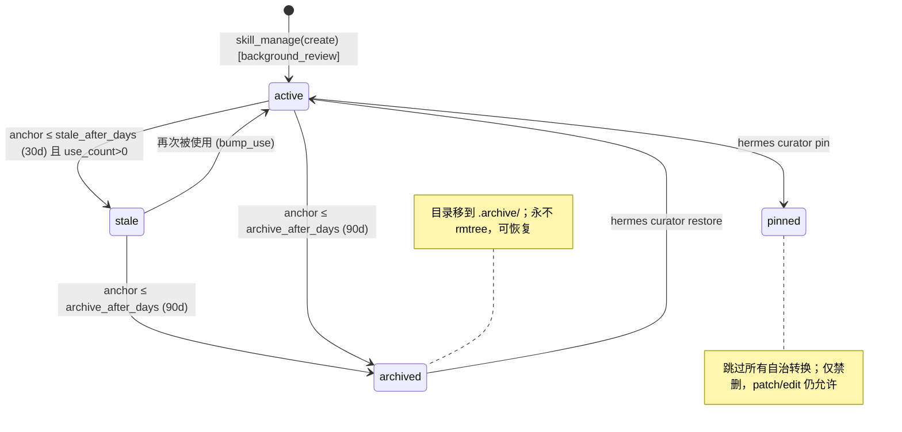

# 第五篇　技能系统与 Curator

*作者：Amlei　·　更新时间：2026-08-08*

> 技能（Skill）是 Hermes 区别于普通代理框架的核心特征。本篇剖析技能如何被定位为"过程记忆"、如何被加载并以缓存友好的方式注入、代理如何自治地创建与改进技能、以及 Curator 如何作为一个无人值守的维护回路，让技能库在长期使用中保持精炼而不致腐化。

---

## 第 1 章　技能作为"过程记忆"

Hermes 把技能定位为智能体的**过程记忆 / 过程知识（procedural memory）**，与**陈述性记忆**（declarative memory，即 `MEMORY.md`、`USER.md`）刻意区分（`tools/skill_manager_tool.py:10-12`）：

> 技能窄而可执行（how），记忆广而陈述（what）。

### 1.1　为何是技能而非新工具

CLAUDE.md 的 "Adding New Tools" 给出明确判断：**大多数新能力应当是技能，而不是工具**。工具只有在需要端到端 API 鉴权流、必须每次精确执行的二进制/流式/实时逻辑时才被需要。技能则是"文本指令 + 脚本 + 既有工具"的组合体，本质上是给模型的一份操作手册，复用 `terminal`、`read_file`、`web_search` 等通用工具来落地。因此技能的编写/修改成本极低（编辑 markdown），且可由智能体自身在运行时创作和修订，形成**自改进闭环**。

### 1.2　闭环学习回路

Curator 的核心使命把这个闭环说清楚（`agent/curator.py:1-20`）：智能体从经验中**创建**技能、在**使用中改进**技能、把**过时的归档**。三者构成无人值守的自治维护回路。

### 1.3　Footprint Ladder：渐进式披露

这是贯穿技能系统的架构，在 `tools/skills_tool.py:9-13` 被显式命名：

- **Tier 1（最小足迹）**：`skills_list` 只返回 `name + description`，用于系统提示中的技能索引；
- **Tier 2（中等足迹）**：`skill_view(name)` 加载完整 `SKILL.md` 正文；
- **Tier 3（按需足迹）**：`skill_view(name, file_path="references/x.md")` 才加载 `references/`、`templates/`、`scripts/`、`assets/` 中的支撑文件。

系统提示中的技能索引把 description 截断到 `SKILL_PROMPT_DESC_LIMIT = 60` 字符（`agent/skill_utils.py:849`），所以"触发词必须落在前 57 字符窗口内"。智能体只靠 description 匹配来路由技能，而不是靠精确名字。

---

## 第 2 章　SKILL.md 结构与 frontmatter

### 2.1　目录布局

标准布局支持扁平与分类嵌套两种：

```
skills/
├── my-skill/
│   ├── SKILL.md              # 必需，主指令
│   ├── references/           # 支撑文档（按需加载）
│   ├── templates/            # 输出模板
│   ├── scripts/              # 可重跑脚本
│   └── assets/               # 补充文件
└── category/
    └── another-skill/
        └── SKILL.md
```

### 2.2　frontmatter 字段

| 字段 | 说明 |
|------|------|
| `name` | ≤64 字符，正则 `^[a-z0-9][a-z0-9._-]*$` |
| `description` | 新建时强制 ≤60 字符以适配系统提示预算 |
| `version` / `author` / `license` | 元数据 |
| `platforms` | OS 门控，如 `[macos, linux]`，映射到 `sys.platform` 前缀 |
| `required_environment_variables` | 缺失时通过 secret-capture 回调交互式采集 |
| `required_credential_files` | 如 `google_token.json`，注册进远端沙箱挂载 |
| `metadata.hermes.tags` / `category` / `related_skills` | 分类与关联 |
| `metadata.hermes.config` | 声明依赖的 config.yaml 键，注入时把解析值附在消息里 |
| `metadata.hermes.requires_toolsets` | 如 `[terminal]` |
| `metadata.hermes.supersedes` | 取代的旧技能名 |

### 2.3　现代正文章节顺序

社区约定的章节顺序：`# <Skill> Skill` 标题 → 简介 → `## When to Use` → `## Prerequisites` → `## How to Run` → `## Quick Reference` → `## Procedure` → `## Pitfalls` → `## Verification`。`skill_manage` 的 schema 强调："Good skills: trigger conditions, numbered steps with exact commands, pitfalls section, verification steps."

---

## 第 3 章　技能加载与注入机制

### 3.1　发现与扫描

`scan_skill_commands()`（`agent/skill_commands.py:374-467`）扫描 `~/.hermes/skills/` 与 `skills.external_dirs`，对每个 `SKILL.md`：跳过 `.git/.github/.hub/.archive` 等元目录；做 OS/运行时门控；读 frontmatter 的 `name`，按"局部优先"去重；尊重 `skills.disabled` 配置；把 `name` 规范化为 hyphen slug；与核心 slash 命令去碰撞（碰撞则只禁用自动注册，仍可 `/skill <name>` 加载）。

```python
# agent/skill_commands.py:410-437（节选）
name = frontmatter.get('name', skill_md.parent.name)
if name in seen_names:          # 局部优先去重
    continue
if name in disabled:            # 尊重 skills.disabled
    continue
seen_names.add(name)
# 规范化为 hyphen slug，剥掉非字母数字字符（如 +、/），
# 否则下游会生成非法的 Telegram 命令名。
cmd_name = name.lower().replace(' ', '-').replace('_', '-')
cmd_name = _SKILL_INVALID_CHARS.sub('', cmd_name)
cmd_name = _SKILL_MULTI_HYPHEN.sub('-', cmd_name).strip('-')
if not cmd_name:
    continue
# 与核心 Hermes slash 命令碰撞 → 只禁用自动注册，
# 仍可通过 /skill <name> 显式加载。
if resolve_command(cmd_name) is not None:
    continue
```

`skills_list` 工具带**会话级缓存**：缓存签名 = 各扫描目录的 `max(自身 mtime, 直接子目录 mtime)` + 禁用集合 + 平台，TTL 30 秒。这个签名设计是为了用一次 `scandir` 捕捉"在分类目录里新增/删除技能"这类**不抬升根目录 mtime** 的变化。

### 3.2　技能 slash 命令的工作流

`build_skill_invocation_message()`（`skill_commands.py:569-613`）把 `/skill-name <instruction>` 展开成模型可见消息：

1. `_load_skill_payload()` 调 `skill_view` 拿到正文；
2. `bump_use(skill_name)` 记录遥测；
3. 构造 activation note：`[IMPORTANT: The user has invoked the "skill-name" skill ...]`；
4. 拼接：activation note → 正文 → `[Skill directory: <abs path>]` → `[Skill config ...]` → setup note → 支撑文件清单 → 用户指令。

```python
# agent/skill_commands.py:595-613
# 记录遥测：本次调用计入 use_count，供 Curator 生命周期判定
try:
    from tools.skill_usage import bump_use
    bump_use(skill_name, task_id=task_id)
except Exception:
    pass  # 遥测失败不影响技能调用

activation_note = (
    f'[IMPORTANT: The user has invoked the "{skill_name}" skill, indicating they want '
    "you to follow its instructions. The full skill content is loaded below.]"
)
return _build_skill_message(
    loaded_skill, skill_dir, activation_note,
    user_instruction=user_instruction,
    runtime_note=runtime_note,
    session_id=task_id,
)
```

### 3.3　为何注入为 USER 消息而非系统提示

这是**整个系统最关键的设计决策之一**，目的是**保护提示缓存**。`reload_skills()`（`skill_commands.py:485-547`）的注释直白陈述：

> 这不会使技能的系统提示缓存失效。技能通过 `/skill-name`、`skills_list` 或 `skill_view` 按名调用——它们不需要进入系统提示。保持提示缓存完好，可在重载期间保留前缀缓存。

系统提示只装载**最窄的 Tier-1 索引**（name + 截断 description）；技能正文通过 USER 消息在调用时注入，因此增删改技能不会击穿前缀缓存。

### 3.4　`/skills install --now`：缓存感知的延迟失效

```python
# hermes_cli/skills_hub.py:1900-1910
# --now 立即失效提示缓存（花费更多）。
# 默认：延迟到下一会话以保留缓存。
invalidate_cache = "--now" in args
```

默认（无 `--now`）：技能已落盘但**不**清缓存，提示用户"技能将在下一会话可用；使用 /reset 或 --now 立即激活（失效提示缓存）"。这是一个用"下一次会话才生效"换"当前会话不付缓存重建成本"的明确权衡。

### 3.5　堆叠调用

`/skill-a /skill-b do XYZ` 会加载最多 5 个前导技能（`_MAX_STACKED_SKILLS = 5`，`skill_commands.py:630`）。堆叠消息刻意复用 bundle 脚手架标记，使 `extract_user_instruction_from_skill_message()` 无需新标记即可工作——该函数从脚手架标记中只回收用户真实指令，避免记忆 provider 把整段技能正文误存。

```python
# agent/skill_commands.py:47-55（脚手架标记 —— 构建器与回收器共享的字节契约，
# 必须与 _build_skill_message / build_bundle_invocation_message 逐字节一致）
_SKILL_INVOCATION_PREFIX = "[IMPORTANT: The user has invoked the "
_SINGLE_SKILL_MARKER = "The full skill content is loaded below.]"
_SINGLE_SKILL_INSTRUCTION = (
    "The user has provided the following instruction alongside the skill invocation: "
)
_RUNTIME_NOTE = "\n\n[Runtime note:"
_BUNDLE_MARKER = " skill bundle,"
_BUNDLE_USER_INSTRUCTION = "\nUser instruction: "
_BUNDLE_FIRST_SKILL_BLOCK = "\n\n[Loaded as part of the "
```

---

## 第 4 章　skill_manage 工具与写守卫

`skill_manage` 工具（`skill_manager_tool.py:1763`，toolset=`skills`）提供六个 action：`create` / `edit` / `patch` / `delete` / `write_file` / `remove_file`。

```python
# tools/skill_manager_tool.py:1763-1781
registry.register(
    name="skill_manage",
    toolset="skills",
    schema=SKILL_MANAGE_SCHEMA,
    handler=lambda args, **kw: skill_manage(
        action=args.get("action", ""),
        name=args.get("name", ""),
        content=args.get("content"),
        category=args.get("category"),
        file_path=args.get("file_path"),
        file_content=args.get("file_content"),
        old_string=args.get("old_string"),
        new_string=args.get("new_string"),
        replace_all=args.get("replace_all", False),
        absorbed_into=args.get("absorbed_into"),  # 声明 delete 意图
        task_id=kw.get("task_id"),
        session_id=kw.get("session_id")),
    emoji="📝",
)
```

- **create**：校验 → 碰撞检测 → `atomic_write_text(SKILL.md)` → 安全扫描（可选回滚）。
- **patch**：定向 find-and-replace，复用 `fuzzy_match.fuzzy_find_and_replace` 容忍空白/缩进差异。
- **delete**：关键参数 `absorbed_into`（声明意图）。**在 background-review 上下文中，delete 强制走可恢复归档**（`archive_skill`）而非 `rmtree`——这是 #29912 事故后的硬化。
- **write_file / remove_file**：支撑文件必须落在 `ALLOWED_SUBDIRS = {"references","templates","scripts","assets"}`，经 `validate_within_dir` 防穿越。

### 4.1　多层写守卫

`skill_manage` 串了一长串守卫，这是系统最精巧的部分：

- **skills 写审批门**（`_apply_skill_write_gate`）：可 stage 待审批。
- **background-review 写守卫**（`_background_review_write_guard`）：自治 curator fork 的写面被严格收窄——拒绝写 external/bundled/hub-installed/protected-builtin/pinned 技能，以及第 6 道：**非 curator-managed 的用户技能**。

```python
# tools/skill_manager_tool.py:387-397（第 6 道收窄的 #67140 不变量 ——
# 缺记录与 created_by=null 必须同构失败，否则"允许恰好一次"是自相残杀）
# A MISSING record and an explicit `created_by: null` must resolve
# IDENTICALLY (issue #67140). Keying on `isinstance(usage_rec, dict)`
# made the policy depend on the guard's own side effect: a local skill
# with no telemetry record passed, the successful write called
# bump_patch() which created a `created_by: null` record, and the very
# same write was refused from then on. "Allowed exactly once" is not a
# policy — it is a race with our own bookkeeping. Fail closed for both
# shapes; `hermes curator adopt <name>` is the supported way in.
usage_data = skill_usage.load_usage()
usage_rec = usage_data.get(name)
if not skill_usage._is_curator_managed_record(usage_rec):
```
- **read-before-write 守卫**：要求 fork 在改写前必须先用 `skill_view` 读过该确切文件，禁止凭推断改内容。
- **curator 合并 delete 守卫**：#29912 后的 fail-closed——curator 的 LLM 合并 pass 里，无 `absorbed_into` 的裸 delete 一律拒绝。
- **pinned 守卫**：pinned 技能禁删（但可 patch/edit）。
- **org-mirror 写守卫**：org 共享技能可就地编辑（学习闭环的关键），但不可删除。

与 provenance 守卫正交的是 `_validate_delete_target`——`rmtree` 前最后一道闸，专防被污染的 skills 树让递归删除越出根目录（对应 Kilo Code #11227 那类"内置技能哨兵解析到 cwd、递归删 wipes 整个工作目录"的事故）：

```python
# tools/skill_manager_tool.py:221-231（_validate_delete_target 的三道拒绝条件）
This is the matching defense-in-depth for our agent-facing ``skill_manage`` delete
path: even if discovery or a poisoned tree hands us a bad directory, never
recursively delete

  1. a path that is not strictly *inside* one of the known skills roots,
  2. a skills root itself (would wipe every installed skill), or
  3. a directory reached via a symlink / junction (``rmtree`` would follow
     it into content outside the skills tree).

Returns an error string to refuse on, or ``None`` when the delete is safe.
```

成功写入后做三件副作用：(1) 失效系统提示缓存；(2) 遥测（create→`record_created`、patch→`bump_patch`）；(3) 去抖动 sync 推送。

---

## 第 5 章　skill_provenance：来源分类

`tools/skill_provenance.py` 的核心是一个 `ContextVar`，信号搭载在 `AIAgent._memory_write_origin` 上：review fork 实例被设为 `"background_review"`，普通前台智能体默认 `"foreground"`。

**为何来源门控 curator 行为**：curator 只能整并/裁剪它**自治创建**的技能（background-review fork 写的）；用户让前台智能体写的技能属于用户，**绝不**被自治 curator 触碰。

需要注意一个命名警示（issue #67140）：磁盘字段叫 `created_by`，读起来像"来源"（历史事实），但它**实际被当作 curator 管理的准入策略标志位**消费。对老记录而言"来源"是不可恢复的历史；"管理"是用户可随时改的策略（`hermes curator adopt`）。代码保留字段名是为了不抛弃存量磁盘记录。

---

## 第 6 章　Skills Hub 与信任分级

`tools/skills_hub.py` 定义了 `SkillSource` ABC 与多个实现：`OptionalSkillSource`（扫描仓库自带的 `optional-skills/`，优先级最高）、`GitHubSource`（默认 taps 含 openai/skills、anthropics/skills 等，用 Git Trees API 单请求拉整树）、`WellKnownSkillSource`、`UrlSource`、`SkillsShSource`。

### 6.1　信任分级与安装策略

| 信任级 | safe | caution | dangerous |
|--------|------|---------|-----------|
| builtin（随 Hermes 发行） | allow | allow | allow |
| trusted（openai/anthropics/hf/nvidia） | allow | allow | block |
| community（其他一切） | allow | block | block |
| agent-created（智能体自创） | allow | allow | ask |

dangerous + community/trusted 不可被 `--force` 覆盖。

### 6.2　安装流

`do_install`：解析源 → fetch bundle → 落 quarantine → `scan_skill` → `should_allow_install` 决策 → 写入 `~/.hermes/skills/<category>/<name>/` → 在 `.hub/lock.json` 登记 provenance。`_resolve_lock_install_path` 对 install_path 做了三层防御（逐组件查 symlink/junction、resolve 后拒绝逃逸），防止被污染的 lock 条目让 `rmtree` 擦掉整树。

```python
# tools/skills_hub.py:278-291（三层防御：逐组件查 redirect → resolve 后
# 既拒逃逸、也拒 resolved==skills_root 自身，后者防空 install_path 擦整树）
normalized = _normalize_lock_install_path(install_path, skill_name)
skills_dir = _skills_dir()
skills_root = skills_dir.resolve()

target = skills_dir
for part in normalized.split("/"):
    target = target / part
    if _is_path_redirect(target):
        raise ValueError(f"Unsafe install path: {install_path}")

target = target.resolve()
if target == skills_root or not target.is_relative_to(skills_root):
    raise ValueError(f"Unsafe install path: {install_path}")
return target
```

### 6.3　Sync 机制

`tools/skills_sync.py` 是 bundled skills 的种子/更新层。更新逻辑：bundled 仍等于 origin_hash→跳过；bundled 变且用户副本等于 origin→安全更新；bundled 变且用户副本不同→**视为用户定制、永远跳过**。`reset_bundled_skill` 打破"用户改过→永久跳过"的死循环。

---

## 第 7 章　skill_usage 遥测：`.usage.json` 旁车

`tools/skill_usage.py` 把运维遥测放在**旁车文件**而非 frontmatter，避免对 bundled/hub 技能造成冲突压力。文件位于 `~/.hermes/skills/.usage.json`，按技能名索引；原子写（tempfile + `os.replace`）；跨进程锁（`fcntl`/`msvcrt`）。所有计数 bump 都是 best-effort，失败只 DEBUG 记录。

记录字段：`created_by`（None/"agent"/"installed"）、`use_count`、`view_count`、`patch_count`、`last_used_at`、`state`（active/stale/archived）、`pinned`、`archived_at`。

```python
# tools/skill_usage.py:644-659
def _empty_record() -> Dict[str, Any]:
    return {
        "created_by": None,          # None / "agent" / "installed"
        "use_count": 0,
        "view_count": 0,
        "last_used_at": None,
        "last_viewed_at": None,
        "patch_count": 0,
        "patch_generation": 0,
        "last_reused_patch_generation": 0,
        "last_patched_at": None,
        "created_at": _now_iso(),
        "state": STATE_ACTIVE,        # active / stale / archived
        "pinned": False,
        "archived_at": None,
    }
```

关键派生量 `latest_activity_at` 取 use/view/patch 之最大值，**故意排除 created_at**，以便区分"从未活动的技能"。

---

## 第 8 章　Curator 生命周期

`agent/curator.py` 把 Curator 定义为"auxiliary-model task that periodically reviews agent-created skills"——**非 cron 守护**，而是空闲触发的：当智能体空闲且上次运行早于 `interval_hours` 前，fork 一个 AIAgent 做评审。

### 8.1　调度门槛

- `curator.enabled`（默认 ON）；
- 非 paused；
- `last_run_at` 存在且早于 `interval_hours`。

**首次运行行为**：无 `last_run_at` 时不立即跑，而是把 `last_run_at` 种为"现在"、推迟一个完整 interval——避免 `hermes update` 后第一个后台 tick 就自治改库。

### 8.2　阈值默认值

```
DEFAULT_INTERVAL_HOURS    = 24 * 7   # 7 天
DEFAULT_MIN_IDLE_HOURS    = 2        # 智能体至少空闲 2 小时才触发
DEFAULT_STALE_AFTER_DAYS  = 30       # 30 天未活动 → stale
DEFAULT_ARCHIVE_AFTER_DAYS= 90       # 90 天未活动 → archived
DEFAULT_CONSOLIDATE       = False    # LLM 合并 pass 默认关
```

### 8.3　自治状态机（纯函数，无 LLM）

`apply_automatic_transitions` 遍历每个 curator-managed 技能：pinned 跳过；cron 引用的技能跳过（调度器只在 job 真触发时才 bump usage）；计算 `anchor = last_activity 或 created_at 或 now`；**never-used 优雅地板**：`use_count==0` 且年轻于 stale 窗口→完全不动（"use=0 是证据缺失，不是过时证据"）。

```python
# agent/curator.py:357-382
current = row.get("state", _u.STATE_ACTIVE)
# never-used 优雅地板：use_count==0 且年轻于 stale 窗口 → 不动
never_used = int(row.get("use_count", 0) or 0) == 0
if never_used and anchor > stale_cutoff:
    if current == _u.STATE_STALE:
        _u.set_state(name, _u.STATE_ACTIVE)
        counts["reactivated"] += 1
    continue

if anchor <= archive_cutoff and current != _u.STATE_ARCHIVED:
    ok, _msg = _u.archive_skill(name)        # 90d 未活动 → archived
    if ok:
        counts["archived"] += 1
elif anchor <= stale_cutoff and current == _u.STATE_ACTIVE:
    _u.set_state(name, _u.STATE_STALE)       # 30d 未活动 → stale
    counts["marked_stale"] += 1
elif anchor > stale_cutoff and current == _u.STATE_STALE:
    _u.set_state(name, _u.STATE_ACTIVE)      # 再次使用 → reactivate
    counts["reactivated"] += 1
```



### 8.4　LLM 合并 pass（默认关）

`run_curator_review` 是编排器：先跑确定性转换；预运行 tar.gz 快照；写 `.curator_state`；`consolidate` 决定是否 fork LLM。默认 OFF——关时只跑确定性裁剪、**零 aux-model 成本**。

LLM pass 在 `_run_llm_review` 里 fork `AIAgent`，关键参数：`enabled_toolsets=["skills","terminal"]`、`quiet_mode=True`、`platform="curator"`、`skip_context_files=True`、`skip_memory=True`，并设 `review_agent._memory_write_origin = "background_review"` 以触发 skill_manage 的写守卫。

### 8.5　LLM 评审 prompt

`CURATOR_REVIEW_PROMPT` 把 Curator 定位为"**伞形构建**（umbrella-building）合并 pass，而非被动审计或重复查找器"：

> 技能集合的目标是一个类级指令与经验知识的库。数百个窄技能各自捕获一次会话的特定 bug，是这个库的失败。

硬规则：不碰 bundled/hub/external；**永不删除，只归档**；跳过 pinned；保护内置；cron 引用的技能不可裁但可并入伞形；不用 use_count 当跳过/裁剪理由。三种合并手法：(a) 并入既有伞形；(b) 建新伞形 + 归档兄弟；(c) 降级为支撑文件。**包完整性**要求：源技能若有 support 文件或相对链接，必须整体迁移或整体归档，绝不留死链。

```python
# agent/curator.py:417-432
CURATOR_REVIEW_PROMPT = (
    "You are running as Hermes' background skill CURATOR. This is an "
    "UMBRELLA-BUILDING consolidation pass, not a passive audit and not a "
    "duplicate-finder.\n\n"
    "The goal of the skill collection is a LIBRARY OF CLASS-LEVEL "
    "INSTRUCTIONS AND EXPERIENTIAL KNOWLEDGE. A collection of hundreds of "
    "narrow skills where each one captures one session's specific bug is "
    "a FAILURE of the library — not a feature. ... One broad umbrella "
    "skill with labeled subsections beats five narrow siblings for "
    "discoverability, not the other way around.\n\n"
)
```

### 8.6　curator_backup：tar.gz 快照与回滚

`agent/curator_backup.py` 预运行 tar.gz 快照存于 `~/.hermes/skills/.curator_backups/<UTC-ISO>/`。`rollback` 策略：先对当前树拍安全快照（使回滚自身可撤销）；解压快照（Python 3.12+ 用 `filter="data"`，显式拒绝对路径与 `..`）；失败则还原。

```python
# agent/curator_backup.py:605-617（rollback 第 2 步 —— 安全快照必须先于一切改动，
# 且 protect_ids 把目标快照从 prune 中豁免，否则 steady-state 下它会被剪掉）
# Step 2: safety snapshot of current state FIRST. If this fails we bail
# out before touching anything — otherwise a failed extract could leave
# the user with no skills.
try:
    # Protect the target from this snapshot's prune step: at the steady
    # keep limit, pruning the oldest snapshot would otherwise delete the
    # very snapshot we are about to extract from.
    snapshot_skills(
        reason=f"pre-rollback to {target.name}",
        protect_ids={target.name},
    )
except Exception as e:
    return (False, f"pre-rollback safety snapshot failed: {e}", None)
```

---

## 第 9 章　skills_guard / skills_ast_audit：验证与审计

`tools/skills_guard.py` 是进程内正则静态扫描器，SECURITY.md 把它定位为"useful — not boundaries"（提示，而非边界）。`THREAT_PATTERNS` 覆盖 exfiltration、prompt injection、destructive、persistence、network、obfuscation、supply chain、crypto mining、硬编码密钥、不可见 Unicode。结构检查：文件数 ≤50、总大小 ≤1MB、可疑二进制扩展名、symlink 逃逸。裁定：有 critical→dangerous、有 high→caution、仅 medium/low→safe。

```python
# tools/skills_guard.py:101-107（THREAT_PATTERNS —— 五元组）
THREAT_PATTERNS = [
    # (regex, pattern_id, severity, category, description)
    (r'curl\s+[^\n]*\$\{?\w*(KEY|TOKEN|SECRET|PASSWORD|CREDENTIAL|API)',
     "env_exfil_curl", "critical", "exfiltration",
     "curl command interpolating secret environment variable"),
    # ...覆盖 exfiltration / injection / destructive / persistence / network /
    #     obfuscation / supply_chain / mining / credential_exposure 约 80 条
]

# tools/skills_guard.py:526-529（编译一次，scan_file 逐行扫描）
_COMPILED_THREAT_PATTERNS = [
    (re.compile(pattern, re.IGNORECASE), pid, severity, category, description)
    for pattern, pid, severity, category, description in THREAT_PATTERNS
]
```

`tools/skills_ast_audit.py` 是选开的 AST 深度审计（`hermes skills audit --deep`），扫描 `importlib.import_module`、`__import__(<computed>)` 等动态导入，供人工复审第三方技能代码。

---

## 第 10 章　为何如此设计：权衡的总账

1. **技能 vs 工具**：技能编写/修改成本低、可由智能体自改进、靠渐进式披露控 token；工具用于必须每次精确执行的逻辑。
2. **过程记忆隐喻**：技能是智能体唯一可在运行时**自治写入、自治维护、自治归档**的知识形态。
3. **为什么自改进**：闭环是 Curator 的存在理由。LLM 合并 pass 默认关（成本），确定性裁剪默认开（零成本）；合并而非裁剪是首选——"一个宽伞形带子节，胜过五个窄兄弟"。
4. **可恢复性优先于简洁性**：永不删除、只归档；预运行快照；rollback 自身可撤销；delete 在 background-review 中强制走 `archive_skill`——这些都是 #29912 等事故后的硬化。
5. **Provenance 是声明不是推断**：重 patch/use 计数只证明"维护"、不证明"作者身份"，所以 `adopt` 永不自动、只能用户显式声明。
6. **写守卫的分层**：前台智能体（用户在场、可写 external/bundled/hub）vs background-review fork（无用户、写面收窄到局部 curator-owned）——同一 `skill_manage` 工具在两种上下文下行为不同，靠 ContextVar 区分。

---

*第五篇完。下一篇进入终端执行与多后端环境，剖析同一套终端工具如何在七种后端上执行，以及危险命令审批如何在不破坏能力的前提下守住边界。*
