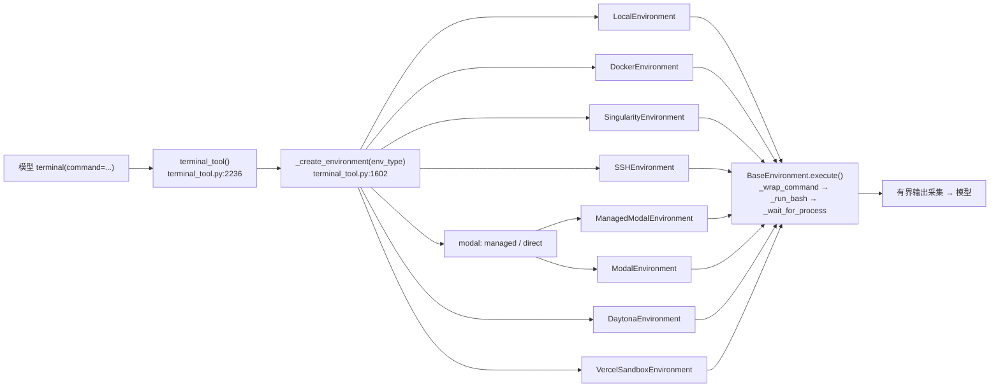
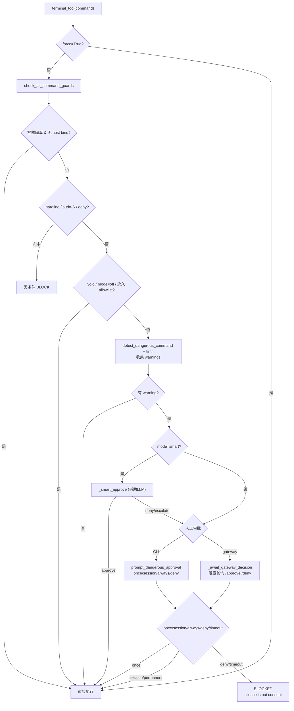

# 第六篇　终端执行与多后端环境

*作者：Amlei　·　更新时间：2026-08-08*

> 终端工具是代理的"主执行器（primary actuator）"——模型产生文件改动、运行构建、操作 git 的唯一通道。本篇剖析它如何用一套抽象同时支撑七种执行后端、如何管理长寿命容器与会话快照、以及危险命令审批如何在"能力"与"安全"之间走钢丝。

---

## 第 1 章　设计目标

终端工具被定位为 shell 执行接口（`tools/terminal_tool.py:1069-1078`），并通过引导语把"读"操作分流给专用工具、把终端保留给"真正需要 shell"的场景：构建、安装、git、进程、脚本、网络、包管理器。

**多后端的根本动机是"在哪里运行"的解耦**。设计意图是让同一份代理逻辑能落在 5 美元 VPS（ssh/local）、GPU 集群（singularity）、无服务器（modal/vercel/daytona）、隔离容器（docker）任一目标上，而**模型对此完全无感**——它只调用 `terminal(command=...)`。

抽象的统一契约是"**spawn-per-call + 会话快照**"模型（`tools/environments/base.py:1-7`）：每条命令都 fork 一个全新的 `bash -c` 进程，但在初始化时一次性捕获登录 shell 的环境快照（env 变量、函数、别名），并在每条命令前 `source` 该快照。CWD 通过带内 stdout 标记跨命令持久。这样所有后端共享同一套"环境状态在命令间持久"的体感，而无需任何后端维护长寿命 shell 进程。

---

## 第 2 章　后端抽象

`BaseEnvironment`（`base.py:527-1371`）是 ABC，子类只需实现 `_run_bash()`（`576-589`）与 `cleanup()`（`591-594`）。基类提供：

- **`execute()`**（`1290-1350`）：统一执行流——调 `_prepare_command`（sudo 变换）→ 可选 `_rewrite_compound_background`（修 `A && B &` 子 shell 陷阱）→ `_wrap_command` 包装 → `_run_bash` → `_wait_for_process` → `_update_cwd`。
- **会话快照**：`init_session`（`634-755`）一次性捕获登录 shell 的 `export -p` + 函数（按名过滤 `_` 前缀的私有 helper）+ 别名；用 `mktemp + mv` **原子替换**快照文件，避免并发 `source` 读到半写文件。快照中**排除**会话身份变量（`HERMES_SESSION_*` 等），因为单一长寿命后端会服务多个会话。
- **CWD 标记**：`_cwd_marker` 格式 `__HERMES_CWD_{session_id}__`；`_wrap_command` 在命令尾注入 `printf '\n{marker}%s{marker}\n' "$(pwd -P)"`，`_extract_cwd_from_output` 解析并剥离。

**工厂** `_create_environment`（`terminal_tool.py:1602-1767`）是 `env_type → 实例` 的 if/elif 链（非注册表）：

---

## 第 3 章　逐后端深挖

### 3.1　local

`LocalEnvironment`（`local.py:1414-1688`）纯 spawn-per-call。`_run_bash` 用 **`start_new_session=True`**（不是 `preexec_fn=os.setsid`，后者在多线程应用不安全）让子进程成为新会话/进程组 leader；Windows 走 `creationflags=windows_hide_flags()` 隐藏控制台。`_kill_process` 据此做整组杀：`os.killpg(pgid, SIGTERM)` → 等 1s → `SIGKILL -pgid`。

`build_subprocess_env`（`local.py:659-719`）是非终端 spawn 的统一 env 工厂（浏览器、ACP 执行器、TUI Node host），`scrub_secrets=True` 时剥离 provider 密钥 blocklist + Hermes 内部密钥。

### 3.2　docker

容器是**长寿命 detached**：`docker run -d --name hermes-<8hex> --label hermes-agent=1 --label hermes-task-id=... -w <cwd> <image> sleep infinity`，**无 `--rm`**，由 cleanup + orphan reaper 管理。

**跨进程持久**（issue #20561）：`persist_across_processes=True`（默认）时，构造期先用 `_find_reusable_container` 按 `(task_id, profile)` 标签 `docker ps -a` 探测，命中则 attach 并按需 `docker start`。`cleanup(force_remove=False)` 在 persist 模式下是**空操作**——容器继续运行。

**Orphan reaper**：模块级，扫 `label=hermes-agent=1 + status=exited + FinishedAt 旧于 600s` 的容器 `docker rm -f`。这是 SIGKILL/OOM 绕过 `atexit` 的安全网。

**持久文件系统**：`persistent_filesystem=True` 时把 `get_sandbox_dir()/docker/<task_id>` bind 进容器（`home → /root` 始终，`workspace → /workspace` 除非已被 host_cwd 覆盖）。host_cwd → `/workspace`（`auto_mount_cwd`）：把宿主 cwd bind 到 `/workspace`，**这会触发审批**——`_docker_has_host_access` 检测此状态，让 docker 后端不再走容器快速路径。

### 3.3　singularity / ssh

- **singularity**（HPC）：`_get_or_build_sif` 把 `docker://` 引用一次性构建成本地 `.sif` 缓存；`apptainer instance start --containall --no-home`（安全硬化）+ `--overlay <dir>`（持久）或 `--writable-tmpfs`。
- **ssh**：**ControlMaster 连接复用**（socket 文件名用 `sha256(user@host:port)[:16]`，避开 macOS 的 104 字节 `sun_path` 限制）。文件同步是核心复杂度：`FileSyncManager`（`file_sync.py`）按 mtime+size 跟踪 `~/.hermes` 下的凭据/技能/缓存文件，每次执行前 rate-limit 增量同步；批量上传用 **tar-over-ssh** 把 N 文件压成单 TCP 流。

### 3.4　modal（direct + managed）

两种 transport 共享 `modal_utils.BaseModalExecutionEnvironment`，后者重写了 `execute()`——因为命令准备、CWD 跟踪在 gateway/SDK 侧，base 的 `_wrap_command`/`_wait_for_process` 不适用。

- **Direct**：用原生 Modal SDK，`_AsyncWorker` 驱动 `modal.Sandbox.create("sleep","infinity")`。**持久模型**：cleanup 时 `sandbox.snapshot_filesystem()` 存快照 ID，下次构造时从快照恢复。docstring 明确：持久文件系统保留工作状态，但**不保证同一沙箱或长寿命进程在清理/空闲回收/Hermes 退出后存活**。
- **Managed**：经 Nous Tool Gateway 的 HTTP API，鉴权用 Nous user token。

### 3.5　daytona / vercel_sandbox

- **daytona**：用 Daytona Python SDK，`persistent=True` 时先尝试恢复并 `.start()`，否则 `create(CreateSandboxFromImageParams(..., auto_stop_interval=0))`。cleanup：持久则 `.stop()`（文件系统保留），否则 `.delete()`。
- **vercel_sandbox**：用 Vercel SDK，运行时受限（node24/node22/python3.13），鉴权用 OIDC token 或 `VERCEL_TOKEN+PROJECT_ID+TEAM_ID` 三件套。cleanup 先 `sync_back` 再 `sandbox.snapshot()` 存盘再 `.stop()`。

---

## 第 4 章　输出回流与环境缓存

### 4.1　有界输出采集

前台命令通过 `env.execute(..., bounded_capture=True)` 执行。`BaseEnvironment._wait_for_process`（`base.py:891-1210`）是跨后端共享的等待循环：用 `select()` 非阻塞排空 stdout，自适应轮询从 5ms 退避到 200ms，并在轮询中检查 `is_interrupted()`（用户 Stop 信号 → 杀进程组 → 返回 130）和超时（→ 124）。

输出在采集时就被 `_BoundedOutputCollector`（`base.py:55-204`）以 40/60 头尾窗口有界保留，避免 verbose 命令 OOM；溢出部分 tee 到 spill 文件（5MB cap），供模型用 `read_file`/`search_files` 取回中间部分而不必重跑命令。

### 4.2　环境缓存与生命周期

`_active_environments` 与 `_last_activity` 按 `task_id` 缓存环境。`_resolve_container_task_id`（`1274-1306`）是关键的"折叠"逻辑：顶层 agent 的 `task_id=None` 与所有 delegate 子 agent 的 ID 都**折叠为 `"default"`**，以便共享同一个长寿命容器；只有注册了隔离性 override 的 RL/benchmark 任务才获得独立沙箱。

清理走后台守护线程，每 60s 扫一次。**关键设计**：清理分两阶段——在 `_env_lock` 内只摘除追踪记录，**在锁外**才调用 `env.cleanup()`（modal/docker 拆除可阻塞 10-15s，锁内调用会卡住所有并发工具调用）。

### 4.3　失败提示

`_interpret_exit_code` 把 `grep=1`、`diff=1`、`curl=22/28` 等非错误非零码翻译成人类可读注释。`terminal_hints.py` 的 `annotate_failure` 在输出模式层补充——按生产频次排序的 7 个匹配器（merge conflict、command not found、permission denied 等）。这两层共同构成"让模型在下一轮修根因，而不是重新诊断"的反馈环。

---

## 第 5 章　审批机制（approval.py）

`approval.py`（4558 行）是三层防御 + 多渠道审批的整合。入口 `check_all_command_guards`（`approval.py:3738`）由终端工具在 `force=False` 时调用。

### 5.1　检测层

1. **容器快速路径**：docker（无 host bind）、singularity、modal、daytona、vercel_sandbox 跳过检测——隔离沙箱伤不到宿主。Docker 一旦 bind-mount 宿主路径就回到正常流程。
2. **Hardline 地板**（`434-483`）：不可恢复命令，**任何 session 设置都不能绕过**——`rm -rf /`（含 `//`、`..` 折叠、`$HOME`、引号变体）、`mkfs`、`dd of=/dev/sd*`、fork bomb、`shutdown/reboot`。`_CMDPOS` 锚点匹配命令起始位置，使 `echo reboot` 不触发误报。
3. **Sudo stdin 守卫**（`496-575`）：`SUDO_PASSWORD` 未配置时任何显式 `sudo -S` 都视为模型在暴力猜密码——无条件阻断。
4. **用户 deny 规则**（`approvals.deny`）。
5. **DANGEROUS_PATTERNS**（`693-955`）：约 47 条正则，覆盖递归删除、chmod 777、SQL DROP、systemctl stop、pkill -9、PowerShell `Remove-Item` 等。

### 5.2　去混淆

检测的核心是 `_command_detection_variants`，它生成命令的多个归一化变体以对抗混淆：引号内换行屏蔽、NFKC Unicode 归一化、`${IFS}` 折叠（`rm${IFS}-rf${IFS}/` 在 shell 中等价于 `rm -rf /`）、home 前缀折叠、grep 模式屏蔽、子 shell/brace 重锚、命令词去混淆。

### 5.3　审批决策

**Smart approval**（`_smart_approve`）：调辅助 LLM 评估，返回 approve/deny/escalate。防注入：剥 shell 注释、XML 定界、系统提示显式警告忽略命令内指令；操作员策略只追加进**系统**提示（可信通道），绝不混进 user message。`approve` 仅本次有效（不持久化 pattern）。

### 5.4　审批渠道

- **CLI**：`prompt_dangerous_approval` → 优先用注册的 approval_callback（prompt_toolkit 面板），否则走 `input()` + 守护线程 + timeout。选项 `[o]nce/[s]ession/[a]lways/[d]eny`。**Fail-closed 守卫**：若 prompt_toolkit 持有终端但本线程无回调，直接 deny 而非走 `input()` 死锁。
- **Gateway**：`_await_gateway_decision` 把审批入队、通知用户（按钮），然后 agent 线程在 `entry.event.wait()` 上**阻塞轮询**（每 1s 发心跳避免网关看门狗杀 agent），直到 `/approve`/`/deny` set event 或超时。

### 5.5　持久化

`approve_session` 写 session 级缓存；`approve_permanent` + `save_permanent_allowlist` 写 `~/.hermes` 永久 allowlist。永久白名单不含 shell 操作符（拒绝 `&&`/`||`/`;` 等走快捷路径）。

---

## 第 6 章　后台进程与通知

后台进程由 `process_registry.ProcessRegistry` 单例管理。`terminal(background=True)` 返回 `{session_id, pid, exit_code:0}` 即返回，不阻塞。

`ProcessSession` 字段：`id`（`proc_<12hex>`）、`command`、`pid`、`output_buffer`（滚动 200KB）、`notify_on_complete`、`watch_patterns`、watcher 路由元数据。限制：`MAX_PROCESSES=64`（LRU 剪枝）、`FINISHED_TTL_SECONDS=1800`。

**notify_on_complete**：进程退出时往 `completion_queue` 放一条事件。**watch_patterns**：reader 线程把新输出喂给 `_check_watch_patterns`，硬限速每会话每 15s 最多一条通知；连续 3 个 strike 窗口后**永久禁用 watch 并降级到 notify_on_complete**。

**完成检测与新回合触发**：
- **CLI**：`drain_notifications` 在 agent 回合后被消费，把 completion_queue 事件格式化成 `[IMPORTANT: Background process proc_xxx completed...]` 注入下一轮。
- **Gateway**：`_run_process_watcher`（`gateway/run.py:22297`）周期轮询进程状态，按 `display.background_process_notifications`（`all`/`result`/`error`/`off`）决定推送策略，完成后触发新 agent 回合。

设计不变量：完成通知**只在 idle 时浮现为新 turn**，绝不拼接到运行中的 turn。

---

## 第 7 章　路径安全与跨平台

- **workdir 注入防护**：`_validate_workdir` 用字符白名单拒绝 shell 元字符——Unicode 字母/数字允许（修复中文路径被拦截），shell 元字符一律拒；cwd 还会被 shlex-quote。
- **路径穿越**：`path_security.validate_within_dir` 用 `Path.resolve()` 跟随符号链接并 `relative_to(root)` 验证。
- **Windows**：`_find_bash` 探测便携 Git（`%LOCALAPPDATA%\hermes\git`，含 PortableGit/MinGit）→ 系统 Git for Windows；`_windows_to_msys_path` 把 `C:\Users\x` → `/c/Users/x`。
- **Termux**：无 `/tmp`，按 `TMPDIR`/`TMP`/`TEMP` 回退。

---

## 第 8 章　为何如此设计：权衡的总账

1. **后端抽象的成本**：所有后端塞进 spawn-per-call + 快照模型。代价是 SDK 后端（modal/daytona/vercel）必须用 `_ThreadedProcessHandle` 把阻塞调用包成线程 + pipe，丢失了真正的流式语义。Managed modal 因此单独重写 `execute()`，绕开 base。两套执行流是抽象泄漏的代价。
2. **持久 vs 进程存活**：modal/daytona/vercel 的"持久文件系统"只持久**文件系统快照**，不持久运行中的沙箱或进程。长寿命守护进程无法跨 Hermes 退出存活——这是 serverless 模型的根本约束。
3. **Docker 跨进程复用的张力**：默认兑现"一个长寿命容器跨会话共享"的承诺，但要求 orphan reaper + atexit join + profile 标签等多重机制防止泄漏。
4. **安全 vs 能力**：Hardline 地板 + sudo-stdin 守卫 + 用户 deny 规则**先于** yolo，确保"信任 agent 操作文件"不等于"信任 agent 格盘/关机"。容器后端默认跳过审批（隔离即安全），但 docker bind host 路径立即取消豁免。Smart approval 用"仅本次放行、不持久 pattern"限制误放后果。模型可见的 `force` 参数被刻意隐藏，避免模型自我授权。
5. **同步 vs 异步审批**：CLI 同步 `input()` 与 gateway 异步 `_await_gateway_decision` 共享同一决策核，但 gateway 路径要解决"agent 线程阻塞期间如何不被看门狗杀"（心跳）和"用户不回答怎么办"（fail-closed + "silence is not consent"）。

---

*第六篇完。下一篇进入 MCP 集成，剖析 Hermes 如何既消费外部 MCP 服务器、又作为 MCP 服务器向 IDE 输出能力。*
