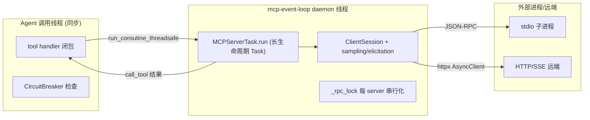
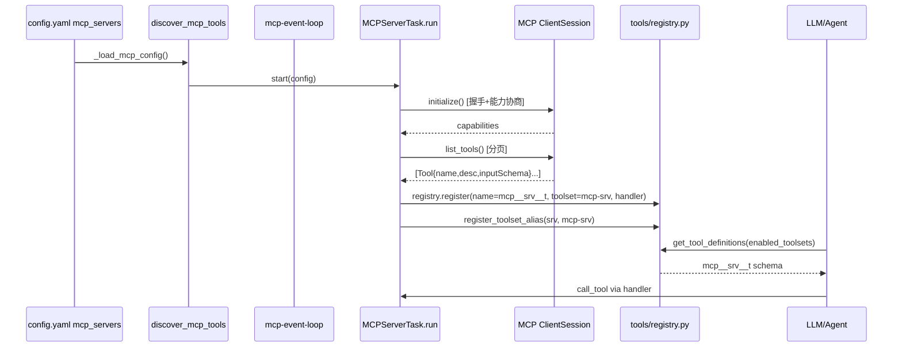

# 第七篇　MCP 集成

*作者：Amlei　·　更新时间：2026-08-08*

> MCP（Model Context Protocol）是 Hermes 的"外向毛细血管"：它既让 Hermes 消费任意外部 MCP 服务器、又让 Hermes 自身作为 MCP 服务器向外输出能力。本篇剖析这两个对称角色——客户端的传输层、工具发现与注册桥接、采样与 OAuth，以及服务器角色如何把跨平台消息会话桥接给 IDE。

---

## 第 1 章　设计目标：双向的通用扩展协议

Hermes 把 MCP 定位为**双向、通用的扩展协议**，而非单向的插件接口。两个对称角色同时存在：

- **客户端角色**（`tools/mcp_tool.py`，7230 行）：消费任意外部 MCP server（stdio 子进程或 HTTP/SSE 远端），把其 `tools/list` 暴露的工具**透明注册进 Hermes 的中央工具注册表**，使模型可像原生工具一样调用。
- **服务器角色**（`mcp_serve.py`，1037 行）：Hermes 自身通过 stdio 暴露一个 MCP server（`hermes mcp serve`），让 Claude Code、Cursor、Codex、Zed 等外部宿主把 Hermes 当作一个 MCP 工具源。

这种双向性使 Hermes 不必为每个第三方能力写一个原生 tool 模块，只需在 `~/.hermes/config.yaml` 加一条 MCP server 配置；新工具通过 `tools/list` 动态注入。

MCP Python SDK 是**可选依赖**。`mcp_tool.py` 用一连串 `try/except ImportError` 探测 `mcp`、`streamable_http`、`sse`、sampling 类型，并分别置位标志。SDK 缺失时整个模块降级为 no-op。

---

## 第 2 章　配置与加载

### 2.1　配置形态

两种传输由字段隐式区分：

- **stdio**：`command` + `args`（+ 可选 `env`）
- **HTTP/StreamableHTTP**：`url` + 可选 `headers`
- **SSE**：`url` + `transport: sse`

公共字段：`timeout`（单次工具调用，默认 300s）、`connect_timeout`（初始连接，默认 60s）、`keepalive_interval`（默认 180s）、`idle_timeout_seconds` / `max_lifetime_seconds`（stdio 回收）、`enabled`、`lazy`（懒启动）、`auth: oauth`、`tools: {include, exclude, resources, prompts}`、`sampling`、`elicitation`、`ssl_verify`、`client_cert` / `client_key`（mTLS）。

### 2.2　加载链路

`_load_mcp_config()`（`mcp_tool.py:4640`）执行五步：

1. `HERMES_SAFE_MODE` 为真时直接返回 `{}`（安全模式绕过所有 MCP）；
2. 读 `config["mcp_servers"]`；
3. 加载 `~/.hermes/.env`，使 `${VAR}` 插值可用；
4. **安全过滤**：`_filter_suspicious_mcp_servers()` 剔除"数据外泄形状"的配置（如 `command: curl ...| sh`）；
5. `_interpolate_env_vars()` 递归解析 `${VAR}` 与 Cursor 风格 `${env:VAR}`。

`hermes_cli/config.py` 还有一条**迁移期守卫**：每次配置迁移后扫描 `mcp_servers`，对判为可疑的条目**就地写 `enabled: false`** 并持久化，保留审计痕迹但不启动。这是针对历史恶意注入配置的防御。

---

## 第 3 章　客户端传输层深挖

### 3.1　专用后台事件循环

所有 MCP 连接跑在一个**专用 daemon 线程的 asyncio 事件循环**上。每个 MCP server 是该循环上一个长生命周期 `asyncio.Task`（`MCPServerTask`）。调用方（同步的 agent 线程）通过 `run_coroutine_threadsafe` 把协程调度到该循环，轮询 `future.result(timeout=0.1)` 以响应 `is_interrupted()` 用户中断。

关键设计约束：anyio cancel-scope 要求进入和退出 transport 的 `async with` 块发生在**同一个 Task** 中，所以整个连接生命周期必须封装在单一 Task 里。

### 3.2　stdio 传输

`_run_stdio()` 处理流程：

1. **环境净化**：`_build_safe_env()` 只放行白名单变量 + 外部 secret 源（Bitwarden/1Password）注入的变量 + 用户显式 `env:`，防止把 API key 泄漏给 MCP 子进程。
2. **OSV 恶意软件预检**：`check_package_for_malware(command, args)` 在子线程跑，12s 超时，失败即 fail-open。**必须在 watchdog 包装之前执行**。
3. **watchdog 包装**：在 POSIX 上把命令改写为 `sys.executable mcp_stdio_watchdog.py --ppid <mypid> -- <real command>`。
4. **孤儿清理**：spawn 前先 `_kill_orphaned_mcp_children()`。
5. **握手**：`session.initialize()` 握手结果存 `self.initialize_result`，供后续能力判定。

### 3.3　父死亡看门狗（mcp_stdio_watchdog.py）

这是 stdio 传输的**可靠性核心**。问题：macOS 没有 Linux 的 `prctl(PR_SET_PDEATHSIG)` 等价物，Hermes 进程被 `kill -9` 时，优雅回收代码不会执行，stdio 子进程变孤儿，反复重启会堆积 N 个孤儿争抢同一上游 SSE session。

解法是插入一个**纯标准库、启动极快的 supervisor 脚本**：

1. 以 `start_new_session=True` exec 真实命令作为自己的子进程（独立进程组，可 `killpg`）；
2. 透明中继 stdin/stdout/stderr——supervisor 是 no-op relay；
3. 后台线程每 2s 轮询 `getppid()`，与创建时记录的 `original_ppid` 比较；
4. 父进程一消失，立即 `_terminate_process_group` 并退出；
5. 还注册了 SIGTERM/SIGINT 转发，让优雅关闭路径的 `killpg` 仍能传达——否则 watchdog 包装会反转它要修复的 bug。

### 3.4　HTTP / StreamableHTTP 传输

`_run_http()` 处理三种 HTTP 变体：

- **SSE**：用 `sse_client(url, headers, auth=_oauth_auth)`。关键细节：`sse_read_timeout` 必须远大于工具超时——SSE server 常在事件间空闲数分钟。
- **新 API**（mcp >= 1.24.0）：自建 `httpx.AsyncClient`，`follow_redirects=True`、跨源重定向时剥除 `Authorization` 头（防 OAuth bearer 泄漏到第三方）。
- **旧 API**：`streamablehttp_client`，SDK 内部管理 httpx。

三者都注入 `mcp-protocol-version` 头，用 `BaseExceptionGroup` 捕获 anyio TaskGroup 掉落，经 `_reconnect_or_reraise_group()` 判断：已就绪后的瞬时掉落→立即重建（无退避）；握手期失败→重抛走正常退避路径。

**预检内容类型探测**：SDK 连接前先 HEAD/GET 探测 url，若 content-type 不是 `application/json`/`text/event-stream`，抛 `NonMcpEndpointError`（永久失败，不重试）。这避免了 SDK 在错误 url 上挂满整个 `connect_timeout` 才抛晦涩 `CancelledError`。

### 3.5　连接生命周期与重连

`run()` 的状态机是最复杂部分：

- **初始连接**：指数退避重试 3 次；永久失败（401/403、NonMcpEndpoint）立即 park。
- **运行期掉线**：指数退避重试 5 次，最大 60s，带 ±20% 抖动防雷鸣群效应。
- **rapid-drop 预算**：握手完成≠健康。只有"存活一个完整 keepalive 间隔"或"成功服务一次工具调用"才算 `_session_proven`，才清零重连计数。否则握手即掉的 flapping transport 会持续消耗预算直至 park（曾观测 63 小时内 spawn 6212 次）。
- **parked 自探测**：park 会 deregister 工具，没有工具调用能触发探测；故每 300s 自唤醒做一次探测。
- **stdio 回收**：`idle_timeout_seconds` / `max_lifetime_seconds` 触发 `recycle`，懒重连。

---

## 第 4 章　工具发现与注册桥接（MCP→registry）

这是 MCP 子系统与工具系统的**粘合核心**。

### 4.1　发现

`_discover_tools()` **能力门控**：若 `initialize_result.capabilities.tools is None`（server 不实现 `tools/*`），跳过 `tools/list`。能力齐全时，在 `_rpc_lock` 下分页拉取——跟随 `nextCursor`，上限 50 页，防恶意 server 无限游标。

### 4.2　Schema 转换与归一化

`_convert_mcp_schema()` 把 MCP `Tool{name,description,inputSchema}` 转成 Hermes registry schema。工具名经 `mcp_prefixed_tool_name()` 生成 `mcp__<sanitizedServer>__<sanitizedTool>`——这是 Claude Code/Codex/OpenCode 共识的命名约定。

`_normalize_mcp_input_schema()` 做**跨 provider 鲁棒性修复**：

- `definitions` → `$defs`（Kimi/Moonshot 拒绝 draft-07 的 `#/definitions/`），但只在 JSON Schema meta-keyword 位置改，不碰用户属性名；
- 折叠 nullable union 为非 null 分支（Anthropic 拒绝 nullable）；
- 修补 object 形状：补 `type: object`、补 `properties: {}`、把 `required` 裁剪到只含实际存在的属性（Gemini 会因 `property is not defined` 400）。

### 4.3　注册桥接

`_register_server_tools()` 是核心桥接函数：

1. **include/exclude 过滤**：支持精确名与 fnmatch glob。
2. **描述注入扫描**：扫描每个 MCP 工具描述，匹配 prompt injection 模式（"ignore previous instructions"、`<system>` 标签、`curl http://` 等），WARNING 级记录但不阻断。
3. **utility 工具**：按 server 声明的能力，可选注册 4 个合成工具：`list_resources`、`read_resource`、`list_prompts`、`get_prompt`。
4. **碰撞预检**：归一化是有损的（`read-file` 与 `read_file` 都成 `read_file`），歧义名 fail-closed——跳过所有碰撞条目。
5. **registry.register()**：`toolset=f"mcp-{name}"`，注册后 `_track_mcp_tool_server()` 记录精确原始 server 名。
6. **schema 缓存 write-through**：成功连接后，把工具 manifest 写入 `mcp_schema_cache.json`，供下次懒启动。

### 4.4　工具调用派发

`_make_tool_handler()` 返回同步 handler，执行：

1. **熔断器**：若该 server 连续失败 ≥3 次，且距 `_breaker_opened_at` 未过 60s，短路返回"不可用，~Ns 后重试"——避免模型 90 轮重试死循环。
2. **懒连接/lazy recycle**：按需唤醒被回收的 stdio server。
3. 在 `_rpc_lock` 下 `session.call_tool(tool_name, arguments=args)`。
4. **结果多模态渲染**：text block 拼 text；`ImageContent`→base64 解码→`cache_image_from_bytes`→`MEDIA:<path>` 标签；`AudioContent` 同理。
5. **错误恢复**：OAuth 401→重建+重试一次；transport session 过期→重建。

---

## 第 5 章　Sampling：服务器发起的 LLM 请求

MCP server 可通过 `sampling/createMessage` 反向请求 LLM 补全。`SamplingHandler` 是每 server 一实例的 callable，作为 `sampling_callback` 传入 `ClientSession`。

配置：`sampling: {enabled, model, max_tokens_cap: 4096, timeout: 30, max_rpm: 10, allowed_models: [], max_tool_rounds: 5}`。

回调流程：

1. **滑动窗限速**：60s 窗口内不超过 `max_rpm`；
2. **模型解析**：config override > server `modelPreferences.hints` > 默认；
3. **白名单**：`allowed_models` 非空时拒绝未授权模型；
4. **消息转换**：MCP `SamplingMessage`→OpenAI 格式；
5. **同步调用卸载**：`asyncio.to_thread` 调 `auxiliary_client.call_llm(task="mcp")`，带超时；
6. **结果分派**：`finish_reason=="tool_calls"` → 返带 tool 循环治理的结果；否则返 `CreateMessageResult`。

**Elicititation** 是平行的对称机制：server 通过 `elicitation/create` 请求结构化用户输入（如支付授权）。关键技巧：`_pending_call_context` 捕获代理的 contextvars 快照，因为 MCP recv loop task 不继承 `HERMES_SESSION_PLATFORM`，elicitation 回调需要 `Context.copy().run()` 重放才能检测到正确的 gateway 平台。

---

## 第 6 章　OAuth 2.1 集成（三层结构）

OAuth 分三层：

### 6.1　底层：令牌存储与回调服务器（mcp_oauth.py）

`HermesTokenStorage` 持久化三类 JSON 文件到 `~/.hermes/mcp-tokens/<server>.{json|client.json|meta.json}`。关键修复：除 SDK 的相对 `expires_in` 外，额外存绝对 `expires_at`（wall-clock），使进程重启后能重算剩余 TTL。`_write_json` 用 `os.open(O_EXCL|O_CREAT, 0o600)` 原子创建，关闭 TOCTOU 窗口。

回调服务器处理 OAuth 回调；`_reserve_callback_port` 预留 callback 端口 socket，关闭 select→bind TOCTOU。**Figma 特例**：Figma 的 DCR 是 client_name 白名单，Hermes 自动伪装成 "Claude Code"。

### 6.2　中层：进程级单例管理器（mcp_oauth_manager.py）

`MCPOAuthManager` 是进程唯一 OAuth 真相源。核心职责：

- **provider 缓存**：按 `(hermes_home, server_name)` 键缓存；
- **跨进程令牌重载**：`invalidate_if_disk_changed` 比对 tokens 文件 `st_mtime_ns`，变化则强制下次流程从盘重读——这是 cron 刷新令牌工作流的核心；
- **401 去重**：N 个并发工具调用同 token 401 时，只触发一次恢复，其余 await 同一 future。

### 6.3　顶层：Dashboard OAuth 桥（mcp_dashboard_oauth.py）

把两个有人/浏览器参与的回调从 loopback 监听器移入**已认证的 dashboard 会话**，用 `secrets.compare_digest` 校 state 防 CSRF。

---

## 第 7 章　Schema 缓存与懒启动

目的：让 dashboard 空闲启动时不 spawn stdio 子进程，工具仍能注册进代理快照。缓存文件 `~/.hermes/cache/mcp_schema_cache.json`。

**指纹**：SHA-256 前 16 位，哈希 `command/args/url/transport/tools_include/tools_exclude`。配置变即指纹变，缓存失效。**懒注册**：用 `_CachedMCPTool` 从缓存构造工具，handler 仍是 `_make_tool_handler`（首次调用真连）。首次连接后做**幻影对账**：deregister 缓存里有但 live server 已不提供的工具。

---

## 第 8 章　Hermes 作为 MCP 服务器（mcp_serve.py）

`hermes mcp serve` 启动一个 stdio MCP server，把 Hermes 的**跨平台消息会话**桥接给外部 MCP 宿主。定位：让 Claude Code/Cursor 等列出会话、读消息历史、发消息、轮询实时事件、处理审批——跨 Telegram/Discord/Slack/WhatsApp/Signal/Matrix 等所有已连接平台。

用 MCP SDK 的 `FastMCP`，`create_mcp_server()` 注册 10 个工具：

| 工具 | 作用 |
|------|------|
| `conversations_list` | 列活跃会话 |
| `conversation_get` | 按 session_key 取会话详情 |
| `messages_read` | 读消息历史（限 2000 字/条） |
| `attachments_fetch` | 提取消息的非文本附件 |
| `events_poll` / `events_wait` | 按 cursor 轮询/长轮询事件 |
| `messages_send` | 发消息（委托 send_message_tool） |
| `channels_list` | 列可发消息的渠道 |
| `permissions_list_open` / `permissions_respond` | 列待审批 / 处理审批 |

**EventBridge** 是核心轮询器：200ms 间隔轮询 `SessionDB`，维护 1000 上限的内存事件队列。优化：**state.db mtime 检查**——mtime 未变则整轮跳过，使 200ms 轮询几乎免费。

注：`mcp_serve.py` 暴露的是**消息会话桥**，而非 Hermes 的全部原生工具。Hermes 的原生工具是通过"外部宿主把 Hermes 配置为一个 MCP client 目标"反向消费的。

---

## 第 9 章　资源与提示

Hermes 把 MCP resources 和 prompts **统一映射为工具**而非独立原语。`_build_utility_schemas()` 为每个连接的 server 合成 4 个工具（均加 `mcp__<server>__` 前缀）：`list_resources`、`read_resource`、`list_prompts`、`get_prompt`。注册受**能力门控**：只在该 server 的 `capabilities.resources`/`.prompts` 非 None 时注册对应工具。

动态变更：notification handler 处理 `ToolListChangedNotification`→后台 task `_refresh_tools()`（带锁防重叠）；`PromptListChangedNotification`、`ResourceListChangedNotification` 目前仅 debug 日志。

---

## 第 10 章　为何如此设计：权衡的总账

1. **stdio vs http 的选择**：stdio 是默认，零网络面、进程隔离、env 净化即可沙箱；但子进程生命周期管理复杂（watchdog、pgid 跟踪、孤儿 sweep）。http/SSE 适合远端与 OAuth 保护的服务器，但需要 keepalive 防 session GC、跨源重定向剥头、内容类型预检。
2. **registry 桥接的成本**：MCP 工具归一化命名是有损的，需 fail-closed 跳过；schema 跨 provider 修复链复杂但必要。桥接使 MCP 工具成为一等公民（熔断、并行安全、委派继承全部适用），但引入了 toolset 命名空间治理。
3. **外部 server 沙箱**：多层防御——env 净化、OSV 预检、配置期安全过滤、描述注入扫描。但仍以"记日志不阻断"为主——因误报会破坏合法 server。
4. **watchdog 可靠性范式**：纯标准库、启动快、不能自身成泄漏；POSIX-only；转发 SIGTERM/SIGINT 以不反转 bug；透明中继而非字节代理。这是"用最小独立组件解决宿主语言无法解决的 OS 原语缺失"的典型范式。
5. **懒启动权衡**：schema 缓存让空闲 dashboard 不 spawn 子进程，但引入缓存失效 + 幻影工具对账的复杂度。
6. **连接韧性的分层**：熔断器（工具调用层）→ 重连预算（指数退避/抖动）→ rapid-drop 预算（proven 才清零）→ park（300s 自探测）→ 永久失败立即 park。每层都针对一个观测到的真实失效模式。

---

*第七篇完。下一篇进入消息网关与平台适配，剖析一个 gateway 进程如何同时支撑二十余个消息平台，以及运行中代理如何被安全地中断与重定向。*
