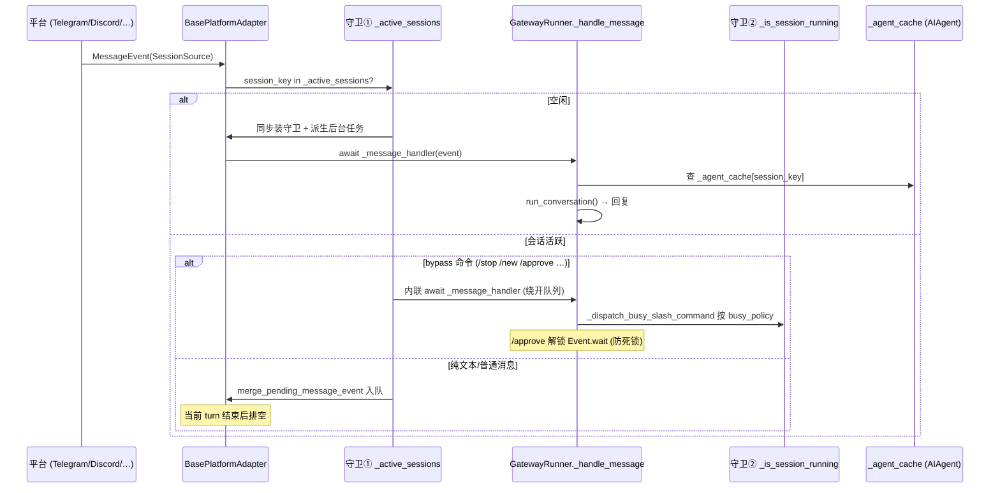

# 第八篇　消息网关与平台适配

*作者：Amlei　·　更新时间：2026-08-08*

> 消息网关是 Hermes"在你所在之处生活"的关键：一个 gateway 进程同时承载二十余个消息平台。本篇剖析 gateway 运行时如何把一条入站消息路由进代理循环、如何在运行中安全地中断与重定向、会话如何跨重启连续，以及平台适配器如何用一条统一契约吸收二十余种异构平台的差异。

---

## 第 1 章　设计目标：单进程、多平台、会话连续

`GatewayRunner` 进程同时承载 Telegram、Discord、Slack、Signal、WhatsApp、Matrix、飞书、邮件等二十余个平台适配器，每个适配器持有唯一的平台凭据，通过 `set_message_handler` 把入站消息统一注入到 runner 的消息管线。

跨平台会话连续性的本质是把"一条消息从哪里来"映射到一个确定性的 **session_key**（逻辑路由键），再把 session_key 映射到一个 `AIAgent` 会话实例。这个映射是会话持续性的全部基础：同一个 session_key 的下一条消息会落到同一个 `SessionEntry`、复用同一个 `AIAgent` 缓存实例（LRU `OrderedDict`，容量 128），从而保留 prompt cache。

---

## 第 2 章　gateway/run.py 生命周期

`GatewayRunner.start()` 返回 bool 表示是否至少有一个适配器连接成功。启动流程：

1. **诊断武装**：`faulthandler.enable()` + SIGUSR2 注册，为 freeze/crash 提供栈转储。
2. **适配器装配**：遍历 config，实例化每个 enabled 平台适配器，注入消息处理器。
3. **凭据锁**：适配器 `connect()` 时通过 `acquire_scoped_lock()` 抢占凭据锁（见第 6 章）。
4. **崩溃恢复**：`_redeliver_pending_obligations` → `_schedule_resume_pending_sessions` → `_finish_startup_restore`，恢复 `resume_pending` 会话并重投未确认的交付义务，重新挂起后台进程 watcher。
5. **监督式后台任务**：通过 `_spawn_supervised(coro_factory, name, restart=True)` 派生所有长驻 watcher——会话到期（300s）、会话停滞、kanban 通知/分发、平台重连、handoff、异步委派、缩容到零。`_spawn_supervised` 自带退避重启，崩溃计数器上限 5。

**AIAgent 的实例化与重接**：每个 session_key 在 `_agent_cache` 中最多持有一个 `AIAgent`。命中则 `move_to_end`（保 prompt cache），未命中则新建并写入缓存，超容则 LRU 驱逐。

---

## 第 3 章　会话管理（gateway/session.py）

### 3.1　session_key 构造

`build_session_key()` 是会话键的唯一真源。格式：

```
agent:<profile_ns>:<platform>:<chat_type>[:<scope_id>][:<chat_id>][:<thread_id>][:<participant_id>]
```

`_session_key_namespace(profile)` 把 profile 编码进第二段：默认 profile → `agent:main`（与历史字节一致，保证向后兼容），命名 profile `coder` → `agent:coder`，使两个 profile 服务同一平台/聊天时不冲突。

关键规则：

- **DM** 总是带 `chat_id`（隔离每个私聊）；无 `chat_id` 时回退到 `participant_id`，防止"无 chat_id 的 DM 塌缩进同一个共享会话导致跨用户历史泄漏"。
- **Thread** 默认**共享**（所有参与者共享一个会话——Telegram forum、Discord thread、Slack thread 的预期 UX）。
- **Discord auto-thread 连续性**：`prospective_thread_id` 解决“频道发起消息→后续落到自动创建的 thread”的会话一致性问题。

```python
# gateway/session.py:1116
        # No chat_id — fall back to the sender's own identifier before the
        # bare per-platform sink.  Without this, every DM from every user that
        # arrives without a chat_id (non-standard adapters / synthetic sources)
        # collapses into one shared "<ns>:<platform>:dm" session, and a
        # single cached agent ends up serving multiple people's conversations —
        # cross-user history bleed.  participant_id keeps DMs isolated per user.
        dm_participant_id = source.user_id_alt or source.user_id
        if dm_participant_id and source.platform == Platform.WHATSAPP:
            dm_participant_id = (
                canonical_whatsapp_identifier(str(dm_participant_id))
                or dm_participant_id
            )
        if dm_participant_id:
            dm_parts.append(str(dm_participant_id))
            if source.thread_id:
                dm_parts.append(source.thread_id)
            return ":".join(str(part) for part in dm_parts)
```

### 3.2　持久化与 SessionStore

`SessionStore` 维护内存索引 `_entries`，持久化到 **state.db 的 `gateway_routing` 表（主）+ sessions.json（遗留镜像）**。读取顺序：先读 `gateway_routing`，再用 sessions.json 补 DB 缺失的键；DB 优先。

**快/慢双写路径**：`_save_entry` 是单行 UPSERT 的快路径（稳态每轮只 bump `updated_at`/`last_prompt_tokens`）；`_save_entries` 是全量重写，用于结构性变迁。两者共享 `_routing_generation` 单调计数器，保证“旧覆盖新”在两个方向都不可能。

```python
# gateway/session.py:1653
            try:
                with save_lock:
                    if getattr(self, "_persisted_routing_generation", 0) >= revision:
                        return
                    fast_persisted = getattr(self, "_fast_persisted_entries", None)
                    if fast_persisted is None:
                        fast_persisted = {}
                        self._fast_persisted_entries = fast_persisted
                    persisted = fast_persisted.get(session_key)
                    if persisted is not None and persisted[0] >= revision:
                        return
                    saver(session_key, entry_json, scope=self._routing_scope())
                    fast_persisted[session_key] = (revision, entry_json)
                return
```

### 3.3　状态机

`get_or_create_session` 优先级：

1. `suspended=True` → 强制新建 session_id（硬擦除，由 `/stop` 或卡死循环升级触发）；
2. `resume_pending=True` → 保留原 session_id（软恢复，崩溃/drain 超时），下一轮成功后清除；
3. 策略到期（idle/daily）→ 自动 reset；
4. 否则返回原 entry。

**带活动后台进程的会话永不被到期或剪枝**——构造器注入的 `has_active_processes_fn` 回调失败时 fail-closed 保持会话存活。

```python
# gateway/session.py:838
    # When True the next call to get_or_create_session() will auto-reset
    # this session (create a new session_id) so the user starts fresh.
    # Set by /stop to break stuck-resume loops (#7536).
    suspended: bool = False

    # When True the session was interrupted by a gateway restart/shutdown
    # drain timeout, but recovery is still expected.  Unlike ``suspended``,
    # ``resume_pending`` preserves the existing session_id on next access —
    # the user stays on the same transcript and the agent auto-continues
    # from where it left off.  Cleared after the next successful turn.
    # Escalation to ``suspended`` is handled by the existing
    # ``.restart_failure_counts`` stuck-loop counter (#7536), not by a
    # parallel counter on this entry.
    resume_pending: bool = False
```

### 3.4　跨重启连续性

会话连续性**不跨平台**（每个平台有独立 session_key），但**跨重启**：无 `.clean_shutdown` 标记时，把最近 120s 内更新的会话标 `resume_pending`。stuck-loop 检测在连续 3 次重启后自动 `suspended`，给用户干净起点。

---

## 第 4 章　消息守卫：两道顺序守卫

这是整个网关最微妙的设计。agent 运行时，消息要穿过**两道顺序守卫**，任何必须在 agent 阻塞期间到达 runner 的命令（如审批）必须**同时**绕过两道守卫并以**内联**方式派发（绝不能走 `_process_message_background`，因为它管理会话生命周期，会和运行中的 task 竞态）。

### 4.1　守卫 ①：base adapter 的 `_active_sessions` 队列门

`BasePlatformAdapter.handle_message()` 的第一道：若 `session_key in _active_sessions`（会话忙）：

- bypass 命令（`/stop`/`/new`/`/reset`/`/approve`/`/deny`/`/status`）直接绕过守卫内联派发；
- photo burst/album 合并进 `_pending_messages`（单槽）；
- 其余普通消息入队，不打断当前回合。

`_active_sessions` 和 `_pending_messages` 是单槽：每个 session_key 一个"下一个待处理"槽，重复 send 时覆盖（burst collapse）。守卫必须在**派生后台任务之前同步安装**，关闭"第二条消息在 task 启动前也通过检查并派生重复 task"的竞态窗口。

```python
# gateway/platforms/base.py:2456
    existing = pending_messages.get(session_key)
    if existing:
        existing_is_photo = getattr(existing, "message_type", None) == MessageType.PHOTO
        incoming_is_photo = event.message_type == MessageType.PHOTO
        existing_has_media = bool(existing.media_urls)
        incoming_has_media = bool(event.media_urls)

        if existing_is_photo and incoming_is_photo:
            existing.media_urls.extend(event.media_urls)
            existing.media_types.extend(event.media_types)
            if event.text:
                existing.text = BasePlatformAdapter._merge_caption(existing.text, event.text)
            _invalidate_pending_stt_cache(existing)
            return
```

`_heal_stale_session_lock` 是 split-brain 自愈：若 `_active_sessions` 仍有键但其 owner task 已 done/cancelled，清锁放行，否则用户会被困在无限的“Interrupting current task…”里直到重启。

```python
# gateway/platforms/base.py:5593
        if session_key in self._active_sessions:
            # Certain commands must bypass the active-session guard and be
            # dispatched directly to the gateway runner.  Without this, they
            # are queued as pending messages and either:
            #   - leak into the conversation as user text (/stop, /new), or
            #   - deadlock (/approve, /deny — agent is blocked on Event.wait)
            #
            # Dispatch inline: call the message handler directly and send the
            # response.  Do NOT use _process_message_background — it manages
            # session lifecycle and its cleanup races with the running task
            # (see PR #4926).
            cmd = event.get_command()
            from hermes_cli.commands import (
                is_interrupt_then_dispatch,
                should_bypass_active_session,
            )

            if should_bypass_active_session(cmd):
```

### 4.2　守卫 ②：gateway runner 的运行中代理拦截

即便过了守卫 ①，消息进入 runner `_handle_message` 后，在调用 `running_agent.interrupt()` 之前还有第二道拦截。`_dispatch_busy_slash_command` 按 CommandDef 上声明的 `busy_policy` 三选一派发：

- `dispatch`：`/status` `/approve` `/deny` `/restart` 等直接跑；
- `interrupt_then_dispatch`：`/stop`（先 interrupt 再清会话）、`/new`（先 interrupt 再 reset）、`/queue`（不打断，FIFO 排队）；
- `reject`：其余命令返回“Agent is running — /<name> can't run mid-turn…”。

```python
# gateway/run.py:14101
        """Dispatch a recognized slash command while an agent is running.

        Resolution order:
          1. ``busy_handler`` — special mid-run variant (e.g. /goal's
             control-verb whitelist, /queue's FIFO enqueue, /model's
             custom reject text).
          2. ``busy_policy == "dispatch"`` — the command's normal handler.
          3. Catch-all busy-reject text. Rejecting is required rather than
             falling through to interrupt + discard: commands like /model,
             /reasoning, /voice, /insights, /title, /resume, /retry,
             /undo, /compress, /usage, /reload-mcp, /sethome, /reset (all
             registered as Discord slash commands) would interrupt the
             agent AND get silently discarded by the slash-command safety
             net, producing a zero-char response. See #5057, #6252, #10370.
        """
```

```python
# gateway/run.py:14116
        name = cmd_def.name
        policy = getattr(cmd_def, "busy_policy", "reject")
        handler_key = getattr(cmd_def, "busy_handler", None)

        if handler_key:
            special = {
                "start": self._busy_start_command,
                "stop": self._busy_stop_command,
                "new": self._busy_new_command,
                "queue": self._busy_queue_command,
                "steer": self._busy_steer_command,
                "egress": self._busy_egress_command,
                "goal": self._busy_goal_command,
            }.get(handler_key)
            if special is not None:
                return await special(event, quick_key, source)
```

### 4.3　为何需要两道守卫

- 守卫 ① 防止运行中的会话被第二条消息**并发重入**派生第二个并行 task；但它会把**所有**非 bypass 消息（包括 `/approve`）塞进队列——若 `/approve` 被队到当前 turn 之后，而当前 turn 又在等审批，会**死锁**。所以 `/approve` 必须在 base.py 内联直派到 runner，绕开队列。
- 守卫 ② 防止纯文本被错误地当成命令或丢失——它先把已知 slash 命令挑出来走 `busy_policy`，只让真正的纯文本落到 `running_agent.interrupt()`。
- **关键约束**：base.py 的 bypass 分支**绝不**用 `_process_message_background`（它会装/拆会话守卫，和运行中 task 的清理竞态），而是直接 `await self._message_handler(event)`。



---

## 第 5 章　中断与重定向（消息态）

agent 运行时新消息到达，三种语义：

- **interrupt**（默认）：`running_agent.interrupt()` 注入，当前 turn 让位，新消息成为新 turn。但有两类**强制降级为 queue**：子代理在途（`interrupt` 会级联 abort 在途 delegate 工作）、上下文压缩在途（interrupt 会在压缩轮转前开新 turn，产生孤儿压缩兄弟）。
- **queue**：走 FIFO 基础设施，照片突发 merge 进头槽，其余追加到 `_queued_events` 溢出尾槽，上限 32。
- **steer**：`running_agent.steer()` 注入运行中 turn 而不打断；voice 媒体先转写；steer 失败回退 queue。

`/stop` 的硬路径 `_interrupt_and_clear_session` 不只是软 interrupt——它调 `request_hard_interrupt`（因为 executor 线程可能真卡死），bump run generation 防 stale 复用，启动守护线程回收该 turn 的子进程，消费并丢弃 pending_message，最后 evict cached agent。

---

## 第 6 章　Scoped locks（gateway/status.py）

`acquire_scoped_lock(scope, identity)` 是机器级文件锁，防止两个本地网关进程同时占用同一外部身份（如同一 Telegram bot token 跨两个 `HERMES_HOME`）。锁文件路径由 `_get_scope_lock_path(scope, identity)` 派生，`identity` 经哈希（不落明文凭据）。

**staleness 判定**层层递进以防 PID 复用：PID 不存在 → stale；`start_time` 不匹配 → stale；两者都已知且匹配但活进程 cmdline 不是网关 → stale；进程被 `Ctrl+Z` 停止 → stale（使 `--replace` 能接管）。

**原子抢占**：`os.replace(lock_path, tombstone)` 把 stale 锁原子改名，再用 `O_CREAT|O_EXCL` 创建新锁——两个竞争者同时清理 stale 时，`os.replace` 原子性保证恰好一个赢。

规范用法：适配器在 `connect()` 里 `acquire_scoped_lock`，在 `disconnect()`/`stop()` 里 `release_scoped_lock`。

```python
# gateway/status.py:1457
        if stale:
            # Remove the stale lock ATOMICALLY by renaming it to a tombstone
            # instead of unlinking. With unlink()+O_EXCL, two racing starters
            # could both observe "removed" (the second unlink() silently
            # deleting the first racer's freshly-created lock) and both win.
            # os.replace() is atomic: exactly one racer claims the stale
            # file; the loser gets FileNotFoundError and falls through to
            # the O_EXCL create below, where at most one process succeeds.
            tombstone = lock_path.with_name(lock_path.name + ".stale")
            try:
                os.replace(lock_path, tombstone)
            except FileNotFoundError:
                # Another racer already claimed the stale lock (and may have
                # created a fresh one) — let O_EXCL below decide the winner.
                pass
```

---

## 第 7 章　Cron 投递与 DM 配对

**Cron session 隔离**：cron 任务执行不复用网关会话，而是开自己的 cron session（`cron_<job_id>_<ts>`，`platform="cron"`），以保留消息 user/assistant 角色交替不污染原会话。cron 投递刻意不从存储的 `origin` 注入 `HERMES_SESSION_*` contextvars——`origin` 是投递路由元数据而非发送者身份。

**镜像 opt-in 且仅限 origin 会话**：`mirror_delivery` 默认 False，且即便开启也仅限投递目标==任务来源会话；fan-out 目标（`deliver=all`、显式 `platform:chat_id` 到其他聊天）**故意不镜像**——它们是广播而非会话延续。

**DM 配对**：`_is_user_authorized` 是有序鉴权链——系统/上游认证平台直通（Home Assistant HMAC、Webhook 签名）、relay 事件靠 transport 盖戳；群/频道级 chat allowlist；per-platform env allowlist；全局 allow-all；DM pairing approved list。未授权 DM 且 `dm_policy="pair"` 时生成配对码，发"配对码 + 让 bot owner 运行 `hermes pairing approve`"。

---

## 第 8 章　平台适配器架构（gateway/platforms/）

约 **32 个适配器**直接继承 `BasePlatformAdapter`，覆盖 Telegram、Discord、Slack、WhatsApp（Baileys 桥 + Meta Cloud API 双形态）、Signal、Email、Matrix、Mattermost、Home Assistant、SMS、DingTalk、WeCom、Weixin、Feishu、QQBot、BlueBubbles、Yuanbao、IRC、Teams、Google Chat、Line、ntfy、Simplex、Photon、Buzz、a2a、raft，外加 webhook、api_server、msgraph_webhook 三个 HTTP 入口面。

### 8.1　归一化数据结构

`MessageEvent` 是所有适配器产出的归一化载体，关键字段：`text`、`message_type`（TEXT/PHOTO/VIDEO/AUDIO/VOICE/DOCUMENT/…）、`source: SessionSource`、`media_urls`/`media_types`（本地缓存路径）、`reply_to_*`、`internal`（置 True 可绕过用户授权——合成事件如后台完成通知用）。

`SendResult` 是适配器 `send()` 的返回类型：`success`、`message_id`、`error_kind`（七类失败词表）、`retryable`、`retry_after`（服务端权威退避秒数，如 Telegram `FloodWait`）。

### 8.2　BasePlatformAdapter 契约

`BasePlatformAdapter`（`base.py:2629`，6861 行）是 ABC，声明了大量**类级能力开关**（默认值即"保守"语义）：

- `supports_code_blocks`（是否渲染代码块）
- `supports_async_delivery`（回合结束后能否异步推送）
- `splits_long_messages`（`send()` 是否原生拆分）
- `typed_command_prefix`（默认 `/`，Slack/Matrix 用 `!`）
- `interactive_resume`（启动恢复中断会话时是否向人类发问）

```python
# gateway/platforms/base.py:2692
    # Whether this adapter's ``send()`` splits long content into multiple
    # messages via ``truncate_message()``.  When True, the delivery router
    # (gateway/delivery.py) skips gateway-level truncation and lets the
    # adapter chunk natively — preserving full output on platforms that
    # support multi-message delivery (Discord, Telegram, …).  Default False
    # (conservative); adapters verified to chunk in ``send()`` set True.
    splits_long_messages: bool = False

    # The command prefix users can always TYPE on this platform to reach
    # Hermes commands.  Default "/" (most platforms deliver "/approve" etc.
    # as plain message text).  Platforms where typing a leading "/" is
    # intercepted or restricted by the client (Slack blocks native slash
    # commands inside threads; Matrix clients reserve "/" for client-local
    # commands) ship a "!" alias rewrite in their adapter and set this to
    # "!" so user-facing instruction text ("Reply `!approve` ...") tells
    # users the form that actually works everywhere.  Capability flag —
    # shared prompt builders read it via getattr(adapter,
    # "typed_command_prefix", "/"); no per-platform branching at call sites.
    typed_command_prefix: str = "/"
```

四个抽象方法：`connect`、`disconnect`、`send`、`get_chat_info`。其余方法（`edit_message`、`delete_message`、`send_typing`、`send_image/voice/video/document`、交互 UX）有默认实现，子类按需覆盖。

### 8.3　入站核心：handle_message 与"同步设守卫、异步派任务"

`handle_message` 的设计哲学是 grammY `sequentialize` / aiogram `EventIsolation` 模式：

1. `coerce_plaintext_gateway_command`（DM 下把 "restart gateway" 改写为 `/restart`）；
2. 计算 `session_key`；
3. 入口自愈（split-brain）；
4. 若会话忙：bypass 命令内联派发、photo burst 合并、文本 queue debounce、其余入队；
5. 若会话空闲：`_start_session_processing` **先同步**把守卫塞进 `_active_sessions` **再** `create_task`。

```python
# gateway/platforms/base.py:5383
        """Spawn a background processing task under the given session guard.

        Returns True on success.  If the runtime stubs ``create_task`` with a
        non-Task sentinel (some tests do this), the guard is rolled back and
        False is returned so the caller isn't left holding a half-installed
        session lock.
        """
        guard = interrupt_event or asyncio.Event()
        self._active_sessions[session_key] = guard

        task = asyncio.create_task(self._process_message_background(event, session_key))
        self._session_tasks[session_key] = task
```

### 8.4　适配器注册与工厂

**双轨**：内置 if/elif 链 + 插件注册表。`_create_adapter` 先查 `platform_registry`，命中即创建；未命中才回落到内置链（目前仅含 WHATSAPP_CLOUD/SIGNAL/WEIXIN/API_SERVER/WEBHOOK 等）。其余（Telegram/Discord/Slack/IRC 等）全部走插件注册表。

**延迟加载**是关键优化：`register_deferred(name, loader)` 仅注册轻量加载器，真实模块在首次 `get`/`create_adapter` 时才 import——因为 `lark_oapi`/`discord.py`/`slack_bolt` 等重型 SDK 在模块级 import，全量 eager load 会给 `hermes chat`（从不触碰网关）增加数秒启动开销。

### 8.5　消息归一化与语音转写

各平台事件统一归一化为 `MessageEvent`。以 Signal 为例：信封解包 → 发送者提取 + 自过滤 → 编辑归一化 → 群检测 + 三态门 → @提及渲染 → quote 上下文 → 附件处理 → 类型推断即派发。

**语音转写流**：适配器只负责"下载 + 缓存为 STT 可接受的容器"。例如 Signal `_fetch_attachment` 用 `tools.audio_container.sniff_container` 识别容器，若是 `.aac` 则无损 remux 为 `.m4a`（ffmpeg `-c:a copy`），落本地路径。路径进 `media_urls`，事件标 `VOICE`，转写本身在 base 流水线读 `media_urls[0]` 跑 Whisper。

### 8.6　富媒体

`media_cache.py` 是 mime↔ext 分发的单一来源，刻意偏向"野外常见扩展名"而非 RFC 正确项——`audio/ogg→.ogg`（非 `.oga`）因 STT 管道白名单按真实扩展名。分歧的适配器通过 `ext_overrides` 保持字节级历史行为。

**Yuanbao**（5298 行 + proto/media/sticker 子模块）是最复杂的子系统，手写纯 Python protobuf 编解码（不依赖 `google.protobuf`，反向工程腾讯协议）。关键区别：图片上传腾讯 COS 用 `TIMImageElem` 引用 URL；贴纸用 `TIMFaceElem` 不上传 COS，`data` 字段携带 JSON 元数据。

**Signal 格式化**用 `bodyRanges`（位置以 UTF-16 code unit 计量），`markdown_to_signal` 返回 `(plain_text, [style_strings])`，支持 BOLD/ITALIC/STRIKETHROUGH/MONOSPACE。

### 8.7　HTTP 入口面

- **WebhookAdapter**：通用多源 webhook 复用器，收 GitHub/GitLab/JIRA 等 POST，HMAC 验签（支持 Svix、GitHub、GitLab token、Generic V2），每路由固定窗口限流，声明式 `route_filters_match`，可选脚本变换，`_render_prompt` 渲染，delivery-id 幂等，立即返回 202。
- **APIServerAdapter**：OpenAI 兼容 REST + SSE API，强制 `API_SERVER_KEY` ≥16 字符强密钥。**关键区别**：`chat/completions` 不经 `MessageEvent`/`handle_message`，而是直接 `_run_agent`（构造 `AIAgent` 在线程执行器跑 `run_conversation()`）。流式用 `ThreadSafeAsyncQueue` 跨线程，客户端断连即 `request_hard_interrupt`。
- **MSGraphWebhookAdapter**：Microsoft Graph 变更通知入口，纯入站，验证握手（GET 带 `validationToken`，须 10s 内原样回显）。

### 8.8　限流与重连

- **SendResult 退避**：基类 `_send_with_retry` 按 `retryable`/`retry_after` 做指数退避；`classify_send_error` 把 flood/too many requests 归为 `rate_limited`，把连接类归为 `transient`。
- **Signal 令牌桶**：进程级 `SignalAttachmentScheduler` 单例，容量 50（匹配 Signal 服务端桶），`report_rpc_duration` RPC 后扣 token 且不补给上传期 refill，`feedback(retry_after)` 服务端权威校准。
- **重连与心跳**：Telegram 8 次弹性 ladder + 轮询 409 冲突恢复 + stuck-task 看门狗 300s；`TelegramFallbackTransport` 保 hostname + TLS SNI 不变、重写 TCP 目标 IP 到 DoH 发现 IP。

---

## 第 9 章　为何如此设计：权衡的总账

1. **基类继承 vs 组合**：架构选择厚基类 + 薄子类。`BasePlatformAdapter` 承载海量默认实现（会话守卫、排队、打字、媒体投递、重试、交互 UX 降级），子类只需实现四件套 + 入站归一化即可工作。代价是基类膨胀到 6861 行、状态字典众多、竞态修复注释遍布——反映"统一性"与"正确并发"的持续张力。
2. **Mixin 优先于多重继承分散**：WhatsApp 用 `WhatsAppBehaviorMixin` 首位实现跨传输共享行为，而非把公共逻辑塞进基类（会污染非 WhatsApp 平台）或复制（会漂移）。Yuanbao 走另一极端——20 阶段中间件管道 + 多个 manager 类组合。
3. **平台特定怪癖通过钩子而非分支消化**：`typed_command_prefix` 让 Slack/Matrix 改 `!` 而调用点无分支；`enforces_own_access_policy` 让 WeCom/Weixin 声明"自己已强制访问策略"使网关不重复拒绝；`authorization_is_upstream` 让 relay 适配器声明"可信上游已授权"。
4. **延迟加载**避免 20+ 重型 SDK 拖慢每个 `hermes` 调用，代价是首次访问才 import。
5. **两道消息守卫缺一不可**：① 管并发与队列，② 管运行中命令路由与软中断触发，且 bypass 路径必须避开 `_process_message_background` 的生命周期管理以防与运行中 task 的清理竞态。

---

*第八篇完。下一篇进入 CLI、TUI 与仪表盘，剖析 Hermes 的四种聊天表面如何由同一套 JSON-RPC 方法表与 AIAgent 回调注入统一承载。*
