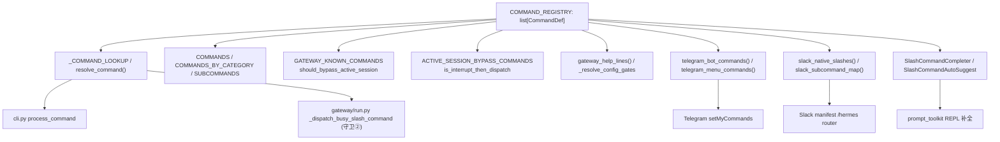
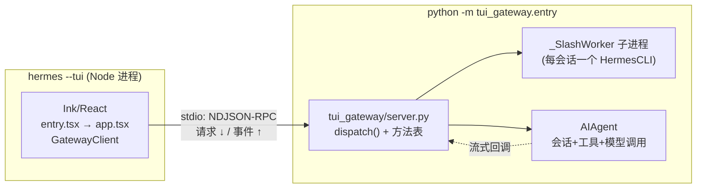
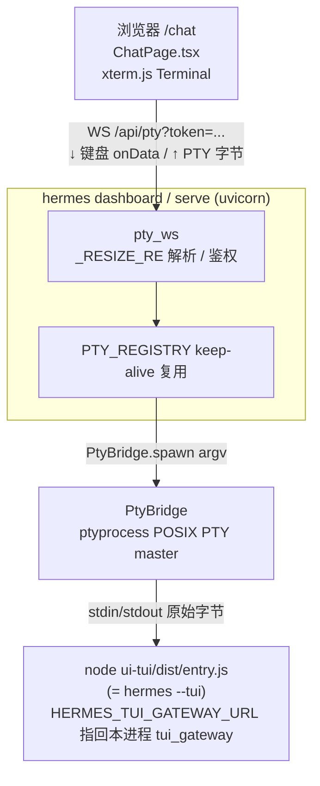

# 第九篇　CLI、TUI 与仪表盘

*作者：Amlei　·　更新时间：2026-08-08*

> Hermes 有四种聊天表面：经典 prompt_toolkit CLI、Ink TUI、dashboard 嵌入的 TUI、Electron 桌面应用。本篇剖析它们如何由同一套 JSON-RPC 方法表与 AIAgent 回调注入统一承载，中央斜杠命令注册表如何单一地驱动所有表面的命令分发与菜单，以及 dashboard 为何坚持"嵌入真实 TUI 而非 React 重写"。

---

## 第 1 章　中央斜杠命令注册表（hermes_cli/commands.py）

### 1.1　单一事实来源

`hermes_cli/commands.py` 模块开头明确声明（`commands.py:1-9`）：

> 所有斜杠命令的中央注册表。每个消费者——CLI help、gateway dispatch、Telegram BotCommands、Slack 子命令映射、autocomplete——都从 `COMMAND_REGISTRY` 派生其数据。

设计目标：在一个 `list[CommandDef]` 上集中定义所有斜杠命令，使其派生出 CLI 帮助与分发、Gateway 的 mid-run 守卫 ② 分发器、Telegram BotCommands 菜单、Slack 原生 slash 与 `/hermes <sub>` 映射、Discord `/skill` 自动补全、prompt_toolkit 的 `SlashCommandCompleter`。新增命令只需追加一个 `CommandDef`；新增别名只需在已有条目上设置 `aliases=("bg",)`。

该设计的关键约束是**导入轻量**：`commands.py` 必须在缺少 `prompt_toolkit` 的 gateway/test 环境下仍可导入。

### 1.2　CommandDef 字段

`CommandDef` 是 `@dataclass(frozen=True)`，关键字段：

| 字段 | 用途 |
|------|------|
| `name` | 规范名（不含 `/`） |
| `description` | 人类可读描述，喂给所有 surface |
| `category` | 分类标签，驱动 `COMMANDS_BY_CATEGORY` |
| `aliases` | 元组，每个别名也参与分发与各平台 surface |
| `args_hint` | 参数占位符，如 `<prompt>`、`[on\|off\|status]` |
| `cli_only` / `gateway_only` | 表面门控 |
| `gateway_config_gate` | 配置点路径；值为真时覆盖 `cli_only` 使该命令在 gateway 可用 |
| `busy_policy` | mid-run 行为：`dispatch`/`reject`/`interrupt_then_dispatch` |
| `execute` | `slash_exec.EXECUTORS` 的字符串键，用于纯格式化命令 |

`busy_policy` 的三态语义是 gateway mid-run 调度的核心：`dispatch` 在 agent 忙时仍执行；`reject` 拒绝；`interrupt_then_dispatch` 先中断当前 agent 再执行（`/stop`/`/new`/`/reset`）。

```python
# hermes_cli/commands.py:46
@dataclass(frozen=True)
class CommandDef:
    name: str                          # canonical name without slash: "background"
    description: str                   # 喂给所有 surface 的人类可读描述
    category: str                      # 驱动 COMMANDS_BY_CATEGORY
    aliases: tuple[str, ...] = ()
    args_hint: str = ""                # "<prompt>", "[on|off|status]"
    cli_only: bool = False
    gateway_only: bool = False
    gateway_config_gate: str | None = None  # truthy 配置点覆盖 cli_only
    busy_policy: str = "reject"        # dispatch / reject / interrupt_then_dispatch
    busy_handler: str | None = None    # Guard-2 mid-run handler 表的键
    execute: str | None = None         # slash_exec.EXECUTORS 的键（纯格式化命令）

# 典型条目：别名 / 三态 busy_policy / gateway_only / execute 各一例
CommandDef("new", "Start a new session", "Session", aliases=("reset",), args_hint="[name]",
           busy_policy="interrupt_then_dispatch", busy_handler="new")
CommandDef("background", "Run a prompt in the background", "Session",
           aliases=("bg", "btw"), args_hint="<prompt>", busy_policy="dispatch")
CommandDef("approve", "Approve a pending dangerous command", "Session",
           gateway_only=True, args_hint="[session|always]", busy_policy="dispatch")
CommandDef("profile", "Show active profile name and home directory", "Info",
           busy_policy="dispatch", execute="profile")
```

### 1.3　派生消费者

`_build_command_lookup()` 在导入期把每个 `CommandDef` 的 `name` 与所有 `aliases` 映射到同一实例，缓存为 `_COMMAND_LOOKUP`。`resolve_command(name)` 做大小写归一与去前导 `/` 后查表。所有派生结构（`COMMANDS`、`COMMANDS_BY_CATEGORY`、`GATEWAY_KNOWN_COMMANDS`、`gateway_help_lines()`、`telegram_bot_commands()`、`slack_native_slashes()`、`SlashCommandCompleter`）在导入期一次性构建。

```python
# hermes_cli/commands.py:349
def _build_command_lookup() -> dict[str, CommandDef]:
    """Map every name and alias to its CommandDef."""
    lookup: dict[str, CommandDef] = {}
    for cmd in COMMAND_REGISTRY:
        lookup[cmd.name] = cmd
        for alias in cmd.aliases:
            lookup[alias] = cmd          # 别名映射到同一实例
    return lookup

_COMMAND_LOOKUP: dict[str, CommandDef] = _build_command_lookup()  # 导入期一次性构建

def resolve_command(name: str) -> CommandDef | None:
    """Resolve a command name or alias; accepts names with or without leading '/'."""
    return _COMMAND_LOOKUP.get(name.lower().lstrip("/"))
```



### 1.4　CLI 分发

`HermesCLI.process_command`（`cli.py:9835`）是经典 REPL 入口：先 `resolve_command` 得到 canonical，再按 `elif canonical ==` 链分派。新增命令的标准流程：(a) 在 `COMMAND_REGISTRY` 加 `CommandDef`；(b) 在 `process_command` 的 `elif` 链加分支；(c) 若需在 gateway 可用，加 busy handler；(d) 若需持久化，调 `save_config_value`。

`save_config_value`（`cli.py:4100`）总是写入 `get_hermes_home()/'config.yaml'`（运行期解析 HERMES_HOME），通过 `atomic_roundtrip_yaml_update` 保留注释/顺序/引号，`chmod 0o600`。

---

## 第 2 章　启动链（hermes_cli/main.py）

### 2.1　顺序敏感的早期决策

`main.py` 顶层并非线性导入。它在 argparse 之前完成若干"必须在任何 hermes 模块导入前"的动作：

1. **进程名设置**；
2. **TUI 早期决策**（`_wants_tui_early`）：优先级 `--cli` > `--tui`/`HERMES_TUI=1` > TTY gate > `display.interface` 配置。TTY gate 对 headless spawner（kanban worker、cron、管道）是承重的；
3. **鼠标残留抑制**：在 TUI 热路径上、Python launcher 还在导入时就发送 `\x1b[?1003l...` 关闭鼠标上报；
4. **超快版本短路**：`hermes --version` 在 config/logging 导入前即返回。

### 2.2　_apply_profile_override（在任何 hermes 导入前）

`main.py:517-690` 的核心函数。注释说明原因：许多模块在导入期缓存 `HERMES_HOME`，因此必须在任何 hermes 模块导入前拦截 `--profile/-p` 并设置环境变量。流程：

1. **扫描 argv**：跳过 `mcp add --args` 后的透传区，识别 `-p/--profile`；
2. **校验 profile 名**：`^[a-z0-9][a-z0-9_-]{0,63}$`，否则丢弃（防 pytest `-p no:xdist` 误读）；
3. **HERMES_HOME 已指向 profile 目录则信任**；
4. **active_profile 回退**：无显式 flag 时读 `<hermes_root>/active_profile`；
5. **设置 + 剥离 argv**：`os.environ["HERMES_HOME"] = hermes_home`，并把 flag 从 `sys.argv` 移除。

第 690 行 `_apply_profile_override()` 在模块顶层执行。其后才加载 `.env`、桥接 `security.redact_secrets`。

```python
# hermes_cli/main.py:517  (在 _apply_profile_override 内，argparse 之前)
value_flags = {"-m", "--model", "--provider", "-t", "--toolsets", "-r", "--resume", ...}
i = 0
while i < len(argv):
    arg = argv[i]
    if arg == "--args" and _inside_mcp_add_args(i):   # mcp add 的子命令 argv 透传区，停扫
        break
    if arg in {"--profile", "-p"} and i + 1 < len(argv):
        profile_name, consume, profile_index = argv[i + 1], 2, i; break
    if arg.startswith("--profile="):
        profile_name, consume, profile_index = arg.split("=", 1)[1], 1, i; break
    if "=" not in arg and arg in value_flags and i + 1 < len(argv): i += 2
    else: i += 1

# 校验防误读：pytest "-p no:xdist" 不应被当成 profile 名
if profile_name and not re.match(r"^[a-z0-9][a-z0-9_-]{0,63}$", profile_name):
    profile_name = None
# ...（无 flag 时回退读 <root>/active_profile）...
os.environ["HERMES_HOME"] = hermes_home        # 必须在任何 hermes 模块导入前（导入期即缓存）
if consume > 0 and profile_index is not None:   # 从 argv 剥离 flag，否则 argparse 报错
    start = profile_index + 1
    sys.argv = sys.argv[:start] + sys.argv[start + consume :]
```

### 2.3　argparse 与子命令路由

`main()` 调 `build_top_level_parser()`，随后逐一调用约 45 个 `build_X_parser` 工厂。每个子命令模块导出 `build_<name>_parser`，接收 `subparsers` 与命令处理函数（handler injection 避免反向导入 `main`）。`cmd_chat` 被绑为顶层/默认（无子命令 → 进入交互 REPL）。

`--yolo` 必须在 plugin discovery 前设 `HERMES_YOLO_MODE=1`，因为 `tools.approval` 在导入期冻结 `_YOLO_MODE_FROZEN`。

---

## 第 3 章　配置三件套

### 3.1　三路 config 加载器

| 加载器 | 位置 | 行为 |
|--------|------|------|
| `load_config()` | `hermes_cli/config.py:3115` | 权威加载器。`deepcopy(DEFAULT_CONFIG)` ← `_deep_merge(user_yaml)` ← `_deep_merge(managed_scope)`。mtime 缓存、env 展开、last-known-good 回退 |
| `load_cli_config()` | `cli.py:409` | 经典 REPL 专用。查 `~/.hermes/config.yaml` → 回退 `./cli-config.yaml`。自带一份独立的 `defaults` 字典 |
| 直接 YAML | `gateway/config.py:1250` | 网关启动读 raw YAML，叠 managed_scope overlay，不 merge DEFAULT_CONFIG |

为何分化：gateway 读 raw 是为**速度与隔离**（启动期一次性消费，不需 deepcopy/缓存/迁移机制）；`cli.py:load_cli_config()` 保留独立 defaults 是历史遗留。`DEFAULT_CONFIG` 的覆盖范围是防止 drift 的机制。

### 3.2　_load_config_impl 的语义链

1. `ensure_hermes_home()`（建目录骨架、设权限、seed `SOUL.md`）；
2. 计算缓存签名：`(user_mtime_ns, user_size, managed_mtime_ns, managed_size)`，把 managed-scope 文件的 mtime 也折入；
3. **缓存命中**还需 env 快照匹配（`${VAR}` 引用在缓存建立时的 env 取值漂移则失效）；
4. `config = deepcopy(DEFAULT_CONFIG)`，再 `_deep_merge(config, user_config)`；
5. **last-known-good 容错**：YAML 解析失败时，若有进程内上次成功加载的 config，则继续服务它（避免长跑 gateway 在用户中途改坏 config 时静默丢失安全关键的 `approvals.deny` 规则）；
6. `_expand_env_vars`（递归展开 `${VAR}` 与 `${env:VAR}`）；
7. **managed scope 最后叠加**（确保管理员 pinned 值在叶层胜出）。

```python
# hermes_cli/config.py:3333  (_load_config_impl 内)
config = copy.deepcopy(DEFAULT_CONFIG)
if user_sig is not None:
    try:
        with open(config_path, encoding="utf-8") as f:
            user_config = fast_safe_load(f) or {}
        config = _deep_merge(config, user_config)        # DEFAULT ← user，逐键递归覆盖
    except Exception as e:
        # last-known-good：YAML 解析失败时服务进程内上次成功的 config，
        # 避免长跑 gateway 在用户改坏 config 时静默丢失 approvals.deny
        lkg = _LAST_EXPANDED_CONFIG_BY_PATH.get(path_key)
        if lkg is not None:
            return _expand_env_vars(copy.deepcopy(lkg))

normalized = _normalize_root_model_keys(_normalize_max_turns_config(config))
expanded = _expand_env_vars(normalized)
# managed scope 最后叠加：管理员 pinned 值在叶层胜出，user 的 ${VAR} 无法 shadow
managed_config = managed_scope.load_managed_config()
if managed_config:
    expanded = _deep_merge(expanded, _expand_env_vars(managed_config))
```

### 3.3　_config_version 与迁移

- **新增键 → deep-merge 自动覆盖，无需 bump**。`load_config` 在读时把 `DEFAULT_CONFIG` 与用户 YAML deep-merge，新默认键自动出现。
- **结构性迁移（重命名/重组）→ 版本门控的迁移步骤**。表驱动注册表 `MIGRATIONS = ((12, _migrate_to_12), (13, …), … (33, _migrate_to_33))`，`run_migrations` 严格升序。
- **支持地板** `SUPPORT_FLOOR_VERSION = 12`：显式低于 v12 的配置不自动迁移、不重写，leave byte-for-byte。
- **关键写不变量**：迁移只能持久化**与默认不同的值** + 显式删除/重命名，绝不物化纯默认值（否则会把精简 config 改写成完整 `DEFAULT_CONFIG` dump——历史上的"hermes update 吹爆我的 config"报告）。

```python
# hermes_cli/config_migrations.py:53
SUPPORT_FLOOR_VERSION = 12   # 低于 v12 的 config 不自动迁移、leave byte-for-byte

# hermes_cli/config_migrations.py:651
MIGRATIONS: Tuple[Tuple[int, Callable[[Dict[str, Any], bool], None]], ...] = (
    (12, _migrate_to_12), (13, _migrate_to_13), (14, _migrate_to_14),
    (15, _migrate_to_15), (16, _migrate_to_16), (17, _migrate_to_17),
    (21, _migrate_to_21), (23, _migrate_to_23), (25, _migrate_to_25),
    (29, _migrate_to_29), (31, _migrate_to_31), (32, _migrate_to_32),
    (33, _migrate_to_33),
)

def run_migrations(current_ver: int, results: Dict[str, Any], quiet: bool) -> None:
    # current_ver 在任何步骤前一次性捕获，步骤间不递进；严格升序应用
    for target_ver, migration_fn in MIGRATIONS:
        if current_ver < target_ver:
            migration_fn(results, quiet)
```

### 3.4　OPTIONAL_ENV_VARS 与密钥元数据

`OPTIONAL_ENV_VARS` 是密钥的元数据字典，每条含 `description`/`prompt`/`url`/`password`/`category`/`tools`/`advanced`。`.env` 只放 secrets：`_ENV_VAR_NAME_DENYLIST` 禁止通过 env writer 写入影响子进程执行的变量（LD_PRELOAD/PYTHONPATH/PATH/HERMES_HOME 等）。

### 3.5　auxiliary 配置与 _resolve_auto

`auxiliary` 段为每个 side task（vision/web_extract/compression/title_generation/curator/…）定义独立的 LLM 覆盖槽。`_resolve_auto(main_runtime, task)` 的解析链：

1. **Step 1**：用户的主 provider + 主 model 优先（"auto 即用我的主聊天模型做 side task"）；
2. **Step 2**：task 专属 fallback 链 → main 的 fallback 链；
3. **Step 3**：硬编码 provider 发现链（OpenRouter → Nous → custom → Codex）。

完整优先级：**任务特定显式配置 → `_resolve_auto` 的主模型 → fallback 链 → 聚合器发现链**。

---

## 第 4 章　皮肤引擎与显示层

### 4.1　皮肤引擎（skin_engine.py）

数据驱动主题系统：`SkinConfig` 字段含 `colors`（hex 值）、`spinner`（faces/verbs/wings）、`branding`、`tool_prefix`（默认 `"┊"`）、`tool_emojis`。内置皮肤 `_BUILTIN_SKINS`（default 金/卡哇伊、ares 战神、mono、slate 等）。加载机制：`_build_skin_config` 以 default 为底，用户值覆盖其上；`load_skin(name)` 先查 `~/.hermes/skins/<name>.yaml`，再查内置，再回退 default。

### 4.2　KawaiiSpinner 与活动流

`KawaiiSpinner`（`agent/display.py:1054`）是工具执行期的动画 spinner。`get_waiting_faces`/`get_thinking_faces`/`get_thinking_verbs` 优先从 active skin 的 `spinner` 块取值，否则回退硬编码常量。

**为何禁用 `\033[K`**：`prompt_toolkit` 的 `patch_stdout` 把 `sys.stdout` 包成队列并在每次 flush 周围注入换行，使 `\r` 覆盖与 `\033[K` 清行都不落在正确行——每帧 spinner 落到新行并覆盖状态栏。因此用空格清行替代：`f"\r{line}{' ' * pad}"`。

```python
# agent/display.py:1113  (face/verb 优先取自 active skin，否则回退硬编码常量)
@classmethod
def get_thinking_verbs(cls) -> list:
    try:
        skin = _get_skin()
        if skin and skin.spinner.get("thinking_verbs"):
            return skin.spinner["thinking_verbs"]
    except Exception:
        pass
    return cls.THINKING_VERBS

# agent/display.py:1208  (_animate 帧循环：空格 pad 清行，非 \033[K)
while self.running:
    frame = self.spinner_frames[self.frame_idx % len(self.spinner_frames)]
    elapsed = time.time() - self.start_time
    if wings:
        left, right = wings[self.frame_idx % len(wings)]
        line = f"  {left} {frame} {self.message} {right} ({elapsed:.1f}s)"
    else:
        line = f"  {frame} {self.message} ({elapsed:.1f}s)"
    pad = max(self.last_line_len - len(line), 0)
    self._write(f"\r{line}{' ' * pad}", end='', flush=True)   # 空格清行，非 \033[K
    self.last_line_len = len(line)
    self.frame_idx += 1
    time.sleep(0.12)
```

---

## 第 5 章　TUI 架构（ui-tui + tui_gateway）

### 5.1　进程模型

TUI 的核心架构原则（`AGENTS.md:441`）：

> **TypeScript owns the screen. Python owns sessions, tools, model calls, and slash command logic.**

之所以这样切分语言：屏幕渲染（流式 markdown、ANSI、鼠标/焦点跟踪）用 TypeScript + React(Ink) 远比 Python 的 prompt_toolkit 可维护；而会话状态、AIAgent 主循环、工具注册表已经全部用 Python 实现。两端通过一条 stdio JSON-RPC 边界解耦。



### 5.2　传输层

newline-delimited JSON-RPC 2.0。请求由 Ink 发起，事件由 Python 主动推送。Python 侧分派是单一方法表 `_methods`，由 `@method(name)` 装饰器填充。`dispatch` 对 `_LONG_HANDLERS` 集合中的方法，把整个调用 `contextvars.copy_context()` 后丢到线程池，避免慢方法阻塞 stdin 读循环。

```python
# tui_gateway/server.py:1934  (dispatch：快路径内联返回 dict，慢路径返回 None 由 worker 自写)
def dispatch(req: dict, transport: Optional[Transport] = None) -> dict | None:
    t = transport or _stdio_transport
    token = bind_transport(t)                    # 钉进 ContextVar，pool 线程才写得到正确 transport
    try:
        _rid, method, _params = _normalize_request(req)
        if method not in _LONG_HANDLERS:
            return handle_request(req)           # 快路径：内联执行，直接返回响应 dict
        ctx = contextvars.copy_context()         # 快照（含已绑定的 transport）
        def run():
            resp = handle_request(req)
            if resp is not None:
                t.write(resp)                    # 慢路径：worker 通过 t 自写响应
        _pool.submit(lambda: ctx.run(run))       # ctx.run 让 pool 线程在快照 context 里执行
        return None                              # 告诉 entry.py：响应已异步交出，别替我回写
    finally:
        reset_transport(token)
```

方法目录（90+ 方法）按域分组：Prompt/响应、附件、会话、委托/子代理、工具/命令、模型/配置、能力内省、运维/计费、唤醒/语音/宠物。事件目录（29 类）由 `_emit(event, sid, payload)` 发出。

### 5.3　关键映射

| Surface | Ink 组件 | Gateway 方法/事件 |
|---------|----------|-------------------|
| Chat streaming | `app.tsx` + `messageLine.tsx` | `prompt.submit` → `message.delta/complete` |
| Tool activity | `thinking.tsx` | `tool.start/progress/complete` |
| Approvals | `prompts.tsx` | `approval.respond` ← `approval.request` |
| Session picker | `sessionPicker.tsx` | `session.list/resume` |
| Slash commands | 本地 handler + fallthrough | `slash.exec` → `_SlashWorker`、`command.dispatch` |

### 5.4　_SlashWorker 持久子进程

斜杠命令走"本地优先、远端兜底"两级。未命中的发 `slash.exec`，其 `.catch` 再降级到 `command.dispatch`。Worker 是 `tui_gateway/slash_worker.py`，**每个 TUI 会话持有一个常驻 `HermesCLI` 子进程**，协议是 JSON 行。Worker 内置父进程死亡看门狗：轮询 `os.getppid()`，一旦发现被收养，给在飞命令 5s 宽限期后 `os._exit(0)`，避免孤儿 worker 泄漏。

---

## 第 6 章　Dashboard 内嵌真实 TUI（非重写）

`AGENTS.md:488-490` 的硬规则：

> **Do not re-implement the primary chat experience in React.** 主 transcript、composer/输入流（含斜杠命令行为）、PTY 终端一律归嵌入的 `hermes --tui`——Ink 里加的任何东西都会自动出现在 dashboard。

Dashboard 的 `/chat` 标签页通过 `pty_bridge.py` + `/api/pty` WebSocket 嵌入**真正的 `hermes --tui` 二进制**，而不是用 React 重写聊天。



### 6.1　调整尺寸帧

调整尺寸走带外转义序列而非 PTY 输入：`term.onResize` 把 `\x1b[RESIZE:${cols};${rows}]` 发给 WS。服务端用预编译正则**消费掉**这帧、不写入 PTY。`match.end() == len(raw)` 守卫确保整帧恰好是该转义，否则当作普通终端输入透传。

### 6.2　为何用查询参数 token

浏览器**无法在 WS upgrade 请求上设置 `Authorization` 头**（WebSocket 构造器不支持自定义请求头），故 WS 鉴权改走查询参数：loopback 模式 `?token=`，gated OAuth 模式先 `POST /api/auth/ws-ticket` 拿一次性 ticket，再 `?ticket=`。

### 6.3　PtyBridge

`PtyBridge` 是对 `ptyprocess.PtyProcess` 的薄包装，**POSIX-only**（依赖 `fcntl`/`termios`/`ptyprocess`，原生 Windows 导入即 `ImportError` 并提示用 WSL）。I/O 字节安全。`resize` 把尺寸 clamp 到 `[1,2000]×[1,1000]`（WSL2 会探测出 `columns=131072`），再通过 `TIOCSWINSZ` 下发。

---

## 第 7 章　dashboard vs serve

两者**共享同一处理器 `cmd_dashboard` 与同一 `start_server`**，区别仅在 CLI parser 标志。`serve` 额外设 `no_open=True, headless_backend=True`，并设置 `HERMES_SERVE_HEADLESS=1`。

契约的执行点是 `mount_spa(application)`：headless 守卫检查 `HERMES_SERVE_HEADLESS`，为真则不注册 StaticFiles / serve_spa，只暴露 JSON-RPC/WS/API 面。

```python
# hermes_cli/web_server.py:16054  (_headless 短路在 WEB_DIST.exists() 之前 → 注册兜底 404 → 提前 return)
_headless = os.environ.get("HERMES_SERVE_HEADLESS") == "1"
if _headless or not WEB_DIST.exists():
    @application.get("/{full_path:path}")
    async def no_frontend(full_path: str):
        return JSONResponse({"error": _msg}, status_code=404)  # 兜底 404，附说明
    return                # 提前返回 → 后续 StaticFiles / serve_spa 注册代码永不执行
```

所以 `serve` 模式下 SPA 永不挂载——即使 `web_dist/` 因先前 `dashboard`/build 残留也照样 404。`dashboard` 与 `serve` 是**互不启动对方的独立表面**。

Web 框架是 **FastAPI + uvicorn**。`start_server` 不调 `uvicorn.run()`，而用 `uvicorn.Server` API 直接驱动，以便 bind 后读端口。

---

## 第 8 章　Electron Desktop（apps/desktop/）

这是**第四个独立聊天表面**（区别于经典 CLI、dashboard 嵌入 TUI、ACP）。它是 Electron + React + nanostore 渲染器（`@assistant-ui/react`），通过 `apps/shared` 包里的 `JsonRpcGatewayClient` 以 JSON-RPC over WebSocket 对话同一个 `tui_gateway` 后端。**它不嵌入 `hermes --tui`**，而是自带 composer/transcript/斜杠管线。

Desktop 自启一个 headless `hermes serve` 后端。由于 `serve` 是较新的子命令，存在运行时未注册它的升级窗口，故有 `backendSupportsServe()` 回退：优先读运行时是否声明 `serve`，不支持则把 argv 重写为 legacy `dashboard --no-open`——两个命令产生完全相同的 headless gateway。

Desktop 斜杠命令在渲染器侧策展：后端 `commands.catalog` 与 `complete.slash` 已含 built-in + `quick_commands` + skill 命令，渲染器仅做噪音过滤（隐藏 terminal-only/messaging-only built-in，但保留 skill/quick command 扩展）。

---

## 第 9 章　ACP 适配器（acp_adapter/）

ACP（Agent Client Protocol）是面向 IDE 的 JSON-RPC 协议，让 Hermes 暴露给 VS Code/Zed/JetBrains。传输是 **stdio JSON-RPC**——stdout 专留协议帧，所有日志重定向到 stderr。启动由 `entry.py:269` 把 `HermesACPAgent` 交给 SDK runner。

`HermesACPAgent(acp.Agent)` 子类化 SDK 基类、覆盖协程 handler。能力声明：`load_session`、`prompt_capabilities(image=True)`、`SessionCapabilities(fork/list/resume)`。方法目录：`initialize`/`authenticate`/`session/new`/`load`/`resume`/`cancel`/`fork`/`list`/`prompt`/`setModel`/`setMode`。

会话模型：每个 ACP session 是 1:1 映射到新的 `AIAgent`，`platform="acp"`、`enabled_toolsets=["hermes-acp"]`、`quiet_mode=True`。关键不变量是**双 id 模型**：ACP `session_id` 是稳定公开句柄，内部 `agent.session_id` 会因上下文压缩在中途轮换；`_persist` 与 `provenance.py` 的 `build_session_provenance` 专门处理这种轮换。

AIAgent 的 `run_conversation` 是同步的，跑在 `ThreadPoolExecutor(max_workers=4)`，通过五个回调（`stream_delta`/`reasoning`/`tool_progress`/`step`/审批）桥接到 async `conn.session_update()`。并发安全通过 `contextvars.copy_context()` 包裹 executor 调用保证。

```python
# acp_adapter/server.py:1956  (ctx.run 作为 callable 交给 executor，在快照 context 里跑同步 agent)
ctx = contextvars.copy_context()
result = await loop.run_in_executor(_executor, ctx.run, _run_agent)
# 关键在传 ctx.run 而非 _run_agent：pool 线程在快照的 context 里执行 _run_agent，
# 并发的 ACP 会话在共享 pool（max_workers=4）上才不会互相践踏 HERMES_SESSION_KEY 等 ContextVar 写入
```

---

## 第 10 章　为何如此设计：权衡的总账

1. **中央注册表 vs 分布式**：单一 `COMMAND_REGISTRY` 驱动所有 surface，代价是 `CommandDef` 必须编码所有 surface 的差异；收益是别名、help、Telegram/Slack/Discord 菜单、补全、mid-run 策略都从同一事实派生，不会出现"别名在 CLI 工作但 Telegram 菜单缺失"类漂移。
2. **嵌入真实 TUI vs React 重写**：Hermes 选择前者并写成硬规则。代价是 `/chat` 页面要背一个 Node 子进程 + PTY + xterm.js（含 WebGL 纹理图集），且原生 Windows 因无 POSIX PTY 必须走 WSL。收益是**零行为分叉**：skin 引擎、slash popover、model picker、markdown 渲染只需维护一份。
3. **结构化 React 允许围绕 TUI 存在**：侧栏小部件、检查器、状态面板只要不替代 transcript/composer/terminal 就行，且其状态须独立于 PTY 子进程的会话。
4. **dashboard vs serve 分裂**是对"同一后端、两种前端策略"的回应：`serve` 通过 `HERMES_SERVE_HEADLESS=1` 让 `mount_spa()` 自我禁用，成为纯 API 后端；`dashboard` 保留 SPA。两者共享处理器但互不启动对方。
5. **四种聊天表面、同一核心**：Ink TUI / xterm 嵌入 / Electron 重写 / IDE 协议桥接，全部由 `tui_gateway` 的 JSON-RPC 方法表与 `AIAgent` 的回调注入统一承载——这是"一套核心、多种前端"的工程范式。

---

*第九篇完。下一篇进入插件体系，剖析三套并行的发现系统如何在不修改核心的前提下扩展 Hermes 的能力。*
