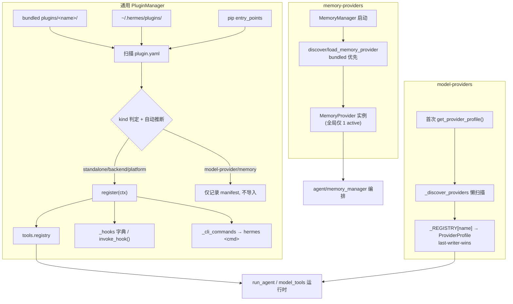

# 第十篇　插件体系与提供者

*作者：Amlei　·　更新时间：2026-08-08*

> 插件是 Hermes 在不修改核心代码的前提下扩展能力的官方路径。本篇剖析三套并行的发现系统——通用 PluginManager、model-provider、memory-provider——为何各自独立、它们的覆盖语义有何不同、PluginContext 如何向插件暴露生命周期钩子与工具注册，以及治理政策为何对"第三方产品进树"持封闭态度。

---

## 第 1 章　三套并行的发现系统

Hermes 的"插件"并非单一机制，而是 **三套各自独立、懒加载、互不干涉的发现/注册系统**，外加若干"ABC + 注册表"的小型子系统（image-gen / web / browser / TTS / STT / video / dashboard-auth / secret-source）。三者之所以分开，是因为它们的生命周期、唯一性约束与覆盖语义都不同：

| 发现系统 | 入口 | 触发时机 | 覆盖语义 | 唯一性 |
|----------|------|----------|----------|--------|
| 通用 PluginManager | `hermes_cli/plugins.py` | 导入 `model_tools.py` 时副作用触发 | 后者覆盖前者（user > bundled） | 多插件并存，opt-in |
| model-providers | `providers/__init__.py` | 首次 `get_provider_profile()` | last-writer-wins（user 覆盖 bundled） | 名字→profile，可别名 |
| memory-providers | `plugins/memory/__init__.py` | `MemoryManager` 显式调用 | **bundled 优先**（first-seen-wins） | 全局仅 1 个 active |



---

## 第 2 章　设计目标：扩展而不改核心

`AGENTS.md:779-784` 把这条规则显式写为"Teknium, May 2026"的硬性约束：

> 插件 MUST NOT 修改核心文件（run_agent.py、cli.py、gateway/run.py、hermes_cli/main.py 等）。如果插件需要框架未暴露的能力，扩展 generic plugin surface（新 hook、新 ctx 方法）——绝不把插件特有逻辑硬编码进核心。

其历史背景是 PR #5295 从 `main.py` 中删除了 95 行硬编码的 honcho argparse——把插件特有逻辑塞进核心文件曾被当作反模式清理过一次。

**封闭集合政策**针对 in-tree provider：`plugins/memory/` 下的内置 memory provider 集合已关闭，新的 memory 后端必须以独立仓库形式发布；2026 年 6 月进一步把该规则扩展到所有第三方产品插件（observability、SaaS 连接器、付费服务集成等），理由是"maintenance load：每吸收进树的产品都成为我们对抗快速演进的核心的负担"。已存在的 `observability/`、`kanban/`、`disk-cleanup/` 等是既成事实，不是邀请更多第三方产品进树。

---

## 第 3 章　PluginManager 深挖

### 3.1　四个发现源与扫描顺序

`_discover_and_load_inner`（`plugins.py:1339`）定义四个源，**后源覆盖前源**：

1. **bundled**：`<repo>/plugins/<name>/`（优先读 `HERMES_BUNDLED_PLUGINS` 环境变量）；
2. **user**：`get_hermes_home() / "plugins"`；
3. **project**：`Path.cwd() / ".hermes" / "plugins"`，默认关闭，需 `HERMES_ENABLE_PROJECT_PLUGINS=1`；
4. **pip / entry-point**：group 为 `"hermes_agent.plugins"` 的入口点。

### 3.2　plugin.yaml manifest 与 kind 自动推断

`PluginManifest` dataclass 字段含 `name`/`version`/`kind`/`source`/`path`/`key`。`kind` 是核心路由字段，取值 `standalone`/`backend`/`exclusive`/`platform`/`model-provider`。

```python
# hermes_cli/plugins.py:284
@dataclass
class PluginManifest:
    """Parsed representation of a plugin.yaml manifest."""
    name: str
    version: str = ""
    source: str = ""        # "user"/"project"/"bundled"/"entrypoint"
    path: Optional[str] = None
    # kind 是核心路由字段:standalone/backend/exclusive/platform/model-provider
    kind: str = "standalone"
    # path-derived key,用于 plugins.enabled/disabled 查询与 hermes plugins list
    key: str = ""
```

当用户安装的插件**没有显式写 `kind:`** 时，`_parse_manifest` 读 `__init__.py` 前 8192 字节做文本嗅探：含 `register_memory_provider`/`MemoryProvider` → `exclusive`；含 `register_provider`/`ProviderProfile` → `model-provider`。这是为了避免用户安装的 memory/model provider 被通用 PluginManager 加载（`PluginContext` 上并没有 `register_memory_provider` 方法，会出错），而是把它们路由到各自专门的发现系统。

```python
# hermes_cli/plugins.py:1622
if kind == "standalone" and "kind" not in data:
    init_file = plugin_dir / "__init__.py"
    if init_file.exists():
        try:
            source_text = init_file.read_text(errors="replace", encoding="utf-8")[:8192]
            if (
                "register_memory_provider" in source_text
                or "MemoryProvider" in source_text
            ):
                kind = "exclusive"          # 路由到 plugins/memory 发现
            elif (
                "register_provider" in source_text
                and "ProviderProfile" in source_text
            ):
                kind = "model-provider"     # 路由到 providers/__init__ 发现
        except Exception:
            pass
```

### 3.3　加载决策

`:1402-1491` 先按 key 去重得 `winners`，再逐个决策：

1. **显式 disable 优先**；
2. **kind == "exclusive"**：仅记录 manifest 供 introspection，不导入，交给 memory 发现系统；
3. **kind == "model-provider"**：仅记录，不导入——避免二次导入产生两个 `ProviderProfile` 实例破坏 last-writer-wins（这是三系统分离的**关键原因**）；
4. **bundled + backend**：自动加载（随 Hermes 出厂必须开箱即用）；
5. **bundled + platform**：`_register_deferred_platform` 注册懒加载器，避免每次 `hermes` 调用都导入 ~20 个平台 SDK 拖慢启动；
6. **其余**：必须出现在 `plugins.enabled` allow-list 才加载。

### 3.4　_load_plugin 与 register(ctx)

`_load_plugin` 做四件事：调 `registry.register_plugin_override_policy(...)` 预注册 tool-override 权限策略；导入模块；取 `register` 函数，构造 `PluginContext(manifest, self)` 并调用；通过"快照前/后状态差分"精确归属该插件注册了多少 tool/hook/middleware/command。

差分的关键是非对称的：**tool 用名字集合差，hook/middleware 用回调计数差**。hook 名可被多插件共用（都注册 `pre_tool_call`），早期按名字 diff 的实现会把共用名只归给首个插件、后续插件 under-report；改按每个 hook 的回调条目数前后差，才能正确归属"本插件新增的那一条回调"。

```python
# hermes_cli/plugins.py:1807
_tools_before = set(self._plugin_tool_names)
_hook_counts_before = {h: len(cbs) for h, cbs in self._hooks.items()}
_mw_counts_before = {kind: len(cbs) for kind, cbs in self._middleware.items()}
register_fn(ctx)
loaded.tools_registered = [t for t in self._plugin_tool_names if t not in _tools_before]
loaded.hooks_registered = [
    h for h, cbs in self._hooks.items() if len(cbs) > _hook_counts_before.get(h, 0)
]
loaded.middleware_registered = [
    kind for kind, cbs in self._middleware.items()
    if len(cbs) > _mw_counts_before.get(kind, 0)
]
```

### 3.5　发现的幂等性与失败语义

`discover_and_load` 用 `self._discovered` 标志做重入保护。关键容错：**先把 `_discovered` 置 True，若扫描抛异常则重置为 False**，避免一次失败被永久缓存成"空注册表已发现"。`HERMES_SAFE_MODE=1` 跳过全部发现。

---

## 第 4 章　PluginContext (ctx) API

`PluginContext` 是交给每个插件 `register(ctx)` 的门面，是一个庞大的注册 API 表面。

### 4.1　工具与覆盖

`register_tool` 委托给 `tools.registry.register`。`override=True` 替换同名内置工具时，必须通过 **operator opt-in 信任门** `_tool_override_allowed`：

```python
source = getattr(self.manifest, "source", "") or ""
if source == "bundled":
    return True                      # bundled 默认可信
cfg = load_config() or {}
entries = (cfg.get("plugins") or {}).get("entries") or {}
return bool(entries.get(plugin_id, {}).get("allow_tool_override", False))
```

读不到 config 时 fail-closed。安全动机：没有该门，任何 enabled 插件都能静默替换 `shell_exec`/`write_file` 等特权内置工具并外泄数据。

### 4.2　CLI 子命令 vs slash 命令（两套，易混）

- `register_cli_command(name, ...)`：注册**终端子命令** `hermes <name>`，由 `main.py:11640` 在 argparse 构建期 wire 进主 parser；
- `register_command(name, handler, ...)`：注册**会话内 slash 命令** `/name`（CLI 与 gateway 通用），handler 签名 `fn(raw_args) -> str | None`。

### 4.3　大量 ABC 后端注册方法

每个对应一个"ABC + registry"子系统，模式完全一致——延迟 import 基类、`isinstance` 校验、委托给对应 registry 的 `register_provider`、类型不符时 WARNING + 静默忽略（"never raised so a broken plugin cannot crash the host"）：

| ctx 方法 | 基类 | 路由配置键 |
|----------|------|-----------|
| `register_context_engine` | `ContextEngine` | `context.engine`（全局单例） |
| `register_image_gen_provider` | `ImageGenProvider` | `image_gen.provider` |
| `register_video_gen_provider` | `VideoGenProvider` | `video_gen.provider` |
| `register_web_search_provider` | `WebSearchProvider` | `web.search_backend` |
| `register_browser_provider` | `BrowserProvider` | `browser.cloud_provider` |
| `register_tts_provider` / `register_transcription_provider` | `TTSProvider`/`TranscriptionProvider` | `tts.provider`/`stt.provider` |
| `register_dashboard_auth_provider` | `DashboardAuthProvider` | dashboard 绑定非回环时 |
| `register_secret_source` | `SecretSource` | `secrets.<name>` |
| `register_platform` | PlatformEntry | gateway 平台配置 |

### 4.4　hooks 与 middleware

`register_hook(hook_name, callback)` 把回调加入 `_hooks[hook_name]`。全部合法 hook 在 `VALID_HOOKS`，数量众多，远超基础的生命周期钩子：

- **工具**：`pre_tool_call`、`post_tool_call`、`transform_terminal_output`、`transform_tool_result`
- **LLM/API**：`transform_llm_output`、`pre_llm_call`、`post_llm_call`、`pre_api_request`、`post_api_request`
- **会话生命周期**：`on_session_start`、`on_session_end`、`on_session_reset`
- **验证门**：`pre_verify`
- **技能**：`on_skill_lifecycle`
- **子代理**：`subagent_start`、`subagent_stop`
- **网关**：`pre_gateway_dispatch`
- **审批**：`pre_approval_request`、`post_approval_response`（观察者）
- **看板**：`kanban_task_claimed`、`kanban_task_completed`、`kanban_task_blocked`

`PluginManager.invoke_hook` 逐个回调包 try/except——"a misbehaving plugin cannot break the core agent loop"。

```python
# hermes_cli/plugins.py:1180
def register_hook(self, hook_name: str, callback: Callable) -> None:
    """未知 hook 名告警但仍存,前向兼容。"""
    if hook_name not in VALID_HOOKS:
        logger.warning(
            "Plugin '%s' registered unknown hook '%s'",
            self.manifest.name, hook_name,
        )
    self._manager._hooks.setdefault(hook_name, []).append(callback)
```

```python
# hermes_cli/plugins.py:1935
callbacks = self._hooks.get(hook_name, [])
results: List[Any] = []
for cb in callbacks:
    try:
        ret = cb(**kwargs)
        if ret is not None:
            results.append(ret)
    except Exception as exc:        # 单回调异常被吞,不破坏 agent 主循环
        logger.warning("Hook '%s' callback %s raised: %s",
                       hook_name, getattr(cb, "__name__", repr(cb)), exc)
return results
```

### 4.5　pre_tool_call 的 block/approve 指令解析

`_get_pre_tool_call_directive_details` 把 hook 返回值规约为 `_PreToolCallDirective`：

- `{"action": "block", "message": "..."}`：否决，message 成为模型看到的 tool result；
- `{"action": "approve", ...}`：升级到现有人工审批门，让任意工具（不止危险 shell）都可走 `[o]nce/[s]ession/[a]lways/[d]eny` 决策。

`resolve_pre_tool_block` 是**唯一**集中的工具分派点：approve 指令若审批门出错/拒绝/超时则 fail-closed 成 block。

### 4.6　host-owned LLM 与子代理生命周期

`ctx.llm` 懒构造 `agent.plugin_llm.PluginLlm`，让可信插件用宿主活跃模型与 auth 跑 chat/结构化补全，无需自带 provider key。`ctx.subagent_lifecycle` 暴露插件安全的子代理生命周期服务——只在真正 launch child 时解析父代理，插件拿到的是可序列化句柄与不可变快照，绝不拿到 live agent。

### 4.7　发现时机陷阱

`discover_plugins()` **只作为导入 `model_tools.py` 的副作用运行**（`model_tools.py:229`）。任何不先导入 `model_tools.py` 就读插件状态的代码路径，必须显式调 `discover_plugins()`（幂等）。

---

## 第 5 章　model-provider 插件

### 5.1　ProviderProfile 数据类

`ProviderProfile`（`providers/base.py:38`）是**声明式**——描述 provider 行为，不负责 client 构造/凭证轮换/流式。字段分组：

- **身份**：`name`、`api_mode`（默认 `chat_completions`，Anthropic 为 `anthropic_messages`）、`aliases`；
- **auth & endpoint**：`env_vars`、`base_url`、`auth_type`（`api_key|oauth_device_code|oauth_external|copilot|aws_sdk`）；
- **vision 能力**：`supports_vision`、`supports_vision_tool_messages`（Xiaomi MiMo 这类接受多模态 user message 但拒收 list 型 tool content 的需设 False）；
- **模型目录**：`fallback_models`（live fetch 失败时 picker 用的精选列表）；
- **可覆写 hooks**：`prepare_messages()`、`build_extra_body()`、`build_api_kwargs_extras()`（返回 `(extra_body_additions, top_level_kwargs)`——因 reasoning config 有的 provider 放 extra_body 如 OpenRouter，有的放顶层如 Kimi）、`fetch_models()`。

```python
# providers/base.py:38
@dataclass
class ProviderProfile:
    """Base provider profile — declarative;不负责 client 构造/凭证/流式。"""
    # ── Identity ──
    name: str
    api_mode: str = "chat_completions"   # 或 "anthropic_messages"
    aliases: tuple = ()
    # ── Auth & endpoints ──
    env_vars: tuple = ()
    base_url: str = ""
    auth_type: str = "api_key"           # api_key|oauth_device_code|oauth_external|copilot|aws_sdk
    # ── Vision ──
    supports_vision: bool = False
    supports_vision_tool_messages: bool = True   # Xiaomi MiMo 类拒收 list 型 tool content 时设 False
    # ── Model catalog ──
    fallback_models: tuple = ()          # live fetch 失败时 picker 用的精选列表
```

### 5.2　独立的懒发现

`providers/__init__.py` 维护三个模块级状态：`_REGISTRY`、`_ALIASES`、`_discovered`。`get_provider_profile(name)` 和 `list_providers()` 在首次调用时触发 `_discover_providers()`。扫描顺序：bundled → user → legacy。`register_provider` 后注册者覆盖前者：

```python
_REGISTRY[profile.name] = profile
for alias in profile.aliases:
    _ALIASES[alias] = profile.name
```

所以 user plugin 同名能覆盖 bundled——第三方可不改 repo 就替换任意内置 profile。

```python
# providers/__init__.py:163
# 1. Bundled:<repo>/plugins/model-providers/<name>/
if _BUNDLED_PLUGINS_DIR.is_dir():
    for child in sorted(_BUNDLED_PLUGINS_DIR.iterdir()):
        if child.is_dir() and not child.name.startswith(("_", ".")):
            _import_plugin_dir(child, "bundled")
# 2. User:$HERMES_HOME/plugins/model-providers/<name>/  (同名覆盖 bundled)
user_dir = _user_plugins_dir()
if user_dir is not None:
    for child in sorted(user_dir.iterdir()):
        if child.is_dir() and not child.name.startswith(("_", ".")):
            _import_plugin_dir(child, "user")
# 3. Legacy:providers/<name>.py 单文件,经 pkgutil.iter_modules 兜底(向后兼容)
try:
    import pkgutil
    import providers as _pkg
    for _importer, modname, _ispkg in pkgutil.iter_modules(_pkg.__path__):
        if modname.startswith("_") or modname == "base":
            continue
        importlib.import_module(f"providers.{modname}")   # 跳过 _ 前缀与 base
except Exception:
    pass
```

### 5.3　三种 ProviderProfile 写法范式

- **A. 直接实例化（最简，GMI）**：适合无特殊 request quirk 的 OpenAI-compat provider。
- **B. 子类化 + 覆写 fetch_models（Anthropic）**：用 `x-api-key` 头（非 Bearer）+ `anthropic-version: 2023-06-01`。
- **C. 子类化 + 覆写 build_extra_body / build_api_kwargs_extras（OpenRouter）**：最复杂的范例。`build_extra_body` 注入 `session_id`（sticky routing key，从 ambient conversation contextvar 解析）、`provider` preferences、Pareto Code router 的 `plugins` 块（model-gated）。`build_api_kwargs_extras` 处理 reasoning config：对 reasoning-mandatory Anthropic 模型不发 `reasoning` 字段，而把 effort 映射到 `verbosity`；对 xAI Grok 注入 `x-grok-conv-id` header 钉死 prompt cache 的后端服务器。

---

## 第 6 章　memory-provider 插件

### 6.1　MemoryProvider ABC

`MemoryProvider`（`agent/memory_provider.py:81`）abstract：`name`、`is_available()`、`initialize(session_id, **kwargs)`、`get_tool_schemas()`。核心生命周期由 `MemoryManager` 编排：`initialize` → `system_prompt_block()` → `prefetch(query)` → `sync_turn(user, asst)` → `get_tool_schemas`/`handle_tool_call` → `shutdown()`。

可选 hook 丰富：`on_turn_start`、`on_session_end`、`on_session_switch`（处理 `/resume`/`/branch`/`/reset`/压缩的 session_id 轮换）、`on_pre_compress`（返回文本进压缩 summary prompt）、`on_delegation`、`on_memory_write`（镜像内置 memory 工具写入）、`backup_paths()`。

`MemoryManager` 强制 **one-external-provider limit**——防止 tool schema 膨胀与 memory 后端冲突。

```python
# agent/memory_provider.py:81
class MemoryProvider(ABC):
    """Abstract base class for memory providers."""

    @property
    @abstractmethod
    def name(self) -> str:
        """短标识:'builtin'/'honcho'/'hindsight'…"""

    @abstractmethod
    def is_available(self) -> bool:
        """凭证/依赖就绪才返回 True(不发网络请求)。"""

    @abstractmethod
    def initialize(self, session_id: str, **kwargs) -> None:
        """Agent 启动调用一次;kwargs 必含 hermes_home 与 platform。"""

    @abstractmethod
    def get_tool_schemas(self) -> List[Dict[str, Any]]:
        """本 provider 暴露的工具 schema(OpenAI function 格式)。"""
```

### 6.2　独立发现：bundled 优先（与 model-provider 相反）

`plugins/memory/__init__.py` 是一套与通用 PluginManager 完全平行的发现机制。关键差异——**bundled 优先（first-seen-wins）**，而非 model-provider 的 last-writer-wins：先扫 bundled，把名字加入 `seen`；再扫 user，跳过 seen 中的名字。

### 6.3　CLI：仅 active provider 暴露

`discover_plugin_cli_commands()` 只读 `memory.provider` 配置，只加载**当前 active** 那个插件的 `cli.py`。这样禁用的 provider 不会塞满 `hermes --help`。

当前内置 memory provider：honcho、mem0、supermemory、byterover、hindsight、holographic、openviking、retaindb。

---

## 第 7 章　context-engine 与 image-gen 插件（ABC + 编排器范式）

二者示范了"ABC + 中央 registry/编排器 + 每插件目录"的统一模式。

### 7.1　ContextEngine

`agent/context_engine.py:89` abstract：`name`、`update_from_response(usage)`、`should_compress(prompt_tokens)`、`compress(messages, ...)`。丰富的可选 hook：`prune_tool_results_only`、`select_context`（每 turn、request 前的上下文选择——与 compression 正交）、`on_turn_complete`。

插件经 `ctx.register_context_engine(engine)` 注入，全局单例。`context.engine` 配置选择，默认 `"compressor"`（内置 `ContextCompressor`）。

### 7.2　ImageGenProvider

`agent/image_gen_provider.py:64` abstract：`name`、`generate(prompt, aspect_ratio, *, image_url, reference_image_urls, **kwargs)`。统一表面：单工具 `image_generate` 同时覆盖 text-to-image 与 image-to-image/edit，路由依据是否提供 `image_url`。

`agent/image_gen_registry.py` 的 `get_active_provider` 选择逻辑：`image_gen.provider` 配置 → 若未设，唯一注册则用它 → 否则 legacy 默认 `fal` → 否则 None（工具报错指向 `hermes tools`）。

---

## 第 8 章　其他插件类别一览

- **cron_providers**：几乎是 memory 发现的逐字克隆，重定向到 `CronScheduler` ABC。内置 `InProcessCronScheduler` 是核心，不在此发现。仅非默认 provider（如 chronos）在此。
- **dashboard_auth**：basic/drain/nous/self_hosted。dashboard 绑定非回环主机且无 `--insecure` 时启用 OAuth 门。
- **observability**：langfuse/nemo_relay。manifest 声明所用的 hooks。
- **kanban**：多代理看板调度器 + worker 插件。Web UI 在 `dashboard/`，systemd 服务文件在 `systemd/`。
- **standalone 范例**：google_meet、disk-cleanup（`hooks: [post_tool_call, on_session_end]`，无工具）、spotify、security-guidance、teams_pipeline、hermes-achievements。

---

## 第 9 章　为何如此设计：权衡的总账

1. **三套并行发现系统 vs 统一**：三套分离不是偶然，而是被各子系统的语义差异强制的——memory 是全局唯一 active（exclusive）、bundled 优先；model-provider 是多名并存、last-writer-wins、可别名；通用 plugin 是多并存、opt-in。强行统一会丢失这些语义。代价是三套相似的目录扫描/命名空间代码，维护重复。
2. **operator opt-in tool override**：`allow_tool_override` 配置门是安全关键设计。bundled 默认可信；第三方必须显式 opt-in，防止 privilege escalation。fail-closed on config-read-error。
3. **manifest kind 自动推断**：双刃剑。优点是零配置正确；缺点是启发式可能误判。显式写 `kind:` 总是优先。
4. **deferred platform loading**：bundled 平台 ~20 个 SDK 全 eager 导入会拖慢每次 `hermes` 调用数秒。lazy 注册廉价 loader 到 `platform_registry`，首次真正用到才 import。
5. **API 一致性"never raised"惯例**：所有 `register_*_provider` 在类型不符或重名时 WARNING + 静默忽略。哲学：坏插件不能 crash 宿主。`invoke_hook`/`invoke_middleware` 同样逐回调 try/except 隔离。
6. **ephemeral 注入保留 cache prefix**：`pre_llm_call` 的 context 永远注入 user message 而非 system prompt——保持 system prompt 跨 turn 字节一致以复用 prompt cache。

---

*第十篇完。下一篇进入编排与自动化，剖析委派、Cron 与 Kanban 三种机制如何分别承担并行工作流、定时自动化与跨 worker 协作。*
