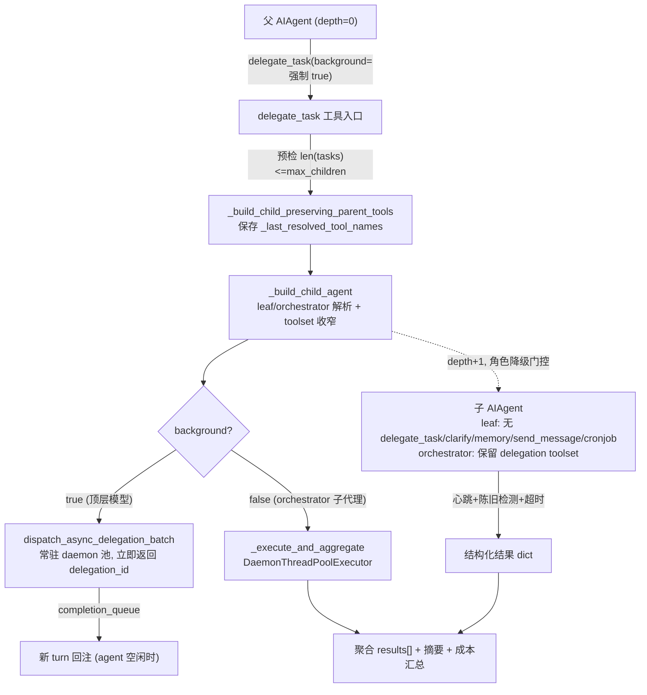
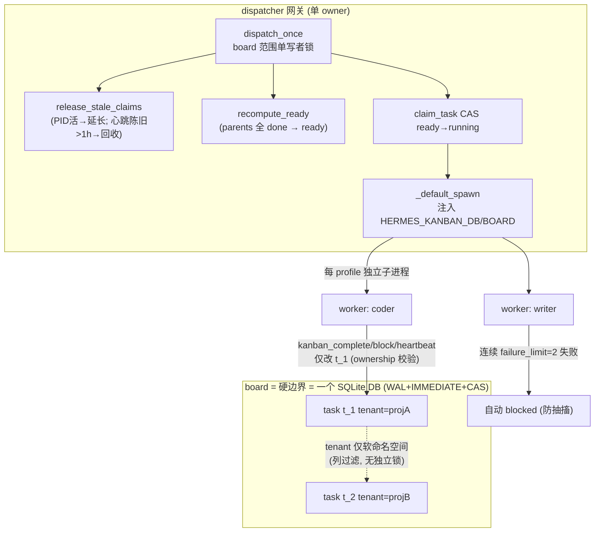

# 第十一篇　委派、Cron 与 Kanban

*作者：Amlei　·　更新时间：2026-08-08*

> 代理不仅要完成单个回合的工作，还要并行、定时、跨进程地组织工作。本篇剖析 Hermes 的三种编排机制——进程内并行的 `delegate_task`、按计划触发的 Cron、跨 worker 持久协作的 Kanban——各自如何工作、它们的隔离与持久性边界何在，以及一个关键的设计准则：何时该用哪一种。

---

## 第 1 章　三子系统的定位

一句话区分三者：

- **DELEGATION**（`tools/delegate_tool.py`、`tools/async_delegation.py`）：进程内、共享同一 Python 解释器的子代理派生，用于并行工作流；快、隔离上下文，但**不抗进程重启**。
- **CRON**（`cron/jobs.py`、`cron/scheduler.py`）：按计划触发，多平台投递，无人在场（unattended）；持久存储于 `~/.hermes/cron/jobs.json`，**抗重启**。
- **KANBAN**（`hermes_cli/kanban_db.py`、`tools/kanban_tools.py`）：SQLite 看板，跨 worker（跨进程/跨 profile）协作的持久任务系统；看板为硬边界，租户为软命名空间，**抗重启**。

---

## 第 2 章　DELEGATION

### 2.1　设计目标

派生独立的子 `AIAgent` 实例，各自拥有隔离上下文与独立终端会话。每个子代理获得：(1) 全新对话（无父历史）；(2) 自己的 `task_id`；(3) 父代理的 toolset，剥离子代理禁用工具；(4) 由委派目标 + 上下文构建的聚焦系统提示。父上下文只看到委派调用本身与最终摘要，永远看不到子的中间工具调用。

核心常量：

- `DELEGATE_BLOCKED_TOOLS = {"delegate_task", "clarify", "memory", "send_message", "cronjob"}`——子代理不得递归委派、不得交互、不得写共享 `MEMORY.md`、不得跨平台副作用、不得在父名下排程；
- `_DEFAULT_MAX_CONCURRENT_CHILDREN = 3`；
- `MAX_DEPTH = 1`（默认扁平：父(0)→子(1)，孙子被拒，除非上调 `max_spawn_depth`）；
- `DEFAULT_CHILD_TIMEOUT = None`（**默认无墙钟上限**；卡死保护由心跳陈旧度监视器承担）。

形态上区分 single（单 `goal`）与 batch（`tasks` 数组），以及 foreground（等待摘要）与 background（异步回注）。

### 2.2　delegate_task 机制深挖

**深度门控**：`depth = parent_agent._delegate_depth`；若 `depth >= max_spawn`（默认 1），直接拒绝。

**批量并发上限——双层强制，非信号量**：

- 第一层预检：若 `len(tasks) > max_children` 直接拒绝；
- 第二层运行时：`DaemonThreadPoolExecutor(max_workers=max_children)`——上限即 worker 数本身，多余任务无法启动。

另有一个**独立的、位于 `run_agent.py` 的上限点**：`_cap_delegate_task_calls` 截断模型在**同一轮**内发出的多个独立 `delegate_task` tool_call，使其不超过 `max_concurrent_children`。

**子代理构建——`_build_child_agent`**：

- **角色解析**：`child_depth = parent_depth + 1`；`orchestrator_ok = _get_orchestrator_enabled() and child_depth < max_spawn`；`effective_role = role if (role == "orchestrator" and orchestrator_ok) else "leaf"`。即角色降级只在此时发生：kill switch 关闭或深度触底，都强制降为 `leaf`。
- **toolset 收窄**：子代理 toolset 取父启用 toolset 与（可选）请求 toolset 的交集，经 `_strip_blocked_tools` 剥离。`leaf` 角色的 `disabled_toolsets = inherited + _blocked_toolsets_for_role("leaf") + ["kanban"]`；`orchestrator` 则把 `delegation` toolset **无条件重新加回**——嵌套能力由角色授予，而非继承。

```python
# tools/delegate_tool.py:1409
    if effective_role == "orchestrator":
        # 角色授予 delegate_task，匹配下方 delegation toolset 的无条件重新加回
        inherited_disabled = [n for n in inherited_disabled if n != "delegation"]
    child_disabled_toolsets = list(
        dict.fromkeys(
            inherited_disabled + _blocked_toolsets_for_role(effective_role) + ["kanban"]
        )
    )
    # orchestrator 把 _strip_blocked_tools 移除的 delegation toolset 无条件加回
    # —— 嵌套能力由角色授予，而非继承
    if effective_role == "orchestrator" and "delegation" not in child_toolsets:
        child_toolsets.append("delegation")
```

- **AIAgent 构造**：以 `quiet_mode=True`、`skip_context_files=True`、`skip_memory=True`、`platform="subagent"`、`ephemeral_system_prompt=child_prompt`、`iteration_budget=None`（每子代理全新预算）等构造。

**`_last_resolved_tool_names` 保存/恢复——及其必要性**：

该符号是 `model_tools.py:247` 的**进程级全局**，每次工具解析（`get_tool_definitions`）都被覆写。子代理构造会重跑工具解析，**把全局覆写成子的（更窄的 leaf toolset）**；若不恢复，父随后的 `execute_code`/工具派发会读到子的 toolset。

- **构造期保存**——`_build_child_preserving_parent_tools`，在 `_CHILD_CONSTRUCTION_LOCK` 内 bracket 构造，并将父列表缓存到 `child._delegate_saved_tool_names`：
  ```python
  with _CHILD_CONSTRUCTION_LOCK:
      parent_tool_names = list(model_tools._last_resolved_tool_names)
      try:
          child = _build_child_agent(**kwargs)
      finally:
          model_tools._last_resolved_tool_names = parent_tool_names
  ```
- **运行期恢复**——`_run_single_child` 入口读取缓存，`finally` 块写回：因为子运行时还会再次改写全局。

**`_dispatch_delegate_task`（`run_agent.py:7637`）**——模型 `delegate_task` 工具的唯一调用点。关键：**`background` 被强制，不采纳 schema 值**：

```python
_is_subagent = getattr(self, "_delegate_depth", 0) > 0
return _delegate_task(..., background=(not _is_subagent), parent_agent=self)
```

顶层模型委派**总是后台**（模型无权阻塞自己的回合）；只有 orchestrator 子代理才同步——因为它必须在自己的回合内合成 worker 摘要，且不拥有异步结果要路由回去的网关会话。

**`_run_single_child` 的心跳线程（同步路径的活跃度桥）**：orchestrator 子代理同步执行期间，父的 `_last_activity_ts` 会冻结——网关看门狗会判定父"无活动"并杀掉整个 agent。`_run_single_child` 为每个子起一个 daemon 心跳线程，双职责：(1) 每 30s 调 `parent_agent._touch_activity()` 把"子仍在工作"传播给父；(2) 陈旧检测——若子的 `(api_call_count, current_tool, last_activity_ts)` 三元组在连续 N 个心跳周期内全无前进，则计数为 stale。阈值分两档：空闲（未在工具内）15 周期=450s，在工具内 40 周期=1200s（合法慢工具给足时间，真正卡死的子很快触及空闲阈值）。一旦判定 stale，线程**停止 touch 父**——故意让网关非活动超时触发，由网关统一收割，而非子自己猜一个墙钟上限。

```python
# tools/delegate_tool.py:837
_HEARTBEAT_INTERVAL = 30
_HEARTBEAT_STALE_CYCLES_IDLE = 15        # 15 * 30s = 450s 空闲 → stale
_HEARTBEAT_STALE_CYCLES_IN_TOOL = 40     # 40 * 30s = 1200s 卡同一工具 → stale
# tools/delegate_tool.py:2152 —— 三元组任一前进即清零,否则累计
if iter_advanced or tool_changed or activity_advanced:
    _stale_count[0] = 0
else:
    _stale_count[0] += 1
stale_limit = (_HEARTBEAT_STALE_CYCLES_IN_TOOL if child_tool
               else _HEARTBEAT_STALE_CYCLES_IDLE)
if _stale_count[0] >= stale_limit:
    break   # 停止 touch 父,让网关超时触发
```

注：这组阈值与下方 2.3 异步路径的 stall monitor 数值相同（450s/1200s），但机制不同——同步路径是**每子一个心跳线程**（只有 orchestrator 子走此路），异步路径是**单 daemon 监视线程**扫所有记录。

### 2.3　异步委派（tools/async_delegation.py）

`background=true` 经 `dispatch_async_delegation_batch` 派发到**模块级常驻 daemon 执行器**，立即返回 `{"status":"dispatched","delegation_id":...}`。

```python
# tools/async_delegation.py:998
    with _records_lock:
        running = sum(1 for r in _records.values()
                      if r.get("status") in ("running", "stalling"))
        if running >= max_async_children:           # 容量满即 rejected，不排队
            return {"status": "rejected",
                    "error": f"Async delegation capacity reached ({max_async_children} running)..."}
        _records[delegation_id] = record             # 容量检查与记录插入在同一锁内
    _persist_dispatch(record)                         # 仅持久化投递账本，非计算本身
    executor = _get_executor(max_async_children)      # 模块级常驻 daemon 执行器
    # ... worker 构造省略 ...
    executor.submit(propagate_context_to_thread(_worker))  # daemon 线程；立即返回
    return {"status": "dispatched", "delegation_id": delegation_id}
```

**结果回注**：子完成时把 `type="async_delegation"` 事件 push 到共享的 `process_registry.completion_queue`。CLI 的 `process_loop` 与网关的 `_run_process_watcher` 已在 agent 空闲时轮询该队列，把每个事件锻造为**新一轮** turn——硬不变式：永不改动历史上下文，保 prompt 缓存与消息轮替合法。

不变式靠的是回注路径：drain 出的事件被格式化成合成消息，**放进与真实用户输入同一个 `_pending_input` 队列**，由 `process_loop` 当作下一轮的 user 消息消费——因此它出现在新 turn 的起点，而非被拼接进已有历史。`async_delegation` 事件还需通过"正向证明"归属校验（`owns_event` 回调或 `session_key` 相等），校验失败的事件被重新入队留给真正属主，fail-closed 不泄露给错误会话。

```python
# cli.py:10692
for event, synthetic_message in process_registry.drain_notifications(
    session_key=session_key,
    owns_event=self._owns_process_notification,   # 正向证明归属
):
    claim = claim_event_delivery(event, consumer)
    if claim is None:
        continue
    self._pending_input.put(synthetic_message)    # → 下一轮 user 消息,非历史拼接
    complete_event_delivery(event, claim)
```

**容量与拒绝**：达到 `max_async_children` 即 `rejected`（**不排队**），防止失控模型堆积无界后台工作；调用方回退同步执行。

**陈旧检测**：单 daemon 监视线程每 30s 扫描，token 冻结过 450s（空闲）或 1200s（工具内）即标记 `stalling` 并调 `interrupt_fn`，再给 120s 优雅退场，仍未返回则终结。

**持久性边界（关键）**：`async_delegations` SQLite 表持久化的是**投递账本**，不是计算本身。`recover_abandoned_delegations` 把"属主进程已消失"的记录标记为 `status="unknown"`——它**不会**重新运行子代理，只承认结果未知。**因此：background delegate 是进程局部的，不抗重启。** 跨重启的持久自动化必须用 cron 或 terminal 后台。



---

## 第 3 章　CRON

### 3.1　设计目标

用自然语言/计划串描述的定时自动化，多平台投递，无人在场运行。Cron 是**按 profile 隔离**的：每个 profile 在自己的 `HERMES_HOME` 下拥有独立的 `cron/jobs.json`。

### 3.2　Job store（cron/jobs.py）

存储于 `~/.hermes/cron/jobs.json`，输出在 `cron/output/{job_id}/{ts}.md`。跨进程锁 `.jobs.lock`，组合进程内 `RLock` + 跨进程 `fcntl.flock`（Windows 回退 `msvcrt`）。

**create_job 字段**：`skills`、`model/provider/base_url`（每作业推理覆盖，含创建时快照做漂移守卫）、`script`、`no_agent`（脚本即作业，跳过 agent）、`context_from`（链式：注入他作业最近输出）、`enabled_toolsets`、`workdir`（运行在特定目录，加载其 AGENTS.md/CLAUDE.md 并设 `TERMINAL_CWD`）、`deliver`、`origin`、`attach_to_session`、`repeat`、`schedule`、`next_run_at`。

**计划解析四形态**：

1. 时长 → 一次性（`"30m"`/`"2h"`/`"1d"`）；
2. `"every X"` → 周期 interval；
3. 5/6 字段 cron 表达式（需 `croniter`）；
4. ISO 时间戳 → 一次性。

**catchup 窗口（半周期，钳 120s–2h）**：周期作业超 grace 的漏触发**跳过累积但仍立即触发一次**（修 #33315 的无限延迟环）。

**三重 at-most-once**：(1) `advance_next_runs`（tick 内批量预先推进 `next_run_at`）；(2) `claim_dispatch`（有限一次性在**执行前**提交 `repeat.completed`，把 at-least-once 变 at-most-times）；(3) `claim_job_for_fire`（store CAS，Chronos 用）。

### 3.3　Tick loop（cron/scheduler.py）

网关每 60s 在后台线程调 `tick()`。

**`tick()`**——文件锁 `~/.hermes/cron/.tick.lock` 非阻塞获取（失败则 return 0）。锁内：`get_due_jobs()` → 无作业则空 tick 快速返回（仍做 MCP 孤儿清理）→ `advance_next_runs` 批量预先推进 → **分池**：`workdir` 作业进单线程 sequential 池（避免 `os.environ["TERMINAL_CWD"]` 竞争），无 workdir 进 parallel 池 → `_submit_with_guard` fire-and-forget 派发。

```python
# cron/scheduler.py:4181
    lock_fd = open(lock_file, "w", encoding="utf-8")
    try:
        if fcntl:
            fcntl.flock(lock_fd, fcntl.LOCK_EX | fcntl.LOCK_NB)   # 非阻塞跨进程锁
        elif msvcrt:
            msvcrt.locking(lock_fd.fileno(), msvcrt.LK_NBLCK, 1)
    except (OSError, IOError):
        return 0                                                    # 另一 tick 持锁，本轮让出
    # ... can_dispatch 门控 ...
    due_jobs = get_due_jobs()
    if not due_jobs:
        return 0                                  # 空 tick：仍做 MCP 孤儿清理
    advance_next_runs([job["id"] for job in due_jobs])   # 批量预先推进 → at-most-once
    # 分池：workdir 作业会改 os.environ["TERMINAL_CWD"]（进程全局），须串行
    sequential_jobs = [j for j in due_jobs if (j.get("workdir") or "").strip()]
    parallel_jobs = [j for j in due_jobs if not (j.get("workdir") or "").strip()]
```

**`_ReadWriteLock`**：写优先读写锁，守护进程级 `TERMINAL_CWD` 覆盖；workdir 作业是写者（独占），无 workdir 作业是读者（并发），故无 workdir 作业绝不会被另一作业的 workdir 污染。

"写优先"由 `_writers_waiting` 计数器实现：读者在 `acquire_read` 里不仅等当前写者释放，还等**任何已排队的写者**（`_writers_waiting > 0` 时也阻塞）——这保证一串无 workdir 的读者作业不会饿死 sequential 池里排队的 workdir 写者。

```python
# cron/scheduler.py:463
def acquire_read(self) -> None:
    with self._cond:
        while self._writer_active or self._writers_waiting > 0:
            self._cond.wait()              # 有写者排队就先让,写优先
        self._readers += 1

def acquire_write(self) -> None:
    with self._cond:
        self._writers_waiting += 1
        try:
            while self._writer_active or self._readers > 0:
                self._cond.wait()
        finally:
            self._writers_waiting -= 1
        self._writer_active = True
```

**run_job → 构造 cron AIAgent**：

```python
agent = AIAgent(
    ...,
    enabled_toolsets=_resolve_cron_enabled_toolsets(job, cfg),
    disabled_toolsets=_resolve_cron_disabled_toolsets(cfg),  # 恒禁 cronjob/messaging/clarify/memory
    quiet_mode=True,
    skip_context_files=not bool(_job_workdir),
    skip_memory=True,  # cron agent 不得污染用户记忆
    platform="cron",
    session_id=_cron_session_id,
)
```

`memory` 之所以禁用，正因 cron agent 用 `skip_memory=True`，暴露该工具只会给模型一个无支撑的失败工具。

### 3.4　非活动超时（即"硬中断"真相）

> **勘误**：直觉上 cron 似应有"3 分钟硬中断"，但代码中实际机制是**基于非活动（inactivity）的超时**，默认 600s，由 `request_hard_interrupt` 触发（`cron/scheduler.py:3684`）：

```python
_cron_timeout = 600.0  # 默认 10 分钟非活动；HERMES_CRON_TIMEOUT 覆盖；0=unlimited
if _idle_secs >= _cron_inactivity_limit:
    request_hard_interrupt(agent, "Cron job timed out (inactivity)")
    raise TimeoutError(...)
```

即**只要持续有工具调用/流式 token，作业可跑数小时**；只在 600s 无活动时硬中断。`HERMES_CRON_TIMEOUT=0` 完全禁用看门狗。这是刻意的：错误应来自子代理实际所做的事，而非通用秒表。

### 3.5　会话框架

每次 cron 运行开自己的 SQLite 会话 `_cron_session_id = f"cron_{job_id}_{ts}"`，结束时 `end_session(..., "cron_complete")`。投递有 header/footer 包装。**默认隔离**：cron 输出只进自己的 cron 会话，**不镜像**进目标聊天会话。镜像 opt-in：每作业 `attach_to_session` 或全局 `cron.mirror_delivery`（默认 False），且即便开启也仅限 origin 会话，并以 user 角色 + `[Cron delivery: ...]` 前缀追加，保消息轮替合法。

### 3.6　cronjob 工具与 Chronos 契约

**cronjob 工具**：`model/provider/base_url` 故意**不**从 agent 参数读取——"每作业推理钉是用户所有的（dashboard、`hermes cron create --model`、手编 jobs.json）。agent 不得把无人值守的花费指向不同的模型。"

**Chronos 托管 cron 契约**（`docs/chronos-managed-cron-contract.md`）：让托管网关**空闲缩容到零**仍能触发 cron。agent 请求 NAS（Nous-Account-Service）在每个作业真实下次触发时间 arm **恰好一个外部一次性定时器**；NAS 在触发时经认证 webhook 回调 agent，agent 跑作业后再 arm 下一个。三跳信任模型：agent→NAS 用 Nous Portal access token；scheduler→NAS 用请求签名；NAS→agent `/api/cron/fire` 用短期 JWT（`aud=agent:{instance_id}`、`purpose=cron_fire`），agent 用 PyJWT 对 NAS JWKS 验证。**返回 202 后后台运行**（长 agent 回合不触发 relay HTTP 超时），store CAS `claim_job_for_fire` 保跨副本 at-most-once。

---

## 第 4 章　KANBAN

### 4.1　设计目标

持久 SQLite 看板（`~/.hermes/kanban.db`），多个 profile/worker 在共享任务上协作。并发策略：**WAL + `BEGIN IMMEDIATE` 写事务 + `tasks.status`/`claim_lock` 上的 CAS**——SQLite 经 WAL 锁串行化写者，至多一个 claimer 赢得任务，输家观察 0 影响行即离去，无重试环、无分布式锁。

**Board = 硬边界，Tenant = 软命名空间**：每个 board 是独立 SQLite 文件，CAS 协调**按 board**进行；`tenant` 仅是 `tasks` 表的一个列，用作过滤命名空间，无独立锁或 DB。

### 4.2　Dispatcher 循环（dispatch_once）

`dispatch_once` 是对 `_dispatch_once_locked` 的薄封装，先取**board 范围的单写者锁** `_dispatch_tick_lock(db_path)`——两个指向同一 `kanban.db` 的调度器绝不会并发跑 reclaim/spawn/write tick。

```python
# hermes_cli/kanban_db.py:8252
    with _dispatch_tick_lock(db_path) as held:        # board 范围单写者锁（非阻塞）
        if not held:
            return DispatchResult(skipped_locked=True)  # 输家本轮让出，零写入
        result = _dispatch_once_locked(
            conn,
            spawn_fn=spawn_fn,
            ttl_seconds=ttl_seconds,
            # ... 其余 reclaim / detect / spawn 参数 ...
            board=board,
        )
        _maybe_checkpoint_wal(conn, db_path)         # 仍持锁时截断 WAL
        return result
```

`_dispatch_once_locked` 步骤：

1. `reap_worker_zombies()` 收割僵尸子进程；
2. `release_stale_claims(conn)`——回收过期 claim。关键：**PID 仍活但 claim 过期的 host-local worker 被延长**而非回收（避免在慢模型上"spawn 后立即回收"的死循环）；但若 `last_heartbeat_at` 陈旧超 1h，即便 PID 活也回收；
3. `detect_stale_running`/`detect_crashed_workers`/`enforce_max_runtime`；
4. `recompute_ready(conn, failure_limit)`——把 `todo`/`blocked` 在所有 parent 为 `done`/`archived` 时提升为 `ready`；
5. 遍历 `ready` 行，`claim_task` 原子 `ready→running` CAS，调 `spawn_fn`。

**`claim_task` 的结构性不变式**：任何 parent 未 `done` 时绝不 `ready→running`——若竞争写者把未就绪任务误提升为 `ready`，在此降回 `todo`。

```python
# hermes_cli/kanban_db.py:4287
        cur = conn.execute(
            """
            UPDATE tasks
               SET status        = 'running',
                   claim_lock    = ?,
                   claim_expires = ?,
                   started_at    = COALESCE(started_at, ?)
             WHERE id = ?
               AND status = 'ready'
               AND claim_lock IS NULL
            """,
            (lock, expires, now, task_id),
        )
        if cur.rowcount != 1:
            return None              # CAS 输家：0 影响行，观察后离去，无重试环
```

**`max_spawn` 是"活并发上限"而非每 tick 预算**：它把已在 `running` 的任务数加上本 tick 的 spawn 一起算。故 `max_spawn=4` 即"全板至多 4 worker 同时跑"。

**`failure_limit` 自动封锁**：spawn 失败按任务计数；连续 `failure_limit`（默认 2）次后任务自动 `blocked`——防止调度器对不可修复任务无限抽搐。

### 4.3　Kanban 隔离

**`HERMES_KANBAN_BOARD` 钉定 env**：dispatcher 在 spawn worker 时注入 `HERMES_KANBAN_DB`、`HERMES_KANBAN_WORKSPACES_ROOT`、`HERMES_KANBAN_BOARD`——board slug 是"最后一道纵深防御"，"workers cannot see other boards"。

**专用 `kanban_*` toolset——零 schema 占用**（`tools/kanban_tools.py`）：工具通过 `check_fn` 门控。`_check_kanban_mode` 仅当 `HERMES_KANBAN_TASK` 设置（dispatcher worker）且 `_is_dispatcher_owned_worker()` 为真，或 profile 在 toolsets 配置里启用了 `kanban`（orchestrator）时才暴露。`_reject_delegated_child_mutation` 拒绝 `delegate_task` 子代理的任何 board 写入。普通 `hermes chat`（未配 kanban toolset）**看不到任何 kanban 工具**。

**自动心跳桥**：agent 运行时 `_touch_activity` 触发时，每 60s 自动调 `heartbeat_claim` + `heartbeat_worker`，使 board 的 `last_heartbeat_at` 反映活跃度——dispatcher 看门狗读的是 board 列而非进程内时间戳。

### 4.4　多网关部署

单 dispatcher 姿态——仅一个网关拥有 dispatcher（`kanban.dispatch_in_gateway: true` 默认），其他 profile 网关设 `false`。通知投递则按 profile 拥有：每个网关只轮询自己平台 adapter 所辖 profile 的订阅，原子事件 claim 防跨 watcher 重复投递。



---

## 第 5 章　三者关系与持久性准则

| 维度 | delegate | cron | kanban |
|------|----------|------|--------|
| 进程模型 | 进程内 daemon 线程 | 进程内线程池（tick） | 跨进程子进程（worker） |
| 隔离 | 隔离上下文+独立终端 | 独立 cron 会话 | board=独立 DB, 独立 workspace |
| 持久性 | **进程局部，不抗重启** | jobs.json 持久，抗重启 | SQLite 持久，抗重启 |
| 触发 | 模型主动 | 按计划 | dispatcher tick 轮询 ready |
| 投递 | completion_queue → 新 turn | 多平台 deliver | 通知订阅 + 完成事件 |

**持久性准则（设计权衡的核心）**：background delegate 把结果经 `completion_queue` 回注，但子代理跑在 daemon 线程上；`async_delegations` 表只持久化**投递账本**。**因此跨进程重启的自动化必须用 cron 或 terminal 后台，而非 background delegate。**

**何时用哪个**：可分解的并行即时工作流 → delegate（快、隔离、父只看摘要）；定时/无人值守自动化 → cron；跨 worker、跨 profile、需持久状态与依赖图（parent-child DAG）的协作 → kanban。三者可组合：cron 作业可创建 kanban 任务；orchestrator profile 可用 `delegate_task` 派生 leaf worker，同时这些 worker 又被禁用 `kanban` toolset 以免越权改板。

---

## 第 6 章　为何如此设计：权衡的总账

1. **隔离 vs 开销**：delegate 为每个子构造完整 `AIAgent`（含独立 SessionDB、终端会话、凭证池），换来真正的上下文隔离与 prompt 缓存完整性；代价是构造开销与 `_last_resolved_tool_names` 全局变异的 bracket 复杂度。kanban 更彻底——每 worker 独立子进程 + profile-scoped `HERMES_HOME`，隔离最强但 spawn 开销最大。
2. **foreground vs background**：顶层模型委派**强制后台**——模型无权阻塞自己的回合；只有 orchestrator 子代理同步，以便回合内合成 worker 摘要。background 用持久 daemon 执行器 + completion_queue 新-turn 回注，容量满则**拒绝不排队**并回退同步。
3. **board 硬边界 vs tenant 软命名空间**：board 是物理隔离（独立 DB、独立锁、独立 WAL），tenant 仅是列过滤——这给了多项目隔离的原子性保证，又免除了为每个 tenant 维护独立锁机制的开销。
4. **at-most-once vs at-least-once**：cron 与 kanban 都倾向 at-most-once 以防失控重放——cron 的三重机制，kanban 的 board 单写者锁 + CAS claim + `failure_limit` 自动封锁。delegate 则是有界的 at-least-once（进程内，失败由父摘要承载）。
5. **非活动超时 vs 墙钟超时**：cron 用非活动（600s 默认）而非墙钟——合法长作业（深度审查、研究扇出、慢推理模型）只要持续产出即可跑数小时；delegate 同理。这与"3 分钟硬中断"的直觉相反，是刻意的：错误应来自子代理实际所做的事，而非通用秒表。
6. **能力裁剪的最小权限**：delegate 子代理禁 `delegate_task/clarify/memory/send_message/cronjob` + `kanban`；cron agent 禁 `cronjob/messaging/clarify/memory` 且 `skip_memory=True`；kanban worker 禁 `kanban_list/unblock`（orchestrator 专属）且 ownership 校验只改己 task。每个子系统都把"能在自己名下排程更多工作"或"跨会话副作用"的工具显式剥离。

---

*第十一篇完。下一篇进入配置、Profile 与安全，剖析三路 config 加载器、多实例隔离，以及分层防御的安全模型。*
