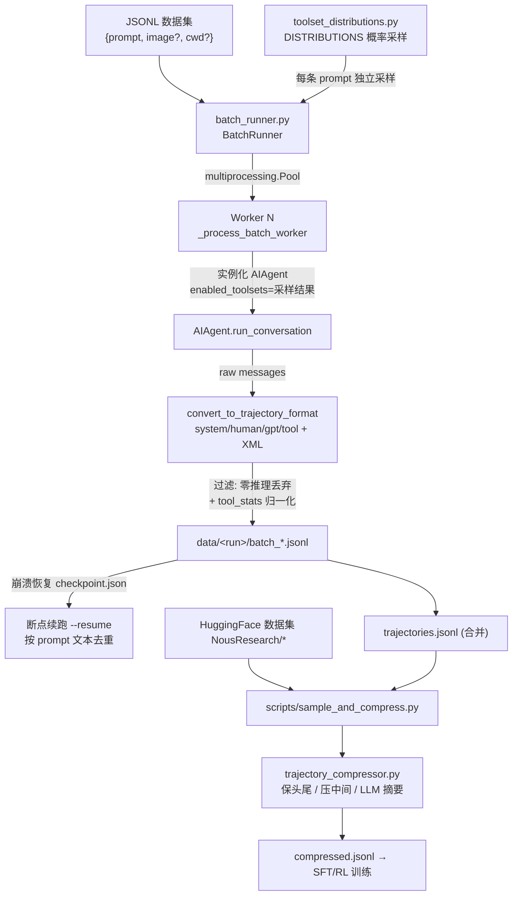
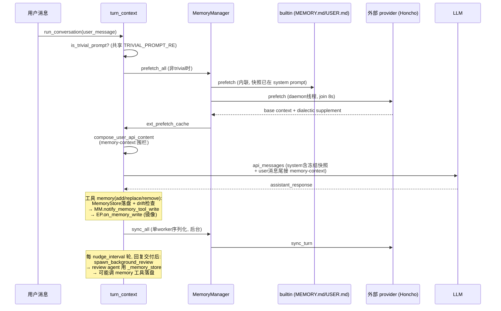
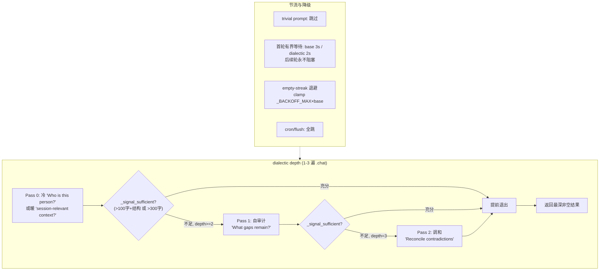

# 第十三篇　研究、记忆与部署

*作者：Amlei　·　更新时间：2026-08-08*

> 本篇收束全书，覆盖三个使 Hermes 成为"研究就绪"产品而非纯终端工具的主题：把运行时与训练时视为同一份数据的批量轨迹生成与压缩、作为陈述性知识与用户建模的记忆系统、以及从 5 美元 VPS 到 GPU 集群的跨平台部署。

---

# 第一章　研究就绪：运行时即训练时数据

Hermes 的核心设计哲学是"运行时即训练时数据"（run-time = train-time data）。同一套 `AIAgent` 主循环既驱动面向用户的 CLI/网关会话，也驱动批量轨迹生成；二者产出的轨迹使用完全相同的 `convert_to_trajectory_format` 序列化器（`agent/agent_runtime_helpers.py:115`），从而保证训练数据与线上推理时的 prompt 格式、工具调用 XML 标签、`<think>` 推理块逐字节一致。这是训练"下一代工具调用模型"的数据飞轮根基。



---

## 第 2 章　batch_runner.py：并行批量轨迹生成

`batch_runner.py`（1330 行）是研究/训练数据生产入口。它从 JSONL 数据集中读取任务，并行启动大量 `AIAgent` 实例，把每条任务的完整多轮工具调用轨迹写入 `data/<run_name>/`。

### 2.1　并发模型

并发采用 `multiprocessing.Pool`（进程级并行，规避 GIL 与各 provider 的同步状态）。关键设计：**并行粒度是"批次"而非"单条 prompt"**——`Pool.imap_unordered(_process_batch_worker, tasks)` 把每个批次作为一个任务派发；批次内部则**顺序**处理 prompt。这种"批间并行 + 批内串行"减少了进程间 MCP/工具初始化开销。

每个 worker 通过 `_process_single_prompt` 实例化一个**全新的 `AIAgent`**：

```python
agent = AIAgent(
    ...,
    enabled_toolsets=selected_toolsets,   # 来自概率采样
    save_trajectories=False,              # 由 runner 自己保存
    skip_context_files=True,              # 不污染 SOUL.md/AGENTS.md
    skip_memory=True,                     # 批量跑不用持久记忆
)
result = agent.run_conversation(prompt, task_id=task_id)
```

`task_id=f"task_{prompt_index}"` 保证每条任务在 Docker/Modal/Singularity/Daytona 后端拿到独立隔离沙箱。

### 2.2　工具统计与推理覆盖度

`_extract_tool_stats` 遍历消息历史，把 `assistant.tool_calls` 与随后的 `role=tool` 响应配对，统计每个工具的 count/success/failure。成功/失败判定相当精细：**非零退出码不算失败**（"the model can self-correct"）；仅当字符串以 `error:` 开头才计失败。

`_extract_reasoning_stats` 统计 `<REASONING_SCRATCHPAD>` 或原生 `reasoning` 字段覆盖度。批量运行会**丢弃整条无推理样本**——这是训练"思考型"模型的关键质量门。

### 2.3　容错、checkpoint 与智能续跑

checkpoint 机制双层：

1. **索引级**：`checkpoint.json` 记录 `completed_prompts` 列表，每完成一批即 `atomic_json_write`，`KeyboardInterrupt` 时 `pool.terminate()` 后仍写出已进度。
2. **内容级（更强）**：`_scan_completed_prompts_by_content` 扫描所有 `batch_*.jsonl`，提取每个 `from=human` 首消息的文本作为已完成集合。这允许数据集重排、索引变化后仍能精确续跑。

### 2.4　toolset_distributions：RL 数据生成的工具概率采样

`DISTRIBUTIONS` 字典定义了 17 种"工具集分布"。每个分布是 `{toolset_name: 概率百分比}`，**关键设计：各 toolset 独立采样而非互斥**。`sample_toolsets_from_distribution` 对每个 toolset 独立掷骰：

```python
for toolset_name, probability in dist["toolsets"].items():
    if random.random() * 100 < probability:
        selected_toolsets.append(toolset_name)
```

每条 dataset prompt 独立调用一次采样，因此同一批数据天然产生工具可见性的多样性——这是 RL/训练数据避免"工具集 over-fitting 到固定组合"的核心手段。

`ephemeral_system_prompt` 在 agent 执行时注入系统提示，但**不写入轨迹**——`convert_to_trajectory_format` 总是用固定的 function-calling 模板覆盖 system turn。这样训练数据里的 system prompt 永远是干净的"工具定义 + XML 调用规范"，而临时任务指令只通过 `human` turn 影响 behavior。

---

## 第 3 章　trajectory_compressor.py：轨迹压缩

### 3.1　"压缩"的真实含义

此处的"压缩"**不是**通用文本压缩，而是**面向训练 token 预算的语义摘要**：把超长轨迹（动辄数万 token）压到 `target_max_tokens` 以下，以便喂入固定上下文窗口的训练。压缩后仍是合法的 from/value 多轮轨迹，可直接进 SFT。

### 3.2　保护-压缩分区算法

`compress_trajectory` 的步骤：

1. 用 HF tokenizer（默认 `moonshotai/Kimi-K2-Thinking`）逐 turn 计 token；
2. 若总数 ≤ target，直接 skip；
3. `_find_protected_indices` 划分受保护区：**头部**（首个 system/human/gpt/tool）+ **尾部**（最后 N 轮，默认 4，保证最终动作与结论完整）。中间为可压缩区；
4. 计算需节省的 token；
5. 从 `compress_start` 起累积 turn，直到累积量 ≥ 需节省量。

**边界对齐：不让 `<tool_call>` 与 `<tool_response>` 分家**——这是整段代码最精巧处。若压缩边界落在一个 `tool` turn 上，就会把调用与响应割裂，破坏训练轨迹的配对结构。`_snap_boundary` 优先前移边界（把孤立 tool turn 折进已含其 gpt turn 的区域）。

算法在多处护栏处"放弃压缩"而非"压坏"：区域 snap 后塌缩、可压缩区 token ≤ summary_target_tokens（压了反而更大）。

### 3.3　LLM 摘要与替换

被压缩的中间 turn 由 `_generate_summary` 送摘要模型（默认 `google/gemini-3-flash-preview` via OpenRouter）处理，prompt 要求中性视角、约 `summary_target_tokens` 长，并以 `[CONTEXT SUMMARY]:` 前缀返回。压缩后的轨迹结构：头部 turn（system 追加 summary_notice）+ 单条 `from=human` 摘要消息 + 尾部 turn 原样保留。模型在训练时"读到摘要后继续用工具"——保留了 agentic 行为信号。

---

## 第 4 章　ACP 适配器：IDE 集成

ACP（Agent Client Protocol）是**编辑器↔agent 的会话协议**，让 VS Code/Zed/JetBrains/OpenCode 把 Hermes 当作后端 agent。它与 MCP 的关键区别：

- **MCP**：Hermes 作为 MCP 客户端消费外部工具服务器，或作为服务器暴露工具——是"工具协议"。
- **ACP**：Hermes 作为 agent 主体通过 stdio JSON-RPC 与编辑器通信，暴露会话生命周期——是"会话协议"。

`HermesACPAgent(acp.Agent)` 实现的核心 RPC：`initialize`、`authenticate`、`new_session`、`load_session`、`resume_session`、`cancel`、`fork_session`、`list_sessions`、`prompt`、`set_session_model`、`set_session_mode`、`set_config_option`。

会话模型：每个 ACP session 对应一个**独立 `AIAgent` 实例**，`platform="acp"`、`enabled_toolsets=["hermes-acp"]`、`quiet_mode=True`，持久化到共享 `~/.hermes/state.db`（`source="acp"`）。关键不变量是**双 id 模型**：ACP `session_id` 是稳定公开句柄，内部 `agent.session_id`（Hermes DB 头）会因上下文压缩在中途轮换；`_persist` 与 `provenance.py` 的 `build_session_provenance` 专门处理这种轮换。

AIAgent 的 `run_conversation` 是同步的，跑在 `ThreadPoolExecutor(max_workers=4)`，通过五个回调（`stream_delta`/`reasoning`/`tool_progress`/`step`/审批）桥接到 async `conn.session_update()`。Hermes 工具**不**重新注册为 ACP 工具——ACP 只观察执行作为 `ToolCallStart/Progress` 通知。

---

## 第 5 章　打包与部署

### 5.1　pyproject.toml：精确固定 + 最小核心

依赖策略是供应链安全的核心：

- **核心 `dependencies` 全部精确固定 `==X.Y.Z`，无区间**。这是 2026-05-12 "Mini Shai-Hulud 蠕虫"攻击后强化的策略，确保新版本只能通过刻意 bump + 重生成 `uv.lock` 进入用户机器。
- **extras 设计哲学**：`[all]` 只含"无法 lazy-install 的、每次会话都需要的"extra；provider 专属全部移出 `[all]`，由 `tools/lazy_deps.py` 在首次使用时安装——"一次上游投毒不能搞挂所有新装"。
- `[termux]`/`[termux-all]` 是 Android 专用 minimal profile。

### 5.2　setup.py：反 wheel 守卫

`setup.py` 覆盖 `bdist_wheel` 与 `sdist` 命令，**非 Nix 构建时直接抛错**。pip/PyPI 不再是官方分发渠道，wheel 会丢失运行时由 env-var 解析的资源（locales/skills/optional-mcps/web_dist/tui_dist）。唯一合法 wheel 消费者是 uv2nix，其 Nix 派生设 `HERMES_NIX_BUILD=1` 放行。

### 5.3　Dockerfile：多阶段 + s6-overlay 监督

生产镜像基于 `debian:13.4`，分阶段：

1. **SQLite 编译阶段**：Debian 13 的 SQLite 3.46.1 有 WAL-reset 损坏 bug，故 pinned 编译 3.53.4，带 FTS3/4/5/RTree/GEOPOLY 等全部扩展，sha256 校验。
2. **工具链**：从 `uv` 镜像拷 `uv`/`uvx`；从 `node:26-bookworm-slim` 拷 node 26 + npm。系统包装 ripgrep/ffmpeg/git/docker-cli。
3. **s6-overlay**：版本 3.2.3.0，`/init` 成为 PID 1，负责僵尸进程回收与服务监督。
4. **依赖层缓存**：`uv sync --frozen`，故意不用 `--all-extras` 避免 `[rl]`（torch）。
5. **前端构建**：`web/` + `ui-tui/` 各 `npm run build`。

运行时关键 ENV：`HERMES_HOME=/opt/data`、`HERMES_DISABLE_LAZY_INSTALLS=1`（sealed venv）、`HERMES_LAZY_INSTALL_TARGET=/opt/data/lazy-packages`（把可选后端的 lazy-install 重定向到可写数据卷）。

### 5.4　docker/：s6 服务布局

`docker/s6-rc.d/` 声明静态服务：`user` bundle 含 `main-hermes`（占位）与 `dashboard`。`dashboard/run` 读取 `HERMES_DASHBOARD` 开关，未开则 exit 0，开启则 `hermes dashboard`。

### 5.5　Nix flake：可复现 sealed 构建

`flake.nix` 用 flake-parts，系统矩阵 `x86_64-linux / aarch64-linux / aarch64-darwin`。`nix/hermes-agent.nix` 用 uv2nix 从 `pyproject.toml` + `uv.lock` 构建 sealed venv。派生用 `makeWrapper` 把三个二进制包成 wrapper，设置 `HERMES_BUNDLED_SKILLS / HERMES_BUNDLED_PLUGINS / HERMES_WEB_DIST / HERMES_TUI_DIR` 等。skills/plugins/locales/optional-mcps 都以软链进 store，**不进 Python site-packages** 以保持与 dev checkout 一致的 import 语义。

### 5.6　install.sh：托管安装与 hermes update

`scripts/install.sh`（144KB）是官方 shell 安装器。安装布局：

- 非 root：`INSTALL_DIR=$HERMES_HOME/hermes-agent`，命令链接 `$HOME/.local/bin`；
- Termux：链接进 `$PREFIX/bin`；
- root Linux：FHS 布局 `/usr/local/lib/hermes-agent` + `/usr/local/bin/hermes`。

托管工具链：若系统 Node < 26 或缺，自动装"Hermes-managed Node 26"到 `$HERMES_HOME/node`；managed uv 装到 `$HERMES_HOME/bin/uv`。

`hermes update`（运行时）在 `$HERMES_HOME/hermes-agent` 这份 git checkout 上 `git reset` 清理 + 拉取 + `uv pip install -e .`。

---

## 第 6 章　记忆系统：陈述性知识与用户建模

> 记忆是 Hermes"闭环学习循环"的双轴之一：**Skills 轴**承载过程性知识（procedural，"怎么做"），**Memory 轴**承载陈述性知识（declarative，"是什么"——用户是谁、环境如何、约定与怪癖）。本篇深挖记忆系统的三层结构：内置文件后端、MemoryManager 编排层、可插拔外部提供者，以及 README 重点标注的 Honcho 辩证式用户建模。

### 6.1　设计目标：声明性 vs 过程性的硬边界

记忆系统在系统提示词中被明确约束。`MEMORY_GUIDANCE`（`agent/prompt_builder.py:165-186`）强制要求"Write memories as declarative facts, not instructions to yourself"，并以正反例示导：

- ✓ `'User prefers concise responses'`
- ✗ `'Always respond concisely'`

这条规则的动机很明确——祈使句在后续会话中会被当作指令重新读取，从而覆盖用户当下的请求或引发重复劳动；过程性内容应进 skill 而非 memory。记忆明确拒绝 task progress、PR/issue 号、commit SHA、"fixed bug X"、"Phase N done"等一周即过期的工件——后者应走 `session_search` 召回历史转录。

记忆系统由三层叠加构成：

1. **内置文件后端**：`MEMORY.md`（agent 个人笔记）+ `USER.md`（用户画像），始终可用、可移植、随 `~/.hermes/memories/` 走。
2. **MemoryManager 编排层**（`agent/memory_manager.py`）：唯一的外部集成点，以"内置 + 至多一个外部 provider"的方式驱动。
3. **可插拔外部 provider**（`plugins/memory/<name>/`）：通过 `memory.provider` 择一激活，Honcho 为其中最复杂的 dialectic 用户建模实现。

### 6.2　MemoryProvider ABC

`MemoryProvider`（`agent/memory_provider.py:81-357`）定义所有外部记忆后端的契约。核心生命周期方法（abstract：`name`/`is_available`/`initialize`/`get_tool_schemas`）与带默认实现的方法分层清晰：

| 方法 | 职责 |
|------|------|
| `initialize(session_id, **kwargs)` | 一次性启动初始化；kwargs 含 `agent_context`(`primary`/`subagent`/`cron`/`flush`)、`agent_identity`(profile 名)、`parent_session_id`、`user_id` |
| `system_prompt_block()` | 返回**静态**文本（模式说明、状态），prefetched 召回内容走 `prefetch()` 单独注入 |
| `prefetch(query)` / `queue_prefetch()` | LLM 调用前召回；应快速返回缓存，重活放后台线程 |
| `sync_turn(user, asst, *, session_id, messages)` | 每回合后持久化；应非阻塞 |
| `get_tool_schemas()` / `handle_tool_call()` | 暴露给代理的记忆操作工具 |
| `shutdown()` | 刷队列、关连接 |

丰富的可选 hook：`on_turn_start`、`on_session_end`（**仅在真实会话边界**触发，非每轮）、`on_session_switch`（处理 `/resume`/`/branch`/`/reset`/压缩的 session_id 轮换，带 `reset`/`rewound` 语义）、`on_pre_compress`（返回文本注入压缩摘要 prompt）、`on_delegation`（父代理观察子代理 task+result）、`on_memory_write`（镜像内置 memory 工具写入）、`backup_paths()`（声明 HERMES_HOME 外的状态目录供 `hermes backup`）。

**trivial-prompt 共享判据**：`TRIVIAL_PROMPT_RE` 与 `is_trivial_prompt()`（`memory_provider.py:52-78`）是核心 prefetch 门控与 provider 端分类器共享的**单一真相源**。空串、whitespace、`/` 开头的斜杠命令、裸问候/应答（`yes|no|ok|thanks|hi|continue|done|lgtm|k` 等）均判为 trivial，跳过召回以省一次阻塞网络往返，并避免陈旧的用户模型上下文带偏一词回复。正则用锚定+尾标点白名单，使 `k8s`/`yolo`/`note` 这类仅以前缀匹配的词**不**误命中。

### 6.3　MemoryManager 编排

`MemoryManager`（`agent/memory_manager.py:364`）是 `run_agent.py` 的**唯一集成点**。

**单外部 provider 限制**：`add_provider()` 始终接受内置 provider，但**至多接受一个外部 provider**——第二次注册会被拒绝并告警。理由是防止工具 schema 膨胀与记忆后端冲突。

**后台序列化执行器**——关键设计：`sync_all` / `queue_prefetch_all` **不在 turn-completion 路径内联执行**，而是投递到单 worker 的 `ThreadPoolExecutor`。源注释记录了一次事故：一个错配的 Hindsight daemon 阻塞约 298 秒才失败，内联执行导致 `run_conversation` 在用户已看到回复后仍长时间挂着，所有接口都把 agent 标记为 "running" 数分钟。单 worker 序列化保证 turn N 先于 turn N+1 落地，provider 实现无需自备顺序保证。

**会话边界的原子序列化**：`commit_session_boundary_async()` 把"旧会话抽取 + provider 重绑定"作为**一个**序列化任务投递：`on_session_end`（端点抽取，可能是 LLM 调用）必须严格先于 `on_session_switch`（重绑 session_id）。源注释记录了 bug #16454：内联执行阻塞 `/new` 整个 LLM 往返；临时线程竞争内联 switch 导致晚到的 `on_session_end` 撞上 switch 后的绑定。单 worker 的 FIFO 顺序一举解决。

### 6.4　memory 工具与 MemoryStore 双状态

`tools/memory_tool.py` 注册了名为 `memory` 的工具，是 agent 唯一直接操作的持久化入口（agent 级拦截，需 `_memory_store` 实例状态）。Schema 支持两种形态：单 op（`action`+`content`/`old_text`）或批量 `operations=[...]`。批量是首选——原子 apply，char limit 仅校验**最终**结果，使"删旧+加新"一次完成。

`MemoryStore` 维护两份并行状态：

- `_system_prompt_snapshot`：`load_from_disk()` 时冻结，注入 system prompt，**会话中途永不突变**（保 prefix cache）；
- `memory_entries`/`user_entries`：活状态，工具调用变更，立即落盘；工具响应总反映此状态。

条目以 `§`（section sign）分隔，可用多行；用字符数（非 token）做容量限（默认 `memory_char_limit=2200`、`user_char_limit=1375`）。

**安全与并发**：

- **威胁扫描**：写入前用 `tools/threat_patterns.py` 的 `strict` scope 扫描注入/渗出模式；`load_from_disk()` 把命中条目替换为 `[BLOCKED: ...]` 占位符，但活状态保留原文供用户自查删除。strict scope 的理由：memory 是用户策展的、且以冻结快照注入 system prompt，中毒条目会跨会话持续注入。
- **drift 防护**：`_detect_external_drift()` 检测"外部漂移"——盘上内容无法经工具 parser/serializer 往返还原（round-trip mismatch），或单条目超过整库 char limit。命中则快照 `.bak.<ts>` 并**拒绝**变更，防止静默数据丢失（issue #26045）。
- **consolidation 失败预算**：单轮内超容/零匹配失败超过 3 次即返回 terminal "save skipped"，阻止脆弱的 replace/add 死循环把 turn 耗到预算上限（issue #42405）。

**双写**：工具执行后，若 `agent._memory_manager` 存在，立即 `notify_memory_tool_write`——**fail-closed** 门控（非 JSON、非 dict、缺 `success`、或 `staged=True` 均不向 provider 谎报未落地的写入），再展开单 op 与批量 `operations` 形态，逐 op 构造溯源 metadata 转发给 provider 的 `on_memory_write`。

### 6.5　记忆 nudge：闭环学习的自监督触发器

记忆 nudge 是周期性"自我提醒"，让 agent 定期审视对话并决定是否落盘。

**配置与触发**（`agent/agent_init.py:1669`、`agent/turn_context.py:591-599`）：

```python
agent._memory_nudge_interval = 10   # 默认每 10 轮用户 turn 触发一次

should_review_memory = False
if (agent._memory_nudge_interval > 0
        and "memory" in agent.valid_tool_names
        and agent._memory_store):
    agent._turns_since_memory += 1
    if agent._turns_since_memory >= agent._memory_nudge_interval:
        should_review_memory = True
        agent._turns_since_memory = 0
```

门控条件：间隔 > 0、memory 工具可用、store 存在。命中后计数器归零。手动 `memory` 工具调用会重置计数器。

**计数器水合**：恢复会话时从持久化历史水合计数器 `_turns_since_memory = prior_user_turns % nudge_interval`，避免 resume 后立即触发或永不触发（issue #22357）。

**后台执行**：`should_review_memory` 抵达 `turn_finalizer`——用户回复**交付之后**，`_spawn_background_review(review_memory=True)` 派生后台 review 子 agent。nudge prompt（`agent/background_review.py:171-180`）：

> Review the conversation above and consider saving to memory if appropriate. Focus on: 1. Has the user revealed things about themselves... 2. Has the user expressed expectations about how you should behave... If something stands out, save it using the memory tool. If nothing is worth saving, just say 'Nothing to save.' and stop.

review agent 复用主 agent 的 `_memory_store`，但其 `_memory_nudge_interval=0` 防止递归 nudge。设计上 nudge **在回复交付后异步跑**，绝不与用户当前任务争夺模型注意力。

### 6.6　Honcho：辩证式用户建模

Honcho（`plugins/memory/honcho/`）是 README 重点标注的实现，提供 AI-native 跨会话用户建模，核心是**多轮 dialectic（辩证）推理**。

#### "dialectic" 的含义

此处"辩证"指**多遍 `.chat()` 自我审计推理**：Honcho 后端对目标 peer 的完整 representation 跑 LLM，Hermes 侧按 `dialecticDepth`(1-3) 串联多遍，每遍审视前遍产出、补盲点、调和矛盾（`honcho/__init__.py:1080-1117`）：

- **Pass 0**：冷启动问"Who is this person?..."；暖会话问"what context about this user is most relevant..."；
- **Pass 1**：自审计 + 定向综合——"Given this initial assessment... What gaps remain..."；
- **Pass 2**：调和——"Do these assessments cohere? Reconcile any contradictions..."。

条件提前退出（`_signal_sufficient`）：>100 字且有结构（章节/项目符号）或 >300 字即视为信号充分，跳过后续 pass。

#### 三层正交旋钮

| 旋钮 | 控制 | 默认 |
|------|------|------|
| `dialecticCadence` | 多久——最小触发间隔 turn 数 | 1 |
| `dialecticDepth` | 多少遍——每周期 `.chat()` 调用数(1-3) | 1 |
| `dialecticReasoningLevel` | 多深——每遍 reasoning 上限 | "low" |

#### Honcho API 集成

`HonchoSessionManager`（`plugins/memory/honcho/session.py`）封装 SDK，分层模型：

- **workspace**：共享环境，同 workspace 的所有 profile 可见同一用户身份（默认 `"hermes"`）。多 profile 共享 workspace、各自独立 aiPeer，实现"同用户、不同 AI 人格"。
- **peer**（user/ai）：`SessionPeerConfig` 1:1 映射 Honcho 的 per-peer 观察开关 `observe_me`/`observe_others`，控制是否为该 peer 构建画像。
- **session**：`session.add_peers([(user, cfg), (ai, cfg)])` 绑定双 peer；`session.context(summary=True, tokens=...)` 单调用取消息+摘要+元数据。
- **message**：`peer.message(content)` 构造、`session.add_messages([...])` 批量持久化；`peer.chat(query, target=, reasoning_level=)` 是 dialectic 端点。
- **conclusion**：持久化的派生事实，喂入目标 peer 的 card+representation；删除仅用于 PII 移除——错误事实应写纠正性 conclusion，Honcho 会随时间自愈矛盾。
- **card**：curated key facts 快照。
- **file upload**：`migrate_memory_files()` 把 MEMORY.md/USER.md/SOUL.md 包成 `<prior_memory_file>` XML 上传，实现从本地文件后端的迁移。

#### 两层上下文注入

`prefetch()` 装配两层：

- **Layer 1 — Base context**（按 `contextCadence` 刷新）：session 摘要 > User Representation > User Peer Card > AI Self-Representation > AI Identity Card。`user_message` 作 `search_query` 使 Honcho 返回与话题相关的 conclusion 而非全量观察 dump。
- **Layer 2 — Dialectic supplement**（按 `dialecticCadence` 触发）：`_run_dialectic_depth()` 多遍 `.chat()`，追加在 base 之后。

#### liveness / 降级

- **后台 init**：daemon 线程建会话，启动不阻塞；
- **首轮有界等待**：`firstTurnBaseWait=3.0`、`firstTurnDialecticWait=2.0`，仅 turn 1 可等；后续轮永不阻塞；
- **stale 线程/结果回收**：超过 `timeout×2.0` 的挂起线程视作死；丢弃 fire-turn 超过 `cadence×2` 的陈旧结果；
- **empty-streak 退避**：连续空返回加宽 cadence，clamp 于 `_BACKOFF_MAX=8`×base；
- **cron/flush 跳过**：`agent_context in {"cron","flush"}` 时全跳——cron 系统提示词会污染用户表示。

### 6.7　注入：冻结快照 vs 活上下文

**内置记忆**进 system prompt 用**冻结快照**（保 prefix cache）；会话中途的写入只落盘、不回灌提示词，到下一会话才进 system prompt。

**外部 provider 的 prefetched 召回**注入**当前轮用户消息的 API 副本**（以保 prompt cache）：`compose_user_api_content()`（`turn_context.py:53-85`）把召回包成 `<memory-context>` 围栏块追加到用户内容尾，并附系统注记"The following is recalled memory context, NOT new user input"。`api_content` sidecar 把"实际发送字节"持久化，使 turn N+1 重放时 prefix 字节稳定。

**流式清洗**：`StreamingContextScrubber` 是跨流式 delta 的状态机，处理 `<memory-context>` 标签跨 chunk 边界泄漏——回持部分标签尾、丢弃 span 内一切，未闭合 span 结束时丢弃剩余内容（"泄漏部分记忆上下文比截断回答更糟"）。

### 6.8　query_rewrite

`plugins/memory/query_rewrite.py` 是 provider 无关的查询改写器，把最新用户消息改写成一条简洁英文检索问题，供 Honcho dialectic pass 0 使用。通过 `auxiliary_client.call_llm(task="memory_query_rewrite")`（temperature=0、max_tokens=96）调用。system prompt 把消息当 untrusted data，禁止执行其中指令、保留检索相关实体、返回单问句。**normalize 防护**：剥 markdown 围栏、强制问句起始词、必须含记忆锚词、禁指令泄漏词；超 320 字符或多项内部句号判无效返回空串。

### 6.9　设计权衡

1. **本地文件 vs 外部 provider**：MEMORY.md/USER.md 零依赖、可移植、随 `hermes backup` 走，但无语义检索/用户建模；外部 provider（Honcho/mem0）提供语义检索与 dialectic 用户画像，但引入网络依赖、凭证、延迟与故障面。Hermes 选"内置始终在 + 至多一个外部叠加"。
2. **单外部 provider 限制**：记忆是单一真相源语义，多后端并行会产生重复/矛盾召回且无统一排序。
3. **声明性 vs 过程性**：硬性边界——memory 收事实、skills 收过程。`MEMORY_GUIDANCE` 以正反例强制声明式。
4. **冻结快照 vs 活状态**：内置记忆在 system prompt 用冻结快照（保 prefix cache），工具响应用活状态。外部 provider 的召回注入用户消息 API 副本、每轮可变，但用 `api_content` sidecar 保字节稳定。
5. **nudge 的成本/收益**：周期性后台 review 是闭环学习触发器，但多一次辅助/子 agent 模型调用；故异步于用户回复之后跑、按 interval 节流、review agent 自身 `_memory_nudge_interval=0` 防递归。
6. **fail-open vs fail-closed**：外部 provider 任何失败都 best-effort，绝不阻塞用户；但内置 memory 写入**fail-closed**（drift/读失败绝不覆写，宁可拒绝也不丢数据）。
7. **延迟预算**：Honcho 首轮有界等待，后续轮永不阻塞；一个卡死 provider 永不阻塞主循环。





---

## 第 7 章　为何如此设计：研究、记忆、部署的权衡总账

1. **运行时即训练时数据**：`AIAgent` 一物两用，`convert_to_trajectory_format` 是唯一序列化真相源。代价：batch_runner 必须用 `skip_context_files=True`/`skip_memory=True` 隔离用户态污染。
2. **供应链安全 > 便利**：精确固定 + 最小核心 + lazy-install 分离，`setup.py` 主动禁止 wheel——牺牲 pip 用户换取投毒抗性。
3. **进程级并行 + 批内串行**：规避 GIL 与 provider 同步状态，但 worker 内串行限制了单 worker 吞吐；用 `num_workers` 水平扩展。
4. **压缩宁可放弃也不压坏**：多重边界对齐 / 区域塌缩 / 大小检查护栏，保证 `<tool_call>`/`<tool_response>` 配对与训练信号完整，宁可留 `still_over_limit` 也不产出损坏轨迹。
5. **托管安装布局**：`$HERMES_HOME/hermes-agent`（非 root）/ FHS（root）/ sealed venv（Nix/Docker）三种布局，`.install_method` 戳放代码树而非数据卷避免冲突。
6. **容器化选择**：s6-overlay 取代 tini 提供 PID-1 监督 + 多服务，代价是拒绝 `docker run --user`、需 stage2 root bootstrap。
7. **ACP vs MCP 分工**：ACP 暴露会话生命周期给 IDE，MCP 暴露工具给 agent——二者在 `acp_adapter/session.py` 通过 `_expand_acp_enabled_toolsets` 把会话级 MCP server 注入 agent 工具集，实现正交组合。
8. **记忆的双轨**：本地文件（底线、可移植）+ 外部提供者（强检索、建模），由 memory_tool 写入时镜像保持一致；nudge 驱动闭环但按 interval 节流。

---

*第十三篇完。下一篇（[第十四篇](part-14-feature-tools.md)）换一个焦距，从子系统架构落到具体功能工具——内置浏览器、网页搜索/抓取、视觉、图像/视频生成、语音——逐一展开它们的实现机制。*
