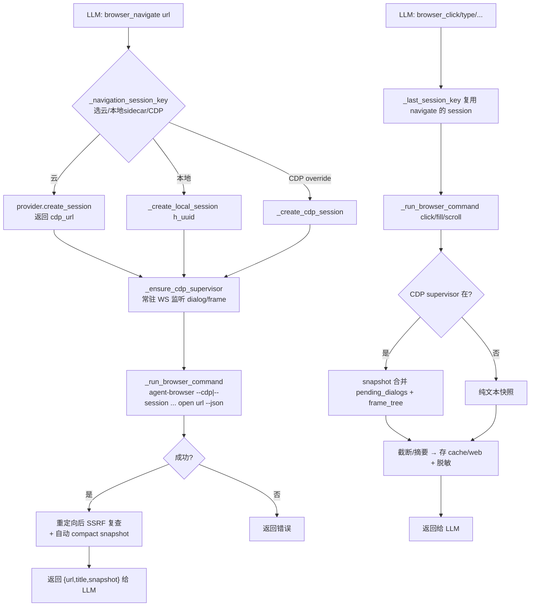
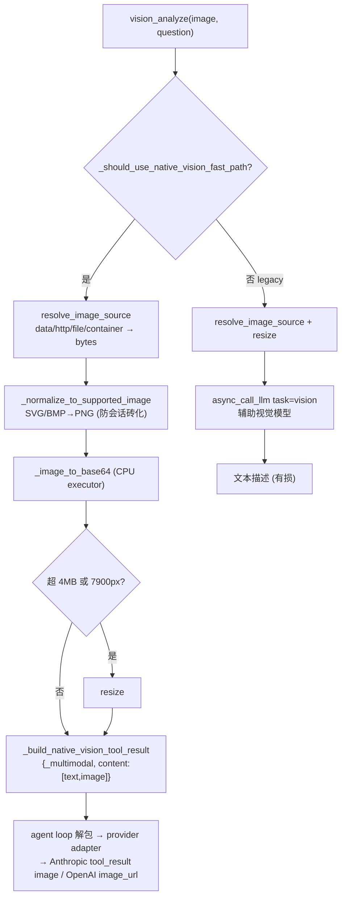
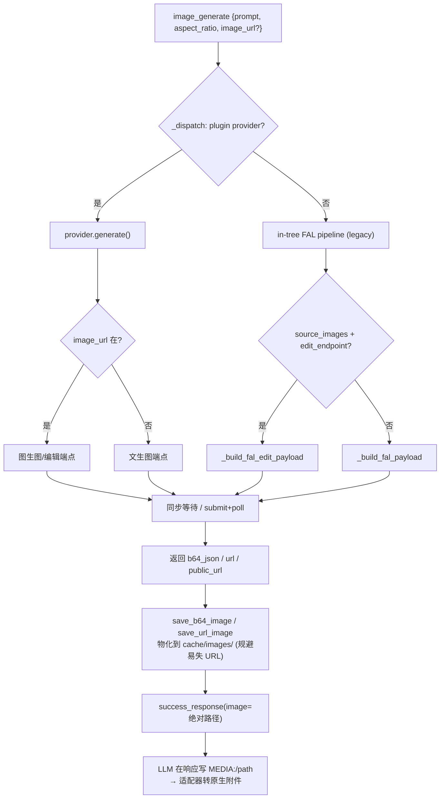

# 第十四篇　关键功能工具的实现

*作者：Amlei　·　更新时间：2026-08-08*

> 前十三篇是**子系统架构级**的剖析——每一篇把一个子系统（循环、工具注册表、状态库、技能、终端、MCP、网关……）作为整体来讲。本篇换一个焦距，**逐功能工具**地看：内置浏览器、预览面板、网页搜索与抓取、视觉、图像/视频生成、语音。这些是代理"看得见网页、看得见图、会画图、会说话"的能力来源。
>
> 本篇的统一线索是一条横贯所有功能工具的**共同骨架**：插件式 provider ABC + 中央注册表、产物物化到 `~/.hermes/cache/` + `MEDIA:` 投递标签、`check_fn` 可见性门、按后端能力重建的动态 schema。这条骨架在[第三篇](part-03-tools.md)（工具系统）与[第十篇](part-10-plugins.md)（插件）已奠定，本篇是它在具体能力上的展开。

---

## 第 1 章　内置浏览器与预览：两套正交的"浏览器"

读者最初问的"内置浏览器（preview）"，在源码里其实是**两个互不相干的子系统**，必须先区分：

- **(A) `browser_*` 自动化簇**（`tools/browser_tool.py` 等）——代理**自己驱动**一个真实浏览器（导航、取无障碍树、点击、输入、截图、eval）。输出只回给模型，**用户看不到页面**。
- **(B) Preview / GUI 亲和簇**（`tools/open_preview_tool.py`、`read_preview_tool.py`、`read_terminal_tool.py`、`close_terminal_tool.py`、`focus_pane_tool.py`）——代理**给用户开**一个嵌入式活动面板（桌面渲染器里的 `<webview>` 或 xterm.js），让用户**肉眼看到**一个网页或一个活动终端。这是面向用户的 GUI 表面，仅当 `HERMES_DESKTOP=1` 时存在。

两者唯一的共同点是名字里都有"browser"；代码路径、生命周期、可见性完全不同。(A) 注册在 `toolset="browser"`，(B) 全部注册在 `toolset="terminal"` 并经 `check_fn` 二次门控。

### 1.1　browser_* 自动化：无障碍树 + ref 动作模型

`browser_tool.py` 的定位（模块头）：用 **`agent-browser` CLI**（进程外 Node/Rust 二进制）驱动多后端浏览器——本地 headless Chromium、用户本机 CDP 调试浏览器、或云端 Browser Use / Browserbase / Firecrawl——而对代理暴露**一致的行为**。它用 `agent-browser` 的**无障碍树快照（ariaSnapshot）**作为页面的文本表示，对无视觉能力的 LLM 友好。

核心观察原语是 `browser_snapshot`：调用 `agent-browser snapshot`，返回 JSON `{snapshot, refs}`，元素以 `@e1/@e2` ref 标识。Compact 模式（默认）只列可交互元素；超过 `SNAPSHOT_SUMMARIZE_THRESHOLD = 15000` 字符时，有 `user_task` 则走 LLM 摘要、否则结构化截断，且**完整快照写盘**到 `cache/web/browser-snapshot-<hash>.txt` 并附 `read_file offset=… limit=200` 指针，让代理能翻页。所有输出强制脱敏（即便全局脱敏关闭），因为页面可能渲染出 API key/cookie。

```python
# tools/browser_tool.py:3198
    result = _run_browser_command(effective_task_id, "snapshot", args)

    if result.get("success"):
        data = result.get("data", {})
        snapshot_text = data.get("snapshot", "")
        refs = data.get("refs", {})
        # …（eval 后私网 URL 复查，防 JS 导航到内网）…
        # Check if snapshot needs summarization
        if len(snapshot_text) > SNAPSHOT_SUMMARIZE_THRESHOLD and user_task:
            snapshot_text = _extract_relevant_content(snapshot_text, user_task)
        elif len(snapshot_text) > SNAPSHOT_SUMMARIZE_THRESHOLD:
            snapshot_text = _truncate_snapshot(snapshot_text)

        response = {
            "success": True,
            "snapshot": _redact_browser_output(snapshot_text),  # 强制脱敏
            "element_count": len(refs) if refs else 0,
        }
```

动作工具全部以 ref 为坐标（`browser_click`、`browser_type`、`browser_scroll`、`browser_press`、`browser_back`），ref 是快照里分配的 `@eN` 标识——这与 Anthropic computer-use 的思路一致：用稳定字符串引用替代视觉坐标，避免坐标漂移。`browser_navigate` 自带一个自动 compact 快照，让模型无须 navigate 后再单独 snapshot。

**安全四闸**（在驱动浏览器之前）：URL 秘密外泄检查（URL 及解码形式是否含 API key/token）、凭据型 query 参数检查、IMDS 无条件下限（`169.254.169.254` 对所有后端生效，因为云 VM 上本地 Chromium 也能打到 host IMDS）、SSRF/私网检查（导航后还要做一次重定向复查）。



四闸的差异全在豁免条件——IMDS 闸没有任何后端豁免，其余两闸对本地后端 / 本地 sidecar 豁免（代理本就有本地网络）：

```python
# tools/browser_tool.py:2990  （闸二/三/四；闸一是上面的 _PREFIX_RE URL 秘密检查）
    sensitive_query_key = _sensitive_query_param_name(url)
    # 闸二：凭据型 query 参数——本地后端 / 本地 sidecar 豁免
    if sensitive_query_key and not _is_local_backend() and not auto_local_this_nav:
        return json.dumps({"success": False, "error": "Blocked: credential-like query param …"})
    # 闸三：IMDS 无条件下限——【没有】not _is_local_backend() 豁免。纯本地 headless
    # Chromium / off-host CDP 也挡，因为云 VM 上的本地 Chromium 仍能打到 host IMDS（#16234）。
    if _is_always_blocked_url(url):
        return json.dumps({"success": False, "error": "Blocked: URL targets a cloud metadata endpoint"})
    # 闸四：SSRF / 私网——同样本地豁免（终端工具已覆盖本地网），可 config 放行
    if (not _is_local_backend() and not auto_local_this_nav
            and not _allow_private_urls() and not _is_safe_url(url)):
        return json.dumps({"success": False, "error": "Blocked: URL targets a private or internal address"})
```

### 1.2　CDP 逃生舱与对话框

`browser_cdp`（`tools/browser_cdp_tool.py`）是**原始 Chrome DevTools Protocol 透传**——把任意 CDP method（`Target.getTargets`、`Page.handleJavaScriptDialog`、`Network.getAllCookies`、`Runtime.evaluate`）发给浏览器的 DevTools WebSocket，作为主工具面没覆盖的能力（原生对话框、iframe 内 eval、cookie/网络控制、底层 tab 管理）的**逃生舱**。它无状态、每次调用独立；有状态需求（持续监听 dialog、frame-tree 跟踪）由编排层的 `CDPSupervisor`（每 `(task_id, cdp_url)` 一个常驻守护线程）承担，并由 `browser_navigate` 隐式启动。

`browser_dialog`（`tools/browser_dialog_tool.py`）是纯响应型工具：代理先 `browser_snapshot` 看到快照里多出的 `pending_dialogs`（由 supervisor merge 进来），再 `browser_dialog(action="accept"|"dismiss")`。supervisor 常驻监听 `Page.javascriptDialogOpening`——微妙的是某些对话框经 Fetch 域 XHR 桥接捕获（原生对话框没真触发），响应必须走 `Fetch.fulfillRequest` 而非 `Page.handleJavaScriptDialog`。

### 1.3　Preview：面向用户的内置浏览器/终端面板

这才是"内置浏览器 preview"的本体。五个工具全部仅当 `HERMES_DESKTOP=1` 时可见：

| 工具 | 渲染器事件 | 作用 |
|------|-----------|------|
| `open_preview` | `preview.open` | 把 URL/localhost/文件交给渲染器开成预览 tab |
| `read_preview` | `preview.read.request`→`.respond` | 回读活动预览 tab 的可读文本（阻塞-提示桥）|
| `read_terminal` | `terminal.read.request`→`.respond` | 回读嵌入式 xterm.js 终端缓冲 |
| `close_terminal` | `terminal.close` | 关闭某后台进程的只读 tab（**不杀进程**）|
| `focus_pane` | `pane.reveal` | 把 chat/files/terminal/review/sessions 面板拉到前台 |

GUI 与工具之间隔着 `tools/desktop_ui.py`——一个 40 行的桥，持一个 `_emit` sink，由桌面 tui_gateway 在会话启动时安装。`emit(event, payload)` 按 `HERMES_UI_SESSION_ID` 把事件路由给**拥有当前轮次的那个窗口**——这是"后台轮次绝不抢用户焦点"的基石。

`open_preview` 的全部实现就是一行 `desktop_ui.emit("preview.open", {url, label})`：把 URL 归一后交给渲染器开成并排 tab（URL 走沙箱 `<webview>`）。**页面只对用户可见，代理看不到像素**——代理若想读页面内容，必须再调 `read_preview`，由渲染器把活动 tab 的可读文本序列化后回送。这是一个"代理给用户开窗口、再从窗口回读文本"的异步往返。`read_terminal` 读的是嵌入式终端面板（`terminal(background=true)` 起的后台进程在桌面里镜像成只读 tab），**不是**终端后端——二者完全不同。

```python
# tools/open_preview_tool.py:46
    label = (label or "").strip()
    try:
        ok = desktop_ui.emit("preview.open", {"url": target, "label": label})
    except Exception as exc:
        return tool_error(f"Failed to open the preview pane: {exc}")
    if not ok:
        return tool_error("The preview pane is only available in the Hermes desktop app.")

    return json.dumps({"success": True, "url": target, "label": label}, ensure_ascii=False)
```

`read_preview` 的回读是一座**阻塞-提示桥**：工具线程是同步的，但页面文本在另一个进程的渲染器里。桌面在会话启动时把一个 `callback` 注入工具，callback 的实现是 `_block`——发一个带 `request_id` 的 `preview.read.request` 事件给拥有该轮次的窗口，然后用 `threading.Event.wait()` 把工具线程挂起，直到渲染器回 `preview.read.respond` 命中同一个 `request_id` 才放行。这是同步 agent loop 与异步 GUI 之间唯一的耦合点：

```python
# tui_gateway/server.py:5713  （工具拿到的 callback——经 _block 桥到渲染器）
"read_preview_callback": lambda start=None, count=None: _block(
    "preview.read.request", sid,
    {k: v for k, v in (("start", start), ("count", count)) if v is not None},
    timeout=45,   # URL tab 要从活页面抽文本，比终端读长
),
# tui_gateway/server.py:3137
def _block(event, sid, payload, timeout=300):
    rid = uuid.uuid4().hex[:8]
    ev = threading.Event()
    with _prompt_lock:
        _pending[rid] = (sid, ev)          # request_id ↔ Event 登记，respond 处凭 rid 找回
    _emit(event, sid, payload)             # 发 preview.read.request 给渲染器
    answered = ev.wait(timeout)            # 阻塞当前工具线程，直到 .respond（或超时/中断）
    # …finally 清理 _pending，超时则发 preview.read.expire…
    return answer
```

这套设计刻意分离了两个面：`open_preview` 是**只读、面向人**的窗口（用户看真实页面，代理只能回读渲染后文本，不可点不可填）；`browser_*` 是代理**私有、可写**的自动化面。两者用不同的 toolset、不同的可见性闸、不同的进程，避免任何耦合。

### 1.4　云浏览器 providers

`agent/browser_provider.py` 定义 `BrowserProvider` ABC（`create_session`/`close_session`/`emergency_cleanup`/`is_available`），会话元数据契约 `{session_name, bb_session_id, cdp_url, expires_at, features}` 逐字保留以让调度层无须区分后端。三个内置 provider（`plugins/browser/`）：**Browser Use**（Nous 订阅默认，双鉴权——直接 key 或 managed Nous 网关）、**Browserbase**（带 proxies/stealth、402 自动降级）、**Firecrawl**。

注册表选择的一个精巧权衡：legacy 偏好游走 `_LEGACY_PREFERENCE = ("browser-use", "browserbase")` **故意不含 firecrawl**——因为 firecrawl 与 web 抽取插件共享 API key，用户为 web 抽取设的 key 不应在全新安装时被静默路由到付费云浏览器。这是把"凭据复用"与"计费副作用"显式解耦。

---

## 第 2 章　网页搜索、抓取与视觉

### 2.1　web_search / web_extract：确定性，而非 LLM 摘要

`web_search` 与 `web_extract`（`tools/web_tools.py`）给代理两条轻量 web 通道：前者查询返回排序结果（title/url/description/position），后者抓取指定 URL 返回清洗后的 markdown/text。

> **一处重要校正**：模块顶部 docstring 声称 web_extract "Uses OpenRouter API with Gemini 3 Flash Preview for intelligent content extraction"，这是**陈旧文档**。当前实现明确 "NO LLM summarization"，走的是纯确定性的 **truncate-and-store**（75% 头 / 25% 尾截断 + 落盘全文）管线。这是有意的回退：用确定性截断换取可预测、零额外 token 成本。

后端走插件式 `WebSearchProvider` ABC + `web_search_registry`（七个内置 provider：tavily/exa/parallel/firecrawl/searxng/brave-free/ddgs），`web.search_backend`/`web.extract_backend` 可分能力配置（搜索用 SearXNG、抓取用 Firecrawl）。注册表解析："显式配置胜出且忽略 `is_available()`"（让用户拿到精确的 "X_API_KEY 未设置" 错误，而非静默切后端）；未配置时走 legacy 偏好游走。

三层落下的源码——per-capability 层【查】可用性、共享 `web.backend` 层【不查】，正是上面"忽略 is_available()"的精确边界：

```python
# tools/web_tools.py:298  （三层入口：per-capability → 共享 → legacy）
def _get_capability_backend(capability: str) -> str:
    cfg = _load_web_config()
    specific = (cfg.get(f"{capability}_backend") or "").lower().strip()  # ① web.search_backend
    if specific and _is_backend_available(specific):   # per-capability【查】可用性；不可用 → 落下层
        return specific
    return _get_backend()                               # → ② / ③

# tools/web_tools.py:230  （② 显式共享配置 web.backend——此处【不查】is_available）
configured = (_load_web_config().get("backend") or "").lower().strip()
if configured in _LEGACY_WEB_BACKENDS or _registered_web_provider(configured) is not None:
    return configured                                   # 已知名即返回，key 缺失由调用时报精确错
# ③ legacy 偏好游走：按 env key 优先级 tavily>exa>parallel>firecrawl>searxng>brave>ddgs 取首个可用
```

web_extract 的**双层凭据外泄防御** + SSRF：(1) `_PREFIX_RE` 正则扫描原始 URL、URL-decoded、规范化形式（覆盖 `%73k-` 这类百分号编码 key）；(2) `sensitive_query_param_name` 扫描凭据型 query 参数名（`access_token`/`api_key`/`jwt`/`signature`…，但故意窄——`code`/`key`/`auth`/`session` 这些既是 facet 又可能是凭据的词被排除以避免误伤）；(3) 逐 URL `async_is_safe_url`（DNS→私有/元数据 IP，fail-closed）。

```python
# tools/web_tools.py:795
        normalized_url = normalize_url_for_request(_url)
        # (1) _PREFIX_RE 扫原始/URL-decoded/规范化形式（覆盖 %73k- 这类百分号编码 key）
        if (
            _PREFIX_RE.search(_url)
            or _PREFIX_RE.search(unquote(_url))
            or _PREFIX_RE.search(normalized_url)
            or _PREFIX_RE.search(unquote(normalized_url))
        ):
            return json.dumps({"success": False,
                "error": "Blocked: URL contains what appears to be an API key or token. "
                         "Secrets must not be sent in URLs."})
        # (2) 凭据型 query 参数名扫描（故意窄：access_token/api_key/jwt/signature…）
        sensitive_query_key = sensitive_query_param_name(normalized_url)
        if sensitive_query_key:
            return json.dumps({"success": False,
                "error": "Blocked: URL contains a credential-like query parameter "
                         f"({sensitive_query_key}). Web extract backends are third-party readers; "
                         "remove the sensitive query parameter or use a local browser session "
                         "when this access is explicitly required."})
```

抓取后：剥离内联 base64 图像（token 炸弹）→ `_truncate_with_footer`（行边界对齐）→ 全文写 `cache/web/{slug}-{hash}.md`（2MB 封顶）→ footer 给出 `read_file offset=… limit=200` 分页指令。这个落盘文件经 `credential_files` 只读挂载到远程后端，代理在任何后端都能翻阅完整正文。

**关键设计**：web_extract **不内部回退**到 browser 处理 JS 重页面——关系是**显式委托**：错误消息和 schema 描述告诉模型"use browser_navigate instead"。这保持工具语义单一、可预测，把决策留给模型。

### 2.2　vision_analyze：native fast path 与辅助视觉

`vision_analyze`（`tools/vision_tools.py`）把图像送入视觉模型，但分发时二选一：

- **Native fast path**（主模型原生视觉）：当 `decide_image_input_mode() == "native"` 且主模型支持把图像放进 tool-result 时，**直接把像素附到主模型上下文**——无损、零额外延迟、零信息损失。返回 `{"_multimodal": True, "content": [text, image_url]}` 信封，由 agent loop 解包成 tool 角色的 content 列表，各 provider adapter 再翻译成 Anthropic `tool_result` image 块 / Responses `input_image` / OpenAI `image_url`。
- **Legacy aux-LLM 路径**：主模型 text-only 时，经 `auxiliary_client.call_llm(task="vision")` 用辅助视觉模型生成文本描述（有损）。

```python
# tools/vision_tools.py:856
def _should_use_native_vision_fast_path() -> bool:
    try:
        from agent.image_routing import decide_image_input_mode, _lookup_supports_vision
        provider = _read_main_provider()
        model = _read_main_model()
        cfg = load_config()
        if decide_image_input_mode(provider, model, cfg) != "native":
            return False
        return (
            _supports_media_in_tool_results(provider, model)
            or _lookup_supports_vision(provider, model, cfg) is True
        )
    except Exception as exc:
        logger.debug("Native vision fast-path check failed: %s", exc)
        return False
```

图像源统一解析（`tools/image_source.py` 的 `resolve_image_source`）是所有 media 源的单一 chokepoint：`data:`/`http(s)`/文件路径/容器路径都经它。**安全**：prompt 注入的 `vision_analyze('/etc/passwd')` 在 Docker 下读到的是**容器的** /etc/passwd，不逃逸到 host。magic-byte MIME 嗅探（不信扩展名）。

两个关键健壮性设计：(1) `_normalize_to_supported_image` 把 SVG/BMP/TIFF 转 PNG——Anthropic 只接受 jpeg/png/gif/webp，unsupported media_type 烤进不可变历史会**永久砖化会话**（每轮重发同样坏字节，400 不可清）；(2) **proactive embed cap**（4MB / 7900px 双独立上限——Anthropic 5MB/8000px 是双独立上限，一张高瘦截图可能 <5MB 却 >8000px，byte-only 检查会漏）。CPU 并发封顶：编码/resize 走专用有界 executor，不 bound LLM 调用——注释记录了一次生产事故：视频抽帧 fan-out 让数十个 encode 同时跑，饱和所有核，饿死共享 asyncio loop 致 dashboard 健康检查 flapping。



---

## 第 3 章　图像与视频生成

### 3.1　统一 generate() surface：一个工具覆盖双模态

图像生成的核心设计是**一个 `image_generate` 工具同时承载文生图与图生图/编辑**，路由依据是入参是否带 `image_url`（或 `reference_image_urls`）：有则走图生图/编辑端点，无则文生图。用户选**模型**（如 nano-banana-pro、gpt-image-2、grok-imagine），具体端点由 provider 内部决定。

`ImageGenProvider` ABC（`agent/image_gen_provider.py`）只有一个抽象方法 `generate(prompt, aspect_ratio, *, image_url, reference_image_urls, **kwargs)`，其余有"够用"的默认实现。`capabilities()` 返回 `{modalities, max_reference_images}`——这是**动态工具 schema 的依据**：tool 层据此在 `get_tool_definitions()` 时重建 description 告知 LLM 当前模型是否接受 `image_url`。对外只暴露三态 aspect ratio（landscape/square/portrait），把多变的原生尺寸藏在 provider 内。

```python
# agent/image_gen_provider.py:143
    def capabilities(self) -> Dict[str, Any]:
        # 动态 schema 依据：tool 层据此在 get_tool_definitions() 时重建 description，
        # 把"当前模型接受 image_url 与否"前置告知 LLM。默认 text-only（向后兼容）。
        return {
            "modalities": ["text"],
            "max_reference_images": 0,
        }

    @abc.abstractmethod
    def generate(
        self,
        prompt: str,
        aspect_ratio: str = DEFAULT_ASPECT_RATIO,
        *,
        image_url: Optional[str] = None,
        reference_image_urls: Optional[List[str]] = None,
        **kwargs: Any,
    ) -> Dict[str, Any]:
        """image_url / reference_image_urls 在 → i2i/edit；否则 t2i。实现须忽略未知 kwargs。"""
```

### 3.2　Provider 范式与易失 URL 物化

四种 provider 范式：(a) **FAL**（异步 submit + `handle.get()` 内置轮询，managed 模式支持 webhook 但运行时走同步轮询）；(b) **OpenAI**（纯同步 SDK，`images.generate`/`images.edit`）；(c) **xAI/Grok**（直接 HTTP `requests.post`）；(d) **DeepInfra**（OpenAI 兼容，仅文生图）。

跨 provider 的**硬约定：易失 URL 物化**。xAI(#26942) 等返回短命签名 URL（`imgen.x.ai/xai-tmp-*` 几分钟内 404），因此所有 provider 在工具完成时把返回的 b64 或 URL 下载到 `$HERMES_HOME/cache/images/`（`save_b64_image`/`save_url_image`，25MB/60s 上限），返回给代理的是**绝对路径**。这让 gateway 拥有稳定可上传的文件路径。

```python
# agent/image_gen_provider.py:272
def save_url_image(
    url: str,
    *,
    prefix: str = "image",
    timeout: float = 60.0,
    max_bytes: int = 25 * 1024 * 1024,
) -> Path:
    """下载图片 URL 到 $HERMES_HOME/cache/images/。xAI 等后端返回的是短命签名 URL
    （imgeon.x.ai/xai-tmp-* 数分钟内 404），故在工具完成时把字节就地物化，回传
    绝对路径——gateway 适配器拿到的是稳定、可上传的文件。"""
    import requests
    response = requests.get(url, timeout=timeout, stream=True)
    response.raise_for_status()
```

`image_generate` 工具的三段式调度：(1) `_dispatch_to_plugin_provider`（`image_gen.provider` 显式配置且非 fal 时走插件）；(2) `_maybe_route_managed_krea`（portal 用户的原生 krea 模型）；(3) fallback 到 in-tree FAL pipeline（legacy，保留是为了测试 patch 契约，issue #26241）。每个分支结果过 `_postprocess_image_generate_result`：若终端后端文件系统不同（Docker/Modal/SSH），追加 `agent_visible_image` 并触发产物同步，让代理能用 terminal/file 工具继续操作该图。

### 3.3　视频生成：有界手写轮询

视频刻意复刻图像的 provider 设计（`VideoGenProvider` ABC，统一 `video_generate`），但**编辑/续写被显式排除**——各后端差异过大，统一后会失真，故落到独立的 `xai_video_edit`/`xai_video_extend` 工具。

关键设计：**手写有界轮询**替换 SDK 内置轮询。`OpenAICompatibleVideoGenProvider`（DeepInfra/OpenAI Sora/OpenRouter 共用基类）的 `_create_and_poll` 用 `_poll_interval_s=5.0` + `_poll_deadline_s=900.0`（15 分钟硬截止）——SDK 内置轮询要么无限循环要么过细（1 次/秒），一个数分钟的作业会发几百次顺序请求，卡住的作业会把 worker 线程钉死。xAI video 同理（240s 超时、5s 间隔）。产物物化到 `cache/videos/`（200MB/180s 上限）。

### 3.4　MEDIA: 投递约定

所有生成产物在代理响应中以 `MEDIA:/absolute/path` 标签出现——平台系统提示明确指示"要投递文件给用户，在响应中包含 `MEDIA:/path`"。各平台适配器扫描该标签，把路径转成原生附件（图片成 photo、视频内联播放、音频成语音消息）。`[[audio_as_voice]]` 前缀触发语音气泡投递（见第 4 章）。CLI 是例外：不 emit MEDIA: 标签，直接显示路径。



---

## 第 4 章　语音：TTS、STT 与语音模式

语音子系统让 Hermes "会说话、会听话"，由四个解耦子模块构成：TTS（出站合成）、STT（入站转写）、语音模式（连续对话）、唤醒词。

### 4.1　不对称性：TTS 是工具，STT 不是

一个关键设计：**TTS 是代理可调用的工具**（`text_to_speech`，`registry.register`，toolset `tts`），而 **STT 不是工具**——`transcription_tools.py` 没有 `registry.register`，`transcribe_audio()` 只是普通函数，由 gateway 内部经 `asyncio.to_thread` 调用。这反映了不对称性：代理主动决定"何时说话"，但"听"是无条件自动的——用户在消息平台发语音 memo，gateway 自动转写注入为用户消息。

### 4.2　TTS：provider 路由、流式、平台感知编码

`text_to_speech` 工具读 `tts.provider`（默认 `edge`——免费、无需 key，"推理凭据不隐含付费语音生成的同意"）。11 个内置名（edge/elevenlabs/openai/minimax/xai/mistral/gemini/neutts/kittentts/piper/deepinfra）+ 命令型 provider（shell 模板）+ 插件 ABC（`TTSProvider`）三层扩展面。

**文本归一化无条件前置**（`tts_text_normalize.py` 的 `prepare_spoken_text`）：剥 `<think>` 推理块、Markdown（代码块/图片→alt/链接→文字/标题折叠/表格 `|`→停顿）、符号归一（`11-17°C`→"11 to 17 degrees Celsius"、`km/h`→"kilometres per hour"、货币/`%`→words、emoji 整段删除——因 voice provider 把 emoji 读作尴尬标签）。无 SSML，用 provider 专属标签（xAI BBCode `[pause]/[laugh]/[whisper]`、Gemini `[whispers]/[excitedly]`）经辅助 LLM 重写。

```python
# tools/tts_text_normalize.py:261
def prepare_spoken_text(text: str, max_chars: int | None = 4000) -> str:
    """确定性清理（非语义改写）：剥 <think> 推理块与校验 footer、剥 Markdown、
    展开符号（°C → degrees Celsius）、把视觉换行变成可读停顿、压成单行。"""
    spoken = strip_nonspoken_blocks(text)        # 剥 <think>…</think> 推理块
    spoken = strip_markdown_for_tts(spoken)      # 代码块/图片→alt、链接→文字、标题折叠
    spoken = normalize_symbols_for_tts(spoken)   # 11-17°C → 11 to 17 degrees Celsius
    spoken = smooth_whitespace_for_tts(spoken)
    spoken = flatten_newlines_for_payload(spoken)
    if max_chars is not None and max_chars > 0 and len(spoken) > max_chars:
        spoken = spoken[:max_chars].rstrip()
    return spoken
```

**流式管线**（`tts_streaming.py`）：真流式 `StreamingTTSProvider` ABC（ElevenLabs/OpenAI/Gemini/xAI 四个 streamer，chunked PCM，首句即播）；Edge 无 chunked API，故 `_SyncSentencePipeline` 用 `ThreadPoolExecutor` 让第 n+1 句合成与第 n 句播放重叠，使 Edge 也"对话化"。`SentenceChunker` 按 `.!?` 切句、合并过短片段、剥离跨 delta 分裂的 `<think>` 块。`tts.streaming.provider: auto` 选最佳 chunked 语音，但**绝不**为流式静默换走用户选定的 provider。

**平台感知编码**：`OPUS_VOICE_PLATFORMS = {telegram, matrix, feishu, whatsapp, signal}` 是单一真相源——这些平台要 Opus（`.ogg`），其余 MP3。编码走 ffmpeg 子进程（非 pydub）。`_repair_ogg_container` 嗅探 magic 字节——多个后端静默忽略 opus 请求（Edge 只出 MP3、Piper 写 WAV），故 `.ogg` 路径里实为 MP3/WAV 时就地转码。

### 4.3　STT：gateway 入站管线 + 中央容器嗅探

入站 voice memo 流：平台适配器接收 → gateway SSRF 安全下载（`cache_audio_from_url`）→ **容器嗅探**（`audio_container.sniff_audio_ext`）给诚实扩展名 → 缓存 → `transcribe_audio`。

**中央嗅探器**（`tools/audio_container.py`）是全代码库的单一 chokepoint，同时服务出站 TTS 修复与入站 gateway 缓存。它的核心难题：`0xFF 0xFx` 同步字是 MP3 与 ADTS AAC **共有**的，靠 byte[1] 的 bits 3-1 区分——ADTS `ID=0,layer=00`（`(data[1]&0xF6)==0xF0`→aac）vs MP3。这正是 Android AAC 与 MP3 同步字冲突的位级解法。

```python
# tools/audio_container.py:71
    if len(data) >= 2 and data[0] == 0xFF and (data[1] & 0xE0) == 0xE0:
        # 0xFF 0xFx 同步字为 MP3 与 ADTS AAC 共有；byte[1] 的 bits 3-1 消歧：
        # ADTS: ID=0, layer=00（mask 0xF6, target 0xF0）；MP3: ID=1, layer∈{01,10,11}
        if (data[1] & 0xF6) == 0xF0:
            return "aac"
        return "mp3"
    if data.startswith(b"\x1a\x45\xdf\xa3"):
        return "webm"
    return None
```

转写前格式修复：`.silk`（微信）→WAV（`pilk`）；`.caf`（iMessage）→WAV；gpt-4o-transcribe 拒绝 ogg/opus 时转 16kHz mono m4a 重试一次（因 gpt-4o-transcribe 拒绝 whisper-1 接受的容器）。本地 faster-whisper：VAD 默认开、模型缓存双重检查锁（防并发重复加载）、CUDA 运行时库缺失时驱逐缓存模型 CPU int8 重载（防模块全局模型中毒）。

空转写（静音/截断）→ 明确哨兵注记（#41603，防代理对空回复死循环）。转写失败 → `transcribe_audio_local_fallback`（被动恢复、不懒装）。

### 4.4　语音模式与唤醒词

`voice_mode.py` 是音频原语库（采集/播放/VAD），**不是循环本体**——连续对话循环在 `cli.py` 的 `/voice` 命令：capture→STT→agent turn→流式 TTS→playback→loop，可中断（barge-in）。VAD 用能量 RMS 阈值法（减回放信号做回声抑制），未用 webrtcvad/silero。macOS 上 sounddevice 输出被禁用（避免 kTCC 媒体库权限弹窗），改走 `afplay`/tempfile。

唤醒词（`wake_word.py`）基于 openWakeWord，随附 `hey_hermes.{onnx,tflite}` 两种运行时格式。**macOS ARM litert 回退**：Apple Silicon 上 onnxruntime 有问题 → 检测后先试 onnx，except 即改 tflite 经 `litert`/`ai_edge_litert` 加载。持续监听是本地推理（无云端），单线程约 5–15% CPU。

```mermaid
flowchart LR
    A["用户发语音 memo"] --> B["平台适配器接收"]
    B --> C["gateway SSRF 安全下载<br/>cache_audio_from_url"]
    C --> D["容器嗅探 sniff_audio_ext<br/>ADTS AAC vs MP3 位级消歧"]
    D --> E["缓存 audio_cache 诚实扩展名"]
    E --> F["_auto_transcribe_and_prepend"]
    F --> G["transcribe_audio"]
    G --> H{格式?}
    H -->|.silk| I["pilk→WAV"]
    H -->|.caf| J["ffmpeg/afconvert→WAV"]
    H -->|ogg/opus 被拒| K["转 16kHz mono m4a 重试"]
    I & J & K --> L["Provider 分发<br/>local/groq/openai/xai..."]
    L --> M["Whisper 转写 VAD+语言"]
    M --> N{结果?}
    N -->|空| O["哨兵注记 #41603"]
    N -->|失败| P["local_fallback 被动恢复"]
    N -->|成功| Q[transcript 前置 user_text]
    O & P --> Q
    Q --> R["注入为用户消息 → Agent 循环"]
```



---

## 第 5 章　横贯所有功能工具的共同骨架

把本章四个簇放在一起看，一条共同骨架清晰浮现——它正是[第三篇](part-03-tools.md)（工具系统）与[第十篇](part-10-plugins.md)（插件）奠定的机制在具体能力上的展开：

1. **插件式 provider ABC + 中央注册表**。每个能力域都有一个 ABC：`BrowserProvider`、`WebSearchProvider`、`ImageGenProvider`/`VideoGenProvider`、`TTSProvider`/`TranscriptionProvider`。内置 provider 放 `plugins/<域>/<vendor>/`（`kind: backend` 自动加载），用户 provider 放 `~/.hermes/plugins/`。注册表解析共享同一逻辑："显式配置胜出且忽略 `is_available()`（给精确错误），未配置时走 legacy 偏好游走（按可用性过滤）"。
2. **产物物化到 `~/.hermes/cache/` + `MEDIA:` 投递标签**。图像/视频/语音/网页全文都在工具完成时下载到 cache 子目录（规避易失 CDN URL、给 gateway 稳定可上传路径），代理在响应中写 `MEDIA:/path`，平台适配器扫描转原生附件。这是跨工具的硬约定。
3. **`check_fn` 可见性门**。每个功能工具注册时带 `check_fn`：浏览器需 `agent-browser` CLI 或云 provider 配置；图像生成需 provider available + key；GUI 亲和工具需 `HERMES_DESKTOP`。门控决定工具是否在模型工具列表中点亮——这是[第三篇](part-03-tools.md)第 2.4 节 `check_fn` TTL 缓存的消费端。
4. **按后端能力重建的动态 schema**。`image_generate`/`video_generate`/`browser_navigate` 的 description 在 `get_tool_definitions()` 时按 active backend 的 `capabilities()` 重建（按 config.yaml mtime memoize），把"当前模型支持什么"前置告知 LLM，省掉一轮试错。
5. **凭据统一经 `resolve_provider_secret`**（config > env/.env > `hermes auth` 凭据池），与[第十篇](part-10-plugins.md)的 secret-source 体系对接。

---

## 第 6 章　为何如此设计：权衡的总账

1. **无障碍树 vs 截图/视觉**（浏览器）：默认文本 aria-snapshot 作主观察通道，对无视觉 LLM 友好、token 省、ref 稳定；`browser_vision` 截图仅作 CAPTCHA/视觉校验的补充。
2. **专用 web 工具 vs 全部交给 browser**：web_search/extract 是轻量、快、零 LLM 成本的"读"通道；browser 是重但能处理 JS、登录、交互的"操作"通道。web_extract 超时时**显式委托**改用 browser，而非自动回退——保持语义单一。
3. **native vision vs 辅助视觉**：native fast path 是明显偏好（主模型直接看像素，无损零延迟）；仅 text-only 主模型才退到 aux LLM 文本描述（有损）。
4. **统一 generate() surface vs 每后端独立工具**：图像把 t2i+i2i 合并进一个 `image_generate` 靠 `image_url` 路由；视频把 t2v+i2v 合并但 edit/extend 因后端差异过大单独成工具。
5. **poll vs webhook**：尽管支持 webhook，运行时一律走同步轮询；视频侧手写有界轮询（硬截止）替换 SDK 内置的无限/过细轮询，防 worker 钉死。
6. **易失 URL 物化**：跨 provider 硬约定，规避短命签名 URL，给 gateway 稳定文件路径。
7. **流式 vs 批 TTS**：真流式 provider 首句即播最低延迟；Edge 无 chunked API 故逐句同步管线让 n+1 句合成与 n 句播放重叠；绝不静默换走用户选定的 provider。
8. **TTS 是工具、STT 不是**：反映"代理决定何时说话、但听是无条件自动"的不对称。
9. **中央嗅探器 vs 每适配器**：`audio_container.py` 单点拥有 magic 字节检测，位级消歧 ADTS AAC vs MP3 同步字冲突，出站修复与入站缓存镜像复用。
10. **Preview 作为用户面 vs 自动化作为代理面**：刻意分离——`open_preview` 是只读面向人的窗口（用户看真实页面，代理只能回读渲染后文本）；`browser_*` 是代理私有可写的自动化面。两者用不同 toolset、不同可见性闸、不同进程。

---

*第十四篇完。至此，从子系统架构（第一至十三篇）到具体功能工具（本篇），Hermes 的"看得见网页、看得见图、会画图、会说话"的能力实现已逐一展开。*
